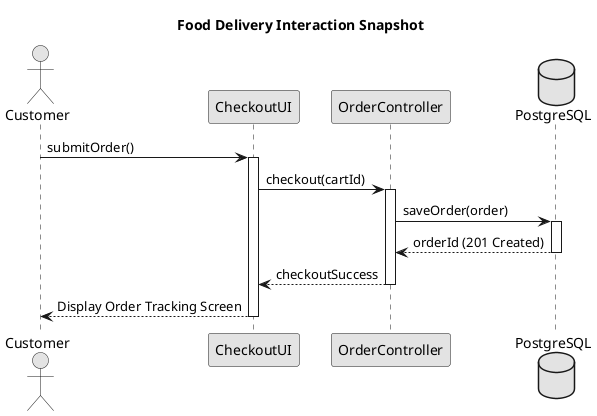

# Chapter 4: System Modeling & Unified Architecture

**Lecture Outline & Key Concepts**
> * **4.1 Foundations of System Modeling**: Why we model software, the limits of natural language, the Blind Men and an Elephant metaphor, and the 4 fundamental modeling perspectives (External, Interaction, Structural, and Behavioral).
> * **4.2 The Unified Modeling Language (UML) & Unified Process**: Historical evolution from the 1990s 'Method Wars', the Three Amigos (Grady Booch, Jim Rumbaugh, Ivar Jacobson), the OMG standard, the 14 UML 2.5 diagrams, and the principles of architecture-centric, use-case-driven iterative design.
> * **4.3 Functional & Use Case Models**: High-level system boundary definition, actors vs. stakeholders, active-verb naming semantics, the Relationship Matrix (`<<include>>` mandatory sub-processes vs. `<<extend>>` conditional extension points vs. actor generalization), safe nesting limits, University Enrollment case study, the standard 10-field tabular Use Case Description, seven deadly modeling sins, and AI prompt engineering for use-case synthesis.
> * **4.4 Structural & Class Models**: The 3-compartment class anatomy (Name, Attributes, Operations), visibility specifiers (`+`, `-`, `#`, `~`), parameter directionality, the Taxonomy of Relationships (Association, Aggregation, Composition, Generalization, Dependency), navigability and multiplicity constraints, association classes, the Food Delivery Domain Model case study, expert checklists, and AI prompt engineering for domain class models.
> * **4.5 Interaction & Sequence Diagrams**: Modeling runtime object collaboration across time, 2D canvas (horizontal participants vs. vertical lifelines), activation focus bars, the 5 messaging types (Synchronous, Asynchronous, Return, Create, Destroy), Combined Fragments (`alt`, `opt`, `loop`, `par`), Hotel Reservation case study, the Boundary-Control-Entity (BCE) architectural pattern, and AI prompt engineering for sequence orchestration.
> * **4.6 Process & Activity Diagrams**: Modeling procedural workflows and token flows, initial/final nodes, actions, Object Flows and state pins, deep dive into Fork/Join (parallel concurrency synchronization) vs. Decision/Merge (Boolean mutually exclusive branching), Swimlanes/Partitions across organizational roles, interruptible activity regions and exception handling, Food Delivery Fulfillment case study, and AI prompt engineering for business workflows.
> * **4.7 Behavioral & State Machine Models**: State-dependent behavior (same event, different results), the 4 transition triggers (Signal, Call, Time, Change), transition syntax (`Trigger [Guard] / Effect`), Actions (instantaneous, atomic) vs. Activities (ongoing, interruptible), `entry/` and `exit/` mechanics, Composite States and Shallow/Deep History pseudostates (`H`, `H*`), orthogonal concurrency regions, HVAC & Food Delivery Order Lifecycle case study, and AI prompt engineering for state machines.
> * **4.8 Text-Based Architecture Modeling with PlantUML**: The Architecture-as-Code paradigm, overcoming GUI drag-and-drop bottlenecks, Git version control and PR diffing, core syntax matrix across all 5 UML diagram types, skinparam styling, holistic architecture synthesis, and modern Generative AI workflows.
> * **4.9 Model Selection, Review Quiz & References**: Comprehensive 6-model decision matrix, 10 conceptual review questions, and foundational literature.
> * **Appendix: Solutions & Detailed Explanations to All 8 Interactive Concept Checks (CCQ 1–8)**.

---

## 4.1 Foundations of System Modeling

In software engineering, constructing a modern, multi-tier system without an architectural model is akin to erecting a forty-story skyscraper without blueprints. While natural language requirements (such as user stories and business paragraphs) capture human intentions, they suffer from unavoidable ambiguity, linguistic inconsistency, and hidden cognitive gaps. System modeling provides the formal, graphical abstractions required to design, communicate, and verify software architectures before committing expensive development resources.

### 4.1.1 What is a Model?
A **model** is an abstraction of a system that emphasizes relevant architectural details while intentionally suppressing non-essential complexities. Just as an electrical engineer relies on schematic circuit diagrams rather than microscopic physical wire scans, a software engineer relies on architectural diagrams to reason about component interactions, data dependencies, and state lifecycles.

```text
+-------------------------------------------------------------+
|                  THE ROLE OF SYSTEM MODELS                  |
+-------------------------------------------------------------+
|  [Ambiguous Business Needs]                                 |
|  * Unstructured text, implicit assumptions, stakeholder gap |
|                           │                                 |
|                           ▼                                 |
|  [System Architecture Models (UML)]                         |
|  * Clear system boundaries & precise object contracts       |
|  * Deterministic state paths & verifiable interactions      |
|                           │                                 |
|                           ▼                                 |
|  [Target Executable Code]                                   |
|  * TypeScript, Java, Go, Rust, Database Schemas & APIs      |
+-------------------------------------------------------------+
```

### 4.1.2 The Blind Men and an Elephant: Four Modeling Perspectives
No single diagram can capture the totality of a non-trivial software system. Attempting to force database schema, network protocols, user interactions, and UI workflows into a single visual diagram results in unreadable architectural chaos. Instead, software engineers view the system through **four distinct, orthogonal perspectives**:


*Figure 4.1.1: The Blind Men and the Elephant Metaphor. Just as each observer experiences only one facet of the elephant, each UML diagram captures a specific perspective of the system architecture.*

1. **External Perspective (Context & Boundaries):** Models the system in its environment, establishing the perimeter boundary separating internal software responsibilities from external human users, IoT hardware, and third-party SaaS APIs.
2. **Interaction Perspective (Dynamic Collaborations):** Models how external actors communicate with the system, and how internal components pass runtime messages across memory boundaries and network sockets over time.
3. **Structural Perspective (Static Organization):** Models the static layout of domain entities, class inheritance hierarchies, interfaces, data attributes, and relational associations independent of execution time.
4. **Behavioral Perspective (State & Event Dynamics):** Models how the system responds to internal and external events, capturing dynamic state lifecycles, concurrency, and conditional workflow branches.

---

<!-- id: ase-ch04-ccq1 -->
#### 🙋 **Concept Check (CCQ 1) — Four System Modeling Perspectives**

**Question**

A software architect wants to define **how domain entity data is structured and how classes inherit and associate with each other**, completely independent of runtime execution order. Which modeling perspective should the architect adopt?

- A. External Perspective
- B. Interaction Perspective
- C. Structural Perspective
- D. Behavioral Perspective

[Interactive Activity (線上作答)](https://nlhsueh.github.io/nickedupocket/#/student/ase-ch04-ccq1)

<a href="https://nlhsueh.github.io/nickedupocket/#/student/ase-ch04-ccq1" target="_blank"></a>

<details>
<summary>Click to view Answer & Explanation</summary>

**Correct Answer**: C
**Explanation**: Structural models capture the static organization of data, classes, attributes, and relationships independent of execution timing. (External models environment/boundaries; Interaction models message exchanges over time; Behavioral models dynamic state transitions and workflows).
</details>

---

## 4.2 The Unified Modeling Language (UML) & Unified Process

Before the mid-1990s, the software industry suffered through what historians call the **'Method Wars'**. Dozens of competing object-oriented notations existed—most notably Grady Booch's Booch Method, Jim Rumbaugh's Object Modeling Technique (OMT), and Ivar Jacobson's Object-Oriented Software Engineering (OOSE). Each methodology had its own proprietary notation for classes, associations, and inheritance, forcing engineers to relearn diagram syntax across employers and projects.

### 4.2.1 The Three Amigos and the Birth of UML
In 1994, Rational Software brought together the three leading pioneers—**Grady Booch**, **James Rumbaugh**, and **Ivar Jacobson**, affectionately known across the engineering world as **The Three Amigos**.

| Pioneer | Original Method | Core Contribution to UML |
| :--- | :--- | :--- |
| **Grady Booch** | Booch Method | Object design, macro-level structural architecture |
| **James Rumbaugh** | OMT (Object Modeling Technique) | Rich static relationships, statecharts, data analysis |
| **Ivar Jacobson** | OOSE (Object-Oriented Software Eng.) | Use Cases (1986), actor goals, user-driven requirements |

By synthesizing the best elements of their respective notations, the Three Amigos published UML 1.0 in 1997, which was subsequently adopted by the **Object Management Group (OMG)** as an open international standard (ISO/IEC 19505).

### 4.2.2 The 14 UML Diagrams: Structure vs. Behavior
UML 2.5 defines 14 official diagram types divided symmetrically into two overarching taxonomic branches:

| Classification Branch | UML 2.5 Diagram Types | Primary Architectural Focus |
| :--- | :--- | :--- |
| **Structure Diagrams** *(Static View)* | • **Class Diagram** (Core)<br>• Object Diagram<br>• Component Diagram<br>• Deployment Diagram<br>• Package Diagram<br>• Composite Structure<br>• Profile Diagram | Static organization of classes, interfaces, modules, namespaces, and runtime hardware nodes. |
| **Behavior Diagrams** *(Dynamic View)* | • **Use Case Diagram** (Scope & Actors)<br>• **Activity Diagram** (Workflow & Logic)<br>• **State Machine Diagram** (Lifecycles) | Dynamic execution flow, user business goals, operational processes, and reactive state transitions. |
| **Interaction Diagrams** *(Behavioral Sub-branch)* | • **Sequence Diagram** (Timing & Calls)<br>• Communication Diagram<br>• Timing Diagram<br>• Interaction Overview | Inter-object message exchanges over time, invocation protocols, and distributed call chains. |

> 📌 **Engineering Pragmatism (The 80/20 Rule)**: In modern enterprise software development, five core diagram types deliver over 80% of architectural value: **Use Case Diagrams**, **Class Diagrams**, **Sequence Diagrams**, **Activity Diagrams**, and **State Machine Diagrams**.

---

<!-- id: ase-ch04-ccq2 -->
#### 🙋 **Concept Check (CCQ 2) — UML Pioneers & The Three Amigos**

**Question**

Which of the "Three Amigos" was specifically renowned for inventing **Use Cases (1986)** to anchor software architecture to tangible user goals?

- A. Grady Booch
- B. James Rumbaugh
- C. Ivar Jacobson
- D. Martin Fowler

[Interactive Activity (線上作答)](https://nlhsueh.github.io/nickedupocket/#/student/ase-ch04-ccq2)

<a href="https://nlhsueh.github.io/nickedupocket/#/student/ase-ch04-ccq2" target="_blank"></a>

<details>
<summary>Click to view Answer & Explanation</summary>

**Correct Answer**: C
**Explanation**: Ivar Jacobson pioneered Object-Oriented Software Engineering (OOSE) and invented Use Cases in 1986. Grady Booch was renowned for the Booch Method (object design and macroscopic architecture), while Jim Rumbaugh developed OMT (Object Modeling Technique, emphasizing rich object relationship modeling).
</details>

---

## 4.3 Functional & Use Case Models

Use case modeling is the primary technique for establishing the functional scope of a software system. Invented by Ivar Jacobson, use cases shift the focus from internal algorithmic mechanics to the concrete business goals of external users.

### 4.3.1 Visual Anatomy of a Use Case Diagram


*Figure 4.3.1: The Anatomy of Use-Case Diagram Modeling. The diagram clearly separates external actors from internal system capabilities bounded by the system perimeter.*

A standard UML Use Case Diagram comprises four foundational visual elements:
1. **System Boundary (Rectangle):** A labeled box demarcating what is inside the software system (scope of development) versus what resides in the external environment.
2. **Actors (Stick Figures):** Entities outside the system that interact with it. Actors can be human users, hardware devices, or external cloud services.
3. **Use Cases (Ovals):** Discrete, goal-oriented sequences of interactions that yield an observable result of measurable value to an actor.
4. **Association Lines (Solid Lines):** Communication paths connecting actors to the use cases they participate in or trigger.

### 4.3.2 User Goals vs. Technical Decomposition


*Figure 4.3.2: User Goals vs. Technical Steps. Use cases must represent complete user goals yielding business value, not fine-grained UI clicks or CRUD sub-operations.*

A widespread anti-pattern among novice modelers is treating use cases as flowcharts or individual GUI clicks (e.g., creating separate use cases for "Enter Username", "Validate Password", "Click Submit"). 

In professional engineering:
* **Anti-Pattern (Functional Decomposition):** Creating separate use case ovals for "Input Credit Card Number", "Check Expiration Date", "Query Card Balance".
* **Best Practice (Business Goal):** Encapsulating the entire user goal in a single cohesive use case: **"Process Checkout Payment"**.

### 4.3.3 Actor Taxonomy: Primary, Supporting, and Automated


*Figure 4.3.3: Actor Taxonomy. Classifying actors based on who initiates value versus who provides supporting services.*

Actors are categorized based on their architectural role:
* **Primary Actors:** The principal initiators who trigger use cases to achieve a business goal (e.g., *Customer*, *Student*, *Doctor*). They are positioned on the **left** side of the boundary.
* **Secondary / Supporting Actors:** External systems or personnel that provide services to the system to help fulfill the primary actor's goal (e.g., *Payment Gateway*, *SMS Service Provider*, *Identity Provider*). They are positioned on the **right** side of the boundary.
* **Automated / Time Triggers:** Internal timers or schedulers (e.g., *Cron Daemon*, *Billing Timer*) modeled as specialized actors triggering periodic batch operations.

### 4.3.4 The Relationship Matrix: Include, Extend, and Generalization


*Figure 4.3.4: The Use Case Relationship Matrix. Defining the strict semantic rules governing associations, <<include>>, <<extend>>, and generalization.*

| Relationship | Visual Syntax | Arrow Direction | Architectural Meaning |
| :--- | :--- | :--- | :--- |
| **Association** | Solid Line `───` | None / Open | Communication connection between Actor & Use Case. |
| **`<<include>>`** | Dashed Arrow `- - - >` | Base → Target | **Mandatory shared logic.** Base cannot complete execution without Target. |
| **`<<extend>>`** | Dashed Arrow `- - - >` | Extension → Base | **Optional / conditional logic.** Executed only if Extension Point condition is met. |
| **Generalization** | Solid + Hollow Triangle `───▷` | Sub-type → Super-type | **Inheritance.** Sub-actor or specialized use case inherits behavior of Super-type. |

#### Safe Nesting Limits (Avoiding Over-Engineering)


*Figure 4.3.5: Safe Nesting Limits. Avoid deep hierarchical chains of <<include>> and <<extend>>. Limit nesting to at most 1–2 levels to preserve architectural clarity.*

### 4.3.5 Case Study: University Enrollment System


*Figure 4.3.6: University Course Enrollment Use Case Model. Demonstrating primary actors (Student), secondary supporting systems (Course Catalog DB, Billing Service), <<include>> relationships for mandatory prerequisites, and <<extend>> for waiting list placement.*

#### Standard Tabular Use Case Description: "Enroll Student in Course"

| Specification Field | Engineering Contract & Scenario Details |
| :--- | :--- |
| **Use Case ID & Name** | **UC-04: Enroll Student in Course** |
| **Primary Actor** | Student (Undergraduate or Graduate) |
| **Stakeholders & Goals** | • **Student**: Register for degree-required course section before quota fills.<br>• **Registrar**: Ensure capacity limits and academic prerequisite rules hold.<br>• **Academic Dept**: Maintain balanced classroom seat distribution. |
| **Preconditions** | 1. Student is authenticated and in good academic standing.<br>2. Course enrollment registration window is open. |
| **Success Guarantee** | Student is formally enrolled on official roster, seat quota decremented by 1, tuition charge generated. |
| **Trigger** | Student clicks "Confirm Course Enrollment" button in the web/mobile portal. |
| **Main Success Scenario**<br>*(Happy Path)* | 1. Student browses open course sections in catalog.<br>2. Student selects desired section and submits enrollment request.<br>3. System verifies student satisfies all prerequisite course requirements.<br>4. System checks available seat quota in the section.<br>5. System reserves seat and updates course roster.<br>6. System notifies Billing Service to add tuition charge.<br>7. System displays enrollment confirmation receipt with timestamp. |
| **Extensions**<br>*(Alternative & Exceptions)* | **3a. Prerequisite check fails:**<br>&nbsp;&nbsp;1. System displays missing prerequisite course codes.<br>&nbsp;&nbsp;2. System offers link to submit Prerequisite Waiver.<br>&nbsp;&nbsp;3. Use case terminates without enrollment.<br>**4a. Section is full (Quota = 0):**<br>&nbsp;&nbsp;1. System alerts student that section is currently full.<br>&nbsp;&nbsp;2. System triggers `<<extend>>` UC-05: Join Waiting List.<br>&nbsp;&nbsp;3. If student agrees, student added to priority queue.<br>**6a. Billing Service offline:**<br>&nbsp;&nbsp;1. System queues billing event in transactional outbox.<br>&nbsp;&nbsp;2. System completes enrollment and logs audit warning. |

### 4.3.6 Seven Deadly Sins of Use Case Modeling


*Figure 4.3.7: Common Anti-Patterns. Avoiding functional decomposition, missing boundaries, reversed extend arrows, and mixing UI implementation details.*

1. **Reversed Arrowheads:** Pointing `<<extend>>` from the base use case to the extension. Remember: the base use case should be completely unaware of the extension!
2. **Functional Decomposition Trap:** Treating use case diagrams as flowcharts by breaking an operation into tiny procedural pieces.
3. **Missing System Boundaries:** Leaving ovals floating without a boundary box, making it impossible to determine scope.
4. **Actors Inside the Boundary:** Placing external systems or users inside the box.
5. **Overusing Generalization:** Creating complex inheritance trees for use cases instead of simple parameter variations.
6. **Modeling UI Clicks:** Writing "Click Submit Button" instead of "Confirm Order".
7. **Orphan Use Cases:** Creating use cases that connect to no actors whatsoever.

### 4.3.7 Generative AI Assistance for Use Case Modeling
Modern LLMs can rapidly synthesize use case models from raw client transcripts when prompted with strict boundary constraints:

```text
[System Role: Lead Software Architect & Requirements Engineer]
Task: Analyze the following requirements and produce:
1. PlantUML Use Case Diagram markup adhering strictly
   to UML 2.5 standards.
2. Structured tabular Use Case Description for the
   primary happy path.

Rules & Semantic Constraints:
- Delineate boundary with 'rectangle "Food Delivery" { ... }'.
- Place Primary Actors on left, Secondary Actors on right.
- Use strict <<include>> for mandatory sub-routines and
  <<extend>> for optional paths.
- Naming format: Active transitive verb + concrete domain noun.

Requirement Text:
"A customer browses restaurants, adds food items to cart,
and proceeds to checkout. During checkout, the customer
must authorize payment through a third-party gateway.
Optionally, the customer may apply a promo voucher code
or request contact-free dropoff. Kitchen staff accept orders
and update cooking status. Couriers accept delivery runs."
```

---

<!-- id: ase-ch04-ccq3 -->
#### 🙋 **Concept Check (CCQ 3) — Use Case Relationships: Include vs. Extend**

**Question**

In our Food Delivery Use Case Model, why does `Apply Promo Voucher` point to `Place Food Order` with `<<extend>>`, while `Place Food Order` points to `Process Payment` with `<<include>>`?

- A. Voucher application is mandatory for all orders; payment is optional.
- B. Vouchers are conditional optional behavior; payment is mandatory shared execution.
- C. Vouchers are executed by supporting actors; payment is executed by primary actors.
- D. Vouchers represent class inheritance; payment represents object composition.

[Interactive Activity (線上作答)](https://nlhsueh.github.io/nickedupocket/#/student/ase-ch04-ccq3)

<a href="https://nlhsueh.github.io/nickedupocket/#/student/ase-ch04-ccq3" target="_blank"></a>

<details>
<summary>Click to view Answer & Explanation</summary>

**Correct Answer**: B
**Explanation**: In UML use cases, `<<include>>` denotes mandatory sub-routines that must always execute to complete the base case (an order cannot be placed without payment authorization). In contrast, `<<extend>>` denotes optional, conditional behavior that injects into extension points only when triggered (customers choose whether to enter a voucher code).
</details>

---

## 4.4 Structural & Class Models

While use case models capture external business interactions, **Class Diagrams** form the static architectural backbone of object-oriented systems. They define the vocabulary of the problem domain, map database entities, and establish compile-time contracts between collaborating modules.

### 4.4.1 Anatomy of a Class: The Three Compartments


*Figure 4.4.1: The Anatomy of UML Class Diagrams. A class box consists of three distinct compartments: Class Name, Attributes, and Operations.*


*Figure 4.4.2: Internal Class Box Structure. Demonstrating attribute type annotations, default initializers, method signatures, parameter directionality, and visibility specifiers.*

Every standard UML class box is partitioned into three horizontal compartments:
1. **Top Compartment (Class Name):** Identifies the concept. Abstract class names are rendered in *italics* or decorated with `{abstract}`. Interfaces are styled with `<<interface>>`.
2. **Middle Compartment (Attributes):** Defines data state fields using the standard syntax:
   `[visibility] name : type [multiplicity] [= default] [{property-modifiers}]`
   *(Example: `- balance: Money = 0.00 {readOnly}`)*
3. **Bottom Compartment (Operations / Methods):** Defines behavior contracts using the standard syntax:
   `[visibility] name ( [direction] paramName : paramType , ... ) : returnType`
   *(Example: `+ processPayment(in amount: Decimal, in token: String): PaymentResult`)*

### 4.4.2 Visibility Specifiers and Information Hiding


*Figure 4.4.3: Visibility Specifier Matrix. Contrasting public (+), private (-), protected (#), and package (~) access levels across object boundaries.*

| Symbol | Visibility | OOP Equivalent | Architectural Scope |
| :---: | :--- | :--- | :--- |
| **`+`** | **Public** | `public` | Accessible by any external class in the system. |
| **`-`** | **Private** | `private` | Encapsulated strictly inside the declaring class. |
| **`#`** | **Protected** | `protected` | Accessible by declaring class and its sub-classes. |
| **`~`** | **Package** | `default` (package-private) | Accessible only by classes within the same package. |

### 4.4.3 Taxonomy of Class Relationships


*Figure 4.4.4: Taxonomy of Class Relationships. Showing the hierarchy from loose, transient dependencies to tight, permanent lifecycle bindings.*


*Figure 4.4.5: UML Connector Cheat Sheet. Standard line styles and endpoint ornaments for association, aggregation, composition, generalization, realization, and dependency.*

| Relationship | Visual Notation | Coupling Level | Lifecycle & Architectural Dependency |
| :--- | :--- | :--- | :--- |
| **Dependency** | Dashed arrow `- - - >` | Weak / Transient | Temporary usage via method parameter, local variable, or return type. |
| **Association** | Solid line `──────` | Moderate / Peer | Structural reference via long-lived instance field. |
| **Aggregation** | Hollow diamond `──────◇` | Moderate / Shared | **Weak ownership.** Child parts can survive independently if container is deleted. |
| **Composition** | Filled diamond `──────◆` | Strong / Exclusive | **Strict ownership.** Child parts are permanently destroyed when parent is destroyed. |
| **Generalization** | Solid + Hollow triangle `──▷` | Inheritance (`is-a`) | Sub-class inherits all attributes, methods, and relationships of super-class. |
| **Realization** | Dashed + Hollow triangle `- -▷` | Interface Contract | Concrete class implements the operations declared by an interface. |

#### Aggregation vs. Composition: The Lifecycle Ownership Test


*Figure 4.4.6: Aggregation vs. Composition. The definitive test is lifecycle dependency: if the container object is deleted, do the contained objects cease to exist?*

* **Composition (Filled Diamond ◆):** Implies exclusive, coincident ownership. A part belongs to *exactly one* whole at a time. If the container is destroyed, all its parts are destroyed.
  * *Example:* An `Order` owns its `OrderItem` line items. Deleting an order from the database cascade-deletes all its order items.
* **Aggregation (Hollow Diamond ◇):** Implies shared, non-exclusive ownership. Parts maintain an independent existence outside the container.
  * *Example:* An `Order` aggregates a `Courier`. If the order is completed or deleted, the courier continues to exist and takes another delivery run.

### 4.4.4 Multiplicity Constraints and Navigability


*Figure 4.4.7: Multiplicity Constraints and Navigability. Specifying lower and upper bounds (1, *, 0..1, 1..*) on relationship endpoints.*

Multiplicity specifies how many instances of class B can be associated with a single instance of class A:
* `1`: Exactly one (mandatory).
* `0..1`: Zero or one (optional / nullable pointer).
* `*` or `0..*`: Zero or more (unbounded collection / list / set).
* `1..*`: One or more (non-empty collection).
* `m..n`: Specific numeric range (e.g., `2..4`).

### 4.4.5 Case Study: Food Delivery Platform Domain Model


*Figure 4.4.8: Food Delivery Domain Model Case Study. Demonstrating Customer, Order, OrderItem, MenuItem, Restaurant, Courier, and Payment entities with proper multiplicity and lifecycle semantics.*

In this enterprise domain model:
1. `Customer` has a `1 ─── *` association with `Order` (a customer can place multiple historical orders).
2. `Order` has a `1 ◆─── 1..*` composition with `OrderItem` (an order must contain at least one item, and items cannot exist without an order).
3. `OrderItem` has a `* ─── 1` association with `MenuItem` (many order items reference the same catalog menu item).
4. `Order` has a `* ───◇ 0..1` aggregation with `Courier` (an order is assigned to at most one courier during transit).
5. `Order` has a `1 ─── 1` association with `Payment` (each order has an associated transaction record).

### 4.4.6 Generative AI Assistance for Class Modeling
When using LLMs to synthesize class models from requirements, provide explicit relationship constraints:

```text
[System Role: Senior Systems Architect]
Task: Synthesize a PlantUML Class Diagram for Food Delivery.

Design Constraints:
- 3 compartments: Name, Attributes with visibility & types,
  Operations with return types.
- Explicitly apply composition (*--) where lifecycle
  ownership is exclusive.
- Explicitly apply aggregation (o--) where referenced entities
  maintain independent lifecycles.
- Mark multiplicity bounds ('1', '0..1', '1..*') on all ends.
- Apply inheritance (--|>) where specialized entity subtypes
  exist (e.g., CreditCardPayment vs CashPayment).
```

---

<!-- id: ase-ch04-ccq4 -->
#### 🙋 **Concept Check (CCQ 4) — Class Model Relationships: Composition vs. Aggregation**

**Question**

In our Food Delivery Class Diagram, why is the relationship between `Order` and `OrderItem` modeled as **Composition (◆)**, whereas `Order` and `Courier` is modeled as **Aggregation (◇)**?

- A. An `OrderItem` can exist independently, but a `Courier` cannot exist without an `Order`.
- B. An `OrderItem` is destroyed with its parent `Order`, whereas a `Courier` maintains an independent lifecycle.
- C. Composition represents inheritance between classes, while aggregation represents method invocation.
- D. Composition requires zero-to-one multiplicity, while aggregation requires one-to-many multiplicity.

[Interactive Activity (線上作答)](https://nlhsueh.github.io/nickedupocket/#/student/ase-ch04-ccq4)

<a href="https://nlhsueh.github.io/nickedupocket/#/student/ase-ch04-ccq4" target="_blank"></a>

<details>
<summary>Click to view Answer & Explanation</summary>

**Correct Answer**: B
**Explanation**: Composition (filled diamond ◆) represents strong part-whole ownership where parts cannot exist without the whole; if an `Order` is deleted, its individual `OrderItem` line records have no independent meaning and are destroyed. Aggregation (hollow diamond ◇) represents a shared association where parts maintain independent lifecycles (a `Courier` exists before and after delivering an order).
</details>

---

## 4.5 Interaction & Sequence Diagrams

While class diagrams reveal what classes *can* communicate, **Sequence Diagrams** illustrate *how* runtime object instances actually collaborate over time to fulfill a specific user story or algorithmic transaction.

### 4.5.1 The 2D Canvas: Participants vs. Descending Time


*Figure 4.5.1: Dynamic Interaction Overview. Contrasting static class structures with dynamic, time-ordered runtime message exchanges.*


*Figure 4.5.2: The Two-Dimensional Interaction Canvas. The horizontal axis organizes participating object lifelines; the vertical axis represents the irreversible passage of time descending downwards.*

A sequence diagram organizes runtime interactions across two distinct dimensions:
* **Horizontal Axis (Collaborating Participants):** Each participant is represented at the top by a box labeled `instanceName : ClassName`. Extending downwards is a dashed vertical line known as the **Lifeline**.
* **Vertical Axis (Time):** Time flows strictly **top-to-bottom**. Messages placed lower down occur chronologically later.

### 4.5.2 Lifelines, Activation Bars, and Message Types


*Figure 4.5.3: Lifelines and Activation Focus. The thin vertical rectangle on a lifeline represents the period during which an object is actively executing code or awaiting a subroutine return.*


*Figure 4.5.4: UML Sequence Messaging Matrix. Visual syntax and execution semantics for synchronous calls, asynchronous signals, return replies, and object creation/destruction.*

| Message Type | Visual Notation | Execution Semantics |
| :--- | :--- | :--- |
| **Synchronous Call** | Solid line + filled arrow `───►` | **Blocking.** Caller pauses and waits until the callee finishes execution and returns. |
| **Asynchronous Signal** | Solid line + open arrow `───>` | **Non-blocking.** Caller dispatches message (e.g. Kafka/queue) and continues immediately. |
| **Return Message** | Dashed line + open arrow `◄- - -` | Optional explicit return of control and calculation data back to the caller. |
| **Create Message** | Dashed arrow to target box `- - -►` | Instantiates a new runtime object (`new Order()`). Target box drawn at message arrival. |
| **Destroy Message** | Large `X` at end of lifeline | Explicit deallocation / garbage collection termination of the runtime instance. |

### 4.5.3 Combined Fragments: Modeling Complex Control Flow


*Figure 4.5.5: Combined Fragments Overview. Framing complex logic (branching, loops, concurrency) using standardized UML operator boxes.*


*Figure 4.5.6: Mapping Combined Fragments to Code Constructs. alt maps to if-else; opt maps to a single if; loop maps to for/while; par maps to multi-threaded execution.*

| Operator | Programming Construct | Architectural Meaning |
| :---: | :--- | :--- |
| **`alt`** | `if (...) { ... } else { ... }` | **Mutually exclusive alternatives.** Only one sub-frame executes based on guard condition. |
| **`opt`** | `if (...) { ... }` *(no else)* | **Optional execution.** Executes if guard condition is true; skipped entirely if false. |
| **`loop`** | `for / while` `loop(min, max)` | **Repetitive execution.** Repeats while condition holds or within specified bounds. |
| **`par`** | `Thread / Promise.all()` | **Parallel concurrent execution.** Sub-frames execute simultaneously across threads. |

### 4.5.4 The BCE (Boundary-Control-Entity) Pattern


*Figure 4.5.7: The BCE Architecture Pipeline. Ensuring robust separation of concerns by routing incoming UI events through dedicated Control orchestrators before touching persistent Entity data.*

To prevent sequence diagrams from turning into tightly coupled spaghetti, professional engineers apply the **Boundary-Control-Entity (BCE)** pattern:
* **Boundary (`<<boundary>>`):** Manages communication with external actors (e.g., `CheckoutUI`, `StripePaymentAPI`, `RESTOrderRouter`). Boundaries never contain core business logic.
* **Control (`<<control>>`):** Orchestrates business workflows and transaction boundaries (e.g., `OrderCheckoutController`, `DispatchCoordinator`). Control objects coordinate entities and call boundary adapters.
* **Entity (`<<entity>>`):** Encapsulates persistent business state and domain rules (e.g., `Order`, `Customer`, `OrderItem`). Entities never communicate directly with UI boundaries.

### 4.5.5 Case Study: Food Delivery Checkout Sequence Flow
1. **User Action:** Customer clicks `submitOrder()` on `CheckoutUI` (Boundary).
2. **Controller Orchestration:** `CheckoutUI` dispatches `checkout(cartId)` to `OrderController` (Control).
3. **Domain Validation:** `OrderController` calls `validateStock()` on `RestaurantCatalog` (Entity).
4. **Third-Party Payment:** `OrderController` invokes synchronous `authorizePayment(amount)` on `PaymentGatewayAPI` (Boundary).
5. **Alternative Branching (`alt`):**
   * `[paymentApproved]`: `OrderController` creates `new Order()` (Entity), updates database state, and asynchronously fires `publishOrderPlaced()` to message broker.
   * `[else / paymentFailed]`: `OrderController` returns error message back to UI; transaction rolled back.

---

<!-- id: ase-ch04-ccq5 -->
#### 🙋 **Concept Check (CCQ 5) — BCE Architecture & Sequence Message Dispatch**

**Question**

In a Boundary-Control-Entity (BCE) sequence diagram, which object should receive the customer's `submitOrder()` event from the checkout UI boundary?

- A. The `Order` entity object to immediately save database state.
- B. The `PaymentGatewayAPI` boundary object to process payment immediately.
- C. The `OrderController` control object to orchestrate business validation and service calls.
- D. The `Restaurant` entity object to confirm kitchen capacity.

[Interactive Activity (線上作答)](https://nlhsueh.github.io/nickedupocket/#/student/ase-ch04-ccq5)

<a href="https://nlhsueh.github.io/nickedupocket/#/student/ase-ch04-ccq5" target="_blank"></a>

<details>
<summary>Click to view Answer & Explanation</summary>

**Correct Answer**: C
**Explanation**: BCE pattern dictates strict separation of concerns: Boundary objects (UI/API) delegate incoming user events to Control objects (`OrderController`), which orchestrate business logic, coordinate Entity objects (`Order`), and call external Boundaries (`PaymentGateway`). Boundaries must never directly manipulate Entities or bypass Control.
</details>

---

## 4.6 Process & Activity Diagrams

While sequence diagrams excel at tracing messages between specific object instances, **Activity Diagrams** model procedural workflows, business logic, and concurrent token flows across an entire organization or system.

### 4.6.1 Activity Diagrams vs. Traditional Flowcharts


*Figure 4.6.1: Visual Logic in Activity Modeling. Activity diagrams extend traditional flowcharts with Petri-net token semantics, parallel fork/join execution, and object state flow.*

| Characteristic | Traditional Flowchart | UML Activity Diagram |
| :--- | :--- | :--- |
| **Concurrency Support** | None (Strictly single-threaded sequential flow). | **Native Fork/Join bars** for multi-threaded and asynchronous parallel workflows. |
| **Organizational Roles** | None (All steps share a single global canvas). | **Swimlanes / Partitions** assign actions explicitly to specific actors, departments, or services. |
| **Data & Object Flow** | Bare I/O parallelograms with informal text. | **Explicit Object Nodes** and state pins indicating state changes (`[Paid]`, `[Prepared]`). |
| **Execution Semantics** | Informal directional lines. | **Formal Petri-Net Token Semantics** with deterministic join synchronization rules. |

### 4.6.2 Core Syntax: Actions, Decision/Merge, and Fork/Join


*Figure 4.6.2: Core Activity Diagram Nodes. Illustrating Initial node, Action states, Decision/Merge diamonds, and Activity Final nodes.*


*Figure 4.6.3: Concurrency Synchronization with Fork and Join. A Fork node splits a single incoming token into multiple parallel concurrent flows; a Join node synchronizes them back into one.*

#### Critical Distinction: Fork/Join vs. Decision/Merge
* **Decision / Merge (Diamond ♢):** Models **conditional branching**. An incoming token is routed along *exactly one* outgoing branch whose Boolean guard condition evaluates to true (`[stockAvailable]` vs `[outOfStock]`).
* **Fork / Join (Solid Bar ❚):** Models **parallel concurrency**. An incoming token is split into *all* outgoing branches simultaneously. Execution progresses along all parallel threads, and the Join bar blocks until *every* incoming thread has arrived.

### 4.6.3 Swimlanes (Partitions) and Object Flows


*Figure 4.6.4: Swimlanes and Partitions. Columnar divisions allocating responsibility for specific actions to distinct business roles or architectural subsystems.*

Swimlanes partition activities into vertical or horizontal columns:
* **Customer Lane:** `Browse Menu` → `Submit Order` → `Eat Meal`.
* **Restaurant Lane:** `Receive Order Ticket` → `Cook Meal` → `Package Food`.
* **Delivery Lane:** `Accept Dispatch Run` → `Pickup from Restaurant` → `Deliver to Doorstep`.

### 4.6.4 Object Nodes and Stateful Data Flows


*Figure 4.6.5: Object Flows and State Pins. Modeling how business objects change state as they pass between activity actions.*

Rather than only showing control arrows, activity diagrams incorporate **Object Nodes** (rectangles displaying `Class [State]`) to illustrate data transformations:
`[Order Placed]` ──► **Prepare Food** ──► `[Meal Cooked]` ──► **Package Food** ──► `[Meal Ready for Pickup]`.

---

<!-- id: ase-ch04-ccq6 -->
#### 🙋 **Concept Check (CCQ 6) — Activity Diagram Fork/Join vs. Decision/Merge**

**Question**

In a UML Activity Diagram, what is the critical behavioral difference between a **Fork/Join** synchronization bar and a **Decision/Merge** diamond?

- A. Fork/Join splits and synchronizes concurrent parallel threads; Decision/Merge evaluates guards to pick exactly one mutually exclusive branch.
- B. Fork/Join is used for sequential database transactions; Decision/Merge is used for swimlane partitioning.
- C. Fork/Join models class inheritance; Decision/Merge models object creation.
- D. Fork/Join requires human operator approval; Decision/Merge is executed by automated timers.

[Interactive Activity (線上作答)](https://nlhsueh.github.io/nickedupocket/#/student/ase-ch04-ccq6)

<a href="https://nlhsueh.github.io/nickedupocket/#/student/ase-ch04-ccq6" target="_blank"></a>

<details>
<summary>Click to view Answer & Explanation</summary>

**Correct Answer**: A
**Explanation**: A Fork node splits a single control flow into two or more concurrent, parallel execution paths (both occur at the same time), and Join synchronizes them back together. A Decision diamond evaluates Boolean guard conditions `[condition]` to select exactly one alternative execution branch out of multiple mutually exclusive paths.
</details>

---

## 4.7 Behavioral & State Machine Models

Many software components (such as order fulfillment workflows, IoT thermostats, network connections, and shopping carts) are inherently **state-dependent**. A state machine model captures the complete dynamic lifecycle of a single entity.

### 4.7.1 Same Event, Different Results


*Figure 4.7.1: Anatomy of State-Dependent Behavior. An object's response to an incoming event depends fundamentally on its current internal state.*


*Figure 4.7.2: Same Event, Different Results. Illustrating how submitting payment produces success in the 'Draft' state, but raises an error in the 'Already Paid' state.*

Consider an e-commerce `Order` object receiving the event `cancel()`:
* If the order is in the `PaymentPending` state: The order is immediately cancelled and marked `Cancelled`.
* If the order is in the `InTransit` state: Cancellation is rejected; a courier cannot abandon food mid-highway.
* **The fundamental insight:** The behavior of an entity is governed not just by the incoming method call, but by its **current lifecycle state**.

### 4.7.2 Transition Syntax and Mechanics


*Figure 4.7.3: Transition Syntax. The 5-element transition formula: Trigger [Guard] / Effect.*

A UML state transition connects a source state to a target state using the formal syntax:
```
Trigger [Guard] / Effect
```
* **Trigger (Event):** What causes the transition (e.g., `cardSwiped`, `timerExpired`, `cancelRequested`).
* **Guard (Boolean Condition):** A condition enclosed in square brackets `[balance >= total]` that must be true for the transition to fire.
* **Effect (Action):** An atomic, instantaneous procedure executed during the transition (e.g., `/ deductBalance()`).

### 4.7.3 Actions vs. Activities: Instantaneous vs. Ongoing


*Figure 4.7.4: Actions vs. Activities. Actions are instantaneous and atomic; Activities represent continuous, interruptible background work.*

| Architectural Dimension | Action (`entry /`, `exit /`, transition `/`) | Activity (`do / ...`) |
| :--- | :--- | :--- |
| **Time Duration** | **Zero (Conceptually instantaneous)** | Takes significant real-time duration |
| **Interruptibility** | **Non-interruptible (Atomic)** | **Interruptible**; immediately aborted if an outgoing transition triggers |
| **Execution Context** | Executes at entry, exit, or along transition line | Runs continuously in background while remaining inside state |

### 4.7.4 Composite States and History Pseudostates


*Figure 4.7.5: Composite States and History Pseudostates. Grouping sub-states into a composite parent prevents transition explosion and supports state restoration upon interruption.*

* **Composite (Nested) States:** Grouping related states within a parent container. Any transition attached to the parent container applies to all nested sub-states (e.g., hitting `EmergencyStop` transitions the entire machine to `Offline`, regardless of which sub-state was active).
* **Shallow History Pseudostate (`H`):** Remembers the most recently active direct sub-state.
* **Deep History Pseudostate (`H*`):** Recursively remembers the most active sub-state at any arbitrary nesting depth.

---

<!-- id: ase-ch04-ccq7 -->
#### 🙋 **Concept Check (CCQ 7) — State Machine Actions vs. Activities**

**Question**

In a UML State Machine, what is the critical architectural difference between an **Action** (such as `/ refundCharge()` or `entry / startTimer()`) and an **Activity** (`do / playAudio()`)?

- A. Actions are instantaneous, atomic, and non-interruptible; Activities are ongoing computations that take time and can be interrupted by incoming events.
- B. Actions are written in Python code; Activities are written in SQL queries.
- C. Actions only apply to class diagrams; Activities only apply to sequence diagrams.
- D. Actions represent manual human tasks; Activities are executed by database servers.

[Interactive Activity (線上作答)](https://nlhsueh.github.io/nickedupocket/#/student/ase-ch04-ccq7)

<a href="https://nlhsueh.github.io/nickedupocket/#/student/ase-ch04-ccq7" target="_blank"></a>

<details>
<summary>Click to view Answer & Explanation</summary>

**Correct Answer**: A
**Explanation**: In UML State Machine semantics, an Action (associated with transitions, `entry/`, or `exit/`) is conceptually instantaneous, atomic, and cannot be interrupted. An Activity (`do/ activity`) takes execution duration, represents ongoing background work, and is immediately aborted/interrupted if an external transition event occurs.
</details>

---

## 4.8 Text-Based Architecture Modeling with PlantUML

Historically, creating UML diagrams required heavy, proprietary GUI software (Rational Rose, Enterprise Architect, Microsoft Visio). These tools suffered from severe engineering bottlenecks: diagrams were stored in opaque binary blobs, could not be version-controlled in Git, and rapidly became obsolete as code evolved.

### 4.8.1 The "Architecture-as-Code" Paradigm


*Figure 4.8.1: PlantUML Code-Driven Architecture. Defining visual architecture as plain text source code integrated with Git version control.*


*Figure 4.8.2: Stop Dragging, Start Writing. Contrasting fragile GUI drawing with declarative text markup.*

| Evaluation Dimension | Traditional GUI Drag-and-Drop | PlantUML (Architecture as Code) |
| :--- | :--- | :--- |
| **Storage Format** | Proprietary binary blobs or complex XML | Clean, human-readable plain text (`.puml` / `.md`) |
| **Git Version Control** | Constant merge conflicts, impossible diffs | Standard Git branch tracking, readable line diffs, PR reviews |
| **CI/CD Integration** | Manual PNG/PDF screenshot export | Automated headless compilation to SVG/PNG in GitHub Actions |
| **LLM Synthesis** | Incompatible with text-based AI models | Native direct generation by Claude, GPT, and Gemini |

### 4.8.2 Cross-Diagram Syntax Matrix


*Figure 4.8.3: PlantUML Cross-Diagram Syntax Cheatsheet. Core keywords, arrow styles, and structural markers across all five UML models.*



---

<!-- id: ase-ch04-ccq8 -->
#### 🙋 **Concept Check (CCQ 8) — Engineering Advantages of Text-Based Modeling**

**Question**

What is the primary engineering advantage of using text-based diagramming tools like **PlantUML** over traditional proprietary GUI drawing software?

- A. PlantUML eliminates the need to understand software architecture and UML principles.
- B. Text markup can be version-controlled in Git, diffed in Pull Requests, and automated in CI/CD pipelines.
- C. PlantUML automatically generates full production databases and microservices without writing code.
- D. PlantUML is strictly limited to class diagrams and cannot model dynamic workflows.

[Interactive Activity (線上作答)](https://nlhsueh.github.io/nickedupocket/#/student/ase-ch04-ccq8)

<a href="https://nlhsueh.github.io/nickedupocket/#/student/ase-ch04-ccq8" target="_blank"></a>

<details>
<summary>Click to view Answer & Explanation</summary>

**Correct Answer**: B
**Explanation**: Text-based modeling ("Architecture-as-Code") represents diagrams in plain text, enabling automated Git version control, visual Pull Request diffing, CI/CD automated doc generation, and LLM-driven generative architecture synthesis without vendor lock-in.
</details>

---

## 4.9 Model Selection & Decision Framework

### 4.9.1 Architectural Decision Matrix

| Core Modeling Tool | Primary Architectural Question | Key Visual Syntax Elements | Best Engineering Application |
| :--- | :--- | :--- | :--- |
| **1. Use Case Diagram** | **WHAT** business value does the system provide to users? | System Boundary rectangle, Actors, Use Case ovals, `<<include>>`, `<<extend>>` | Defining project scope, contract boundaries, and stakeholder agreements. |
| **2. Class Diagram** | **WHAT** static entities, contracts, and associations exist? | 3-compartment boxes, Visibility (`+`, `-`, `#`), Multiplicity, Composition (`◆`), Aggregation (`◇`) | Domain modeling, database schema mapping, OOP class architecture. |
| **3. Sequence Diagram** | **HOW** do runtime objects collaborate over time? | Lifelines, Activation bars, Synchronous/Asynch calls, BCE roles, Combined fragments (`alt`, `loop`) | Tracing API transactions, microservice call graphs, and control orchestration. |
| **4. Activity Diagram** | **WHAT** is the multi-role operational workflow or algorithm? | Rounded Action nodes, Swimlane partitions, Decision/Merge diamonds, Fork/Join bars | Cross-department business processes, background job orchestration, concurrency. |
| **5. State Machine** | **HOW** does an entity change state in response to events? | Rounded state boxes, Triggers, Guards `[guard]`, Actions `/action`, Composite states, History `H` | Reactive protocols, IoT lifecycle states, order fulfillment tracking. |
| **6. PlantUML Markup** | **HOW** do we maintain models in Git without documentation rot? | Declarative text-to-diagram syntax (`@startuml ... @enduml`) | Architecture-as-Code, Git PR reviews, CI/CD automated documentation pipelines. |

### 4.9.2 Conceptual Review & Self-Assessment
1. The **external** perspective models system boundaries, while the **structural** perspective captures static classes and associations.
2. The Three Amigos who unified the modeling industry in the 1990s were **Grady Booch**, **James Rumbaugh**, and **Ivar Jacobson**.
3. In a use case diagram, a mandatory sub-routine relationship is modeled using **`<<include>>`**, with the arrow pointing from the base case to the included case.
4. An association representing exclusive part-whole ownership where parts are destroyed along with the container is **Composition (◆)**.
5. In a Sequence Diagram, mutually exclusive conditional branching is encapsulated inside an **`alt`** combined fragment.
6. In a Boundary-Control-Entity architecture, incoming user requests are received by the **Boundary** object and immediately dispatched to a **Control** object.
7. In an Activity Diagram, a **Fork** node splits a single control flow into concurrent parallel threads.
8. In a State Machine, an **Action** is instantaneous and atomic, whereas an **Activity** is ongoing and interruptible.
9. To restore the most recent active sub-state inside a composite state upon re-entry, UML provides the **History (`H`)** pseudostate.
10. Representing visual architecture diagrams in plain text code suitable for Git version control and pull request reviews is known as **Architecture-as-Code**.

### 4.9.3 Classic Literature & Further Reading
* **Booch, G., Rumbaugh, J., & Jacobson, I. (2005).** *The Unified Modeling Language User Guide* (2nd ed.). Addison-Wesley.
* **Fowler, M. (2003).** *UML Distilled: A Brief Guide to the Standard Object Modeling Language* (3rd ed.). Addison-Wesley.
* **Cockburn, A. (2000).** *Writing Effective Use Cases*. Addison-Wesley.
* **Object Management Group (OMG). (2017).** *OMG Unified Modeling Language (OMG UML) Specification*, Version 2.5.1.
* **PlantUML Language Reference Manual:** [plantuml.com](https://plantuml.com)

---

## Appendix: Solutions & Explanations to All Interactive Concept Checks (CCQ 1–8)

### CCQ 1: Four System Modeling Perspectives
* **Correct Answer:** C (Structural Perspective)
* **Detailed Explanation:** Defining how domain entities are organized and how classes inherit and associate with each other—completely independent of execution timing—is the exact definition of the Structural Perspective. The External Perspective models context/boundaries; the Interaction Perspective models runtime message exchanges; the Behavioral Perspective models state transitions and dynamic workflow execution.

### CCQ 2: UML Pioneers & The Three Amigos
* **Correct Answer:** C (Ivar Jacobson)
* **Detailed Explanation:** Ivar Jacobson invented Use Cases in 1986 as part of Object-Oriented Software Engineering (OOSE) to ground system requirements in user goals. Grady Booch contributed the Booch Method (macro object design), Jim Rumbaugh developed OMT (object modeling technique with rich associations), and Martin Fowler authored the renowned reference *UML Distilled*.

### CCQ 3: Use Case Relationships (Include vs. Extend)
* **Correct Answer:** B (Vouchers are conditional optional behavior; payment is mandatory shared execution)
* **Detailed Explanation:** `<<include>>` signifies mandatory shared behavior that must execute for the base use case to finish (an order cannot be placed without payment authorization). In contrast, `<<extend>>` denotes optional, conditional behavior that injects into the base case only when triggered at an extension point (applying a promo voucher is optional).

### CCQ 4: Class Model Relationships (Composition vs. Aggregation)
* **Correct Answer:** B (An OrderItem is destroyed with its parent Order, whereas a Courier maintains an independent lifecycle)
* **Detailed Explanation:** Composition (filled diamond ◆) represents strong part-whole ownership where parts cannot exist without the whole; if an `Order` is deleted, its individual `OrderItem` records cease to have meaning and are destroyed. Aggregation (hollow diamond ◇) represents shared association where parts maintain independent lifecycles (a `Courier` exists before and after delivering an order).

### CCQ 5: BCE Architecture & Sequence Message Dispatch
* **Correct Answer:** C (The OrderController control object to orchestrate business validation and service calls)
* **Detailed Explanation:** The Boundary-Control-Entity pattern dictates strict separation of concerns. UI boundary objects must never directly manipulate database entities or call external gateways. Instead, they delegate to Control objects (`OrderController`) to orchestrate validation, entity coordination, and external boundary dispatch.

### CCQ 6: Activity Diagram Fork/Join vs. Decision/Merge
* **Correct Answer:** A (Fork/Join splits and synchronizes concurrent parallel threads; Decision/Merge evaluates guards to pick exactly one mutually exclusive branch)
* **Detailed Explanation:** A Fork node splits a single control flow into multiple parallel, concurrent threads (e.g. food prep and courier dispatch simultaneously), and Join waits for all threads to arrive. A Decision diamond evaluates Boolean guards `[guard]` to choose exactly one mutually exclusive alternative path.

### CCQ 7: State Machine Actions vs. Activities
* **Correct Answer:** A (Actions are instantaneous, atomic, and non-interruptible; Activities are ongoing computations that take time and can be interrupted by incoming events)
* **Detailed Explanation:** In UML state machine semantics, an Action (associated with transitions, `entry/`, or `exit/`) takes conceptually zero time, is atomic, and cannot be interrupted. An Activity (`do/ activity`) represents ongoing, durational execution that is immediately aborted if an outgoing transition event occurs.

### CCQ 8: Engineering Advantages of Text-Based Modeling
* **Correct Answer:** B (Text markup can be version-controlled in Git, diffed in Pull Requests, and automated in CI/CD pipelines)
* **Detailed Explanation:** Text-based modeling ("Architecture-as-Code") represents diagrams in plain text markup, enabling seamless Git version control, visual Pull Request diffing, CI/CD automated doc builds, and native LLM code generation without vendor lock-in.
