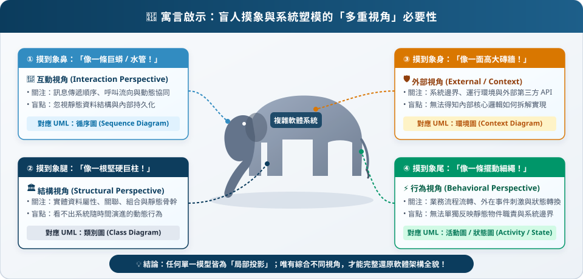
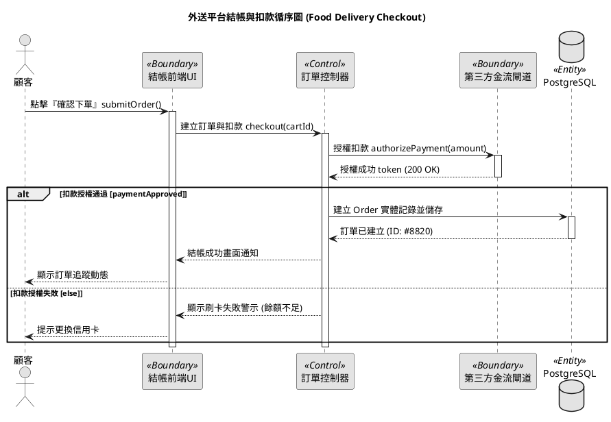

# 第四章：系統塑模與統一架構 (System Modeling & Unified Architecture)

**課程大綱與核心觀念 (Lecture Outline & Key Concepts)**
> * **4.1 系統塑模基礎 (Foundations of System Modeling)**：為何需要軟體塑模？自然語言的模糊性局限、盲人摸象大師寓言，以及軟體架構四大正交塑模視角（外部視角、互動視角、結構視角、行為視角）。
> * **4.2 統一塑模語言 (UML) 與統一流程**：1990 年代物件導向「方法大戰 (Method Wars)」、UML 三巨頭（Grady Booch, Jim Rumbaugh, Ivar Jacobson）歷史整合、OMG 國際標準規範、UML 2.5 十四種圖表分類樹，以及以架構為中心、使用案例驅動之漸進迭代思維。
> * **4.3 功能與使用案例模型 (Use Case Modeling)**：系統邊界矩形、參與者 (Actors) 分類學、主動動詞命名語義、關聯矩陣（`<<include>>` 強制包含子程序 vs. `<<extend>>` 條件擴充點 vs. 參與者一般化繼承）、嵌套深度安全上限、大學選課系統案例、十欄位工業級使用案例規格書 (Use Case Specification)、七大塑模反模式，以及 AI 提示詞工程。
> * **4.4 結構與領域類別模型 (Class Modeling)**：類別三層結構（名稱、屬性、方法）、可見度修飾詞（`+`, `-`, `#`, `~`）、參數方向性、物件關聯分類學（一般關聯、聚合、組合、一般化繼承、依賴）、導覽性與重數多重性 (Multiplicity)、關聯類別、外送平台領域模型實戰、專家檢核清單與 AI 提示詞工程。
> * **4.5 互動與循序圖模型 (Sequence Diagrams)**：物件隨時間協同運作、二維畫布（水平參與者 vs. 垂直向下時間軸）、生命線 (Lifeline) 與啟動條 (Activation)、五大通訊訊息語法（同步、非同步、回傳、建立、銷毀）、複合片段 (Combined Fragments: `alt`, `opt`, `loop`, `par`)、飯店訂房案例、BCE (Boundary-Control-Entity) 架構模式，以及 AI 提示詞工程。
> * **4.6 流程與活動圖模型 (Activity Diagrams)**：程序邏輯與 Token 流程控制、活動圖相較傳統流程圖之四大優勢、分岔與結合 (Fork/Join 並行同步) vs. 決策與合併 (Decision/Merge 互斥條件) 深度辨析、泳道 (Swimlanes/Partitions) 職責分工、物件流 (Object Flow) 與資料狀態、中斷區域與例外處理、外送平台履行流程實戰，以及 AI 提示詞工程。
> * **4.7 行為與狀態機圖模型 (State Machine Modeling)**：狀態相依行為（同一事件，不同反應）、四大狀態變遷觸發因子 (Signal, Call, Time, Change)、五元素變遷語法 (`Trigger [Guard] / Effect`)、動作 (Action 原子不可中斷) vs. 活動 (Activity 耗時可中斷) 核心語義辨析、`entry/` 與 `exit/` 機制、複合狀態 (Composite State) 與淺/深歷史假狀態 (`H`, `H*`)、正交區域並行性、溫控與外送訂單生命週期案例，以及 AI 提示詞工程。
> * **4.8 PlantUML 文字宣告式塑模 (Architecture-as-Code)**：架構即代碼哲學、徹底克服傳統 GUI 拖拉軟體無版本控制與 PR 無法 diff 之工程瓶頸、五大核心模型語法矩陣、Skinparam 樣式定制、跨模型語法速查表，以及現代 Generative AI 提示詞架構合成工作流。
> * **4.9 模型選擇決策框架與課程總結 (Decision Framework & Recap)**：六大模型架構決策矩陣、十大核心概念填空自我檢測題，以及國內外權威經典文獻指引。
> * **附錄：課堂互動測驗 (CCQ 1–8) 詳細解答與架構復盤解析**。

---

## 4.1 系統塑模基礎 (Foundations of System Modeling)

在現代軟體工程中，如果未經架構塑模就直接開始撰寫程式碼，就如同建造一座四十層的商業大樓卻沒有結構藍圖。雖然自然語言（如使用者故事、需求訪談記錄）能夠直觀表達商業願景，但文字天生具備歧義性、不完整性與語意落差。系統塑模 (System Modeling) 提供了形式化、圖形化的抽象機制，讓工程團隊在動手投入昂貴的編碼成本前，能夠精準設計、溝通並驗證軟體架構。

### 4.1.1 什麼是模型？
**模型 (Model)** 是對真實系統的一種「刻意抽象化表示」：它強調與當前設計目的高度相關的本質特徵，同時過濾掉無關緊要的實現細節。正如電子工程師依賴電路原理圖（而不是顯微鏡下的銅導線實體掃描）來分析邏輯閘，軟體工程師透過架構圖來推演模組邊界、資料流向與狀態變遷。

```text
+-------------------------------------------------------------+
|                  THE ROLE OF SYSTEM MODELS                  |
+-------------------------------------------------------------+
|  [模糊的商業意圖 (Ambiguous Intent)]                        |
|  * 非結構化文字、隱含假設、跨利害關係人溝通落差             |
|                           │                                 |
|                           ▼                                 |
|  [軟體架構模型 (Architectural UML Models)]                  |
|  * 明確劃定系統邊界與元件責任分配                           |
|  * 嚴謹物件合約、介面定義與確定性狀態路徑                   |
|                           │                                 |
|                           ▼                                 |
|  [目標生產程式碼 (Executable Target Code)]                  |
|  * TypeScript / Java / Go / Rust / 關聯式資料庫 Schema      |
+-------------------------------------------------------------+
```

### 4.1.2 盲人摸象與軟體架構的四大塑模視角
沒有任何單一圖表能夠同時呈現整個軟體系統的全部面向。若試圖將資料庫表格、網路通訊協定、使用者介面點擊與演算法細節塞進同一張圖中，只會產出毫無可讀性的視覺混亂。因此，軟體工程師師法經典「盲人摸象」的哲理，從**四個彼此正交的專業視角**來剖析系統：



*圖 4.1.1：盲人摸象寓言與軟體架構四大視角。每一種 UML 圖表專注於捕捉軟體架構的特定視角，組合起來方能呈現系統的全貌。*

1. **外部視角 (External Perspective - 環境與邊界)**：
   描繪系統與其所處運作環境的關聯，劃定清晰的系統邊界矩形，區分內部開發程式碼範疇與外部人類使用者、第三方 SaaS 雲端服務或硬體感測器。
2. **互動視角 (Interaction Perspective - 動態協同運作)**：
   描繪外部參與者與系統之間，以及系統內部各個執行期物件之間，如何跨越記憶體與網路邊界傳遞訊息、調用函式。
3. **結構視角 (Structural Perspective - 靜態組織架構)**：
   描繪領域實體、類別屬性、方法簽名、介面合約與實體間的靜態關係（關聯、聚合、組合、繼承），完全獨立於執行時間軸。
4. **行為視角 (Behavioral Perspective - 動態狀態與流程)**：
   描繪系統如何對內部與外部事件做出反應，捕捉實體的生命週期狀態變遷、條件分支、例外中斷與並行工作流程。

---

<!-- id: ase-ch04-ccq1 -->
#### 🙋 **觀念檢核測驗 (CCQ 1) — 四大塑模視角**

**問題**

軟體架構師希望定義**領域實體資料如何組織、類別之間如何繼承與關聯**，且完全獨立於運行時期的執行順序。架構師應採取哪一種塑模視角？

- A. 外部視角 (External Perspective)
- B. 互動視角 (Interaction Perspective)
- C. 結構視角 (Structural Perspective)
- D. 行為視角 (Behavioral Perspective)

[Interactive Activity (線上作答)](https://nlhsueh.github.io/nickedupocket/#/student/ase-ch04-ccq1)

<a href="https://nlhsueh.github.io/nickedupocket/#/student/ase-ch04-ccq1" target="_blank"></a>

<details>
<summary>點擊展開參考答案與解析</summary>

**正確答案**: C
**解析**: 結構視角捕捉資料、實體類別、屬性與彼此靜態關係的組織架構，完全獨立於執行時間點。（外部視角描繪環境與邊界；互動視角描繪參與者與物件隨時間傳遞的訊息交互；行為視角描繪狀態變遷與動態執行工作流）。
</details>

---

## 4.2 統一塑模語言 (UML) 與統一流程

在 1990 年代中期之前，物件導向軟體工程界經歷了一場著名的「**方法大戰 (Method Wars)**」。市場上充斥著數十種互不相容的標記法，其中最具代表性的包括 Grady Booch 的 Booch Method、Jim Rumbaugh 的 OMT（物件塑模技術），以及 Ivar Jacobson 的 OOSE（物件導向軟體工程）。工程師每換一家公司就必須重新學習一套私有的圖表語法，造成嚴重的溝通障礙。

### 4.2.1 UML 三巨頭與統一歷程
1994 年，Rational Software 公司促成了這三位大師的劃時代聯手，工程界尊稱為 **UML 三巨頭 (The Three Amigos)**：

| 先驅大師 | 代表性塑模方法論 | 對 UML 的核心歷史貢獻 |
| :--- | :--- | :--- |
| **Grady Booch** | Booch Method | 物件導向設計、巨觀結構架構與工程符號化 |
| **James Rumbaugh** | OMT (Object Modeling Technique) | 豐富靜態物件關聯、狀態圖分析與資料建模 |
| **Ivar Jacobson** | OOSE (Object-Oriented SE) | 發明使用案例 (Use Cases)、參與者商業目標導向之需求工程技術 |

三位大師去蕪存菁，於 1997 年正式發表 UML 1.0，隨後被 **OMG (Object Management Group)** 採納為全球軟體產業的統一國際標準（ISO/IEC 19505）。

### 4.2.2 UML 2.5 十四種圖表分類樹
現代 UML 2.5 規格書共定義了 14 種官方圖表，對稱劃分為兩大分支：

| 分類樹分支 | UML 2.5 官方圖表類型 | 軟體架構核心觀察視角 |
| :--- | :--- | :--- |
| **結構圖 (Structure Diagrams)**<br>*(靜態架構)* | • **類別圖 Class Diagram** (核心)<br>• 物件圖 Object Diagram<br>• 元件圖 Component Diagram<br>• 部署圖 Deployment Diagram<br>• 套件圖 Package Diagram<br>• 複合結構圖 Composite Structure<br>• 剖面輪廓圖 Profile Diagram | 塑模軟體靜態結構、實體屬性、關聯繼承、微服務模組邊界與實體硬體伺服器部署拓撲。 |
| **行為圖 (Behavior Diagrams)**<br>*(動態行為)* | • **使用案例圖 Use Case Diagram** (範疇)<br>• **活動圖 Activity Diagram** (工作流)<br>• **狀態機圖 State Machine** (生命週期) | 塑模系統執行時期的動態運作、利害關係人商業目標、演算法並行流程與物件生命週期變遷。 |
| **互動圖 (Interaction Diagrams)**<br>*(行為圖子分支)* | • **循序圖 Sequence Diagram** (時間時序)<br>• 溝通圖 Communication Diagram<br>• 計時圖 Timing Diagram<br>• 互動概觀圖 Interaction Overview | 聚焦物件與物件之間「隨時間推移之訊息調用鏈 (Message Passing)」、分散式 API 交互協定。 |

> 📌 **工程實踐的 80/20 法則**：在現代敏捷與企業級開發中，超過 80% 的架構溝通與設計工作，主要由五大核心模型完成：**使用案例圖 (Use Case)**、**類別圖 (Class)**、**循序圖 (Sequence)**、**活動圖 (Activity)** 與 **狀態機圖 (State Machine)**。

---

<!-- id: ase-ch04-ccq2 -->
#### 🙋 **觀念檢核測驗 (CCQ 2) — UML 奠基先驅與三巨頭**

**問題**

在 UML 「三巨頭 (Three Amigos)」中，哪一位大師因於 1986 年發明**使用案例 (Use Cases)**、將軟體架構錨定於使用者目標而享譽工程界？

- A. Grady Booch
- B. James Rumbaugh
- C. Ivar Jacobson
- D. Martin Fowler

[Interactive Activity (線上作答)](https://nlhsueh.github.io/nickedupocket/#/student/ase-ch04-ccq2)

<a href="https://nlhsueh.github.io/nickedupocket/#/student/ase-ch04-ccq2" target="_blank"></a>

<details>
<summary>點擊展開參考答案與解析</summary>

**正確答案**: C
**解析**: Ivar Jacobson 首創物件導向軟體工程 (OOSE) 並於 1986 年發明使用案例 (Use Cases)。Grady Booch 奠定 Booch Method（物件設計與巨觀架構），James Rumbaugh 發展 OMT（物件塑模技術，強調整體物件關聯語法）。
</details>

---

## 4.3 功能與使用案例模型 (Use Case Modeling)

使用案例模型是界定軟體系統責任範圍的最主要工具。它迫使工程團隊走出內部實作細節，站在外部參與者的立場思考：「系統究竟提供什麼具備商業價值的服務？」

### 4.3.1 使用案例圖視覺語法結構


*圖 4.3.1：使用案例塑模視覺解剖學。以系統邊界為界限，清楚劃分外部參與者與內部功能服務。*

標準 UML 使用案例圖由四大視覺元素組成：
1. **系統邊界 (System Boundary - 矩形框)**：標示軟體系統的實體邊界，框內代表團隊必須編碼交付的功能，框外代表外部實體。
2. **參與者 (Actors - 人形符號)**：位於系統外部、直接與系統互動的實體（人類使用者、外部後端 API、自動化硬體）。
3. **使用案例 (Use Cases - 橢圓形)**：系統內部執行的完整業務邏輯，能為參與者產生具備可衡量價值的結果。
4. **關聯線 (Association Lines - 實線)**：連接參與者與其參與之使用案例。

### 4.3.2 商業價值 vs. 技術操作迷思


*圖 4.3.2：商業價值與使用者目標導向。使用案例應當表述完整的商業目標，切忌退化為細微的技術點擊步驟。*

新手架構師最常犯的錯誤是將使用案例圖畫成流程圖（例如把「輸入帳號」、「驗證密碼」、「點擊登入按鈕」畫成三個使用案例）：
* **反模式 (功能分解陷阱)**：拆分成「輸入信用卡號」、「檢查有效期限」、「扣款」。
* **最佳實踐 (商業目標導向)**：以單一具備業務價值的目標封裝：**「結帳並處理扣款 (Process Checkout Payment)」**。

### 4.3.3 參與者分類學：主要、次要與排程觸發


*圖 4.3.3：參與者分類學。依據發起目標的主動性與輔助角色進行分類。*

* **主要參與者 (Primary Actors)**：主動發起使用案例以達成個人或業務目標的實體（如顧客、學生、醫生），慣例繪製於邊界框**左側**。
* **次要/支援參與者 (Secondary / Supporting Actors)**：被動接收系統呼叫以提供基礎服務的外部系統（如金流閘道、第三方簡訊平台、統一編號驗證服務），慣例繪製於邊界框**右側**。
* **排程/自動化觸發者 (Automated Schedulers)**：系統內部的計時觸發器（如每日排程計費 Daemon）。

### 4.3.4 關聯矩陣：包含、擴充與一般化


*圖 4.3.4：使用案例關聯規則矩陣。嚴格界定 Association、<<include>>、<<extend>> 與 Generalization 之箭頭方向與語義。*

| 關聯類型 | 視覺符號語法 | 箭頭指向規則 | 架構核心語意 |
| :--- | :--- | :--- | :--- |
| **關聯 (Association)** | 實線 `───` | 無或開放箭頭 | 參與者與使用案例之間的通訊互動連線。 |
| **包含 (`<<include>>`)** | 虛線開放箭頭 `- - - >` | 基礎 → 包含目標 | **必經共享子流程。** 基礎案例執行時「無條件強制執行」包含案例。 |
| **擴充 (`<<extend>>`)** | 虛線開放箭頭 `- - - >` | 擴充 → 基礎案例 | **條件式選用擴充。** 僅在滿足指定擴充點 (Extension Point) 時才觸發插入執行。 |
| **一般化 (Generalization)** | 實線空心三角形 `───▷` | 子型別 → 父型別 | **繼承關係。** 子參與者或特化使用案例自動繼承父層全部操作權限與結構。 |

#### 嵌套深度安全上限 (防止過度工程化)


*圖 4.3.5：嵌套深度安全限制。嚴禁多層級的 include 鏈結（如 A include B include C include D），關聯深度應嚴格限制在 1–2 層以內。*

### 4.3.5 大學選課系統實戰案例與標準規格書


*圖 4.3.6：大學學生選課使用案例實戰圖。展示學生（主要參與者）、排課選課系統邊界、課程目錄與計費系統（次要參與者），以及包含擋修驗證與擴充遞補名額之語義。*

#### 工業級使用案例規格書 (Use Case Specification)：學生選課

| 規格書欄位 | 具體工程規格細節與合約定義 |
| :--- | :--- |
| **案例代號與名稱** | **UC-04: 學生選課 (Enroll Student in Course)** |
| **主要參與者** | 學生 (Student) |
| **利害關係人與目標** | • **學生**：成功選修學位必修或選修課程，取得畢業學分。<br>• **教務處註冊組**：確保選課人數未超額、先修擋修規則嚴格落實。<br>• **開課系所**：確保教學班級規模符合師生比與教室安全容量。 |
| **前置條件 (Preconditions)** | 1. 學生已成功登入教務系統，且無欠費停權處分。<br>2. 當前時間處於該年級之正式開放選課時段內。 |
| **成功保證 (Postconditions)** | 學生正式列入課程修課名單、教室佔有名額扣減 1、產生學分應繳帳單。 |
| **觸發條件 (Trigger)** | 學生在選課介面點擊「確認加選此課程」按鈕。 |
| **主要成功情境**<br>*(Happy Path)* | 1. 學生瀏覽全校開課清單並檢視尚有名額之課程。<br>2. 學生選定目標班別並送出加選申請。<br>3. 系統驗證該生已修畢且通過該課程之所有先修條件。<br>4. 系統檢查目標課程當前剩餘名額 (Quota > 0)。<br>5. 系統保留名額，將學生帳號寫入修課名冊 (Course Roster)。<br>6. 系統非同步發送結算訊息至計費系統增加學分費。<br>7. 系統回傳加選成功收據畫面，顯示當前已選學分數。 |
| **擴充與例外分支**<br>*(Extensions)* | **3a. 先修課程未通過：**<br>&nbsp;&nbsp;1. 系統顯示未符合之先修科目代碼與成績。<br>&nbsp;&nbsp;2. 系統提示學生可申請先修豁免單，終止本次加選。<br>**4a. 課程名額已額滿 (Quota = 0)：**<br>&nbsp;&nbsp;1. 系統提示本班級名額已滿。<br>&nbsp;&nbsp;2. 系統啟動 `<<extend>>` UC-05: 加入候補排隊名單。<br>&nbsp;&nbsp;3. 若學生確認，將其加入候補隊列 (Waiting List)。<br>**6a. 出納計費系統斷線：**<br>&nbsp;&nbsp;1. 系統將計費事件寫入本地交易 Outbox 表。<br>&nbsp;&nbsp;2. 依舊判定加選成功，記錄稽核日誌並背景重試計費。 |

### 4.3.6 使用案例七大常見致命反模式


*圖 4.3.7：使用案例塑模常見反模式。包括箭頭反向、無邊界框、功能分解與參雜 UI 點擊。*

1. **擴充箭頭指錯方向**：誤將 `<<extend>>` 箭頭從基底指向擴充。請牢記：基底案例對擴充案例應完全一無所知！
2. **功能分解陷阱**：把使用案例當成程序代碼逐行拆解。
3. **缺少系統邊界框**：橢圓漂浮在空中，無法定義專案範圍。
4. **參與者畫在框內**：將外部系統誤認為內部模組。
5. **過度使用一般化繼承**：為使用案例建立複雜的深層繼承樹。
6. **參雜 UI 細節操作**：寫出「點擊送出按鈕」而非「提交訂單」。
7. **孤兒使用案例**：完全沒有連接任何參與者的無效橢圓。

---

<!-- id: ase-ch04-ccq3 -->
#### 🙋 **觀念檢核測驗 (CCQ 3) — 使用案例關聯：包含 vs. 擴充**

**問題**

在 UML 使用案例模型中，若使用案例 A 與使用案例 B 之間存在 **`<<include>>`** 關聯（A 指向 B），這在軟體架構上代表什麼意義？

- A. 使用案例 B 是選擇性的，僅在特定異常狀況下才會由 A 觸發執行。
- B. 每當使用案例 A 執行時，使用案例 B 所定義的行為「必定且強制」會被納入執行。
- C. 使用案例 A 繼承了使用案例 B 的所有屬性與操作方法。
- D. 使用案例 B 是外部第三方系統，不屬於軟體邊界範疇。

[Interactive Activity (線上作答)](https://nlhsueh.github.io/nickedupocket/#/student/ase-ch04-ccq3)

<a href="https://nlhsueh.github.io/nickedupocket/#/student/ase-ch04-ccq3" target="_blank"></a>

<details>
<summary>點擊展開參考答案與解析</summary>

**正確答案**: B
**解析**: 在 UML 使用案例語義中，`<<include>>` 代表強制性的基礎子程序，每當基底使用案例啟動時，被包含的使用案例行為必定會被完整執行。反之，`<<extend>>` 則代表選擇性或特定擴充點條件觸發之行為。
</details>

---

## 4.4 結構與領域類別模型 (Class Modeling)

如果說使用案例圖定義了軟體「做什麼」，那麼**類別圖 (Class Diagram)** 則奠定了系統「由什麼實體組成」的靜態架構骨幹。類別圖定義領域詞彙、對應關聯式資料庫結構，並規範物件導向程式碼的編譯期合約。

### 4.4.1 類別結構解剖：三層隔間語法


*圖 4.4.1：UML 類別圖解剖學。標準類別方塊分為三層：類別名稱、屬性變數與方法簽名。*


*圖 4.4.2：類別方塊細部語法。包含屬性型別標註、預設值、方法參數方向性與可見度標記。*

標準 UML 類別方塊被劃分為三個水平隔間：
1. **頂層隔間 (類別名稱)**：宣告類別識別名稱。抽象類別以*斜體*表示或標註 `{abstract}`；介面則加上 `<<interface>>` 造型飾詞。
2. **中層隔間 (屬性清單)**：描述實體狀態資料，標準語法為：
   `[可見度] 屬性名稱 : 型別 [重數] [= 預設值] [{特性修飾}]`
   *(範例：`- balance : Money = 0.00 {readOnly}`)*
3. **底層隔間 (操作方法清單)**：宣告可被外部調用之行為合約，標準語法為：
   `[可見度] 方法名稱 ( [方向] 參數名 : 參數型別 , ... ) : 回傳型別`
   *(範例：`+ processPayment(in amount: Decimal, in token: String) : PaymentResult`)*

### 4.4.2 可見度修飾詞與資訊隱藏


*圖 4.4.3：可見度修飾詞矩陣。定義 Public (+)、Private (-)、Protected (#) 與 Package (~) 之封裝邊界。*

| 符號標記 | 可見度名稱 | 程式語言對應語法 | 軟體架構封裝範疇 |
| :---: | :--- | :--- | :--- |
| **`+`** | **公開 (Public)** | `public` | 任何外部物件皆可直接公開調用。 |
| **`-`** | **私有 (Private)** | `private` | 嚴格封裝於類別內部，外部不可見。 |
| **`#`** | **受保護 (Protected)** | `protected` | 僅該類別及其衍生之繼承子類別可存取。 |
| **`~`** | **套件 (Package)** | `default` (套件私有) | 僅同一個套件或命名空間內的類別可存取。 |

### 4.4.3 物件關聯分類學與連接符號速查


*圖 4.4.4：物件導向關聯分類樹。由暫時性微弱依賴至永久生命週期綁定之光譜排列。*


*圖 4.4.5：UML 類別連接線速查手冊。關聯、聚合、組合、一般化繼承、介面實作與依賴之端點幾何符號標準。*

| 關係類型 | 視覺語法符號 | 耦合強弱程度 | 生命週期相依性與架構意涵 |
| :--- | :--- | :--- | :--- |
| **相依 (Dependency)** | 虛線箭頭 `- - - >` | 最弱 (暫時性) | 暫時使用。物件透過方法參數、區域變數傳遞。 |
| **一般關聯 (Association)** | 實線 `──────` | 中等 (同儕同伴) | 結構性持有。透過實例屬性常駐引用對方。 |
| **聚合 (Aggregation)** | 空心菱形 `──────◇` | 中強 (整體與部分) | **弱所有權 (共享部分)。** 部分可脫離整體而獨立存活。 |
| **組合 (Composition)** | 實心菱形 `──────◆` | 最強 (物理包含) | **強所有權 (獨佔部分)。** 整體消亡時部分一併銷毀。 |
| **一般化 (Generalization)** | 實線空心三角形 `──▷` | 繼承關係 (`is-a`) | 子類別繼承父類別的所有屬性、方法與關聯合約。 |
| **實現 (Realization)** | 虛線空心三角形 `- -▷` | 介面實作 | 具體類別履行介面所定義的所有抽象操作合約。 |

#### 聚合 vs. 組合：生命週期所有權測試


*圖 4.4.6：聚合 (Aggregation) 與組合 (Composition) 深度辨析。判定標準為「生命週期所有權」：當整體容器消亡時，內部元件是否隨之同歸於盡？*

* **組合 (Composition, 實心菱形 ◆)**：代表排他性實體所有權。在任何時間點，部分物件僅能屬於一個整體。一旦容器被銷毀，其內部部分物件必定被一併銷毀。
  * *實務範例*：訂單 (`Order`) 與其訂單細項 (`OrderItem`)。在資料庫中刪除一筆訂單，所有關聯的訂單明細必須 Cascade Delete 同步清除。
* **聚合 (Aggregation, 空心菱形 ◇)**：代表共享的弱擁有權。部分物件具備獨立的生命週期。
  * *實務範例*：訂單 (`Order`) 與外送員 (`Courier`)。外送員在送完訂單或訂單被取消後，依然獨立存在於系統中接取下一筆訂單。

### 4.4.4 多重性限制 (Multiplicity) 與導覽性


*圖 4.4.7：多重性限制與導覽性。標註於關聯線端點之數量下限與上限。*

* `1`：剛好一個（Mandatory，不可為 null）。
* `0..1`：零或一個（Optional，可為 null 的指標或引號）。
* `*` 或 `0..*`：零或多個（Unbounded 集合、List、Set）。
* `1..*`：至少一個以上（Non-empty 集合）。
* `m..n`：特定範圍限制（如 `2..4`）。

### 4.4.5 外送平台領域模型實戰案例


*圖 4.4.8：外送平台領域模型架構實例。展示 Customer, Order, OrderItem, MenuItem, Restaurant, Courier 與 Payment 實體間嚴謹的組合、聚合與重數約束。*

---

<!-- id: ase-ch04-ccq4 -->
#### 🙋 **觀念檢核測驗 (CCQ 4) — 類別關係：組合 vs. 聚合**

**問題**

在 UML 類別圖中，**組合 (Composition, ◆)** 與 **聚合 (Aggregation, ◇)** 最關鍵的語義差異為何？

- A. 組合代表子物件可以脫離父物件獨立存活，聚合則生命週期嚴格綁定。
- B. 組合代表強烈的整體與部分關係，部分物件的生命週期與整體完全綁定（整體消滅則部分必亡）；聚合則代表弱擁有關係，部分物件具備獨立生命週期。
- C. 組合用於介面繼承，聚合用於多型實作。
- D. 組合關聯度數只能是 1:1，聚合關聯度數只能是 1:N。

[Interactive Activity (線上作答)](https://nlhsueh.github.io/nickedupocket/#/student/ase-ch04-ccq4)

<a href="https://nlhsueh.github.io/nickedupocket/#/student/ase-ch04-ccq4" target="_blank"></a>

<details>
<summary>點擊展開參考答案與解析</summary>

**正確答案**: B
**解析**: 組合（實心菱形 ◆）代表強擁有權與生命週期相依：若訂單 (Order) 被刪除，其內含之訂單明細細項 (OrderItem) 亦隨之消滅。聚合（空心菱形 ◇）代表弱擁有共享關係，如外送員 (Courier) 與訂單的關係，外送員在訂單完成或刪除後依然獨立存在於系統中。
</details>

---

## 4.5 互動與循序圖模型 (Sequence Diagrams)

類別圖展示了靜態架構，而**循序圖 (Sequence Diagram)** 則將焦點轉移至執行期：在特定的業務情境下，執行個體 (Instances) 究竟如何隨著時間傳遞訊息完成交易？

### 4.5.1 二維畫布：參與者 vs. 垂直向下時間軸


*圖 4.5.1：動態互動模型綜觀。靜態類別提供方法宣告，循序圖則具體呈現執行個體在時間軸上的訊息流轉。*


*圖 4.5.2：循序圖二維畫布。水平維度排列協同運作之物件執行個體，垂直維度代表不可逆的時間流逝。*

* **水平軸 (參與者與生命線)**：上方矩形方塊標註 `物件名稱 : 類別名稱`，下方延伸出一條垂直虛線，稱為**生命線 (Lifeline)**。
* **垂直軸 (時間維度)**：時間嚴格地**由上至下 (Top-to-Bottom)** 單向推進，越下方代表發生在越晚的時間點。

### 4.5.2 生命線、啟動條與五大訊息通訊語法


*圖 4.5.3：生命線與啟動焦點條 (Activation Bar)。生命線上的細長矩形代表該物件正在執行處理邏輯或等待副程式回傳的有效作用期。*


*圖 4.5.4：UML 循序圖訊息通訊語法矩陣。同步呼叫、非同步訊號、回傳訊息、物件建立與消滅之圖形規範。*

| 訊息調用類型 | 視覺箭頭語法 | 執行時期語意與執行緒行為 |
| :--- | :--- | :--- |
| **同步呼叫 (Sync Call)** | 實線實心箭頭 `───►` | **阻斷式 (Blocking)。** 呼叫端暫停並等待被呼叫端處理完成回傳。 |
| **非同步訊號 (Async Signal)** | 實線開放箭頭 `───>` | **非阻斷式 (Non-blocking)。** 呼叫端送出事件即繼續執行。 |
| **回傳訊息 (Return Message)** | 虛線開放箭頭 `◄- - -` | 選用顯式回傳。將控制權與運算結果資料回傳給呼叫端。 |
| **建立物件 (Create)** | 虛線指向實體框 `- - -►` | 執行時期動態實體化新物件 (`new Order()`)。 |
| **銷毀物件 (Destroy)** | 生命線末端大 `X` 符號 | 顯式釋放實體記憶體或停止垃圾回收生命週期。 |

### 4.5.3 複合片段 (Combined Fragments)：分支、迴圈與並行


*圖 4.5.5：複合片段綜觀。以標準 UML 算子方框封裝分支、迴圈與並行處理。*


*圖 4.5.6：複合片段算子與程式代碼直接對應。alt 對應 if-else，opt 對應單一 if，loop 對應 while/for，par 對應並行多執行緒。*

| 運算子 | 程式語言控制結構對照 | 軟體架構與控制流語意 |
| :---: | :--- | :--- |
| **`alt`** | `if (...) { ... } else { ... }` | **互斥替代分支。** 依據守衛條件 (Guard) 僅且僅會執行其中一個子框。 |
| **`opt`** | `if (...) { ... }` *(無 else)* | **選用執行片段。** 當守衛條件為真時執行；為假時整段跳過。 |
| **`loop`** | `for / while` `loop(min, max)` | **迴圈重複執行。** 在守衛條件維持真或指定次數範圍內反覆執行。 |
| **`par`** | `Thread / Promise.all()` | **並行執行。** 框內的多個次子片段在不同執行緒上同時並行運作。 |

### 4.5.4 BCE (Boundary-Control-Entity) 架構模式實務


*圖 4.5.7：BCE 架構模式與循序管線。前端 Boundary 將請求轉送給 Control 控制器進行邏輯協調，再由控制器操作 Entity 實體與外部服務。*

在設計高內聚低耦合的循序圖時，必須遵循 BCE 架構分工：
* **邊界物件 (Boundary, `<<boundary>>`)**：負責與外部溝通（如 `CheckoutUI`、`RESTController`）。嚴禁邊界直接存取資料庫或執行交易邏輯。
* **控制物件 (Control, `<<control>>`)**：負責業務邏輯編排與交易界限（如 `OrderCheckoutService`）。控制器協調實體狀態，並調用外部邊界。
* **實體物件 (Entity, `<<entity>>`)**：代表持久化商業資料與核心規則（如 `Order`、`Customer`）。實體嚴禁感知 UI 邊界的存在。

---

<!-- id: ase-ch04-ccq5 -->
#### 🙋 **觀念檢核測驗 (CCQ 5) — BCE 架構職責分工**

**問題**

在 BCE (Boundary-Control-Entity) 架構循序圖中，當顧客透過結帳前端點擊『確認下單』按鈕時，該事件應先傳遞給哪一種類型的物件處理？

- A. 直接傳遞給 `Order` 實體物件 (Entity) 立即寫入資料庫
- B. 直接呼叫 `PaymentGatewayAPI` 邊界物件 (Boundary) 立即刷卡扣款
- C. 傳遞給 `OrderController` 控制物件 (Control) 協調業務邏輯驗證與調用
- D. 直接傳遞給 `KitchenPrinter` 邊界物件列印工單

[Interactive Activity (線上作答)](https://nlhsueh.github.io/nickedupocket/#/student/ase-ch04-ccq5)

<a href="https://nlhsueh.github.io/nickedupocket/#/student/ase-ch04-ccq5" target="_blank"></a>

<details>
<summary>點擊展開參考答案與解析</summary>

**正確答案**: C
**解析**: BCE 架構的核心原則是「關注點分離」：邊界物件 (UI/API) 僅負責接收外部輸入，不得直接操作資料實體或繞過業務規則，必須委派給控制物件 (Control) 進行核心業務驗證、交易協調與跨服務調用。
</details>

---

## 4.6 流程與活動圖模型 (Activity Diagrams)

循序圖擅長追蹤物件之間的特定訊息時序，而**活動圖 (Activity Diagram)** 則將鏡頭拉遠，以工作流程與 Token 流程控制的巨觀角度，描繪跨角色、跨系統之演算法邏輯與並行業務流程。

### 4.6.1 活動圖 vs. 傳統流程圖之四大優勢


*圖 4.6.1：活動圖之視覺邏輯。引入 Petri-Net Token 語意、物件流與泳道機制，徹底超越傳統流程圖。*

| 評估維度 | 傳統流程圖 (Flowchart) | UML 活動圖 (Activity Diagram) |
| :--- | :--- | :--- |
| **並行處理支援** | 無 (本質上屬於嚴格單執行緒流程)。 | **原生支援同步條 (Fork/Join)**，可精確塑模多執行緒並行運算。 |
| **組織職責歸屬** | 無 (所有步驟平鋪於單一全局畫布)。 | **泳道分區 (Swimlanes)** 明確指派各步驟之責任歸屬單位與系統邊界。 |
| **資料物件狀態流** | 僅有模糊的平行四邊形 I/O 標記。 | **顯式物件節點 (Object Nodes)** 攜帶狀態釘針，如 `[已付款]`、`[已備餐]`。 |
| **執行數學語意** | 僅為非正式的視覺連接線。 | **基於 Petri-Net 權標 (Token) 推進機制**，具備嚴謹數學模型基礎。 |

### 4.6.2 核心節點：動作、決策/合併與分岔/結合


*圖 4.6.2：活動圖核心語法節點。初始節點、動作狀態、決策/合併菱形與活動終止節點。*


*圖 4.6.3：Fork 與 Join 同步控制條。Fork 將單一 Token 複製切分為多個並行活動；Join 則等待所有並行路徑皆完成匯流後方能向下推進。*

#### 核心辨析：Fork/Join vs. Decision/Merge
* **決策與合併 (Decision / Merge ♢ 菱形)**：代表**條件互斥分支**。一個流入的 Token，依據布林守衛條件 `[guard]`，在多條路徑中**嚴格選擇其一**推進。
* **分岔與結合 (Fork / Join ❚ 同步條)**：代表**多執行緒並行**。一個流入的 Token 被複製分配至所有流出路徑，所有並行活動**同時並發執行**；Join 條則具備阻塞同步語意，必須等待每一條並行路徑的 Token 全部到達，才融合成單一 Token 向下推進。

### 4.6.3 泳道 (Swimlanes) 與物件資料流實戰


*圖 4.6.4：泳道 (Swimlanes/Partitions) 劃分。將活動分配至不同部門、使用者或微服務系統。*


*圖 4.6.5：物件流 (Object Flow) 與狀態釘針。展示實體物件在各動作執行間的生命週期狀態轉變。*

* **顧客泳道**：`瀏覽餐點` ──► `送出訂單` ──► `[訂單: 待處理]`。
* **餐廳廚房泳道**：接收到訂單後 ──► `烹飪餐點` ──► `[餐點: 已備妥]`。
* **外送系統泳道**：與烹飪並行觸發 ──► `媒合最佳外送員` ──► `[派遣單: 已接單]`。
* **結合同步條 (Join Bar)**：等待「餐點已備妥」與「外送員已抵達餐廳」兩者皆滿足後，方能執行 `領取餐點並展開運送`。

---

<!-- id: ase-ch04-ccq6 -->
#### 🙋 **觀念檢核測驗 (CCQ 6) — 活動圖同步條 vs. 決策菱形**

**問題**

在 UML 活動圖中，**分岔/結合 (Fork/Join 同步條)** 與 **決策/合併 (Decision/Merge 菱形)** 的核心差異為何？

- A. Fork/Join 用於將單一流程切分為多條「並行同時執行」的執行緒；Decision/Merge 則依據布林條件由多條路徑中「嚴格選擇其一 (互斥)」執行。
- B. Fork/Join 用於類別繼承；Decision/Merge 用於物件實體化。
- C. Fork/Join 只能處理資料流；Decision/Merge 只能處理錯誤例外。
- D. Fork/Join 必須等待人工確認；Decision/Merge 由系統計時器自動觸發。

[Interactive Activity (線上作答)](https://nlhsueh.github.io/nickedupocket/#/student/ase-ch04-ccq6)

<a href="https://nlhsueh.github.io/nickedupocket/#/student/ase-ch04-ccq6" target="_blank"></a>

<details>
<summary>點擊展開參考答案與解析</summary>

**正確答案**: A
**解析**: Fork 節點會同時啟動兩條或以上的平行並行活動（例如：廚房備餐與外送員派遣同時啟動），Join 則等待所有並行路徑皆完成才向下推進。Decision 節點則根據守衛條件 `[guard]` 進行互斥分支二選一或多選一。
</details>

---

## 4.7 行為與狀態機圖模型 (State Machine Modeling)

許多核心業務實體（如電商訂單、網路連線 Session、物聯網溫控閥門）其行為具備高度的**狀態相依性 (State-Dependent Behavior)**。狀態機模型以單一實體為核心，捕捉其在整個生命週期中如何因應事件而改變狀態。

### 4.7.1 同一事件，不同反應


*圖 4.7.1：狀態相依行為解剖學。物件對事件的反應取決於其當前處於何種內部狀態。*


*圖 4.7.2：相同事件在不同狀態下的相異反應。例如對未付款訂單觸發「取消」會成功退回購物車，但對「運送中」訂單觸發取消則會被系統拒絕。*

狀態機的核心定理在於：**系統的反應不僅取決於輸入事件，更受控於當前狀態**。

### 4.7.2 五元素變遷語法與觸發因子


*圖 4.7.3：狀態變遷力學公式。Trigger [Guard] / Effect 語法結構。*

UML 狀態變遷以帶箭頭的直線連接來源狀態與目標狀態，完整語法公式為：
```
觸發事件 (Trigger) [布林守衛條件 (Guard)] / 執行動作 (Effect/Action)
```
1. **Trigger (觸發事件)**：引發變遷的事件（如 `cardInserted`、`timeoutExpired`）。
2. **Guard (守衛條件)**：以中括號括起之布林條件（如 `[balance >= orderAmount]`），僅在評估為 true 時變遷方能觸發。
3. **Effect / Action (觸發動作)**：變遷跨越時執行之瞬間原子性操作（如 `/ deductAccountBalance()`）。

### 4.7.3 動作 (Action) vs. 活動 (Activity) 核心語義辨析


*圖 4.7.4：動作 (Action) 與活動 (Activity) 之本質差異。Action 瞬間完成且不可中斷；Activity 持續耗時且可被外來事件隨時終止。*

| 特性維度 | 動作 (Action: `entry`, `exit`, `/`) | 活動 (Activity: `do / ...`) |
| :--- | :--- | :--- |
| **時間長度** | **零耗時 (瞬時完成 Instantaneous)** | **持續耗時 (Takes Time)** |
| **中斷性** | **不可中斷 (Atomic 原子操作)** | **可中斷 (Interruptible)**，外部變遷一觸發即刻被終止 |
| **宣告位置** | `entry /`, `exit /` 或變遷線上之 `/ effect` | 僅能在狀態方塊內部以 `do /` 宣告 |

### 4.7.4 複合狀態 (Composite States) 與歷史假狀態 (History)


*圖 4.7.5：複合狀態與歷史假狀態。以巢狀結構解決狀態爆炸問題，並透過 H 與 H* 記號保存中斷前的內部狀態。*

* **複合狀態 (Composite State)**：將多個相關子狀態封裝於一個父狀態方框中。任何連接至父狀態外框的變遷（如 `powerOff` 或 `emergencyStop`），對所有巢狀子狀態自動生效，徹底杜絕重複繪製幾十條相同箭頭的「狀態爆炸 (State Explosion)」問題。
* **淺歷史假狀態 (Shallow History, `H`)**：當重新進入複合狀態時，自動恢復至**最外層直接子狀態**。
* **深歷史假狀態 (Deep History, `H*`)**：遞迴記憶中斷發生時處於**最深層的巢狀子狀態**。

---

<!-- id: ase-ch04-ccq7 -->
#### 🙋 **觀念檢核測驗 (CCQ 7) — 狀態機動作 vs. 活動**

**問題**

在 UML 狀態機圖中，**動作 (Action，如 transition 上的 `/ refund()` 或 `entry /`)** 與 **活動 (Activity，如 `do /`)** 最根本的執行語義差異為何？

- A. Action 是瞬間完成、不可中斷的原子性操作；Activity 是耗時進行的持續運算，且可被外來事件隨時中斷。
- B. Action 只能寫 Python；Activity 只能寫 SQL。
- C. Action 只能在進入狀態時執行；Activity 只能在離開狀態時執行。
- D. Action 專門處理例外失敗；Activity 專門處理成功路徑。

[Interactive Activity (線上作答)](https://nlhsueh.github.io/nickedupocket/#/student/ase-ch04-ccq7)

<a href="https://nlhsueh.github.io/nickedupocket/#/student/ase-ch04-ccq7" target="_blank"></a>

<details>
<summary>點擊展開參考答案與解析</summary>

**正確答案**: A
**解析**: 依據 OMG UML 狀態機語意規格，Action（轉移觸發動作、entry/、exit/）概念上耗時為零、具備原子性且不可中斷；而 Activity（以 `do /` 宣告）則代表一段耗時運算，一旦有任何觸發狀態轉移的事件到達，該活動會被立即中斷中止。
</details>

---

## 4.8 PlantUML 文字宣告式塑模 (Architecture-as-Code)

傳統採用閉源 GUI 繪圖軟體（如 Visio、Enterprise Architect）維護系統圖表的做法，在現代 CI/CD 與敏捷開發中已被證明是重大維運負擔。以純文字撰寫架構的 **PlantUML**，實現了「架構即代碼 (Architecture-as-Code)」的工程願景。

### 4.8.1 為何捨棄 GUI 拖拉？純文字塑模的工程價值


*圖 4.8.1：PlantUML 代碼驅動架構。純文字源碼可進行版本控制、PR 審查與自動化生成。*


*圖 4.8.2：停止拖拉滑鼠，開始編寫架構。文字宣告式建模徹底解決二進位圖片衝突與手動排版浪費時間的困境。*

| 評估維度 | 傳統 GUI 圖形拖拉軟體 | PlantUML (架構即代碼) |
| :--- | :--- | :--- |
| **儲存格式** | 私有二進位檔案或極度冗長的 XML | 純文字檔案 (`.puml` / `.md`) |
| **Git 版本控制** | 二進位衝突無法合併、Diff 毫無意義 | 原生支援分支合流、清晰行級 Diff 與 PR Review 審查 |
| **CI/CD 自動化** | 需人工手動截圖匯出 | GitHub Actions 背景無頭自動編譯向量 SVG/PDF 手冊 |
| **AI 輔助合成** | AI 無法直接操作滑鼠拖拉生成 | LLM 能直接生成完整正確的 PlantUML 純文字代碼 |

### 4.8.2 五大核心圖表 PlantUML 跨模型語法矩陣


*圖 4.8.3：PlantUML 跨模型語法速查指南。統一在 @startuml 與 @enduml 區塊內宣告類別、循序、活動、狀態機與使用案例圖。*



---

<!-- id: ase-ch04-ccq8 -->
#### 🙋 **觀念檢核測驗 (CCQ 8) — 文字宣告式塑模工程價值**

**問題**

相較於傳統封閉式 GUI 圖形拖拉繪圖軟體，採用如 **PlantUML** 等文字宣告式塑模工具的最大工程優勢是什麼？

- A. 完全不需要學習 UML 規範即可自動產生圖表。
- B. 純文字原始碼可直接納入 Git 版本控制、在 Pull Request 中進行 diff 審查，並整合至 CI/CD 自動化建置。
- C. PlantUML 能自動產生完整的商業生產微服務與雲端資料庫。
- D. PlantUML 只能繪製類別圖，無法繪製動態流程圖。

[Interactive Activity (線上作答)](https://nlhsueh.github.io/nickedupocket/#/student/ase-ch04-ccq8)

<a href="https://nlhsueh.github.io/nickedupocket/#/student/ase-ch04-ccq8" target="_blank"></a>

<details>
<summary>點擊展開參考答案與解析</summary>

**正確答案**: B
**解析**: 架構即代碼 (Architecture-as-Code) 將視覺模型轉化為純文字宣告代碼，徹底解決二進位圖片無法在 Git 比較版本差異 (diff)、難以自動化審查與容易隨程式碼更新而過時失效的痛點。
</details>

---

## 4.9 模型選擇決策框架與課程總結 (Decision Framework & Recap)

### 4.9.1 六大核心模型架構決策矩陣

| UML 核心圖表 | 核心回答之工程問題 | 關鍵視覺語法元素 | 最佳實務應用場景 |
| :--- | :--- | :--- | :--- |
| **1. 使用案例圖 (Use Case)** | 系統外部使用者可獲得「何種具備商業價值的服務」？ | 參與者小人、橢圓案例、系統邊界矩形框、`<<include>>`、`<<extend>>` | 確立專案範疇、合約規格邊界與利害關係人協議共識。 |
| **2. 類別圖 (Class Diagram)** | 領域實體具備「何種靜態資料結構與彼此間的關聯繼承」？ | 三層隔間框、可見度符號 (`+`, `-`)、組合 (`◆`)、聚合 (`◇`) | 物件導向領域模型設計、關聯式資料庫 Schema 映射。 |
| **3. 循序圖 (Sequence Diagram)** | 各物件如何「隨時間順序傳遞訊息調用完成特定情境」？ | 生命線、啟動條、同步/非同步箭頭、BCE 架構分工、複合片段 (`alt`, `loop`) | 具體 API 交易呼叫追蹤、微服務調用鏈與分散式協定。 |
| **4. 活動圖 (Activity Diagram)** | 跨部門與組織的「演算法邏輯與並行工作流程」為何？ | 圓角動作節點、泳道分區、同步條 (Fork/Join)、決策菱形 | 業務流程自動化 (BPMN)、批次運算排程與並行流程。 |
| **5. 狀態機圖 (State Machine)** | 關鍵核心實體的「生命週期狀態因應事件如何變遷」？ | 圓角狀態方塊、觸發因子、守衛條件、Composite 狀態、歷史 `H` | 具備狀態機特徵之物件 (訂單、連線協定、IoT 裝置)。 |
| **6. PlantUML 純文字代碼** | 如何讓視覺架構模型「享受代碼般的版本控制與自動化」？ | 純文字標記語法 (`@startuml ... @enduml`) | 將架構代碼直接納入 Git 倉儲、CI/CD 自動編譯與 PR 審查。 |

### 4.9.2 十大核心觀念自我檢測填空題
1. 軟體塑模的四大視角中，描繪系統與環境邊界的是**外部**視角，描繪靜態實體與關聯的是**結構**視角。
2. 統一塑模語言 (UML) 的三位奠基大師分別為 **Grady Booch**、**James Rumbaugh** 與 **Ivar Jacobson**。
3. 在使用案例圖中，基礎案例「強制必定會執行」的子程序關聯標記為 **`<<include>>`**，箭頭由基底案例指向被包含案例。
4. 代表「強烈實體擁有權」、部分物件生命週期與整體容器同生共死之關聯為**組合 (Composition, ◆)**。
5. 在循序圖中，互斥的條件分支（等同於程式碼中的 if-else）應封裝於 **`alt`** 複合片段中。
6. 在 BCE 架構中，外部使用者請求必定先傳遞給**邊界物件 (Boundary)**，再由其轉交給**控制物件 (Control)** 調度實體。
7. 在活動圖中，能夠將單一控制 Token 切分為多條並發執行緒之節點為 **Fork (分岔同步條)**。
8. 在狀態機中，**動作 (Action)** 耗時為零且不可中斷，而 **活動 (Activity)** 則是耗時且可被外來事件隨時中斷的背景運算。
9. 欲讓複合狀態在被中斷重新進入時恢復至原先啟動之最深層子狀態，UML 提供了 **深歷史 (Deep History, `H*`)** 假狀態。
10. 將視覺架構圖表轉化為純文字宣告代碼，納入 Git 進行 diff 比較與版本追蹤之軟體工程實踐稱為 **架構即代碼 (Architecture-as-Code)**。

### 4.9.3 經典權威文獻與延伸閱讀
* **Booch, G., Rumbaugh, J., & Jacobson, I. (2005).** *The Unified Modeling Language User Guide* (2nd ed.). Addison-Wesley.
* **Fowler, M. (2003).** *UML Distilled: A Brief Guide to the Standard Object Modeling Language* (3rd ed.). Addison-Wesley.
* **Cockburn, A. (2000).** *Writing Effective Use Cases*. Addison-Wesley.
* **Object Management Group (OMG). (2017).** *OMG Unified Modeling Language (OMG UML) Specification*, Version 2.5.1.
* **PlantUML 官方標準手冊：** [plantuml.com](https://plantuml.com)

---

## 附錄：課堂互動測驗 (CCQ 1–8) 詳細解答與架構復盤解析

### CCQ 1: 四大塑模視角
* **正確答案：** C (結構視角)
* **架構復盤：** 定義實體資料如何組織、類別之間如何繼承與關聯，且完全不依賴執行時期之時序順序，為結構視角的典型職責。外部視角關注環境邊界；互動視角關注執行期訊息傳遞；行為視角關注動態狀態機與流程。

### CCQ 2: UML 奠基先驅與三巨頭
* **正確答案：** C (Ivar Jacobson)
* **架構復盤：** Ivar Jacobson 於 1986 年在 OOSE 方法中首創使用案例 (Use Cases)，將軟體架構牢牢錨定於使用者目標。Grady Booch 奠定 Booch Method 物件設計，Jim Rumbaugh 開創 OMT 強調物件關係語法，Martin Fowler 則著有傳世經典《UML 精華》。

### CCQ 3: 使用案例關聯 (包含 vs. 擴充)
* **正確答案：** B (優惠券套用為條件性擴充行為；扣款處理為強制包含必備子程序)
* **架構復盤：** `<<include>>` 代表基底案例成立所必需之強制共享邏輯（無金流扣款則訂單無法成立）；`<<extend>>` 則代表選擇性條件觸發邏輯，僅在擴充點被激發時插入執行（顧客可自由選擇是否輸入折價券代碼）。

### CCQ 4: 類別關係 (組合 vs. 聚合)
* **正確答案：** B (OrderItem 隨 Order 同歸於盡，Courier 則擁有獨立之生命週期)
* **架構復盤：** 組合 (◆) 代表強烈生命週期相依，整體被刪除則內部組件必被 Cascade Delete 銷毀；聚合 (◇) 代表弱擁有同儕關係，外送員在送完訂單後依然存在於系統中。

### CCQ 5: BCE 架構職責分工
* **正確答案：** C (傳遞給 OrderController 控制物件協調整體驗證與調用)
* **架構復盤：** BCE 架構強調關注點分離。前端邊界物件 (UI) 嚴禁直接操作資料庫 Entity 或呼叫第三方 API，必須透過 Control 物件協調整體商業邏輯、資料庫交易與邊界調派。

### CCQ 6: 活動圖同步條 vs. 決策菱形
* **正確答案：** A (Fork/Join 同步切分並行執行緒；Decision/Merge 依據守衛條件互斥二選一)
* **架構復盤：** Fork/Join 為並行多執行緒節點，Token 同步複製與等待匯集；Decision/Merge 則是條件分支節點，Token 依據布林條件由多條路徑中選擇唯一的一條向下執行。

### CCQ 7: 狀態機動作 vs. 活動
* **正確答案：** A (Action 瞬間完成不可中斷；Activity 耗時運算且隨時可被事件中斷)
* **架構復盤：** OMG UML 規範定義 Action（轉移觸發、entry/、exit/）為原子性瞬間操作；Activity（`do /`）代表一段正在背景持續進行的運算，一旦有任何出境轉移事件到達，該活動會被立即中斷中止。

### CCQ 8: 文字宣告式塑模工程價值
* **正確答案：** B (純文字代碼可直接納入 Git 版本控制、在 PR 中進行 diff 審查與自動化建置)
* **架構復盤：** 架構即代碼 (Architecture-as-Code) 透過文字宣告圖表，完美克服傳統 GUI 軟體產出無法比對差異、無法跑 CI/CD 且無法與現代 LLM 自動生成的根本缺陷。
