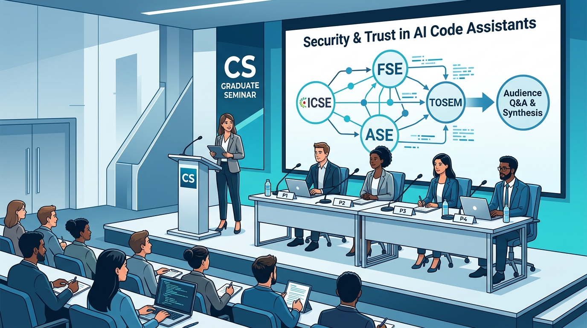

# Advanced Software Engineering

### Course Syllabus & Roadmap — Fall 2026 (115-1)

**Graduate Seminar (進階軟體工程)**  
Instructor: Prof. Nien-Lin Hsueh (薛念林 教授)  
Department of Information Engineering and Computer Science · Feng Chia University

---
## Course Overview & Philosophy

- **Core Methodologies & The Impact of AI:**
  - Master **foundational software engineering methodologies** across the complete lifecycle (specification, architecture, validation, evolution).
  - Explore how **Generative & Agentic AI** fundamentally impacts and reshapes every software activity.
- **Graduate-Level Pedagogy: Research & Empirical Practice:**
  - **Scholarly Exploration:** Investigate cutting-edge research topics and empirical studies through **paper presentations and panel discussions**.
  - **Hands-on Experimentation:** Experience software development directly through **practical implementation and empirical experiments**.
- **Key Course Attributes:**
  - **Target Audience:** Graduate students and motivated senior undergraduates.
  - **Language of Instruction:** English-friendly / bilingual materials.
  - **Interactive Pedagogy:** Concept Check Questions (CCQ) with real-time polling, architectural critiques, and collaborative discussions.

---
## Course Learning Objectives (CLOs)

- **1. Master Core SE Disciplines:**
  - Understand lifecycles, requirements, OO modeling, and architecture.
- **2. Quality-First & Empirical Mindset:**
  - Internalize testing (black-box, white-box), CI/CD, and experiments.
- **3. Responsible & Rigorous AI Integration:**
  - Steer AI coding agents, validate generated code, and mitigate technical debt.
- **4. Scholarly & Professional Communication:**
  - Deconstruct peer-reviewed literature, run panels, and deliver post-mortems.

---
## Curriculum Roadmap: Five Core Modules

- **Module 1: Foundations (Week 1)** — 1968 Software Crisis to Modern SE.
- **Module 2: Processes & Requirements (Weeks 2–4)** — Agile, Scrum, DevOps, Spec-Driven AI.
- **Module 3: Design & Modeling (Weeks 5–9)** — SOLID, Patterns, UML, Architecture, **Midterm**.
- **Module 4: QA & Testing (Weeks 10–13)** — Black/white box, coverage, quality models.
- **Module 5: Empirical SE & Capstone (Weeks 14–16)** — Controlled experiments, demos & panels.

> ⚠️ **Week 3 (09/28) & Week 7 (10/26): National Holidays (No class)**

---
## Grading Scheme

- **25% — Midterm Exam (Nov. 2nd)**
  - Part I Evaluation (Core principles & software design)
- **25% — Final Exam (Dec. 7th)**
  - Part II Evaluation (Testing, QA models & empirical methods)
- **20% — Attendance & In-Class Engagement**
  - Active presence, live CCQ polling, discussions & Q&A
- **30% — Final Capstone Project**
  - Execution of Track 1 (Panel), Track 2 (Prototype), or Track 3 (Experiment)

---
## Final Capstone Project: Three Flexible Tracks

- **Team Collaboration:** Teams of **2~4 members** (presentation time: ~25 min/person).
- **Track 1: Academic Paper Panel Discussion**
  - Unified theme panel presenting top papers (*ICSE, FSE, ASE, TSE, TOSEM*).
  - Student moderator synthesizes trade-offs and leads audience Q&A.
- **Track 2: Software System Prototype & Post-Mortem**
  - Live vertical-slice demo + in-depth SE post-mortem (Clean Architecture, CI/CD).
- **Track 3: Empirical Software Engineering Experiment**
  - Scientific benchmark ($RQ_1, RQ_2$), statistical telemetry, and replication package.

---
## Track 1: Academic Paper Panel — How It Works

- **What is an Academic Paper Panel?**
  - Similar to paper presentations, but with a **unified theme and strong narrative coherence**.
  - Four panelists present four related papers (*ICSE, FSE, ASE, TSE, TOSEM*).
  - A **Student Moderator** opens with a theme overview, connects the presentations, provides a final synthesis, and leads audience Q&A.
- **Theme Example: "Security & Trust in Generative AI Code Assistants"**
  - **Moderator Intro:** Why AI code security matters to enterprise systems.
  - **Panelist 1 (*ICSE*):** Prevalence and taxonomy of CWE flaws in Copilot code.
  - **Panelist 2 (*FSE*):** Automated hallucination detection in generated tests.
  - **Panelist 3 (*ASE*):** Developer over-reliance & cognitive bias in AI code reviews.
  - **Panelist 4 (*TOSEM*):** Code licensing contamination and privacy leakages.
  - **Moderator Synthesis & Q&A:** Synthesizing trade-offs and moderating class debate.

---
<!-- _class: title-image-slide -->

## Track 1: Academic Paper Panel — Visual Setup & Flow

  

---

## Track 2: System Prototype & Post-Mortem — Examples

- **System Example: "Smart Food Ordering & Real-Time Delivery Service"**
  - **Thin Vertical Slice:**
    - Customer cart & order placement → Real-time kitchen dispatch webhook → Driver location tracking simulation → Order fulfillment status (secondary billing, reviews, and catalog mocked).
  - **Engineering Rigor:**
    - **Clean Architecture:** Strict separation between Domain entities, Use Cases, and Web/DB adapters.
    - **Event-Driven & Async:** Message queues for order events, schema validation with Pydantic/Zod.
    - **Automated CI/CD & Testing:** Dockerized testing environment with >85% unit and integration test coverage.
  - **SE Post-Mortem Presentation:**
    - Live vertical-slice demo, followed by an in-depth engineering post-mortem:
    - Concurrency bottlenecks, AI coding logs, prompt reproducibility, and architectural trade-offs.

---
## Track 3: Empirical SE Experiment — Examples

- **Study Example A: "Benchmarking Open-Source vs. Commercial Coding LLMs"**
  - **Objective:** Controlled benchmark evaluating code correctness and security across models.
  - **Research Questions:**
    - $RQ_1$: Do open-source models (e.g., DeepSeek-Coder, Llama-Code) inject higher rates of CWE flaws than GPT-4o on HumanEval-Security?
    - $RQ_2$: How does test-driven iterative prompting affect pass@k accuracy and token costs?
  - **Deliverables:** Curated benchmark datasets, automated evaluation scripts, and replication Docker repo.
- **Study Example B: "Empirical Evaluation of Automated Program Repair (APR) in CI"**
  - **Objective:** Measure real-world patch correctness vs. plausible test-overfitting across APR tools.
  - **Research Questions:**
    - $RQ_1$: What percentage of LLM-generated bug fixes are semantically sound vs. merely overfitting?
    - $RQ_2$: How does token context window depth impact multi-file bug repair success?
  - **Deliverables:** Defects4J benchmark replication suite, execution telemetry logs, and threat analysis.

---
## Academic Integrity & Generative AI Policy

- **Generative AI is Welcomed, but Must Be Steered Responsibly:**
  - Actively leverage modern AI tools (Claude, Cursor, ChatGPT, Copilot).
- **Rule of Transparency:**
  - Document where and how AI was utilized (prompts, edits, test generation).
- **The "Accountability" Rule:**
  - **You are 100% responsible** for correctness, security, and architectural integrity.
  - Blindly accepting hallucinated code or fabricated citations results in severe penalties.
- **Strict Prohibition of Plagiarism:**
  - Uncredited copying of external code, text, or papers is strictly prohibited.

---
## References & Recommended Resources

### 📚 Core Academic References
- Ian Sommerville, *Software Engineering*, 10th Ed. (Pearson)
- Robert C. Martin, *Clean Architecture* (Prentice Hall)
- Selected research papers from *ACM/IEEE ICSE, IEEE TSE, ACM TOSEM*

### 🛠️ Digital Toolchains
- **Version Control & CI/CD:** GitHub, GitHub Actions, Docker.
- **Interactive Polling:** NickEduPocket CCQ System (`nickedupocket`).
- **Slide Engine:** Marp Markdown Slide Engine.

<!--
Looking at Slide 11, here are our primary course resources and tools.

Our core textbook is Ian Sommerville's classic *Software Engineering*, 10th Edition. For software design, we also reference Uncle Bob's *Clean Architecture*.

We will also read selected papers from top-tier venues like ICSE, TSE, and TOSEM.

For our digital toolchains:
All project collaboration and CI/CD pipelines will use GitHub, GitHub Actions, and Docker.
For live classroom polling, we use our own NickEduPocket CCQ system.
And all slides and handouts are built with the Marp Markdown Slide Engine.

Now, let's examine how our course materials are structured and co-created on Slide 12.
-->
---
## Course Materials Architecture & Progressive Evolution

- **Three-Pillar Learning Materials Architecture:**
  - **1. In-Depth Lecture Notes:** Markdown & A4 PDFs for foundational rigor and deep dives.
  - **2. 16:9 Visual Slide Decks:** High-level conceptual diagrams and classroom flow.
  - **3. Real-Time Interactive CCQs:** Micro-assessments with instant mobile QR polling.
- **Human-in-the-Loop AI Collaboration:**
  - Pedagogical design led by instructor; AI assists with scenario synthesis and bilingual polishing.
- **Progressive Updates:** Materials are updated weekly alongside class pacing.

<!--
Now, let's move to Slide 12: Course Materials Architecture and how our learning resources are built.

Our course materials are built around three interconnected pillars:
First, in-depth lecture notes in both Markdown and formatted A4 PDFs, covering comprehensive theories, engineering context, and case studies.
Second, visual 16:9 presentation slides formatted with Marp for our classroom lectures and high-level reviews.
Third, real-time interactive Concept Check Questions—or CCQs—integrated with QR codes and our NickEduPocket cloud platform for live classroom polling.

Here is an essential note on how these materials are made: in the true spirit of modern software engineering, portions of these lecture materials are co-created through human-AI collaboration between the instructor and generative AI models like Gemini and Claude.
The instructor directs the syllabus structure, designs the pedagogical trajectory, and rigorously validates technical accuracy, while AI tools assist with drafting, synthesizing rich scenarios, and bilingual polishing.

Finally, please note that this repository is a living, evolving project! The materials are not completely finalized at the start of the semester.
Instead, lecture notes, slides, and exercise sets will be rolled out and updated progressively week by week to align with our classroom discussions.
If you spot any typos or have suggestions for improvements, please feel free to let me know—your input will directly improve the materials for everyone!

Let's now look at your action items for Week 1 on Slide 13.
-->
---
## Getting Started & Action Items for Week 1

- **Immediate Next Steps:**
  - 1. Review the Three Capstone Tracks (Panel, Prototype, Experiment).
  - 2. Brainstorm topics and start reaching out to teammates (teams of ~4).
  - 3. Bring your laptop/mobile device to class for interactive CCQ polls.
- **Course Inquiries & Office Hours:**
  - **Instructor:** Prof. Nien-Lin Hsueh (薛念林 教授)
  - **Office:** Dept. of Information Engineering & Computer Science
  - **Contact:** Via course LMS or email

<!--
Here are your immediate action items for this week:

First, review the three Capstone tracks with your classmates and decide which track fits your interests.

Second, begin team formation. Target teams of approximately four members and start discussing topics.

Third, bring your laptop, tablet, or smartphone to every class so you can participate in our interactive CCQ polls.

Finally, my door is always open. You can find me in the Department of Information Engineering and Computer Science, or reach out by email or the course LMS.

Let's wrap up on our final slide!
-->
---
<!-- _class: lead -->

# Questions & Discussion

### Welcome to Advanced Software Engineering!

Let's build reliable, elegant, and impactful software systems together.

<!--
And that brings us to the end of our course syllabus presentation!

Does anyone have any questions regarding the grading scheme, the project tracks, or teaming rules? Please feel free to ask now!

Once again, welcome to Advanced Software Engineering. I am excited to work with you this semester.

Let's build reliable, elegant, and impactful software systems together.

Thank you everyone, and let's dive into Chapter 1!
-->

