<!-- _class: lead -->
<!-- header: '' -->

# **Software Engineering**

### Chapter 4: System Modeling & Unified Architecture

**Prof. Nien-Lin Hsueh**
Department of Information Engineering and Computer Science
Feng Chia University

<!--
Welcome to Chapter 4: System Modeling and Unified Architecture.

In Chapter 3, we studied how to discover, analyze, and specify software requirements in natural language and user stories. But natural language is notoriously ambiguous, incomplete, and difficult to translate directly into robust code.

Today, we take the crucial leap from abstract requirements to formal software models. We will explore what system modeling is, understand its core perspectives, study the history and creators of the Unified Modeling Language, and examine each fundamental UML diagram in depth.

To summarize this slide, remember this key takeaway: System modeling creates the formal conceptual bridge between human requirements and executable software code.
-->

---

<!-- _class: outline-slide -->

## Chapter 4: Roadmap & Core Curriculum

<div class="outline-columns">
<div>
<h3>Part 1: Foundations & Core Models</h3>
<ul>
<li><b>4.1 Foundations of Modeling:</b> Abstraction, 4 perspectives, 5 essential diagrams, and the elephant parable.</li>
<li><b>4.2 The UML:</b> The Method Wars, Three Amigos trinity (Jacobson, Rumbaugh, Booch), and OMG standardization.</li>
<li><b>4.3 Functional & Use Case Models:</b> Actor goals, system boundaries, include vs. extend, and AI prompt guidelines.</li>
<li><b>4.4 Structural & Class Models:</b> Domain classes, visibility, multiplicity, whole-part coupling, and AI prompt guidelines.</li>
<li><b>4.5 Interaction & Sequence Diagrams:</b> Chronological messages, lifelines, activations, and AI prompt guidelines.</li>
</ul>
</div>
<div>
<h3>Part 2: Workflows, Architecture & Synthesis</h3>
<ul>
<li><b>4.6 Process & Activity Diagrams:</b> Concurrent workflows, decisions, forks/joins, swimlanes, and AI prompt guidelines.</li>
<li><b>4.7 Behavioral & State Machines:</b> Reactive systems, event triggers, actions vs. activities, and AI prompt guidelines.</li>
<li><b>4.8 Text-Based Modeling with PlantUML:</b> Code-as-architecture, syntax quick reference, and multi-diagram pipelines.</li>
<li><b>4.9 Conceptual Recap & Synthesis:</b> Core principles review, fill-in-the-blank quiz, and references.</li>
</ul>
</div>
</div>

<!--
Here is our reorganized roadmap for Chapter 4.

In Part 1 on the left, we explore the essential foundations and perspectives of modeling, trace the emergence and pioneers of UML, analyze user-driven use cases, and define static domain class architectures.

In Part 2 on the right, we examine dynamic object interactions and BCE sequence flows, model reactive event-driven state machines, master AI-assisted declarative diagramming, and synthesize key takeaways.

To summarize this slide, remember this key takeaway: This chapter provides a rigorous, end-to-end journey through structural, behavioral, and AI-assisted system modeling.
-->

---

<!-- _class: lead -->
<!-- header: '4.1 Foundations of System Modeling' -->

# **4.1 Foundations of System Modeling**

> "A language that doesn't affect the way you think about programming is not worth knowing."
> — *Alan Perlis*

<!--
We begin with Module 4.1: Foundations of System Modeling.

Before exploring diagrams and notation, we must first understand: What is a model? Why do engineers build models before writing code? And why is multi-perspective modeling essential for managing software complexity?

To summarize this slide, remember this key takeaway: System modeling provides purposeful abstractions that allow engineers to master software complexity.
-->

---

## What is System Modeling?

> "System modeling is the process of developing abstract models of a system, with each model presenting a different view or perspective of that system."
> — *Ian Sommerville, Software Engineering (10th ed.)*

- **Essential Principles of Modeling:**
  - **Abstraction:** Hides non-essential implementation details to highlight critical architectural structures, data flows, and dependencies.
  - **Multiple Perspectives:** No single diagram can explain a complex software system. Different stakeholders require different views.
  - **Communication & Verification:** Serves as a universal visual grammar between product managers, system architects, software developers, and QA engineers.
  - **Blueprint for Implementation:** Provides the formal structural and behavioral specification from which executable code and database schemas are developed.

<!--
Let's establish what system modeling actually is.

Ian Sommerville defines it as developing abstract models, with each model presenting a different perspective of the system.

Notice the word 'abstraction.' If a blueprint of a house showed every single molecule in the concrete, you couldn't build the house! You need an electrical blueprint, a plumbing blueprint, and a structural blueprint.

Similarly, in software engineering, no single diagram can represent an entire system. We need multiple complementary perspectives to manage complexity.

To summarize this slide, remember this key takeaway: System modeling creates purposeful abstractions across multiple complementary perspectives to master software complexity.
-->

---

<!-- _class: title-image-slide -->

## The Parable of the Elephant & Multiple Perspectives

<div class="image-wrapper">
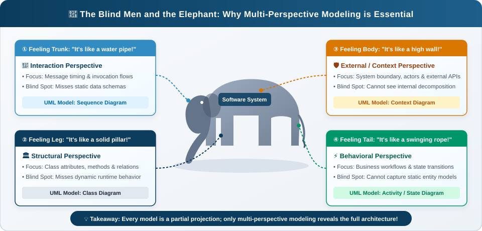
</div>

<!--
This diagram captures one of the most famous philosophical lessons in software engineering: The Blind Men and the Elephant.

In the ancient parable, the blind man feeling the trunk insists the elephant is like a water pipe or snake. The one feeling the leg insists it is a solid tree trunk or pillar. The one touching the body claims it is a wall, and the one feeling the tail claims it is a rope. Each touches an undeniable local truth, yet all fall victim to the fallacy of composition.

Software systems are just like the elephant: invisible, vast, and complex.
If you only look at Class Diagrams, you only feel the legs—you know the static attributes and associations, but have no idea how data moves over time.
If you only look at Sequence Diagrams, you only touch the trunk—you see message interactions, but miss boundary perimeters and data schemas.
If you only look at State Diagrams, you only feel the tail—you see event reactions, but miss domain relationships.

This is why we cannot use a single diagram to describe an entire system!
Software engineering requires four complementary perspectives: External (Context), Interaction, Structural, and Behavioral.
Only by synthesizing multiple models can we see the true, complete architecture of the software.

To summarize this slide, remember this key takeaway: Any single model is merely a dimensional projection of the system; only multi-perspective modeling reveals the full architectural reality.
-->

---

## 4 Core System Modeling Perspectives

- **1. External Perspective:**
  - Models the environment, external partners, and operational context of the system.
  - Defines the strict system perimeter: what is built internally vs. what is delegated to third parties.
- **2. Interaction Perspective:**
  - Models dynamic communications between external actors and the system, or message exchanges between internal collaborating objects.
- **3. Structural Perspective:**
  - Models the static architecture of system data, object classes, attributes, methods, and relationships independent of runtime execution order.
- **4. Behavioral Perspective:**
  - Models the dynamic execution behavior, sequential business workflows, and reactive discrete state transitions in response to external events.

<!--
The software engineering standard organizes system models into four core perspectives:

First, the External Perspective: Where does the system begin and end? What external cloud services and human users touch it?
Second, the Interaction Perspective: How do actors and software objects communicate across time?
Third, the Structural Perspective: What are the static data schemas, classes, attributes, and associations?
Fourth, the Behavioral Perspective: How does the system respond dynamically to inputs, workflows, and reactive events?

Every software engineer must know which perspective to invoke depending on the engineering problem at hand.

To summarize this slide, remember this key takeaway: The four modeling perspectives are External, Interaction, Structural, and Behavioral.
-->

---

## 5 Essential UML Models in Modern Practice

| Model / Diagram | Section | Perspective | Nature | Primary Engineering Role |
| :--- | :---: | :--- | :--- | :--- |
| **1. Use Case Model** | 4.3 | Interaction | Functional Contract | Defines system boundary, actor goals, and scope |
| **2. Class Model** | 4.4 | Structural | Static Backbone | Specifies domain entities, attributes, and relationships |
| **3. Sequence Diagram** | 4.5 | Interaction | Dynamic Chronology | Traces runtime message passing and BCE responsibilities |
| **4. Activity Diagram** | 4.6 | Behavioral | Dynamic Workflow | Models business processes, fork/join concurrency & swimlanes |
| **5. State Machine Diagram** | 4.7 | Behavioral | Reactive Lifecycle | Captures event-driven states, transitions & invariants |

> **Implementation & Acceleration:** Unified via **4.8 PlantUML** (Code-as-Architecture) with **AI Prompt Guidelines** integrated in each model.

<!--
Out of the 14 diagrams defined in UML 2.5, this chapter focuses on the five essential models that form the backbone of modern software architecture:

First, Section 4.3 covers Use Case Models, establishing functional boundaries and stakeholder contracts.
Second, Section 4.4 explores Class Models, defining static domain entities, attributes, and object relationships.
Third, Section 4.5 examines Sequence Diagrams, tracing chronological runtime message exchanges and Boundary-Control-Entity responsibilities.
Fourth, Section 4.6 investigates Activity Diagrams, visualizing business workflows, fork/join concurrency, and swimlanes.
Fifth, Section 4.7 analyzes State Machine Diagrams, modeling reactive object lifecycles, states, and guard invariants.

Each model incorporates dedicated AI prompting guidelines and Food Delivery prompt examples, unified by PlantUML Code-as-Architecture in Section 4.8.

To summarize this slide, remember this key takeaway: Mastering these five core UML models equips engineers to specify, design, and verify software from external, interaction, structural, and behavioral perspectives.
-->

---

### Concept Check Question 1
<!-- id: ase-ch04-ccq1 -->
<div class="ccq-columns">
<div class="ccq-text">

A software architect wants to define **how domain entity data is structured and how classes inherit and associate with each other**, completely independent of runtime execution order. Which modeling perspective should the architect adopt?

- **A.** External Perspective
- **B.** Interaction Perspective
- **C.** Structural Perspective
- **D.** Behavioral Perspective

</div>
<div class="ccq-logo">
    <a href="https://nlhsueh.github.io/nickedupocket/#/student/ase-ch04-ccq1" target="_blank"></a>
  </div>
</div>

<!--
Let's check our understanding of the four modeling perspectives with Concept Check Question 1.

Review the perspectives:
External models the environment and boundaries.
Interaction models message exchanges between actors and objects over time.
Behavioral models state transitions and dynamic workflow execution.
Structural models the static organization of data, classes, attributes, and relationships.

The correct answer is Option C, Structural Perspective!

To summarize this slide, remember this key takeaway: Structural models capture the static architecture of data and class relationships independent of execution timing.
-->

---

<!-- _class: lead -->
<!-- header: '4.2 The Unified Modeling Language (UML)' -->

# **4.2 The Unified Modeling Language (UML)**

> "A standardized visual grammar transformed software engineering from proprietary silos into a global discipline."

<!--
We now advance to Module 4.2: The Unified Modeling Language (UML).

Having explored the foundations and perspectives of modeling, we examine how the software industry resolved the chaotic 1990s Method Wars, united the Three Amigos at Rational Software, and established UML through the Object Management Group as the global lingua franca of software design.

To summarize this slide, remember this key takeaway: UML provides the universal visual standard for object-oriented software modeling.
-->

---

## The Need for Standardization: The 1990s "Method Wars"

- **The Rise of Object-Oriented Programming (Late 1980s – Early 1990s):**
  - The software industry transitioned from procedural code (C, Pascal) to object-oriented paradigms (C++, Smalltalk).
  - Software engineers urgently needed visual notations to represent classes, objects, and relationships.
- **The "Method Wars" Era:**
  - Over **50 competing OO modeling notations** flooded the commercial market.
  - Engineers argued fiercely over whether classes should be clouds, rectangles, or ovals; whether inheritance should be an open triangle, filled arrow, or dashed line.
  - **Severe Industry Fragmentation:** Companies could not exchange models, CASE tools were incompatible, and developers had to relearn notation whenever they switched jobs.

<!--
Now, if modeling is so essential, how did the software industry agree on a single language?

In the late 1980s and early 1990s, object-oriented programming was exploding into the mainstream with C++ and Smalltalk. But a massive crisis emerged: the so-called 'Method Wars.'

Over 50 different experts invented their own modeling notations! Grady Booch used clouds for classes; James Rumbaugh used structured rectangles; Ivar Jacobson introduced use cases; Peter Coad and Edward Yourdon had yet another notation.

It was an architectural Tower of Babel. If you worked at IBM, you drew clouds; if you worked at GE, you drew boxes. CASE tools couldn't interoperate, and software designs were trapped in proprietary silos.

To summarize this slide, remember this key takeaway: The 1990s Method Wars fragmented the software industry with over 50 incompatible modeling notations.
-->

---

## Unification & Standardization: From Rational to OMG

<div class="content-columns">
<div class="content-text">

- **1994 – Unification Begins at Rational Software:**
  - Jim Rumbaugh joined Grady Booch at Rational to merge the Booch Method and OMT into the "Unified Method" (v0.8).
- **1995 – The Three Amigos Assemble:**
  - Ivar Jacobson joined Rational, bringing his revolutionary **Use Case** methodology (OOSE).
- **1997 – OMG International Standardization:**
  - Submitted to the **Object Management Group (OMG)**; unanimously adopted as **UML 1.1** in November 1997.
- **2005 – UML 2.0 Major Architecture Overhaul:**
  - Expanded from 9 to 13 (and later 14) diagram types with formal execution metamodels.

</div>
<div class="content-figure">

<div class="name-card">
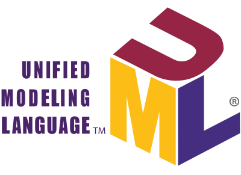
<div class="name-card-caption">
<span class="name-card-name">Unified Modeling Language</span>
<span class="name-card-cc"><a href="https://www.omg.org/uml/" target="_blank">Object Management Group (OMG)</a></span>
</div>
</div>

</div>
</div>

<!--
How was this crisis resolved? Through an unprecedented merger of minds at Rational Software.

In 1994, Jim Rumbaugh left General Electric to join Grady Booch at Rational. They combined Booch's design strengths with Rumbaugh's analysis rigor. A year later, Ivar Jacobson joined them, contributing his use cases and architectural components.

Together, they were affectionately dubbed 'The Three Amigos.'

Instead of keeping their language proprietary, Rational submitted UML to the Object Management Group, an open international standards consortium. In November 1997, UML 1.1 became the official world standard for software modeling.

To summarize this slide, remember this key takeaway: Rational Software unified the Three Amigos, leading to OMG's adoption of UML as the definitive global standard.
-->

---

## Pioneers of UML: Grady Booch

<div class="content-columns">
<div class="content-text">

- **Role & Distinctions:**
  - Chief Scientist, Rational Software; IBM Fellow; ACM Fellow.
- **Pioneered Methodology:**
  - **The Booch Method** and seminal text: *Object-Oriented Analysis and Design with Applications*.
- **Core Contribution to UML:**
  - Focused heavily on **concrete software design**, module decomposition, class abstractions, and architectural patterns.
  - Championed visual expressiveness for implementation-level object structures and code mapping.
- **Famous Architectural Maxim:**
  > *"Clean code always looks like it was written by someone who cares."*

</div>
<div class="content-figure">

<div class="name-card">

<div class="name-card-caption">
<span class="name-card-name">Grady Booch</span>
<span class="name-card-cc"><a href="https://en.wikipedia.org/wiki/Grady_Booch" target="_blank">Rational Software / IBM Fellow</a></span>
</div>
</div>

</div>
</div>

<!--
Meet the first of the Three Amigos: Grady Booch.

Grady Booch is an IBM Fellow and was Chief Scientist at Rational Software. He authored the seminal textbook 'Object-Oriented Analysis and Design with Applications.'

Booch's unique strength was in concrete software design—how classes, inheritance, polymorphism, and modules map directly into executable code architecture. His visual notations were famous for their cloud-shaped class boundaries, which later evolved into UML's structured class boxes.

To summarize this slide, remember this key takeaway: Grady Booch championed object-oriented design abstractions and concrete code architecture.
-->

---

## Pioneers of UML: James Rumbaugh

<div class="content-columns">
<div class="content-text">

- **Role & Distinctions:**
  - Lead Researcher, General Electric (GE) Global R&D; Rational Software; IBM.
- **Pioneered Methodology:**
  - **Object Modeling Technique (OMT)** and book: *Object-Oriented Modeling and Design*.
- **Core Contribution to UML:**
  - Emphasized rigorous **domain analysis**, semantic data modeling, and entity-relationship mapping.
  - Pioneered the synthesis of object structure with David Harel's **Statecharts** to model dynamic reactive systems.
- **Famous Architectural Maxim:**
  > *"You cannot build great software without understanding domain truth."*

</div>
<div class="content-figure">

<div class="name-card">

<div class="name-card-caption">
<span class="name-card-name">James Rumbaugh</span>
<span class="name-card-cc"><a href="https://en.wikipedia.org/wiki/James_Rumbaugh" target="_blank">GE Research / Rational Software</a></span>
</div>
</div>

</div>
</div>

<!--
Meet the second Amigo: Dr. James Rumbaugh.

Jim Rumbaugh led software technology research at General Electric Corporate R&D before joining Rational Software in 1994. His Object Modeling Technique, or OMT, was widely regarded as the most mathematically sound analysis methodology in the industry.

Rumbaugh's genius was in domain analysis—mapping real-world entities, database schemas, associations, and state machines. When Rumbaugh and Booch united, they bridged the gap between analytical problem modeling and concrete software design.

To summarize this slide, remember this key takeaway: James Rumbaugh established rigorous domain analysis, data relationships, and statechart modeling in UML.
-->

---

## Pioneers of UML: Ivar Jacobson

<div class="content-columns">
<div class="content-text">

- **Role & Distinctions:**
  - Lead Architect, Ericsson; Founder, Objectory AB; Rational Software; SEMAT Pioneer.
- **Pioneered Methodology:**
  - **Object-Oriented Software Engineering (OOSE)**.
- **Core Contribution to UML:**
  - **Inventor of Use Cases (1986):** Revolutionized requirements by anchoring system architecture to measurable user goals.
  - Introduced the **Boundary–Control–Entity (BCE)** robustness analysis pattern and component-based architecture.
- **Famous Architectural Maxim:**
  > *"A system that has no users has no reason to exist. Model user goals first."*

</div>
<div class="content-figure">

<div class="name-card">

<div class="name-card-caption">
<span class="name-card-name">Ivar Jacobson</span>
<span class="name-card-cc"><a href="https://en.wikipedia.org/wiki/Ivar_Jacobson" target="_blank">Ericsson / Objectory / Rational</a></span>
</div>
</div>

</div>
</div>

<!--
Meet the third Amigo: Dr. Ivar Jacobson.

Working at Ericsson on massive telephone switching systems and later founding Objectory AB, Jacobson invented the concept of 'Use Cases' in 1986.

Before Jacobson, software requirements were dry, ambiguous specifications of functional statements. Jacobson flipped the perspective entirely onto the human user: who is using the system, and what business goal are they trying to accomplish? He also introduced the Boundary-Control-Entity pattern that still anchors modern software architecture.

To summarize this slide, remember this key takeaway: Ivar Jacobson invented Use Cases and the BCE pattern, centering software architecture around user goals.
-->

---

## The Three Amigos: The Trinity of Software Modeling

<div class="three-columns">
<div class="card">
<h3>Ivar Jacobson</h3>
<h4>The "Why" (Goal / User)</h4>
<ul>
<li><b>Use Case Driven:</b> What goals do external actors achieve?</li>
<li><b>BCE Robustness:</b> Separating UI boundaries from data entities.</li>
<li><b>Component Contracts:</b> Reusable subsystem architectures.</li>
</ul>
</div>
<div class="card">
<h3>James Rumbaugh</h3>
<h4>The "What" (Domain Data)</h4>
<ul>
<li><b>Domain Analysis:</b> What real-world concepts exist?</li>
<li><b>Class & Data Schemas:</b> Structural entity relationships.</li>
<li><b>State Machines:</b> Reactive event-driven lifecycles.</li>
</ul>
</div>
<div class="card">
<h3>Grady Booch</h3>
<h4>The "How" (Design & Code)</h4>
<ul>
<li><b>Object-Oriented Design:</b> How do classes collaborate?</li>
<li><b>Macro Architecture:</b> Layered module decomposition.</li>
<li><b>Implementation Map:</b> Direct code translation into OOP.</li>
</ul>
</div>
</div>

> 📌 **Architectural Synthesis:** Jacobson captures **Why** the system exists; Rumbaugh models **What** domain concepts exist; Booch designs **How** components execute in code.

<!--
Notice how the Three Amigos complemented each other with flawless harmony:

Ivar Jacobson answered WHY the system exists from the user's perspective through Use Cases.
James Rumbaugh mapped WHAT data entities and states exist in the problem domain.
Grady Booch designed HOW those entities collaborate in executable software code.

This synthesis formed the bedrock not only of UML, but also of modern software engineering methodologies like the Rational Unified Process (RUP).

To summarize this slide, remember this key takeaway: UML harmonizes the user goals (Jacobson), domain data (Rumbaugh), and code architecture (Booch).
-->

---

### Concept Check Question 2
<!-- id: ase-ch04-ccq2 -->
<div class="ccq-columns">
<div class="ccq-text">

Which of the "Three Amigos" was specifically renowned for inventing **Use Cases (1986)** to anchor software architecture to tangible user goals?

- **A.** Grady Booch
- **B.** James Rumbaugh
- **C.** Ivar Jacobson
- **D.** Martin Fowler

</div>
<div class="ccq-logo">
    <a href="https://nlhsueh.github.io/nickedupocket/#/student/ase-ch04-ccq2" target="_blank"></a>
  </div>
</div>

<!--
Let's check our understanding of UML history with Concept Check Question 2.

Look at the options:
Grady Booch developed the Booch Method focusing on object-oriented design and abstractions.
James Rumbaugh developed OMT focusing on domain analysis and object modeling.
Martin Fowler is a renowned author who wrote 'UML Distilled' and refactoring guides, but was not one of the Three Amigos.

The correct answer is Option C, Ivar Jacobson! Jacobson introduced Use Cases at Ericsson in 1986 to ensure software architectures directly fulfill user-driven goals.

To summarize this slide, remember this key takeaway: Ivar Jacobson invented Use Cases, shifting requirements modeling toward user-centric goals.
-->

---

<!-- _class: lead -->
<!-- header: '4.3 Functional & Use Case Models' -->

# **4.3 Functional & Use Case Models**

> "A use case is a contract for behavior between the system and its actors to achieve a measurable business goal."
> — *Alistair Cockburn*

<!--
We now advance to Module 4.3: Functional and Use Case Modeling.

Invented by Ivar Jacobson, Use Cases are the industry standard for capturing functional scope. Instead of writing unstructured requirement paragraphs, use cases structure requirements around actors pursuing concrete business goals.

In this section, we master the visual syntax of use case modeling—distinguishing business value from technical clicks, establishing system perimeter boundaries, and avoiding common anti-patterns.

To summarize this slide, remember this key takeaway: Use cases specify the functional contracts between external actors and the system under design.
-->

---

<!-- _class: full-image-slide -->

<div class="centered-image">
  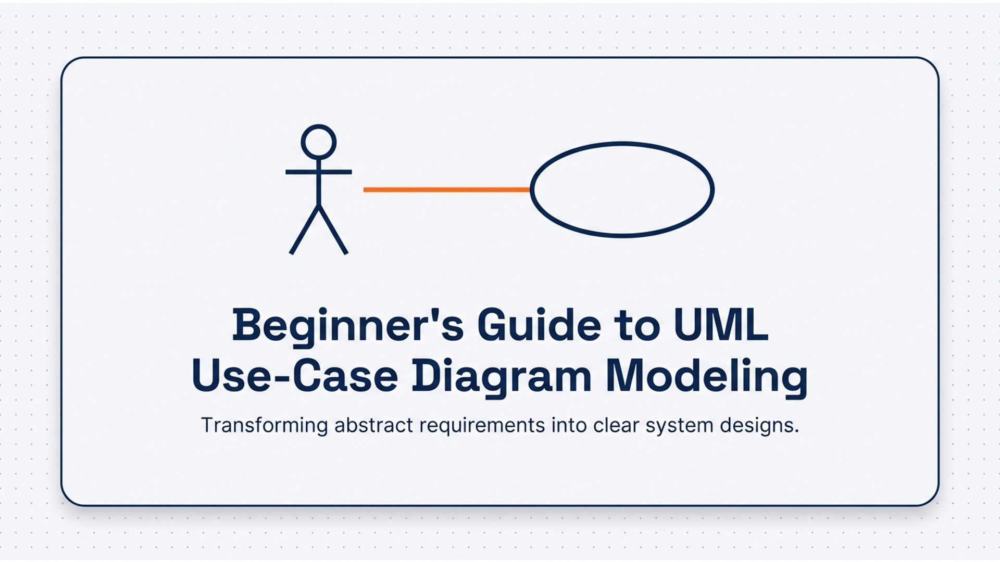
</div>

<!--
Look at this foundational overview: 'Beginner's Guide to UML Use-Case Diagram Modeling.'

Use case diagrams provide the bird's-eye architectural view of system functionality. They transform messy, ambiguous natural-language requirements into clean, structured system boundaries.

Notice the fundamental division: external human users and automated systems act outside, while system capabilities reside within the formal boundary.

To summarize this slide, remember this key takeaway: Use case diagrams provide the high-level functional contract connecting user intentions to system boundaries.
-->

---

<!-- _class: full-image-slide -->

<div class="centered-image">
  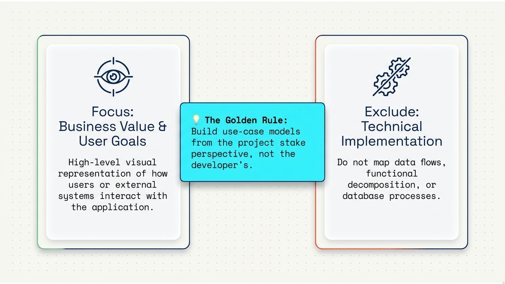
</div>

<!--
Look at this essential principle: 'Focus on Business Value and User Goals.'

A critical mistake beginners make is treating use cases like a UI clickstream. Notice: 'Log In' or 'Click Button' are trivial interaction steps, not independent use cases!

A genuine use case delivers discrete, measurable business value to the actor—such as 'Check Out Order', 'Transfer Funds', or 'Book Hotel Room'.

To summarize this slide, remember this key takeaway: Model high-level user goals that deliver measurable business value, not granular UI clicks or technical sub-steps.
-->

---

<!-- _class: full-image-slide -->

<div class="centered-image">
  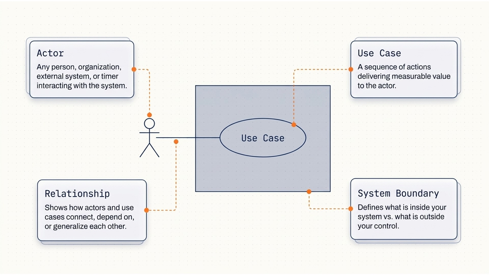
</div>

<!--
Now examine the 'Actor Taxonomy.'

Who or what can be an actor? An actor is anything external that interacts with the system:
1. Primary Human Actors: users who initiate transactions to achieve their goals, like Customers or Students.
2. Secondary Supporting Actors: service providers, like Bank Payment Gateways or Delivery Couriers.
3. Automated Timers & Daemons: cron jobs that trigger scheduled events like midnight batch reconciliation.

To summarize this slide, remember this key takeaway: Actors represent external roles—including humans, third-party APIs, and system timers—interacting with the boundary.
-->

---

<!-- _class: full-image-slide -->

<div class="centered-image">
  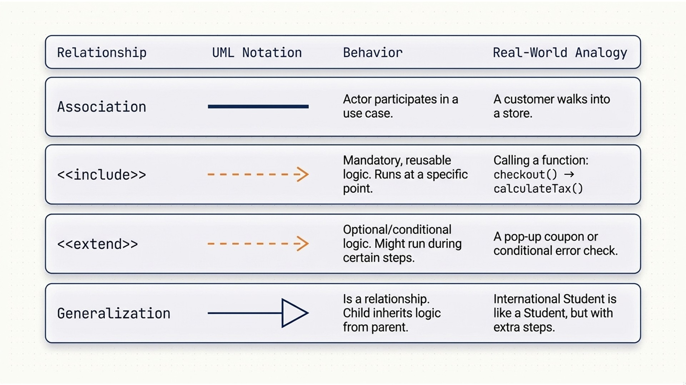
</div>

<!--
Here is the core 'Relationship Matrix' governing use case connections:

1. Association: A solid line linking an Actor to a Use Case, showing who participates in the goal.
2. Include (<<include>>): Mandatory shared sub-behavior. The base case cannot complete without executing the included case.
3. Extend (<<extend>>): Conditional, optional extension hook. The extending case runs only when specific extension points or guard criteria are met.
4. Generalization: An open hollow triangle showing role or case specialization.

To summarize this slide, remember this key takeaway: Distinguish mandatory inclusions from conditional extensions and role generalizations.
-->

---

<!-- _class: full-image-slide -->

<div class="centered-image">
  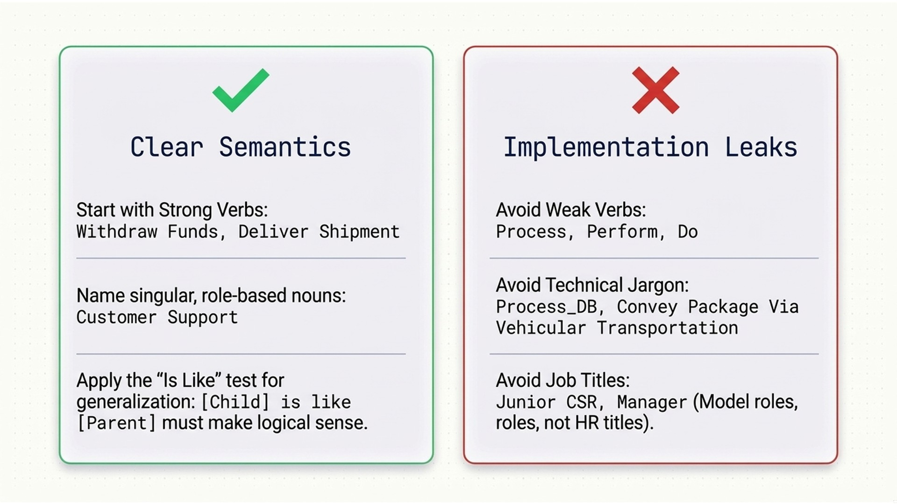
</div>

<!--
Let's study 'Clear Naming Semantics' for use cases and actors:

For Use Cases: Always use an active [Strong Verb] + [Domain Noun]—for example, 'Withdraw Funds', 'Deliver Shipment', or 'Enroll in Course'. Avoid vague verbs like 'Manage' or 'Do Process'.

For Actors: Always use singular, role-based nouns—such as 'Applicant' or 'Customer', rather than job titles or department names like 'HR Division' or 'Employees'.

To summarize this slide, remember this key takeaway: Name use cases with active verbs and domain nouns, and name actors as singular roles.
-->


---

<!-- _class: full-image-slide -->

<div class="centered-image">
  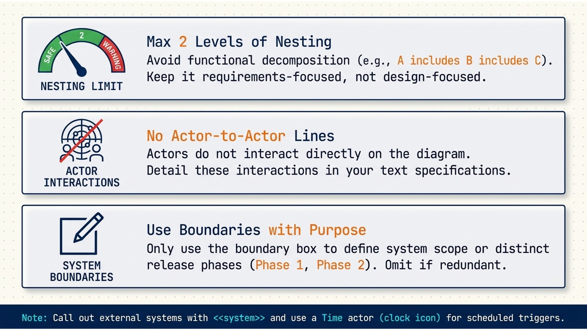
</div>

<!--
Notice this vital warning: 'Safe Nesting Limits.'

A notorious trap in UML is chaining multiple <<include>> and <<extend>> dependencies across 3 or 4 levels deep. This is called Functional Decomposition and turns your use case diagram into an unreadable spaghetti flowchart!

Follow the 2-level safe rule: keep relationships shallow. If you need deeper procedural logic, model it in an Activity Diagram, not a Use Case diagram.

To summarize this slide, remember this key takeaway: Limit include/extend nesting depth to preserve high-level conceptual clarity and prevent functional decomposition.
-->

---

<!-- _class: full-image-slide -->

<div class="centered-image">
  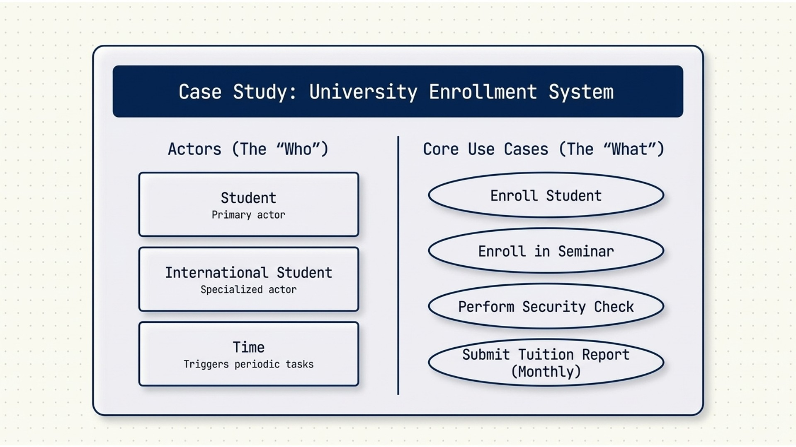
</div>

<!--
Let's examine a complete case study: 'The University Enrollment System.'

Look at the participants:
On the left: The Student actor initiates 'Search Course Catalog' and 'Register for Course'.
In the center: 'Register for Course' mandatorily <<include>>s 'Verify Prerequisites'.
And look at the conditional extension: if tuition is overdue, the flow hooks into 'Resolve Payment Hold' via <<extend>>.
On the right: The Registrar and Payment Gateway handle supporting validation.

To summarize this slide, remember this key takeaway: Real-world use case architectures cleanly combine primary flows, mandatory prerequisite checks, and conditional exception hooks.
-->

---

<!-- _class: full-image-slide -->

<div class="centered-image">
  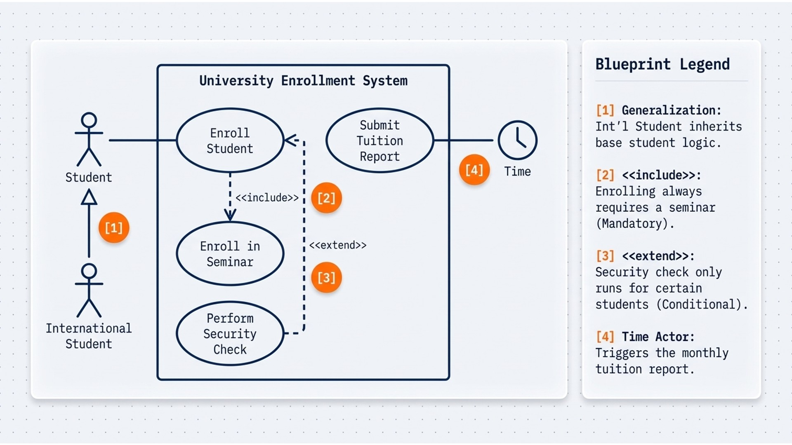
</div>

<!--
Now examine 'Actor Generalization.'

Just as classes can inherit from superclasses, actors can inherit from generalized roles.
Notice: 'Student' is the general actor possessing baseline rights to browse courses and view grades.
'International Student' specializes 'Student'—inheriting all basic capabilities while uniquely having access to 'Submit Visa Compliance'.

To summarize this slide, remember this key takeaway: Actor generalization allows specialized user roles to inherit the functional permissions of general roles.
-->

---

<!-- _class: full-image-slide -->

<div class="centered-image">
  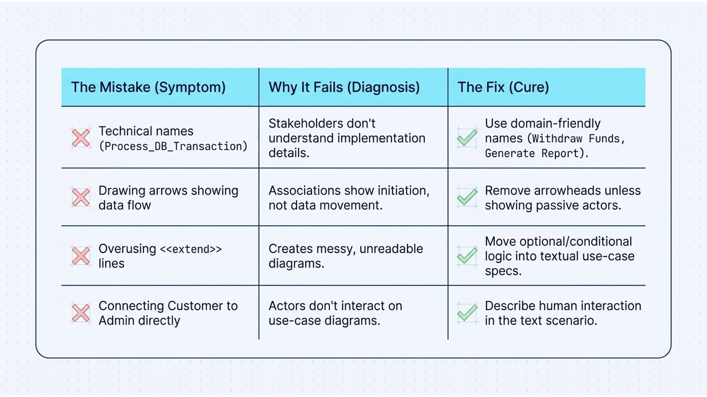
</div>

<!--
Here are the most common 'Anti-Patterns in Use Case Modeling':

Symptom 1: Technical naming—naming use cases after database stored procedures like 'Process_DB_Transaction'.
Symptom 2: Drawing arrows between use cases to represent sequential execution order. Arrows are dependencies, not execution timers!
Symptom 3: Missing the system boundary box entirely, leaving actors and bubbles floating in space.

To summarize this slide, remember this key takeaway: Avoid technical jargon, do not treat arrows as procedural timers, and always enforce strict system boundaries.
-->

---

<!-- _class: full-image-slide -->

<div class="centered-image">
  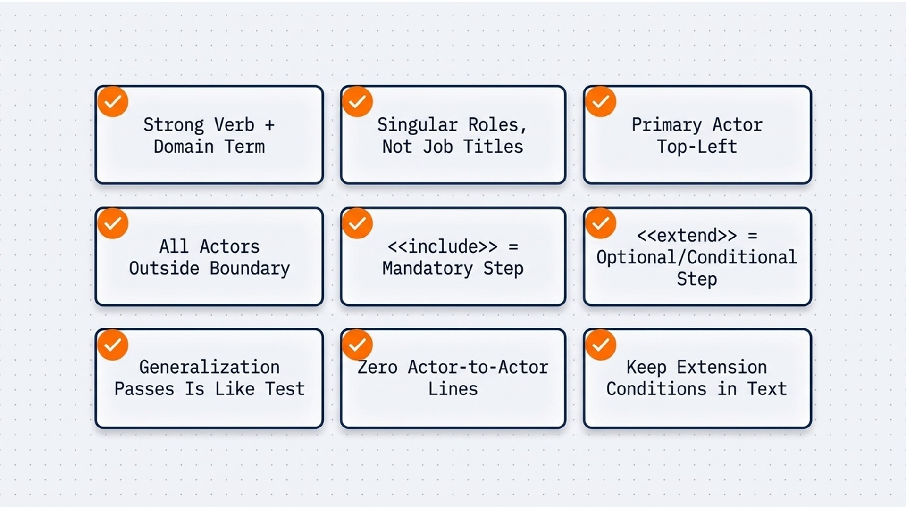
</div>

<!--
Review this 'Best Practices Checklist':

1. Every use case must be driven by an active verb and domain term.
2. Actors represent singular user roles, never departmental titles or software modules.
3. System boundaries clearly delineate what is in-scope for development versus third-party APIs.
4. Keep relationships lightweight and easily verifiable by non-technical stakeholders.

To summarize this slide, remember this key takeaway: Follow disciplined semantic standards to ensure your use case models communicate unambiguous business scope.
-->

---

<!-- _class: full-image-slide -->

<div class="centered-image">
  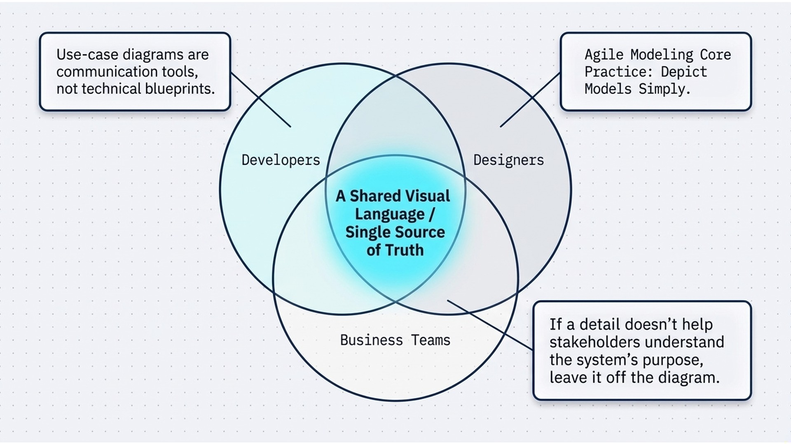
</div>

<!--
To conclude Module 4.3, embrace the 'Communication-First Mindset.'

Use case diagrams are communication tools, not technical blueprints! Their superpower is bridging the gap between business stakeholders who describe desires in natural language and software developers who build code.

If a non-technical product manager cannot understand your use case diagram in 30 seconds, it is over-engineered!

To summarize this slide, remember this key takeaway: Use case models serve primarily as high-level visual contracts that unite business stakeholders and engineering teams.
-->

---

## Use Case Specification: UC-01 Enroll Student

| Field | Specification Details |
| :--- | :--- |
| **Use Case ID / Name** | **UC-01: Enroll Student in Course** |
| **Primary Actor** | Student (authenticated via campus Single Sign-On) |
| **Preconditions** | Student is matriculated with active status; enrollment registration window is open |
| **Postconditions** | Student is officially enrolled in course section; seat quota decremented by 1 |
| **Main Success Scenario** | **1.** Student searches for open course sections by department or course code.<br>**2.** System displays matching course sections, schedules, and remaining seat quotas.<br>**3.** Student selects target section and submits an enrollment request.<br>**4.** System executes `<<include>> Verify Prerequisites` against academic transcript.<br>**5.** System reserves seat, updates enrollment ledger, and generates confirmation notice.<br>**6.** Student views updated schedule and receives confirmation notification. |
| **Extensions (Alternate)** | **4a. Prerequisite Deficiency:** System displays missing prerequisite courses and halts.<br>**4b. Schedule Conflict:** System alerts student of timeslot overlap with existing class.<br>**5a. Section at Capacity:** System offers `<<extend>> Add to Waitlist` queue. |

<!--
A use case diagram is only a high-level table of contents—the real behavioral contract lives in the Use Case Description or Specification!

Here we see the formal specification for 'UC-01 Enroll Student in Course':

Notice the Primary Actor is the authenticated Student.
The Preconditions establish that the student has active matriculation status and the registration period is open.
The Postconditions guarantee that upon completion, the student is officially registered and the seat count is decremented by one.

Look at Step 4 of the Main Success Scenario: It explicitly invokes the included use case 'Verify Prerequisites'.
And look at the Extensions: 4a handles missing prerequisites, 4b handles time conflicts, and 5a handles full sections by extending into a waitlist.

To summarize this slide, remember this key takeaway: Use case specifications detail the step-by-step dialogue, preconditions, and exception flows behind diagram bubbles.
-->

---

## AI Assistance: Guidelines for Use Case Modeling

- **1. Persona & Boundary Priming:**
  - Instruct the AI to act as a *Lead Requirements Analyst* with expertise in UML.
  - Define the system **boundary** upfront to prevent the AI from confusing internal use cases with external partner systems.
- **2. Actor & Relationship Constraints:**
  - **Actors:** Force AI to distinguish **Primary Actors** (human users initiating goals) from **Secondary Supporting Actors**.
  - **`<<include>>` Rule:** Use strictly for mandatory common sub-flows executed every time.
  - **`<<extend>>` Rule:** Use strictly for optional, conditional, or exceptional behavior with named extension points.
  - **Anti-Pattern Warning:** Prohibit functional decomposition (forbid trivial use cases like "Click Button" or "Enter Password").
- **3. Architectural Verification Checklist:**
  - [ ] Are all use cases named with active verb phrases (e.g., `Place Order`, `Track Delivery`)?
  - [ ] Is third-party infrastructure (Payment Gateway, SMS) kept *outside* the system boundary rectangle?
  - [ ] Are include arrows pointing toward the included supplier use case?

<!--
When using AI to generate use case models, clear prompt constraints are essential.

Large Language Models frequently make three classic use case errors:
First, they engage in functional decomposition, creating dozens of tiny, meaningless bubbles for every button click or form field.
Second, they confuse include and extend, using include for optional paths.
Third, they place external APIs like Stripe inside the system boundary as if they were internal features.

Our prompting guideline forces the AI to define a strict system boundary, distinguish primary from secondary actors, and validate arrow directions before outputting PlantUML.

To summarize this slide, remember this key takeaway: Guide AI by enforcing strict boundary definitions, valid verb-noun use case naming, and correct include/extend semantics.
-->

---

## AI Prompt Example: Food Delivery Use Case Model

<div class="two-columns">
<div>

**1. Role & Task Instruction:**
```text
Act as a Lead Systems Analyst.
Generate a valid PlantUML Use Case
diagram and Description for a Food Delivery System.
```

**2. Modeling Constraints:**
- Use `<<extends>>` and `<<includes>>` to structure the model.
- Prohibit functional decomposition (forbid trivial use cases like "Click Button" or "Enter Password").

</div>
<div>

**3. Input Requirements Statement:**
> "Our platform allows **Customers** to browse restaurants, add food items to cart, and place orders.
> When placing an order, the system must always authorize payment through an external **Payment Gateway** and validate delivery address.
> A customer may optionally enter a discount coupon code (`Apply Promo Voucher`) or select contactless doorstep delivery.
> **Restaurant Staff** review incoming orders, accept or reject them, and update kitchen prep status.
> **Delivery Couriers** accept available delivery tasks, ...

</div>
</div>

<!--
Here is a production-grade prompt for generating a food delivery use case model.

On the left, notice how the prompt specifies the role, task instruction, and structural constraints:
We explicitly tell the AI to enclose the core system in a boundary rectangle, place payment and SMS services outside on the right, and enforce the include and extend relationships.

On the right, we feed the raw requirements statement detailing the customer, restaurant staff, courier, and automated SMS gateway interactions.

When an LLM receives this prompt, it produces a clean, standards-compliant PlantUML diagram ready to render without manual corrections.

To summarize this slide, remember this key takeaway: Providing explicit boundary rules, actor roles, and relationship constraints enables AI to produce production-grade use case diagrams.
-->

---

### Interactive Activity: Food Delivery Use Case Boundaries (Pair Discussion)

<div class="discussion-columns">
  <div class="discussion-text">

  **Pair Discussion: Food Delivery Scope & Use Case Relationships**
  - **Scenario:** Design the Use Case model for a food delivery platform (e.g., DoorDash / UberEats).
  - **Actors:** Customer, Restaurant Kitchen, Delivery Courier, Payment Gateway.
  - **Discussion Prompts with Your Partner (3 Mins):**
    1. Identify 2 essential use cases with an `<<include>>` relationship (e.g., *Place Order* always includes *Process Payment*).
    2. Identify 1 scenario requiring an `<<extend>>` relationship with an explicit extension point (e.g., *Apply Voucher* or *Select Contactless Drop-off*).
    3. Is *Payment Gateway* placed inside or outside the system boundary? Why?

  </div>
  <div class="discussion-logo">
    
  </div>
</div>

<!--
Let's pause here for a high-impact pair discussion: Food Delivery Use Case Boundaries! Turn to your neighbor—you are senior product architects designing a modern delivery platform.

Look at the prompts on screen:
First, identify two use cases that share an include relationship. For example, whenever a customer places an order, the system must process payment—it is mandatory behavior.
Second, identify a scenario that calls for an extend relationship. When is behavior optional or conditional? For instance, applying a promotional discount code or opting for contactless doorstep drop-off.
Third, discuss the system boundary: Where does the external Payment Gateway sit?

Spend three minutes with your partner deciding these relationships and boundaries.

Possible Answers & Debriefing Guide:
1. Include: 'Place Order' includes 'Process Payment' and 'Validate Cart Items' because an order cannot legally exist without payment authorization.
2. Extend: 'Apply Promo Voucher' extends 'Place Order' only when the customer inputs a valid promotional coupon code.
3. System Boundary: 'Payment Gateway' is an external actor placed outside the boundary rectangle because it is operated by a third-party bank or Stripe service.

To summarize this slide, remember this key takeaway: Use case models delineate system boundaries and cleanly separate mandatory base logic from optional extension points.
-->

---

### Concept Check Question 3
<!-- id: ase-ch04-ccq3 -->

<div class="ccq-columns">
<div class="ccq-text">

In our Food Delivery Use Case Model, why does `Apply Promo Voucher` point to `Place Food Order` with `<<extend>>`, while `Place Food Order` points to `Process Payment` with `<<include>>`?

- **A.** Voucher application is mandatory for all orders; payment is optional.
- **B.** Vouchers are conditional optional behavior; payment is mandatory shared execution.
- **C.** Vouchers are executed by supporting actors; payment is executed by primary actors.
- **D.** Vouchers represent class inheritance; payment represents object composition.

</div>
<div class="ccq-logo">
    <a href="https://nlhsueh.github.io/nickedupocket/#/student/ase-ch04-ccq3" target="_blank"></a>
  </div>
</div>

<!--
Let's verify our understanding of use case relationships with Concept Check Question 3.

Look at the options:
Option A reverses the business logic completely.
Option C confuses actor roles with stereotypes.
Option D confuses class diagram concepts with use case arrows.

The correct answer is Option B! Applying a voucher is conditional and optional—orders execute fine without vouchers. In contrast, processing payment is a mandatory step that must execute every single time an order is placed.

To summarize this slide, remember this key takeaway: Include represents mandatory shared functionality; extend represents conditional, optional enhancements.
-->

---

<!-- _class: lead -->
<!-- header: '4.4 Structural & Class Models' -->

# **4.4 Structural & Class Models**

> "Classes are the static building blocks; objects are the living runtime instances."

<!--
We now transition to Module 4.4: Structural Models and Domain Class Diagrams.

While sequence diagrams show dynamic runtime communication, we also need to specify the static organization of our software—the classes, their fields and methods, and the architectural relationships that connect them independent of time.

Let's examine the domain class model of our food delivery platform.

To summarize this slide, remember this key takeaway: Class diagrams model the static structural backbone and domain entity relationships of object-oriented systems.
-->

---

<!-- _class: full-image-slide -->

<div class="centered-image">
  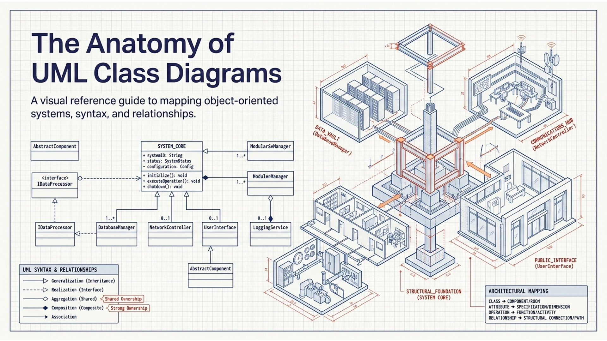
</div>

<!--
Look at this architectural overview: 'The Anatomy of UML Class Diagrams.'

Think of an object-oriented software system like a modern building. A physical structure requires concrete foundations, structural columns, data vaults, and external access corridors. 

In software engineering, a Class Diagram serves this exact architectural role. It maps out the system core, encapsulates internal state, exposes public interfaces, and establishes the formal pathways connecting collaborating components.

To summarize this slide, remember this key takeaway: Class diagrams provide the static structural blueprint that anchors data schemas, object responsibilities, and system interfaces.
-->

---

<!-- _class: full-image-slide -->

<div class="centered-image">
  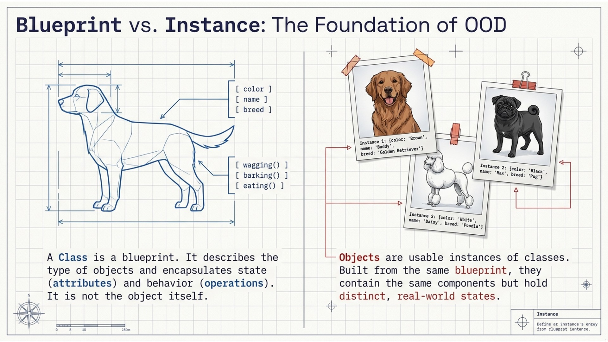
</div>

<!--
Let's begin with the foundational concept of Object-Oriented Design: 'Blueprint vs. Instance.'

On the left, notice the architectural blueprint: that is the Class. It defines the abstract type, specifying the state attributes—such as color, name, and breed—and behavioral operations—like wagging, barking, and eating. The class itself is not an object; it is the mold.

On the right, notice the polaroid photos: those are the Objects! Max the Pug, Buddy the Golden Retriever, and Daisy the Poodle are concrete, living instances created from that single blueprint, each holding distinct real-world state in runtime memory.

To summarize this slide, remember this key takeaway: A class is the static type blueprint, while objects are the dynamic living instances created from that blueprint.
-->

---

<!-- _class: full-image-slide -->

<div class="centered-image">
  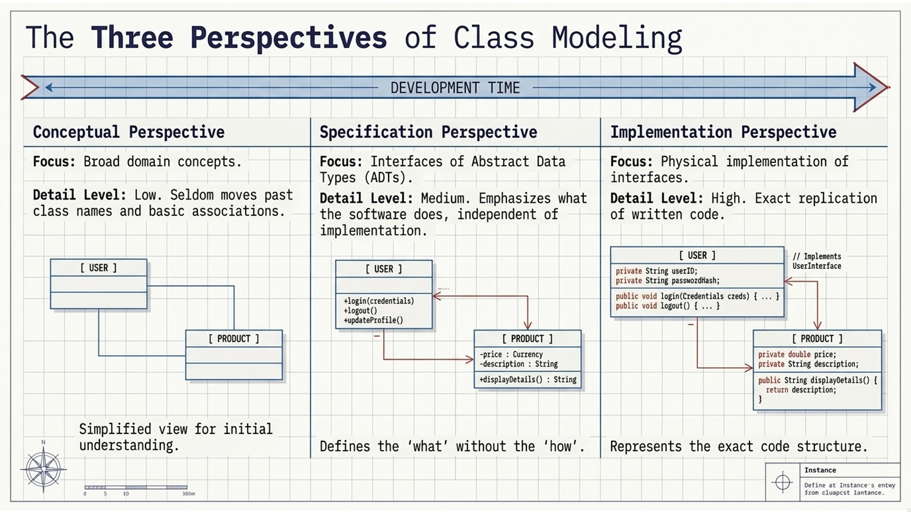
</div>

<!--
When drawing a class diagram, you must know your perspective. As Martin Fowler famously articulated, class models evolve across three distinct perspectives:

First, the Conceptual Perspective on the left: here, you focus on broad domain vocabulary and real-world concepts with minimal technical detail—simply discovering that Users interact with Products.

Second, the Specification Perspective in the middle: here, you model software types and interfaces, defining *what* the system does without committing to specific implementation languages or database engines.

Third, the Implementation Perspective on the right: this is the exact, literal reflection of production code, complete with private fields, typed method signatures, and language-specific design patterns.

To summarize this slide, remember this key takeaway: Choose your modeling perspective deliberately—use conceptual models for domain discovery, and specification or implementation models for detailed software construction.
-->

---

<!-- _class: full-image-slide -->

<div class="centered-image">
  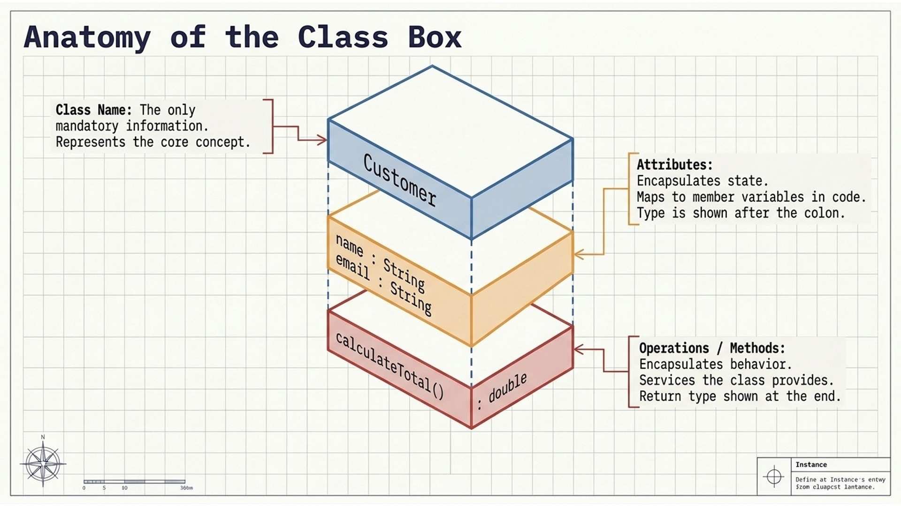
</div>

<!--
Now, look at the anatomy of the standard UML Class Box. Notice how it cleanly separates into three vertical compartments:

The Top Compartment contains the Class Name—the only mandatory field, written in PascalCase.

The Middle Compartment encapsulates State: typed Attributes that map directly to instance variables in your code, such as name and email.

The Bottom Compartment encapsulates Behavior: Operations and Methods representing services the class offers, with parameter lists and return types explicitly declared.

To summarize this slide, remember this key takeaway: Every standard UML class box encapsulates identity, state attributes, and behavioral operations in three structured compartments.
-->

---

<!-- _class: full-image-slide -->

<div class="centered-image">
  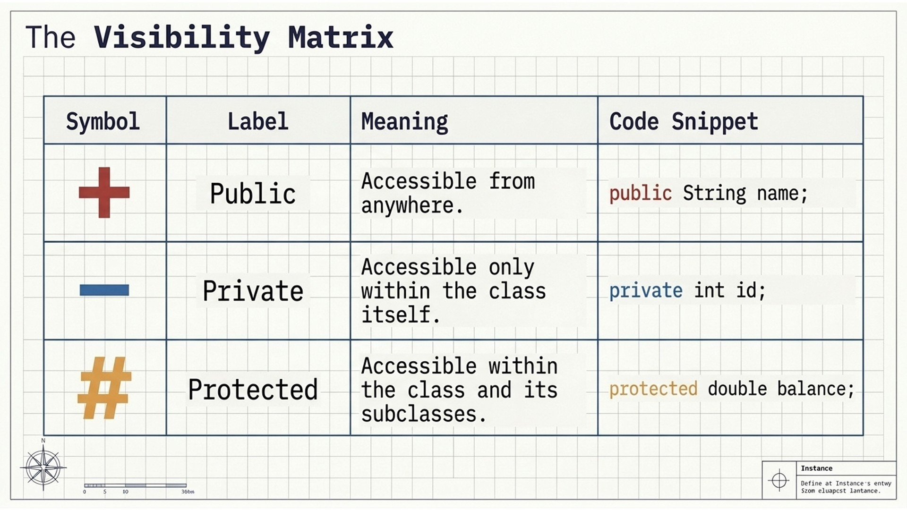
</div>

<!--
To enforce encapsulation and information hiding, UML provides three universal visibility prefixes shown in this Visibility Matrix:

Plus (+) denotes Public access: accessible by any outside class or client module in the codebase.

Minus (-) denotes Private access: strictly hidden and encapsulated within the owning class declaration.

Hash (#) denotes Protected access: accessible only within the class itself and its derived subclasses in the inheritance hierarchy.

To summarize this slide, remember this key takeaway: Visibility annotations enforce information hiding and maintain encapsulation boundaries across your object architecture.
-->

---

<!-- _class: full-image-slide -->

<div class="centered-image">
  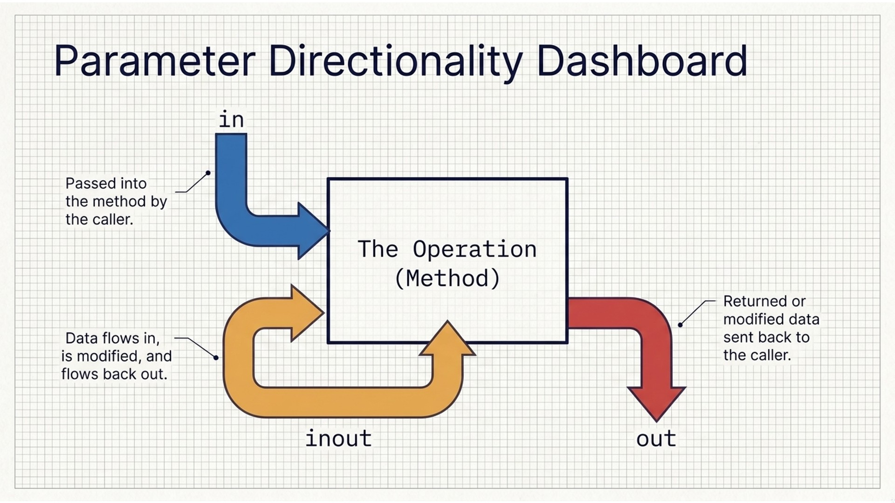
</div>

<!--
When specifying method operations, UML allows you to define Parameter Directionality, as shown in this dashboard:

'in' means the parameter flows into the method from the caller and is read-only.

'out' means the parameter is populated by the method and passed back out to the caller.

'inout' means the data flows in, is mutated or processed by the method, and the modified result flows back out.

This explicit notation eliminates ambiguity when integrating complex microservices, foreign APIs, and embedded systems.

To summarize this slide, remember this key takeaway: Parameter directionality explicitly documents whether arguments are strictly input, output, or mutated in-place.
-->

---

<!-- _class: full-image-slide -->

<div class="centered-image">
  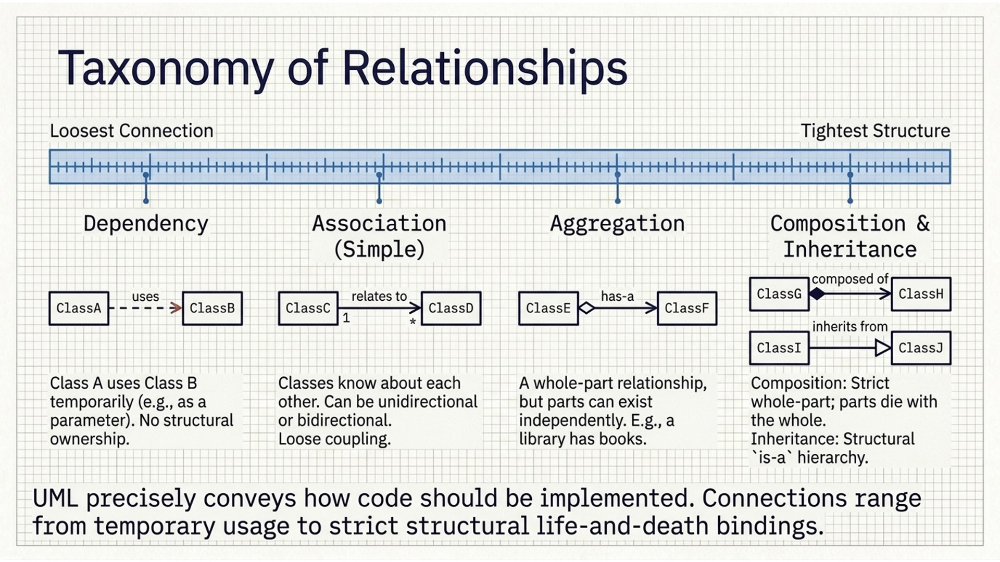
</div>

<!--
Look at this continuum: 'Taxonomy of Relationships.'

Software components are connected by relationships spanning from the loosest connection on the left to the tightest structural binding on the right:

At the loose end is Dependency: Class A temporarily uses Class B, perhaps as a method argument, with zero ownership.

Next is Association: classes know about each other and hold persistent references.

Further right is Aggregation: a whole-part relationship where parts can still exist independently.

And at the far right is Composition and Inheritance: the tightest structural bindings, where parts live and die with the whole, or share a rigid type hierarchy.

To summarize this slide, remember this key takeaway: UML relationships span a continuous spectrum from transient usage dependencies to strict life-and-death composition bindings.
-->

---

<!-- _class: full-image-slide -->

<div class="centered-image">
  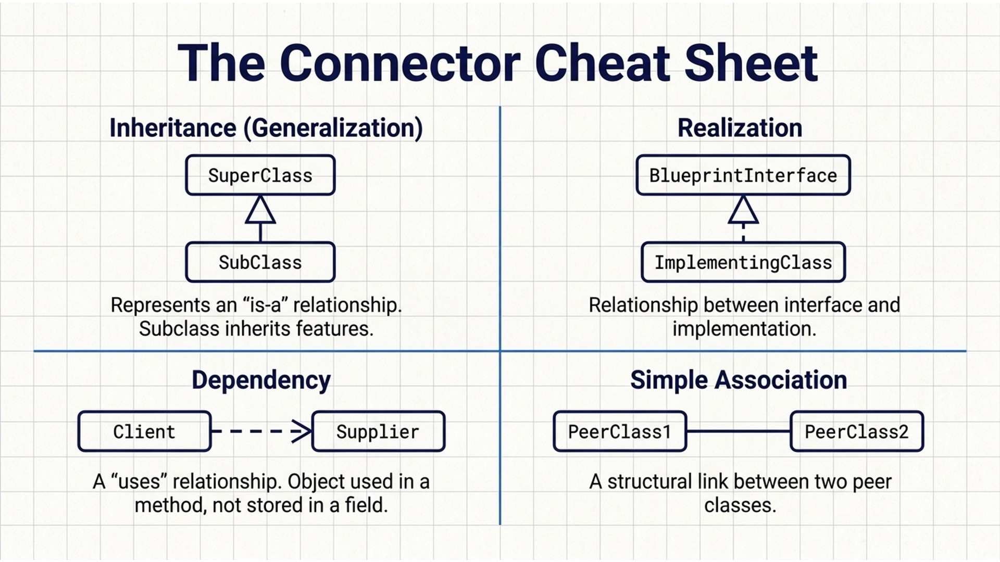
</div>

<!--
Here is your essential reference: 'The Connector Cheat Sheet.'

Notice the visual syntax of each relationship connector:

Top-left: Generalization (Inheritance)—a solid line with an open hollow triangle pointing to the SuperClass, representing an 'is-a' relationship.

Top-right: Realization—a dashed line with a hollow triangle pointing to an Interface, indicating that a concrete class implements a behavioral contract.

Bottom-left: Dependency—a dashed line with an open arrow, representing a temporary 'uses' relationship.

Bottom-right: Simple Association—a solid line linking two peer classes that communicate.

To summarize this slide, remember this key takeaway: Master connector syntax to unambiguously distinguish inheritance, interface realization, transient dependencies, and structural associations.
-->

---

<!-- _class: full-image-slide -->

<div class="centered-image">
  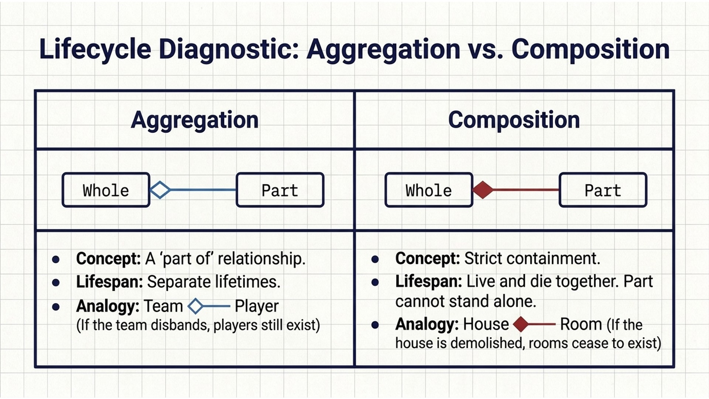
</div>

<!--
Now examine the most critical architectural decision in whole-part modeling: Aggregation versus Composition.

Look at Aggregation on the left: represented by an open hollow diamond. The whole has parts, but their lifespans are decoupled. Think of a Sports Team and its Players: if the team disbands, the players still exist!

Now look at Composition on the right: represented by a filled solid diamond. This is strict containment and shared lifespan. Think of a House and its Rooms: if the house is demolished, the rooms cease to exist!

In software, composition means cascade-deleting child records, whereas aggregation means preserving child entities.

To summarize this slide, remember this key takeaway: Use aggregation when parts survive the whole; use composition when parts cannot exist without their owning parent.
-->

---

<!-- _class: full-image-slide -->

<div class="centered-image">
  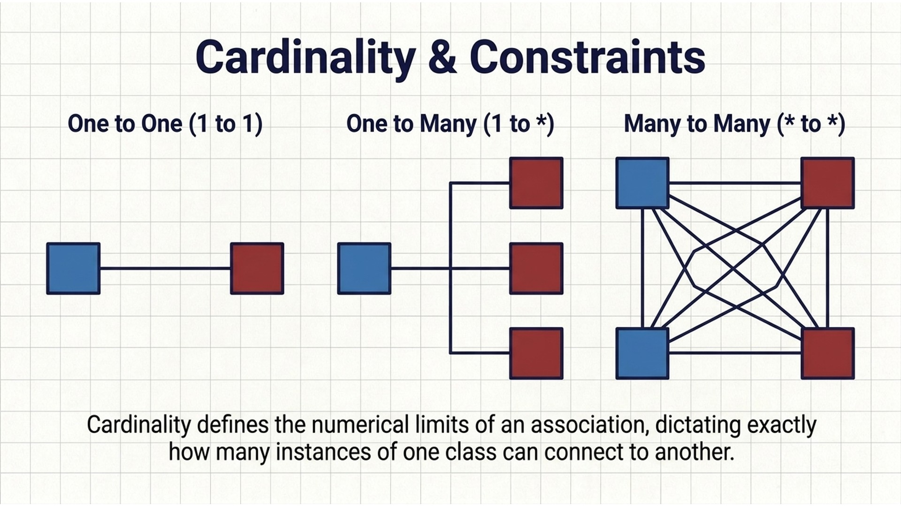
</div>

<!--
Associations require exact numerical bounds, known as Cardinality or Multiplicity:

On the left: One-to-One (1 to 1)—for example, each Citizen has exactly one Passport.

In the middle: One-to-Many (1 to *)—for example, one Customer places many Orders, but each order belongs to one customer.

On the right: Many-to-Many (* to *)—for example, Students enroll in multiple Courses, and Courses enroll multiple Students, typically realized via an association class or join table.

Multiplicities enforce critical business constraints before any database schema is generated.

To summarize this slide, remember this key takeaway: Multiplicities define the exact numerical limits governing how many instances of one class can link to another.
-->

---

<!-- _class: full-image-slide -->

<div class="centered-image">
  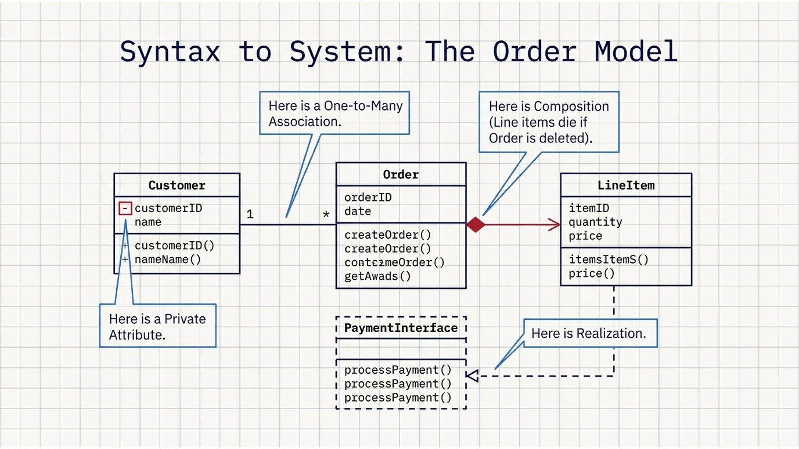
</div>

<!--
Let's see all these concepts work together in a realistic e-commerce Order Model:

Notice Customer on the left: it holds private attributes like customerID and has a One-to-Many association (1 to *) with Order.

Notice Order in the center: it has a solid filled diamond pointing to LineItem. That is Composition! If an order is cancelled or deleted, its line items are cascade-deleted immediately.

Notice PaymentInterface at the bottom: Order connects to it via a dashed line with a hollow arrow. That is Realization!

This single diagram unites visibility, multiplicity, whole-part coupling, and interface contracts into an elegant, coherent system architecture.

To summarize this slide, remember this key takeaway: Combining visibility, multiplicity, composition, and interface realization produces a robust, production-ready domain model.
-->

---

## AI Assistance: Guidelines for Class Modeling

- **1. Persona & Level of Abstraction:**
  - Instruct the AI to act as a *Principal Domain Architect* creating a *Domain Model (Conceptual Level)* or *Design Model (Implementation Level)*.
- **2. Whole-Part Coupling Discipline:**
  - **Composition (`*--`, ◆):** Explicitly require the AI to identify entities with dependent lifecycles (cascade-deleted with parent).
  - **Aggregation (`o--`, ◇):** Require open diamonds for shared parts that maintain independent lifecycles.
  - **Prohibit Default Associations:** Forbid the AI from taking the easy path of drawing generic lines (`--`) without whole-part justification.
- **3. Encapsulation & Multiplicity Rules:**
  - Enforce explicit visibility (`-` private attributes, `+` public methods, `#` protected).
  - Require explicit multiplicities on *both* association ends (e.g., `1` to `1..*`).
- **4. Architectural Verification Checklist:**
  - [ ] Did the AI confuse Generalization (`<|--`) with Composition (`*--`)?
  - [ ] Are sensitive fields (passwords, tokens, addresses) declared `- private`?
  - [ ] Are multiplicities logically sound (e.g., can an order exist with 0 items)?

<!--
For class diagrams, AI assistance requires rigorous constraints around object relationships.

Left to themselves, LLMs often produce flat diagrams where every class is connected by a simple association, completely missing composition and aggregation. Or worse, they use inheritance when they should have used composition!

By prompting the AI with explicit whole-part guidelines and mandating visibility markers and multiplicities on both ends, you ensure the generated model forms a robust OOP architecture.

As architects, our job is to verify that life-dependent entities are composed, sensitive data is private, and multiplicities reflect true business rules.

To summarize this slide, remember this key takeaway: Prompt AI to enforce composition versus aggregation, complete multiplicities, and strict attribute encapsulation.
-->

---

## AI Prompt Example: Food Delivery Class Model

<div class="two-columns">
<div>

**1. Role & Task Instruction:**
```text
Act as a Principal Software Architect.
Generate a formal PlantUML Class Diagram
for a Food Delivery Domain Model.
```

**2. Modeling Constraints:**
- `Order` *must* have Composition (`*--`) with `OrderItem` (multiplicity `1` to `1..*`).
- `Order` *must* have Aggregation (`o--`) with `Courier` (`*` to `0..1`).
- `OrderItem` associates with `MenuItem` (`*` to `1`).
- Declare all attributes with `-` private visibility and data types.
- Provide primary business methods (`+ calculateTotal()`, `+ assignCourier()`).
- Output clean `@startuml ... @enduml` block.

</div>
<div>

**3. Input Requirements Statement:**
> "A **Customer** has customerId, name, email, phone, and deliveryAddress.
> A **Restaurant** has restaurantId, name, address, and owns a collection of **MenuItems** (itemId, name, price, isAvailable).
> A Customer can place multiple **Orders**. Each **Order** has orderId, orderStatus (OrderStatus enum: Placed, Preparing, Delivered), orderTime, and totalAmount.
> An Order consists of one or more **OrderItems** (quantity, itemPrice, subtotal). If an Order is deleted, its OrderItems must be cascade-deleted immediately.
> A **Courier** (courierId, name, phone, vehicleType) can be assigned to deliver an Order.
> An Order delegates credit card charging to a **PaymentProcessor** interface."

</div>
</div>

<!--
Here is the concrete prompt example for generating our food delivery class model.

Look at how the prompt breaks down the architectural requirements:
On the left, we provide exact relationship instructions: Order must compose OrderItem because line items cannot exist without an order. Order aggregates Courier because couriers exist independently of any single delivery.

On the right, we provide the structured domain requirements: customer attributes, restaurant menu items, order status enums, and payment interface contracts.

This gives the LLM zero room for ambiguity and produces an accurate, production-ready class hierarchy.

To summarize this slide, remember this key takeaway: Explicitly stating whole-part coupling and multiplicity in the prompt prevents AI hallucination in class models.
-->

---

### Interactive Activity: Food Delivery Domain Class Architecture (Pair Discussion)

<div class="discussion-columns">
  <div class="discussion-text">

  **Pair Discussion: Whole-Part Coupling & Multiplicity in Food Delivery**
  - **Domain Entities:** `Customer`, `Order`, `OrderItem`, `MenuItem`, `Restaurant`, `Courier`.
  - **Discussion Prompts with Your Partner (3 Mins):**
    1. **Composition vs. Aggregation:** Should the link between `Order` and `OrderItem` be composition (◆) or aggregation (◇)? What about between `Order` and `Courier`? Why?
    2. **Multiplicity Dilemma:** Can an `Order` contain `OrderItem`s from multiple `Restaurant`s in a single checkout? How does this business rule change your class associations?
    3. **Encapsulation:** Which attributes on `Customer` and `Order` should be `- private` to safeguard payment tokens and customer addresses?

  </div>
  <div class="discussion-logo">
    
  </div>
</div>

<!--
Let's pause for our Section 4.4 pair discussion: Food Delivery Domain Class Architecture! Turn to your partner and put on your object-oriented domain modeling hats.

Look at the domain classes: Customer, Order, OrderItem, MenuItem, Restaurant, and Courier.

First, determine the whole-part semantics: Is the relationship between Order and OrderItem composition or aggregation? What about Order and Courier?
Second, consider multiplicity: Does your platform allow ordering from multiple restaurants in a single cart, or is an order strictly tied to one restaurant? How does that decision alter the class diagram?
Third, think about security and encapsulation: Which attributes must be private?

Spend three minutes debating these architectural trade-offs.

Possible Answers & Debriefing Guide:
1. Composition vs Aggregation: 'Order' to 'OrderItem' is strict Composition (filled diamond) because order items have no independent identity; if the order is purged, line items are cascade-deleted. In contrast, 'Order' to 'Courier' is Aggregation (hollow diamond) or simple Association, because the courier exists before and after the order lifecycle.
2. Multiplicity: If single-restaurant only, 'Order' has a 1-to-1 association with 'Restaurant'. If multi-restaurant bundling is supported, 'OrderItem' must directly reference its originating 'Restaurant', introducing a split-dispatch sub-order structure.
3. Encapsulation: Credit card tokens, delivery addresses, and customer phone numbers must be strictly private with protected accessor methods.

To summarize this slide, remember this key takeaway: Composition enforces lifecycle dependency, while encapsulation protects sensitive domain state within class boundaries.
-->

---

### Concept Check Question 4
<!-- id: ase-ch04-ccq4 -->
<div class="ccq-columns">
<div class="ccq-text">

In our Food Delivery Class Diagram, why is the relationship between `Order` and `OrderItem` modeled as **Composition (◆)**, whereas `Order` and `Courier` is modeled as **Aggregation (◇)**?

- **A.** An `OrderItem` can exist independently, but a `Courier` cannot exist without an `Order`.
- **B.** An `OrderItem` is destroyed with its parent `Order`, whereas a `Courier` maintains an independent lifecycle.
- **C.** Composition represents inheritance between classes, while aggregation represents method invocation.
- **D.** Composition requires zero-to-one multiplicity, while aggregation requires one-to-many multiplicity.

</div>
<div class="ccq-logo">
    <a href="https://nlhsueh.github.io/nickedupocket/#/student/ase-ch04-ccq4" target="_blank"></a>
  </div>
</div>

<!--
Let's test our understanding of object lifecycle coupling with Concept Check Question 4.

Look at the options:
Option A reverses the lifecycles.
Option C confuses whole-part relationships with inheritance.
Option D confuses multiplicity with association semantics.

The correct answer is Option B! An `OrderItem` has no independent business existence outside its parent `Order`—if the order is deleted, its items are cascade-destroyed (Composition). In contrast, a freelance `Courier` exists independently of any single delivery assignment (Aggregation).

To summarize this slide, remember this key takeaway: Composition binds component lifecycles to the parent; aggregation maintains independent object lifecycles.
-->

---

<!-- _class: lead -->
<!-- header: '4.5 Interaction & Sequence Diagrams' -->

# **4.5 Interaction & Sequence Diagrams**

> "Interaction modeling shows how objects collaborate chronologically over time to fulfill the promise of a use case."

<!--
Now we advance to Module 4.5: Dynamic Interaction Modeling and Sequence Diagrams.

While a use case description outlines steps in tabular text and class diagrams capture static structure, real software is executed by collaborating runtime objects passing messages across networks and memory threads.

In this section, we study UML Sequence Diagrams, master lifelines and activation semantics, explore UML 2.0 combined fragments, and trace how sequences bridge use cases directly to production code.

To summarize this slide, remember this key takeaway: Sequence diagrams model the chronological message flow between collaborating objects for a specific scenario.
-->

---

<!-- _class: full-image-slide -->

<div class="centered-image">
  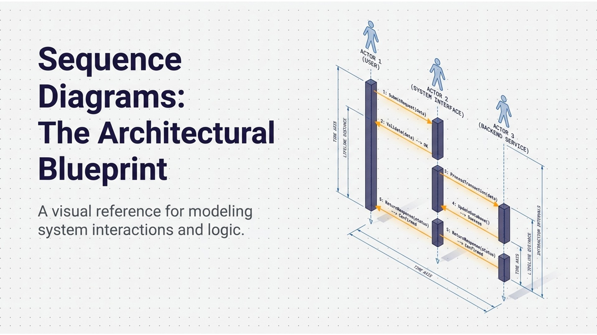
</div>

<!--
Look at this dynamic interaction overview: 'Sequence Diagrams in Action.'

A sequence diagram captures dynamic object collaboration. Instead of showing the entire universe of classes, a sequence diagram focuses on one specific scenario—tracing how actors and runtime instances exchange messages over time.

Notice the participants across the top and the directional message vectors connecting them downward.

To summarize this slide, remember this key takeaway: Sequence diagrams illuminate the time-ordered dynamic conversations between collaborating runtime components.
-->

---

<!-- _class: full-image-slide -->

<div class="centered-image">
  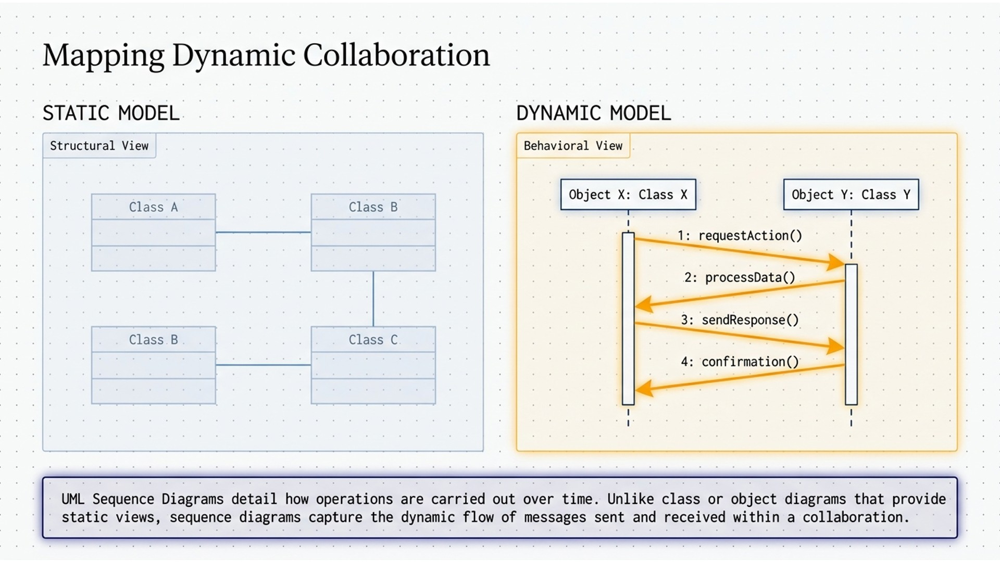
</div>

<!--
Notice this fundamental distinction: 'Static Model versus Dynamic Model.'

On the left is the Static Class Model: it reveals who knows whom, encapsulating fields and structural associations independent of time.
On the right is the Dynamic Sequence Model: it reveals who invokes whom, when, and with what arguments during execution.

Static models define system capability; dynamic models prove behavioral correctness.

To summarize this slide, remember this key takeaway: Static class diagrams define structural capability, while dynamic sequence diagrams validate behavioral execution over time.
-->

---

<!-- _class: full-image-slide -->

<div class="centered-image">
  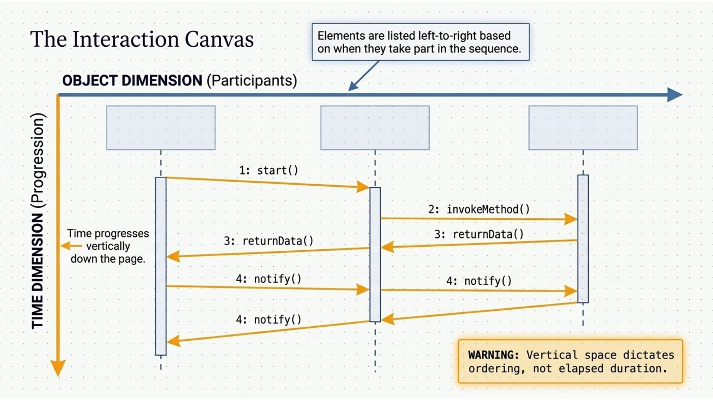
</div>

<!--
Look at the geometry of the 'Interaction Canvas.'

A sequence diagram is mapped along two strict axes:
Horizontal Axis (The Object Dimension): Lists participating instances and actors from left to right in order of activation.
Vertical Axis (The Time Dimension): Proceeds strictly downward, representing the irreversible flow of time.

Notice: vertical placement signifies relative chronological sequence—messages higher up happen strictly before messages lower down.

To summarize this slide, remember this key takeaway: The sequence canvas maps participating objects horizontally and advances chronological time vertically downward.
-->

---

<!-- _class: full-image-slide -->

<div class="centered-image">
  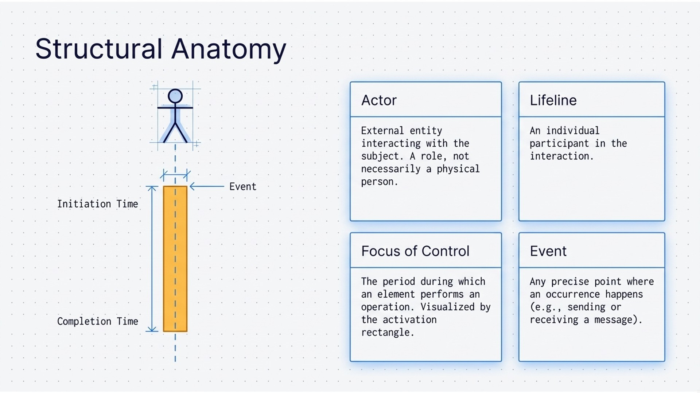
</div>

<!--
Here is the 'Structural Anatomy' of a sequence diagram:

1. Lifeline Header: The rectangle naming the instance and its class (e.g., 'orderController: OrderController').
2. Lifeline Stem: The dashed vertical line representing the object's existence over time.
3. Activation Bar: The thin vertical rectangle showing when the object is actively executing code or awaiting a return.
4. Destruction Marker: A bold 'X' indicating the object's deallocation or garbage collection.

To summarize this slide, remember this key takeaway: Master the visual anatomy—lifelines represent existence, activation bars represent execution, and cross markers represent deallocation.
-->

---

<!-- _class: full-image-slide -->

<div class="centered-image">
  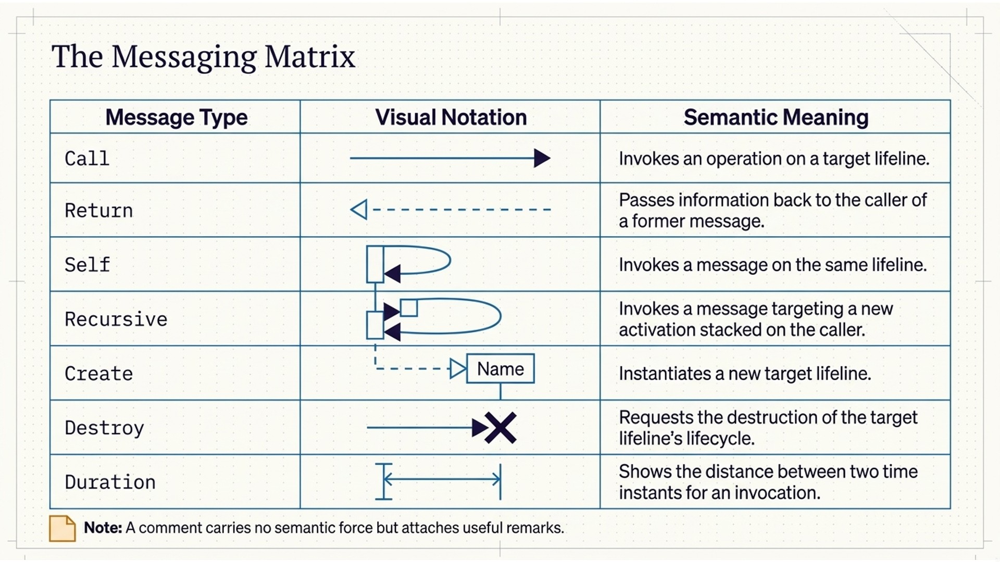
</div>

<!--
Look at this essential reference: 'The Messaging Matrix.'

Message arrowheads convey precise communication semantics:
- Solid Line with Filled Arrowhead: Synchronous Call (the caller blocks until the callee returns).
- Solid Line with Open Arrowhead: Asynchronous Message (fire-and-forget, non-blocking message passing).
- Dashed Line with Open Arrowhead: Return Message (data flowing back to the caller).
- Dashed Line labeled <<create>>: Object Instantiation.

To summarize this slide, remember this key takeaway: Distinguish synchronous blocking calls from asynchronous event dispatches and return data flows using standard arrow notation.
-->

---

<!-- _class: full-image-slide -->

<div class="centered-image">
  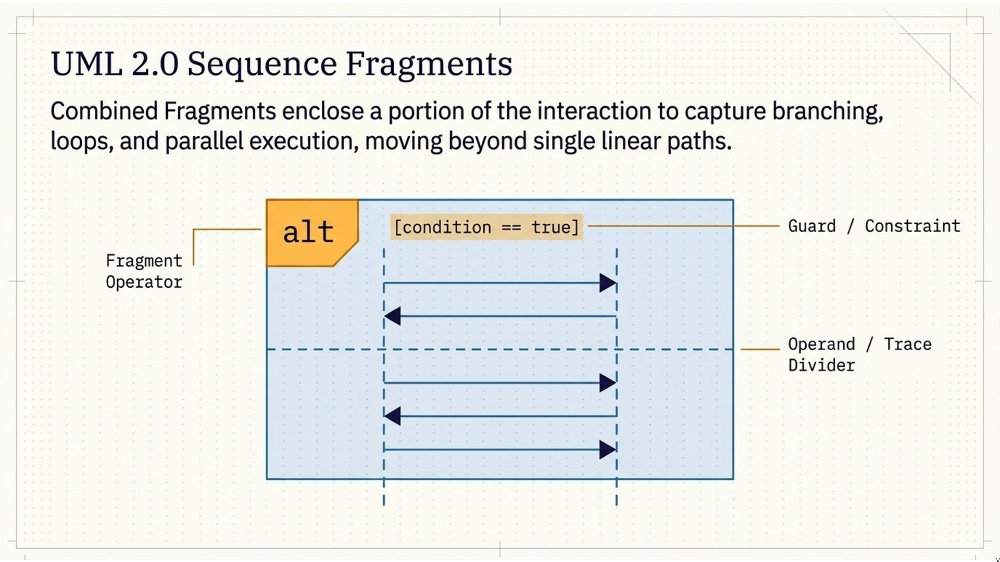
</div>

<!--
In UML 2.0, Sequence Diagrams gained structured control logic via 'Combined Fragments':

Instead of drawing separate diagrams for every minor branch, combined fragments frame conditional blocks:
- alt (Alternative): Models if-else branching with mutually exclusive guard conditions.
- opt (Optional): Models a single if-block that executes only when a guard condition evaluates to true.
- loop: Models iterative execution while a loop condition holds.
- par (Parallel): Models concurrent, multi-threaded execution.

To summarize this slide, remember this key takeaway: Combined fragments encapsulate branching, optional features, iterations, and concurrency directly within sequence flows.
-->

---

<!-- _class: full-image-slide -->

<div class="centered-image">
  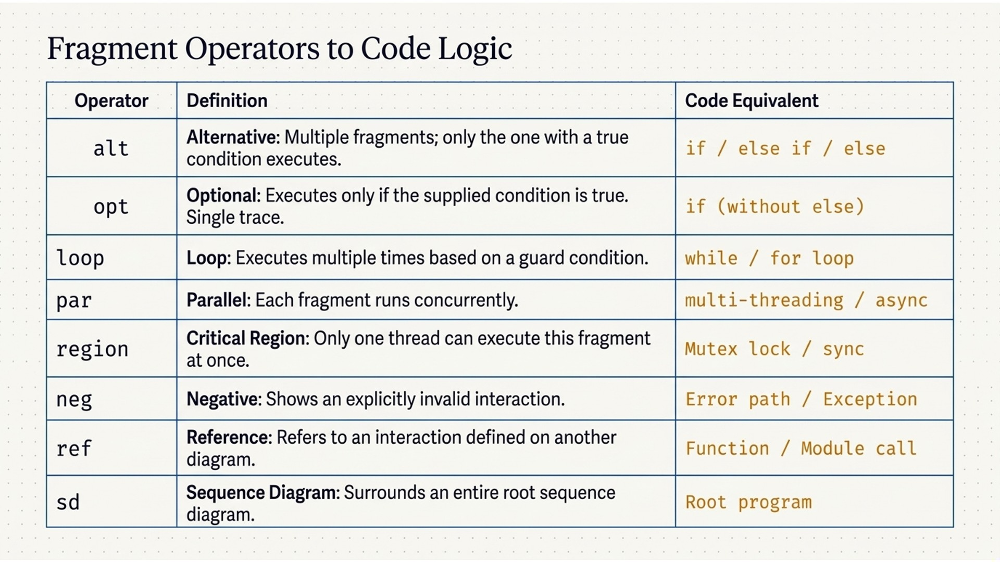
</div>

<!--
Look at this direct translation: 'Fragment Operators to Code Logic.'

Notice how 1:1 UML fragments map to programming structures:
An 'alt' fragment with guards [isVip] and [else] maps directly to an 'if ... else' code block.
An 'opt' fragment with guard [wantsInsurance] maps to a standalone 'if' statement.
A 'loop' fragment maps directly to a 'for' or 'while' loop.

This direct mapping makes sequence diagrams the premier design tool for developers preparing to write complex backend logic.

To summarize this slide, remember this key takeaway: Sequence fragments translate directly into clean control-flow constructs in modern programming languages.
-->

---

<!-- _class: full-image-slide -->

<div class="centered-image">
  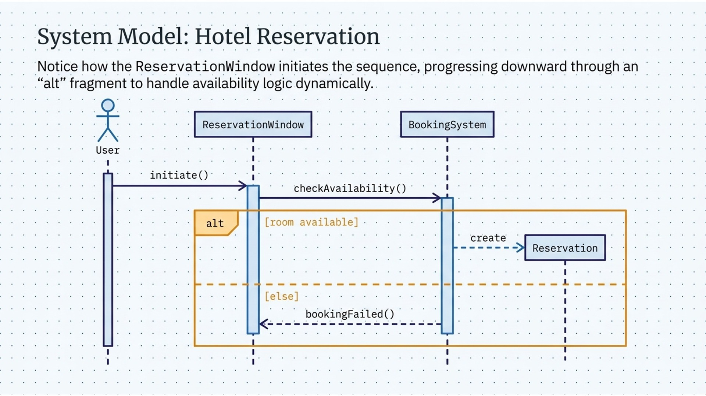
</div>

<!--
Let's analyze a complete case study: 'The Hotel Reservation System.'

Trace the chronological sequence downward:
The guest initiates room booking on the ReservationWindow UI boundary.
The UI delegates to ReservationController.
The controller checks room inventory against RoomService.
Notice the 'alt' fragment: if rooms are available, payment is authorized, booking is persisted, and confirmation returns; else, an unavailability alert is returned.

To summarize this slide, remember this key takeaway: Real-world sequence architectures coordinate UI boundaries, backend controllers, inventory services, and alternative exception branches.
-->

---

<!-- _class: full-image-slide -->

<div class="centered-image">
  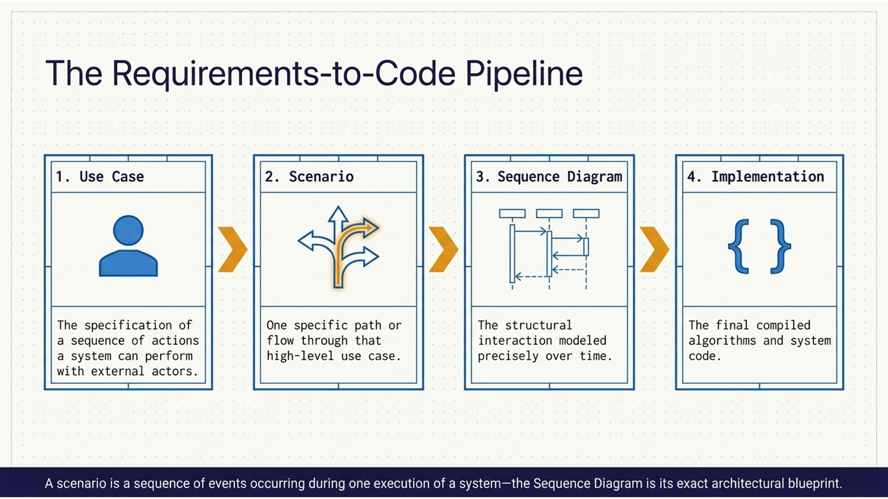
</div>

<!--
Look at this complete software engineering lifecycle: 'The Requirements-to-Code Pipeline.'

Step 1: The Use Case defines the broad contractual goal.
Step 2: Scenarios break down the sunny day and rainy day execution paths.
Step 3: The Sequence Diagram formalizes participants, method signatures, and message exchanges.
Step 4: Clean, robust production code is written with zero architectural ambiguity.

To summarize this slide, remember this key takeaway: Sequence diagrams bridge high-level functional use cases directly to concrete method invocations in code.
-->

---

<!-- _class: full-image-slide -->

<div class="centered-image">
  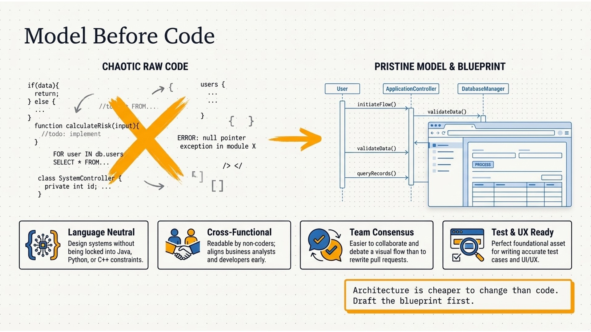
</div>

<!--
To conclude Module 4.5, remember this timeless software engineering axiom: 'Model Before Code.'

On the left: Jumping straight into chaotic raw code produces tangled dependencies, unhandled race conditions, and spaghetti microservices.
On the right: Modeling dynamic interactions first reveals missing API parameters, clarifies controller responsibilities, and aligns teams before a single line of code is committed.

To summarize this slide, remember this key takeaway: Visualizing dynamic interactions before coding prevents costly refactoring and establishes robust system architecture.
-->

---

## AI Assistance: Guidelines for Sequence Modeling

- **1. Persona & Architectural Pattern:**
  - Instruct the AI to act as a *Distributed Systems & API Architect*.
  - Enforce the **Boundary-Control-Entity (BCE)** pattern to ensure clean separation of UI, business logic, and database persistence.
- **2. Message Syntax & Combined Fragments:**
  - **Synchronous Calls (`->`) & Returns (`-->`):** Require explicit return messages with return data types to prevent dangling activation bars.
  - **Asynchronous Messages (`->>`):** Mandate open arrows for background messaging queues, event buses, and webhook alerts.
  - **Control Fragments:** Force the AI to use `alt` for branching (success vs. failure/timeout), `opt` for optional steps, and `loop` for retries.
  - **Activation Lifespans:** Require `activate` and `deactivate` on lifelines.
- **3. Architectural Verification Checklist:**
  - [ ] Did the AI bypass the controller (e.g., UI directly querying database)?
  - [ ] Are alternate branches mutually exclusive with clear guard conditions `[condition]`?
  - [ ] Are asynchronous notifications decoupled from blocking synchronous workflows?

<!--
Sequence diagrams capture runtime interactions over time, and AI needs strict structural guidance to avoid common pitfalls.

The most common AI mistake in sequence diagrams is bypassing architectural layers—having the front-end UI lifeline directly read and write to the database!

By instructing the AI to follow the Boundary-Control-Entity pattern, you force it to route all user requests through an OrderController before touching entities or third-party APIs.

Furthermore, requiring alt combined fragments ensures the model doesn't just show the happy path, but accounts for real-world failures like payment declines and network timeouts.

To summarize this slide, remember this key takeaway: Guide AI sequence generation by enforcing BCE layering, explicit activation bars, and alt failure-handling fragments.
-->

---

## AI Prompt Example: Food Delivery Sequence Model

<div class="two-columns">
<div>

**1. Role & Task Instruction:**
```text
Act as a Senior Backend Systems Architect.
Generate a PlantUML Sequence Diagram
using the Boundary-Control-Entity (BCE) pattern.
```

**2. Modeling Constraints:**
- Define lifelines:
  - `actor Customer as ":Customer"`
  - `boundary CheckoutUI as ":CheckoutUI"`
  - `control OrderCtrl as ":OrderController"`
  - `boundary StripeAPI as ":PaymentGateway"`
  - `entity OrderEntity as ":Order"`
  - `queue KitchenQueue as ":KitchenOrderQueue"`
- Use `alt` fragment for `[Payment Approved]` vs. `[Payment Declined]`.
- Use async `->>` to publish to `KitchenOrderQueue`.
- Include `activate` and `deactivate` bars.

</div>
<div>

**3. Input Requirements Statement:**
> "A Customer initiates checkout by clicking 'Pay Now' on the **CheckoutUI**.
> The **CheckoutUI** forwards `submitOrder(cartItems, paymentInfo)` to the **OrderController**.
> The **OrderController** calls **PaymentGateway** `authorizeCharge(amount, token)`.
> If payment is approved:
> 1. PaymentGateway returns `chargeToken`.
> 2. OrderController calls **Order** entity to persist the new order as `PLACED`.
> 3. OrderController publishes an asynchronous event `orderPlacedEvent` to the **KitchenOrderQueue**.
> 4. OrderController returns `orderSuccess(orderId)` to the CheckoutUI.
> If payment is declined:
> 1. PaymentGateway returns `declinedError`.
> 2. OrderController logs the failure and returns `paymentFailed()` to CheckoutUI without creating an order."

</div>
</div>

<!--
Here is the sequence diagram generation prompt for our food delivery checkout flow.

Notice how the prompt establishes clean architectural boundaries:
We explicitly declare BCE lifelines: CheckoutUI is the boundary, OrderController is the control layer, StripeAPI is the external service, Order is the entity, and KitchenOrderQueue is an asynchronous message broker.

Notice also the alternate execution paths: If payment clears, the controller saves the order and asynchronously dispatches a message to the kitchen. If payment fails, it cleanly aborts without creating orphan database records.

This produces a professional sequence diagram that aligns with production enterprise architecture.

To summarize this slide, remember this key takeaway: Specifying BCE lifelines and explicit alt fragments guides AI to produce robust, production-grade sequence diagrams.
-->

---

### Interactive Activity: Food Delivery Checkout & Failure Flows (Pair Discussion)

<div class="discussion-columns">
  <div class="discussion-text">

  **Pair Discussion: Tracing Runtime Messages & Boundary-Control-Entity**
  - **Scenario:** A customer taps "Confirm & Pay" for a $35 food delivery order.
  - **Lifelines:** `:CheckoutUI` (Boundary), `:OrderController` (Control), `:Order` (Entity), `:PaymentGateway` (External API).
  - **Discussion Prompts with Your Partner (3 Mins):**
    1. Trace the primary message sequence when payment succeeds. Which object instantiates the `:Order` entity?
    2. How would you use an `alt` combined fragment to model payment decline vs. gateway timeout?
    3. Should notifying the restaurant kitchen be a synchronous (`->`) or asynchronous (`->>`) message? Why?

  </div>
  <div class="discussion-logo">
    
  </div>
</div>

<!--
Let's engage in our Section 4.5 pair discussion: Food Delivery Checkout and Failure Flows! Work with your partner as systems integration architects.

Look at the four lifelines on the screen: CheckoutUI as the boundary, OrderController as the controller, Order as the domain entity, and PaymentGateway as the external actor.

First, trace the chronological happy path when payment succeeds: Who calls whom, and when is the Order entity created?
Second, how do you handle payment decline or network timeout using an alt fragment?
Third, should the message alerting the restaurant kitchen be synchronous with a blocking reply, or asynchronous over an event queue?

Take three minutes to trace the execution timeline.

Possible Answers & Debriefing Guide:
1. Message Sequence: CheckoutUI sends 'submitOrder()' to OrderController. The controller queries PaymentGateway with 'authorizeCharge()'. Upon receipt of 'chargeToken', OrderController calls 'createOrder()' to instantiate the persistent Order entity.
2. Alt Fragment: The operand '[paymentApproved]' commits the transaction and transitions to order fulfillment. The '[else / paymentFailed]' operand triggers a rollback, logs the error, and returns 'displayError("Card declined")' to CheckoutUI.
3. Synchronous vs Asynchronous: Kitchen notification should be Asynchronous (open arrow, ->>) dispatched to a message broker (e.g., Kafka / RabbitMQ). Blocking the checkout thread while waiting for a restaurant kitchen tablet to acknowledge would degrade user experience and risk timeout crashes.

To summarize this slide, remember this key takeaway: Sequence diagrams make BCE responsibilities, alternative failure branches, and asynchronous messaging explicit before coding.
-->

---

### Concept Check Question 5
<!-- id: ase-ch04-ccq5 -->
<div class="ccq-columns">
<div class="ccq-text">

In a Boundary-Control-Entity (BCE) sequence diagram, which object should receive the customer's `submitOrder()` event from the checkout UI boundary?

- **A.** The `Order` entity object to immediately save database state.
- **B.** The `PaymentGatewayAPI` boundary object to process payment immediately.
- **C.** The `OrderController` control object to orchestrate business validation and service calls.
- **D.** The `Restaurant` entity object to confirm kitchen capacity.

</div>
<div class="ccq-logo">
    <a href="https://nlhsueh.github.io/nickedupocket/#/student/ase-ch04-ccq5" target="_blank"></a>
  </div>
</div>

<!--
Let's test our understanding of BCE architecture with Concept Check Question 5.

Look at the options:
Option A violates the fundamental BCE rule: UI boundaries must never touch Entity objects directly!
Option B bypasses internal validation to call third-party APIs prematurely.
Option D connects the UI directly to a domain entity.

The correct answer is Option C! The `OrderController` control object must receive the request, validate cart items, coordinate payment, and manage database persistence.

To summarize this slide, remember this key takeaway: Control objects mediate transactions and enforce business rules between UI boundaries and data entities.
-->

---

<!-- _class: lead -->
<!-- header: '4.6 Process & Activity Diagrams' -->

# **4.6 Process & Activity Diagrams**

> "Activity diagrams map the dynamic flow of control, concurrency, and data across collaborating participants."

<!--
We now transition to Module 4.6: Process and Activity Modeling.

While sequence diagrams excel at tracing message exchanges between specific software objects, modern software systems coordinate complex business workflows, multi-actor handoffs, and parallel background threads.

UML Activity Diagrams are the industry standard for modeling dynamic workflows. In this section, we master action nodes, decision logic, fork/join concurrency, and swimlane partitions.

To summarize this slide, remember this key takeaway: Activity diagrams model complex procedural logic, concurrent threads, and multi-actor business workflows.
-->

---

<!-- _class: full-image-slide -->

<div class="centered-image">
  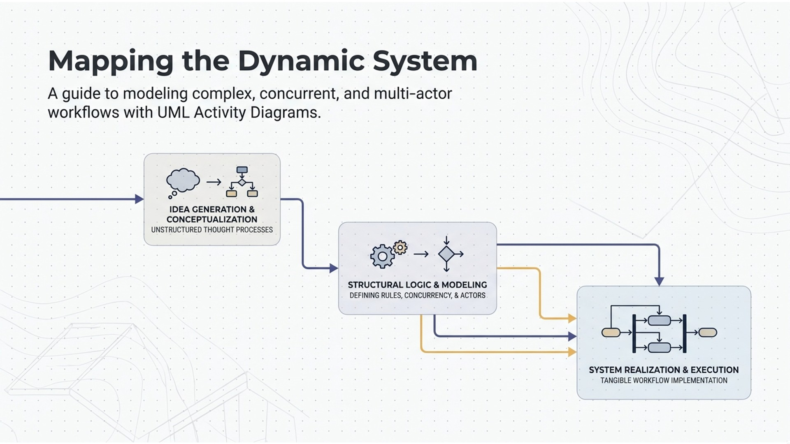
</div>

<!--
Look at this architectural overview: 'Mapping the Dynamic System with UML Activity Diagrams.'

Activity diagrams provide the blueprint for dynamic workflow execution. Whether modeling a customer checkout pipeline, warehouse order dispatch, or multi-threaded background processing, activity diagrams visualize the procedural journey from spark to completion.

Notice how it accommodates idea generation, algorithm logic, and multi-actor collaboration.

To summarize this slide, remember this key takeaway: Activity diagrams provide an expressive visual notation for dynamic process flows and system behavior.
-->

---

<!-- _class: full-image-slide -->

<div class="centered-image">
  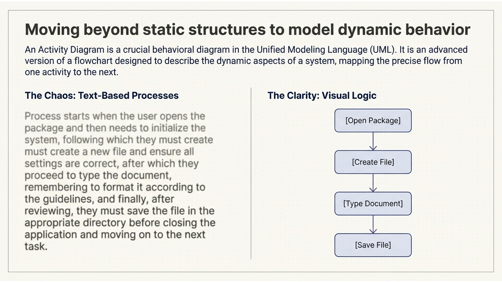
</div>

<!--
Notice this transition: 'Moving Beyond Static Structures to Model Dynamic Behavior.'

An Activity Diagram is an advanced, standardized evolution of the traditional flowchart. Unlike simple flowcharts, UML activity diagrams formally define object states, concurrent execution threads, and responsibility partitions.

It models the precise flow of control from one activity to the next across system components.

To summarize this slide, remember this key takeaway: Activity diagrams elevate simple flowcharts into formal engineering models supporting concurrency and state.
-->

---

<!-- _class: full-image-slide -->

<div class="centered-image">
  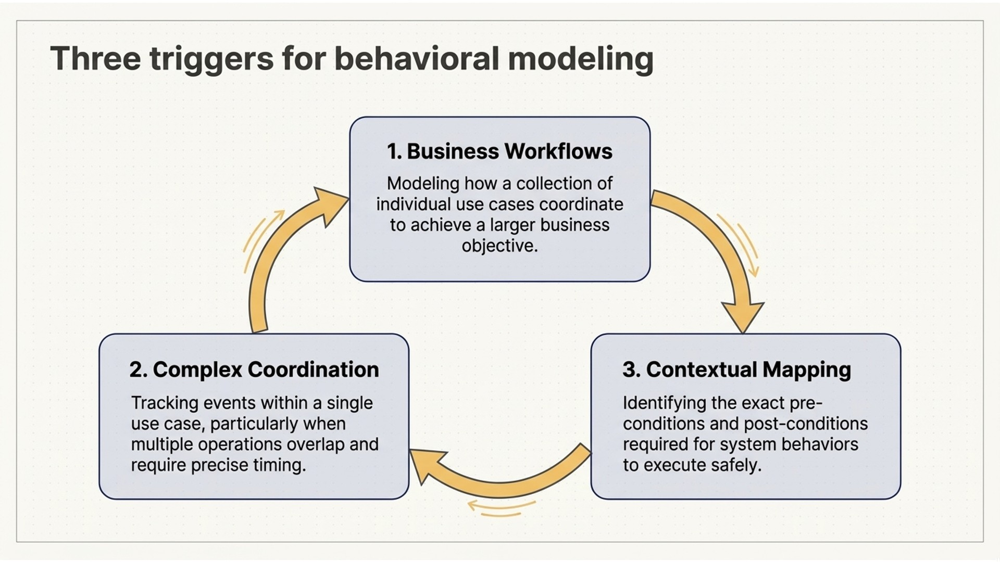
</div>

<!--
When should you create an activity diagram? Look at the 'Three Triggers for Behavioral Modeling':

Trigger 1: Business Workflows—modeling how multiple independent use cases coordinate across operational steps.
Trigger 2: Complex Algorithmic Logic—detailing intricate calculations, data processing pipelines, or decision trees.
Trigger 3: Distributed System Orchestration—mapping how microservices, message queues, and external APIs hand off control.

To summarize this slide, remember this key takeaway: Use activity diagrams to model cross-use-case business processes, complex algorithms, and distributed orchestration.
-->

---

<!-- _class: full-image-slide -->

<div class="centered-image">
  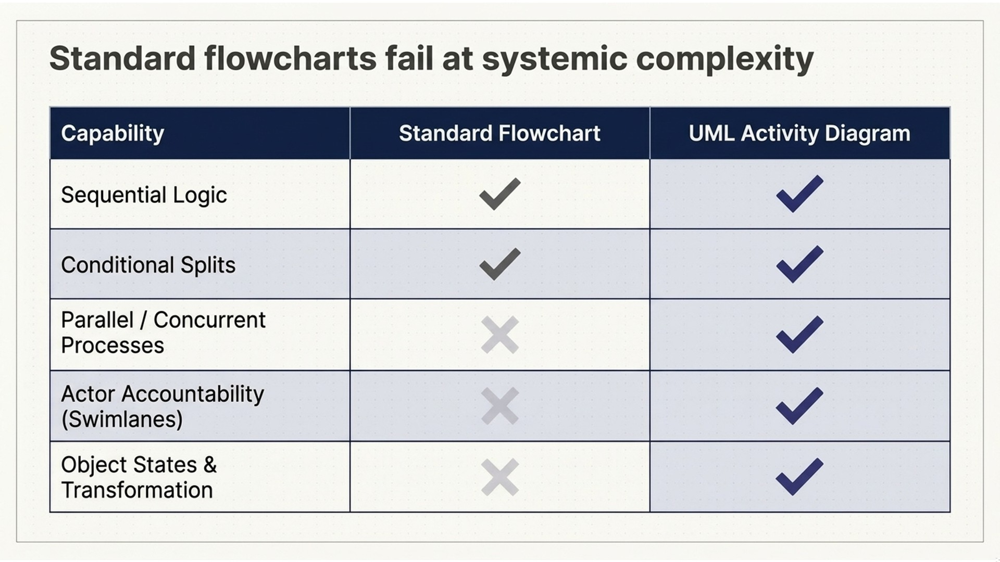
</div>

<!--
Compare these capabilities: 'Standard Flowcharts vs. UML Activity Diagrams.'

Standard flowcharts fall apart when systems scale:
- Flowcharts cannot model true parallel concurrency; Activity diagrams provide formal Fork and Join nodes.
- Flowcharts lack participant accountability; Activity diagrams introduce Swimlanes.
- Flowcharts ignore data transformation; Activity diagrams feature explicit Object Nodes and Object Flows.

To summarize this slide, remember this key takeaway: UML activity diagrams overcome standard flowchart limitations by supporting concurrency, swimlanes, and object data flows.
-->

---

<!-- _class: full-image-slide -->

<div class="centered-image">
  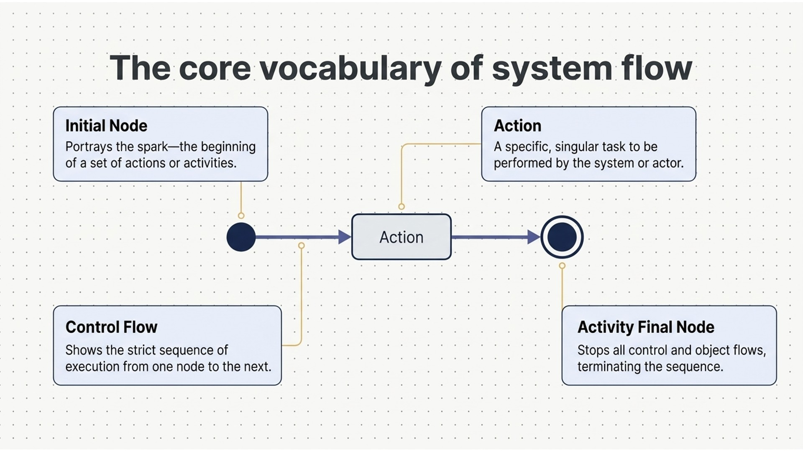
</div>

<!--
Examine 'The Core Vocabulary of System Flow':

1. Initial Node: A filled black circle representing the starting trigger of the workflow.
2. Action Node: A rounded rectangle representing a discrete, non-interruptible operational step (e.g., 'Verify Payment').
3. Control Flow: A solid directed line showing the transfer of control.
4. Activity Final Node: A bullseye circle indicating the complete termination of all active threads in the workflow.

To summarize this slide, remember this key takeaway: Master core nodes—initial starting nodes, rounded action steps, control flow edges, and final termination bullseyes.
-->

---

<!-- _class: full-image-slide -->

<div class="centered-image">
  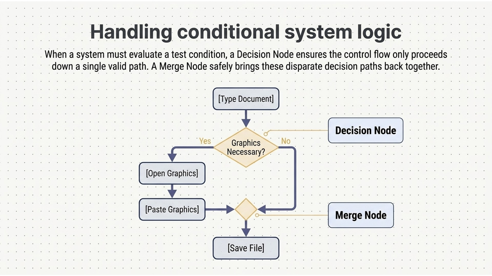
</div>

<!--
Look at 'Handling Conditional System Logic':

Notice the diamond notation used in two symmetrical roles:
Decision Node (1 input, multiple outputs): Evaluates guard conditions [in brackets] to select exactly ONE outgoing path.
Merge Node (multiple inputs, 1 output): Safely reunites alternative branching paths back into a single unified control flow without synchronization.

To summarize this slide, remember this key takeaway: Decision nodes choose mutually exclusive branches based on guards; merge nodes safely reunite alternative paths.
-->

---

<!-- _class: full-image-slide -->

<div class="centered-image">
  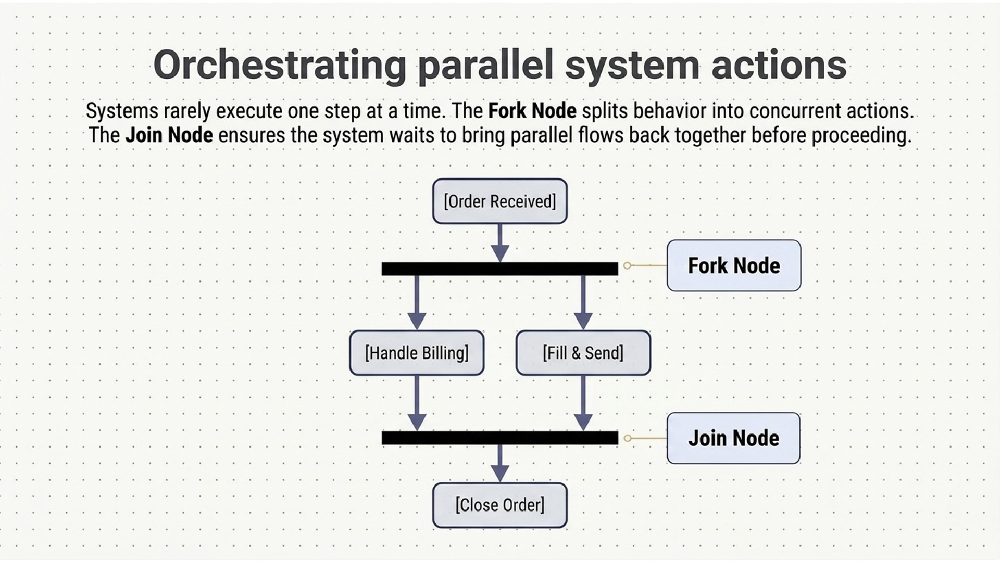
</div>

<!--
Now examine true concurrency: 'Fork and Join Nodes.'

Represented by a solid black synchronization bar:
Fork Node (1 input, multiple outputs): Splits incoming control flow into multiple concurrent, parallel execution threads.
Join Node (multiple inputs, 1 output): Synchronizes parallel flows—it blocks until ALL incoming concurrent branches have finished before allowing the flow to proceed!

To summarize this slide, remember this key takeaway: Fork nodes split execution into concurrent parallel threads; join nodes synchronize and wait for all threads to complete.
-->

---

<!-- _class: full-image-slide -->

<div class="centered-image">
  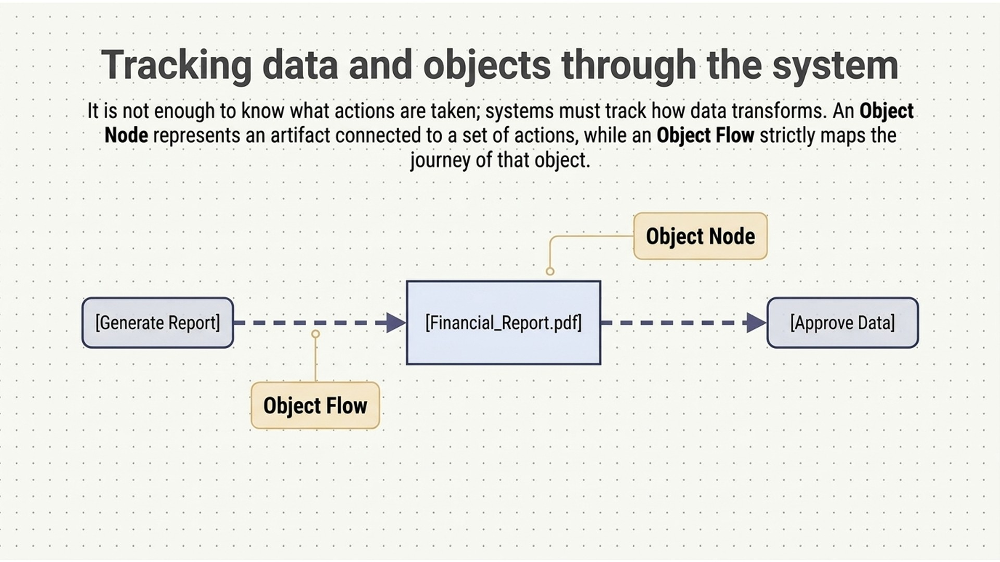
</div>

<!--
Workflows do not just execute actions—they transform data! Look at 'Object Nodes and Object Flows':

An Object Node (represented by a rectangle, often with [State] in brackets) represents a physical or digital artifact—such as 'Order [Created]' or 'Invoice [Paid]'.
A dashed or annotated Object Flow line traces the journey of that data artifact into and out of action nodes.

To summarize this slide, remember this key takeaway: Object nodes and flows document how data artifacts change states across workflow actions.
-->

---

<!-- _class: full-image-slide -->

<div class="centered-image">
  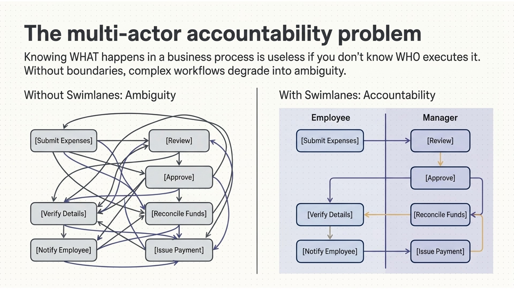
</div>

<!--
Consider 'The Multi-Actor Accountability Problem.'

Knowing WHAT happens in a business process is useless if you do not know WHO is responsible for executing it!
Without organizational boundaries, complex enterprise workflows degrade into finger-pointing, missed handoffs, and architectural ambiguity.

Swimlanes solve this by assigning clear responsibility to every action.

To summarize this slide, remember this key takeaway: Workflows require unambiguous actor accountability to prevent missed handoffs and organizational chaos.
-->

---

<!-- _class: full-image-slide -->

<div class="centered-image">
  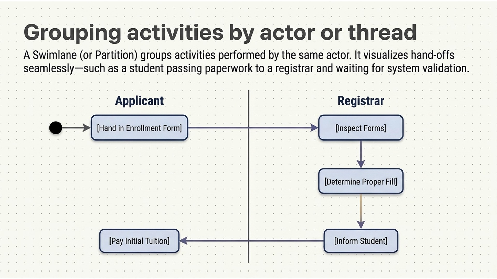
</div>

<!--
Look at the solution: 'Swimlanes (Partitions).'

Vertical or horizontal swimlane columns group activities by participating actor or subsystem:
Notice: The 'Applicant' fills out forms in Lane 1, the paperwork crosses the swimlane boundary to the 'Registrar' in Lane 2, and backend verification executes in Lane 3.
Cross-swimlane arrows make actor handoffs crystal clear.

To summarize this slide, remember this key takeaway: Swimlanes divide the workflow canvas into structural columns to explicitly map operational ownership.
-->

---

<!-- _class: full-image-slide -->

<div class="centered-image">
  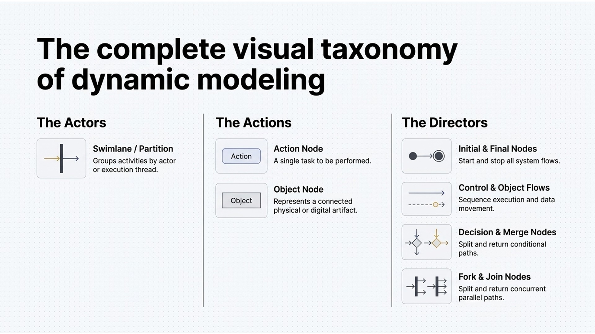
</div>

<!--
Here is your essential reference: 'The Complete Visual Taxonomy of Dynamic Modeling.'

Review all standard UML activity symbols in one unified view:
- The Actors: Partitions and Swimlanes
- The Actions: Initial, Action, Decision/Merge, Fork/Join, Object, and Final Nodes
- The Connectors: Control flows and Object flows

Keep this taxonomy handy whenever you draft architectural workflows.

To summarize this slide, remember this key takeaway: Master the visual taxonomy to fluently model control logic, concurrency, data states, and actor partitions.
-->

---

<!-- _class: full-image-slide -->

<div class="centered-image">
  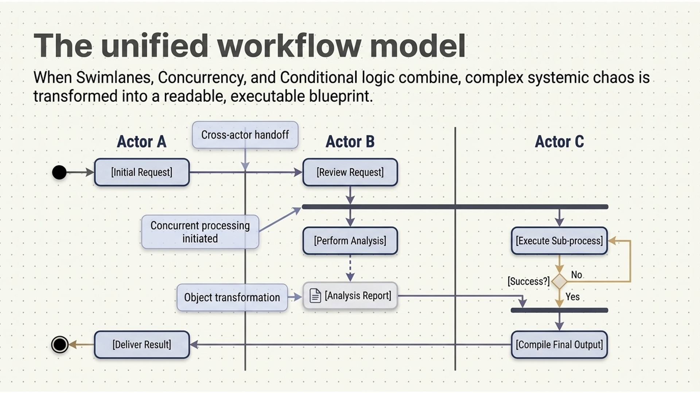
</div>

<!--
Look at this synthesis: 'The Unified Workflow Model.'

When Swimlanes, Concurrency (Fork/Join), and Conditional Logic (Decision/Merge) combine, complex system chaos transforms into a clean, executable engineering blueprint.
Notice how easily an architect or developer can trace sunny day paths, exception recovery, and parallel tasks at a glance.

To summarize this slide, remember this key takeaway: Combining swimlanes, concurrency, and conditional branching produces a production-ready workflow blueprint.
-->

---

<!-- _class: full-image-slide -->

<div class="centered-image">
  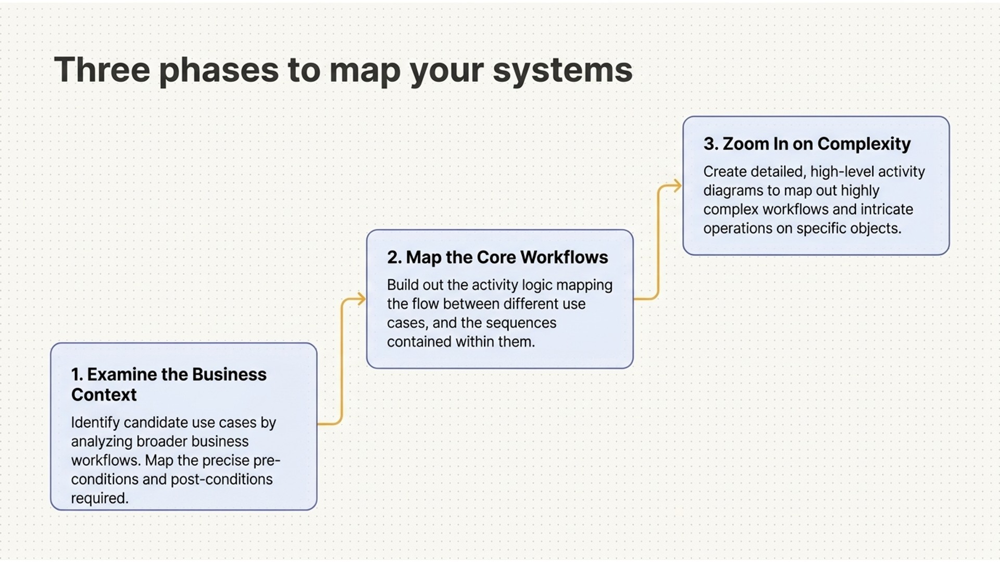
</div>

<!--
To conclude Module 4.6, follow these 'Three Phases to Map Your Systems':

Phase 1: Discover High-Level Process—outline main use-case goals and primary actors.
Phase 2: Establish Responsibility Boundaries—draw swimlanes for each participating role or microservice.
Phase 3: Zoom In on Complexity—add decision branches, fork/join concurrency, and data object state transitions.

To summarize this slide, remember this key takeaway: Progressively design workflows from high-level discovery to swimlane allocation and detailed concurrency modeling.
-->

---

## AI Assistance: Guidelines for Activity Modeling

- **1. Persona & Syntax Standard:**
  - Instruct the AI to act as a *Distributed Workflow & Business Process Architect*.
  - Require the modern **PlantUML Activity Beta syntax** (`start`, `stop`, `if (...) then (...) else (...)`, `fork`, `join`).
- **2. Swimlane Responsibility Boundaries:**
  - Require vertical or horizontal swimlanes (e.g., `|Customer|`, `|Restaurant Kitchen|`, `|Dispatch Engine|`, `|Delivery Courier|`) to allocate actions to distinct roles or microservices.
- **3. Concurrency & Synchronization Rules:**
  - **Fork (`fork` / `fork again`):** Explicitly state which processes occur simultaneously in parallel.
  - **Join (`end fork`):** Mandate a join synchronization bar before any action that requires all parallel branches to complete.
  - **Decision Diamonds:** Require explicit, mutually exclusive guard conditions on decision branches.
- **4. Architectural Verification Checklist:**
  - [ ] Does every `fork` have a corresponding `join` synchronization bar?
  - [ ] Are transitions crossing swimlane boundaries logically valid and minimal?
  - [ ] Are there deadlock states where an activity waits on an unfulfillable condition?

<!--
Activity diagrams represent complex workflows, and guiding AI requires strict concurrency rules.

LLMs frequently get confused by parallel execution. They often model concurrent operations as sequential steps, or they create fork bars without a corresponding join, resulting in dangling execution tokens and uncoordinated workflows.

By instructing the AI to use swimlanes, you force it to allocate responsibility to specific actors or microservices. And by explicitly specifying fork and join points, you ensure that parallel branches—like cooking food while dispatching a driver—synchronize correctly before delivery begins.

To summarize this slide, remember this key takeaway: Direct AI activity modeling by defining actor swimlanes, explicit fork/join concurrency bars, and mutually exclusive decision guards.
-->

---

## AI Prompt Example: Food Delivery Activity Model

<div class="two-columns">
<div>

**1. Role & Task Instruction:**
```text
Act as a Distributed Workflow Architect.
Generate a PlantUML Activity Diagram
using swimlanes and parallel concurrency.
```

**2. Modeling Constraints:**
- Use 4 swimlanes:
  - `|Customer|`, `|Restaurant Kitchen|`,
  - `|Dispatch Engine|`, `|Delivery Courier|`
- Immediately after order confirmation, insert a `fork` bar:
  - Branch 1: Kitchen prepares and packages meal.
  - Branch 2: Dispatch matches and assigns courier.
- Use `end fork` (join) to synchronize food packaged AND courier arrived at store.
- Use valid PlantUML activity beta syntax.

</div>
<div>

**3. Input Requirements Statement:**
> "Workflow begins in the **Customer** swimlane when the user confirms and pays for an order.
> Once confirmed, two parallel processes initiate:
> - In **Restaurant Kitchen**: Staff receive order ticket, prepare food items, and package the meal into a delivery bag.
> - Simultaneously, in **Dispatch Engine**: The system calculates transit route, queries nearby available couriers, and dispatches a delivery offer.
> In the **Delivery Courier** swimlane, the courier accepts the assignment and drives to the restaurant.
> **Synchronization Milestone:** The courier cannot pick up the order until BOTH the food packaging is complete AND the courier has arrived at the store.
> Once synchronized, kitchen hands off food to courier. Courier transports meal to customer address, customer verifies delivery with OTP, and the process ends."

</div>
</div>

<!--
Here is the prompt for generating the food delivery activity workflow.

Notice the synchronization logic on screen:
We define four clear swimlanes so every action has an unambiguous owner.
As soon as the customer pays, a fork bar splits execution: the kitchen cooks while the dispatch engine finds a courier in parallel.

Look at the join rule: Both branches must complete before the food handoff can occur. The courier cannot leave without the food, and the food cannot sit getting cold without a driver.

Feeding this structured prompt to an LLM produces a flawless swimlane activity diagram with verified parallel execution.

To summarize this slide, remember this key takeaway: Specifying parallel swimlane workflows and explicit synchronization barriers ensures AI models complex business concurrency accurately.
-->

---

### Interactive Activity: Food Delivery Kitchen & Dispatch Concurrency (Pair Discussion)

<div class="discussion-columns">
  <div class="discussion-text">

  **Pair Discussion: Modeling Parallelism & Swimlanes in Food Delivery**
  - **Scenario:** The moment an order is confirmed, meal cooking and courier dispatch must run in parallel.
  - **Swimlanes:** `Customer`, `Restaurant Kitchen`, `Dispatch Engine`, `Courier`.
  - **Discussion Prompts with Your Partner (3 Mins):**
    1. Where should a **Fork Bar** be placed immediately after order payment? Which two parallel flows branch out?
    2. Where must a **Join Bar** synchronize before the courier can begin transit to the customer?
    3. What happens if the courier arrives at the restaurant before the kitchen finishes cooking? How does your activity diagram represent that waiting state?

  </div>
  <div class="discussion-logo">
    
  </div>
</div>

<!--
Let's dive into our Section 4.6 pair discussion: Food Delivery Kitchen and Dispatch Concurrency! Turn to your partner and think like workflow and operations architects.

We have four swimlanes: Customer, Restaurant Kitchen, Dispatch Engine, and Delivery Courier.

First, where does the fork bar occur? As soon as payment clears, the kitchen starts preparing food while the dispatch engine searches for and assigns a nearby courier simultaneously!
Second, where does the join bar happen? The courier cannot deliver the meal until both the food is packaged and the courier has arrived at the pickup counter.
Third, how do you model the race condition where the courier arrives early, or the kitchen finishes early?

Spend three minutes drawing the workflow logic with your partner.

Possible Answers & Debriefing Guide:
1. Fork Bar: Placed immediately after 'Confirm Order Payment'. One parallel branch flows into the Restaurant Kitchen swimlane ('Cook Meal' -> 'Package Order'), while the second branch flows into Dispatch Engine ('Locate Nearby Courier' -> 'Assign Courier' -> 'Courier Drives to Restaurant').
2. Join Bar: A synchronization join bar is placed before 'Handoff Food to Courier' and 'Deliver to Customer'. Both 'Order Packaged' and 'Courier Arrived at Store' must complete before handoff occurs.
3. Waiting State: The join bar naturally models synchronization waiting. If the courier arrives first, token execution pauses at the join bar until the kitchen finishes packaging the food, preventing premature departure without the meal.

To summarize this slide, remember this key takeaway: Activity diagrams capture concurrent parallel branches and synchronization barriers across multi-actor swimlanes.
-->

---

### Concept Check Question 6
<!-- id: ase-ch04-ccq6 -->
<div class="ccq-columns">
<div class="ccq-text">

In a UML Activity Diagram, what is the critical behavioral difference between a **Fork/Join** synchronization bar and a **Decision/Merge** diamond?

- **A.** Fork/Join splits and synchronizes concurrent parallel threads; Decision/Merge evaluates guards to pick exactly one mutually exclusive branch.
- **B.** Fork/Join is used for sequential database transactions; Decision/Merge is used for swimlane partitioning.
- **C.** Fork/Join models class inheritance; Decision/Merge models object creation.
- **D.** Fork/Join requires human operator approval; Decision/Merge is executed by automated timers.

</div>
<div class="ccq-logo">
    <a href="https://nlhsueh.github.io/nickedupocket/#/student/ase-ch04-ccq6" target="_blank"></a>
  </div>
</div>

<!--
Let's verify our understanding of activity diagram nodes with Concept Check Question 6.

Look at the options:
Option B confuses concurrency with database commits.
Option C confuses structural class concepts with activity nodes.
Option D invents fictitious restrictions.

The correct answer is Option A! A Fork node splits a single flow into multiple concurrent parallel threads, and the Join node waits for ALL threads to complete before proceeding. In contrast, a Decision node evaluates guards to route control down exactly ONE alternative branch.

To summarize this slide, remember this key takeaway: Fork/Join manages concurrent parallel execution; Decision/Merge manages mutually exclusive conditional branching.
-->

---

<!-- _class: lead -->
<!-- header: '4.7 Behavioral & State Machine Models' -->

# **4.7 Behavioral & State Machine Models**

> "A system in dynamic execution is defined by the states it occupies and the events that trigger transitions."

<!--
We now transition to Module 4.7: Behavioral Models and State Machine Diagrams.

While class diagrams show static structure and sequence diagrams show message flow for a single scenario, reactive systems—such as autonomous vehicles, medical pumps, and order fulfillment pipelines—are best understood as finite state machines.

In this section, we study UML State Machine Diagrams, analyze state-dependent behavior, explore the four event triggers, distinguish instantaneous actions from ongoing activities, and examine composite states and system memory.

To summarize this slide, remember this key takeaway: State machines model how reactive systems transition between discrete operational states in response to external events.
-->

---

<!-- _class: full-image-slide -->

<div class="centered-image">
  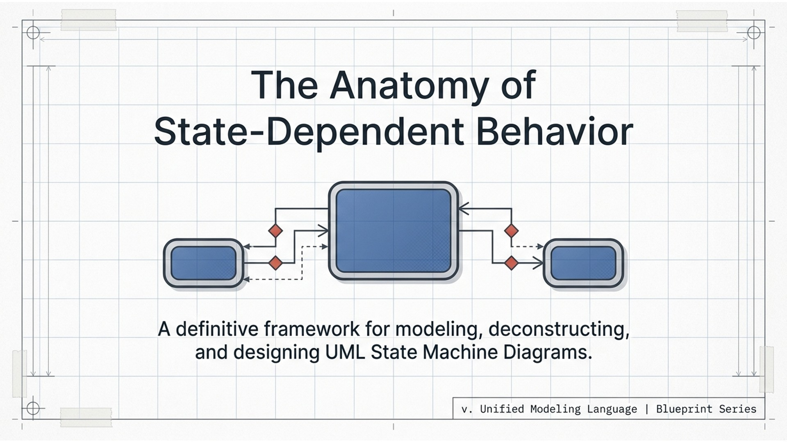
</div>

<!--
Look at this architectural overview: 'The Anatomy of State-Dependent Behavior.'

In software engineering, many systems cannot be modeled by simple stateless algorithms. Their behavior is intrinsically reactive—their response to an external stimulus depends fundamentally on their internal state.

UML State Machine Diagrams, based on David Harel's Statecharts, provide the formal mathematical framework for modeling, deconstructing, and verifying state-dependent systems.

To summarize this slide, remember this key takeaway: State machine diagrams formalize the state-dependent behavior of reactive software entities over their full lifecycle.
-->

---

<!-- _class: full-image-slide -->

<div class="centered-image">
  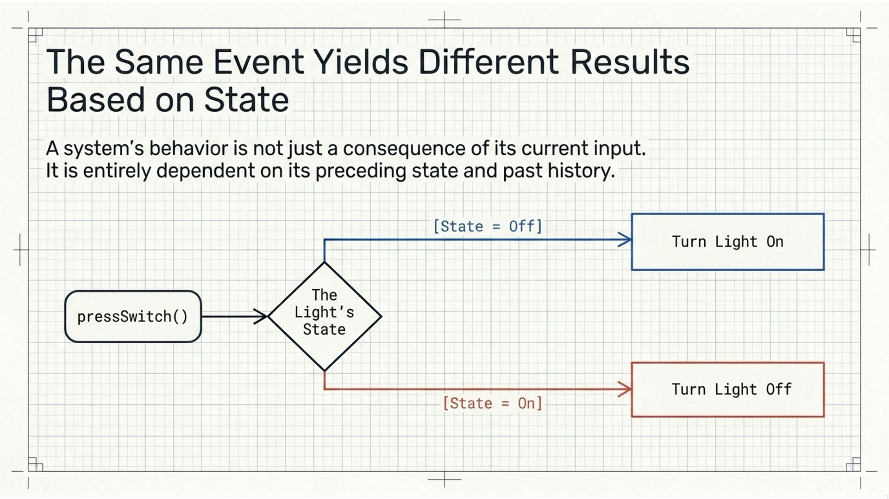
</div>

<!--
Look at this foundational principle: 'The Same Event Yields Different Results Based on State.'

Notice the lightbulb or machine switch:
When the system is in the [Off] state, pressing the 'Power' button turns the machine On.
When the system is in the [On] state, pressing the exact same 'Power' button turns the machine Off!

A system's runtime behavior is not merely a consequence of its current input—it is entirely dictated by its preceding operational state and past history.

To summarize this slide, remember this key takeaway: In state-dependent systems, identical events trigger completely different behaviors depending on the active state.
-->

---

<!-- _class: full-image-slide -->

<div class="centered-image">
  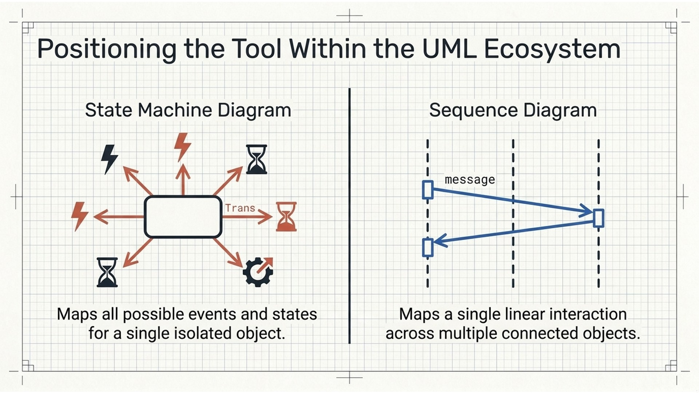
</div>

<!--
Examine 'Positioning the Tool Within the UML Ecosystem':

Notice how state machine diagrams complement the other core UML models:
- Class Diagram: Defines static entity blueprints, fields, and operations.
- Sequence Diagram: Traces multi-object message exchanges for a specific single use-case scenario.
- State Machine Diagram: Zooms in on ONE critical entity (such as Order, Vehicle, or Account) and models its entire lifetime across all possible scenarios!

To summarize this slide, remember this key takeaway: State machines focus deeply on a single entity's full operational lifecycle across all possible external scenarios.
-->

---

<!-- _class: full-image-slide -->

<div class="centered-image">
  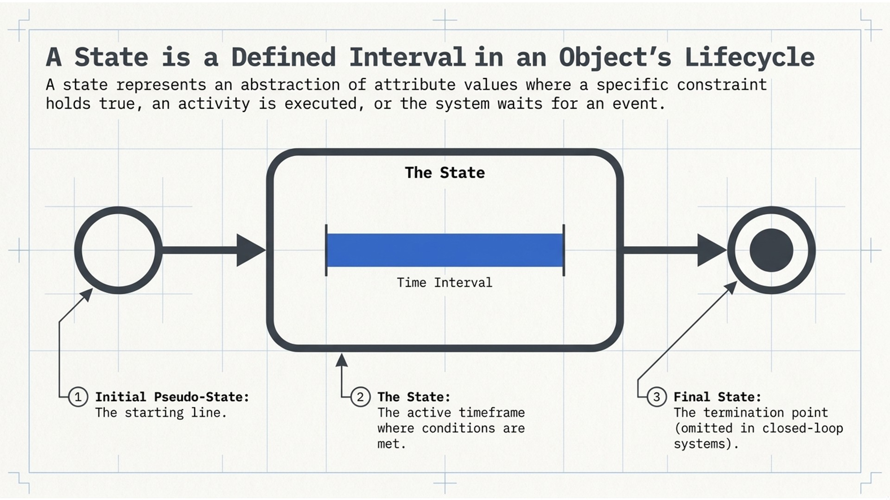
</div>

<!--
What exactly is a 'State'? Look at this formal definition:

A state is not just a label—it represents a defined time interval in an object's life during which:
1. A specific invariant condition holds true (e.g., account balance > 0).
2. The object performs an ongoing computation or activity (e.g., cooling room).
3. The object waits for an incoming trigger event (e.g., waiting for payment authorization).

To summarize this slide, remember this key takeaway: A state is a sustained time interval characterized by invariant conditions, ongoing activities, or wait states.
-->

---

<!-- _class: full-image-slide -->

<div class="centered-image">
  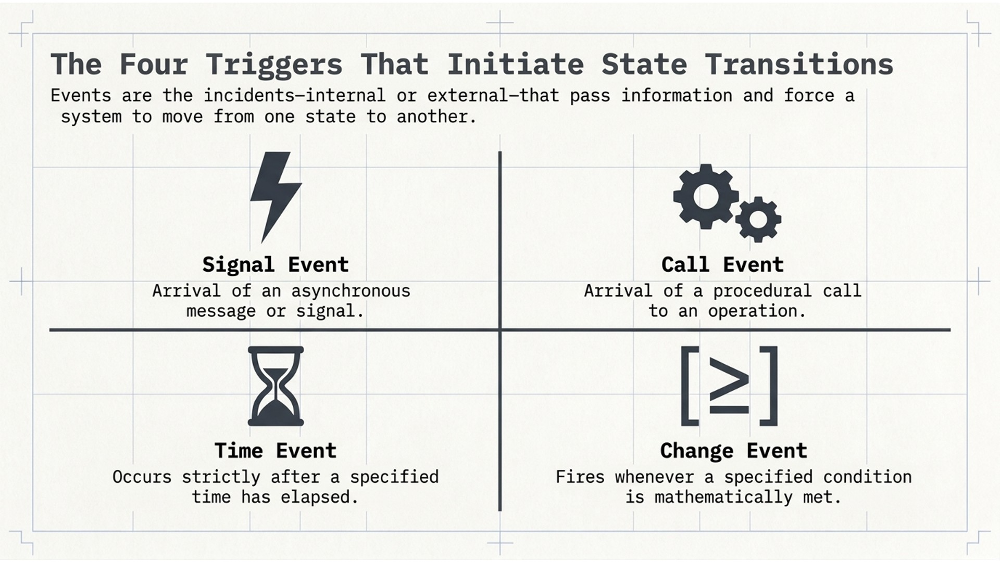
</div>

<!--
How do state transitions fire? Look at 'The Four Triggers That Initiate State Transitions':

1. Signal Event: Arrival of an asynchronous broadcast signal or message packet.
2. Call Event: Synchronous invocation of an object method by a caller.
3. Time Event: Passage of a designated duration, declared with 'after(duration)' or 'at(time)'.
4. Change Event: A continuous boolean expression becoming true, declared with 'when(condition)'.

To summarize this slide, remember this key takeaway: UML formalizes four event triggers—asynchronous signals, method calls, elapsed time, and boolean condition changes.
-->

---

<!-- _class: full-image-slide -->

<div class="centered-image">
  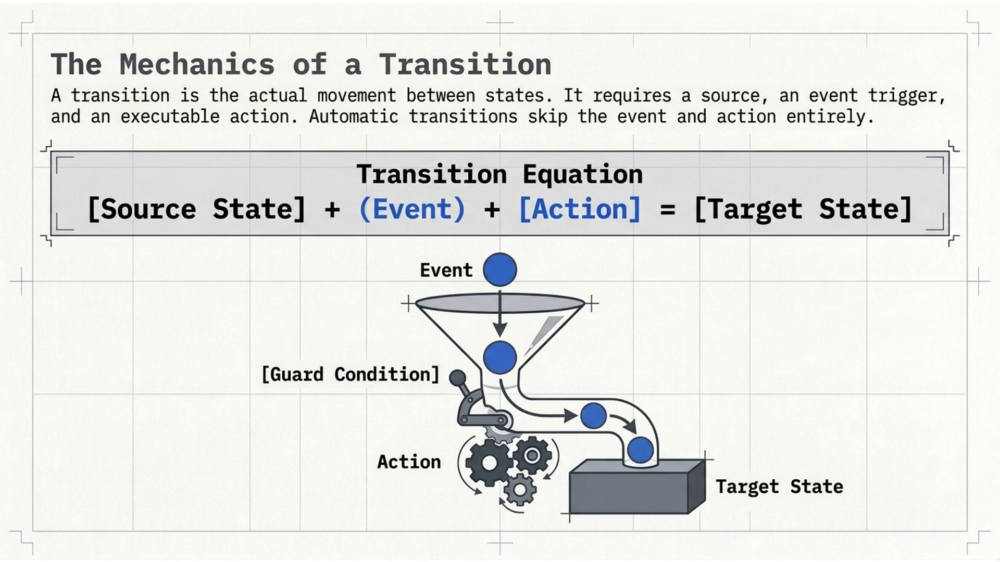
</div>

<!--
Look at 'The Mechanics of a Transition':

A transition represents the legal movement between states. Its formal syntax follows the classic transition equation:
Source State + Event Trigger [Guard Condition] / Action Effect = Target State.

Notice the elements:
The Trigger fires the attempt.
The Guard in brackets must evaluate to true.
The Action in slash executes atomically.
If no event is specified, it is an Automatic Completion Transition that fires when internal activities finish.

To summarize this slide, remember this key takeaway: Transitions formally bind source states, trigger events, boolean guards, and action effects into target states.
-->

---

<!-- _class: full-image-slide -->

<div class="centered-image">
  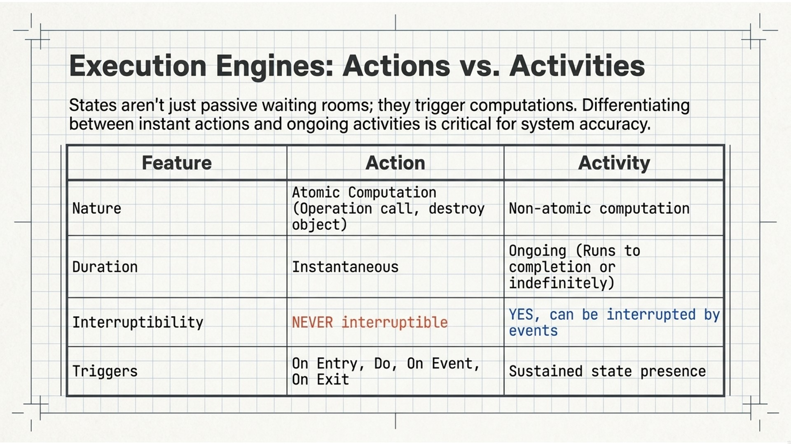
</div>

<!--
Here is one of the most critical conceptual distinctions in UML: 'Actions versus Activities.'

Notice the contrast:
- Action (/ action): Instantaneous, atomic, and non-interruptible. It executes in zero logical time during a transition or state boundary.
- Activity (do / activity): Ongoing, durational, and interruptible! It executes continuously while the object occupies the state, and halts immediately if an outgoing event fires.

To summarize this slide, remember this key takeaway: Actions are instantaneous and non-interruptible; activities are durational computations that execute while occupying a state.
-->

---

<!-- _class: full-image-slide -->

<div class="centered-image">
  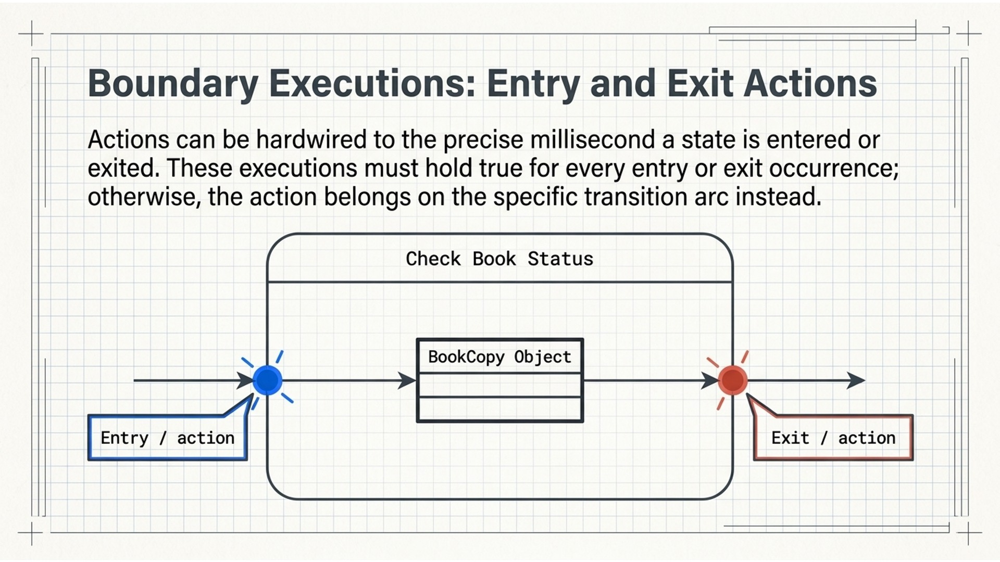
</div>

<!--
Examine 'Boundary Executions: Entry and Exit Actions':

State boundaries provide powerful encapsulation guarantees:
- entry / action: Hardwired execution that fires every single time the state is entered, regardless of which incoming transition brought the system there.
- exit / action: Hardwired execution that fires every single time the state is exited, ensuring clean teardown and resource deallocation.

This prevents duplicated cleanup logic across multiple transition arrows.

To summarize this slide, remember this key takeaway: Entry and exit actions guarantee setup and cleanup executions on every state boundary crossing.
-->

---

<!-- _class: full-image-slide -->

<div class="centered-image">
  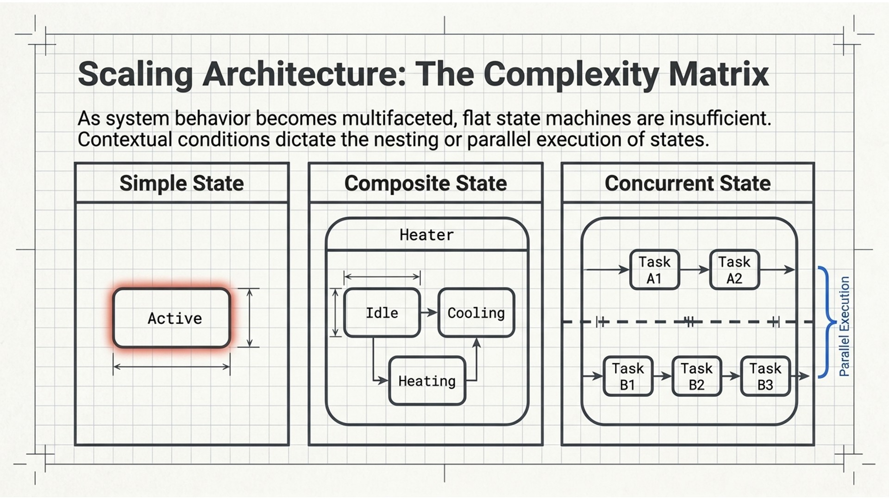
</div>

<!--
Look at 'Scaling Architecture: The Complexity Matrix':

As real-world software scales, flat state machines suffer from combinatorial state explosion—leading to unreadable spaghetti transitions.
UML solves this by introducing hierarchical complexity:
- Simple States: Atomic operational conditions.
- Composite States: High-level states containing nested sub-state machines.
- Orthogonal States: Composite states partitioned into concurrent parallel regions.

To summarize this slide, remember this key takeaway: Hierarchical composite states prevent combinatorial state explosion in complex enterprise and embedded systems.
-->

---

<!-- _class: full-image-slide -->

<div class="centered-image">
  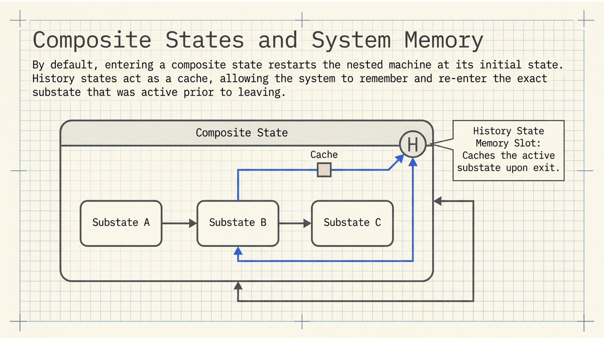
</div>

<!--
Look at this sophisticated mechanism: 'Composite States and System Memory.'

By default, entering a composite state restarts execution at its initial substate.
However, what if an urgent interrupt occurs—such as a power failure or phone call—and the system needs to resume exactly where it was?
History Pseudo-States (H for shallow history, H* for deep history) act as system memory cache, restoring the exact active substate prior to interruption.

To summarize this slide, remember this key takeaway: History pseudo-states allow nested state machines to resume execution from their most recently active substate.
-->

---

<!-- _class: full-image-slide -->

<div class="centered-image">
  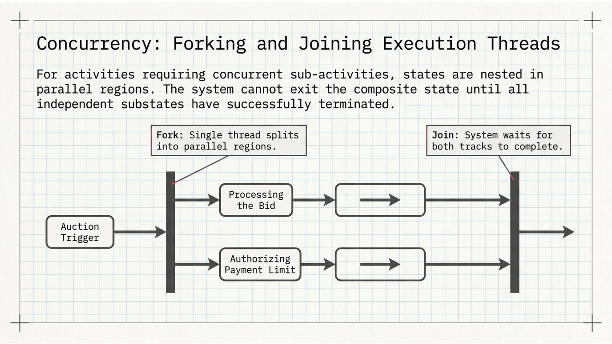
</div>

<!--
Now examine 'Concurrency in State Machines: Forking and Joining.'

Notice the orthogonal regions separated by dashed lines:
When a system enters a concurrent composite state, execution forks into multiple parallel substates simultaneously (e.g., audio playback and battery monitoring).
The composite state cannot terminate until all independent parallel regions have reached their final states and synchronized at the join.

To summarize this slide, remember this key takeaway: Orthogonal regions model concurrent, multi-threaded substate execution within a single parent state machine.
-->

---

<!-- _class: full-image-slide -->

<div class="centered-image">
  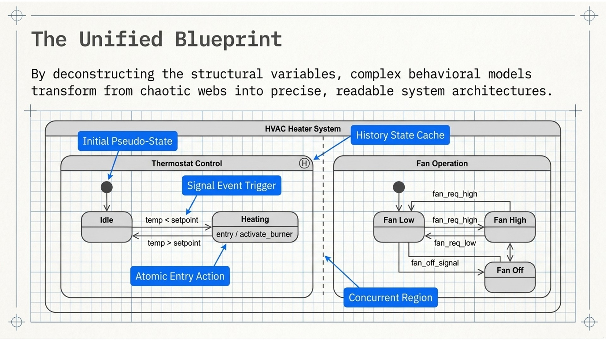
</div>

<!--
Here is 'The Unified Blueprint: HVAC Industrial Case Study.'

Trace the complete architectural synthesis:
- The system starts at the Initial Pseudo-State and enters the Off state.
- Switching On transitions into the Active composite state.
- Inside Active, the thermostat evaluates ambient temperature against setpoints, transitioning between Heating and Cooling.
- Notice safety interlocks: a SensorFault event immediately bypasses substates to enter the Lockout emergency state!

To summarize this slide, remember this key takeaway: Real-world state architectures unify initial states, composite thermostat control, history memory, and safety exception transitions.
-->

---

<!-- _class: full-image-slide -->

<div class="centered-image">
  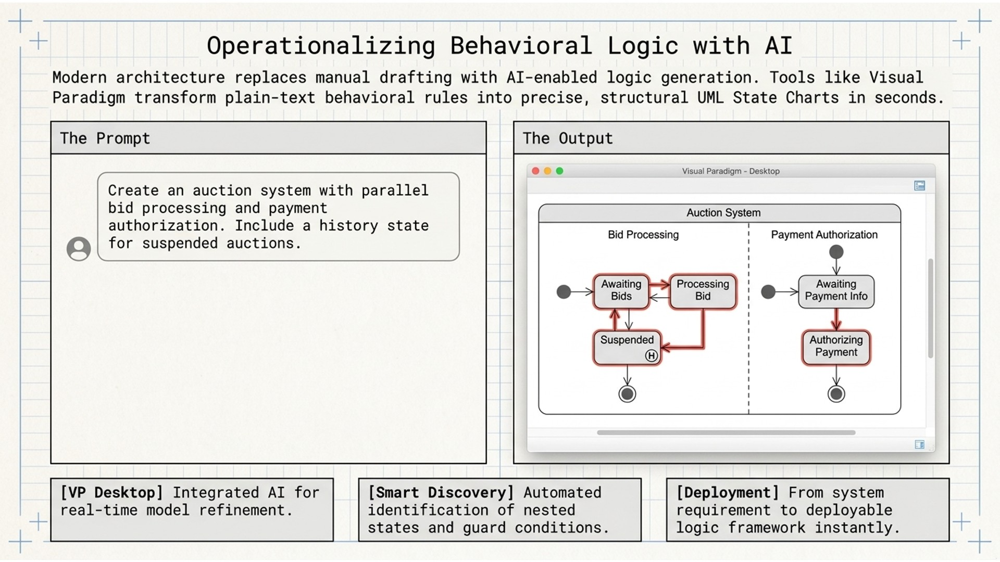
</div>

<!--
To conclude Module 4.7, look at 'Operationalizing Behavioral Logic with AI.'

Modern software engineering replaces tedious manual statechart drafting with AI-accelerated logic generation.
Architects can feed natural language state rules or safety specifications into AI modeling copilots, generating verified, compilable UML state machines in seconds.
The architect's role shifts from drawing boxes to verifying edge-case transitions and guard safety.

To summarize this slide, remember this key takeaway: Generative AI copilots transform plain-text behavioral rules into formal, verifiable UML state machines.
-->

---

## AI Assistance: Guidelines for State Machine Modeling

- **1. Persona & Finite State Discipline:**
  - Instruct the AI to act as a *Formal Systems Verification Engineer*.
  - Enforce finite state machine (FSM) rigor: states represent *discrete, observable conditions* of an entity over time, never temporary actions.
- **2. Transition Notation & Invariant Syntax:**
  - Mandate the formal UML 2.5 transition syntax:
    `TriggerEvent [GuardCondition] / ActionEffect`
  - Require explicit `entry /` and `exit /` actions on critical states.
  - Require initial state (`[*] -->`) and terminal state (`--> [*]`).
- **3. Defensive Exception & Cancellation Rules:**
  - Mandate guard conditions to block illegal transitions (e.g., canceling an order once kitchen prep has started).
  - Explicitly model timeout events and failure transitions.
- **4. Architectural Verification Checklist:**
  - [ ] Are all state names passive/adjectival conditions (`Placed`, `Preparing`, `Delivered`) rather than verbs?
  - [ ] Are guard conditions mutually exclusive to prevent non-deterministic state branching?
  - [ ] Is there an unreachable state or an accidental infinite loop?

<!--
State machine diagrams require high mathematical precision, and AI needs strict guardrail prompting.

The number one mistake AI makes in state modeling is naming states with verbs—like 'Cooking Food' or 'Assigning Driver'—treating states as if they were activities!

By instructing the AI to use formal adjectives or past-participle states like 'Placed', 'Preparing', and 'ReadyForPickup', you enforce proper FSM semantics.

Furthermore, demanding the formal UML transition syntax—Trigger, Guard in brackets, and Action after a slash—ensures that state transitions are deterministic and business rules, like cancellation policies, are rigorously safeguarded.

To summarize this slide, remember this key takeaway: Enforce state naming discipline, formal transition syntax with guards, and exception path modeling when prompting for state machines.
-->

---

## AI Prompt Example: Food Delivery State Machine Model

<div class="two-columns">
<div>

**1. Role & Task Instruction:**
```text
Act as a Formal Verification Engineer.
Generate a valid PlantUML State Machine
for a Food Delivery Order lifecycle.
```

**2. Modeling Constraints:**
- States: `Placed`, `Accepted`, `Preparing`, `ReadyForPickup`, `OutForDelivery`, `Delivered`, `Cancelled`.
- Transitions must follow `Event [Guard] / Action`.
- State `OutForDelivery` must declare `entry / startGPSTracking()`.
- Customer cancellation only allowed from `Placed` or `Accepted` with guard `[timeElapsed <= 120s]`.
- Output clean `@startuml ... @enduml` markup.

</div>
<div>

**3. Input Requirements Statement:**
> "An **Order** lifecycle begins at `[*]` and enters **Placed** upon customer payment.
> While in **Placed**, the restaurant receives an `acceptOrder` event moving it to **Accepted**, or a `rejectOrder` event moving it to **Cancelled** `/ issueFullRefund()`.
> The customer may trigger `cancelOrder` only while in **Placed** or **Accepted** with guard `[timeElapsed <= 120s]`, transitioning to **Cancelled**.
> From **Accepted**, the kitchen fires `startCooking`, transitioning to **Preparing**. Cancellation is now strictly blocked.
> When cooking finishes, `packagingComplete` moves order to **ReadyForPickup**.
> When the courier scans the pickup QR code, `courierPickedUp` moves order to **OutForDelivery**, which executes `entry / startGPSTracking()`.
> Upon arrival and OTP entry, `confirmDropoff` moves order to **Delivered**, which transitions to `[*]`."

</div>
</div>

<!--
Here is our state machine prompt for the Food Delivery Order lifecycle.

Notice the precision of the modeling constraints:
We define seven discrete lifecycle states, all named as past-participles.
We mandate the formal UML transition syntax with trigger events, guards, and action effects.

Notice the defensive business logic in the requirements:
The customer is allowed to cancel during Placed or Accepted within two minutes. But once the kitchen begins cooking, cancellation is blocked.
When the order enters OutForDelivery, an entry action automatically initiates live GPS tracking.

This prompt guides the AI to generate a bulletproof, deterministic state machine that eliminates edge-case bugs before implementation.

To summarize this slide, remember this key takeaway: Specifying explicit lifecycle states, guard conditions, and entry actions enables AI to produce verified, deterministic state machines.
-->

---

### Interactive Activity: Food Delivery Order Lifecycle & Invariants (Pair Discussion)

<div class="discussion-columns">
  <div class="discussion-text">

  **Pair Discussion: Guarding States & Lifecycle Transitions in Food Delivery**
  - **Scenario:** Model the complete lifecycle of a food delivery `Order` object.
  - **Key States:** `Placed`, `Accepted`, `Preparing`, `ReadyForPickup`, `OutForDelivery`, `Delivered`, `Cancelled`.
  - **Discussion Prompts with Your Partner (3 Mins):**
    1. **Legal Transitions:** Can a customer trigger `cancelOrder()` when the order is in `OutForDelivery`? Why or why not?
    2. **Guard Conditions:** Formulate a guard condition `[guard]` for the transition from `Placed` to `Cancelled` (e.g., time window and prep status).
    3. **Entry Actions:** What `entry /` action should execute when entering `OutForDelivery` (e.g., `sendLiveTrackingSMS()`)?

  </div>
  <div class="discussion-logo">
    
  </div>
</div>

<!--
Let's conclude with our Section 4.7 pair discussion: Food Delivery Order Lifecycle and Invariants! Work with your partner as state machine and business integrity engineers.

Look at the discrete order states: Placed, Accepted, Preparing, ReadyForPickup, OutForDelivery, Delivered, and Cancelled.

First, examine illegal transitions: What happens if a customer clicks 'Cancel Order' while the driver is five minutes away with hot food? Is that transition allowed?
Second, specify a precise guard condition for allowable cancellations while in the Placed state.
Third, define entry and exit actions: What automated notifications or tracking triggers fire upon entering OutForDelivery?

Take three minutes to define these state machine invariants.

Possible Answers & Debriefing Guide:
1. Legal Transitions: The transition 'OutForDelivery -> Cancelled' is strictly illegal (or requires escalation to customer support with full charge). The state machine rejects the 'cancel()' event in this state because goods are in physical transit.
2. Guard Condition: The transition 'Placed -> Cancelled' is guarded by '[currentTime - placedTime <= 120s && kitchenStatus == NotStarted]'. If the kitchen has already started cooking, the guard evaluates to false and cancellation is blocked.
3. Entry Actions: Upon entering 'OutForDelivery', the state machine executes 'entry / broadcastCourierEnRoute(); activateLiveGPSStream()', and upon exit it stops tracking.

To summarize this slide, remember this key takeaway: State machines protect business invariants by prohibiting illegal transitions and enforcing rigorous guard conditions.
-->

---

### Concept Check Question 7
<!-- id: ase-ch04-ccq7 -->
<div class="ccq-columns">
<div class="ccq-text">

In a UML State Machine, what is the critical architectural difference between an **Action** (such as `/ refundCharge()` or `entry / startTimer()`) and an **Activity** (`do / playAudio()`)?

- **A.** Actions are instantaneous, atomic, and non-interruptible; Activities are ongoing computations that take time and can be interrupted by incoming events.
- **B.** Actions are written in Python code; Activities are written in SQL queries.
- **C.** Actions only apply to class diagrams; Activities only apply to sequence diagrams.
- **D.** Actions represent manual human tasks; Activities are executed by database servers.

</div>
<div class="ccq-logo">
    <a href="https://nlhsueh.github.io/nickedupocket/#/student/ase-ch04-ccq7" target="_blank"></a>
  </div>
</div>

<!--
Let's verify our understanding of state machine execution semantics with Concept Check Question 7.

Look at the options:
Option B and D confuse generic technology terms with formal UML semantics.
Option C confuses different diagram types.

The correct answer is Option A! In UML state machine semantics:
An Action is instantaneous, atomic, and non-interruptible—executing in zero logical time during a transition or entry/exit boundary.
An Activity (declared with `do /`) is durational and interruptible—it executes continuously while the state is active, and is immediately halted if an outgoing transition event fires.

To summarize this slide, remember this key takeaway: Actions are instantaneous and atomic; activities are ongoing and interruptible during state occupation.
-->

---

<!-- _class: lead -->
<!-- header: '4.8 Text-Based Modeling with PlantUML' -->

# **4.8 Text-Based Modeling with PlantUML**

> "Stop dragging boxes. Start writing architecture."

<!--
We now arrive at a major practical innovation in modern software engineering, Module 4.8: Text-Based Modeling with PlantUML.

Historically, software developers resisted UML because dragging shapes in graphical tools was slow, cumbersome, and disconnected from source code.

PlantUML revolutionized this workflow. By expressing diagrams as human-readable declarative text code, architecture diagrams can be version-controlled in Git, diffed in pull requests, and rendered automatically in CI/CD pipelines.

To summarize this slide, remember this key takeaway: PlantUML enables code-driven, version-controlled architecture modeling without manual layout friction.
-->

---

<!-- _class: full-image-slide -->

<div class="centered-image">
  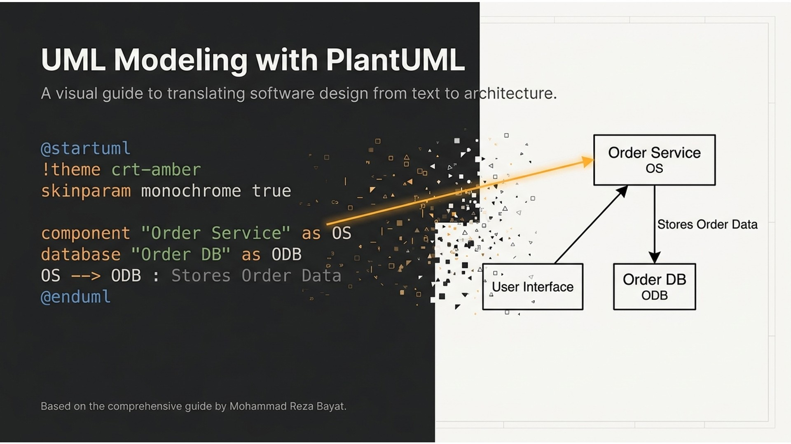
</div>

<!--
Look at this visual manifesto: 'UML Modeling with PlantUML.'

PlantUML represents a paradigm shift: treating diagrams as code!
Instead of spending hours aligning pixels, dragging connector arrows, and resizing text boxes in heavy GUI tools, you write clean, declarative syntax starting with @startuml.

The layout engine automatically handles positioning, spacing, and styling.

To summarize this slide, remember this key takeaway: PlantUML converts declarative text scripts into beautiful, publication-ready architectural diagrams.
-->

---

<!-- _class: full-image-slide -->

<div class="centered-image">
  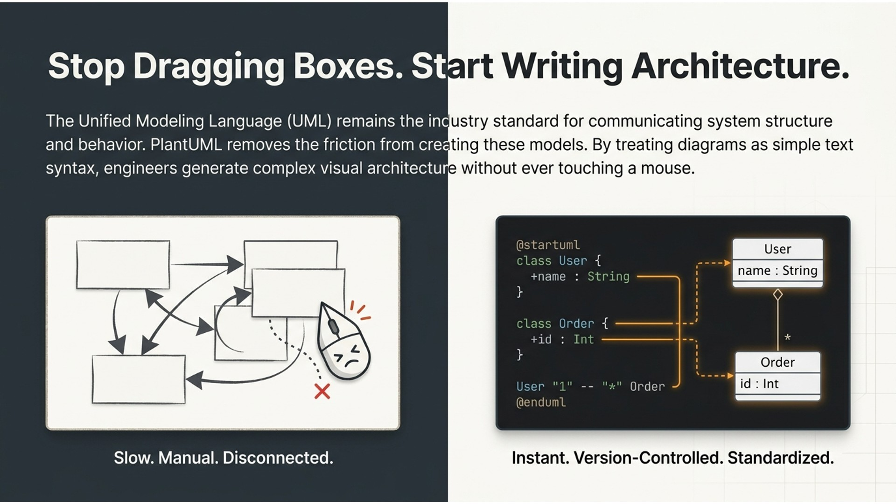
</div>

<!--
Here is the core philosophy: 'Stop Dragging Boxes. Start Writing Architecture.'

Why has Diagram-as-Code (DaC) taken over modern tech teams?
1. Version Control: Diagrams live in Git repositories alongside source code.
2. Code Review: Architecture changes are reviewed line-by-line in GitHub Pull Requests.
3. Zero Layout Fatigue: You declare relationships; the engine computes optimal routing.

To summarize this slide, remember this key takeaway: Declarative diagramming eliminates layout friction and integrates software architecture directly into Git workflows.
-->

---

<!-- _class: full-image-slide -->

<div class="centered-image">
  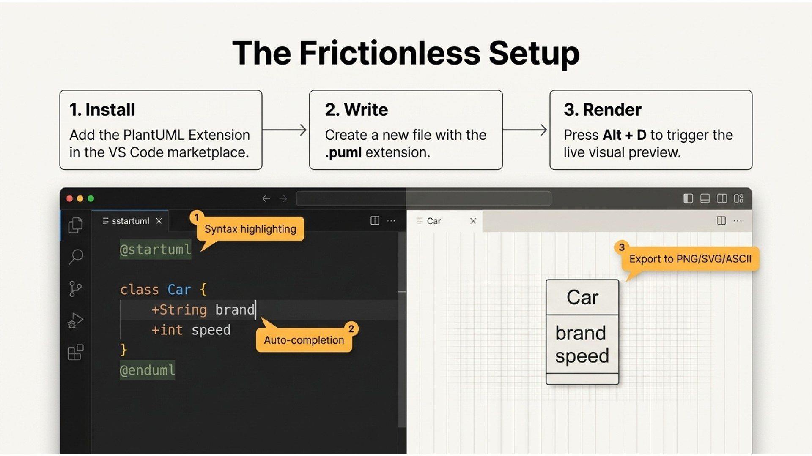
</div>

<!--
Look at 'The Frictionless Setup':

Getting started takes less than two minutes:
1. Install the PlantUML extension in Visual Studio Code.
2. Install Graphviz for structural rendering.
3. Open any .puml file and press Option+D (or Alt+D) to preview live diagram updates as you type.

You can export vector SVG, high-resolution PNG, or PDF with a single shortcut.

To summarize this slide, remember this key takeaway: PlantUML integrates seamlessly into modern IDEs with instant live preview and multi-format exports.
-->

---

<!-- _class: full-image-slide -->

<div class="centered-image">
  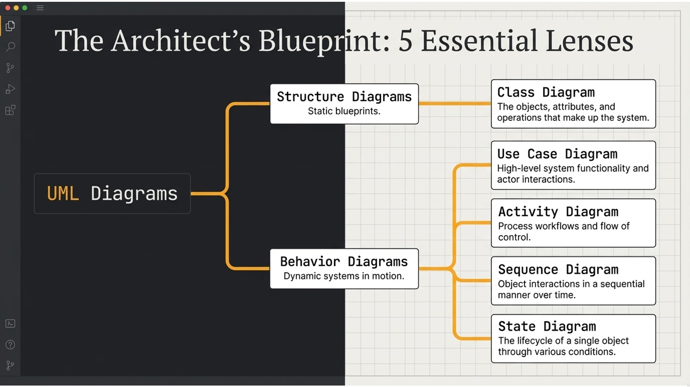
</div>

<!--
Notice 'The Architect's Blueprint: 5 Essential Lenses.'

PlantUML supports all core UML diagram types through unified, intuitive syntax:
1. Use Case Diagrams for user goals.
2. Class Diagrams for static structural types.
3. Sequence Diagrams for dynamic time-ordered interactions.
4. Activity Diagrams for procedural workflows and swimlanes.
5. State Diagrams for entity lifecycles.

To summarize this slide, remember this key takeaway: PlantUML provides a unified syntax covering structural, behavioral, and interaction modeling lenses.
-->

---

<!-- _class: full-image-slide -->

<div class="centered-image">
  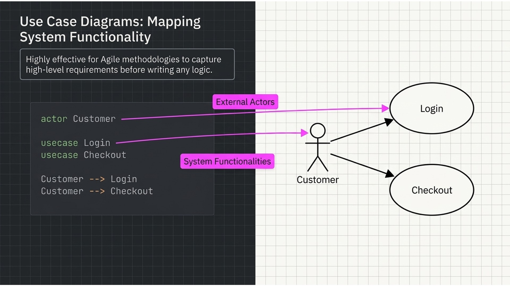
</div>

<!--
Look at how easy it is to write 'Use Case Diagrams in PlantUML':

Actors are declared with actor :Customer: or :Student:.
Use cases are declared inside parentheses: (Place Order) or (Register Course).
Relationships use simple arrows: :Customer: --> (Place Order).
Inclusions and extensions use stereotypes: (Place Order) .> (Process Payment) : <<include>>.

To summarize this slide, remember this key takeaway: PlantUML defines actors and use cases with intuitive text markers and stereotyping syntax.
-->

---

<!-- _class: full-image-slide -->

<div class="centered-image">
  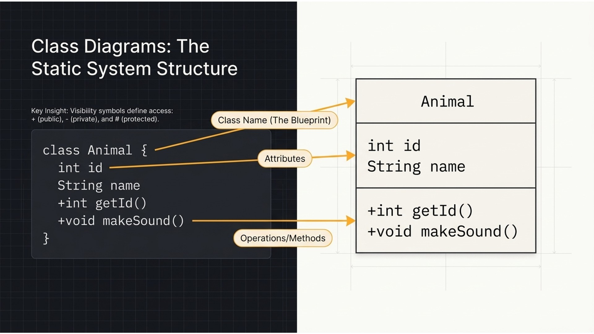
</div>

<!--
Now examine 'Class Diagrams in PlantUML':

Declaring a class mirrors standard OOP code:
class Order {
  - orderId: String
  + calculateTotal(): Double
}
Visibility markers (+ public, - private, # protected) are typed naturally with single keystrokes.

To summarize this slide, remember this key takeaway: PlantUML class declarations closely match standard object-oriented programming syntax.
-->

---

<!-- _class: full-image-slide -->

<div class="centered-image">
  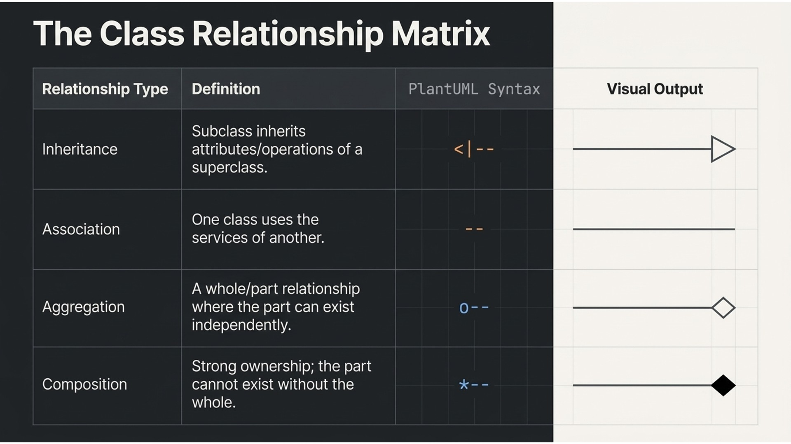
</div>

<!--
Look at 'The Class Relationship Matrix in PlantUML':

Connectors are visually mnemonic:
- Inheritance: <|-- (triangle points to superclass)
- Realization: <|.. (dashed line with hollow triangle)
- Composition: *-- (asterisk renders a filled diamond)
- Aggregation: o-- (lowercase 'o' renders an open diamond)
- Association: --> or --

To summarize this slide, remember this key takeaway: Mnemonic connector symbols (o--, *--, <|--) make modeling structural relationships fast and error-free.
-->

---

<!-- _class: full-image-slide -->

<div class="centered-image">
  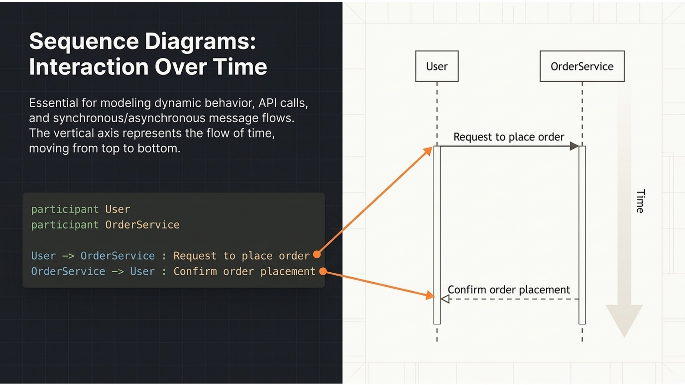
</div>

<!--
Examine 'Sequence Diagrams in PlantUML':

Sequence syntax is widely considered PlantUML's crowning glory!
Typing:
Customer -> UI : clickCheckout()
UI -> OrderController : submitOrder()
OrderController --> UI : 200 OK
instantly generates lifelines, activation bars, and time-ordered message flows!

To summarize this slide, remember this key takeaway: PlantUML sequence syntax renders complex message passing from readable conversational text statements.
-->

---

<!-- _class: full-image-slide -->

<div class="centered-image">
  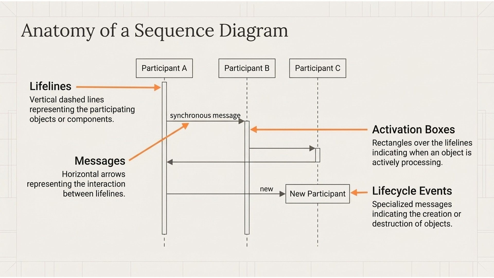
</div>

<!--
Look at 'Anatomy of Sequence Syntax':

To model activation bars, simply type activate OrderController and deactivate OrderController.
To model combined fragments, use keywords:
alt isAvailable ... else ... end
opt ... end
loop ... end

The diagram automatically formats boundary boxes and guard labels.

To summarize this slide, remember this key takeaway: Keywords like activate, alt, and loop structure complex sequence flows cleanly in text.
-->

---

<!-- _class: full-image-slide -->

<div class="centered-image">
  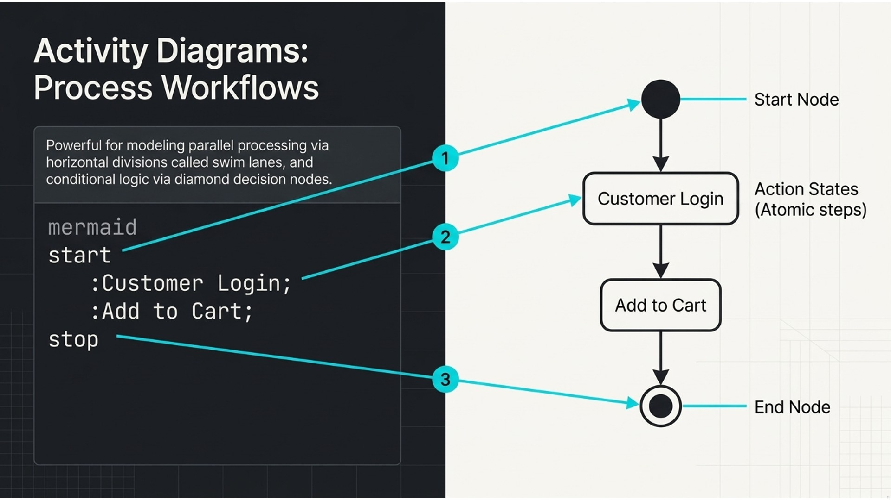
</div>

<!--
Notice 'Activity Diagrams and Swimlanes in PlantUML':

Using the modern PlantUML activity syntax:
- Start with :Action Name;
- Conditional branching: if (test?) then (yes) ... else (no) ... endif
- Parallel threads: fork ... fork again ... end fork
- Swimlanes: simply declare |Lane Name| to partition actions into columns!

To summarize this slide, remember this key takeaway: Modern PlantUML activity syntax elegantly handles branching, concurrency, and swimlane partitioning.
-->

---

<!-- _class: full-image-slide -->

<div class="centered-image">
  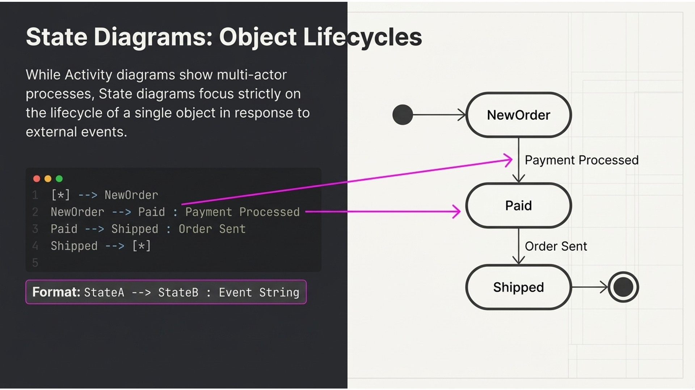
</div>

<!--
Look at 'State Diagrams in PlantUML':

Modeling finite state machines is effortless:
[*] --> Created
Created --> Paid : paymentSuccess
Paid --> InTransit : dispatch
InTransit --> Delivered : packageReceived
Delivered --> [*]

Special [*] notation denotes initial and final states.

To summarize this slide, remember this key takeaway: State diagrams map complex entity lifecycles using arrow transitions and clean state labels.
-->

---

<!-- _class: full-image-slide -->

<div class="centered-image">
  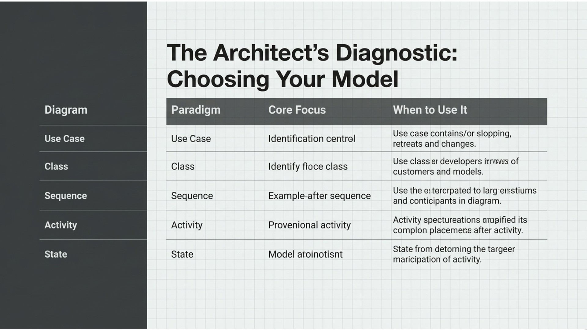
</div>

<!--
Here is your 'Cross-Diagram Syntax Quick Reference Matrix':

Compare the syntax conventions side-by-side across Use Cases, Classes, Sequences, Activities, and State Machines.
Notice the universal patterns: colons for labels, arrows for vectors, and bracketed modifiers for stereotypes and guards.

To summarize this slide, remember this key takeaway: Universal syntax patterns provide a consistent, cohesive modeling experience across all UML diagram families.
-->

---

<!-- _class: full-image-slide -->

<div class="centered-image">
  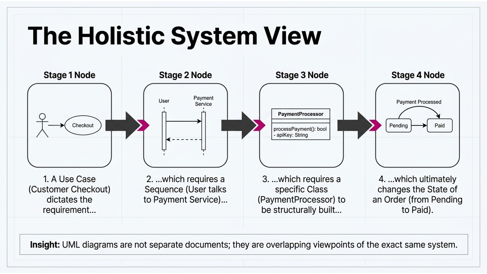
</div>

<!--
Look at 'The Holistic System View':

By keeping all diagram scripts in a single repository, software architects can cross-link models:
A use case actor references a class entity, which drives a sequence lifeline, which verifies an activity workflow!
Everything remains synchronized because code diffs show discrepancies immediately.

To summarize this slide, remember this key takeaway: Text-based modeling unifies multi-diagram architectures into an integrated, maintainable engineering asset.
-->

---

<!-- _class: full-image-slide -->

<div class="centered-image">
  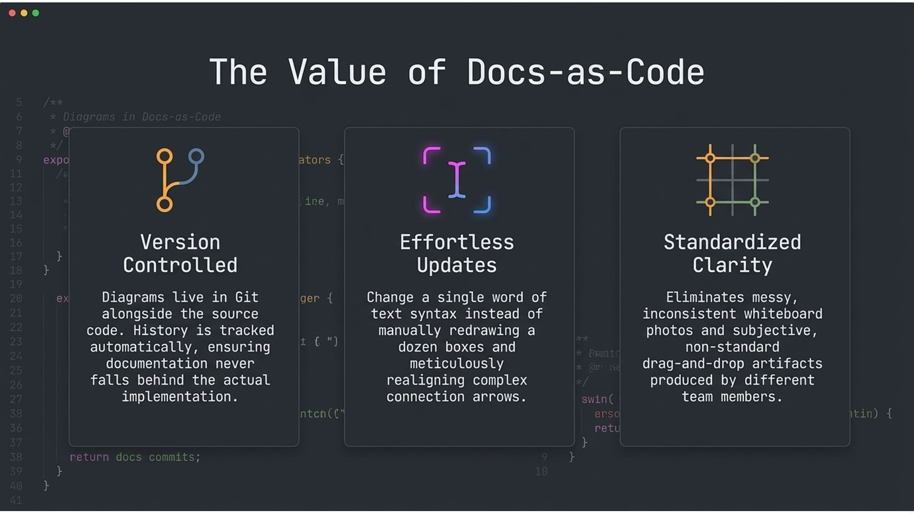
</div>

<!--
Examine the 'Practical Architecture Workflow':

Step 1: Write text markup in your favorite code editor.
Step 2: Commit to Git and open a Pull Request for architecture review.
Step 3: Continuous Integration automatically compiles SVG/PNG diagrams and embeds them into project documentation websites (like GitHub Pages or Wiki).

To summarize this slide, remember this key takeaway: Diagram-as-Code automates diagram compilation and documentation publishing within modern CI/CD pipelines.
-->

---

<!-- _class: full-image-slide -->

<div class="centered-image">
  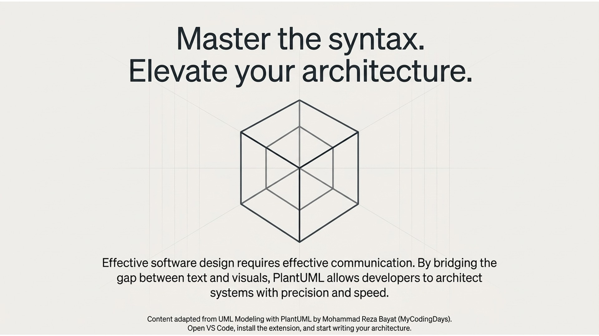
</div>

<!--
To conclude Module 4.8, remember this motto: 'Master the Syntax, Elevate Your Architecture.'

Effective software design requires effective communication. By bridging the gap between text and visuals, PlantUML empowers engineers to architect with precision, speed, and collaborative rigor.

To summarize this slide, remember this key takeaway: Text-based modeling bridges the gap between technical writing and visual architecture, empowering agile engineering teams.
-->

---

### Concept Check Question 8
<!-- id: ase-ch04-ccq8 -->
<div class="ccq-columns">
<div class="ccq-text">

What is the primary engineering advantage of using text-based diagramming tools like **PlantUML** over traditional proprietary GUI drawing software?

- **A.** PlantUML eliminates the need to understand software architecture and UML principles.
- **B.** Text markup can be version-controlled in Git, diffed in Pull Requests, and automated in CI/CD pipelines.
- **C.** PlantUML automatically generates full production databases and microservices without writing code.
- **D.** PlantUML is strictly limited to class diagrams and cannot model dynamic workflows.

</div>
<div class="ccq-logo">
    <a href="https://nlhsueh.github.io/nickedupocket/#/student/ase-ch04-ccq8" target="_blank"></a>
  </div>
</div>

<!--
Let's verify our understanding of text-based modeling with Concept Check Question 8.

Look at the options:
Option A is false—architectural understanding remains essential.
Option C confuses diagramming markup with low-code application builders.
Option D is factually incorrect—PlantUML supports all major UML diagrams.

The correct answer is Option B! The transformative power of PlantUML lies in Diagram-as-Code: storing diagrams as plain text files in Git, tracking revisions through Pull Requests, and automatically compiling documentation in CI/CD pipelines.

To summarize this slide, remember this key takeaway: PlantUML integrates architectural modeling directly into Git version control, code review, and automated documentation pipelines.
-->

---

<!-- _class: lead -->
<!-- header: '4.9 Recap & References' -->

# **4.9 Conceptual Recap & Synthesis**

> "Models are the lingua franca of software engineering."

<!--
To conclude Chapter 4, we arrive at Module 4.9: Conceptual Recap and References.

We will consolidate the foundational principles we covered today—from the history of the Three Amigos and context boundaries to use cases, BCE sequence interactions, domain classes, and state machines—through an interactive fill-in-the-blank quiz.

We will also review seminal textbooks and international modeling specifications.

To summarize this slide, remember this key takeaway: Mastering system modeling enables engineers to reason about, communicate, and verify complex software architectures.
-->

---

## Conceptual Recap: Fill-in-the-blank Quiz

Test your understanding of the core concepts in this chapter:

1. The "Three Amigos" who unified UML at Rational Software were Grady Booch, Jim Rumbaugh, and **`___`**.
2. In system modeling, the 4 foundational perspectives are External, **`___`**, Structural, and Behavioral.
3. In use case modeling, mandatory shared functionality is factored out using the **`___`** relationship.
4. The architectural pattern that separates user interfaces, business logic, and persistent domain entities is **`___`**.
5. In a UML class diagram, a filled black diamond (`◆`) represents **`___`**, where parts cannot exist without the whole.
6. In a UML class diagram, an open hollow diamond (`◇`) represents **`___`**, where parts maintain independent lifecycles.
7. A UML state machine transition label follows the formal syntax: Trigger Event [**`___`**] / Action Effect.

<!--
Let's review today's core concepts with a quick interactive quiz!

1. The Three Amigos were Grady Booch, Jim Rumbaugh, and Ivar Jacobson!
2. The four core perspectives are External, Interaction, Structural, and Behavioral!
3. Mandatory shared functionality uses the <<include>> relationship!
4. The pattern separating UI, business logic, and data entities is Boundary-Control-Entity (BCE)!
5. A filled diamond represents Composition!
6. An open diamond represents Aggregation!
7. The bracketed expression in a state transition is the Guard condition!

Outstanding job, everyone!

To summarize this slide, remember this key takeaway: These core modeling concepts provide the foundation for robust object-oriented software design.
-->

---

## References & Further Reading

- **Foundational Textbooks & Standards:**
  - Sommerville, I. (2016). *Software Engineering* (10th ed.). Chapter 5: System Modeling. Pearson.
  - Booch, G., Rumbaugh, J., & Jacobson, I. (2005). *The Unified Modeling Language User Guide* (2nd ed.). Addison-Wesley.
  - Fowler, M. (2003). *UML Distilled: A Brief Guide to the Standard Object Modeling Language* (3rd ed.). Addison-Wesley.
  - Cockburn, A. (2000). *Writing Effective Use Cases*. Addison-Wesley.
  - Object Management Group (OMG). (2017). *OMG Unified Modeling Language (OMG UML) Specification*, Version 2.5.1.
- **Modern Declarative Diagramming & AI Tooling:**
  - PlantUML Open-Source Standard: [plantuml.com](https://plantuml.com)
  - Mermaid.js JavaScript Diagramming Documentation: [mermaid.js.org](https://mermaid.js.org)

<!--
Here are the foundational textbooks, international OMG UML specifications, and modern diagramming resources for Chapter 4.

Grady Booch, Jim Rumbaugh, and Ivar Jacobson's 'The Unified Modeling Language User Guide' and Martin Fowler's 'UML Distilled' are the definitive classics. Alistair Cockburn's text remains the gold standard for writing effective use cases.

For modern text-to-diagram generation with AI, explore PlantUML and Mermaid.js.

Thank you for your active participation in Chapter 4!
-->

<script>
(function() {
  // =========================================================================
  // 1. Header Dropdown (Table of Contents / Outline)
  // =========================================================================
  function initHeaderDropdown() {
    const sections = [];
    const seenTitles = new Set();
    const slideSections = document.querySelectorAll('section[id]');
    
    // 1. Scan unique section titles and their slide IDs
    slideSections.forEach(sec => {
      const header = sec.querySelector('header');
      if (!header) return;
      
      let title = header.textContent.trim();
      title = title.replace(/^[◄◀]\s*/, '').replace(/\s*[►▶]$/, '').trim();
      if (!title || seenTitles.has(title)) return;
      
      seenTitles.add(title);
      sections.push({
        id: sec.id,
        title: title
      });
    });

    if (sections.length === 0) return;

    // Detect language: if slide titles don't have Chinese characters, use English
    const allTitles = sections.map(s => s.title).join('');
    const isEn = !/[\u4e00-\u9fa5]/.test(allTitles);
    const txtOutline = isEn ? '📑 Table of Contents' : '📑 章節目錄';
    const txtTitleTooltip = isEn ? 'Click to pin or hover to view outline' : '點擊固定或懸停查看章節目錄';
    const txtPrev = isEn ? 'Previous Section' : '上一章節';
    const txtNext = isEn ? 'Next Section' : '下一章節';

    // Helper to create the dropdown DOM
    function createDropdownWrapper(currentTitle) {
      const wrapper = document.createElement('span');
      wrapper.className = 'header-nav-wrapper';
      
      const titleSpan = document.createElement('span');
      titleSpan.className = 'header-nav-title';
      titleSpan.title = txtTitleTooltip;
      titleSpan.innerHTML = currentTitle + '<span class="nav-caret"> ▾</span>';
      
      titleSpan.addEventListener('click', function(e) {
        e.stopPropagation();
        const wasOpen = wrapper.classList.contains('is-open');
        document.querySelectorAll('.header-nav-wrapper.is-open').forEach(w => w.classList.remove('is-open'));
        if (!wasOpen) {
          wrapper.classList.add('is-open');
        }
      });
      
      const dropdown = document.createElement('div');
      dropdown.className = 'nav-dropdown';
      
      dropdown.addEventListener('click', function(e) {
        e.stopPropagation();
      });
      
      const dropHeader = document.createElement('div');
      dropHeader.className = 'nav-dropdown-header';
      dropHeader.innerHTML = '<span>' + txtOutline + '</span>';
      dropdown.appendChild(dropHeader);
      
      const grid = document.createElement('div');
      grid.className = 'nav-dropdown-grid';
      
      sections.forEach(s => {
        const item = document.createElement('a');
        const isActive = (s.title === currentTitle);
        item.className = 'nav-dropdown-item' + (isActive ? ' active' : '');
        item.href = '#' + s.id;
        item.innerHTML = '<span class="badge">#' + s.id.padStart(2, '0') + '</span><span class="item-text" title="' + s.title + '">' + s.title + '</span>';
        
        item.addEventListener('click', function(e) {
          e.preventDefault();
          wrapper.classList.remove('is-open');
          dropdown.style.display = 'none';
          const targetHash = '#' + s.id;
          if (window.location.hash === targetHash) {
            window.dispatchEvent(new HashChangeEvent('hashchange'));
          } else {
            window.location.hash = targetHash;
          }
          setTimeout(() => { dropdown.style.display = ''; }, 350);
        });
        
        grid.appendChild(item);
      });
      
      dropdown.appendChild(grid);
      wrapper.appendChild(titleSpan);
      wrapper.appendChild(dropdown);
      return wrapper;
    }

    // Close any pinned dropdown when clicking anywhere outside
    document.addEventListener('click', function(e) {
      if (!e.target.closest('.header-nav-wrapper')) {
        document.querySelectorAll('.header-nav-wrapper.is-open').forEach(w => w.classList.remove('is-open'));
      }
    });

    // 2. Enhance each header element across all slides
    slideSections.forEach(sec => {
      const header = sec.querySelector('header');
      if (!header || header.dataset.navEnhanced) return;
      header.dataset.navEnhanced = 'true';
      
      const links = header.querySelectorAll('a');
      let prevLink = null;
      let nextLink = null;
      
      links.forEach(a => {
        const txt = a.textContent.trim();
        if (txt === '◄' || txt === '◀') prevLink = a;
        if (txt === '►' || txt === '▶') nextLink = a;
      });
      
      let title = header.textContent.trim();
      title = title.replace(/^[◄◀]\s*/, '').replace(/\s*[►▶]$/, '').trim();
      if (!title) return;
      
      header.innerHTML = '';
      if (prevLink) {
        prevLink.className = 'header-nav-arrow';
        prevLink.title = txtPrev;
        header.appendChild(prevLink);
        header.appendChild(document.createTextNode(' '));
      }
      
      const wrapper = createDropdownWrapper(title);
      header.appendChild(wrapper);
      
      if (nextLink) {
        header.appendChild(document.createTextNode(' '));
        nextLink.className = 'header-nav-arrow';
        nextLink.title = txtNext;
        header.appendChild(nextLink);
      }
    });
  }

  // =========================================================================
  // 2. Number Quick Jump (<kbd>Num</kbd> + <kbd>Enter</kbd>)
  // =========================================================================
  function initNumberQuickJump() {
    let inputBuffer = '';
    let timer = null;
    let hud = null;

    // Detect language: check titles or body text
    const slideSections = document.querySelectorAll('section[id]');
    let hasZh = false;
    slideSections.forEach(s => {
      if (/[\u4e00-\u9fa5]/.test(s.textContent || '')) hasZh = true;
    });
    const isEn = !hasZh;

    function getOrCreateHud() {
      if (!hud) {
        hud = document.createElement('div');
        hud.id = 'slide-quick-jump-hud';
        hud.style.cssText = [
          'position: fixed',
          'bottom: 36px',
          'left: 50%',
          'transform: translateX(-50%)',
          'background: rgba(15, 23, 42, 0.94)',
          'color: #ffffff',
          'padding: 8px 18px',
          'border-radius: 28px',
          'font-family: -apple-system, BlinkMacSystemFont, "Segoe UI", Roboto, system-ui, sans-serif',
          'font-size: 14px',
          'font-weight: 500',
          'box-shadow: 0 16px 36px rgba(0, 0, 0, 0.35), 0 0 0 1px rgba(255, 255, 255, 0.15)',
          'backdrop-filter: blur(16px)',
          '-webkit-backdrop-filter: blur(16px)',
          'z-index: 999999',
          'display: none',
          'align-items: center',
          'gap: 8px',
          'pointer-events: none',
          'opacity: 0',
          'transition: opacity 0.15s ease, transform 0.15s ease'
        ].join(';');
        const targetParent = document.fullscreenElement || document.body;
        targetParent.appendChild(hud);
      }
      const parent = document.fullscreenElement || document.body;
      if (hud.parentElement !== parent) {
        parent.appendChild(hud);
      }
      return hud;
    }

    function getTotalSlides() {
      const secs = document.querySelectorAll('section[id]');
      return secs.length || 1;
    }

    function showHud() {
      const el = getOrCreateHud();
      const total = getTotalSlides();
      const label = isEn ? 'Go to slide:' : '跳至頁碼:';
      const enterHint = isEn ? 'Enter ↵' : 'Enter 確認 ↵';
      el.innerHTML = '<span>🧭 ' + label + '</span> ' +
        '<strong style="color: #38bdf8; font-size: 20px; font-weight: 700; font-family: ui-monospace, SFMono-Regular, Menlo, monospace; letter-spacing: 1px;">' + inputBuffer + '</strong> ' +
        '<span style="opacity: 0.6; font-size: 13px;">/ ' + total + '</span> ' +
        '<span style="background: rgba(255,255,255,0.18); padding: 2px 7px; border-radius: 6px; font-size: 11px; margin-left: 2px; font-weight: 600;">' + enterHint + '</span>';
      el.style.display = 'flex';
      el.style.opacity = '1';

      if (timer) clearTimeout(timer);
      timer = setTimeout(clearInput, 2800);
    }

    function clearInput() {
      inputBuffer = '';
      if (timer) {
        clearTimeout(timer);
        timer = null;
      }
      if (hud) {
        hud.style.opacity = '0';
        setTimeout(() => {
          if (inputBuffer === '' && hud) hud.style.display = 'none';
        }, 150);
      }
    }

    function jumpToSlide(num) {
      const total = getTotalSlides();
      const target = Math.max(1, Math.min(num, total));
      const targetHash = '#' + target;
      
      // Visual flash confirmation
      const el = getOrCreateHud();
      const confirmedMsg = isEn ? ('✓ Slide ' + target) : ('✓ 第 ' + target + ' 頁');
      el.innerHTML = '<span style="color: #34d399; font-weight: 700; font-size: 15px;">' + confirmedMsg + '</span>';
      el.style.display = 'flex';
      el.style.opacity = '1';
      setTimeout(clearInput, 500);

      if (window.location.hash === targetHash) {
        window.dispatchEvent(new HashChangeEvent('hashchange'));
      } else {
        window.location.hash = targetHash;
      }
    }

    window.addEventListener('keydown', function(e) {
      // Don't intercept when focusing editable form elements
      const active = document.activeElement;
      if (active && (active.tagName === 'INPUT' || active.tagName === 'TEXTAREA' || active.tagName === 'SELECT' || active.isContentEditable)) {
        return;
      }

      // Ignore if modifier keys are pressed
      if (e.ctrlKey || e.altKey || e.metaKey) {
        return;
      }

      // Resolve digit from key or code (supports '2', 'Digit2', 'Numpad2')
      let digit = null;
      if (e.key >= '0' && e.key <= '9') {
        digit = e.key;
      } else if (/^(?:Digit|Numpad)([0-9])$/.test(e.key)) {
        digit = e.key.replace(/^(?:Digit|Numpad)/, '');
      } else if (/^(?:Digit|Numpad)([0-9])$/.test(e.code || '')) {
        digit = (e.code || '').replace(/^(?:Digit|Numpad)/, '');
      }

      if (digit !== null) {
        inputBuffer += digit;
        if (inputBuffer.length > 4) inputBuffer = inputBuffer.slice(-4);
        showHud();
        return;
      }

      // Backspace
      if ((e.key === 'Backspace' || e.code === 'Backspace') && inputBuffer.length > 0) {
        e.preventDefault();
        e.stopPropagation();
        inputBuffer = inputBuffer.slice(0, -1);
        if (inputBuffer.length === 0) {
          clearInput();
        } else {
          showHud();
        }
        return;
      }

      // Escape
      if ((e.key === 'Escape' || e.code === 'Escape') && inputBuffer.length > 0) {
        e.preventDefault();
        e.stopPropagation();
        clearInput();
        return;
      }

      // Enter key confirms numeric jump
      if ((e.key === 'Enter' || e.code === 'Enter' || e.code === 'NumpadEnter') && inputBuffer.length > 0) {
        e.preventDefault();
        e.stopPropagation();
        const targetPage = parseInt(inputBuffer, 10);
        if (!isNaN(targetPage)) {
          jumpToSlide(targetPage);
        } else {
          clearInput();
        }
      }
    }, true);
  }

  // Initialize both features
  function init() {
    initHeaderDropdown();
    initNumberQuickJump();
  }

  if (document.readyState === 'loading') {
    document.addEventListener('DOMContentLoaded', init);
  } else {
    init();
  }
  setTimeout(init, 400);
})();

</script>
