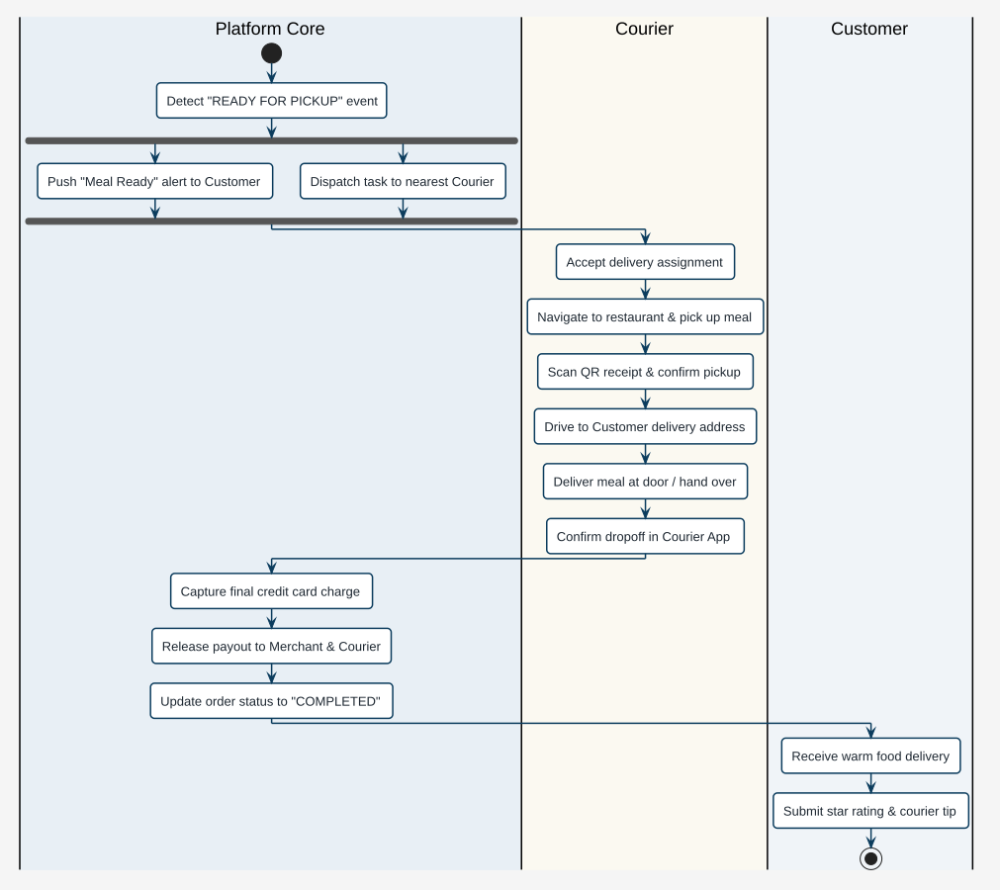
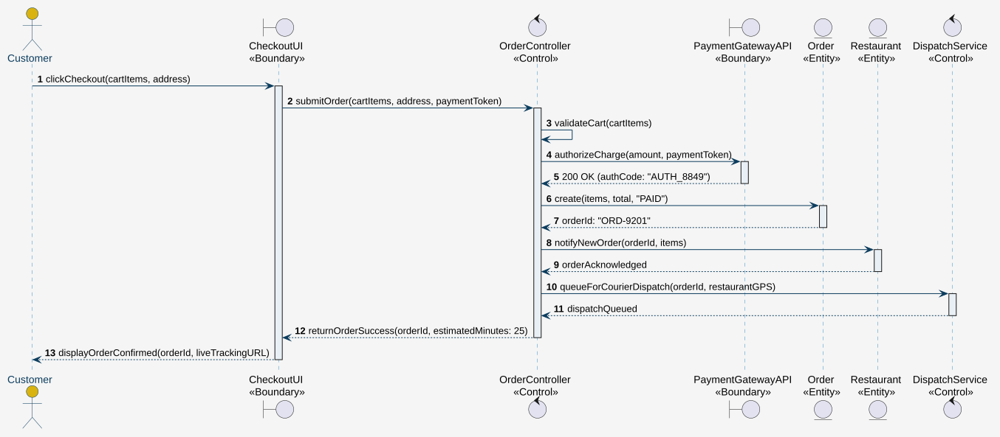
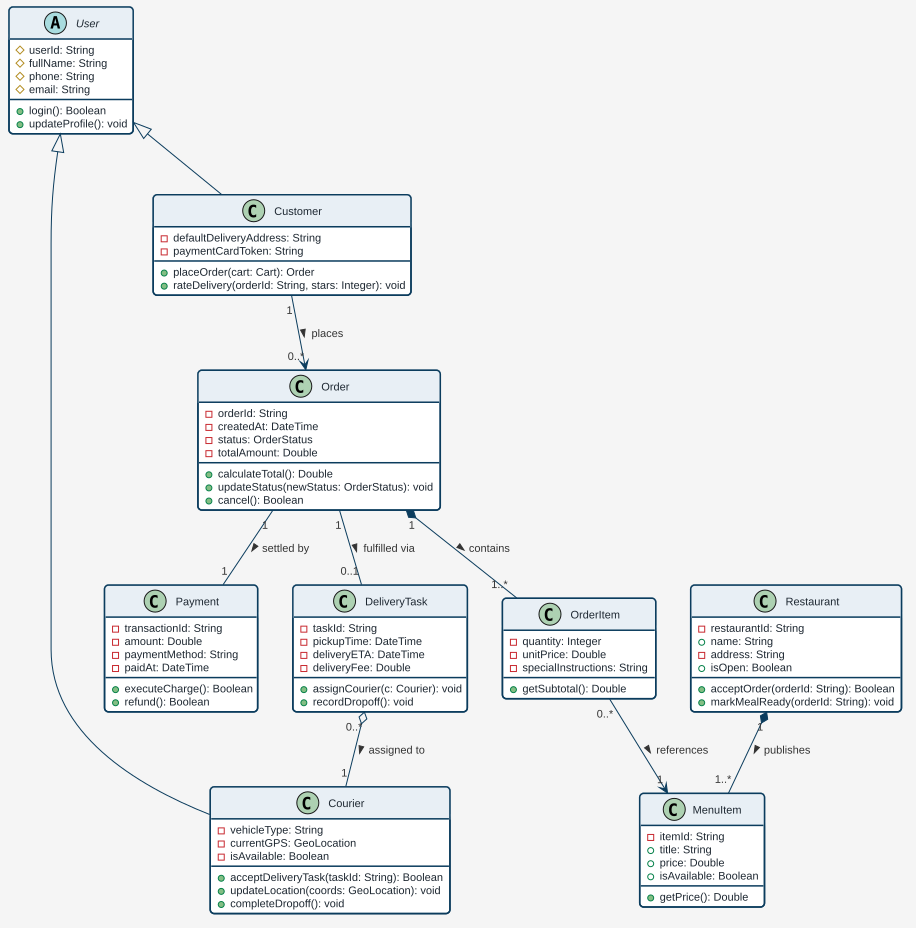
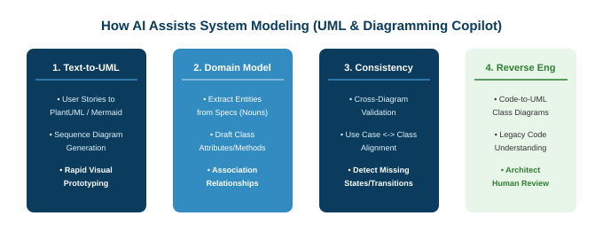

<!-- _class: lead -->
<!-- header: '' -->

# **Software Engineering**

### Chapter 4: System Modeling & Unified Architecture

**Prof. Nien-Lin Hsueh**
Department of Information Engineering and Computer Science
Feng Chia University

<!--
Welcome to Chapter 4: System Modeling and Unified Architecture.

In Chapter 3, we studied how to discover, analyze, and specify software requirements in natural language and user stories. But natural language is notoriously ambiguous, incomplete, and difficult to translate directly into robust code.

Today, we take the crucial leap from abstract requirements to formal software models. We will explore what system modeling is, understand its core perspectives, study the history and creators of the Unified Modeling Language, and examine each fundamental UML diagram in depth.

To summarize this slide, remember this key takeaway: System modeling creates the formal conceptual bridge between human requirements and executable software code.
-->
---
<!-- _class: outline-slide -->

## Chapter 4: Roadmap & Core Curriculum

  

    <h3>Part 1: Foundations & Functional Models</h3>
    <ul>
      <li><b>4.1 Foundations of Modeling & UML:</b> What is modeling, 4 perspectives, 5 essential diagrams, method wars, and Three Amigos name cards.</li>
      <li><b>4.2 Context & Process Models:</b> System boundaries, external partners, and activity workflows.</li>
      <li><b>4.3 Functional & Use Case Models:</b> Jacobson's legacy, include vs. extend, structured specifications.</li>
    </ul>
  

  

    <h3>Part 2: Structural, Dynamic & AI Modeling</h3>
    <ul>
      <li><b>4.4 Sequence Diagrams & BCE:</b> Message passing, lifelines, activation, Boundary-Control-Entity pattern.</li>
      <li><b>4.5 Structural & Class Models:</b> Domain classes, visibility, multiplicity, composition vs. aggregation.</li>
      <li><b>4.6 Behavioral & State Machines:</b> Order lifecycle FSM, event triggers, guards, actions.</li>
      <li><b>4.7 AI-Assisted Modeling:</b> Text-to-UML copilot, human-in-the-loop validation, conceptual recap.</li>
    </ul>
  

<!--
Here is our roadmap for Chapter 4.

On the left, in Part 1, we begin with the fundamental foundations of system modeling, explore its core perspectives and diagrams, trace the history of UML, and study system boundaries and functional workflows.

On the right, in Part 2, we dive deep into dynamic sequence interactions, domain class architectures, reactive state machines, and modern AI text-to-diagram workflows.

To summarize this slide, remember this key takeaway: This chapter provides a rigorous, end-to-end journey through structural, behavioral, and AI-assisted system modeling.
-->
---
<!-- _class: lead -->
<!-- header: '4.1 Foundations of Modeling & UML' -->

# **4.1 Foundations of System Modeling & UML**

> "A language that doesn't affect the way you think about programming is not worth knowing."
> — *Alan Perlis*

<!--
We begin with Module 4.1: Foundations of System Modeling and the Unified Modeling Language.

Before exploring diagrams and notation, we must first understand: What is a model? Why do engineers build models before writing code? And how did the software industry unite around a single standardized visual grammar?

To summarize this slide, remember this key takeaway: System modeling provides purposeful abstractions that allow engineers to master software complexity.
-->
---
## What is System Modeling?

> "System modeling is the process of developing abstract models of a system, with each model presenting a different view or perspective of that system."
> — *Ian Sommerville, Software Engineering (10th ed.)*

* **Essential Principles of Modeling:**
  - **Abstraction:** Hides non-essential implementation details to highlight critical architectural structures, data flows, and dependencies.
  - **Multiple Perspectives:** No single diagram can explain a complex software system. Different stakeholders require different views.
  - **Communication & Verification:** Serves as a universal visual grammar between product managers, system architects, software developers, and QA engineers.
  - **Blueprint for Implementation:** Provides the formal structural and behavioral specification from which executable code and database schemas are developed.

<!--
Let's establish what system modeling actually is.

Ian Sommerville defines it as developing abstract models, with each model presenting a different perspective of the system.

Notice the word 'abstraction.' If a blueprint of a house showed every single molecule in the concrete, you couldn't build the house! You need an electrical blueprint, a plumbing blueprint, and a structural blueprint.

Similarly, in software engineering, no single diagram can represent an entire system. We need multiple complementary perspectives to manage complexity.

To summarize this slide, remember this key takeaway: System modeling creates purposeful abstractions across multiple complementary perspectives to master software complexity.
-->
---
## 4 Core System Modeling Perspectives

* **1. External Perspective:**
  - Models the environment, external partners, and operational context of the system.
  - Defines the strict system perimeter: what is built internally vs. what is delegated to third parties.
* **2. Interaction Perspective:**
  - Models dynamic communications between external actors and the system, or message exchanges between internal collaborating objects.
* **3. Structural Perspective:**
  - Models the static architecture of system data, object classes, attributes, methods, and relationships independent of runtime execution order.
* **4. Behavioral Perspective:**
  - Models the dynamic execution behavior, sequential business workflows, and reactive discrete state transitions in response to external events.

<!--
The software engineering standard organizes system models into four core perspectives:

First, the External Perspective: Where does the system begin and end? What external cloud services and human users touch it?
Second, the Interaction Perspective: How do actors and software objects communicate across time?
Third, the Structural Perspective: What are the static data schemas, classes, attributes, and associations?
Fourth, the Behavioral Perspective: How does the system respond dynamically to inputs, workflows, and reactive events?

Every software engineer must know which perspective to invoke depending on the engineering problem at hand.

To summarize this slide, remember this key takeaway: The four modeling perspectives are External, Interaction, Structural, and Behavioral.
-->
---
## 5 Essential UML Diagram Types in Modern Practice

| Diagram Type | Perspective | Dynamic / Static | Primary Engineering Role |
| :--- | :--- | :--- | :--- |
| **1. Context Diagram** | External | Static Boundary | Defines system boundaries and external partner systems |
| **2. Activity Diagram** | Behavioral | Dynamic Flow | Visualizes sequential business workflows and concurrent logic |
| **3. Use Case Diagram** | Interaction | Static Contract | Specifies actor goals and functional scope boundaries |
| **4. Sequence Diagram** | Interaction | Dynamic Time | Traces chronological message passing across runtime lifelines |
| **5. Class Diagram** | Structural | Static Backbone | Specifies domain entities, relationships, attributes, and methods |
| *(Bonus) State Diagram* | Behavioral | Dynamic Reactive | Models discrete states and event-driven reactive lifecycles |

<!--
Out of the 14 diagrams defined in UML 2.5, these five represent the core 80/20 toolkit used daily by professional software engineers:

Context Diagrams define the system perimeter.
Activity Diagrams model business processes and workflows.
Use Case Diagrams define functional scope and user goals.
Sequence Diagrams trace runtime message exchanges over time.
Class Diagrams serve as the static architectural backbone for object-oriented code.
And State Machine Diagrams model reactive, event-driven behavior.

To summarize this slide, remember this key takeaway: Mastering these core UML diagrams equips engineers to communicate any software architecture clearly and unambiguously.
-->
---
## The Need for Standardization: The 1990s "Method Wars"

* **The Rise of Object-Oriented Programming (Late 1980s – Early 1990s):**
  - The software industry transitioned from procedural code (C, Pascal) to object-oriented paradigms (C++, Smalltalk).
  - Software engineers urgently needed visual notations to represent classes, objects, and relationships.
* **The "Method Wars" Era:**
  - Over **50 competing OO modeling notations** flooded the commercial market.
  - Engineers argued fiercely over whether classes should be clouds, rectangles, or ovals; whether inheritance should be an open triangle, filled arrow, or dashed line.
  - **Severe Industry Fragmentation:** Companies could not exchange models, CASE tools were incompatible, and developers had to relearn notation whenever they switched jobs.

<!--
Now, if modeling is so essential, how did the software industry agree on a single language?

In the late 1980s and early 1990s, object-oriented programming was exploding into the mainstream with C++ and Smalltalk. But a massive crisis emerged: the so-called 'Method Wars.'

Over 50 different experts invented their own modeling notations! Grady Booch used clouds for classes; James Rumbaugh used structured rectangles; Ivar Jacobson introduced use cases; Peter Coad and Edward Yourdon had yet another notation.

It was an architectural Tower of Babel. If you worked at IBM, you drew clouds; if you worked at GE, you drew boxes. CASE tools couldn't interoperate, and software designs were trapped in proprietary silos.

To summarize this slide, remember this key takeaway: The 1990s Method Wars fragmented the software industry with over 50 incompatible modeling notations.
-->
---
## Unification & Standardization: From Rational to OMG

* **1994 – Unification Begins at Rational Software:**
  - Jim Rumbaugh joined Grady Booch at Rational to merge the Booch Method and OMT into the "Unified Method" (v0.8).
* **1995 – The Three Amigos Assemble:**
  - Ivar Jacobson joined Rational, bringing his revolutionary **Use Case** methodology (OOSE).
* **1997 – OMG International Standardization:**
  - Submitted to the **Object Management Group (OMG)**; unanimously adopted as **UML 1.1** in November 1997.
* **2005 – UML 2.0 Major Architecture Overhaul:**
  - Expanded from 9 to 13 (and later 14) diagram types with formal execution metamodels.

  
  

    Unified Modeling Language
    <a href="https://www.omg.org/uml/" target="_blank">Object Management Group (OMG)</a>
  

<!--
How was this crisis resolved? Through an unprecedented merger of minds at Rational Software.

In 1994, Jim Rumbaugh left General Electric to join Grady Booch at Rational. They combined Booch's design strengths with Rumbaugh's analysis rigor. A year later, Ivar Jacobson joined them, contributing his use cases and architectural components.

Together, they were affectionately dubbed 'The Three Amigos.'

Instead of keeping their language proprietary, Rational submitted UML to the Object Management Group, an open international standards consortium. In November 1997, UML 1.1 became the official world standard for software modeling.

To summarize this slide, remember this key takeaway: Rational Software unified the Three Amigos, leading to OMG's adoption of UML as the definitive global standard.
-->
---
## Pioneers of UML: Grady Booch

* **Role & Distinctions:**
  - Chief Scientist, Rational Software; IBM Fellow; ACM Fellow.
* **Pioneered Methodology:**
  - **The Booch Method** and seminal text: *Object-Oriented Analysis and Design with Applications*.
* **Core Contribution to UML:**
  - Focused heavily on **concrete software design**, module decomposition, class abstractions, and architectural patterns.
  - Championed visual expressiveness for implementation-level object structures and code mapping.
* **Famous Architectural Maxim:**
  > *"Clean code always looks like it was written by someone who cares."*

  
  

    Grady Booch
    <a href="https://en.wikipedia.org/wiki/Grady_Booch" target="_blank">Rational Software / IBM Fellow</a>
  

<!--
Meet the first of the Three Amigos: Grady Booch.

Grady Booch is an IBM Fellow and was Chief Scientist at Rational Software. He authored the seminal textbook 'Object-Oriented Analysis and Design with Applications.'

Booch's unique strength was in concrete software design—how classes, inheritance, polymorphism, and modules map directly into executable code architecture. His visual notations were famous for their cloud-shaped class boundaries, which later evolved into UML's structured class boxes.

To summarize this slide, remember this key takeaway: Grady Booch championed object-oriented design abstractions and concrete code architecture.
-->
---
## Pioneers of UML: James Rumbaugh

* **Role & Distinctions:**
  - Lead Researcher, General Electric (GE) Global R&D; Rational Software; IBM.
* **Pioneered Methodology:**
  - **Object Modeling Technique (OMT)** and book: *Object-Oriented Modeling and Design*.
* **Core Contribution to UML:**
  - Emphasized rigorous **domain analysis**, semantic data modeling, and entity-relationship mapping.
  - Pioneered the synthesis of object structure with David Harel's **Statecharts** to model dynamic reactive systems.
* **Famous Architectural Maxim:**
  > *"You cannot build great software without understanding domain truth."*

  
  

    James Rumbaugh
    <a href="https://en.wikipedia.org/wiki/James_Rumbaugh" target="_blank">GE Research / Rational Software</a>
  

<!--
Meet the second Amigo: Dr. James Rumbaugh.

Jim Rumbaugh led software technology research at General Electric Corporate R&D before joining Rational Software in 1994. His Object Modeling Technique, or OMT, was widely regarded as the most mathematically sound analysis methodology in the industry.

Rumbaugh's genius was in domain analysis—mapping real-world entities, database schemas, associations, and state machines. When Rumbaugh and Booch united, they bridged the gap between analytical problem modeling and concrete software design.

To summarize this slide, remember this key takeaway: James Rumbaugh established rigorous domain analysis, data relationships, and statechart modeling in UML.
-->
---
## Pioneers of UML: Ivar Jacobson

* **Role & Distinctions:**
  - Lead Architect, Ericsson; Founder, Objectory AB; Rational Software; SEMAT Pioneer.
* **Pioneered Methodology:**
  - **Object-Oriented Software Engineering (OOSE)**.
* **Core Contribution to UML:**
  - **Inventor of Use Cases (1986):** Revolutionized requirements by anchoring system architecture to measurable user goals.
  - Introduced the **Boundary–Control–Entity (BCE)** robustness analysis pattern and component-based architecture.
* **Famous Architectural Maxim:**
  > *"A system that has no users has no reason to exist. Model user goals first."*

  
  

    Ivar Jacobson
    <a href="https://en.wikipedia.org/wiki/Ivar_Jacobson" target="_blank">Ericsson / Objectory / Rational</a>
  

<!--
Meet the third Amigo: Dr. Ivar Jacobson.

Working at Ericsson on massive telephone switching systems and later founding Objectory AB, Jacobson invented the concept of 'Use Cases' in 1986.

Before Jacobson, software requirements were dry, ambiguous specifications of functional statements. Jacobson flipped the perspective entirely onto the human user: who is using the system, and what business goal are they trying to accomplish? He also introduced the Boundary-Control-Entity pattern that still anchors modern software architecture.

To summarize this slide, remember this key takeaway: Ivar Jacobson invented Use Cases and the BCE pattern, centering software architecture around user goals.
-->
---
## The Three Amigos: The Trinity of Software Modeling

  

    <h3>Ivar Jacobson</h3>
    <h4>The "Why" (Goal / User)</h4>
    <ul>
      <li><b>Use Case Driven:</b> What goals do external actors achieve?</li>
      <li><b>BCE Robustness:</b> Separating UI boundaries from data entities.</li>
      <li><b>Component Contracts:</b> Reusable subsystem architectures.</li>
    </ul>
  

  

    <h3>James Rumbaugh</h3>
    <h4>The "What" (Domain Data)</h4>
    <ul>
      <li><b>Domain Analysis:</b> What real-world concepts exist?</li>
      <li><b>Class & Data Schemas:</b> Structural entity relationships.</li>
      <li><b>State Machines:</b> Reactive event-driven lifecycles.</li>
    </ul>
  

  

    <h3>Grady Booch</h3>
    <h4>The "How" (Design & Code)</h4>
    <ul>
      <li><b>Object-Oriented Design:</b> How do classes collaborate?</li>
      <li><b>Macro Architecture:</b> Layered module decomposition.</li>
      <li><b>Implementation Map:</b> Direct code translation into OOP.</li>
    </ul>
  

> 📌 **Architectural Synthesis:** Jacobson captures **Why** the system exists; Rumbaugh models **What** domain concepts exist; Booch designs **How** components execute in code.

<!--
Notice how the Three Amigos complemented each other with flawless harmony:

Ivar Jacobson answered WHY the system exists from the user's perspective through Use Cases.
James Rumbaugh mapped WHAT data entities and states exist in the problem domain.
Grady Booch designed HOW those entities collaborate in executable software code.

This synthesis formed the bedrock not only of UML, but also of modern software engineering methodologies like the Rational Unified Process (RUP).

To summarize this slide, remember this key takeaway: UML harmonizes the user goals (Jacobson), domain data (Rumbaugh), and code architecture (Booch).
-->
---
### Concept Check Question 1

  

Which of the "Three Amigos" was specifically renowned for inventing **Use Cases (1986)** to anchor software architecture to tangible user goals?

- **A.** Grady Booch
- **B.** James Rumbaugh
- **C.** Ivar Jacobson
- **D.** Martin Fowler

  

  

    
  

<!--
Let's check our understanding of UML history with Concept Check Question 1.

Look at the options:
Grady Booch developed the Booch Method focusing on object-oriented design and abstractions.
James Rumbaugh developed OMT focusing on domain analysis and object modeling.
Martin Fowler is a renowned author who wrote 'UML Distilled' and refactoring guides, but was not one of the Three Amigos.

The correct answer is Option C, Ivar Jacobson! Jacobson introduced Use Cases at Ericsson in 1986 to ensure software architectures directly fulfill user-driven goals.

To summarize this slide, remember this key takeaway: Ivar Jacobson invented Use Cases, shifting requirements modeling toward user-centric goals.
-->
---
<!-- _class: lead -->
<!-- header: '4.2 Context & Process Models' -->

# **4.2 Context & Process Models**

> "Architecture is the decisions that you wish you could get right early in a project."
> — *Ralph Johnson*

<!--
We now transition to Module 4.2: Context and Process Models.

We will begin by defining architectural perimeters using a Context Model, and then trace end-to-end multi-party workflows using UML Activity Diagrams.

To summarize this slide, remember this key takeaway: Context models define system perimeters, while activity diagrams capture multi-stakeholder business processes.
-->
---
<!-- _class: title-image-slide -->

## Food Delivery Platform: System Context Model

  

<!--
Look at this System Context Diagram for a food delivery platform.

Notice the large boundary rectangle labeled 'Food Delivery Platform Boundary.' Everything inside this box represents software that our engineering team designs, deploys, and maintains.

Notice the stick figures and external components surrounding the perimeter:
On the left are human user roles: Customers browsing meals, Restaurant Partners updating prep status, and Delivery Couriers fulfilling orders.
On the right are external enterprise clouds: Payment Gateways like Apple Pay and Stripe, Navigation APIs like Google Maps, and Cloud Push Notification services like Firebase.

To summarize this slide, remember this key takeaway: The context diagram establishes the strict perimeter dividing internal software components from external actors and cloud services.
-->
---
## Explaining the Context Model & Architectural Boundaries

* **The Primary Operational Boundary:**
  - Clearly demarcates what is **internal** (our software platform: Order Engine, Catalog, Tracking) versus what is **external** (third-party systems and human actors).
  - Eliminates "scope creep" by defining external dependencies early in the architectural lifecycle.
* **Human Stakeholder Interfaces:**
  - **Customer:** Interacts via native iOS/Android mobile apps to query menus and submit orders.
  - **Restaurant Partner:** Interacts via merchant web/tablet portals to accept orders and manage food availability.
  - **Delivery Courier:** Interacts via courier mobile apps to receive dispatch missions and stream GPS coordinates.
* **External Third-Party Service Dependencies:**
  - **Payment Gateway (Stripe/ApplePay):** Handles PCI-compliant financial transactions without storing raw card data internally.
  - **Navigation Service (Google Maps API):** Computes live routing distances, courier ETAs, and road geometry.
  - **Notification Cloud (Firebase / Twilio):** Dispatches asynchronous push alerts and SMS verification tokens.

<!--
Let's analyze why this context diagram is vital for software architects.

First, it establishes what our engineering team is actually responsible for building. We do NOT build our own payment processing bank or global map satellites! We delegate those responsibilities across clear network contracts to Stripe and Google Maps.

Second, it reveals the security perimeter: sensitive financial transactions must flow through external payment gateways, ensuring our internal databases stay outside burdensome PCI-DSS audit scopes.

To summarize this slide, remember this key takeaway: Context diagrams eliminate architectural ambiguity by defining external APIs, actor roles, and security boundaries.
-->
---
<!-- _class: title-image-slide -->

## Food Delivery Fulfillment: Order Placement & Kitchen Prep

  

<!--
Now examine Stage 1 of the operational workflow: Order Placement and Kitchen Preparation.

Notice the three vertical swimlanes: Customer on the left, Platform Core in the center, and Restaurant Partner on the right.
Swimlanes show organizational responsibility: who performs each action!

Trace the flow from the start node:
1. The customer selects dishes and submits the order.
2. The platform validates cart rules and authorizes payment via the external gateway.
3. Notice the decision diamond: if payment succeeds, the order is placed; otherwise, the flow detaches with an error.
4. The merchant receives the ticket: if accepted, the kitchen cooks; otherwise, the customer is refunded.

To summarize this slide, remember this key takeaway: Activity swimlanes divide operational steps across Customer, Platform, and Restaurant roles during order submission.
-->
---
## Explaining Stage 1 Activity Flow & Notations

* **Core Notation Elements in Activity Modeling:**
  - **Rounded Rectangles:** Operational action states (e.g., `Browse menu & select dishes`, `Kitchen starts cooking meal`).
  - **Swimlanes (Partitions):** Assign direct organizational ownership to Customer, Platform Core, and Restaurant Partner.
  - **Decision Diamonds:** Branching logic based on boolean guard conditions (`[Payment Authorized?]`, `[Accept Order?]`).
  - **Detach Node / Terminal Exit:** Represents an abnormal branch termination (e.g., payment decline or restaurant rejection).
* **Engineering Rationale for Decoupling:**
  - Notice that Customer interaction ends at order submission; subsequent steps are managed asynchronously by the Platform and Merchant.
  - If a restaurant rejects an order, the Platform Core autonomously triggers an instant automated refund.

<!--
Let's review the visual grammar of this first activity stage.

The rounded rectangles represent discrete action states.
The swimlanes partition the actions by organizational role, showing who does what.
The diamonds represent decision points where control branches based on boolean outcomes.

Notice the detach nodes: if the payment is declined or the restaurant is out of ingredients, the flow detaches cleanly after executing compensation logic like issuing an instant refund.

To summarize this slide, remember this key takeaway: Activity diagrams capture sequential and branching logic with clear role partitioning and error termination nodes.
-->
---
<!-- _class: title-image-slide -->

## Food Delivery Fulfillment: Courier Dispatch & Delivery Handover

  

<!--
Now examine Stage 2 of the workflow: Courier Dispatch and Delivery Handover.

Notice the swimlanes here: Platform Core on the left, Courier in the center, and Customer on the right.

Look at the top horizontal bar: that is a Fork Bar!
When the meal is marked ready, the platform does not execute sequentially. It forks into two concurrent parallel actions:
1. Pushing a 'Meal Ready' alert to the Customer.
2. Simultaneously querying GPS coordinates to dispatch the nearest Courier!

Trace the courier's steps: accepting assignment, navigating to the restaurant, scanning the QR code, driving to the customer's address, and confirming dropoff.
Finally, the platform captures the payment and the customer rates the driver.

To summarize this slide, remember this key takeaway: Concurrency is modeled using fork bars to execute parallel notification and dispatch tasks simultaneously.
-->
---
## Explaining Stage 2 Activity Flow: Concurrency & Fork/Join

* **Fork and Join Synchronization Bars (Thick Horizontal Bars):**
  - **Fork Bar (Concurrency Generator):** Splits a single control thread into **parallel concurrent activities**.
    - *Example:* The platform concurrently alerts the customer AND dispatches the courier. Neither branch blocks the other!
  - **Join Bar (Synchronization Barrier):** Recombines concurrent threads; execution proceeds only after *all* incoming parallel branches complete.
* **Real-World Fulfillment Mechanics:**
  - **Physical-to-Digital Handshake:** The courier scans a QR code receipt to atomically confirm meal pickup.
  - **Financial Settlement Trigger:** Final credit card charges and merchant/courier payouts are captured *only upon verified physical delivery*.
  - **Customer Feedback Loop:** Completing dropoff immediately triggers the rating and tipping prompt.

<!--
Let's analyze the concurrency mechanics on this slide.

Notice the Fork Bar: in real-time software systems, parallel processing is essential. If our backend had to wait for the courier to accept before texting the customer that their meal was ready, customer satisfaction would plummet. The fork bar creates concurrent operational threads.

Notice also the transaction settlement: payment capture is deferred until physical handover is confirmed by GPS and signature.

To summarize this slide, remember this key takeaway: Fork bars split execution into concurrent parallel threads, enabling asynchronous dispatch and notification.
-->
---
<!-- _class: lead -->
<!-- header: '4.3 Functional & Use Case Models' -->

# **4.3 Functional & Use Case Models**

> "A use case is a contract for behavior between the system and its actors to achieve a measurable business goal."
> — *Alistair Cockburn*

<!--
We now advance to Module 4.3: Functional and Use Case Modeling.

Invented by Ivar Jacobson, Use Cases are the industry standard for capturing functional scope. Instead of writing unstructured requirement paragraphs, use cases structure requirements around actors pursuing concrete business goals.

Let's examine how our food delivery platform scopes its functional features.

To summarize this slide, remember this key takeaway: Use cases specify the functional contracts between external actors and the system under design.
-->
---
<!-- _class: title-image-slide -->

## Food Delivery Platform: Use Case Diagram

  

<!--
Look at the rebalanced Use Case Diagram.

Notice how the actors are arranged for visual clarity:
Customer and Restaurant Partner are on the left.
Delivery Courier and the Payment Gateway supporting actor are on the right!
This horizontal balance prevents the diagram from becoming excessively tall.

Notice how Customer initiates 'Browse Menus', 'Place Food Order', 'Track Delivery', and 'Cancel Order.'
Restaurant manages menu dishes and accepts orders.
Courier accepts delivery tasks and confirms dropoffs.
And 'Place Food Order' includes 'Process Payment', which invokes the external Payment Gateway.

To summarize this slide, remember this key takeaway: Balancing actors on both sides of the system boundary creates a readable, widescreen-friendly use case layout.
-->
---
## Explaining the Use Case Model & Actor Roles

* **Primary vs. Supporting Actors:**
  - **Primary Actors (Customer, Restaurant, Courier):** Human users who actively initiate use cases to achieve a personal business goal (e.g., eat food, earn revenue, deliver meals).
  - **Supporting / Secondary Actors (Payment Gateway):** External services invoked by the system to assist in fulfilling a use case (e.g., authenticating credit cards).
* **System Boundary Demarcation:**
  - All use case ovals reside **inside** the boundary; actors reside **outside**.
  - A line connecting an actor to an oval indicates that the actor participates in that functional interaction.
* **Granularity Rule of Thumb:**
  - A use case must represent a **complete, value-delivering transaction**.
  - *Bad:* "Enter Password", "Click Submit Button" (These are trivial UI actions, not use cases!).
  - *Good:* "Place Food Order", "Manage Restaurant Menu" (Delivers measurable business value).

<!--
Let's dissect the critical modeling rules for use cases.

First, distinguish Primary from Supporting Actors. A primary actor initiates the use case—the Customer wants a meal. A supporting actor, like Stripe, is invoked by the system to help process the payment.

Second, respect granularity! One of the worst mistakes beginner engineers make is 'functional decomposition abuse.' Creating use cases for 'Click Button' or 'Enter Text' pollutes your diagram with unreadable noise. A use case must deliver an end-to-end result of value to the actor.

To summarize this slide, remember this key takeaway: Model complete, value-delivering user goals rather than low-level UI button clicks.
-->
---
## Notation Breakdown: `<<include>>` vs. `<<extend>>`

  

    <h3>&lt;&lt;include&gt;&gt; (Mandatory)</h3>
    <ul>
      <li><b>Semantics:</b> The base use case <b>cannot complete</b> without executing the included subroutine.</li>
      <li><b>Arrow Direction:</b> Points <b>from base toward included</b> (<code>Base ..&gt; Included</code>).</li>
      <li><b>Engineering Purpose:</b> Factors out common mandatory logic into reusable sub-cases (e.g., multiple order flows all require <i>Process Payment</i>).</li>
    </ul>
  

  

    <h3>&lt;&lt;extend&gt;&gt; (Conditional)</h3>
    <ul>
      <li><b>Semantics:</b> Optional behavior is inserted into the base flow <b>only under specific trigger conditions</b>.</li>
      <li><b>Arrow Direction:</b> Points <b>from extension toward base</b> (<code>Extension ..&gt; Base</code>).</li>
      <li><b>Engineering Purpose:</b> Isolates optional edge cases (e.g., promo codes, contactless dropoff) without bloating the base happy path.</li>
    </ul>
  

<!--
This is the single most frequently tested and misunderstood concept in UML: Include versus Extend.

Look at the cards side-by-side:
Include represents mandatory, shared behavior. The arrow points FROM the base use case TO the included use case. You cannot place a food order without processing payment! If you factor out payment, both 'Place Food Order' and 'Subscribe to Premium' can include it.

Extend represents optional or conditional behavior. The arrow points backwards FROM the extension TO the base use case! Applying a voucher only happens IF the customer has a promo code. The base use case is completely functional without it.

To summarize this slide, remember this key takeaway: Include represents mandatory shared sub-tasks; extend represents optional, conditional additions.
-->
---
<!-- _class: title-image-slide -->

## Include & Extend: Visual Syntax & Arrow Mechanics

  

<!--
Look at this visual comparison diagram for Include and Extend.

Look at the top arrow: `Place Food Order` points directly to `Process Payment` with `<<include>>`. Why? Because payment is a mandatory subroutine that runs on every single order checkout.

Now look at the bottom arrow: `Apply Promo Voucher` points backwards to `Place Food Order` with `<<extend>>`. Why? Because applying a promo voucher is completely optional! It only executes if the user enters a valid voucher code at the 'Before Payment' extension point.

Notice the arrow directions: Include points forward to the sub-routine; Extend points backward to the base!

To summarize this slide, remember this key takeaway: Include points forward to mandatory subroutines; extend points backward from optional additions to the base use case.
-->
---
## Structured Use Case Specification: Place Food Order

| Specification Field | Technical Description & Contract |
| :--- | :--- |
| **Use Case ID & Name** | **UC-01: Place Food Order** |
| **Primary Actor** | Customer (Registered FoodieGo User) |
| **Preconditions** | Customer is authenticated; cart contains &ge; 1 available dish from an open merchant. |
| **Postconditions** | Order recorded in `PAID` state; kitchen alerted; courier dispatch queued; receipt emailed. |
| **Main Success Scenario** | 1. Customer initiates checkout from cart review screen. 2. System validates real-time dish availability and calculates tax, tip, and delivery fee. 3. System executes `<<include>>` **UC-02: Process Payment** via Payment Gateway. 4. System creates persistent `OrderRecord` with unique `orderId`. 5. System transmits order ticket to Restaurant Partner dashboard. 6. System initializes live GPS tracking session and displays estimated delivery time. |
| **Extensions (Alternate)** | **3a. Payment Authorization Denied:** &nbsp;&nbsp;&nbsp;&nbsp;3a1. System notifies Customer of card decline; order remains in `DRAFT` state. **4a. `<<extend>>` Apply Promo Voucher:** &nbsp;&nbsp;&nbsp;&nbsp;4a1. Customer submits valid voucher code; system deducts discount before Step 3. |

<!--
A use case diagram is just a table of contents; the actual software contract is the Use Case Specification shown here.

Notice the structure:
Preconditions: What must be true before we start? The customer must be logged in and the restaurant must be open.
Postconditions: What guarantee does the system make upon completion? The order is paid, kitchen notified, and receipt emailed.
Main Success Scenario: The clean, numbered step-by-step happy path.
Extensions: What happens when edge cases hit? What if the credit card is declined?

This table provides the exact behavioral contract used by developers to write code and QA to write integration tests.

To summarize this slide, remember this key takeaway: A structured use case specification details preconditions, postconditions, happy paths, and alternate failure flows.
-->
---
### Concept Check Question 2

  

In our Food Delivery Use Case Model, why does `Apply Promo Voucher` point to `Place Food Order` with `<<extend>>`, while `Place Food Order` points to `Process Payment` with `<<include>>`?

- **A.** Voucher application is mandatory for all orders; payment is optional.
- **B.** Vouchers are conditional optional behavior; payment is mandatory shared execution.
- **C.** Vouchers are executed by supporting actors; payment is executed by primary actors.
- **D.** Vouchers represent class inheritance; payment represents object composition.

  

  

    
  

<!--
Let's verify our understanding of use case relationships with Concept Check Question 2.

Look at the options:
Option A reverses the business logic completely.
Option C confuses actor roles with stereotypes.
Option D confuses class diagram concepts with use case arrows.

The correct answer is Option B! Applying a voucher is conditional and optional—orders execute fine without vouchers. In contrast, processing payment is a mandatory step that must execute every single time an order is placed.

To summarize this slide, remember this key takeaway: Include represents mandatory shared functionality; extend represents conditional, optional enhancements.
-->
---
<!-- _class: lead -->
<!-- header: '4.4 Sequence Diagrams & BCE' -->

# **4.4 Sequence Diagrams & BCE**

> "Interaction modeling shows how objects collaborate over time to fulfill the promise of a use case."

<!--
Now we advance to Module 4.4: Dynamic Interaction Modeling and Sequence Diagrams.

While a use case description outlines steps in tabular text, real software is executed by collaborating runtime objects passing messages across networks and memory threads.

In this section, we study UML Sequence Diagrams, trace our food order checkout flow, and master the industry-standard Boundary-Control-Entity architectural pattern.

To summarize this slide, remember this key takeaway: Sequence diagrams model the chronological message flow between collaborating objects for a specific scenario.
-->
---
<!-- _class: title-image-slide -->

## Order Placement & Payment Flow: Sequence Diagram

  

<!--
Look at this Sequence Diagram for the 'Place Food Order' scenario.

Notice the participants across the top:
The human Customer on the far left.
The boundary object: `CheckoutUI`.
The business logic coordinator: `OrderController`.
The external boundary: `PaymentGatewayAPI`.
The entity objects: `Order` and `Restaurant`.
And the background service: `DispatchService`.

Trace the messages downward chronologically:
1. Customer clicks checkout.
2. The UI delegates the submission to OrderController.
3. The controller validates cart rules internally.
4. The controller calls the external PaymentGatewayAPI.
5. Upon receiving the 200 OK authorization token, the controller instantiates the Order entity.
6. The controller notifies the restaurant and queues courier dispatch.
7. Finally, confirmation and tracking URLs return to the customer.

To summarize this slide, remember this key takeaway: Sequence diagrams trace time-ordered method invocations across architectural participants.
-->
---
## Explaining the Sequence Flow & BCE Architecture

* **The Boundary–Control–Entity (BCE) Architectural Pattern:**
  - **Boundary Objects (`<<Boundary>>`):** Handle communication with actors and external APIs (e.g., `CheckoutUI`, `PaymentGatewayAPI`).
  - **Control Objects (`<<Control>>`):** Orchestrate transaction workflows and business rules (e.g., `OrderController`, `DispatchService`).
  - **Entity Objects (`<<Entity>>`):** Encapsulate persistent domain state and business data (e.g., `Order`, `Restaurant`).
* **The Non-Negotiable Engineering Rule of BCE:**
  - External actors and UI boundaries must **never interact directly with Entity data objects**!
  - Interactions must flow strictly: **Actor &rarr; Boundary &rarr; Control &rarr; Entity**.
  - *Why?* Decouples the UI from the database schema. If the database schema changes, UI code remains completely unaffected.

<!--
Notice the architectural design pattern governing this sequence diagram: the Boundary-Control-Entity, or BCE, pattern.

Boundary objects sit at the perimeter—they render screens or serialize REST JSON payloads.
Control objects contain the business algorithms—they orchestrate validations, transactions, and dispatch queues.
Entity objects represent persistent domain data stored in databases.

Here is the cardinal rule of robust software design: The UI never touches the database entity directly!
If your web form directly queries the SQL database without an intermediate controller, you create tightly coupled, unmaintainable spaghetti code.

To summarize this slide, remember this key takeaway: The BCE pattern cleanly decouples user interfaces from persistent data models through mediating control coordinators.
-->
---
## Sequence Diagram Notations & Semantics Guide

| Visual Symbol | Notation Element | Precise Technical Semantics |
| :--- | :--- | :--- |
| **Vertical Dashed Line** | **Lifeline** | Represents the existence of an active object instance in memory over time. |
| **Narrow Vertical Box** | **Activation Bar** | Duration during which the object instance is actively executing code on CPU. |
| **Solid Arrow (Filled Head)** | **Synchronous Call** | Blocking call; caller halts execution waiting for return response. |
| **Solid Arrow (Open Head)** | **Asynchronous Call** | Non-blocking message; caller fires message and continues execution immediately. |
| **Dashed Arrow (Open Head)** | **Return Message** | Explicitly returns computational results or data back to the original caller. |
| **Self-Loop Arrow** | **Self-Invocation** | An object instance executing its own internal private method (e.g., `validateCart()`). |

> 📌 **Geometric Golden Rule:** Time advances strictly **downwards** along the vertical axis. Message arrows must never point upwards!

<!--
Let's review the precise visual notation of UML Sequence Diagrams.

The dashed vertical line is the Lifeline—it represents the presence of the object in memory.
The narrow rectangular box is the Activation Bar—it represents the time window when the object is actively executing instructions.
A solid arrow with a filled triangular head is a Synchronous blocking call.
A solid arrow with a stick head is an Asynchronous non-blocking message.
And a dashed arrow represents a Return message handing data back to the caller.

Notice step 3 in our diagram: `validateCart()` loops back to the same controller. That is a Self-Invocation!

To summarize this slide, remember this key takeaway: Sequence diagrams distinguish synchronous blocking calls from asynchronous messages and returns across temporal lifelines.
-->
---
### Concept Check Question 3

  

In a UML sequence diagram designed with the **Boundary–Control–Entity (BCE)** architecture, which object should directly receive the user's checkout submission from `CheckoutUI`?

- **A.** The `Order` entity object to immediately save data to the database.
- **B.** The `PaymentGatewayAPI` boundary object to process payment first.
- **C.** The `OrderController` control object to orchestrate business validation.
- **D.** The `Restaurant` entity object to confirm kitchen capacity.

  

  

    
  

<!--
Let's test our understanding of BCE architecture with Concept Check Question 3.

Look at the options:
Option A violates the fundamental BCE rule: UI boundaries must never touch Entity objects directly!
Option B bypasses internal validation to call third-party APIs prematurely.
Option D connects the UI directly to a domain entity.

The correct answer is Option C! The `OrderController` control object must receive the request, validate cart items, coordinate payment, and manage database persistence.

To summarize this slide, remember this key takeaway: Control objects mediate transactions and enforce business rules between UI boundaries and data entities.
-->
---
<!-- _class: lead -->
<!-- header: '4.5 Structural & Class Models' -->

# **4.5 Structural & Class Models**

> "Classes are the static building blocks; objects are the living runtime instances."

<!--
We now transition to Module 4.5: Structural Models and Domain Class Diagrams.

While sequence diagrams show dynamic runtime communication, we also need to specify the static organization of our software—the classes, their fields and methods, and the architectural relationships that connect them independent of time.

Let's examine the domain class model of our food delivery platform.

To summarize this slide, remember this key takeaway: Class diagrams model the static structural backbone and domain entity relationships of object-oriented systems.
-->
---
<!-- _class: title-image-slide -->

## Food Delivery Domain: Class Diagram Blueprint

  

<!--
Look at this complete Domain Class Diagram for our food delivery platform.

Notice how all the structural elements come together:
At the top, we see the abstract class `User`, with `Customer` and `Courier` inheriting from it.
Notice the central entity: `Order`.
Notice the solid filled black diamonds: `Restaurant` composes `MenuItem`, and `Order` composes `OrderItem`.
Notice the hollow open diamond: `DeliveryTask` aggregates `Courier`.
And notice the multiplicity annotations on every single line: `1`, `1..*`, `0..*`, and `0..1`.

Let's break down the notation and engineering decisions behind this model.

To summarize this slide, remember this key takeaway: Domain class diagrams synthesize classes, inheritance, whole-part lifecycles, and multiplicities into a comprehensive data blueprint.
-->
---
## Explaining the Domain Class Structure & Object Lifecycles

* **Generalization Hierarchy (Inheritance):**
  - `User` is an abstract superclass defining shared attributes (`userId`, `phone`, `email`) and methods (`login()`).
  - `Customer` and `Courier` specialize `User`, inheriting core identity while adding role-specific fields (e.g., delivery address vs. vehicle type and live GPS).
* **Composition (`◆` Solid Diamond) — Strong Whole-Part Ownership:**
  - `Order "1" *-- "1..*" OrderItem`: An `OrderItem` (e.g., 2 Spicy Burgers) has no independent existence outside its parent `Order`. If an order is deleted, all its `OrderItem` instances are cascade-deleted!
  - `Restaurant "1" *-- "1..*" MenuItem`: Menu dishes belong strictly to their publishing restaurant.
* **Aggregation (`◇` Hollow Diamond) — Weak Whole-Part Relationship:**
  - `DeliveryTask "0..*" o-- "1" Courier`: A delivery task is assigned to a courier, but the `Courier` **exists independently**. If the task is completed or cancelled, the courier does not vanish!
* **Association vs. Catalog Independence:**
  - `OrderItem` references `MenuItem` with `0..* --> 1`. An order item captures the historical purchase price at checkout time, decoupling it from future restaurant menu price adjustments.

<!--
Let's analyze the engineering rationale behind these class relationships.

Notice the crucial difference between Composition and Aggregation:
An `OrderItem` has a filled solid diamond pointing to `Order`. If you cancel and delete an order, those line items vanish from memory. They cannot float independently. That is Composition!

Now look at `DeliveryTask` and `Courier`. It has an open hollow diamond. That is Aggregation! A delivery task contains an assigned courier, but the courier has an independent lifecycle. When the delivery finishes, the courier stays in memory waiting for the next dispatch.

Notice also the link between `OrderItem` and `MenuItem`. We copy the price into `OrderItem` so that if the restaurant raises burger prices next week, past financial receipts remain historically accurate!

To summarize this slide, remember this key takeaway: Distinguish composition (shared lifetime) from aggregation (independent lifecycles) when modeling whole-part systems.
-->
---
## Class Diagram Notations: Compartments, Visibility & Multiplicity

* **The Standard Three-Compartment Class Box:**
  - **Top Compartment:** Class Name in `PascalCase` (italics denote an `abstract` class).
  - **Middle Compartment:** Typed Attributes: `[visibility] name: Type [= defaultValue]`.
  - **Bottom Compartment:** Operations: `[visibility] name(parameter: Type): ReturnType`.
* **Visibility Modifiers (Encapsulation Grammar):**
  - `+` **Public:** Accessible by any class in the codebase.
  - `-` **Private:** Strictly encapsulated within this class declaration.
  - `#` **Protected:** Accessible within this class and derived subclasses.
  - `~` **Package:** Accessible within the same module/namespace.
* **Association Multiplicities:**
  - `1`: Exactly one instance required.
  - `0..1`: Optional; zero or one instance.
  - `0..*` (or `*`): Zero or many instances.
  - `1..*`: At least one instance required (unbounded upper limit).

<!--
Here is your reference guide for class diagram notation.

Every class box contains three compartments: Name, Attributes, and Operations.
Visibility prefixes enforce object-oriented encapsulation: plus for public, minus for private, hash for protected, and tilde for package-private.

Multiplicity annotations on association ends declare critical business rules:
`1` means exactly one.
`0..1` means optional.
`1..*` means at least one required.
For example, our diagram specifies that an `Order` must contain `1..*` `OrderItem` instances. You cannot checkout an empty order with zero items!

To summarize this slide, remember this key takeaway: Class boxes define name, attributes, and operations with strict visibility and multiplicity semantics.
-->
---
### Concept Check Question 4

  

In our Food Delivery Class Diagram, why is the relationship between `Order` and `OrderItem` modeled as **Composition (`◆`)**, whereas `DeliveryTask` and `Courier` is modeled as **Aggregation (`◇`)**?

- **A.** An `OrderItem` can exist independently, but a `Courier` cannot exist without a `DeliveryTask`.
- **B.** An `OrderItem` is destroyed with its parent `Order`, whereas a `Courier` maintains an independent lifecycle.
- **C.** Composition represents inheritance between classes, while aggregation represents method invocation.
- **D.** Composition requires zero-to-one multiplicity, while aggregation requires one-to-many multiplicity.

  

  

    
  

<!--
Let's test our understanding of object lifecycle coupling with Concept Check Question 4.

Look at the options:
Option A reverses the lifecycles.
Option C confuses whole-part relationships with inheritance.
Option D confuses multiplicity with association semantics.

The correct answer is Option B! An `OrderItem` has no independent business existence outside its parent `Order`—if the order is deleted, its items are cascade-destroyed (Composition). In contrast, a freelance `Courier` exists independently of any single delivery assignment (Aggregation).

To summarize this slide, remember this key takeaway: Composition binds component lifecycles to the parent; aggregation maintains independent object lifecycles.
-->
---
<!-- _class: lead -->
<!-- header: '4.6 Behavioral & State Machine Models' -->

# **4.6 Behavioral & State Machine Models**

> "A system in dynamic execution is defined by the states it occupies and the events that trigger transitions."

<!--
We now transition to Module 4.6: Behavioral Models and State Machine Diagrams.

While class diagrams show static structure and sequence diagrams show message flow for a single scenario, reactive systems—such as autonomous vehicles, medical pumps, and order fulfillment pipelines—are best understood as finite state machines.

Let's examine how the lifecycle of an Order transitions across discrete operational states.

To summarize this slide, remember this key takeaway: State machines model how reactive systems transition between discrete operational states in response to external events.
-->
---
<!-- _class: title-image-slide -->

## Order Lifecycle: UML State Machine Diagram

  

<!--
Look at this UML State Machine Diagram modeling the lifecycle of an Order.

Notice the notation:
The solid black circle at the top is the Initial Entry State.
The rounded rectangles represent discrete States: `Placed`, `Accepted`, `Preparing`, `ReadyForPickup`, `OutForDelivery`, `Delivered`, and `Cancelled`.
The bullseye circles represent Final Terminating States.

Notice the arrows connecting the states: these are Transitions.
Notice their labels: they follow the classic UML syntax: `Event [Guard Condition] / Action`.
For example, from `Placed`, if `restaurantAccepts() [within 5 min]`, the order transitions to `Accepted` and executes the action `/ lockOrder()`.
If the customer cancels within 2 minutes, it transitions to `Cancelled` and executes `/ refundCharge()`.

To summarize this slide, remember this key takeaway: State machines model discrete operational states, event triggers, guard conditions, and transition actions.
-->
---
## Explaining the Statechart & Transition Mechanics

* **Finite State Machine (FSM) Principles:**
  - At any single point in runtime execution, an `Order` instance resides in **exactly one** discrete state.
  - The order's response to an incoming event depends entirely on its **current active state**.
* **The Formal Transition Label Grammar:**
  $$\text{Trigger Event} \; [\text{Guard Condition}] \; / \; \text{Action Effect}$$
  - **Trigger Event:** The stimulus that initiates the transition (e.g., `chefStartsCooking()`, `courierScansPickup()`).
  - **Guard Condition (`[...]`):** A boolean condition that must evaluate to `true` for the transition to fire (e.g., `[within 5 min]`, `[time < 2 min]`).
  - **Action Effect (`/ ...`):** An atomic computational operation executed during the transition (e.g., `/ refundCharge()`, `/ startLiveGPSTracking()`).
* **State Entry Actions:**
  - An internal action executed automatically upon entering a state (e.g., `Placed: Entry / startRestaurantAcceptTimer()`).

<!--
Let's analyze why state machine diagrams are invaluable for distributed transactional systems.

Consider an order in the `OutForDelivery` state. What happens if the customer clicks 'Cancel Order'?
Because there is NO transition arrow from `OutForDelivery` to `Cancelled`, the system safely rejects the cancellation request! The driver is already on the road.

Notice the guard conditions in square brackets:
From `Placed`, a customer can cancel ONLY IF `[time < 2 min]`. If they wait 3 minutes, the guard evaluates to false, and the cancellation transition is blocked!

State machines prevent invalid business state transitions across complex distributed architectures.

To summarize this slide, remember this key takeaway: State transitions enforce business rules through event triggers, boolean guard conditions, and atomic actions.
-->
---
### Concept Check Question 5

  

In our Order Lifecycle State Machine, what does the label `customerCancels() [time < 2 min] / refundCharge()` specify?

- **A.** `customerCancels()` is the guard; `[time < 2 min]` is the event; `refundCharge()` is the state.
- **B.** `customerCancels()` is the event trigger; `[time < 2 min]` is the boolean guard; `refundCharge()` is the action.
- **C.** `customerCancels()` is the class; `[time < 2 min]` is the method; `refundCharge()` is the return type.
- **D.** `customerCancels()` is the primary actor; `[time < 2 min]` is the timeout; `refundCharge()` is the lifeline.

  

  

    
  

<!--
Let's verify our understanding of state machine notation with Concept Check Question 5.

Look at the options:
Option A scrambles the definitions.
Option C confuses class diagrams with state transitions.
Option D confuses sequence actors and lifelines.

The correct answer is Option B! `customerCancels()` is the Trigger Event, `[time < 2 min]` is the boolean Guard Condition that must be true, and `/ refundCharge()` is the Action Effect executed during the transition.

To summarize this slide, remember this key takeaway: UML state transitions follow the standard syntax: Event [Guard] / Action.
-->
---
<!-- _class: lead -->
<!-- header: '4.7 AI-Assisted System Modeling' -->

# **4.7 AI-Assisted System Modeling**

> "AI is a visual copilot that eliminates diagramming friction, but human architects must ensure semantic correctness."

<!--
Now we arrive at the modern frontier, Module 4.7: AI-Assisted System Modeling.

Historically, one of the biggest complaints from developers about UML was the tedious friction of dragging boxes, resizing arrows, and maintaining diagram files in proprietary modeling software.

With Large Language Models, that friction has vanished. LLMs excel at converting natural language specifications into declarative text-based diagrams like PlantUML and Mermaid.js. In this section, we explore core AI modeling applications and establish human-in-the-loop safeguards.

To summarize this slide, remember this key takeaway: AI tools accelerate diagram generation, but engineers must rigorously validate architectural semantics and relationships.
-->
---
## AI in System Modeling: The Visual Copilot

* **The Text-to-Diagram Revolution:**
  - Large Language Models convert unstructured software requirements directly into **declarative diagram markup** (PlantUML, Mermaid.js, Graphviz).
  - Bridges natural language user stories and formal graphical architecture models in seconds.

  

* **Core Efficiency Leap:** Eliminates tedious manual formatting, allowing engineers to focus on architectural reasoning rather than visual layout.

<!--
Generative AI has sparked a revolution in software modeling.

Instead of manually drawing shapes in Visio or Enterprise Architect, you can pass a user story or Jira ticket to Claude or ChatGPT and say: 'Generate a PlantUML sequence diagram showing food checkout with a payment gateway.' In two seconds, the AI outputs clean, compilable markup that renders into a beautiful diagram!

This eliminates formatting friction and allows engineers to rapidly visualize architectural alternatives during sprint planning.

To summarize this slide, remember this key takeaway: AI-powered text-to-UML generation dramatically accelerates architectural visualization and sprint documentation.
-->
---
## 4 Core AI Applications in System Modeling

* **1. Text-to-UML Generation:**
  - Automatically generates Sequence, Class, and Activity diagrams directly from agile user stories and Given-When-Then criteria.
* **2. Domain Entity Extraction:**
  - Analyzes raw requirements documents to extract domain nouns (classes, attributes) and verbs (methods, associations).
* **3. Cross-Diagram Consistency Validation:**
  - Scans Use Case actors, Class diagrams, and Sequence lifelines to detect mismatched naming conventions and unmapped components.
* **4. Code-to-Model Reverse Engineering:**
  - Ingests legacy codebases (Java/TypeScript/Python) to auto-generate class hierarchies and dependency graphs for developer onboarding.

<!--
Here are the four primary applications of AI in system modeling today:

First, Text-to-UML generation: turning requirements directly into rendered Mermaid or PlantUML diagrams.
Second, Domain Entity Extraction: parsing an RFP or spec to identify candidate domain classes and methods.
Third, Cross-Diagram Consistency Checking: scanning your models to flag inconsistencies—for example, if a sequence diagram calls a method that doesn't exist on the class diagram!
And fourth, Code-to-Model Reverse Engineering: pointing an LLM at an unfamiliar open-source repository to generate architectural diagrams that help new engineers onboard rapidly.

To summarize this slide, remember this key takeaway: AI enhances modeling through automated drafting, entity extraction, consistency verification, and code reverse-engineering.
-->
---
## Human-in-the-Loop: Modeling Risks & Best Practices

* **Risks of Unchecked AI in System Modeling:**
  - **Hallucinated Associations:** Inventing fictitious inheritance or composition links that do not match business reality.
  - **Architectural Bloat:** Over-engineering class hierarchies with unnecessary design patterns instead of clean abstractions.
  - **Ghost Lifelines:** Inventing non-existent microservice endpoints in sequence diagrams.
* **The Golden Engineering Principle:**
  > **AI Drafts the Diagram; The Human Architect Validates the Semantics!**
  > Software architects must critically inspect generated models to ensure they reflect true domain boundaries and operational constraints.

<!--
Just as in requirements engineering, unchecked AI modeling introduces severe risks.

LLMs frequently suffer from 'design pattern fever'—generating over-engineered hierarchies with AbstractFactoryDecorators when a simple class would do. They also hallucinate associations and invent fictitious microservice APIs.

That brings us to our Golden Principle: AI drafts the diagram; the human architect validates the semantics!

Always review AI-generated UML diagrams with a critical engineering eye before committing them to architectural blueprints.

To summarize this slide, remember this key takeaway: Human architects must actively verify AI-generated models against domain truth and architectural simplicity.
-->
---
### Concept Check Question 6

  

What is the primary role of the software engineer/architect when using Generative AI for automated UML diagram generation?

- **A.** Manually coding every declarative diagram markup line without assistance.
- **B.** Validating domain semantics, structural constraints, and architectural simplicity.
- **C.** Eliminating traditional human code reviews and architecture design meetings.
- **D.** Automatically accepting all generated class relationships and microservice lifelines.

  

  

    
  

<!--
Let's test our understanding of AI-assisted modeling with Concept Check Question 6.

What is the primary role of the human engineer when using AI to generate UML?

Look at the options:
Option A defeats the purpose of using AI tools to eliminate formatting friction.
Option C and D represent dangerous over-reliance on unverified AI outputs.

The correct answer is Option B! As our golden principle states: AI drafts the diagram; the human architect validates the semantics! The engineer must critically verify that generated models reflect domain truth and remain architecturally simple.

To summarize this slide, remember this key takeaway: Human architects must rigorously validate the semantic correctness and architectural simplicity of AI-generated diagrams.
-->
---
<!-- _class: lead -->
<!-- header: '4.8 Recap & References' -->

# **4.8 Conceptual Recap & References**

> "Models are the lingua franca of software engineering."

<!--
To conclude Chapter 4, we arrive at Module 4.8: Conceptual Recap and References.

We will consolidate the foundational principles we covered today—from the history of the Three Amigos and context boundaries to use cases, BCE sequence interactions, domain classes, and state machines—through an interactive fill-in-the-blank quiz.

We will also review seminal textbooks and international modeling specifications.

To summarize this slide, remember this key takeaway: Mastering system modeling enables engineers to reason about, communicate, and verify complex software architectures.
-->
---
## Conceptual Recap: Fill-in-the-blank Quiz

Test your understanding of the core concepts in this chapter:

1. The "Three Amigos" who unified UML at Rational Software were Grady Booch, Jim Rumbaugh, and **`___`**.
2. **`___`** diagrams delineate the operational boundary between an internal software system and external partner clouds.
3. In use case modeling, mandatory shared functionality is factored out using the **`___`** relationship.
4. The architectural pattern that separates user interfaces, business logic, and persistent domain entities is **`___`**.
5. In a UML class diagram, a filled black diamond (`◆`) represents **`___`**, where parts cannot exist without the whole.
6. In a UML class diagram, an open hollow diamond (`◇`) represents **`___`**, where parts maintain independent lifecycles.
7. A UML state machine transition label follows the formal syntax: Trigger Event [**`___`**] / Action Effect.

<!--
Let's review today's core concepts with a quick interactive quiz!

1. The Three Amigos were Grady Booch, Jim Rumbaugh, and Ivar Jacobson!
2. Context diagrams delineate the operational boundary between internal software and external services!
3. Mandatory shared functionality uses the <<include>> relationship!
4. The pattern separating UI, business logic, and data entities is Boundary-Control-Entity (BCE)!
5. A filled diamond represents Composition!
6. An open diamond represents Aggregation!
7. The bracketed expression in a state transition is the Guard condition!

Outstanding job, everyone!

To summarize this slide, remember this key takeaway: These core modeling concepts provide the foundation for robust object-oriented software design.
-->
---
## References & Further Reading

* **Foundational Textbooks & Standards:**
  - Sommerville, I. (2016). *Software Engineering* (10th ed.). Chapter 5: System Modeling. Pearson.
  - Booch, G., Rumbaugh, J., & Jacobson, I. (2005). *The Unified Modeling Language User Guide* (2nd ed.). Addison-Wesley.
  - Fowler, M. (2003). *UML Distilled: A Brief Guide to the Standard Object Modeling Language* (3rd ed.). Addison-Wesley.
  - Cockburn, A. (2000). *Writing Effective Use Cases*. Addison-Wesley.
  - Object Management Group (OMG). (2017). *OMG Unified Modeling Language (OMG UML) Specification*, Version 2.5.1.
* **Modern Declarative Diagramming & AI Tooling:**
  - PlantUML Open-Source Standard: [plantuml.com](https://plantuml.com)
  - Mermaid.js JavaScript Diagramming Documentation: [mermaid.js.org](https://mermaid.js.org)

<!--
Here are the foundational textbooks, international OMG UML specifications, and modern diagramming resources for Chapter 4.

Grady Booch, Jim Rumbaugh, and Ivar Jacobson's 'The Unified Modeling Language User Guide' and Martin Fowler's 'UML Distilled' are the definitive classics. Alistair Cockburn's text remains the gold standard for writing effective use cases.

For modern text-to-diagram generation with AI, explore PlantUML and Mermaid.js.

Thank you for your active participation in Chapter 4!
-->

