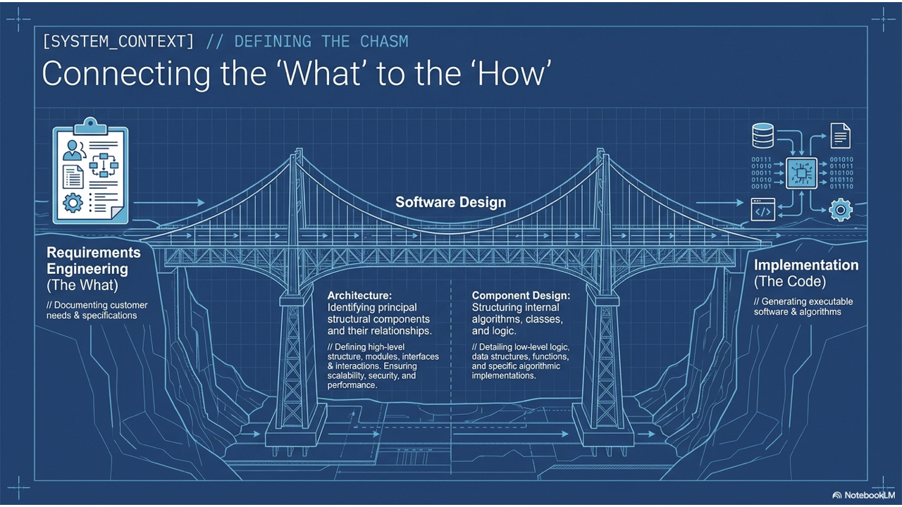
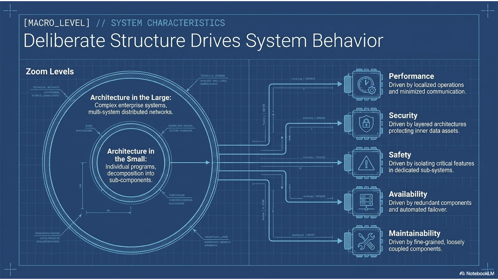
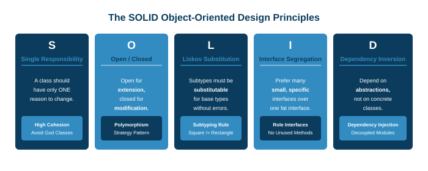

# Software Engineering

### Lecture 5: Software Architecture & Design

**Prof. Nien-Lin Hsueh**
Department of Information Engineering and Computer Science
Feng Chia University

<!--
Welcome everyone to Lecture 5 of Software Engineering: Software Architecture and Object-Oriented Design.

In the previous chapters, we analyzed what the customer needs through Requirements Engineering, and how to visually model system boundaries through System Modeling. Today, we answer the ultimate engineering question: How do we structure the system so that it remains robust, scalable, and maintainable over decades?

Software architecture and design represent the vital link between requirements and implementation. In this lecture, we examine Kruchten's 4+1 views, explore classic architectural patterns from MVC to Microservices, unpack the golden rule of High Cohesion and Low Coupling, master the foundational SOLID design principles, and see how modern AI copilots assist architects in trade-off analysis and refactoring.

To summarize this slide, remember this key takeaway: Architecture and design establish the structural foundation that enables software systems to scale, adapt, and endure.
-->
---
## Chapter 5: Roadmap & Key Topics

* **5.1 Foundations of Software Architecture** (The Bridge from Reqt to Design & Abstraction Levels)
* **5.2 Kruchten's 4+1 Architectural Views** (Logical, Process, Development, Physical & Scenarios)
* **5.3 Classic Architectural Patterns** (Layered, Repository, Client-Server, Pipe & Filter, MVC, Microservices)
* **5.4 Architecture & System Quality Attributes** (Trade-offs: Performance, Security, Safety, Availability)
* **5.5 Fundamentals of Software Design** (4 Design Activities & Core Tenets: Modularity, Cohesion, Coupling)
* **5.6 SOLID Object-Oriented Design Principles** (SRP, OCP, LSP, ISP, DIP in Depth)
* **5.7 AI in Architecture & Software Design** (Copilots, Refactoring, Pattern Recommendation & Risks)
* **5.8 Conceptual Recap & References** (Fill-in-the-blank Quiz & Literature)

<!--
Here is our roadmap for Chapter 5.

We begin in 5.1 with the core definitions of software architecture and the distinction between architecture in the small versus architecture in the large.

In 5.2, we study Kruchten's 4+1 Architectural View Model, providing a multi-dimensional perspective for different stakeholders.

In 5.3, we dive into classic Architectural Patterns: Layered, Repository, Client-Server, Pipe and Filter, Model-View-Controller, and modern Microservices.

In 5.4, we examine how architecture directly drives non-functional quality attributes such as performance and security.

In 5.5, we zoom into detailed Software Design, examining modularity, information hiding, and the golden rule: High Cohesion and Low Coupling.

In 5.6, we master the SOLID object-oriented principles with concrete before-and-after code examples.

Finally, in 5.7, we explore AI as an architectural copilot, followed by our conceptual recap in 5.8.

To summarize this slide, remember this key takeaway: This roadmap guides our journey from macro-level enterprise architecture to micro-level object-oriented design excellence.
-->
---
## Focus Questions

* What is **Software Architecture** and why does it serve as the critical link between requirements and detailed design?
* How does **Architecture in the Small** differ from **Architecture in the Large**?
* What are Kruchten's **4+1 Architectural Views** and how do they satisfy diverse stakeholder needs?
* How do classic **Architectural Patterns** (Layered, Repository, Client-Server, Pipe & Filter, MVC, Microservices) structure software?
* Why is **High Cohesion and Low Coupling** the universal golden rule of software engineering?
* How do the **5 SOLID Principles** (SRP, OCP, LSP, ISP, DIP) prevent architectural rot and rigidity?
* How can **Generative AI** assist software architects while safeguarding against architectural blind spots?

<!--
Keep these focus questions in mind throughout our lecture today.

First, why is software architecture the most consequential technical decision made in a software project?

Second, how do Kruchten's 4+1 views bridge the communication gap between business managers, system programmers, and DevOps infrastructure teams?

Third, what are the fundamental architectural trade-offs between monolithic databases and distributed microservices?

Fourth, why do we strive relentlessly for high cohesion and low coupling across classes and modules?

And finally, how do the five SOLID principles protect codebases from decaying into unmaintainable legacy spaghetti?

To summarize this slide, remember this key takeaway: These focus questions provide our analytical framework for evaluating software architecture and design.
-->
---
<!-- _class: lead -->
<!-- header: '5.1 Foundations of Architecture' -->

# **5.1 Foundations of Software Architecture**

> "Software architecture is the set of design decisions which, if made incorrectly, may cause your project to fail."  
> — *Eoin Woods*

<!--
Welcome to Module 5.1: Foundations of Software Architecture.

Software architecture is not about choosing whether to use a for-loop or a while-loop. It is the high-level blueprint that defines how major sub-systems are partitioned, how they communicate across process boundaries, and how data flows through the enterprise.

In this section, we examine the bridge role of architecture, explore the advantages of making architecture explicit, and distinguish between architecture in the small and architecture in the large.

To summarize this slide, remember this key takeaway: Software architecture establishes the fundamental organization of a system, governing its structural components and interactions.
-->
---
## What is Software Architecture?

> The fundamental organization of a software system embodied in its components, their relationships to each other and the environment, and the principles guiding its design and evolution.

* **The Critical Bridge Role:**
  - Connects **Requirements Engineering** (*what the customer needs*) to **Detailed Software Design** (*how components are constructed*).
  - Identifies principal structural components and defines their public communication interfaces.
* **Architecture as Design Decisions:**
  - Architecture represents the early, high-impact design decisions that are **costliest to change** once implementation begins.

<!--
Let's define Software Architecture.

Software architecture is the fundamental organization of a system embodied in its components, their relationships to each other and the environment, and the principles guiding its design and evolution.

Notice its bridge role: Requirements engineering tells us *what* needs to be built. Coding is *how* individual lines are written. Architecture is the bridge in between—it determines the principal structural modules, the data persistence strategy, and the network communication protocols.

Because architectural decisions are the hardest and most expensive to change later, getting the architecture right early is vital to project success.

To summarize this slide, remember this key takeaway: Software architecture bridges requirements and code by establishing high-level component structures and communication boundaries.
-->
---
<!-- _class: full-image-slide -->

<div class="centered-image">
  
</div>

<!--
Look at this visual illustration: 'Connecting the What to the How.'

On the left, we have Requirements Engineering: stakeholder interviews, user stories, and non-functional constraints—defining *what* problem must be solved.

On the right, we have Implementation: thousands of lines of source code, unit tests, and database queries—representing *how* the system executes.

In the center, bridging the chasm, sits Software Architecture! Architecture transforms messy human desires into structured sub-systems, service interfaces, and deployment topology.

To summarize this slide, remember this key takeaway: Architecture is the intellectual keystone that translates requirements into an executable software reality.
-->
---
## Architectural Abstraction Levels

* **Architecture in the Small:**
  - Concerned with the design of individual programs, microservices, or client applications.
  - Focuses on how a single program is decomposed into sub-components, packages, and object classes.
  - Directly influences internal code readability, testability, and refactoring velocity.
* **Architecture in the Large:**
  - Concerned with complex enterprise systems composed of interacting multi-system networks.
  - Systems are distributed across multiple servers, cloud regions, and external vendor platforms.
  - Encompasses legacy database integration, message queues, and cross-organizational API contracts.

<!--
We distinguish between two levels of architectural abstraction:

Architecture in the Small focuses on a single application or microservice: How do we organize classes into packages? How do we decouple the controller from the database repository?

Architecture in the Large zooms out to the entire enterprise: How do dozens of separate applications, legacy mainframes, mobile apps, and third-party SaaS services interact across distributed cloud networks?

A senior software engineer must be comfortable navigating both levels—ensuring individual services are cleanly designed while orchestrating enterprise-wide integration.

To summarize this slide, remember this key takeaway: Architecture spans micro-level package decomposition (in the small) to distributed enterprise ecosystems (in the large).
-->
---
## Advantages of Explicit Software Architecture

1. **Stakeholder Communication:**
   - High-level architectural diagrams act as a common focus of discussion between technical teams, business executives, and external clients without getting bogged down in code syntax.
2. **System Analysis & Non-Functional Verification:**
   - Enables early verification of whether the proposed design can satisfy critical **non-functional requirements** (e.g., peak latency, fault tolerance, compliance).
3. **Large-Scale Reuse:**
   - Architectural patterns and component frameworks can be systematically reused across entire product families in the same domain.

<!--
Why should software teams invest time in making architecture explicit rather than just coding?

Three primary reasons:
First, Stakeholder Communication: An architectural diagram is understandable to business executives and product managers. It allows everyone to align on system scope without drowning in code.
Second, System Analysis: You can evaluate whether the system will survive peak Black Friday traffic *before* writing a single line of backend code, by analyzing database bottlenecks and network hops.
Third, Large-Scale Reuse: Mature engineering organizations reuse core architectural styles and microservice chassis across dozens of products.

To summarize this slide, remember this key takeaway: Explicit architecture facilitates stakeholder alignment, enables early quality verification, and promotes large-scale reuse.
-->
---
<!-- _class: lead -->
<!-- header: "5.2 Kruchten's 4+1 Views" -->

# **5.2 Kruchten's 4+1 Architectural Views**

> "If you look at an architecture from only one perspective, you are blind to three-quarters of its reality."  
> — *Philippe Kruchten*

<!--
We now enter Module 5.2: Kruchten's 4+1 Architectural View Model.

Different stakeholders care about completely different aspects of a software system. A business analyst cares about domain concepts; a programmer cares about packages and libraries; a systems operator cares about network servers and CPU clusters.

In this section, we study Philippe Kruchten's classic 4+1 View Model, exploring how the Logical, Process, Development, and Physical views are unified through user scenarios.

To summarize this slide, remember this key takeaway: Kruchten's 4+1 model provides a multi-view framework that addresses the distinct concerns of all software stakeholders.
-->
---
## Kruchten's 4+1 Architectural View Model

* **1. Logical View (Domain / Object Perspective):**
  - Shows key domain abstractions, object classes, and relationships (*Target Audience: System Analysts & Customers*).
* **2. Process View (Concurrency / Runtime Perspective):**
  - Shows runtime processes, threads, concurrency, and inter-process communication (*Target Audience: Integrators & Performance Engineers*).
* **3. Development View (Module / Implementation Perspective):**
  - Shows software packages, build artifacts, libraries, and source code hierarchies (*Target Audience: Software Developers*).
* **4. Physical View (Deployment / Infrastructure Perspective):**
  - Shows physical server hardware, cloud containers, and network topology (*Target Audience: DevOps & System Administrators*).
* **+1 Scenarios (Use Cases):**
  - Unifies and validates all four views by demonstrating how they execute real user journeys together.

<!--
Let's examine Philippe Kruchten's landmark 4+1 View Model:

The Logical View represents the system's functional domain—object classes, entities, and services.
The Process View captures the dynamic runtime behavior—processes, threads, race conditions, and message brokers.
The Development View organizes the source code—modules, packages, frameworks, and build scripts.
The Physical View maps the software onto infrastructure—cloud clusters, Docker containers, load balancers, and network firewalls.

And the '+1' in the center represents Scenarios and Use Cases: they tie the four views together by walking through concrete user interactions.

To summarize this slide, remember this key takeaway: Kruchten's 4+1 model synthesizes logical, process, development, and physical views anchored by user scenarios.
-->
---
<!-- _class: full-image-slide -->

<div class="centered-image">
  
</div>

<!--
Look at this visual illustration: 'Five Perspectives, One Unified Blueprint.'

Notice how the four outer view boxes surround the central '+1 Scenarios' circle.

No single architectural diagram can satisfy every stakeholder. When talking to a database administrator, you pull up the Physical and Process views. When onboarding a new junior developer, you open the Development and Logical views. When speaking to a product manager, you anchor discussions in the central Scenarios.

To summarize this slide, remember this key takeaway: Multi-view architecture delivers tailored structural perspectives for developers, operators, and business stakeholders.
-->
---
### Concept Check Question 1
<div class="ccq-columns">
  <div class="ccq-text">

Which architectural view in Kruchten's 4+1 View Model illustrates how software components are deployed across physical hardware servers, cloud containers, and network topology at runtime?

- **A.** Logical View
- **B.** Process View
- **C.** Development View
- **D.** Physical (Deployment) View

  </div>
  <div class="ccq-logo">
    
  </div>
</div>

<!--
Let's test our understanding with Concept Check Question 1.

Look at the prompt: Which view illustrates how components are deployed across physical hardware servers, cloud containers, and network topology?

Let's evaluate the options:
Option A, Logical View, shows domain object classes.
Option B, Process View, shows runtime threads and concurrency.
Option C, Development View, shows source code packages and libraries.

The correct answer is Option D, the Physical (or Deployment) View! The physical view maps software artifacts onto physical or virtual execution environments, showing servers, load balancers, and network routers.

To summarize this slide, remember this key takeaway: The Physical View models the deployment topology of software components on hardware and cloud infrastructure.
-->
---
<!-- _class: lead -->
<!-- header: '5.3 Architectural Patterns' -->

# **5.3 Classic Architectural Patterns**

> "Good architects borrow; great architects reuse proven architectural patterns."

<!--
Now we transition into Module 5.3: Classic Architectural Patterns.

Architects rarely invent entirely new system structures from scratch. Over decades of software history, recurring design problems have given rise to proven, reusable architectural styles known as Architectural Patterns.

In this section, we study six foundational patterns: Model-View-Controller, Layered, Repository, Client-Server, Pipe and Filter, and modern Microservices.

To summarize this slide, remember this key takeaway: Architectural patterns provide proven, standardized structural templates for solving recurring software organization challenges.
-->
---
## What is an Architectural Pattern?

> A stylized, tested description of good design practice that has been tried and tested in different environments and is applicable to common structural scenarios.

* **Pattern Anatomy:**
  - **Pattern Name:** Meaningful identifier (*MVC*, *Layered*, *Repository*).
  - **Context & Problem:** Common structural challenge the pattern addresses.
  - **Solution:** Description of principal components and their communication relationships.
  - **Trade-offs:** Clear articulation of advantages and architectural penalties.
* **Why Patterns Matter:**
  - Establishes a common vocabulary across engineering teams.
  - Prevents teams from reinventing flawed architectural solutions.

<!--
What is an Architectural Pattern?

An architectural pattern is a stylized, tested description of good design practice that has been proven in diverse real-world environments.

Notice that a pattern is not code; it is a structural template. When an architect says 'We are building an MVC web app with a repository backend,' every engineer on the team instantly understands the high-level component structure and communication paths.

Patterns provide a shared engineering vocabulary and document proven trade-offs.

To summarize this slide, remember this key takeaway: Architectural patterns encapsulate proven structural wisdom, establishing a shared vocabulary and predictable trade-offs.
-->
---
## 1. Model-View-Controller (MVC) Pattern

* **Component Separation:**
  - **Model:** Manages core business domain logic, data state, and persistence rules.
  - **View:** Renders user interfaces and presents data to human users.
  - **Controller:** Intercepts user inputs (clicks, HTTP requests), invokes Model updates, and selects Views.
* **Core Advantage:**
  - **Decouples Data from Presentation:** Multiple simultaneous views (web dashboard, mobile JSON API) can observe the same underlying model without modifying business logic.

<div style="text-align: center; margin-top: 10px;">
  
</div>

<!--
The Model-View-Controller (MVC) pattern is the bedrock of interactive GUI and modern web application development.

Notice the division of responsibilities:
The Model represents the data and business rules. It knows nothing about HTML or buttons.
The View renders the interface.
The Controller listens for user input events and translates them into model updates.

The brilliant advantage of MVC is decoupling: you can build a desktop view, a mobile view, and an administrative dashboard that all share the exact same underlying Model without duplicating a single line of business logic.

To summarize this slide, remember this key takeaway: MVC cleanly separates business domain data from user interface presentation and input event handling.
-->
---
## 2. Layered Architecture Pattern

* **Stacked Abstraction Layers:**
  - Organizes system functionality into ordered layers. Each layer provides services to the layer directly above it, and relies only on the layer directly below it.
* **Standard Enterprise Layers:**
  - **Presentation Layer:** UI, HTTP endpoints, view controllers.
  - **Application / Service Layer:** Workflow orchestration, transaction boundaries.
  - **Domain / Business Layer:** Pure domain logic, business rules, entities.
  - **Infrastructure / Data Layer:** Database access, external third-party APIs.
* **Key Advantage:**
  - **Modifiability & Isolation:** An entire layer can be replaced (e.g., swapping Oracle for PostgreSQL) without breaking upper business layers, provided interface contracts remain stable.

<!--
The Layered Architecture pattern is the classic organizing principle of enterprise software.

Think of it like an operating system: high-level applications don't talk directly to hard drive magnetic heads; they talk to the file system layer, which talks to the device driver layer.

In enterprise software, the Presentation layer talks to the Service layer, which talks to the Domain layer, which talks to the Database infrastructure layer.

This strict downward dependency isolates change: if you switch your database from MySQL to DynamoDB, only the Infrastructure layer changes. Your core business rules remain untouched.

To summarize this slide, remember this key takeaway: Layered architectures isolate change by enforcing strict downward dependencies across stacked levels of abstraction.
-->
---
## 3. Repository Architecture Pattern

* **Centralized Data Sharing:**
  - Sub-systems exchange large volumes of complex data through a shared, centralized repository or data store.
  - Sub-systems operate independently; interactions occur strictly through repository state modifications.
* **Prominent Examples:**
  - Modern IDEs (VS Code language servers, Eclipse workspace repositories).
  - Computer-Aided Design (CAD) engineering suites.
  - Electronic Medical Health Record (EHR) central patient databases.
* **Architectural Trade-offs:**
  - *Pro:* Efficient for sharing massive, interconnected data sets.
  - *Con:* The central repository is a potential **Single Point of Failure (SPOF)** and performance bottleneck.

<!--
In a Repository Architecture, multiple independent sub-systems interact entirely through a shared central database.

Think of an IDE like VS Code: the syntax highlighter, the compiler, the linter, and the debugger are all separate tools, but they share a single central in-memory repository representing the Abstract Syntax Tree of your code.

The advantage is data sharing efficiency without passing gigabytes across network sockets.
The trade-off is vulnerability: if the central repository crashes or corrupts data, all dependent sub-systems halt immediately.

To summarize this slide, remember this key takeaway: Repository architectures center sub-system collaboration around a shared data store, trading centralization for data sharing efficiency.
-->
---
## 4. Client-Server & Pipe-and-Filter Patterns

* **Client-Server Architecture:**
  - Functionality is distributed between **Servers** offering specialized services (database, compute, auth) and **Clients** requesting services over a network.
  - *Trade-off:* High scalability across commodity hardware, but vulnerable to network latency and server connection saturation.
* **Pipe-and-Filter Architecture:**
  - Processing is organized as a discrete sequence of transformations (**Filters**) connected by data streams (**Pipes**).
  - Output of filter $N$ becomes the input stream of filter $N+1$.
  - *Classic Example:* Unix terminal commands (`cat log.txt | grep 'ERROR' | sort | uniq -c`).
  - *Best Suited For:* Batch billing processing, data analytics pipelines, compiler toolchains.

<!--
Here we compare two classic patterns:

Client-Server distributes processing across a network. Clients make requests, servers return responses. It is the architectural engine of the World Wide Web.

Pipe-and-Filter structures computation as a pipeline of independent transformation steps connected by data streams. The beauty of Pipe-and-Filter is composability: you can rearrange, add, or remove filters without rewriting the surrounding pipeline, just like Unix terminal commands.

To summarize this slide, remember this key takeaway: Client-server distributes network computing; pipe-and-filter decomposes stream processing into independent transformational stages.
-->
---
## 5. Microservices Architecture (MSA) vs. Monolith

* **Monolithic Architecture:**
  - All features, business logic, and database schemas packaged and deployed as a single unified executable binary.
  - *Pro:* Simple to develop and deploy early; zero network serialization overhead.
  - *Con:* Scaling requires duplicating the entire application; single code bug can crash the entire system.
* **Microservices Architecture:**
  - Decomposes the application into a suite of small, independently deployable services organized around **business capabilities**.
  - Each microservice owns its **isolated private database** (decentralized data management).
  - Services communicate asynchronously (Kafka/RabbitMQ) or via lightweight REST/gRPC APIs.

<!--
The most significant architectural debate of the modern era is Monolith versus Microservices.

In a Monolith, all code—user accounts, checkout, inventory, billing—runs inside a single executable. It is simple to build initially, but as teams grow to hundreds of engineers, deployments become terrifying bottlenecks.

In Microservices, each business domain becomes an independent service with its own private database. The Order Service cannot write directly to the User database; it must call the User API.

This enables independent scaling and polyglot technology stacks, but introduces massive distributed system complexity.

To summarize this slide, remember this key takeaway: Monoliths maximize simplicity early on, while microservices enable independent team scaling at the cost of distributed complexity.
-->
---
<!-- _class: full-image-slide -->

<div class="centered-image">
  
</div>

<!--
Look at this visual comparison: 'Monolith vs. Microservices Architecture.'

On the left, the Monolith: a massive, tightly packed skyscraper with a single foundation database. If a leak occurs on the 10th floor, the entire building is compromised.

On the right, Microservices: a fleet of independent, modular houses, each with its own private utilities. If one house experiences an outage, the rest of the neighborhood continues operating uninterrupted.

However, notice the paved roads and communication wires connecting the houses—that distributed network infrastructure is where latency, network failures, and distributed transaction complexity live!

To summarize this slide, remember this key takeaway: Microservices decouple failure domains and team workflows, but introduce distributed network operational overhead.
-->
---
### Concept Check Question 2
<div class="ccq-columns">
  <div class="ccq-text">

Which classic architectural pattern explicitly separates user interface presentation and layout from underlying business domain data management and user input event processing?

- **A.** Pipe and Filter Pattern
- **B.** Model-View-Controller (MVC) Pattern
- **C.** Repository Pattern
- **D.** Client-Server Pattern

  </div>
  <div class="ccq-logo">
    
  </div>
</div>

<!--
Let's verify our understanding of architectural patterns with Concept Check Question 2.

Look at the options:
Option A, Pipe and Filter, transforms sequential data streams.
Option C, Repository, shares data among tools via a central database.
Option D, Client-Server, distributes compute over a network.

The correct answer is Option B, Model-View-Controller (MVC)! The Model manages domain data, the View renders presentation, and the Controller processes user input events.

To summarize this slide, remember this key takeaway: MVC decouples presentation views from domain data models and user input event controllers.
-->
---
<!-- _class: lead -->
<!-- header: '5.4 Quality Attributes' -->

# **5.4 Architecture & System Quality Attributes**

> "Architecture is where requirements meet reality through trade-off analysis."

<!--
We now enter Module 5.4: Architecture and System Quality Attributes.

Recall our principle from Chapter 3: Software architecture is shaped far more by non-functional requirements than by functional requirements. Whether an app sells books or airline tickets, its architecture is dictated by whether it must survive 10 requests per second or 100,000 requests per second.

In this section, we examine how architectural decisions directly determine Performance, Security, Safety, Availability, and Maintainability—and how architects balance conflicting quality goals.

To summarize this slide, remember this key takeaway: Architecture is the primary mechanism for satisfying non-functional quality attributes through deliberate structural trade-offs.
-->
---
## Architecture Drives System Quality Attributes

* **Performance:**
  - *Architectural Strategy:* Localize critical operations within coarse-grained components; minimize cross-network calls; deploy distributed caching layers (Redis).
* **Security:**
  - *Architectural Strategy:* Employ layered defense-in-depth; enclose high-value data assets in inner protected layers; enforce perimeter API gateways.
* **Safety:**
  - *Architectural Strategy:* Isolate safety-critical logic into independent, physically redundant sub-systems to prevent error propagation.
* **Availability:**
  - *Architectural Strategy:* Eliminate single points of failure (SPOF); implement redundant server instances, automated health checks, and active-active failover.
* **Maintainability:**
  - *Architectural Strategy:* Decompose into fine-grained, loosely coupled modules communicating strictly through stable abstract interfaces.

<!--
Notice how every major non-functional quality attribute maps directly to a specific architectural tactic:

Want high performance? Minimize inter-process communication hops and place caching close to the user.
Want high security? Use a layered castle-and-moat architecture with authentication firewalls at the perimeter.
Want safety in an airplane or medical device? Isolate flight-control code from the passenger entertainment system on physically separate buses.
Want five-nines availability? Build redundant instances with automated circuit breakers and multi-region failover.

Architecture is the structural engine that delivers these systemic qualities.

To summarize this slide, remember this key takeaway: Quality attributes are achieved through targeted architectural tactics such as caching, layering, isolation, and redundancy.
-->
---
<!-- _class: full-image-slide -->

<div class="centered-image">
  
</div>

<!--
Look at this visual synthesis: 'Deliberate Structure Drives System Behavior.'

Architecture is never about finding a single 'perfect' design. It is about understanding trade-offs.

Notice the inherent tensions:
Maximizing Security (adding encryption layers, token validations, and audit logs) inherently penalizes Performance (adding latency to every transaction).
Maximizing Maintainability (splitting code into microservices) inherently increases Operational Complexity.

The mark of a master software architect is the ability to analyze stakeholder priorities and select the optimal trade-off balance.

To summarize this slide, remember this key takeaway: Architecture involves balancing inevitable trade-offs between competing quality attributes.
-->
---
<!-- _class: lead -->
<!-- header: '5.5 Fundamentals of Software Design' -->

# **5.5 Fundamentals of Software Design**

> "There are two ways of constructing a software design: One way is to make it so simple that there are obviously no deficiencies, and the other way is to make it so complicated that there are no obvious deficiencies."  
> — *C. A. R. Hoare*

<!--
We now transition into Module 5.5: Fundamentals of Software Design.

Having established macro-level architecture, we now zoom into micro-level design: How do we organize individual classes, methods, and modules within an application?

In this section, we examine the four fundamental design activities and unpack the universal golden rule of software design: High Cohesion and Low Coupling.

To summarize this slide, remember this key takeaway: Software design translates architectural blueprints into cohesive, decoupled classes and module interfaces.
-->
---
## 4 Fundamental Software Design Activities

1. **Architectural Design (Macro Structure):**
   - Identifying principal sub-systems, service boundaries, and communication pipelines.
2. **Interface Design (Contract Specification):**
   - Defining precise, unambiguous public contracts between modules (REST APIs, interface methods).
3. **Component / Detailed Design (Micro Structure):**
   - Designing internal class structures, algorithms, data structures, and private helper logic.
4. **Database & Data Structure Design (Persistence):**
   - Designing relational entity-relationship schemas, document collections, or object graphs.

<!--
Software design consists of four interlocking activities:

First, Architectural design: partitioning the system into high-level sub-systems.
Second, Interface design: defining the contracts between components before writing implementation code.
Third, Component design: fleshing out internal class attributes, methods, and algorithms.
And fourth, Database design: mapping domain entities to persistent relational or NoSQL storage.

These activities ensure that code is built on an organized, intentional blueprint.

To summarize this slide, remember this key takeaway: Software design systematically addresses architecture, interface contracts, internal component logic, and data persistence.
-->
---
## Core Design Tenets: Modularity, Abstraction & SoC

* **1. Abstraction (抽象化):**
  - Hiding low-level implementation mechanics behind clean, high-level conceptual interfaces. Allows developers to reason about systems without mental overload.
* **2. Encapsulation & Information Hiding (封裝與資訊隱藏):**
  - *David Parnas's Principle:* Bundling state and behavior inside a module while concealing private variables. Prevents external code from introducing illegal state side-effects.
* **3. Separation of Concerns (SoC / 關注點分離):**
  - Decomposing software into distinct features that overlap as little as possible (e.g., decoupling UI rendering logic from SQL database queries).
* **4. Modularity (模組化):**
  - Partitioning systems into self-contained, independently testable, and replaceable units.

<!--
These four tenets form the bedrock of clean software engineering:

Abstraction allows you to call `map.insert(key, value)` without worrying whether it uses a red-black tree or a hash table.
Encapsulation protects internal variables behind private access modifiers, preventing outside code from corrupting data.
Separation of Concerns ensures that UI code doesn't execute SQL queries, and business logic doesn't format HTML.
And Modularity allows teams to work in parallel on independent components.

To summarize this slide, remember this key takeaway: Abstraction, encapsulation, separation of concerns, and modularity prevent cognitive overload and protect system integrity.
-->
---
## The Golden Rule: High Cohesion & Low Coupling

* **Cohesion (凝聚度):**
  - Measures how strongly related and focused the internal responsibilities of a single class or module are.
  - **Engineering Goal:** **High Cohesion** (A class should do one thing, and do it completely).
* **Coupling (耦合度):**
  - Measures the degree of direct inter-dependence between separate modules.
  - **Engineering Goal:** **Low Coupling** (Modules interact via abstract interfaces with minimal knowledge of internal mechanics).
* **The Universal Golden Rule:**
  > **Maximize Cohesion, Minimize Coupling!**
  > High cohesion makes code easy to understand; low coupling prevents changes in one module from rippling across the entire codebase.

<!--
If you remember only one slide from your entire software engineering education, let it be this one: Maximize Cohesion, Minimize Coupling!

Cohesion measures internal focus: Does this class do one thing well, or is it a giant mess handling databases, email, and PDF printing? You want High Cohesion.

Coupling measures external dependencies: Does Class A directly depend on the private variables of Class B, C, and D? You want Low Coupling.

High cohesion combined with low coupling is what makes software maintainable, testable, and reusable over decades.

To summarize this slide, remember this key takeaway: High cohesion ensures focused internal responsibilities; low coupling minimizes ripple-effect dependencies across modules.
-->
---
## Cohesion & Coupling: Bad vs. Good Design

```java
// ❌ BAD: Low Cohesion, High Coupling ("God Class")
class OrderManager {
    public void processOrder() {
        // Direct MySQL SQL query string execution
        // Business discount arithmetic logic
        // Raw HTML string formatting for invoice
        // Low-level SMTP socket connection to send email
    }
}
```

```java
// ✅ GOOD: High Cohesion, Low Coupling (Decoupled Single-Purpose Classes)
class OrderProcessor {
    private final DiscountCalculator discountCalculator;
    private final OrderRepository orderRepository;
    private final NotificationService notificationService;

    public OrderProcessor(DiscountCalculator dc, OrderRepository repo, NotificationService ns) {
        this.discountCalculator = dc;
        this.orderRepository = repo;
        this.notificationService = ns;
    }
    // Orchestrates workflow strictly through clean abstract interfaces!
}
```

<!--
Look at this concrete Java comparison:

In the Bad design on top, `OrderManager` is a classic 'God Class': it does raw SQL, business math, HTML rendering, and network SMTP email sockets all in one file! If you change your email provider, you risk breaking order calculation logic!

Now look at the Good design on the bottom: `OrderProcessor` has a single, cohesive responsibility—orchestrating the checkout workflow. It delegates calculation to `DiscountCalculator`, persistence to `OrderRepository`, and email to `NotificationService`. Each class can be unit-tested and modified in complete isolation.

To summarize this slide, remember this key takeaway: Decoupling multifaceted workflows into single-purpose collaborating classes achieves high cohesion and low coupling.
-->
---
### Concept Check Question 3
<div class="ccq-columns">
  <div class="ccq-text">

In software design, what is the primary operational benefit achieved by combining **High Cohesion** with **Low Coupling**?

- **A.** It maximizes CPU execution speed by inlining all functions into a single binary.
- **B.** It creates modular code where modifications to one class have minimal ripple effects on others.
- **C.** It mandates that all application data structures be stored in global memory spaces.
- **D.** It eliminates the need for automated integration testing in production pipelines.

  </div>
  <div class="ccq-logo">
    
  </div>
</div>

<!--
Let's test our understanding with Concept Check Question 3.

Look at the options:
Option A confuses runtime compiler optimization with architectural design.
Option C describes global variables, which represent maximum coupling!
Option D claims it eliminates testing, which is false.

The correct answer is Option B! High cohesion keeps classes focused on a single responsibility, while low coupling minimizes dependencies between modules. When a requirement changes, you modify one class without triggering a cascading wave of bugs across the rest of the application.

To summarize this slide, remember this key takeaway: High cohesion and low coupling prevent cascading ripple-effect bugs when requirements evolve.
-->
---
<!-- _class: lead -->
<!-- header: '5.6 SOLID Principles' -->

# **5.6 SOLID Object-Oriented Principles**

> "Clean code always looks like it was written by someone who cares."  
> — *Robert C. Martin (Uncle Bob)*

<!--
We now enter Module 5.6: The SOLID Object-Oriented Principles.

Coined by Robert C. Martin ('Uncle Bob'), the SOLID acronym encapsulates five foundational design principles that guide engineers in building clean, decoupled, and extensible object-oriented systems.

In this section, we unpack each of the five letters—Single Responsibility, Open/Closed, Liskov Substitution, Interface Segregation, and Dependency Inversion—with concrete code patterns and anti-patterns.

To summarize this slide, remember this key takeaway: The SOLID principles provide actionable design heuristics to prevent software codebases from decaying into rigid, fragile legacy systems.
-->
---
## Overview: The SOLID Principles

* **S &ndash; Single Responsibility Principle (SRP):**
  - A class should have one, and only one, reason to change.
* **O &ndash; Open / Closed Principle (OCP):**
  - Software entities should be open for extension, but closed for modification.
* **L &ndash; Liskov Substitution Principle (LSP):**
  - Subtypes must be substitutable for their base types without altering program correctness.
* **I &ndash; Interface Segregation Principle (ISP):**
  - Clients should not be forced to depend on interface methods they do not use.
* **D &ndash; Dependency Inversion Principle (DIP):**
  - High-level modules should not depend on low-level modules; both should depend on abstractions.

<div style="text-align: center; margin-top: 10px;">
  
</div>

<!--
The SOLID acronym is the gold standard of object-oriented design excellence.

SRP guarantees that every class has a single focused responsibility.
OCP enables you to add new features via polymorphism without editing tested existing classes.
LSP ensures inheritance hierarchies are semantically sound and swappable.
ISP keeps interfaces lean and role-specific rather than bloated.
And DIP decouples business logic from concrete frameworks and databases using dependency injection.

Let's examine each principle in depth.

To summarize this slide, remember this key takeaway: The five SOLID principles form a cohesive engineering framework for building decoupled, maintainable software.
-->
---
## S &ndash; Single Responsibility Principle (SRP)

* **Core Principle:**
  > A class should have one, and only one, reason to change.
* **Why SRP is Vital:**
  - When classes combine multiple responsibilities (e.g., database storage + PDF reporting + email dispatch), a change in email formatting risks introducing bugs into database persistence logic!

```java
// ❌ Violates SRP: 3 distinct reasons to change (DB, PDF formatting, Email delivery)
class UserReportManager {
    public void fetchUserData() { /* DB SQL */ }
    public void generatePdfReport() { /* PDF rendering */ }
    public void sendEmailReport() { /* SMTP protocol */ }
}

// ✅ Follows SRP: 3 separate, single-purpose classes
class UserRepository { public User fetchUserData() { ... } }
class PdfReportFormatter { public byte[] generatePdf(User u) { ... } }
class EmailService { public void sendEmail(String to, byte[] data) { ... } }
```

<!--
The Single Responsibility Principle states that a class should have only one reason to change.

Look at the bad example: `UserReportManager` has three distinct reasons to change. If the database schema updates, you edit this class. If the marketing team changes the PDF logo, you edit this class. If the email server changes, you edit this class.

In the good design, we decouple these into three focused classes: `UserRepository`, `PdfReportFormatter`, and `EmailService`. Each class can be modified and tested independently without risking regression bugs in the others.

To summarize this slide, remember this key takeaway: Assigning a single responsibility per class isolates change and prevents cross-functional regression defects.
-->
---
## O &ndash; Open / Closed Principle (OCP)

* **Core Principle:**
  > Software entities should be open for extension, but closed for modification.
* **The Engineering Mechanism:**
  - Use **polymorphism and interfaces** (e.g., Strategy Pattern) rather than fragile `if-else` or `switch` statements checking type codes.

```java
// ❌ Violates OCP: Adding a new discount tier REQUIRES modifying existing tested code!
class DiscountCalculator {
    public double calculate(String tier, double price) {
        if (tier.equals("VIP")) return price * 0.8;
        else if (tier.equals("STUDENT")) return price * 0.9;
        return price; // Must edit this method every time a new promotion is invented!
    }
}

// ✅ Follows OCP: Add new tiers by creating NEW classes implementing the interface!
interface DiscountStrategy { double apply(double price); }
class VipDiscount implements DiscountStrategy { public double apply(double p) { return p * 0.8; } }
class StudentDiscount implements DiscountStrategy { public double apply(double p) { return p * 0.9; } }
// Adding "BlackFridayDiscount" requires ZERO edits to existing tested code!
```

<!--
The Open/Closed Principle states that code should be open for extension, but closed for modification.

Look at the bad example: Every time the marketing department invents a new discount tier, developers have to open `DiscountCalculator` and add another `else-if` branch. Over time, that method becomes an unmaintainable 500-line monstrosity.

In the good design, we define a `DiscountStrategy` interface. To add a Black Friday discount, you simply create a new class implementing the interface. The existing tested code is never modified!

To summarize this slide, remember this key takeaway: Leverage polymorphism to allow adding new features without modifying existing, tested source code.
-->
---
## L &ndash; Liskov Substitution Principle (LSP)

* **Core Principle:**
  > Subtypes must be substitutable for their base types without altering program correctness.
* **The Classic Anti-Pattern: Square extending Rectangle:**
  - In geometry, a square is a rectangle. But in object-oriented code, setting the width of a Square must also change its height, breaking client code expectations!

```java
// ❌ Violates LSP: Square breaks the invariant assumptions of Rectangle!
class Rectangle {
    protected int width, height;
    public void setWidth(int w) { this.width = w; }
    public void setHeight(int h) { this.height = h; }
    public int getArea() { return width * height; }
}
class Square extends Rectangle {
    @Override public void setWidth(int w) { this.width = w; this.height = w; }
    @Override public void setHeight(int h) { this.width = h; this.height = h; }
}
// Client code: rect.setWidth(5); rect.setHeight(4); expects area = 20, but Square gives 16!

// ✅ Follows LSP: Separate abstractions using a common Shape interface
interface Shape { int getArea(); }
class Rectangle implements Shape { ... }
class Square implements Shape { ... }
```

<!--
The Liskov Substitution Principle, formulated by Turing Award winner Barbara Liskov, requires that subclasses behave consistently with their superclasses.

The classic trap is the Square extending Rectangle: In math, a square is a rectangle. But in code, if someone passes a Square into a function expecting a Rectangle, setting the width to 5 and height to 4 suddenly causes the area to be 16 instead of 20!

If a subclass throws an unexpected exception or violates base class assumptions, it violates LSP.

To summarize this slide, remember this key takeaway: Subclasses must strictly honor the behavioral contracts and invariants established by their base abstractions.
-->
---
## I &ndash; Interface Segregation Principle (ISP)

* **Core Principle:**
  > Clients should not be forced to depend on interface methods they do not use.
* **The "Fat Interface" Problem:**
  - Avoid creating massive interfaces with dozens of methods. Instead, favor small, focused, role-specific interfaces.

```java
// ❌ Violates ISP: "Fat Interface" forces SimplePrinter to implement methods it cannot support!
interface MultiFunctionDevice {
    void print();
    void scan();
    void fax();
}
class SimplePrinter implements MultiFunctionDevice {
    public void print() { /* OK */ }
    public void scan() { throw new UnsupportedOperationException(); } // Anti-pattern!
    public void fax() { throw new UnsupportedOperationException(); }
}

// ✅ Follows ISP: Segregated, role-specific interfaces
interface Printer { void print(); }
interface Scanner { void scan(); }
interface Fax { void fax(); }

class SimplePrinter implements Printer { public void print() { ... } }
class AllInOneMachine implements Printer, Scanner, Fax { ... }
```

<!--
The Interface Segregation Principle warns against 'Fat Interfaces'.

Look at the bad example: `MultiFunctionDevice` bundles printing, scanning, and faxing. A simple $50 USB printer forced to implement this interface has to throw `UnsupportedOperationException` on scan and fax.

In the good design, we segregate into three clean interfaces: `Printer`, `Scanner`, and `Fax`. An all-in-one office machine implements all three, while a simple printer implements only `Printer`.

To summarize this slide, remember this key takeaway: Decompose bloated interfaces into role-specific contracts so clients depend only on methods they actually need.
-->
---
## D &ndash; Dependency Inversion Principle (DIP)

* **Core Principle:**
  > High-level modules should not depend on low-level modules. Both should depend on abstractions.
* **The Engineering Solution: Dependency Injection (DI):**
  - High-level business services must never instantiate concrete database classes directly with `new MySQLDatabase()`. Instead, inject an abstract `Database` interface!

```java
// ❌ Violates DIP: High-level business logic is hardcoded to concrete MySQL implementation!
class OrderService {
    private MySQLDatabase db = new MySQLDatabase(); // Tight coupling! Cannot mock for tests!
    public void completeOrder(Order o) { db.insert(o); }
}

// ✅ Follows DIP: Both depend on abstract interface; injected via constructor
interface Database { void insert(Order o); }

class OrderService {
    private final Database db; // Depends strictly on abstraction!
    public OrderService(Database db) { this.db = db; } // Dependency Injection (DI)
}
// Now we can swap MySQL for PostgreSQL or inject an in-memory MockDatabase during testing!
```

<!--
The Dependency Inversion Principle is the cornerstone of modern framework architectures like Spring and NestJS.

In the bad example, `OrderService` uses the `new` keyword to instantiate `MySQLDatabase`. This tightly binds your core business logic to MySQL. You cannot swap to PostgreSQL without rewriting the service, and you cannot run fast unit tests without a live MySQL server running!

In the good design, `OrderService` depends strictly on an abstract `Database` interface injected via the constructor. You can inject MySQL in production, and an in-memory mock during unit testing!

To summarize this slide, remember this key takeaway: Invert dependencies so business logic relies on abstract interfaces rather than concrete implementation details.
-->
---
<!-- _class: full-image-slide -->

<div class="centered-image">
  
</div>

<!--
Look at this comprehensive summary matrix: 'SOLID: The Good vs. Bad Matrix.'

Notice how all five principles work in concert:
SRP keeps classes focused on one responsibility.
OCP keeps classes extensible without modifying existing code.
LSP ensures subclasses can seamlessly substitute for base classes.
ISP prevents bloated, fat interfaces.
And DIP frees business logic from low-level database and infrastructure dependencies.

Together, they transform fragile code into a resilient, maintainable software asset.

To summarize this slide, remember this key takeaway: The SOLID principles provide a complete design system for creating extensible, testable, and robust software architectures.
-->
---
### Concept Check Question 4
<div class="ccq-columns">
  <div class="ccq-text">

Which SOLID design principle states that you should be able to introduce new system capabilities by adding new classes without editing existing, tested source code?

- **A.** Single Responsibility Principle (SRP)
- **B.** Open / Closed Principle (OCP)
- **C.** Interface Segregation Principle (ISP)
- **D.** Liskov Substitution Principle (LSP)

  </div>
  <div class="ccq-logo">
    
  </div>
</div>

<!--
Let's test our SOLID knowledge with Concept Check Question 4.

Look at the prompt: Which principle states that you should be able to introduce new capabilities by adding new classes without editing existing, tested code?

Let's evaluate the options:
Option A, SRP, is about having one reason to change.
Option C, ISP, is about avoiding fat interfaces.
Option D, LSP, is about subclass substitutability.

The correct answer is Option B, the Open/Closed Principle (OCP)! Software entities should be open for extension (via polymorphism/interfaces), but closed for modification.

To summarize this slide, remember this key takeaway: The Open/Closed Principle enables adding new capabilities through polymorphic extensions while keeping tested code unchanged.
-->
---
<!-- _class: lead -->
<!-- header: '5.7 AI in Architecture & Design' -->

# **5.7 AI in Architecture & Software Design**

> "AI can recommend design patterns and refactor code smells, but human architects must steer the system's destiny."

<!--
Now we arrive at Module 5.7: AI in Architecture and Software Design.

In recent years, Large Language Models have expanded far beyond generating simple code snippets. They now serve as analytical partners capable of evaluating architectural trade-offs, detecting code smells, and suggesting SOLID refactorings.

In this section, we explore core AI applications in architecture and design, and establish essential human-in-the-loop safeguards against architectural blind spots.

To summarize this slide, remember this key takeaway: AI serves as a powerful architectural copilot, but human architects retain ultimate accountability for system structure and trade-offs.
-->
---
## AI in Architecture & Design: The Copilot Paradigm

* **The Analytical Copilot Leap:**
  - LLMs analyze complex system specifications to recommend suitable architectural patterns (e.g., Microservices vs. Event-Driven).
  - Rapidly generates interface contracts (OpenAPI / Swagger specs, gRPC `.proto` schemas, and database DDL).

<div style="text-align: center; margin-top: 15px;">
  
</div>

* **Core Architectural Value:** Accelerates trade-off analysis and generates clean boilerplate interfaces between sub-systems.

<!--
Generative AI is transforming the daily workflow of software architects.

When evaluating a new system, an architect can prompt an LLM with non-functional constraints—such as 100,000 concurrent IoT devices requiring sub-second ingestion—and the AI can rapidly generate a comparative ATAM trade-off matrix evaluating Kafka versus RabbitMQ.

Furthermore, AI automates the generation of OpenAPI specifications and gRPC protobuf contracts, ensuring decoupled interfaces between sub-systems.

To summarize this slide, remember this key takeaway: AI accelerates architectural trade-off analysis and interface contract generation across distributed systems.
-->
---
## 4 Core AI Applications in Software Design

* **1. Automated SOLID Refactoring:**
  - Scans legacy classes to detect 'God Classes' (SRP violations) and suggests Strategy or Factory patterns to achieve OCP.
* **2. Code Smell & Coupling Detection:**
  - Identifies tight coupling, circular dependencies, duplicated logic, and shotgun surgery hotspots across repositories.
* **3. Design Pattern Recommendation:**
  - Recommends GoF design patterns (Observer, Decorator, Adapter, Builder) for recurring architectural friction points.
* **4. Interface & Mock Generation for TDD:**
  - Auto-generates decoupled interfaces and mock objects, accelerating Test-Driven Development pipelines.

<!--
Here are the four primary applications of AI in software design today:

First, Automated SOLID refactoring: scanning legacy code to split multi-thousand-line monster classes into single-purpose components.
Second, Code Smell detection: identifying high coupling, circular references, and code duplication before they merge into the main branch.
Third, Design Pattern recommendation: proposing clean Gang of Four patterns to solve tricky design problems.
And fourth, Mock generation: creating mock objects to facilitate isolated unit testing.

To summarize this slide, remember this key takeaway: AI empowers software design through automated refactoring, code smell detection, pattern recommendation, and mock synthesis.
-->
---
## Human-in-the-Loop: Architectural Blind Spots

* **Risks of Unchecked AI in Architecture & Design:**
  - **Premature Distributed Complexity:** Recommending complex microservices and event brokers for simple CRUD applications that would thrive as clean monoliths.
  - **Context Blindness:** AI lacks awareness of team engineering skillsets, cloud infrastructure budgets, and corporate regulatory hurdles.
  - **Superficial Refactoring:** Renaming variables without resolving underlying algorithmic or architectural coupling.
* **The Golden Architectural Rule:**
  > **AI Proposes Trade-offs; Lead Architects Make Decisions!**
  > Human engineers must evaluate organizational context and maintain ultimate responsibility for system viability.

<!--
While AI tools are exceptionally capable, architects must remain vigilant against 'architectural blind spots'.

LLMs frequently suffer from resume-driven design—recommending distributed microservices, Kubernetes clusters, and Kafka pipelines for simple internal applications that a three-person team could build in two weeks with a clean monolith.

AI has no awareness of your cloud budget or whether your team actually knows how to debug distributed race conditions!

Therefore, our Golden Rule remains: AI proposes trade-offs; lead architects make decisions!

To summarize this slide, remember this key takeaway: Human architects must evaluate organizational context, budget, and team skills to prevent AI-driven over-engineering.
-->
---
<!-- _class: lead -->
<!-- header: '5.8 Recap & References' -->

# **5.8 Conceptual Recap & References**

> "Architecture is the decisions that you wish you could get right the first time."

<!--
To conclude Chapter 5, we arrive at Module 5.8: Conceptual Recap and References.

We will consolidate all the foundational architectural principles we covered today—from Kruchten's 4+1 views and classic patterns to cohesion, coupling, and the SOLID principles—through an interactive fill-in-the-blank quiz.

We will also review the seminal research papers and textbooks that established modern software architecture.

To summarize this slide, remember this key takeaway: Sound architecture and clean object-oriented design are the ultimate determinants of long-term software agility and success.
-->
---
## Conceptual Recap: Fill-in-the-blank Quiz

Test your understanding of the core concepts in this chapter:

1. **`___`** architecture structures a system into stacked layers where each layer provides services to the layer directly above.
2. In the **`___`** pattern, multiple independent sub-systems interact entirely through a shared central database.
3. Kruchten's **`___`** View Model presents Logical, Process, Development, and Physical views joined by Scenarios.
4. **`___`** measures the internal focus of a class, while **`___`** measures the degree of dependency between classes.
5. The **`___`** Principle states that classes should be open for extension but closed for modification.
6. The **`___`** Principle requires that high-level business logic must depend on abstractions rather than concrete classes.

<!--
Let's review today's core concepts with a quick interactive quiz!

1. Layered architecture structures systems into stacked abstract layers!
2. In the Repository pattern, sub-systems interact through a shared central database!
3. Kruchten's 4+1 View Model provides a multi-view architectural framework!
4. Cohesion measures internal focus; Coupling measures inter-module dependencies!
5. The Open/Closed Principle (OCP) states classes are open for extension, closed for modification!
6. The Dependency Inversion Principle (DIP) requires depending on abstractions via dependency injection!

Outstanding job, everyone!

To summarize this slide, remember this key takeaway: These core principles form the intellectual bedrock of professional software architecture and design.
-->
---
## References & Further Reading

* **Foundational Textbooks & Classics:**
  - Sommerville, I. (2016). *Software Engineering* (10th ed.). Chapter 6 (Architecture) & Chapter 7 (Design). Pearson.
  - Kruchten, P. (1995). "Architectural Blueprints — The '4+1' View Model of Software Architecture." *IEEE Software*, 12(6), 42-50.
  - Gamma, E., Helm, R., Johnson, R., & Vlissides, J. (1994). *Design Patterns: Elements of Reusable Object-Oriented Software*. Addison-Wesley.
  - Martin, R. C. (2017). *Clean Architecture: A Craftsman's Guide to Software Structure and Design*. Prentice Hall.
* **Modern Distributed Systems & Architecture:**
  - Fowler, M. (2014). *Microservices: A definition of this new architectural term*. [martinfowler.com](https://martinfowler.com/articles/microservices.html)
  - Richards, M., & Ford, N. (2020). *Fundamentals of Software Architecture*. O'Reilly Media.

<!--
Here are the foundational textbooks and seminal research papers for Chapter 5.

Philippe Kruchten's 1995 paper on the 4+1 view model remains a timeless classic. The 'Gang of Four' Design Patterns book and Robert C. Martin's 'Clean Architecture' are mandatory reading for every aspiring software architect.

For modern distributed systems and microservices, refer to Martin Fowler's guides and Mark Richards' Fundamentals of Software Architecture.

Thank you for your active participation in Chapter 5!
-->

<script>
(function() {
  // =========================================================================
  // 1. Header Dropdown (Table of Contents / Outline)
  // =========================================================================
  function initHeaderDropdown() {
    const sections = [];
    const seenTitles = new Set();
    const slideSections = document.querySelectorAll('section[id]');
    
    // 1. Scan unique section titles and their slide IDs
    slideSections.forEach(sec => {
      const header = sec.querySelector('header');
      if (!header) return;
      
      let title = header.textContent.trim();
      title = title.replace(/^[◄◀]\s*/, '').replace(/\s*[►▶]$/, '').trim();
      if (!title || seenTitles.has(title)) return;
      
      seenTitles.add(title);
      sections.push({
        id: sec.id,
        title: title
      });
    });

    if (sections.length === 0) return;

    // Detect language: if slide titles don't have Chinese characters, use English
    const allTitles = sections.map(s => s.title).join('');
    const isEn = !/[\u4e00-\u9fa5]/.test(allTitles);
    const txtOutline = isEn ? '📑 Table of Contents' : '📑 章節目錄';
    const txtTitleTooltip = isEn ? 'Click to pin or hover to view outline' : '點擊固定或懸停查看章節目錄';
    const txtPrev = isEn ? 'Previous Section' : '上一章節';
    const txtNext = isEn ? 'Next Section' : '下一章節';

    // Helper to create the dropdown DOM
    function createDropdownWrapper(currentTitle) {
      const wrapper = document.createElement('span');
      wrapper.className = 'header-nav-wrapper';
      
      const titleSpan = document.createElement('span');
      titleSpan.className = 'header-nav-title';
      titleSpan.title = txtTitleTooltip;
      titleSpan.innerHTML = currentTitle + '<span class="nav-caret"> ▾</span>';
      
      titleSpan.addEventListener('click', function(e) {
        e.stopPropagation();
        const wasOpen = wrapper.classList.contains('is-open');
        document.querySelectorAll('.header-nav-wrapper.is-open').forEach(w => w.classList.remove('is-open'));
        if (!wasOpen) {
          wrapper.classList.add('is-open');
        }
      });
      
      const dropdown = document.createElement('div');
      dropdown.className = 'nav-dropdown';
      
      dropdown.addEventListener('click', function(e) {
        e.stopPropagation();
      });
      
      const dropHeader = document.createElement('div');
      dropHeader.className = 'nav-dropdown-header';
      dropHeader.innerHTML = '<span>' + txtOutline + '</span>';
      dropdown.appendChild(dropHeader);
      
      const grid = document.createElement('div');
      grid.className = 'nav-dropdown-grid';
      
      sections.forEach(s => {
        const item = document.createElement('a');
        const isActive = (s.title === currentTitle);
        item.className = 'nav-dropdown-item' + (isActive ? ' active' : '');
        item.href = '#' + s.id;
        item.innerHTML = '<span class="badge">#' + s.id.padStart(2, '0') + '</span><span class="item-text" title="' + s.title + '">' + s.title + '</span>';
        
        item.addEventListener('click', function(e) {
          e.preventDefault();
          wrapper.classList.remove('is-open');
          dropdown.style.display = 'none';
          const targetHash = '#' + s.id;
          if (window.location.hash === targetHash) {
            window.dispatchEvent(new HashChangeEvent('hashchange'));
          } else {
            window.location.hash = targetHash;
          }
          setTimeout(() => { dropdown.style.display = ''; }, 350);
        });
        
        grid.appendChild(item);
      });
      
      dropdown.appendChild(grid);
      wrapper.appendChild(titleSpan);
      wrapper.appendChild(dropdown);
      return wrapper;
    }

    // Close any pinned dropdown when clicking anywhere outside
    document.addEventListener('click', function(e) {
      if (!e.target.closest('.header-nav-wrapper')) {
        document.querySelectorAll('.header-nav-wrapper.is-open').forEach(w => w.classList.remove('is-open'));
      }
    });

    // 2. Enhance each header element across all slides
    slideSections.forEach(sec => {
      const header = sec.querySelector('header');
      if (!header || header.dataset.navEnhanced) return;
      header.dataset.navEnhanced = 'true';
      
      const links = header.querySelectorAll('a');
      let prevLink = null;
      let nextLink = null;
      
      links.forEach(a => {
        const txt = a.textContent.trim();
        if (txt === '◄' || txt === '◀') prevLink = a;
        if (txt === '►' || txt === '▶') nextLink = a;
      });
      
      let title = header.textContent.trim();
      title = title.replace(/^[◄◀]\s*/, '').replace(/\s*[►▶]$/, '').trim();
      if (!title) return;
      
      header.innerHTML = '';
      if (prevLink) {
        prevLink.className = 'header-nav-arrow';
        prevLink.title = txtPrev;
        header.appendChild(prevLink);
        header.appendChild(document.createTextNode(' '));
      }
      
      const wrapper = createDropdownWrapper(title);
      header.appendChild(wrapper);
      
      if (nextLink) {
        header.appendChild(document.createTextNode(' '));
        nextLink.className = 'header-nav-arrow';
        nextLink.title = txtNext;
        header.appendChild(nextLink);
      }
    });
  }

  // =========================================================================
  // 2. Number Quick Jump (<kbd>Num</kbd> + <kbd>Enter</kbd>)
  // =========================================================================
  function initNumberQuickJump() {
    let inputBuffer = '';
    let timer = null;
    let hud = null;

    // Detect language: check titles or body text
    const slideSections = document.querySelectorAll('section[id]');
    let hasZh = false;
    slideSections.forEach(s => {
      if (/[\u4e00-\u9fa5]/.test(s.textContent || '')) hasZh = true;
    });
    const isEn = !hasZh;

    function getOrCreateHud() {
      if (!hud) {
        hud = document.createElement('div');
        hud.id = 'slide-quick-jump-hud';
        hud.style.cssText = [
          'position: fixed',
          'bottom: 36px',
          'left: 50%',
          'transform: translateX(-50%)',
          'background: rgba(15, 23, 42, 0.94)',
          'color: #ffffff',
          'padding: 8px 18px',
          'border-radius: 28px',
          'font-family: -apple-system, BlinkMacSystemFont, "Segoe UI", Roboto, system-ui, sans-serif',
          'font-size: 14px',
          'font-weight: 500',
          'box-shadow: 0 16px 36px rgba(0, 0, 0, 0.35), 0 0 0 1px rgba(255, 255, 255, 0.15)',
          'backdrop-filter: blur(16px)',
          '-webkit-backdrop-filter: blur(16px)',
          'z-index: 999999',
          'display: none',
          'align-items: center',
          'gap: 8px',
          'pointer-events: none',
          'opacity: 0',
          'transition: opacity 0.15s ease, transform 0.15s ease'
        ].join(';');
        const targetParent = document.fullscreenElement || document.body;
        targetParent.appendChild(hud);
      }
      const parent = document.fullscreenElement || document.body;
      if (hud.parentElement !== parent) {
        parent.appendChild(hud);
      }
      return hud;
    }

    function getTotalSlides() {
      const secs = document.querySelectorAll('section[id]');
      return secs.length || 1;
    }

    function showHud() {
      const el = getOrCreateHud();
      const total = getTotalSlides();
      const label = isEn ? 'Go to slide:' : '跳至頁碼:';
      const enterHint = isEn ? 'Enter ↵' : 'Enter 確認 ↵';
      el.innerHTML = '<span>🧭 ' + label + '</span> ' +
        '<strong style="color: #38bdf8; font-size: 20px; font-weight: 700; font-family: ui-monospace, SFMono-Regular, Menlo, monospace; letter-spacing: 1px;">' + inputBuffer + '</strong> ' +
        '<span style="opacity: 0.6; font-size: 13px;">/ ' + total + '</span> ' +
        '<span style="background: rgba(255,255,255,0.18); padding: 2px 7px; border-radius: 6px; font-size: 11px; margin-left: 2px; font-weight: 600;">' + enterHint + '</span>';
      el.style.display = 'flex';
      el.style.opacity = '1';

      if (timer) clearTimeout(timer);
      timer = setTimeout(clearInput, 2800);
    }

    function clearInput() {
      inputBuffer = '';
      if (timer) {
        clearTimeout(timer);
        timer = null;
      }
      if (hud) {
        hud.style.opacity = '0';
        setTimeout(() => {
          if (inputBuffer === '' && hud) hud.style.display = 'none';
        }, 150);
      }
    }

    function jumpToSlide(num) {
      const total = getTotalSlides();
      const target = Math.max(1, Math.min(num, total));
      const targetHash = '#' + target;
      
      // Visual flash confirmation
      const el = getOrCreateHud();
      const confirmedMsg = isEn ? ('✓ Slide ' + target) : ('✓ 第 ' + target + ' 頁');
      el.innerHTML = '<span style="color: #34d399; font-weight: 700; font-size: 15px;">' + confirmedMsg + '</span>';
      el.style.display = 'flex';
      el.style.opacity = '1';
      setTimeout(clearInput, 500);

      if (window.location.hash === targetHash) {
        window.dispatchEvent(new HashChangeEvent('hashchange'));
      } else {
        window.location.hash = targetHash;
      }
    }

    window.addEventListener('keydown', function(e) {
      // Don't intercept when focusing editable form elements
      const active = document.activeElement;
      if (active && (active.tagName === 'INPUT' || active.tagName === 'TEXTAREA' || active.tagName === 'SELECT' || active.isContentEditable)) {
        return;
      }

      // Ignore if modifier keys are pressed
      if (e.ctrlKey || e.altKey || e.metaKey) {
        return;
      }

      // Resolve digit from key or code (supports '2', 'Digit2', 'Numpad2')
      let digit = null;
      if (e.key >= '0' && e.key <= '9') {
        digit = e.key;
      } else if (/^(?:Digit|Numpad)([0-9])$/.test(e.key)) {
        digit = e.key.replace(/^(?:Digit|Numpad)/, '');
      } else if (/^(?:Digit|Numpad)([0-9])$/.test(e.code || '')) {
        digit = (e.code || '').replace(/^(?:Digit|Numpad)/, '');
      }

      if (digit !== null) {
        inputBuffer += digit;
        if (inputBuffer.length > 4) inputBuffer = inputBuffer.slice(-4);
        showHud();
        return;
      }

      // Backspace
      if ((e.key === 'Backspace' || e.code === 'Backspace') && inputBuffer.length > 0) {
        e.preventDefault();
        e.stopPropagation();
        inputBuffer = inputBuffer.slice(0, -1);
        if (inputBuffer.length === 0) {
          clearInput();
        } else {
          showHud();
        }
        return;
      }

      // Escape
      if ((e.key === 'Escape' || e.code === 'Escape') && inputBuffer.length > 0) {
        e.preventDefault();
        e.stopPropagation();
        clearInput();
        return;
      }

      // Enter key confirms numeric jump
      if ((e.key === 'Enter' || e.code === 'Enter' || e.code === 'NumpadEnter') && inputBuffer.length > 0) {
        e.preventDefault();
        e.stopPropagation();
        const targetPage = parseInt(inputBuffer, 10);
        if (!isNaN(targetPage)) {
          jumpToSlide(targetPage);
        } else {
          clearInput();
        }
      }
    }, true);
  }

  // Initialize both features
  function init() {
    initHeaderDropdown();
    initNumberQuickJump();
  }

  if (document.readyState === 'loading') {
    document.addEventListener('DOMContentLoaded', init);
  } else {
    init();
  }
  setTimeout(init, 400);
})();

</script>
