# 軟體工程

### 第一課：軟體工程導論

**授課教師：薛念林 教授 (與 Gemini AI 協作)**  
資訊工程學系  
逢甲大學

<!--
各位好，歡迎大家！我們從第一張投影片開始。

歡迎來到「軟體工程」。

今天這門課，我們要探討專業軟體工程與業餘寫程式，究竟有什麼不同。

半個世紀前，軟體只能在大機房的主機上運作。今天，軟體已經滲透全世界：我們的手機、銀行、醫院、交通，全都依賴它。

在第一章，我們會探討軟體為什麼這麼難寫、歷史上發生過哪些災難，以及現代工程師如何打造值得信賴的軟體。

總結這張投影片，請記住這個核心觀念：軟體工程是關於紀律、測試與生命週期管理的學問，目標是建造能長久維運的系統。
-->
---
<!-- _class: outline outline-slide -->

## 第一章：課程大綱與核心架構

  

    <h3>第一部分：歷史起源與工程本質</h3>
    <ul>
      <li><b>1.1 軟體改變世界：</b> 從大型主機到普及化 AI，軟體已成人類文明運作的核心中樞。</li>
      <li><b>1.2 軟體危機與歷史起源：</b> 1968 年 NATO 會議的歷史背景與軟體災難警鐘。</li>
      <li><b>1.3 何謂軟體？：</b> 超越原始碼的四大支柱（程式、資料、程序、文檔）。</li>
      <li><b>1.4 何謂工程？：</b> 現實約束 vs. 有限資源的務實權衡天平與工程哲學。</li>
      <li><b>1.5 何謂軟體工程？：</b> 權威定義、四大核心活動、SWEBOK 與現代工具鏈。</li>
    </ul>
  

  

    <h3>第二部分：品質模型、倫理與 AI 時代</h3>
    <ul>
      <li><b>1.6 軟體品質模型：</b> ISO/IEC 25010 八大品質特徵與實務運作屬性。</li>
      <li><b>1.7 專業倫理與黑暗模式：</b> ACM/IEEE 倫理守則、公眾利益與欺騙性 UI 設計。</li>
      <li><b>1.8 軟體工程中的 AI 角色：</b> 典範轉移、SDLC 生命週期矩陣與工程嚴謹性。</li>
      <li><b>1.9 觀念總結與回顧：</b> 常見問題 (FAQ)、填空測驗與經典文獻。</li>
    </ul>
  

<!--
接下來，請看第一章的學習藍圖。

在左側的第一部分，我們首先回顧軟體如何改變世界，以及 1968 年為何爆發「軟體危機」，並釐清三個關鍵問題：何謂軟體？何謂工程？何謂軟體工程？

在右側的第二部分，我們深入 ISO/IEC 25010 品質模型、專業倫理守則與黑暗模式，最後剖析當前生成式 AI 如何重塑整個軟體工程生命週期。

總結這張投影片，請記住這個核心觀念：本章建立了軟體工程的核心原則、專業紀律與社會責任基石。
-->
---
<!-- _class: lead -->
<!-- header: '1.1 軟體改變世界' -->

# **1.1 軟體改變世界：從大型主機到無所不在的智慧運算**

> 「軟體正在吞噬世界。」  
> — *Marc Andreessen*

<!--
歡迎來到單元 1.1：軟體改變世界。

在過去數十年間，計算技術從原本少數大型機構的軍事與學術專利，迅速滲透並轉化為支撐現代人類文明運作的隱形神經網絡——全面掌控全球金融、醫療、交通運輸與日常溝通。

在這個小節中，我們將回顧軟體如何逐步演變為人類史上最具顛覆性與影響力的核心技術。

總結這張投影片，請記住這個核心觀念：軟體不再僅是輔助工具，它已成為驅動全球現代文明運轉的主要引擎。
-->
---
<!-- header: '1.1 軟體改變世界' -->

## 軟體改變世界：從大型主機到個人電腦 (1950s–1980s)

* **大型主機與迷你電腦時代 (1950s–1970s)：**
  - *技術典範：* 巨型主機佔據恆溫機房（如 IBM System/360）；軟體透過打孔卡與磁帶進行批次運算。
  - *人類生活影響：* 自動化政府人口普查、國防雷達與銀行核心總帳——過去需要成千上萬人耗費數月的人工作業，縮短至數小時內完成。
* **個人電腦 (PC) 革命 (1980s)：**
  - *技術典範：* 微處理器推動軟體走入每張辦公桌（DOS、Macintosh、Windows、VisiCalc、Lotus 1-2-3）。
  - *為人類帶來的便利：*
    - 將厚重紙本辦公室轉變為互動式數位工作站。
    - 電子試算表與文書處理軟體，將全球上班族從繁瑣的手工重新計算與打字謄寫中徹底解放。

<!--
我們切換到下一張投影片。

讓我們回顧電腦發展的第一個時代：大型主機與個人電腦。

1950 到 1970 年代，像 IBM System/360 這樣的大型主機，體積龐大，需要整間空調房。當時使用打孔卡片與磁帶，執行批次處理。

到了 1980 年代，微處理器問世，個人電腦走進辦公室與家庭。

這帶來了翻天覆地的變革。試算表軟體 VisiCalc 與文字處理器，取代了算盤與複寫紙，替全人類省下了難以計數的工時。

總結這張投影片，請記住這個核心觀念：電腦從少數專家操作的巨型機器，轉變為人人桌上的個人生產力工具。
-->
---

## 互聯的世界：網頁與網際網路革命 (1990s–2000s)

* **全球資訊網 (WWW) 的誕生 (1990s)：**
  - *技術典範：* Tim Berners-Lee 發明 HTTP/HTML；瀏覽器（Netscape、IE）將網際網路轉化為大眾皆可點擊的虛擬空間。
  - *人類生活影響：* **全球資訊知識平權化**——世界百科全書、學術研究與全球新聞，透過 Yahoo 與 Google 實現隨手即時搜尋。
* **電子商務與全球平台崛起 (2000s)：**
  - *技術典範：* 安全網路交易 (SSL)、分散式資料庫與 Web API 服務（Amazon、eBay、PayPal、維基百科）。
  - *為人類帶來的便利：*
    - **抹平地理空間距離：** 電子郵件與即時通訊軟體取代了昂貴漫長的國際郵件與長途電話。
    - **24/7 全天候數位生活：** 線上購物、網路轉帳與票務預訂徹底取代了實體櫃檯排隊。

<!--
接著，我們進入網際網路時代。

1990 年代，全球資訊網 (WWW) 誕生。瀏覽器的出現，讓全球網路變成點擊即可抵達的世界。

這帶來了兩大突破：

第一，知識民主化。過去厚重的大英百科全書，轉變為隨搜即得的搜尋引擎。

第二，無國界通訊與電子商務。電子郵件讓國際溝通零成本，線上銀行與購物網站，徹底消滅了實體排隊。

總結這張投影片，請記住這個核心觀念：網際網路打破了地理藩籬，讓全球資訊交換與商業交易無遠弗屆。
-->
---

## 口袋裡的革命：智慧型手機與隨行雲端 (2010s)

* **智慧型手機與 App 經濟圈 (iOS & Android)：**
  - *技術典範：* 軟體深植於口袋中，與 GPS 定位、高畫質相機、各類感測器及 4G/5G 行動網路深度整合。
  - *人類生活影響：* **軟體成為人類感官與大腦的自然延伸**——全球超過 60 億人口隨身攜帶超級電腦。
* **雲端運算與隨選即用 (On-Demand) 經濟：**
  - *技術典範：* 彈性雲端基礎設施 (AWS, Azure) 隨時隨地串流分發運算、儲存與內容。
  - *為人類帶來的便利：*
    - **無縫日常生活：** 叫車媒合 (Uber)、美食外送、即時串流娛樂 (Netflix, Spotify) 與行動無現金支付。
    - **即時路況導航與遠距協作：** Google Maps 動態路況避開塞車，雲端辦公軟體打破實體辦公室隔閡。

<!--
請看下一頁，口袋裡的智慧革命。

2010 年代，智慧型手機與隨行雲端全面普及。

今天，全球有數十億人隨身攜帶具有聯網能力的超級電腦。

這不僅是裝置改變，更是生活方式的徹底重塑。

透過 GPS、行動網路與即時雲端，像 Uber 外送、Google 地圖導航與行動支付，都變成只要手指輕點一下的微互動。

總結這張投影片，請記住這個核心觀念：智慧手機與雲端，讓軟體成為人類感官與日常行動的延伸。
-->
---

## 智慧的躍升：生成式 AI 與自主代理時代 (2020s–Present)

* **從確定性規則邏輯 → 機率型認知智慧：**
  - *技術典範：* 大型語言模型 (LLM)、多模態基底模型與自主 AI 代理 (ChatGPT, GitHub Copilot, Gemini)。
  - *人類生活影響：* 軟體不再只是被動執行人類寫死的規則，而是能理解自然語言意圖、推理複雜脈絡、生成代碼與創作內容。
* **環境智慧 (Ambient Intelligence) 與虛實整合：**
  - *技術典範：* AI 全面賦能自動駕駛、智慧機器人、電網能源調度與精準醫療輔助診斷。
  - *為人類帶來的便利：*
    - **認知輔助的邊際成本降至零：** 每個人都擁有全年無休的頂尖個人導師、專業編程副駕駛與即時跨語言翻譯。
    - **大幅加速科學探索：** 蛋白質結構預測 (AlphaFold) 與新藥研發週期，從數年縮短至數週。

<!--
我們來到當前正在發生的歷史時刻：生成式 AI。

2020 年代開始，大型語言模型與自主代理 (AI Agents) 迅速崛起。

軟體不再只是死板的 if-else 邏輯，而是具備了機率性的認知合成能力。

認知合成的邊際成本正大幅降低。AI 能撰寫代碼、生成文字，甚至在生醫領域預測蛋白質結構。

但請記住，這不是取代軟體工程，而是把我們推向更高的決策層次。

總結這張投影片，請記住這個核心觀念：AI 將代碼生成自動化，但人類對系統架構與業務正確性的責任更加重大。
-->
---
<!-- _class: lead -->
<!-- header: '1.2 軟體危機的起源' -->

# **1.2 軟體工程的誕生與「軟體危機」**

> 「軟體危機的主要原因，是機器的運算能力提升了好幾個數量級！只要沒有機器，編程根本就不是問題。」  
> — *Edsger W. Dijkstra (1972 年圖靈獎演說)*

<!--
我們現在進入單元 1.2：軟體工程的誕生與經典的「軟體危機」。

在 1960 年代後期，硬體效能爆發式成長，但大型軟體專案卻普遍陷入癱瘓——嚴重超支、災難性延期，甚至引發致命的真實系統事故。

這場系統性的挫敗，促使頂尖電腦科學家於 1968 年在德國 Garmisch 召開歷史性的 NATO 會議，正式提出「軟體工程」這個名詞，呼籲必須導入嚴謹的工程紀律。

總結這張投影片，請記住這個核心觀念：軟體工程誕生於危機之中，它證明了單憑硬體效能而缺乏工程紀律，必將導致大型專案崩盤。
-->
---
<!-- header: '1.2 1960 年代末期的軟體危機' -->

## 1960 年代末期的軟體危機

  

  - 隨著硬體成本大幅下降，軟體需求與系統複雜度呈現爆炸性增長。
  - **危機的具體症狀：**
    - 專案時程嚴重失控與預算嚴重超支（常達原始預估的 3 到 4 倍）。
    - 專案交付延宕甚至最終被迫終止廢棄。
    - 系統充斥嚴重缺陷、頻繁崩潰且難以維護。
  - **根本病因：** 憑個人手藝、缺乏紀律的手工作坊式編程，無法應對大型團隊協作與複雜系統規模。

  

  

    
  

<!--
我們進入 1.2 小節：1960 年代末期的「軟體危機」。

在電腦剛問世的早期，硬體昂貴脆弱，軟體只是隨手附贈的腳本。

早期的程式員習慣將寫程式當成個人手藝或解謎遊戲。

但隨著硬體效能爆發，軟體規模呈指數型膨脹，手作模式徹底崩潰。

專案嚴重超支、時程失控，交付的系統充滿臭蟲。這就是歷史上著名的「軟體危機」。

總結這張投影片，請記住這個核心觀念：硬體成長解決不了軟體的智力複雜度；手作模式無法支撐大型系統開發。
-->
---

## 1968 年 NATO 迦米許會議

* **1968 年 10 月於德國迦米許 (Garmisch)：**
  - 50 位全球頂尖計算機科學家與產業界主管齊聚一堂。
  - 正式創立並確立了 **「軟體工程 (Software Engineering)」** 這一術語。
* **會議的歷史使命：**
  - 促使軟體開發由無規範的工匠手藝，轉型為具備嚴謹規範的 **正式工程學科**。
  - 建立結構化方法論、嚴謹的成本估算、形式化驗證以及系統化專案管理。

<!--
轉到下一頁，我們來看軟體工程歷史上的里程碑：1968 年 NATO 迦米許會議。

面對失控的軟體危機，北大西洋公約組織邀請了頂尖科學家，在德國迦米許齊聚一堂。

就在這場會議上，「軟體工程 (Software Engineering)」這個詞彙被正式確立。

主辦方故意選擇這個名稱，就是為了傳達震撼訊息：軟體開發不能再憑個人靈感，必須建立在嚴謹的工程科學基礎上。

總結這張投影片，請記住這個核心觀念：軟體工程這個學門的誕生，是為了將軟體開發從個人手藝轉化為標準化的工程學科。
-->
---

## 軟體失效的慘痛代價

* **日本名古屋空中巴士 A300 空難 (1994)：**
  - 自動駕駛重飛模式維持啟動，與飛行員手動推桿對抗，導致俯仰配平攻角過大失速墜毀，釀成 264 人罹難。
* **火星氣候探測者號失聯 (1999)：**
  - 價值 3.27 億美元的探測器墜毀，因地面軟體使用英制單位 ($lbf\cdot s$)，而機載電腦預期公制單位 ($N\cdot s$)。
* **亞利安 5 號 501 號火箭爆炸 (1996)：**
  - 將 64 位元浮點數水平速度轉換為 16 位元有號整數時產生溢位 ($>32,767$)，發射後 37 秒處理器崩潰引爆。

  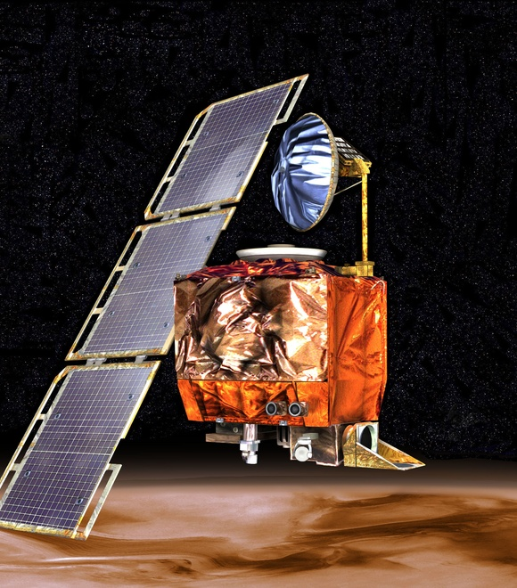
  

    Mars Climate Orbiter
    <a href="https://en.wikipedia.org/wiki/Mars_Climate_Orbiter" target="_blank">NASA / JPL / Wikipedia</a>
  

<!--
接下來，我們看三起載入工程史冊的慘痛失效案例。

第一起：名古屋空難。空中巴士 A300 因飛控電腦模式切換衝突，自動推力與飛行員手動抗衡，導致飛機失速墜毀，奪走 264 條生命。

第二起：NASA 火星氣候探測器。洛克希德馬丁團隊使用英制單位，NASA 團隊使用公制單位，未經轉換直接對接，探測器直接墜入火星大氣層燒毀。

第三起：阿利安五號火箭。僅僅因為將 64 位元浮點數強制轉型為 16 位元整數引發溢位，火箭升空 37 秒後空中爆炸，損失五億美元。

總結這張投影片，請記住這個核心觀念：缺少邊界檢查與介面合約，極微小的代碼缺陷就能引發毀滅性災難。
-->
---

### 觀念檢測：軟體危機 (CCQ 1)
<!-- id: ase-ch01-ccq1 -->

  

**為什麼 1968 年的「軟體危機」無法單純透過購買運算速度更快、記憶體容量更大的電腦硬體來解決？**

- **A.** 1960 年代末期電腦硬體製造與記憶體製程完全停滯，無法提供實質的運算效能提升。
- **B.** 危機本質上是系統規模與智力管理帶來的組織複雜度挑戰，更強大的硬體反而刺激並放大了系統規模。
- **C.** 當時的高階程式語言完全缺乏數學計算基底與編譯器記憶體動態配置能力。
- **D.** 早期的真空管與主機架構在物理特性上無法支援多終端機與遠端通訊網絡的共用協定。

  

  

    
  

<!--
現在是互動的觀念檢測時間！請大家拿出手機，掃描螢幕上的 QR Code 參與作答。

題目是：為什麼 1968 年的「軟體危機」無法單純透過購買運算速度更快、記憶體容量更大的電腦硬體來解決？

請看四個選項：
- A：電腦硬體製造與記憶體製程停滯。
- B：危機本質上是系統規模與智力管理帶來的組織複雜度挑戰，更強大的硬體反而刺激並放大了系統規模。
- C：程式語言缺乏數學計算基底。
- D：主機架構無法支援通訊網絡。

請大家根據剛才的討論，投下你的答案！

（解析：正確答案是 B。軟體危機的根源在於人類智力管理龐大系統複雜度的極限。硬體越快，系統規模越大，若缺乏工程方法，只會產生更巨大的災難。）

總結這張投影片，請記住這個核心觀念：系統複雜度是人類認知與組織管理的挑戰，單靠硬體效能升級只會放大缺陷。
-->
---

## 我們需要工程方法來開發軟體
* 何謂 **軟體 (Software)** ？
* 何謂 **工程 (Engineering)** ？
* 何謂 **軟體工程 (Software Engineering)** ？

<!--
我們翻到下一頁：我們需要工程方法來開發軟體。

很多人以為：既然電腦變快了，演算法變強了，問題不就解決了嗎？

答案是：完全不會。

硬體越強大，社會交付給軟體的責任越沉重。

如果沒有需求合約、架構隔離與自動化測試，我們只是更快地產出垃圾程式碼。

我們必須引進工程思維：防禦性設計、模組化邊界，以及全生命週期的嚴格管理。

總結這張投影片，請記住這個核心觀念：愈強大的運算環境，愈需要工程方法來駕馭指數級膨脹的系統複雜度。
-->
---
<!-- _class: lead -->
<!-- header: '1.3 何謂軟體？' -->

# **1.3 何謂軟體？超越原始碼的四大支柱**

> 「原始碼只是軟體冰山浮出水面的一角。程式、資料、文件與配置共同賦予系統真正的生命。」

<!--
現在我們開始單元 1.3：何謂軟體？超越原始碼的四大支柱。

許多初學者最容易犯的直覺誤解，就是將「軟體」等同於「程式碼」。然而在專業工程實踐中，原始碼僅僅佔了整體資產的一小部分。

根據 IEEE 的標準定義，軟體是由四個不可或缺的支柱共同構成：可執行的程式、資料結構、完整文件，以及運作程序手冊。

總結這張投影片，請記住這個核心觀念：專業的軟體是一項多維度的完整運作資產，絕非孤立的一堆程式碼檔案。
-->
---

## IEEE 對軟體的完整剖析

> **軟體 (IEEE 標準定義)：** 與電腦系統運作相關的電腦程式、程序，以及可能伴隨的相關文檔與資料。

* **1. 電腦程式 (Programs)：** 可執行的二進位檔案與原始碼 (Python, Java, C++, TypeScript)。
* **2. 資料與結構 (Data & Schemas)：** 資料庫綱要、設定檔、AI 模型權重（例如：Knight Capital 設定資料錯誤導致破產）。
* **3. 運作程序 (Operational Procedures)：** 部署腳本、備份策略、災害復原 SOP（例如：GitLab 備份復原程序失效）。
* **4. 文檔說明 (Documentation)：** 架構決策記錄 (ADR)、API 規格合約 (OpenAPI)、操作手冊（例如：Therac-25 缺乏文檔掩蓋並行缺陷）。

<!--
我們進入 1.3 小節：IEEE 對軟體的完整剖析。

國際電機電子工程師學會 (IEEE 610.12) 對軟體下了一個權威的定義。

軟體不僅是原始碼，它由四個同等重要的組件構成：

第一，Programs（電腦程式與設定腳本）；
第二，Data & Schemas（資料庫結構、初始配置與測試資料集）；
第三，Operational Procedures（安裝佈署指南、維運監控手冊與災難還原 SOP）；
第四，Documentation（需求規格書、架構圖與 API 使用文件）。

總結這張投影片，請記住這個核心觀念：軟體工程師交付的是完整運行的生態系統，而非僅僅一個代碼檔案。
-->
---

## 軟體冰山陷阱：超越看得見的原始碼

* **業餘者的盲點：**
  - 初學者與短視的管理者常誤將軟體等同於露出水面的冰山頂端——**程式（原始碼）**，並僅以寫了多少行程式碼 (LOC) 來衡量工作進度。
* **隱藏的現實（80% 以上潛藏於水面下）：**
  - 在正式生產系統中，超過 **80% 的工作量、系統複雜度與災難性事故**，皆源自水面下的資料、程序與文檔：
    - *Knight Capital（45 分鐘內損失 4.4 億美元）：* 核心程式運算正確，但因有缺陷的部署**程序**與過期的設定**資料**導致破產。
    - *GitLab 資料庫事故：* 線上服務程式運作良好，但缺乏驗證過的災害復原**程序**導致資料差點永久遺失。
    - *Therac-25 輻射事件：* 缺乏系統架構**文檔**，掩蓋了致命的並行競爭缺陷。
* *若缺乏這四大支柱的協同支撐，系統並不是「工程化軟體」——僅僅是一段脆弱的程式碼。*

<!--
請看這張「軟體冰山陷阱」示意圖。

一般人看軟體，只看見露出水面的 10%，也就是漂亮的 UI 和運行的原始碼。

但在水面之下，隱藏著 90% 的巨大冰山！

包括資料模型的遷移策略、維運團隊的操作流程，以及決定系統生死的文件與測試合約。

如果工程師忽視水面下的支柱，系統上線之日，就是撞上冰山沉船之時。

總結這張投影片，請記住這個核心觀念：水面下的資料、流程與文件若有缺陷，水面上的程式碼寫得再漂亮也注定崩潰。
-->
---

## 為何四大支柱必然要求「軟體生命週期 (SDLC)」？

> **核心領悟：** **「寫程式」** 是在一個下午敲出程式碼。**「軟體工程」** 則是在完整的 **軟體生命週期 (SDLC)** 中嚴謹治理這四大支柱。

* **1. 文檔 $\longleft→ 需求工程與架構設計：**
  - 程式碼只記錄了 *怎麼做 (How)*，而文檔（ADR、OpenAPI、需求規格）才記錄了 *為什麼這麼做 (Why)*。缺乏架構契約，長達數年的團隊協作與系統演化將寸步難行。
* **2. 程式 $\longleft→ 開發實作與自動化驗證：**
  - 寫出程式碼只是短暫的起點。軟體工程要求持續單元測試、CI/CD 驗證與持續重構，防止程式腐化並遏止技術債累積。
* **3. 資料與結構 $\longleft→ 狀態持久化與長期演化：**
  - 程式碼隨時可以重新發布，但資料必須留存數十年。生命週期治理要求嚴謹的綱要版本控管、向下相容性與無痛資料庫遷移工程。
* **4. 運作程序 $\longleft→ DevOps、自動部署與網站可靠性工程 (SRE)：**
  - 跑在 `localhost` 的程式只是玩具。工程化系統需要自動化部署管線、金絲雀發布 (Canary)、災難復原演練與全方位監控告警。

<!--
下一頁，我們探討四大支柱如何導出「軟體生命週期 (SDLC)」。

為什麼我們需要生命週期？因為這四大支柱不是同時完成的。

在需求階段，我們產出文件支柱；
在實作階段，我們產出程式碼與資料模型；
在佈署階段，我們建立維運程序；
在維護階段，我們持續演化這四者。

缺少 SDLC 的系統化管理，四大支柱就會彼此脫鉤，導致嚴重的技術債務。

總結這張投影片，請記住這個核心觀念：軟體生命週期 (SDLC) 是確保四大支柱在時間軸上持續協調同步的工程管理框架。
-->
---

## 為何四大支柱至關重要：以 YouBike 微笑單車為例

* **1. 程式（運算執行核心）：**
  - *智慧車柱鎖嵌入式韌體、手機 App、雲端後端微服務架構。*
  - 可靠執行即時借還車通訊協定、GPS 軌跡回傳與海量並行請求處理。
* **2. 資料與結構（系統單一信任源）：**
  - *車輛即時位置、車柱可用狀態、用戶悠遊卡/信用卡餘額與 ACID 租借紀錄。*
  - 資料遺失或同步失敗將導致「幽靈單車」、扣款錯誤與巨大營收損失。
* **3. 運作程序（系統韌性與營運）：**
  - *韌體 OTA 線上升級、車輛調度物流、交易斷線容錯切換與電池定期檢修流程。*
  - OTA 部署程序一旦失誤將導致數萬座戶外車柱變磚，需要極為昂貴的實體現場維修成本。
* **4. 文檔（跨團隊協作合約）：**
  - *OpenAPI 規格、MQTT 遙測通訊協議合約與硬體/軟體介面規格書。*
  - 避免硬體設備商、App 開發團隊與市府交通局後台系統在整合時發生對接災難。

<!--
讓我們看一個最貼近日常生活的實務案例：YouBike 2.0 微笑單車。

YouBike 能運作，仰賴四大支柱的完美協作：

第一，程式支柱：車機嵌入式系統、雲端調度 API，以及你手機上的行動 APP。
第二，資料支柱：即時車位狀態、使用者扣款紀錄與地理 GIS 圖資。
第三，作業程序支柱：調度員貨車補車 SOP、電量更換流程與扣款異常申訴處理。
第四，文件支柱：車柱通訊協定、金流對接規格與客服手冊。

若只寫好 APP 卻沒有調度程序，滿街都是無車可借或無位可還的窘境。

總結這張投影片，請記住這個核心觀念：大型系統的成功，永遠取決於四個支柱無縫接軌的整體工程營運。
-->
---

### 觀念檢測：軟體定義 (CCQ 2)
<!-- id: ase-ch01-ccq2 -->

  

**依據 IEEE 對「軟體 (Software)」的標準定義，下列何者不屬於軟體的範疇？**

- **A.** 可執行的電腦程式與原始碼檔案。
- **B.** 系統資料庫綱要與組態設定檔。
- **C.** CPU 運算處理器與實體記憶體硬體模組。
- **D.** 軟體安裝步驟與自動化維運部署程序。

  

  

    
  

<!--
又到了觀念檢測時間！請掃描 QR Code 參與作答。

題目是：依據 IEEE 對「軟體 (Software)」的標準定義，下列何者不屬於軟體的範疇？

請看選項：
- A：可執行的電腦程式與原始碼檔案。
- B：系統資料庫綱要與組態設定檔。
- C：中央處理器 (CPU) 晶片與實體記憶體單元。
- D：軟體安裝與佈署程序文檔。

請回想剛才介紹的四大支柱：程式、資料、程序、文檔。哪一個是實體硬體？

（解析：正確答案是 C。矽晶片、CPU 與記憶體屬於實體硬體；軟體指的是在其上運行的非實體指令、資料、操作程序與技術文檔。）

總結這張投影片，請記住這個核心觀念：硬體是承載運算的物理引擎，軟體則是包含程式、資料、程序與文檔的無形智力資產。
-->
---
<!-- _class: lead -->
<!-- header: '1.4 何謂工程？' -->

# **1.4 何謂工程？限制條件下的務實最佳化**

> 「科學家探索已存在的世界；工程師創造從未存在的世界。」  
> — *Theodore von Kármán*

<!--
歡迎來到單元 1.4：何謂工程？資源限制、時間壓迫與務實最佳化。

是什麼將單純的程式設計師昇華為工程師？科學家追求的是不計代價的純粹理論真理；而工程師的使命，則是在嚴苛的時間、預算、人力與物理現實限制下解決真實世界的問題。

在這一節中，我們將探討工程的核心方程式：如何在無法兩全的限制條件中，透過權衡與取捨做出最務實的架構抉擇。

總結這張投影片，請記住這個核心觀念：工程是在真實世界的重重限制下，進行務實權衡與最佳化求解的嚴謹藝術。
-->
---
<!-- _class: full-image-slide -->

  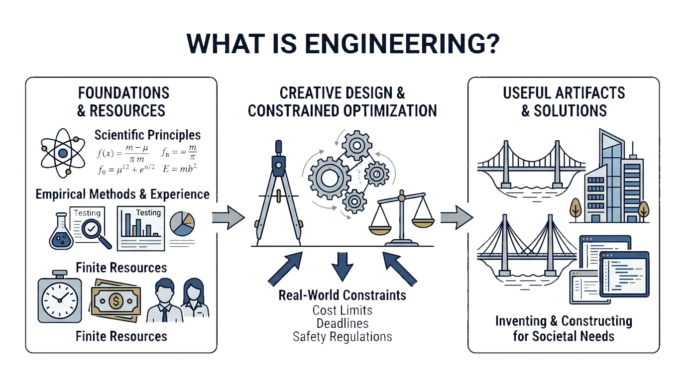

<!--
請看螢幕上這張動人的肖像與名言。

這是著名航空工程大師馮·卡門 (Theodore von Kármán) 的傳世名言：

「科學家探索既有的世界；工程師創造未曾存在的事物。」

這句話精準劃分了科學與工程的本質界線。

科學家追求純粹真理；工程師則在現實約束下，將知識化為改善人類生活的造物。

總結這張投影片，請記住這個核心觀念：科學在於探索與發現，工程在於在現實約束中創造可運作的解決方案。
-->
---
<!-- header: '1.4 何謂工程？' -->

## 何謂工程？

> **工程 (Engineering)：** 創造性地應用科學原理、經驗方法與實務經驗，在**現實世界的約束條件**與**有限資源**下，發明、設計與建造出實用產物。

* **專業工程實踐的三大核心特徵：**
  - **1. 系統化 (Systematic)：** 遵循結構化、可重複的流程與工程方法論，而非隨意的手工嘗試。
  - **2. 紀律化 (Disciplined)：** 嚴格遵循業界標準規範、同儕代碼審查與安全餘裕管理。
  - **3. 可量化與可量測 (Quantifiable & Measurable)：** 透過實證客觀指標（延遲、可靠度、測試覆蓋率、可用時間）評估系統穩定度。
* **約束條件下的工程實踐：**
  - 工程絕非處於理想真空環境——它是**「約束條件下尋求最佳化 (Constrained Optimization)」**的實務藝術，在有限的時間、預算與資源中達成最高價值。

<!--
我們進入 1.4 小節：何謂工程？

根據工程認證委員會 (ABET) 的權威定義：

工程是將數學與自然科學知識，透過判斷與實踐，應用於經濟且安全地利用自然資源，造福人類社會的專業門道。

工程有三大標誌：
第一，目的導向：必須解決現實問題；
第二，經濟約束：不能不惜代價，必須在有限預算與時程內達成；
第三，責任承擔：必須保證安全性與可靠性。

總結這張投影片，請記住這個核心觀念：工程是科學的實用化，是在預算、時間與安全責任的約束下解決具體問題。
-->
---

## 工程天平：現實約束 vs. 有限資源

* **約束條件 (Constraints — 外部限制)：**
  - **時程 (Time)：** 嚴格的產品發布期限、市場進入窗口。
  - **預算 (Budget)：** 研發薪資、雲端託管帳單、第三方軟體授權費。
  - **技術與平台 (Technology)：** 既有遺留資料庫相容性、行動作業系統限制。
  - **法律與規範 (Regulations)：** GDPR 個人資料保護、HIPAA 醫療隱私、PCI-DSS 金融支付標準。
* **可用資源 (Resources — 內部資產)：**
  - **人力資源 (Human)：** 開發團隊技術能力、QA 測試工程師、UX 設計師。
  - **工具與基礎建設 (Tools)：** 雲端運算節點、CI/CD 自動化管線、開源成熟函式庫。
  - **領域知識 (Domain Knowledge)：** 對使用者工作流程與商業邏輯的深刻理解。

<!--
請看這張「工程天平」圖：現實約束 vs. 有限資源。

所有工程師每天都在這兩端進行拔河。

天平的一端是約束：交期限制、成本上限、效能指標、法規要求。
天平的另一端是資源：有限人力、有限伺服器算力、有限的時間。

在工程的世界裡，我們追求的不是抽象的「最佳解 (Optimizing)」，而是符合現實約束的「滿意解 (Satisficing)」。

總結這張投影片，請記住這個核心觀念：工程的核心藝術在於取捨：在有限資源與嚴苛約束下，找出足夠好的實用平衡點。
-->
---

## 實務案例：醫療新創公司 MVP

* **面臨挑戰：** 需在 6 個月時程與僅僅 8 萬美元的有限預算內，上線一款符合 HIPAA 醫療隱私規範的遠距醫療 App。
* **工程權衡的務實決策：**
  1. **範疇排序 (Scope Prioritization)：** MVP 僅專注於核心視訊看診與預約流程；保險理賠與繁複報銷功能延後實作。
  2. **跨平台開發框架：** 採用 Flutter/React Native 單一程式碼基底（相較於分別開發雙平台原生 App，節省約 40% 人力）。
  3. **託管後端服務：** 採用具 HIPAA 認證的雲端 BaaS 服務，免去自建機房與繁瑣底層維運。
  4. **自動化 CI/CD：** 在 Pull Request 上執行自動化單元測試，將人工 QA 成本降至最低。
* **為何不追求理論上「最完美」的技術方案？**
  - 自行開發純原生雙平台 App 與自架微服務在技術極限上更優越，但會直接違反約束（預算超支、嚴重逾期），導致公司倒閉。
  - **滿意化策略 (Satisficing)：** 在嚴格約束下，透過務實的技術權衡找出「足夠好且能成功運作」的解答。
  - **工程必然要求：** 我們需要 **需求工程 (Requirements Engineering)** 來在有限預算下談判界定系統範疇，並需要 **系統設計 (System Design)** 來進行架構權衡，滿足現實世界的嚴格約束。

<!--
我們來看一個實際的工程取捨案例：醫療新創公司的 MVP。

一家醫療新創公司要在六個月內上線遠距掛號系統，否則資金就會斷絕。

工程團隊該如何取捨？

他們可以妥協什麼？可以暫緩微服務架構，先用穩定的 Monolith 單體架構；可以暫緩推薦演算法。
但他們絕不能妥協什麼？病患隱私安全與 HIPAA 法規合規！

這就是工程決策：辨識核心邊界，守住關鍵安全底線，同時快速交付商業價值。

總結這張投影片，請記住這個核心觀念：工程取捨有其邊界：可以簡化非核心功能，但絕不能犧牲法規、安全性與架構底線。
-->
---
<!-- _class: lead -->
<!-- header: '1.5 何謂軟體工程？' -->

# **1.5 何謂軟體工程？四大核心活動與知識體系**

> 「軟體工程是將編程跨越時間、透過團隊協同、並在動態限制下持續推進的工程學科。」  
> — *Titus Winters (Google 軟體工程論)*

<!--
我們現在來到本學科的核心定義，單元 1.5：何謂軟體工程？

正如 Google 軟體架構領導層所深刻總結的：編程是寫出代碼，而軟體工程則是讓代碼在數十年跨團隊、跨庫版本更迭與業務變遷中依然健壯運作。

我們將剖析軟體工程的四大通用核心活動——規格、開發、驗證與演進，以及支撐這四大活動的深厚知識體系 (BOK)。

總結這張投影片，請記住這個核心觀念：軟體工程的核心使命，是管理跨越時間維度、組織規模與動態變化的複雜度。
-->
---
<!-- header: '1.5 何謂軟體工程？' -->
<!-- _class: full-image-slide -->

  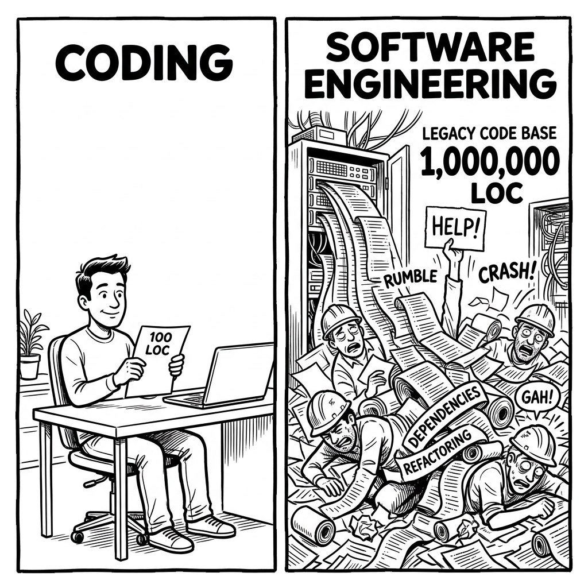

<!--
請看這張對比圖：個人業餘編程 vs. 企業級軟體工程。

一個人寫作業或黑客松專案：
你想寫什麼語言就寫什麼，不用寫註解，跑得動就及格，寫完就可以丟掉。

但企業級軟體工程完全不是這回事！
你必須與數十名工程師協作，代碼要活五年、十年；
要有持續整合、要有程式碼審查、要通過嚴格安全審計。

總結這張投影片，請記住這個核心觀念：個人編程關注「現在能跑」；企業級軟體工程關注「未來五年十人接手時依然能穩定運轉」。
-->
---

## 何謂軟體工程？

> **軟體工程 (IEEE 610.12)：** 將系統化、紀律化、可量化的方法應用於軟體的開發、運作與維護；亦即將工程思維落實於軟體之中。

* **1. 工程實踐紀律（系統化、紀律化、可量化）：**
  - 貫徹科學嚴謹性、業界工程標準與實證度量指標，徹底取代不可靠的手工拼裝模式。
* **2. 全生命週期範疇（開發、維運、維護）：**
  - **開發 (Development)：** 涵蓋早期的需求規格獲取、系統架構設計、程式撰寫與品質驗證。
  - **維運與維護 (Operation & Maintenance)：** 確保上線後 7x24 小時的運行穩定性、效能優化與隨時間演進的重構適應力。

<!--
我們進入 1.5 小節：何謂軟體工程？

讓我們來看 IEEE 610.12 的正式權威定義。

軟體工程是：
「將系統化、規範化、可量化的方法，應用於軟體的開發、運作與維護；也就是將工程化方法應用於軟體。」

請注意這三個詞：
系統化（有步驟流程）、規範化（有標準遵循）、可量化（用數據衡量品質與進度）。

總結這張投影片，請記住這個核心觀念：軟體工程是將系統化、規範化與可量化的科學工程原則，貫徹於整個軟體生命週期。
-->
---
<!-- _class: full-image-slide -->

  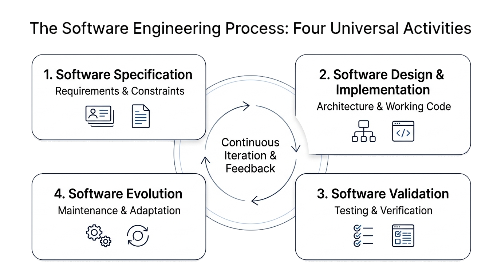

<!--
請看這張圖：軟體工程四大通用核心活動。

不論你用的是瀑布模型、敏捷 Scrum，還是現代 AI 輔助流程，所有軟體專案都逃不過這四大核心活動：

第一，規格說明 (Specification)；
第二，設計與實作 (Design & Implementation)；
第三，驗證與確認 (Validation)；
第四，軟體演化 (Evolution)。

讓我們逐一剖析這四大活動。

總結這張投影片，請記住這個核心觀念：規格、實作、驗證與演化，是貫穿所有開發方法論的四大通用生命週期活動。
-->
---

## 活動一：軟體規格說明 (Software Specification)

> **明確定義系統「必須做什麼」以及系統運作時所受到的各項約束條件。**

* **核心使命：**
  - 在動手寫程式之前，精確發掘、協商並確立利害關係人的真實需求與系統邊界。
* **生命週期關鍵子活動：**
  - **可行性研究 (Feasibility Study)：** 評估專案在技術與商業經濟上是否可行？
  - **需求發掘與分析 (Requirements Elicitation & Analysis)：** 發掘用戶真正的痛點與需求。
  - **規格撰寫與驗證 (Specification & Validation)：** 將需求轉化為清晰、無歧義且可驗證的合約文件。
* **核心產出物：** 使用者故事 (User Stories)、驗收準則 (Given-When-Then)、需求規格書 (SRS)、使用案例 (Use Cases)。
* **關鍵風險：**
  - 打造出完全錯誤的產品！線上營運階段才發現的需求缺陷，其修復成本通常高達規格階段的 **100 倍以上**。

<!--
首先看活動一：軟體規格說明 (Requirements Specification)。

這個階段要回答的問題是：「我們究竟要建造什麼？」

包括需求獲取、功能性需求（系統能做什麼）與非功能性需求（效能、安全性、可用性）。

更關鍵的是制定明確的「驗收準則 (Acceptance Criteria)」。

如果規格定義模糊，後續所有代碼寫得再快，都只是在加速朝錯誤的方向狂奔。

總結這張投影片，請記住這個核心觀念：規格說明是專案的航向燈塔；定義錯誤的需求，比寫出有臭蟲的程式碼更加致命。
-->
---

## 活動二：軟體設計與實作 (Design & Implementation)

> **將抽象的需求規格，轉換為可執行的軟體結構與原始程式碼。**

* **核心使命：**
  - 將概念性規格轉變為具備高強韌性、高可維護性與高效能表現的實體軟體系統。
* **生命週期關鍵子活動：**
  - **架構設計 (Architectural Design)：** 規劃整體系統骨架、服務切割與子系統邊界。
  - **介面與資料塑模 (Interface & Data Modeling)：** 制定模組化 API 通訊契約與資料庫綱要。
  - **元件詳細設計與編程 (Component Design & Coding)：** 撰寫具備高度可測性與簡潔的邏輯演算法。
* **核心產出物：** 架構決策記錄 (ADR)、實體關聯圖 (ERD)、OpenAPI 規格、高品質 Clean Code。
* **關鍵風險：**
  - 義大利麵式混亂架構、強烈模組耦合與失控的技術債，導致未來任何微小修改都極為昂貴甚至寸步難行。

<!--
第二個活動：軟體設計與實作 (Design & Implementation)。

這個階段回答：「我們該如何具體打造它？」

設計著眼於高層次的軟體架構，例如分層式架構、微服務、SOLID 物件導向設計原則。

實作則是將架構轉換為可執行的原始碼，並遵守命名規範與安全防護。

核心目標是追求「高內聚、低耦合」，讓系統具備高度的模組化能力。

總結這張投影片，請記住這個核心觀念：優良的架構設計能控制系統複雜度，讓未來的修改與擴充輕鬆自如。
-->
---

## 活動三：軟體驗證與確認 (Software Validation)

> **檢驗軟體是否完全符合其規格說明，並確認其是否真正滿足客戶的實際需求。**

* **品質的雙重支柱 (Boehm)：**
  - **Verification (驗證)：** *「我們是否有把產品做對？」*（嚴格符合設計與規格要求）。
  - **Validation (確認)：** *「我們是否有做對產品？」*（真正解決客戶的實質問題）。
* **生命週期關鍵子活動：**
  - **單元與元件測試 (Unit & Component Testing)：** 隔離單一模組並徹底檢驗邊界條件。
  - **整合與系統測試 (Integration & System Testing)：** 驗證服務間的 API 呼叫契約與端對端完整流程。
  - **驗收測試與同儕審查 (Acceptance Testing & Code Review)：** 團隊審查把關與使用者最終簽核。
* **核心產出物：** 自動化測試套件 (PyTest, JUnit)、CI 管線建置報告、程式碼覆蓋率指標。
* **關鍵風險：**
  - 線上系統全面崩潰、災難性資安漏洞外洩、核心資料損毀與沉重的法律賠償責任。

<!--
第三個活動：軟體驗證與確認 (Validation & Verification)。

這回答了兩個經典問題：
Verification：「我們是否有把系統做對？（是否符合規格）」
Validation：「我們是否有做對的系統？（是否滿足使用者真正需求）」

這包含了單元測試、整合測試、端對端測試，以及自動化測試金字塔。

唯有通過嚴格驗證，軟體才能獲得投入生產環境的信任。

總結這張投影片，請記住這個核心觀念：驗證確認是軟體質量的防波堤；未經測試驗證的代碼，不具備投入生產的資格。
-->
---

## 活動四：軟體演化 (Software Evolution)

> **對已上線運作的軟體進行修改與調適，以持續因應改變中的商業環境與使用者需求。**

* **軟體經濟學的殘酷現實：**
  - 真實世界的軟體永遠不會真正「寫完」。軟體生命週期總成本中有 **60% 至 80% 以上** 發生在初次上線後的演化與維護階段！
* **維護的四大經典型態：**
  - **改正性維護 (Corrective)：** 修復線上營運中爆發的潛在缺陷、崩潰 Bug 與邊界異常。
  - **適應性維護 (Adaptive)：** 因應雲端環境升級、行動作業系統改版或新法規遵循而進行調整。
  - **完善性維護 (Perfective)：** 提升系統吞吐量、降低延遲、改善 UI 互動體驗並擴充新業務功能。
  - **預防性維護 (Preventive)：** 持續重構程式碼結構以消除技術債，防患於未然。
* **核心產出物：** 資料庫遷移腳本 (Migration Scripts)、發布日誌 (Release Notes)、事故檢討報告 (Post-Mortems)。
* **關鍵風險：**
  - 軟體架構嚴重腐化、技術堆疊遭時代淘汰、爆發不可防範的安全漏洞，最終被迫全面報廢。

<!--
第四個活動：軟體演化 (Software Evolution)。

系統上線不是結束，而是漫長演化的開始。

在真實商業世界中，軟體超過 70% 的總成本發生在上線後的維護階段！

演化包括修復未知的缺陷、配合業務需求新增功能、改善效能，以及重構技術債務。

軟體如果不持續適應環境演化，就會逐漸老化邁向死亡。

總結這張投影片，請記住這個核心觀念：軟體就像有生命的有機體，必須透過持續重構與適應性維護，才能抵抗架構熵增。
-->
---

### 觀念檢測：核心活動 (CCQ 3)
<!-- id: ase-ch01-ccq3 -->

  

**下列哪一組選項正確地將具體的軟體工程實踐行為，對應到其所屬的四大通用核心活動？**

- **A.** 與利害關係人進行訪談以梳理使用者故事 → 軟體規格說明 (Specification)
- **B.** 撰寫自動化單元測試以模擬資料庫回應 → 軟體設計與實作 (Design & Implementation)
- **C.** 重構資料庫綱要以提升查詢執行效能 → 軟體驗證 (Validation)
- **D.** 將老舊的第三方支付 API 抽換為全新閘道服務 → 軟體規格說明 (Specification)

  

  

    
  

<!--
觀念檢測時間！請掃描螢幕上的 QR Code。

題目是：下列哪一組選項正確地將具體的軟體工程實踐行為，對應到其所屬的四大通用核心活動？

請看選項：
- A：訪談利害關係人並撰寫使用者故事 → 軟體規格說明 (Specification)
- B：編寫單元測試用例 → 軟體設計與實作 (Design & Implementation)
- C：重構資料庫綱要結構 → 軟體驗證與確認 (Validation)
- D：替換第三方金流 API → 軟體規格說明 (Specification)

請回顧四大活動：規格說明、設計實作、驗證確認與演化。

（解析：正確答案是 A。訪談利害關係人確立需求正是規格說明的核心定義；編寫測試屬於驗證確認；重構屬於演化。）

總結這張投影片，請記住這個核心觀念：清楚釐清四大核心活動，能幫助你在專案各階段精準配置工程資源與檢驗標準。
-->
---
<!-- _class: full-image-slide -->

  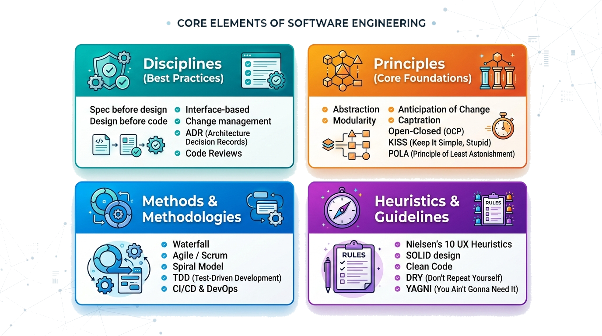

<!--
請看螢幕上這張結構圖：SWEBOK 知識體系的基石。

軟體工程之所以能成為一門成熟的專業，仰賴三大支柱的支撐：

最底層是「工程原則 (Principles)」；
中間層是「系統化方法 (Methods)」；
最上層是「現代自動化工具 (Tools)」。

缺少原則的工具只是盲目操作；有了底層原則的指導，工具才能發揮真正的工程力量。

總結這張投影片，請記住這個核心觀念：工具會隨技術潮起潮落，但底層的工程原則與架構思維歷久彌新。
-->
---

## 軟體工程知識體系 (Body of Knowledge, BOK)

* 軟體工程奠基於一套結構化的 **知識體系 (BOK)**——匯集了經過時間驗證的 **工程經驗法則 (Heuristics)** 與核心原則，旨在克服規模複雜度：
  - **實踐紀律 (Disciplines)：** 團隊必須遵守的專業常規與操作規範（*「先做規格再做設計」、「先做設計再寫程式」、架構決策記錄、程式碼同儕審查*）。
  - **核心原則 (Principles)：** 歷久彌新的軟體本質基石（*抽象化、模組化、關注點分離、預應變更*）。
  - **方法與方法論 (Methods & Methodologies)：** 結構化且具可重複性的開發流程框架（*敏捷/Scrum、極限編程、測試驅動開發 TDD、CI/CD 管線、DevOps*）。
  - **經驗法則與指引 (Heuristics & Guidelines)：** 數十年實務淬鍊而成的直覺法則與設計準則（*SOLID 原則、Clean Code、KISS、DRY、YAGNI、最少驚訝原則 POLA*）。

<!--
我們來看國際公認的權威知識體系：SWEBOK (Software Engineering Body of Knowledge)。

由 IEEE Computer Society 編纂，定義了軟體工程專業人員必須掌握的 15 大核心知識領域 (Knowledge Areas)。

從需求、架構、建構、測試，一路涵蓋到維護、配置管理、工程經濟學與專業倫理。

這份大綱向世界證明：軟體工程不是隨意寫寫腳本，它擁有與機械、土木等傳統工程並駕齊驅的深厚知識體系。

總結這張投影片，請記住這個核心觀念：SWEBOK 為全球軟體工程專業提供了共同的術語標準、專業邊界與能力成熟度基底。
-->
---

## 將知識體系貫徹於四大核心活動

* 知識體系絕非空洞理論——它具體指引了**四大生命週期通用活動**的落實方式：
* **1. 軟體規格說明（需求）：**
  - *實踐紀律與核心原則：* **「先規格後設計」**、抽象化、關注點分離。
  - *經驗法則：* **YAGNI**（避免過早實作臆測需求）、明確無歧義的驗收準則。
* **2. 軟體設計與實作：**
  - *實踐紀律與核心原則：* **「先設計後編程」**、模組化、資訊隱藏、架構決策記錄 (ADR)。
  - *經驗法則：* **SOLID 原則**、整潔架構 (Clean Architecture)、GoF 設計模式、**DRY**、**KISS**。
* **3. 軟體驗證（測試與品管）：**
  - *實踐紀律與核心原則：* **TDD 測試驅動**、獨立驗證機制、強制性同儕代碼審查 (PR Review)。
  - *經驗法則：* 邊界值分析、深度防禦機制、自動化回歸測試安全網。
* **4. 軟體演化（維護與重構）：**
  - *實踐紀律與核心原則：* **預應變更 (Anticipation of Change)**、語意化版本號 (SemVer)、技術債務追蹤。
  - *經驗法則：* **童子軍法則**（*隨時讓程式碼比你發現它時更乾淨*）、零停機無痛滾動發布。

<!--
下一頁，我們來看知識體系如何貫徹於四大核心活動。

這是一張對應矩陣：
規格說明活動對應 SWEBOK 的需求工程；
設計與實作對應軟體架構與軟體建構；
驗證活動對應軟體測試與軟體品質保證；
演化活動對應軟體維護與組態管理 (SCM)。

這四大活動與知識體系相互扣合，構成了我們整個學期的學習地圖。

總結這張投影片，請記住這個核心觀念：四大核心活動是骨骼，SWEBOK 的專業知識是肌肉，兩者結合才能打造健壯的軟體系統。
-->
---

## 原則為何重要：破解軟體常見迷思

> **當工程原則遭到忽視，盲目的直覺往往會導致代價極為昂貴的錯誤假設。**

* **迷思 1：「專案進度落後了——趕快加派 5 位工程師進來趕工！」**
  - *違反原則：* **模組化與通訊邊界限制**。
  - *真實法則 (布魯克斯法則 Brooks's Law)：* 在已延誤的專案中增加人手只會使專案更加延誤，因溝通路徑呈 $O(n^2)$ 爆炸性暴增。
* **迷思 2：「軟體是數位化的，所以在開發後期修改需求非常便宜。」**
  - *違反原則：* **「先規格後設計」與架構耦合控制**。
  - *真實法則：* 後期變更將衝擊資料庫綱要、破壞 API 契約與既有測試，修復成本呈指數級劇增至 **100 倍**。
* **迷思 3：「把寫程式外包出去，我們內部就不需要懂技術的工程管理。」**
  - *違反原則：* **軟體冰山（資料、程序與文檔）**。
  - *真實法則：* 缺乏內部架構治理與程序掌控的裸程式碼，只會製造無法維護的巨大技術債務。

<!--
接下來，我們要來破解軟體開發常見的四大迷思。

迷思一：「專案進度落後了？多找幾個人來趕工不就解決了！」
真相是布魯克斯法則：向進度落後的專案增加人手，只會讓專案更落後。

迷思二：「軟體本來就很軟，客戶隨時想改需求都可以改！」
真相是變更成本曲線：愈晚修改，成本呈幾何級數飆升。

迷思三：「程式碼寫完且編譯通過，我們的工作就結束了！」
真相是 70% 的工作與成本發生在上線後的維護階段。

迷思四：「只要導入最新最潮的 AI 工具，專案就一定會成功！」
真相是好工具救不了混亂的流程與失控的架構。

總結這張投影片，請記住這個核心觀念：破除常識性的盲目直覺，以實證工程法則看待人力、時程與工具。
-->
---
<!-- _class: full-image-slide -->

  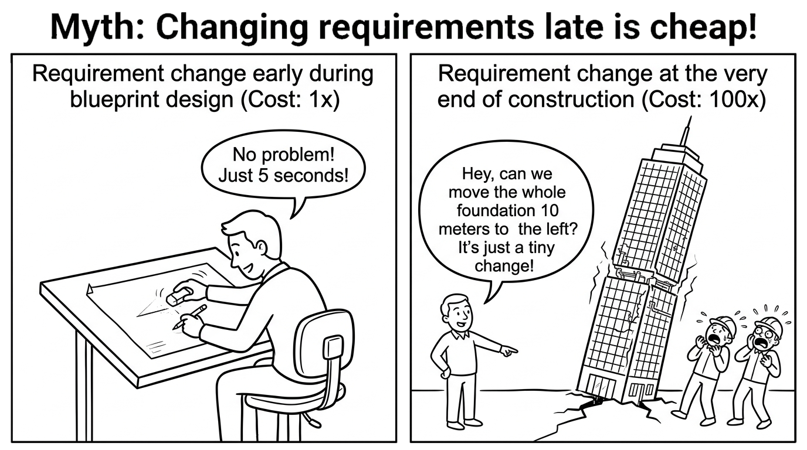

<!--
請大家看這張極其著名的圖表：變更成本攀升曲線 (Cost-of-Change Curve)。

這是由軟體工程大師 Barry Boehm 等人提出的實證法則。

如果在需求階段發現並修改一個錯誤，成本是 1 倍；
在架構設計階段修改，成本上升到 3 到 5 倍；
在寫程式階段修改，上升到 10 倍；
如果一路拖到系統上線在生產環境爆發，修改成本可能飆升 50 到 100 倍以上！

因為這時你必須修補資料庫、緊急發布補丁、面對客戶訴訟與商譽損失。

總結這張投影片，請記住這個核心觀念：愈早發現並修正錯誤，成本愈便宜；前期嚴謹的規格與測試，是最高回報率的投資。
-->
---

### 觀念檢測：布魯克斯法則 (CCQ 4)
<!-- id: ase-ch01-ccq4 -->

  

**某個軟體專案目前落後進度 3 週，距離正式交付期限僅剩 2 週。專案經理決定緊急招募 4 位初階程式設計師加入以期加速進度。根據「布魯克斯法則 (Brooks's Law)」，最可能的結果是什麼？**

- **A.** 專案將因此提前 1 週順利交付。
- **B.** 專案進度將進一步嚴重延宕，因為資深工程師必須耗費寶貴時間來指導與培訓新人。
- **C.** 既有開發人員的產出效率將立刻提升一倍。
- **D.** 團隊內部的溝通複雜度將維持不變。

  

  

    
  

<!--
觀念檢測時間！請掃描 QR Code 參與作答。

題目是：某專案落後進度 3 週，距離交付僅剩 2 週。專案經理決定緊急招募 4 位初階程式設計師加入。根據「布魯克斯法則」，最可能的結果是什麼？

請看選項：
- A：專案提前一週交付。
- B：專案進度進一步惡化延遲，因為資深工程師必須分心培訓新人。
- C：開發速度翻倍。
- D：溝通成本維持不變。

請思考團隊溝通成本與新人培訓對生產力的衝擊！

（解析：正確答案是 B。布魯克斯在《人月神話》中提出經典名言：「為落後的專案增加人手，只會讓它更加落後。」新人的溝通負擔與培訓會消耗資深人員的時間。）

總結這張投影片，請記住這個核心觀念：向落後的專案增派人手只會適得其反，適度縮減範疇才是解決延期的正道。
-->
---

### 觀念檢測：設計原則 (CCQ 5)
<!-- id: ase-ch01-ccq5 -->

  

**一個電商「訂單處理模組」同時直接處理 HTTP 請求解析、執行信用卡交易、執行 SQL 資料庫查詢，並動態組裝 HTML 收據郵件。此設計最嚴重違反了哪項核心設計原則？**

- **A.** 關注點分離 (Separation of Concerns)：多項互不相干的業務職責緊密糾纏在單一模組中。
- **B.** YAGNI 原則：在客戶尚未提出明確商業需求前，過早實作臆測的未來擴充功能。
- **C.** 布魯克斯法則 (Brooks's Law)：對該訂單模組增加工程人手導致團隊溝通成本呈指數上升。
- **D.** 預應變更 (Anticipation of Change)：系統設定與業務規則被硬編碼寫死在編譯二進位檔中。

  

  

    
  

<!--
接著進行下一題觀念檢測！請掃描螢幕上的 QR Code。

題目是：一個電商「訂單處理模組」同時直接處理 HTTP 請求、信用卡交易、SQL 查詢並寄送收據郵件。此設計最嚴重違反了哪項核心原則？

請看選項：
- A：關注點分離 / 單一職責原則 (Separation of Concerns)
- B：YAGNI (你不會需要它)
- C：布魯克斯法則
- D：預期變更原則

請看這一個模組同時包辦了四種完全不同維度的任務！

（解析：正確答案是 A。關注點分離原則要求每個模組只專注於單一核心職責。將網路傳輸、商業金流、資料庫與郵件糾纏在一起，極易引發連鎖崩潰。）

總結這張投影片，請記住這個核心觀念：關注點分離是模組化設計的基石，確保修改單一功能不會意外破壞其他無關邏輯。
-->
---

## 規模化落實工程紀律：現代自動化工具鏈

> **工程師無法單靠意志力貫徹紀律——現代工具鏈將知識體系自動化為剛性防線。**

* **版本控制 (Git) → *落實團隊協作與審查紀律*：** 分支治理策略、PR 嚴格審核把關、版本可追溯性。
* **CI/CD 自動化管線 (GitHub Actions) → *落實持續驗證紀律*：** 提交自動觸發編譯、自動測試與程式碼風格檢驗。
* **靜態代碼分析 (SonarQube) → *落實整潔代碼與資安紀律*：** 主動掃描代碼異味 (Code Smells) 與 CVE 已知安全漏洞。
* **自動化測試框架 (PyTest, Playwright) → *落實品質標準紀律*：** 單元、整合與 E2E 端對端全方位防護網。
* **系統可觀測性 (OpenTelemetry, APM) → *落實軟體演化反饋*：** 即時線上效能遙測、分散式追蹤與異常告警。

<!--
我們來看現代軟體工程如何規模化落實紀律：現代自動化工具鏈。

光靠嘴巴說要遵循規範是沒用的，工程師也是人，會疲累會疏忽。

現代工程組織透過自動化流水線來守門：
Git 進行精細的分支管理與 Pull Request 審查；
CI/CD 自動觸發單元測試與端對端整合；
SonarQube 與靜態分析工具即時抓出資安弱點與代碼壞味道；
Docker 容器保證環境一致性。

總結這張投影片，請記住這個核心觀念：紀律不靠口頭道德要求，而是靠自動化 CI/CD 工具鏈築起滴水不漏的品管防線。
-->
---
<!-- _class: lead -->
<!-- header: '1.6 軟體品質模型' -->

# **1.6 何謂軟體品質？ISO/IEC 25010 國際標準**

> 「品質是對特定人而言的價值。若系統毫無錯誤但沒有人願意使用，它的品質就是零。」  
> — *Jerry Weinberg*

<!--
歡迎來到單元 1.6：何謂軟體品質模型？現代 ISO/IEC 25010 標準。

我們該如何量化衡量一套軟體是否「優秀」？如果軟體功能完全正確，但動輒遭受駭客入侵、效能慢如蝸牛或根本無法維護，它依然是失敗的產品。

在這一節中，我們將深入研讀當代權威的 ISO 25010 產品品質架構，全面解析八大品質維度及其彼此之間的權衡取捨。

總結這張投影片，請記住這個核心觀念：軟體品質具有多元面向；卓越的工程實踐必須兼顧功能正確性與各項非功能性品質特徵。
-->
---
<!-- _class: full-image-slide -->

  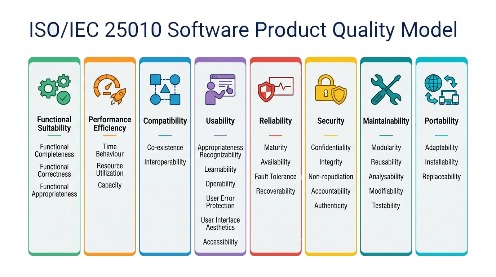

<!--
請看螢幕上這張結構圖：ISO/IEC 25010 軟體產品品質模型。

我們常聽到大家說：「這套軟體品質很好！」

但「品質好」究竟代表什麼意思？
僅僅是「沒有 Bug」嗎？

當然不是！ISO 國際標準組織給出了科學的量化框架。

讓我們翻到下一頁，正式解構品質模型。

總結這張投影片，請記住這個核心觀念：軟體品質不是主觀的感覺，而是具備國際標準的多維度量化工程體系。
-->
---
<!-- header: '1.6 軟體品質模型' -->

## 何謂品質與品質模型？

> **軟體品質 (Software Quality)：** 軟體產品在特定使用條件下，滿足利害關係人明示與隱含需求的程度。

* **何謂軟體品質？（超越「沒有 Bug」）：**
  - 初學者常誤以為「能在筆電上編譯執行、沒有崩潰」就是高品質。
  - 真實品質是多維度的：軟體可能沒有立即報錯，但在架構上極難維護、缺乏安全性、運作遲緩或極為難用。
  - 同時涵蓋**外部品質**（使用者感知的流暢度、可靠度與操作體驗）與**內部品質**（程式碼模組化、可讀性、技術架構與測試覆蓋率）。
* **何謂軟體品質模型？：**
  - **結構化多維度分類體系：** 將抽象的「品質」拆解為具體的**特徵**、**子特徵**與**可量測的客觀指標**。
  - **明確的工程合約：** 將模糊的商業期許（*「系統要快又安全」*）轉化為可測試的量化指標（*$p99 < 100\text{ms}$、零高風險漏洞*）。
  - **架構決策與權衡指南：** 指引團隊在衝突需求中做出明確取捨（例如：*安全性重於搶先上市*，或*可攜性重於極致效能*）。

<!--
我們進入 1.6 小節：何謂品質與品質模型？

品質可以分成兩個大層面：

外部品質 (External Quality)：使用者看得到的。系統運算快不快？介面好不好用？會不會當機？
內部品質 (Internal Quality)：維護者看得到的。程式碼結構乾不乾淨？架構有沒有模組化？好不好除錯？

內部品質不良，短時間內使用者或許沒察覺，但半年後它會引發嚴重的架構腐化，最終全面爆發成為外部品質的災難。

總結這張投影片，請記住這個核心觀念：內部品質是外部品質的因，外部品質是內部品質的果；忽視內部架構品質，外部崩潰只是時間問題。
-->
---

## 現代標準：ISO/IEC 25010 (SQuaRE)

> **ISO/IEC 25010（軟體產品品質需求與評估標準，SQuaRE）：全球公認用於規格化與客觀評估軟體品質的現代標竿框架。**

* **核心特色與現代架構：**
  - **完整八大特徵分類體系：** 全面涵蓋功能適用性、效能效率、相容性、易用性、可靠性、資訊安全、可維護性與可攜性。
  - **將資訊安全 (Security) 列為第一級支柱：** 獨立確立機密性、完整性、不可否認性、責任追溯性與真實性要求。
  - **高度重視相容性與互通性：** 在現代分散式、雲端與微服務環境下，將多系統和平共存與標準化 API 資料交換視為關鍵要求。
* **雙重品質評估視角模型：**
  - **產品品質模型 (Product Quality Model)：** 針對系統內在的 8 大技術特徵進行結構化檢驗（供架構師、開發者與 QA 評估）。
  - **使用品質模型 (Quality in Use Model)：** 評估真實環境中對人類終端使用者的實際成效（*有效性、效率、滿意度、免於風險度、環境涵蓋度*）。

<!--
來看現代品質的黃金標準：ISO/IEC 25010 (SQuaRE)。

它將軟體產品品質劃分為八大核心特徵 (Characteristics)。

這八大特徵涵蓋了系統在運行時與靜態維護時的所有維度。

學習這個模型，能讓工程師在跟客戶開會時，精準指出非功能性需求，不再停留在模糊的「要快、要穩」。

讓我們分成兩頁，逐一認識這八大特徵。

總結這張投影片，請記住這個核心觀念：ISO 25010 提供了一套專業工程語言，用來精準定義與評估軟體的非功能性需求。
-->
---

## ISO 25010：產品品質八大特徵 (1/2)

* **1. 功能適合性 (Functional Suitability)：** *功能滿足明確與隱含需求的程度。*
  - *關鍵子屬性：* **完整性 (Completeness)**、**正確性 (Correctness)**、**適切性 (Appropriateness)**。
* **2. 效能效率 (Performance Efficiency)：** *在特定條件下，相對於所使用資源量的效能表現。*
  - *關鍵子屬性：* **時間行為 (Time Behaviour)**（延遲、吞吐量）、**資源利用度 (Resource Utilization)**、**容量上限 (Capacity)**。
* **3. 相容性 (Compatibility)：** *與其他產品在相同環境下共享資訊與運作的能力。*
  - *關鍵子屬性：* **互存性 (Co-existence)**（和平共存無干擾）、**互通性 (Interoperability)**（資料/API 順暢交換）。
* **4. 易用性 (Usability / 互動能力)：** *使用者為了達成目標所感受到的滿意度與順暢度。*
  - *關鍵子屬性：* **可識別性**、**易學性 (Learnability)**、**易操作性 (Operability)**、**防錯性 (User Error Protection)**、**介面美學**、**無障礙親和力 (Accessibility)**。

<!--
請看 ISO 25010 前四大特徵：

第一，Functional Suitability（功能適合性）：功能完不完整？算得對不對？
第二，Performance Efficiency（效能效率）：回應時間多快？消耗多少 CPU 和記憶體？
第三，Compatibility（相容性）：能否與其他軟硬體共存？資料能否無縫交換？
第四，Usability（易用性）：使用者好不好學？操作容不容易出錯？是否符合無障礙設計？

總結這張投影片，請記住這個核心觀念：前四大特徵聚焦於軟體交付時，使用者與環境所能感受到的即時運行體驗。
-->
---

## ISO 25010：產品品質八大特徵 (2/2)

* **5. 可靠性 (Reliability)：** *系統在指定條件與期間內，維持指定效能水準的能力。*
  - *關鍵子屬性：* **成熟度 (Maturity)**（低缺陷率）、**可用性 (Availability)**、**容錯性 (Fault Tolerance)**、**可復原性 (Recoverability)**。
* **6. 資訊安全 (Security)：** *保護資訊與資料，使未授權人員無法讀取或竄改的能力。*
  - *關鍵子屬性：* **機密性 (Confidentiality)**、**完整性 (Integrity)**、**不可抵賴性 (Non-repudiation)**、**可究責性 (Accountability)**、**真實性 (Authenticity)**。
* **7. 可維護性 (Maintainability)：** *軟體能被有效且順利地修改與調適的程度。*
  - *關鍵子屬性：* **模組化 (Modularity)**、**可重複使用性 (Reusability)**、**可分析性**、**可修改性**、**可測試性 (Testability)**。
* **8. 可移植性 (Portability / 彈性)：** *系統從一個硬體、軟體或作業環境轉移到另一個環境的容易程度。*
  - *關鍵子屬性：* **適應性 (Adaptability)**、**易安裝性 (Installability)**、**可替換性 (Replaceability)**。

<!--
接下來看後四大特徵，這些往往是工程架構的真正考驗：

第五，Reliability（可靠性）：遇到異常會不會容錯？發生故障多久能自動復原？
第六，Security（安全性）：資料有沒有加密？權限能不能防禦駭客入侵？
第七，Maintainability（可維護性）：代碼好不好修改？好不好重構？好不好測試？
第八，Portability（可攜性）：從 AWS 搬到 GCP，或從 Linux 搬到 Windows 容不容易？

總結這張投影片，請記住這個核心觀念：後四大特徵決定了系統能否在惡意攻擊、硬體故障與技術迭代中長治久安。
-->
---

## ISO 25010 子屬性：真實世界實務場景

* **容錯性 (Fault Tolerance · 可靠性)：** 主要線上支付閘道逾時連線失敗 → 系統秒級自動重試備份閘道，完全不中斷顧客的結帳流程。
* **完整性與真實性 (Integrity & Authenticity · 資訊安全)：** API 通訊採用 RS256 密碼學演算法簽署 JWT 授權權杖，杜絕傳輸篡改。
* **時間行為與容量 (Time Behavior & Capacity · 效能效率)：** 電商商品搜尋 API 在每秒一萬次並行查詢下 ($10,000\text{ req/s}$)，維持 $p99 < 80\text{ms}$ 超低延遲。
* **互通性 (Interoperability · 相容性)：** 天氣預報系統全面開放標準 OpenAPI 3.0 與 gRPC 介面，供所有外部客戶端無縫介接。
* **可測試性與模組化 (Testability & Modularity · 可維護性)：** 系統架構全面採用相依性注入 (DI)，使各模組在單元測試時能輕鬆模擬資料庫反應。
* **易安裝性 (Installability · 可移植性)：** 開發團隊只要輸入 `docker compose up`，60 秒內即可在任何乾淨機器上完整啟動微服務技術堆疊。

<!--
看下一頁：ISO 25010 子屬性在真實世界的實務場景。

每個特徵底下都有細分屬性。例如：
在可靠性底下，有「容錯能力 (Fault Tolerance)」。如果背後的資料庫主節點斷線，備援節點能否在 3 秒內無縫接手？
在可維護性底下，有「模組化 (Modularity)」與「可測試性 (Testability)」。
在效能效率底下，有「時間特性 (Time Behaviour)」。

當你撰寫需求規格書時，必須使用這些子屬性來量化驗收標準。

總結這張投影片，請記住這個核心觀念：將抽象的品質名詞拆解為可驗證的子屬性指標，是專業架構師的基本功。
-->
---

### 觀念檢測：軟體品質特徵 (CCQ 6)
<!-- id: ase-ch01-ccq6 -->

  

**下列哪一個選項正確地將真實世界發生的軟體問題，對應到其所屬的 ISO 25010 品質特徵？**

- **A.** 資料庫查詢需要耗費 15 秒才能返回結果 → 可維護性 (Maintainability · 可測試性)
- **B.** 當第三方外部 API 離線時，整個系統瞬間全面崩潰停擺 → 可靠性 (Reliability · 容錯性)
- **C.** 由於模組間強烈緊密耦合，開發者極難為其撰寫單元測試 → 可移植性 (Portability · 適應性)
- **D.** 未加密的 Session Cookie 導致惡意攻擊者輕易竊取身分登入他人帳號 → 易用性 (Usability · 易操作性)

  

  

    
  

<!--
觀念檢測時間！請掃描 QR Code 參與作答。

題目是：下列哪一個選項正確地將真實世界發生的軟體問題，對應到其所屬的 ISO 25010 品質特徵？

請看選項：
- A：資料庫查詢耗時長達 15 秒 → 可維護性
- B：外部第三方 API 連線中斷時系統仍能優雅降級不崩潰 → 可靠性 (容錯性)
- C：開發者難以編寫自動化測試 → 可攜性
- D：未加密 Session Cookie → 易用性

請注意選項 B：在外部相依元件失效時仍能穩定存活。

（解析：正確答案是 B。在外部相依系統故障時仍能維持運作屬於可靠性中的「容錯性」；查詢緩慢屬於效能效率；難以測試屬於可維護性；Cookie 安全屬於資訊安全性。）

總結這張投影片，請記住這個核心觀念：掌握 ISO 25010 八大特徵，能幫助團隊在系統遭遇異常時精準定位品質缺失維度。
-->
---

### 互動活動：品質權衡投票

  

  **品質特徵權衡投票與思辨：**
  - **系統 A：** 醫院加護病房 (ICU) 自動化胰島素注射幫浦控制系統
  - **系統 B：** 行動平台病毒式爆紅的休閒消除類小遊戲
  - **投票：** 針對系統 A 與系統 B，請各自選出「最不可妥協、優先級最高」的 2 項 ISO 25010 品質特徵。
  - **關鍵思辨：** 為什麼在系統 A 中，「搶先上市 (Time to Market)」優先於「容錯性」是致命且不可接受的，但在系統 B 中卻是完全合適的策略？你認為有哪些約束或因素會損害軟體品質或使高品質難以達成？

  

  

    
  

<!--
請看這張活動投影片：品質屬性的大抉擇（三角兩難困境）。

在真實工程專案中，你不可能同時將所有品質指標拉到最滿！

這是一個經典的三角權衡：
極致效能 vs. 極致安全性 vs. 開發預算與時程。

如果要增加五道嚴密加密與審計日誌，回應延遲必然微幅上升；
如果追求最極致的即時高頻交易，可能就必須簡化部分中介層檢查。

工程師的價值，在於根據業務場景做出成熟的品質權衡。

總結這張投影片，請記住這個核心觀念：沒有完美的架構，只有適合當前約束的品質權衡。
-->
---
<!-- _class: lead -->
<!-- header: '1.7 專業倫理與社會責任' -->

# **1.7 專業倫理、社會責任與暗黑設計模式**

> 「強大的計算能力，伴隨而來的是深遠的社會與道德責任。」

<!--
現在我們轉入極具省思意義的單元 1.7：專業倫理、社會責任與暗黑設計模式。

由於現代軟體直接掌控著心臟起搏器、自駕車煞車系統、金融交易市場與個人隱私數據，軟體工程師手中握有巨大的社會影響力。

我們將研讀 ACM/IEEE 軟體工程倫理守則，剖析重大真實倫理違規案例，並揭穿操控使用者心理的 UI 暗黑模式。

總結這張投影片，請記住這個核心觀念：缺乏倫理責任的卓越技術，只會將強大的工程工具淪為傷害社會大眾的利刃。
-->
---
<!-- _class: full-image-slide -->

  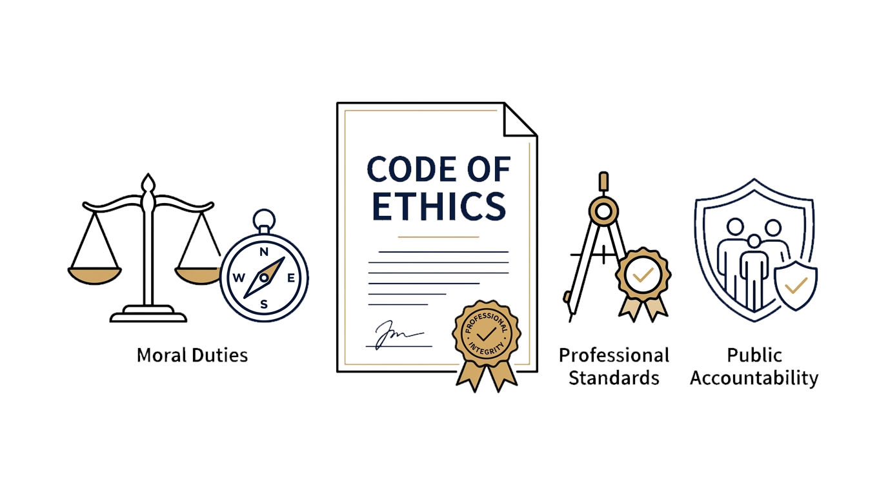

<!--
請大家看螢幕上這張莊嚴的圖片：軟體工程師的專業倫理誓約。

土木工程師蓋橋樑，若結構偷工減料，橋塌了要負法律刑事責任。

今天，軟體控制了起搏器、自動駕駛、航太導航與核電廠防護。

軟體工程師手中敲下的每一行代碼，都牽繫著真實人類的財產甚至性命！

這就是為什麼我們必須建立專業倫理規範。

總結這張投影片，請記住這個核心觀念：巨大的技術能力伴隨著巨大的社會責任；代碼即權力，必須受倫理誓約的約束。
-->
---
<!-- header: '1.7 專業倫理與社會責任' -->

## 何謂專業倫理守則？

> **專業倫理守則 (Code of Ethics)：一項正式公約，確立了該專業領域的道德義務、專業標準與對公眾的受託當責責任。**

* **軟體工程沉重的道德分量：**
  - 軟體不再只是螢幕上的代碼——它直接控制著醫療生死、航空飛控、民主選舉與全球金融。
  - 不同於一般業餘程式愛好者，**專業軟體工程師對人類社會負有重大受託人責任 (Fiduciary Duty)**。
* **為何軟體工程師需要明確的倫理守則？**
  - **資訊不對稱性：** 一般大眾與企業主管無法看懂百萬行代碼——他們必須完全信任工程師的專業誠信。
  - **對抗不當妥協的護盾：** 當商業主管強求縮減安全測試、偽造效能數據或秘密植入間諜代碼時，倫理守則提供了強大合法的防禦盔甲。
  - **不可動搖的最高原則：** **公眾的安全、健康與社會福祉，必須永遠置於對雇主的個人忠誠之上！**

<!--
我們進入 1.7 小節：何謂專業倫理守則？

專業倫理是某個專業領域對其從業人員所設定的行為標準與道德契約。

它明確定義了什麼是允許的，什麼是絕對禁止的越界行為。

最核心的精神是：當雇主的短期商業利益與公眾的安全福祉發生衝突時，軟體工程師應當站在哪一邊？

答案是毫無疑問的：站在公眾利益這一邊。

總結這張投影片，請記住這個核心觀念：專業倫理是守護社會的底線；工程師不是盲目服從命令的工具人。
-->
---
<!-- _class: full-image-slide -->

  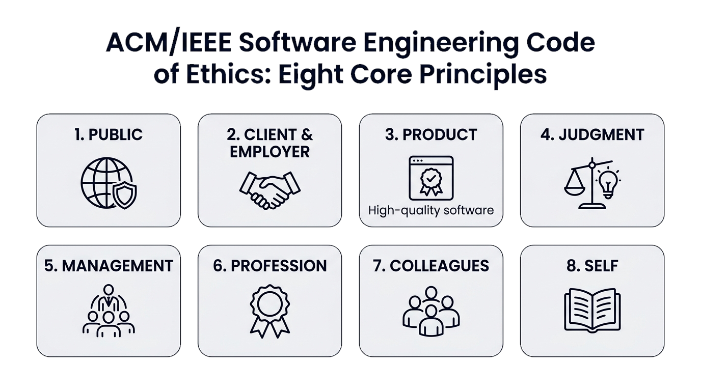

<!--
請看這張圖：ACM/IEEE 軟體工程倫理守則的八大核心原則。

由全球兩大頂級電腦學會（ACM 與 IEEE-CS）聯合制訂，是全球軟體工程師的最高行為準則：

1. 公眾 (PUBLIC)；2. 客戶與雇主 (CLIENT AND EMPLOYER)；
3. 產品 (PRODUCT)；4. 判斷 (JUDGMENT)；
5. 管理 (MANAGEMENT)；6. 專業 (PROFESSION)；
7. 同儕 (COLLEAGUES)；8. 自身 (SELF)。

讓我們翻到下一頁，深入探討其中最關鍵的條款。

總結這張投影片，請記住這個核心觀念：八大原則構建了從個人身心、團隊同儕到雇主與公眾的完整責任架構。
-->
---

## ACM/IEEE 軟體工程倫理守則：八大核心原則

1. **公眾 (Public)：** 軟體工程師應將公眾的健康、安全與福祉置於最高優先。
2. **客戶與雇主 (Client & Employer)：** 在符合公眾利益的前提下，維護客戶與雇主的最大利益。
3. **產品 (Product)：** 確保產出之軟體與修正成果達到最高專業品質標準。
4. **判斷 (Judgment)：** 在專業評估中保持正直，不受外力干擾並堅守獨立判斷。
5. **管理 (Management)：** 推動具備倫理道德的管理措施，提供合理的專案估算。
6. **專業 (Profession)：** 維護並提升軟體工程專業領域的誠信、榮譽與聲譽。
7. **同儕 (Colleagues)：** 平等對待同事、相互支持並積極提攜同儕成長。
8. **自我 (Self)：** 終生學習進修，持續提升專業能力並實踐倫理道德規範。

<!--
來看 ACM/IEEE 八大原則的實務核心：

第一條原則：公眾利益至上 (PUBLIC)！
軟體工程師的行為必須與公眾利益保持一致。當安全評估顯示軟體有致命隱患時，你必須揭露，不得隱瞞。

第二條原則：客戶與雇主利益 (CLIENT AND EMPLOYER)。
忠誠為雇主服務，但前提是「絕不違背第一條的公眾利益」！

第三條原則：產品品質 (PRODUCT)。
追求最高標準，絕不在明知有重大資安漏洞的情況下隨意交差。

總結這張投影片，請記住這個核心觀念：公眾利益是不可妥協的第一順位；對雇主的忠誠絕不能建立在危害公眾安全的代價上。
-->
---

## 震驚全球的重大倫理越界事件

* **德國福斯汽車「柴油門」事件 (Dieselgate, 2015)：**
  - 軟體工程師編寫引擎控制程式，精準辨識車輛是否處於實驗室檢測狀態，並刻意隱瞞高達法定上限 40 倍的有害氮氧化物 ($NO_x$) 排放量。
  - 招致數百億美元巨額罰款、高層與工程師遭刑事起訴，並對全球公共衛生與環境造成嚴重危害。
* **劍橋分析事件 (Cambridge Analytica, 2018)：**
  - 不當濫用並抓取數千萬用戶社群隱私數據，用於隱密政治心理操縱與選情干預。
* **計畫性淘汰 (Planned Obsolescence)：**
  - 透過特定軟體更新刻意降低舊款硬體效能，強迫消費者淘汰尚可運作的裝置。

<!--
我們來看真實世界中震驚全球的倫理越界事件。

案例一：福斯汽車「柴油門 (Dieselgate)」。工程師撰寫作弊代碼，在偵測到車輛處於檢測機台時開啟減排裝置，上路後卻超標排放 40 倍劇毒氣體。數名高管與工程師鋃鐺入獄，罰款數百億美元。

案例二：波音 737 MAX 空難。為了節省培訓成本，將仰賴單一感測器的 MCAS 系統交由軟體強制壓低機頭，並在飛行手冊中對機師隱瞞該系統的存在，導致兩架客機墜海，346 人喪生。

案例三：英國郵局 Horizon 會計系統冤案。軟體 Bug 導致帳目莫名短缺，郵局高層與廠商明知軟體有臭蟲，卻作偽證指控基層郵局支局長侵占，導致數百名無辜員工被判刑破產甚至自殺。

總結這張投影片，請記住這個核心觀念：寫著作弊或隱瞞缺陷的代碼，就是直接參與犯罪；工程師必須為自己的產出承擔道德與法律責任。
-->
---
<!-- _class: full-image-slide -->

  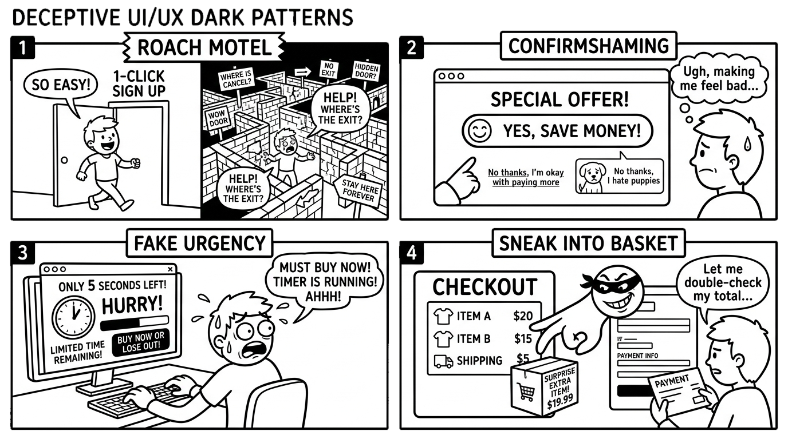

<!--
請看螢幕上這張生動的諷刺漫畫：UI/UX 設計中的欺騙性「黑暗模式 (Dark Patterns)」。

有些公司為了榨取商業利潤，利用人類的心理弱點，在軟體介面中設置精心的誘騙陷阱。

讓你不知不覺訂閱付費、難以取消帳號，或洩漏隱私資料。

這不僅是不道德的，在歐盟 GDPR、數位服務法 (DSA) 與美國 FTC 眼中，這已經是違法行為！

總結這張投影片，請記住這個核心觀念：黑暗模式是濫用人機互動心理學的欺騙行徑，違反了專業倫理與法規底線。
-->
---

## UI/UX 設計中的欺騙性「黑暗模式 (Dark Patterns)」

* **1. 蟑螂旅館 (Roach Motel · 訂閱容易退訂難)：**
  - 加入付費訂閱只需按一下按鈕；但取消訂閱卻需要深挖十層隱藏選單，甚至強制要求上班時間撥打越洋客服電話。
* **2. 確認羞辱 (Confirmshaming · 情緒勒索)：**
  - 在拒絕按鈕上刻意設計具道德批判或情緒勒索的文案（例如：*「不用了，我討厭省錢」*）。
* **3. 隱藏費用與偷塞購物車 (Sneak into Basket)：**
  - 在結帳流程的最後一步，系統預設替用戶勾選昂貴的附加保險或高額處理費用。
* **4. 偽造緊迫感與稀缺性 (Fabricated Urgency)：**
  - 在網頁上放置隨機倒數計時器（*「優惠僅剩 2 分鐘！」*）或偽造的庫存警報，製造焦慮誘騙下單。

<!--
我們來認識幾種最常見的黑暗模式：

第一，蟑螂旅館 (Roach Motel)：加入訂閱只要一秒按鈕；要取消訂閱，必須打國際長途電話、填寫紙本問卷或經過七道迷宮般的網頁。

第二，羞辱性確認 (Confirmshaming)：拒絕按鈕寫著：「不用了，我不在乎省錢，我喜歡當冤大頭！」用罪惡感操縱使用者。

第三，偷塞購物車 (Sneak into Basket)：結帳時自動幫你勾選額外的昂貴保險或配件。

第四，強迫續訂 (Forced Continuity)：免費試用期結束後，無任何通知就開始扣款，且取消按鈕被徹底隱藏。

總結這張投影片，請記住這個核心觀念：尊重使用者的自主決策權；誠實透明的介面設計才是可長可久的商業之道。
-->
---

### 觀念檢測：工程倫理 (CCQ 7)
<!-- id: ase-ch01-ccq7 -->

  

**依據 ACM/IEEE 軟體工程倫理守則，若雇主或主管強烈指示工程師撰寫一段偽造安全合規報告、隱匿系統危險的演算法時，工程師的最高倫理義務為何？**

- **A.** 服從指示實作，因為雇主支付了工程師薪資，商業利益高於一切。
- **B.** 堅定拒絕並向上呈報，因為保護公眾利益與社會安全的責任絕對高於對雇主的盲目忠誠。
- **C.** 照常撰寫該段偽造邏輯，但刻意省略所有程式碼文檔與註解。
- **D.** 將該段具爭議的代碼偷偷外包給第三方廠商執行以規避內部責任。

  

  

    
  

<!--
觀念檢測時間！請掃描螢幕上的 QR Code。

題目是：依據 ACM/IEEE 軟體工程倫理守則，若雇主強烈指示工程師撰寫偽造安全合規報告、隱匿系統危險的演算法時，工程師的最高倫理義務為何？

請看選項：
- A：聽從指示，因為雇主支付薪水。
- B：拒絕執行並向上層或外部監管呈報，因為公眾利益高於雇主利益。
- C：撰寫代碼，但在日誌中隱藏姓名。
- D：將任務外包給其他廠商。

（解析：正確答案是 B。守則第一條即明確宣示「公眾利益為最高準則」。當雇主指示涉及欺瞞大眾或造成安全危害時，工程師有法定義務拒絕並揭發。）

總結這張投影片，請記住這個核心觀念：公眾安全與利益至高無上，軟體工程師必須具備拒絕違法與欺騙性要求的專業勇氣。
-->
---

### 互動活動：黑暗模式大偵探（同儕雙人討論）

  

  **黑暗模式偵探反思活動（請與隔壁同學進行 Pair Discussion）：**
  - **指認與分類：** 回想你在日常使用手機 App 或電商網站時，曾遇過哪種令人不適的欺騙性設計？**它屬於哪一種黑暗模式？**（如：蟑螂旅館、確認羞辱、偷塞購物車或偽造緊迫感？）
  - **倫理分析：** 該設計違反了 ACM/IEEE 倫理守則中的哪一項原則（公眾利益、產品品質或專業誠信判斷）？
  - **重新設計：** 若由你擔任該產品的架構師與設計師，你會如何重新設計該互動流程，在達成正常商業目標的同時，兼顧公開透明並尊重用戶自主權？

  

  

    
  

<!--
請看這張課堂互動活動：黑暗模式大偵探！

請大家現在拿起你的手機，翻看你常用的幾款 APP 或購物網站。

找找看：
有沒有哪家網站的 Cookie 橫幅，綠色的「全部接受」大得像塊招牌，而「拒絕」按鈕卻隱藏在三層灰色小字裡面？
有沒有哪款手機遊戲刻意使用混亂的寶石與金幣，讓你忘記自己花了多少真實新台幣？

請花兩分鐘與旁邊的同學交流，互相抓出生活中的黑暗模式陷阱！

總結這張投影片，請記住這個核心觀念：培養對黑暗模式的敏銳嗅覺，讓我們警惕自己，成為尊重使用者尊嚴的良善工程師。
-->
---
<!-- _class: lead -->
<!-- header: '1.8 軟體工程中的 AI 角色' -->

# **1.8 軟體工程中的 AI 角色：典範轉移、隱患與工程嚴謹性**

> 「AI 能大幅放大開發的加速度，唯有工程紀律才能確保我們航向正確的終點。」

<!--
我們現在來到現代前沿，單元 1.8：軟體工程中的 AI 角色——典範轉移、隱患與工程嚴謹性。

生成式 AI 與大型語言模型正在重塑代碼生成的生態，推動我們從 Software 1.0 邁向 3.0。然而，未受工程驗證約束的「Vibe Coding (感覺式編程)」卻帶來了幻覺幻象、代碼急遽退化與嚴重資安後門。

我們將探討專業工程師如何將 AI 作為超高功率的協同副駕駛，同時透過嚴謹的規格設計、自動化測試與架構審查來築起品質防線。

總結這張投影片，請記住這個核心觀念：AI 加速了代碼的產出速度，這使得人類的架構決策力與嚴謹驗證能力變得前所未有地關鍵。
-->
---
<!-- _class: full-image-slide -->

  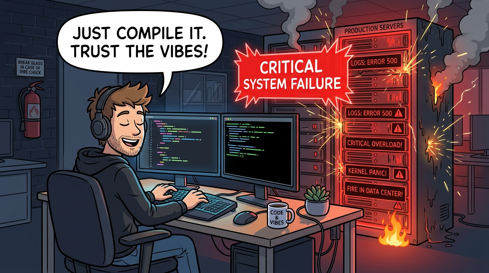

<!--
請看螢幕上這幅極具戲劇對比的漫畫：Vibe Coding 狂歡 vs. 生產環境現實。

在社群網路上，有人發起「感覺式編程 (Vibe Coding)」狂歡：
網紅用提示詞指揮 AI，二十分鐘在 localhost 跑出漂亮的展示網頁，隨即宣稱：「軟體工程已死！大家只要靠感覺 vibe 就能寫代碼了！」

但看看右邊的生產環境現實：
兩星期後，真實用戶湧入。系統在高並行下一擊即潰、API 金鑰以明文洩漏、資料庫交易 rollback 失敗導致資產資料損壞。
最慘的是，團隊裡沒有任何人理解 AI 寫的那團義大利麵代碼，完全無法搶救！

總結這張投影片，請記住這個核心觀念：用 AI 拼湊展示 Demo 很輕鬆；但工程化出安全、可靠、耐用的生產級系統，依然是無比硬核的挑戰。
-->
---
<!-- header: '1.8 軟體工程中的 AI 角色' -->

## 何謂「Vibe Programming (感覺式編程)」？

> **「Vibe Coding (感覺編程)」(由 Andrej Karpathy 等人推廣)：**  
> 一種開發模式，開發者透過提示詞讓 AI 生成程式碼，幾乎不檢視也不理解實作細節，「只要跑得起來就憑感覺隨它去」。

* **「Vibe」編程的致命誘惑力：**
  - **零門檻原型驗證：** 不用理解底層原理，一個下午生出能運作的全端 MVP。
  - **虛假的速度幻覺：** 只要終端機沒報錯，就誤以為系統具備生產品質。
* **為何 Vibe Coding 絕不等於「軟體工程」？**
  - **潛藏的極度脆弱性：** 未經檢視的程式碼充斥競爭危害與安全漏洞 (CVE)。
  - **無法維護的技術債：** 兩萬行代碼線上崩潰時，無人理解底層因果架構。

  
  

    Andrej Karpathy
    <a href="https://zh.wikipedia.org/wiki/%E5%AE%89%E5%BE%B7%E7%83%88%C2%B7%E5%8D%A1%E5%B8%95%E8%A5%BF" target="_blank">維基百科 (CC BY-SA)</a>
  

<!--
我們進入 1.8 小節：何謂「Vibe Programming (感覺式編程)」？

這個名詞由著名 AI 科學家 Andrej Karpathy 所推廣。

它描述一種工作流：開發者輸入 Prompt 讓 AI 生產程式碼，自己很少檢視或真正理解內部邏輯，只要跑得動，就「跟著感覺走 (Just Vibe)」。

為什麼它如此誘人？因為零門檻原型開發！一個下午就能拼出全端原型，帶來「極速交付」的幻覺。

但為什麼它作為軟體工程是致命的？
因為隱藏的脆弱性！未經檢視的代碼潛藏並行競爭條件、安全漏洞與幻覺 API。
當兩萬行的系統在凌晨兩點當機時，沒有人懂因果關係來修復它。

總結這張投影片，請記住這個核心觀念：Vibe Coding 適合玩票玩具原型；軟體工程才是打造高可靠生產系統的嚴謹科學。
-->
---

## 隱藏的危機：AI 編程的三大實證問題

* **1. 程式碼維護性惡化與高流失率 (GitClear 1.5 億行代碼研究)：**
  - **重複代碼暴增：** 複製貼上風格的代碼顯著增加；主動重構 (*「移動行數」*) 大幅驟減。
  - **高程式碼流失率 (Code Churn)：** 剛提交的代碼在兩週內就被刪除或推翻重寫，累積沉重的**可維護性技術債**。
* **2. 52% 的高錯誤率與「虛假安全感」(普渡大學 Purdue 實證研究)：**
  - 在 517 個軟體工程問題中，**ChatGPT 給出的解答有 52% 包含代碼錯誤或不實資訊**。
  - 但因 AI 的語氣條理分明、極具說服力且禮貌，高達 **39.3% 的開發者依然採信並採用了錯誤代碼**。
* **3. 40% 的已知資安弱點隱患 (紐約大學 NYU / 史丹佛研究)：**
  - CWE 安全掃描顯示，在缺乏嚴格資安提示引導下，**約 40% 的 AI 生成代碼**包含 CWE Top 25 嚴重安全漏洞（SQL 注入、緩衝區溢位、並行競爭危害）。

<!--
看下一頁：AI 編程的三大實證研究危機。

科學界與產業界近期發表了重量級的實證數據：

第一，GitClear 針對 1.5 億行代碼的研究：AI 編程導致「代碼流失率 (Code Churn)」翻倍，也就是提交兩週內就被刪除或重寫的代碼大幅增加；主動重構銳減 50%，代碼複製貼上氾濫。

第二，普渡大學 (Purdue) 對 ChatGPT 的研究：在 517 道軟體工程題目中，AI 答案有 52% 包含實質錯誤！但由於 AI 語氣自信且禮貌，居然有 39.3% 的工程師毫不懷疑地採信了錯誤答案。

第三，史丹佛與紐約大學的研究：超過 40% 的 AI 生成代碼潛藏 CWE Top 25 重大資安弱點（如 SQL 注入、緩衝區溢位）。

總結這張投影片，請記住這個核心觀念：AI 加快了打字速度，但若不經審查就吞下，會大幅侵蝕系統的架構健康度與安全性。
-->
---
<!-- header: '1.8 軟體工程中的 AI 角色' -->

## Vibe Coding 引發的真實世界災難事件

* **1. 線上系統崩潰 (Amazon 結帳中斷)：** AI 生成的修補程式在未經完整驗證下發布，破壞了底層結帳邏輯，導致訂單驟降 99%，**數小時內痛失 630 萬筆訂單**。  
* **2. 套件幻覺搶註投毒 (Slopsquatting)：** LLM 生成程式碼時幻覺捏造出不存在的套件名稱 ()；黑客伺機註冊惡意木馬套件，污染供應鏈 (下載量破 3 萬次)。
* **3. 金鑰擴散與硬編碼憑證：** AI 範例程式常內嵌硬編碼密碼與 Token；GitGuardian 報告指出 AI 代碼洩漏機密憑證的機率是**人類工程師的 2 倍**。

<!--
來看真實世界中，因盲信 AI 代碼所引發的重大災難。

災難一：Amazon 結帳當機大事故。開發者使用生成式 AI 修補內部邏輯，AI 生產出語法正確但潛藏邏輯缺陷的代碼，直接破壞結帳流程，短短數小時內損失 630 萬張訂單。

災難二：套件幻覺與投毒 (Slopsquatting)。LLM 經常幻覺出不存在的套件名稱。黑客發現後，搶先註冊該套件並植入木馬，導致數萬名開發者誤下載中毒。

災難三：憑證外洩。AI 範例代碼常寫死密碼與金鑰。GitGuardian 指出，AI 生成代碼外洩 API 金鑰的機率是人類的兩倍！

總結這張投影片，請記住這個核心觀念：盲信 AI 輸出會直接引發產線停擺、供應鏈投毒與商業機密外洩。
-->
---

## 另一面：AI 編程的龐大效益與真實成功案例

* **AI 輔助編程帶來的實質效益：**
  - **1. 消除繁重重複的認知負擔：** 自動化生成樣板代碼、複雜正規表達式、CRUD 模式與基礎骨架，讓工程師能全神貫注於系統架構與核心商業邏輯。
  - **2. 大幅提升開發敏捷度與心流體驗：** 實證研究顯示常規任務完成速度加快達 **55%**，大幅減少查詢瑣碎語法帶來的干擾，保持深度專注。
* **兩項具代表性的業界成功實例：**
  - **實例一：Amazon 30,000 個 Java 應用程式無痛升級 (Amazon Q Developer)：**
    - 亞馬遜利用 AI 程式代理人在數月內將超過 3 萬個線上系統升級至 Java 17，省下相當於 **4,500 人年 (developer-years)** 的繁複勞力，每年帶來 **2.6 億美元** 的效能效益。
  - **實例二：大型企業開發效能躍升 (Accenture 與 GitHub Copilot)：**
    - 針對數萬名企業軟體工程師的研究顯示，常規任務交付速度提升 **55%**；在搭配嚴謹同儕審查下，90% 工程師表示工作專注度與成就感顯著提升。
* **核心工程思維與管理準則：**
  - **善用與管理——既非盲目盲從，亦非抗拒排斥！** 正確的專業態度不是恐懼禁止，也不是憑「感覺」隨性放任，而是以 **工程紀律、嚴謹測試與架構治理** 來好好利用 AI。

<!--
那麼，我們應該因此封殺 AI 嗎？當然不是！請看投影片的另一面：AI 編程的龐大效益。

只要在嚴謹工程紀律的引導下，AI 是強大無比的槓桿工具！

效益一：消除瑣碎的枯燥代碼。自動化樣板代碼、正規表達式、CRUD 端點與初始單元測試骨架，讓工程師能把腦力集中在核心架構決策上。
效益二：開發速度大幅提升 55%。

看 Amazon 的傳奇案例：Amazon 利用 Q Developer 智慧代理，在幾個月內將內部超過三萬個舊系統全面升級至 Java 17，一口氣省下 4,500 個人年的繁重勞動，創造每年 2.6 億美元的驚人效益！

總結這張投影片，請記住這個核心觀念：不要盲目投降給感覺，也不要恐懼排斥；以工程紀律駕馭 AI，讓它成為放大生產力的高能助手。
-->
---

## 軟體工程中的 AI：典範轉移 (Software 1.0 → 3.0)

* **軟體建構模式的歷史演化：**
  - **Software 1.0 (代碼中心)：** 人類工程師逐行撰寫明確、確定性的演算法邏輯 (f(x) → y)。
  - **Software 2.0 (提示詞驅動)：** 人類以自然語言撰寫提示詞；LLM 自動生成程式碼、函式與模板程式（如 Copilot, ChatGPT）。
  - **Software 3.0 (自主代理 Agentic)：** 人類工程師定義高階商業目標與架構約束；自主 AI Agent 迭代規劃、呼叫工具、執行測試與自我重構。
* **軟體工程師角色的根本質變：**
  - **AI 使之商品化的部分：** 樣板代碼、標準 CRUD API 接口與語言語法轉換。
  - **無可取代的核心價值：** 業務領域分析、架構折衷權衡、安全防護邊界，以及**評估生成出的方案是否真正符合真實用戶需求**。
  - **工程師的新身分：** 從*語法打字員* → 躍升為 **系統架構師、規格設計者與最終驗證把關權威**。

<!--
請看這張劃時代的演進圖：軟體工程典範轉移 (Software 1.0 → 3.0)。

我們正在經歷軟體開發方式的三個歷史階段：

Software 1.0（代碼中心時代）：人類手寫每一行明確、確定性的邏輯 (f(x) → y)。
Software 2.0（模型與提示詞驅動）：人類給予自然語言提示詞，大語言模型生成代碼與函數。
Software 3.0（自主代理時代）：人類制訂高階目標、規格邊界與架構合約，自主 AI Agent 反覆規劃、調用工具、執行測試並自動重構。

這改變了工程師的身份定位：
語法打字不再值錢；真正無可取代的是領域分析、架構權衡與最終驗證權威！

總結這張投影片，請記住這個核心觀念：在 Software 3.0 時代，工程師從代碼打字員昇華為系統架構師、規格設計師與驗證權威。
-->
---

## AI 在軟體工程：需求工程與系統架構

* **1. 軟體規格說明（需求工程）：**
  - **賦能優勢 ($\oplus$)：** 極速擬定使用者故事、Given-When-Then 驗收準則與邊界情境；主動辨識規格書中的模糊語意與內部矛盾。
  - **潛在風險 ($\ominus$)：** 憑空幻覺出不存在的外部 API 與虛假業務邏輯；完全缺乏組織隱性經驗、法律賠償意識與人類同理心。
* **2. 系統與架構設計：**
  - **賦能優勢 ($\oplus$)：** 系統化比較不同架構模式的優缺點；極速搭建資料庫實體關係圖 (ERD)、綱要與 OpenAPI 介面合約骨架。
  - **潛在風險 ($\ominus$)：** 容易過早推動過度工程化與微服務過度膨脹；對網路傳輸延遲、雲端基礎設施帳單上限與安全 SLA 缺乏敏銳度。

<!--
我們來檢視 AI 如何重塑生命週期前期：需求工程與系統架構。

在需求工程中：
AI 的超能力是能光速整理會議逐字稿，列出 User Story 與驗收條件，並挑出規格矛盾。
但風險是：AI 缺乏商業默契與法律責任感，容易幻覺出不存在的功能。

在系統架構設計中：
AI 能快速比較設計模式，並生成 OpenAPI 合約與架構圖草稿。
但風險是：AI 容易過度工程化，動輒推薦複雜的微服務，卻對延遲與伺服器帳單毫無概念。

總結這張投影片，請記住這個核心觀念：AI 是極佳的腦力激盪助手，但商業真實約束與架構最終拍板，必須由人類架構師捍衛。
-->
---

## AI 在軟體工程：程式碼建構與實作

* **3. 編程與開發實作：**
  - **賦能優勢 ($\oplus$)：**
    - **消滅樣板程式：** 自動化生成重複的基礎樣板、CRUD 端點與複雜的正則表達式 (Regex)。
    - **多語言極速切換：** 在不同程式語言之間無縫轉譯演算法與業務邏輯。
    - **即時黃色小鴨偵錯：** 數秒內精確解讀晦澀的編譯器報錯，並提供多種實作優化建議。
  - **潛在風險 ($\ominus$)：**
    - **Vibe Coding 陷阱：** 開發者輕信語法看似正確的代碼，卻對執行期因果機制一無所知。
    - **資安防線崩潰：** NYU 與史丹佛研究顯示，約 40% 的 AI 生成代碼包含 CWE Top 25 嚴重漏洞（SQL 注入、緩衝區溢位、並行競爭）。
    - **供應鏈投毒威脅：** 意外引入幻覺生成的惡意套件、廢棄 API 或具高傳染性的開源授權 (Copyleft)。

<!--
接下來看生命週期核心：程式碼建構與實作。

在寫代碼時，AI 就像一位聰明但缺乏常識的實習生。

它能幫你消滅枯燥樣板、跨語言無縫轉譯算法，並在編譯報錯時充當即時黃色小鴨。

但你必須警惕三大深坑：
第一，Vibe Coding 陷阱：只要編譯通過就盲信；
第二，資安漏洞：四成代碼暗藏 CWE 弱點；
第三，依賴投毒與授權衝突。

請牢記這句黃金法則：「絕不要將自己看不懂、無法負責的代碼合併進主分支！」

總結這張投影片，請記住這個核心觀念：AI 加速打字草稿，但人類工程師必須為跑在生產環境的每一行代碼負起全部法律與專業責任。
-->
---

## AI 在軟體工程：軟體驗證、測試與演化

* **4. 軟體驗證（測試與 QA）：**
  - **賦能優勢 ($\oplus$)：** 自動合成大量邊界假資料 (Mock Data)、邊界單元測試與基於屬性的模糊測試 (Fuzzing) 套件。
  - **潛在風險 ($\ominus$)：** **「同溫層測試 (Echo-Chamber Testing)」**——AI 寫出的測試只驗證了它自己有缺陷的假設（*「誰來測試測試者？」*）；單元測試在 `localhost` 通過，卻在真實高並行環境下崩潰。
* **5. 軟體演化（維護與重構）：**
  - **賦能優勢 ($\oplus$)：** 數秒內剖析並解釋傳承十年的遺留義大利麵代碼；自動化生成變更日誌、函式說明文檔與資料庫遷移腳本。
  - **潛在風險 ($\ominus$)：** 在重構過程中引入**隱性回歸缺陷 (Silent Regressions)**；生成極具說服力但內容失真的文檔（描述程式「應該」做什麼，而非「實際」在做什麼）。

<!--
看下一頁：驗證測試與軟體演化。

在測試階段，AI 擅長產生邊界測試資料集與 Property-based 模糊測試。

但這裡有一個致命哲學命題：「誰來測試測試者？」
如果讓 AI 寫了業務代碼，又讓同一個 AI 幫自己寫單元測試，測試當然全綠！
為什麼？因為這叫「同溫層測試 (Echo-Chamber Testing)」！測試只是在重複驗證 AI 自己錯誤的假設，而非真正的商業規格。

在演化維護階段，AI 能解讀陳年義大利麵代碼，但也極容易在重構時引發無聲的迴歸錯誤。

總結這張投影片，請記住這個核心觀念：測試案例必須錨定於獨立的外部業務規格，絕不能衍生自 AI 自己的實作假設。
-->
---

## AI 時代的工程嚴謹性：信任與驗證

> **「永遠不要合併你無法理解、且無法為其辯護的程式碼。」**

* **「自動化偏誤 (Automation Bias)」的重大陷阱：**
  - 過度盲信 AI 流暢、自信的輸出，而忽視了對邊界條件、並行競爭或底層安全合約的審慎驗證。
* **AI 賦能時代的工程三大鐵則：**
  - **1. 規格優先（契約驅動）：** 在缺乏形式化介面定義、型別簽章與清晰驗收準則之前，絕不盲目生成程式碼。
  - **2. 獨立驗證防護網：** AI 絕不能在缺乏監督下同時包辦實作與自身測試（*「誰來測試測試者？」*）。強制要求以確定性的 CI 自動化回歸套件把關。
  - **3. 人類專業當責性：** AI 提供的是草稿，但人類軟體工程師必須為線上運行的每一行程式碼負起 **100% 的法律、倫理與架構責任**。

<!--
翻到下一頁：AI 時代的工程嚴謹性四大信任支柱。

要如何安全在企業中落地 AI 代碼？必須構築這四道防線：

第一，規格合約優先 (Contract-First)：先寫好 OpenAPI、TypeScript 介面與型別定義，才丟給 AI 實作。
第二，獨立驗證網 (Test-Driven AI)：依據業務規格先行撰寫獨立測試，禁止 AI 幫自己評分。
第三，沙盒 CI/CD 與自動化靜態檢查：代碼強制進入隔離容器，由 SonarQube 與漏洞掃描嚴格把關。
第四，人類專業責任：每一筆 Commit 都必須由工程師親手簽署並承擔責任。

總結這張投影片，請記住這個核心觀念：AI 是代碼生成的引擎；軟體工程是安全、驗證與人類責任的煞車與方向盤。
-->
---

### 觀念檢測：AI 編程與代碼流失 (CCQ 8)
<!-- id: ase-ch01-ccq8 -->

  

**在評估 AI 輔助開發的實證研究中（如 GitClear 分析 1.5 億行代碼），「程式碼流失率 (Code Churn)」是關鍵品質指標。高 Code Churn 在 AI 開發環境中反映出何種核心問題？**

- **A.** 新提交的程式碼在極短時間內就被頻繁修改、刪除或推翻重寫，反映出 AI 代碼看似產出快速但本質脆弱且未經深思。
- **B.** 編譯器與打包工具在持續部署管線中，主動且有效率地從發布二進位檔案中自動剔除未引用的死碼。
- **C.** 軟體開發團隊因為具備多語言自動轉譯工具，而在專案中頻繁更換底層核心程式語言與技術架構。
- **D.** 自動化測試案例執行速度過快，導致雲端 CI/CD 伺服器的虛擬機器運算配額在短時間內迅速耗盡。

  

  

    
  

<!--
觀念檢測時間！請掃描 QR Code 參與作答。

題目是：
在評估 AI 輔助編程工具的實證研究中（例如 GitClear 對 1.5 億行代碼的分析），「代碼流失率 (Code Churn)」大幅攀升被視為警訊。在 AI 輔助的代碼庫中，高代碼流失率最可能代表什麼意涵？

選項如下：
A：代碼在提交後不久便頻繁被重寫、刪除或打補丁，顯示開發者盲目接受缺乏驗證的脆弱 AI 代碼。
B：編譯器在自動佈署時積極刪除死碼。
C：工程團隊正頻繁更換底層程式語言。
D：測試案例執行速度太快，耗盡了虛擬機運算資源。

請大家投下您的答案！

（解析：正確答案是 A。代碼在兩週內就被大量修改或刪除，代表當初寫得快但質量奇差，正是 Vibe Coding 累積技術債的鐵證。）

總結這張投影片，請記住這個核心觀念：高代碼流失率是淺層驗證的警訊；前期打字的速度，掩蓋了後期巨大的維護地獄。
-->
---

### 觀念檢測：AI 驗證與同溫層測試 (CCQ 9)
<!-- id: ase-ch01-ccq9 -->

  

**工程師請 AI 生成一套複雜的計費結帳模組，並在未提供形式化規格契約下，直接請同一個 AI 自動生成單元測試。測試全部綠燈通過。此時最大的工程風險為何？**

- **A.** 同溫層盲點驗證：AI 生成的測試僅是在驗證自身有缺陷的錯誤假設，無法證明符合真實的業務規格。
- **B.** 執行效能瓶頸：AI 生成的測試斷言在執行期需要耗費比人類手寫測試多出數十倍的記憶體運算資源。
- **C.** 編譯語法失敗：既有的主流自動化測試框架無法成功解析大型語言模型所合成的 Mock 假資料結構。
- **D.** 技術版本鎖定：該測試套件會與特定單一雲端供應商的執行時期環境產生強烈且無法抽換的緊密耦合。

  

  

    
  

<!--
再來看下一題觀念檢測！請掃描螢幕上的 QR Code。

題目是：
一位工程師利用 AI 生成了複雜的計稅模組，隨後在沒有提供獨立規格說明的情況下，要求該 AI 為該模組撰寫單元測試。所有測試均顯示通過 (Green)。此時最大的潛在風險為何？

選項如下：
A：同溫層驗證 (Echo-chamber validation)：生成的測試僅僅重複驗證了 AI 自身錯誤的計算假設，而非真實稅法業務需求。
B：AI 測試斷言執行過慢，引發效能瓶頸。
C：測試框架無法解析 AI 生成的假資料。
D：測試套件被綁定於特定單一雲端環境。

請大家投下你的答案！

（解析：正確答案是 A。這正是「同溫層測試」。如果 AI 把稅率算錯了，它產生的測試就會斷言「算錯的數字才是對的」，營造虛假的安全感。）

總結這張投影片，請記住這個核心觀念：單元測試必須來自客觀獨立的業務規格，絕不能讓 AI 替自己的錯誤背書。
-->
---

### 互動活動：Vibe Coding 實務大挑戰

  

  **課堂投票與思辨：AI 時代的開發實踐**
  - **課堂投票：** 在你日常使用 AI 編程輔助工具時，有多大比例你會在 Commit 提交前逐行徹底檢視並完全理解每一行程式碼？
  - **小組思辨：** 假設 AI 助手為你寫出了一段 200 行的非同步資料庫處理常式，且順利通過了 2 個基本單元測試。這樣可以直接部署上線嗎？一位專業的軟體工程師必須執行哪些關鍵的驗證步驟？

  

  

    
  

<!--
請看課堂實作活動：Vibe Coding 實務大挑戰！

在接下來的課堂中，我們會進行一個有趣的實驗：

第一階段：大家輸入 Prompt，讓 AI 寫一個看似簡單的跨時區日期區間解析函數。AI 給出的代碼看起來非常專業，跑簡單測試也完全過關。這就是輕鬆愉快的 Vibe Phase。

第二階段：我們進入 Engineering Phase！對這段代碼施加極限邊界測試：閏秒、世紀閏年 2 月 29 日、夏令時間切換瞬間與多執行緒並行存取。
這時你將親眼目睹：AI 看似完美的代碼在哪些邊界條件下無聲崩潰！

總結這張投影片，請記住這個核心觀念：唯有嚴格的邊界極限測試，才能戳破感覺式編程的假象，驗證工程防線的真實威力。
-->
---
<!-- _class: lead -->
<!-- header: '1.9 FAQ 與重點總結' -->

# **1.9 常見問題解答 (FAQ) 與重點總結**

> 「軟體工程中最不可或缺的工具，是嚴謹、具批判性思考的工程思維。」

<!--
在第一章的結尾，我們來到單元 1.9：常見問題解答與整體重點總結。

我們將針對初學者最常困惑的職涯迷思與工程觀念進行深度解惑，並透過互動式填空總結，穩固今日所建立的軟體工程核心思維。

總結這張投影片，請記住這個核心觀念：牢固掌握軟體工程的本質與原則，是在不斷更迭的技術浪潮中長青致勝的終極基石。
-->
---
<!-- header: '1.9 FAQ 與觀念檢測' -->

## 常見問題解答 (FAQ)

* **Q1：寫程式 (Programming) 與軟體工程 (Software Engineering) 有何本質區別？**
  - *解答：* 寫程式是在某個當下產出程式碼。軟體工程則是將寫程式置於時間軸與團隊規模中，全面治理約束條件（時程、預算）、多維度品質屬性，以及長期的系統演化。
* **Q2：為什麼測試覆蓋率 100% 且運作正確的程式，依然可能面臨系統崩潰？**
  - *解答：* 軟體是由程式、資料、運作程序與文檔四大支柱構成。缺乏穩固的資料綱要、經過驗證的運維 SOP，或在需求規格階段就發生理解偏差，都會導致系統失效。
* **Q3：滿意化策略 (Satisficing) 與極致最佳化 (Optimizing) 如何取捨？**
  - *解答：* 現實世界的資源與時程皆有限。工程師必須在滿足所有約束條件的前提下，採取能解決實際問題的務實折衷（滿意化），而非不計代價追求理論上的極致完美。
* **Q4：在 AI 時代，面對 Vibe Coding 的風險該如何防範？**
  - *解答：* 堅守工程紀律：堅持代碼審查把關、落實「規格優先」的測試驗證，並始終將 AI 生成內容視為需要嚴格審核的初稿。

<!--
我們進入 1.9 小節：第一章常見問題解答 (FAQ)。

讓我們快速回顧本章四個核心問題：

Q1：寫程式與軟體工程的最大差別是什麼？
程式設計是寫代碼解決當下的問題；軟體工程是考慮時間、團隊、預算、品質與長期演化的綜合管理體系。

Q2：為什麼單元測試 100% 覆蓋的程式，上線依然會崩潰？
因為軟體由四大支柱構成！如果你的生產資料庫架構、環境設定或維運 SOP 錯誤，代碼再完美也無濟於事。

Q3：何謂滿意解 (Satisficing) 與最佳解 (Optimizing)？
工程受制於現實約束與有限資源。我們不追求虛無飄渺的最佳解，而是在約束中找到足夠好的滿意解。

Q4：如何防範 AI Vibe Coding 的風險？
落實規格優先、獨立驗證、代碼審查，並恪守人類工程師的最終專業責任。

總結這張投影片，請記住這個核心觀念：軟體工程是關於系統性思考的智慧學門，不是機械式的語法打字手藝。
-->
---

## 觀念檢測：填空挑戰

  

檢驗你對第一章核心觀念的掌握程度：

1. 依據 IEEE 定義，軟體是由電腦程式、資料、運作程序以及 **[ _________ ]** 四大要素所構成。
2. 在落後的專案中增加人手只會使專案更加落後，被稱為 **[ _________ ]** 法則。
3. **[ _________ ]** 軟體產品品質模型定義了包括功能適合性、相容性、資訊安全與可維護性在內的 8 大特徵。
4. ACM/IEEE 軟體工程倫理守則的第一項最高原則，強調必須將 **[ _________ ]** 利益置於最優先。

  

  

    
  

<!--
在結束第一章前，讓我們用四道填空題檢驗你的核心觀念掌握度！

第一題：根據 IEEE 定義，軟體由電腦程式、資料、作業程序與什麼所組成？
答案是：文件 (Documentation)！

第二題：「向進度落後的專案增加人手，只會讓專案更落後」，這被稱為誰的法則？
答案是：布魯克斯法則 (Brooks's Law)！

第三題：定義了功能適合性、效能效率、安全性等八大特徵的國際品質標準為何？
答案是：ISO/IEC 25010！

第四題：ACM/IEEE 軟體工程倫理守則的第一條原則，優先捍衛誰的利益？
答案是：公眾利益 (Public Interest)！

全答對的同學，恭喜你已經建立起專業軟體工程的扎實心智模型！

總結這張投影片，請記住這個核心觀念：掌握這些核心詞彙與定律，是我們邁向後續進階架構設計的基石。
-->
---

## 參考文獻與進階閱讀

* Sommerville, Ian. *Software Engineering* (10th Edition). Pearson. [官方網站](https://software-engineering-book.com/)
* Brooks, Frederick P. *The Mythical Man-Month: Essays on Software Engineering* (人月神話). Addison-Wesley.
* ISO/IEC 25010:2011. *Systems and software engineering — Systems and software Quality Requirements and Evaluation (SQuaRE) — System and software quality models*.
* ACM/IEEE Joint Task Force on Software Engineering Ethics. *Software Engineering Code of Ethics*. [IEEE CS](https://www.computer.org/education/code-of-ethics)
* Brignull, Harry. *Deceptive Patterns: Exposing the Tricks Tech Companies Use to Control You*.

<!--
來到我們第一章的最後一頁：參考文獻與進階閱讀。

本章的核心理論與案例，源自軟體工程巨擘們的經典著作：
Sommerville 的權威教科書《軟體工程》；
Brooks 的傳世經典《人月神話》；
ISO/IEC 25010 品質模型國際標準；
ACM/IEEE 軟體工程倫理守則；
以及 GitClear、普渡大學等機構最新的 AI 代碼品質實證研究。

站在巨人的肩膀上，我們才能避免重蹈軟體歷史失敗的覆轍。

謝謝大家，我們第二章再見！

總結這張投影片，請記住這個核心觀念：汲取前人的歷史教訓與實證文獻，讓我們能打造出長治久安、值得社會信賴的卓越軟體。
-->

