---

# 軟體工程 (Software Engineering)

### 第二課：軟體開發流程與方法學 (Software Development Processes & Methodologies)

<br>

**授課教師：薛念林 教授**
資訊工程學系 / 軟體工程與人工智慧實驗室

<!--
大家好，歡迎來到軟體工程第二講：軟體開發流程與方法學。

在上一講中，我們確立了軟體工程的本質：它不是個人的隨興編程，而是一門在有限資源與現實約束下，持續交付高品質軟體資產的工程學科。

今天，我們要探討一個決定專案成敗的核心命題：當團隊面臨複雜多變的需求時，我們該如何組織、規劃並推進開發工作？

這就是軟體流程模型（Software Process Models）所要回答的核心問題。

總結這張投影片，請記住這個核心觀念：流程模型是團隊將混沌需求轉化為高品質軟體系統的結構化藍圖。
-->
---
<!-- _class: outline outline-slide -->

## 第二章：課程大綱與核心架構

<div class="outline-columns">
  <div>
    <h3>第一部分：經典流程與敏捷管理框架</h3>
    <ul>
      <li><b>2.1 流程與流程模型：</b> 規格制定、設計實作、驗證確認與系統演進四大活動。</li>
      <li><b>2.2 計畫驅動範式：</b> 瀑布模型、階段閘門、V-模型驗證與確認機制。</li>
      <li><b>2.3 變革的機制：</b> 增量交付 vs. 疊代精煉的本質差異、打造最小可行產品 (MVP)。</li>
      <li><b>2.4 思維轉變與敏捷哲學：</b> 敏捷宣言四大價值、十二條原則與調適文化。</li>
      <li><b>2.5 敏捷專案管理：</b> Scrum 衝刺儀式、團隊角色與產出物、看板拉動系統。</li>
    </ul>
  </div>
  <div>
    <h3>第二部分：技術紀律、DevOps 與 AI 前沿</h3>
    <ul>
      <li><b>2.6 速度背後的隱形成本：</b> 技術債隱喻、技術債四象限、償還策略與重構。</li>
      <li><b>2.7 卓越技術紀律 (XP)：</b> 極限編程實踐、結對編程、測試驅動開發 (TDD)。</li>
      <li><b>2.8 系統架構與協同文化 (DevOps)：</b> 打破部門壁壘、CI/CD 自動化部署管道。</li>
      <li><b>2.9 現代新前沿與觀念總結：</b> AI 規格驅動流程、人機協同迴路、重點測驗與經典文獻。</li>
    </ul>
  </div>
</div>

<!--
這是我們今天的學習藍圖。我們將第二章規劃為兩大主軸、九個循序漸進的核心單元。

在左側的第一部分，我們首先深入經典流程模型（瀑布與 V-模型），徹底辨析增量與疊代的差異，並掌握敏捷哲學與 Scrum/看板專案管理。

在右側的第二部分，我們直面追求速度所累積的「技術債」，透過 XP 極限編程的嚴謹技術紀律與 DevOps CI/CD 自動化管道守護品質，最後探索前沿的 AI 規格驅動開發流程。

總結這張投影片，請記住這個核心觀念：軟體流程已從過去僵化的前期計畫，演進為高度調適、全面自動化與 AI 賦能的敏捷回饋迴路。
-->
---
## 本章核心思考問題 (Focus Questions)

* **1. 計畫 vs. 調適的根本權衡：**
  - 在何種情況下，我們應該優先採用嚴格的「計畫驅動 (Plan-Driven)」流程？又在何種情境下，「敏捷調適 (Agile Adaptive)」是唯一生路？
* **2. 交付速度的真正內涵：**
  - 「快速上線」與「系統品質」真的是不可調和的矛盾嗎？軟體團隊如何在不欠下毀滅性「技術債」的前提下維持極速交付？
* **3. 極限技術紀律的威力：**
  - 為什麼純粹的管理框架（如 Scrum）若缺乏卓越的工程實踐（如 TDD 與重構），往往會淪為低效甚至災難性的「疲軟 Scrum」？
* **4. AI 時代的流程重塑：**
  - 當生成式 AI 與自主代理能以秒級速度生成數千行程式碼時，人類工程師的價值與流程管控如何轉型為「安全帶工程學 (Harness Engineering)」？

<!--
在深入技術細節之前，請大家帶著這四個核心問題來聽今天的課程。

第一個問題關乎流程選型：什麼時候用瀑布？什麼時候用敏捷？

第二個問題直指軟體經濟學核心：速度與品質該如何兼得？

第三個問題探討管理與技術的平衡：為什麼只有看板與站立會議是不夠的？

第四個問題則面向未來：在 AI 輔助開發時代，流程模型該如何演化？

總結這張投影片，請記住這個核心觀念：帶著問題出發，軟體工程學的不是死記硬背的模型，而是在真實約束下的工程決策智慧。
-->
---
<!-- _class: lead -->
<!-- header: '2.1 流程與流程模型' -->

# **2.1 流程與流程模型**

> "If you can't describe what you are doing as a process, you don't know what you're doing."  
> 「如果你無法將你正在做的事情描述為一項流程，那麼你根本不知道自己在做什麼。」  
> — *W. Edwards Deming (現代品質管理之父)*

<!--
我們現在正式進入單元 2.1：流程與流程模型。

現代品質管理之父戴明博士說過這句經典名言：「如果你無法將你的工作描述為一項流程，你根本不知道自己在做什麼。」

在軟體領域更是如此。寫代碼很容易，但要讓十個人、一百個人協同一致，在預算與時程內交付可靠系統，就必須仰賴明確的流程模型。

總結這張投影片，請記住這個核心觀念：流程模型是軟體工程從手工作坊邁向現代工業化協同的關鍵躍遷。
-->
---
<!-- _class: title-image-slide -->

## 沒有流程 vs. 具備流程模型 (Without a Process vs. With a Process Model)

<div class="image-wrapper">
  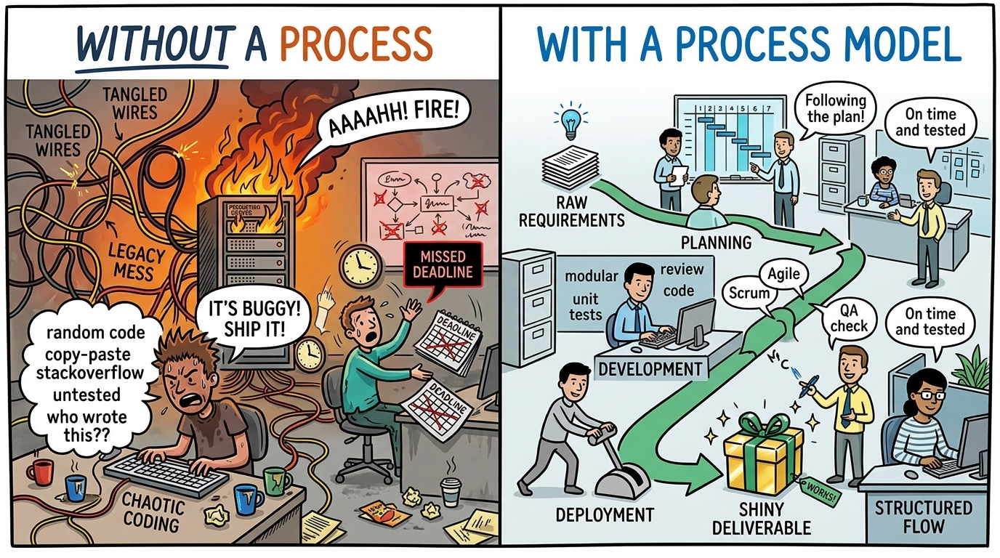
</div>

<!--
請大家看螢幕上這幅生動的對比漫畫。

在左側，是「沒有軟體流程」的混亂開發場景：每位工程師各行其是，需求如同無頭蒼蠅般隨意變更，沒有測試規範，也沒有發行標準。每當交付期限逼近，團隊便陷入無休止的救火、爭吵與加班，最終產出充斥缺陷且難以維護的系統。

而在右側，是「具備流程模型」的工程場景：團隊擁有明確的階段劃分、嚴謹的驗收條件與自動化守護網。每個人的職責清晰，變更受到妥善管控，系統如同一部精密運轉的機器，穩定且可預測地向前推進。

這就是流程模型的價值：它並不是官僚主義的枷鎖，而是保護團隊不被系統複雜度吞噬的「工程安全裝備」。

總結這張投影片，請記住這個核心觀念：流程模型將隨機混亂的編程打字行為，轉化為具備工程可預測性與穩定品質的現代軟體生產力。
-->
---
<!-- header: '2.1 流程與流程模型' -->

## 軟體開發流程與流程模型 (Process & Process Models)

* **何謂「軟體流程 (Software Process)」？**
  - 為了**開發、演進並維護**一套軟體系統，所執行的一系列具備結構化的**活動 (Activities)、方法 (Methods)、實踐 (Practices) 與轉換 (Transformations)**。
* **何謂「流程模型 (Process Model)」？**
  - 對軟體流程的高度抽象化表現（簡化藍圖）。
  - 它定義了：**應該產出哪些工件 (Artifacts)？由誰負責 (Roles)？遵循何種先後順序 (Phases)？以及何時進行驗證？**
* **流程模型的核心價值：**
  - **降低複雜度與混亂：** 為團隊協同提供共同語言與可預期的節奏。
  - **品質保證機制：** 確保測試與代碼審查並非「事後補救」，而是流程中不可或缺的守門員。
  - **可重複性與持續改進：** 唯有具備流程，團隊才能度量效能並進行科學化調優。

<!--
請大家看這兩個核心定義。

「軟體流程」是真實發生的具體活動、實踐與工作路徑；

而「流程模型」則是對這些活動的抽象與規範化藍圖。它告訴團隊：我們現在在哪個階段？下一個里程碑是什麼？誰負責驗收？

如果沒有流程模型，軟體開發就會退化成隨機的打字與無休止的救火。有了流程模型，品質才具備可重複性。

總結這張投影片，請記住這個核心觀念：流程模型是軟體工程提供可預測性、可重複性與品質保證的架構骨幹。
-->
---
## 通用流程活動：軟體生命週期四大支柱

不論採用何種流程模型（瀑布、Scrum 還是 AI 驅動），所有軟體工程流程都**必然包含四大核心活動**：

* **1. 軟體規格說明 (Software Specification · 需求工程)：**
  - 明確界定軟體「必須做什麼 (What)」以及其運行的約束條件與品質標準。
* **2. 軟體設計與實作 (Software Design & Implementation)：**
  - 確立系統架構組織，並將其轉換為可運行的可執行程式碼與資料庫結構。
* **3. 軟體驗證與確認 (Software Validation & Verification)：**
  - 驗證軟體是否符合其規格說明，並確認軟體是否真正滿足客戶的真實商業期望。
* **4. 軟體演化 (Software Evolution · 系統維護)：**
  - 依據市場變更、使用者回饋與技術棧演進，持續修改並升級既有軟體。

> **核心洞見：** 活動本身不依賴特定時序。**各流程模型的根本差異，在於這四大活動發生的「時機」與「頻率」！**

<!--
請大家特別注意這四大通用活動：規格說明、設計與實作、驗證確認、系統演化。

這四大活動是軟體工程的物理定律，任何專案都逃不開。

瀑布模型主張將這四件事嚴格按順序切分，每個階段耗時數月；而敏捷模型則主張將這四件事濃縮在兩週的衝刺中，甚至在一天之內反覆循環數十次！

模型的差異不在於「做不做這四件事」，而在於「何時做、做多快、以何種頻率回饋」。

總結這張投影片，請記住這個核心觀念：四大核心活動是軟體工程不變的物理骨架，所有流程模型的本質差異僅在於活動編排的時機與頻率。
-->
---
## 經典與現代軟體流程模型全景圖

根據對「需求變更」的因應哲學，主流流程模型可劃分為兩大光譜：

<div class="two-columns">
<div class="card" data-marpit-fragment>

### 計畫驅動範式 (Plan-Driven)
* **哲學：** 變更成本高昂，必須「前期防範於未然 (Upfront Planning)」。
* **代表模型：**
  - **瀑布模型 (Waterfall):** 嚴格線性序列，重視階段里程碑與正式簽核。
  - **V-模型 (V-Model):** 強化測試左移與雙向追溯性（航太、醫療、車載標準）。

</div>
<div class="card" data-marpit-fragment>

### 調適/敏捷範式 (Adaptive / Agile)
* **哲學：** 變更不可避免，必須「透過快速回饋持續調適 (Empirical Feedback)」。
* **代表模型：**
  - **增量與疊代 (Incremental & Iterative):** 漸進精煉與垂直功能切片。
  - **Scrum & 看板 (Kanban):** 時間盒衝刺律動 vs. 連續流動拉動系統。
  - **極限編程 (XP):** 卓越代碼技術紀律（TDD、結對編程、重構）。
  - **DevOps & AI 規格驅動:** CI/CD 自動化管道與 AI 代理工程安全帶。

</div>
</div>

<!--
這張投影片勾勒了整個第二章的宏觀全景。

左側是「計畫驅動範式」：如果發射火箭或設計醫療器材，變更成本極高，我們必須在動工前把規格與測試計畫定義得滴水不漏。

右側是「調適與敏捷範式」：面對未知的商業市場與網路應用，需求瞬息萬變，我們必須透過極短的回饋循環，讓系統在動態調適中逐步演化成熟。

沒有絕對優劣，只有適用情境。

總結這張投影片，請記住這個核心觀念：流程模型的選擇是在「前期計畫的確定性」與「動態適應的靈活性」之間取得工程平衡。
-->
---
<!-- _class: lead -->
<!-- header: '2.2 計畫驅動範式' -->

# **2.2 計畫驅動範式 (瀑布與 V-模型)**

> "Quality is not an act, it is a habit."  
> 「品質不是一種偶發的行為，而是一種嚴謹的習慣。」  
> — *Aristotle (亞里斯多德)*

<!--
我們進入 2.2 節：計畫驅動範式——瀑布模型與 V-模型。

在軟體工程早期，人們借鏡土木建築與航太製造業的經驗，建立了嚴格以計畫為導向的工程模型。

儘管現代敏捷運動對其諸多限制進行了批判，但計畫驅動的核心精髓——嚴格的架構思考與早期驗收規劃——在今日的高可靠度系統中依然是不可替代的基石。

總結這張投影片，請記住這個核心觀念：計畫驅動範式教會我們如何在動工前嚴密審視系統架構與驗證責任。
-->
---
<!-- header: '2.2 計畫驅動範式' -->

## 計畫驅動範式 — 瀑布模型與 V-模型 (Plan-Driven Paradigms)

* **計畫驅動 (Plan-Driven) 的核心哲學：**
  - 開發流程的所有活動都依循**預先詳盡制定的計畫**進行。
  - 主張在撰寫任何實作程式碼之前，**完整凍結並定義所有需求與系統架構**。
* **里程碑式的進度管理 (Milestone-Driven)：**
  - 每個階段的結束都必須產出受正式版本控制的**文檔工件 (Formal Documents)**。
  - 必須經過利害關係人與品質團隊的正式評審與簽核 (Sign-off) 方能進入下一階段。
* **適用範疇的決定性特徵：**
  - 系統需求**明確、穩定且具備強大法規限制**（如 FDA 醫療器材認證、DO-178C 航空電子）。
  - 系統架構變更成本極高，且外部合約嚴格鎖定交付規格。

<!--
請理解計畫驅動的核心邏輯：它假設人類能夠在專案開始前，將所有需求預先想得一清二楚。

在這種模型中，專案推進依賴正式的文檔簽核。需求規格書簽字了，才能做系統設計；架構文檔審查通過了，才能寫代碼。

這種做法雖然缺乏靈活性，但在需求明確且法規合規極度嚴格的領域（例如飛控系統或心臟起搏器），它提供了無可比擬的責任追溯性。

總結這張投影片，請記住這個核心觀念：計畫驅動以預先分析對抗後期變更，是法規合規與安全關鍵領域的重要基石。
-->
---
## 瀑布模型：五大線性序列階段

<div class="content-columns">
<div class="content-text">

* **歷史淵源：**
  - 由 **Winston W. Royce (1970)** 在《*Managing the Development of Large Software Systems*》中首次提出。
  - *歷史反諷：* 原文是用來指出這種單向線性流程充滿極高風險且容易招致失敗，主張必須加入疊代回饋；但業界卻誤將其簡化為單向推進的聖經！
* **五大嚴格序列推進階段：**
  1. **需求分析與定義 (Requirements Definition)：** 完整凍結使用者需求與功能規格。
  2. **系統與軟體設計 (System & Software Design)：** 建立硬體、軟體與資料架構。
  3. **實作與單元測試 (Implementation & Unit Testing)：** 將設計轉換為程式碼並驗證單一模組。
  4. **整合與系統測試 (Integration & System Testing)：** 組裝全模組驗證系統功能。
  5. **維運與維護 (Operation & Maintenance)：** 線上佈署、缺陷修復與長期維護。

</div>
<div class="content-figure">

<div class="name-card">
  
  <div class="name-card-caption">
    <span class="name-card-name">Winston W. Royce</span>
    <span class="name-card-cc"><a href="https://en.wikipedia.org/wiki/Winston_W._Royce" target="_blank">Wikimedia Commons / Wikipedia</a></span>
  </div>
</div>

</div>
</div>

<!--
這裡列出了瀑布模型的五個經典線性序列階段，由 Winston Royce 博士於 1970 年首次發表。

第一階段是需求分析與定義：分析師與客戶深入溝通，產出詳盡的軟體需求規格說明書 (SRS)。

第二階段是系統與軟體設計：架構師設計系統拓撲、資料結構、模組介面與硬體規格。

第三階段是實作與單元測試：工程師撰寫原始碼，並針對個別模組進行單元測試驗證。

第四階段是整合與系統測試：將所有模組整合組裝，驗證整套系統是否符合當初的需求規格。

第五階段是維運與維護：系統正式上線佈署，並進行長期的缺陷修復與功能維護。

瀑布模型的核心規則在於「嚴格的階段閘門」：前一階段未經正式簽核前，絕不允許進入下一階段。

總結這張投影片，請記住這個核心觀念：瀑布模型將開發切分為嚴格的序列階段，並依賴正式里程碑簽核來推進。
-->
---
<!-- _class: title-image-slide -->

## 瀑布軟體生命週期 (The Waterfall Software Lifecycle)

<div class="image-wrapper">
  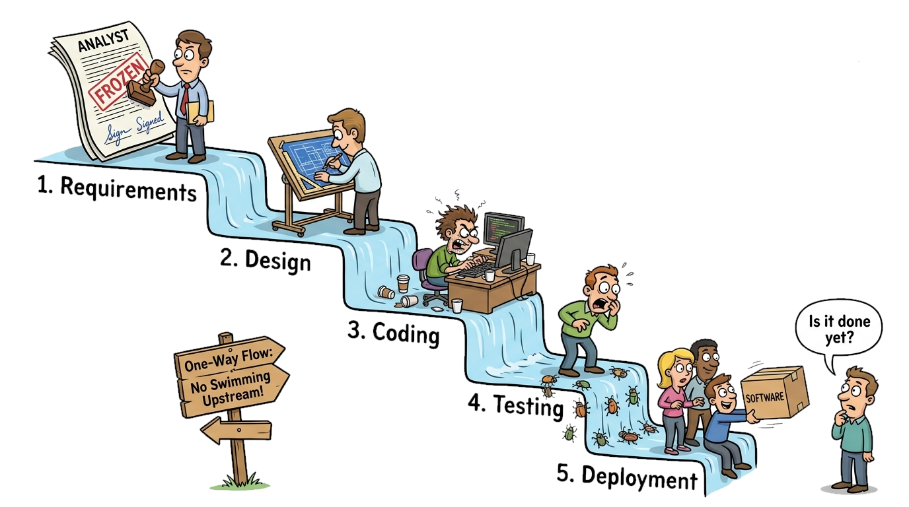
</div>

<!--
請看這幅瀑布軟體生命週期的架構圖解。

注意這如同瀑布從懸崖逐層傾瀉而下的嚴格階梯結構：從需求規格一路向下推進到設計、實作、驗證與維運。

為什麼這個模型在過去數十年被廣泛採用？因為對專案管理層而言，它提供了完美的進度可預測性幻覺！每個階段都有具體的文檔交付與簽核里程碑。

然而，這背後潛藏著巨大的致命陷阱：客戶直到第四階段末期才能第一次看到真正可運行的軟體！如果第一階段的需求理解有誤，這個災難性的錯誤將一直潛伏到最後整合測試才會爆發。

總結這張投影片，請記住這個核心觀念：瀑布模型提供了清晰的階段管理簽核，但將可運行的軟體交付與客戶真實回饋推遲到了專案的最末端。
-->
---
## 瀑布模型的適用情境與致命限制

<div class="two-columns">
<div class="card" data-marpit-fragment>

### 最佳適用情境 (When to Use)
* **需求高度穩定且清晰：** 幾乎不可能在開發期間發生變更的成熟領域。
* **大型跨組織工程合約：** 需要嚴格法律招標、分包廠商驗收的政府或軍事標案。
* **硬體與實體限制約束：** 嵌入式韌體開發，硬體規格一旦開模便無法修改。

</div>
<div class="card" data-marpit-fragment>

### 致命缺陷與主要限制 (Limitations)
* **「巨石延遲交付」陷阱：** 客戶直到最後一刻才看到軟體，早期毫無實體可用回饋。
* **對變更極度脆弱：** 開發後期變更需求代價高昂，極易引發災難性延期。
* **「大爆炸式」整合地獄：** 模組各自為政開發數月，在最後測試階段爆發無數隱蔽接口衝突。

</div>
</div>

<!--
這張投影片清楚對比了瀑布模型的優勢與陷阱。

它適用於需求極度穩固、外部合約分包嚴格的領域；

但對於現代大多數軟體而言，它的致命弱點是「大爆炸式整合地獄 (Big Bang Integration)」。每組人各自寫了半年的代碼，最後一個月合在一起測試，才發現架構假設完全對不上，導致專案陷入無休止的延期與崩潰。

總結這張投影片，請記住這個核心觀念：瀑布模型最大的風險在於延後了整合與客戶回饋，使隱藏缺陷的修復代價達到最大化。
-->
---
## 實務常見問題：瀑布模型真的死透了嗎？

* **Q1：現在業界還有人在用純瀑布模型嗎？**
  - **有，但僅限特定極端領域：** 鐵路號誌連鎖系統、核能電廠控制、人體植入式醫療晶片。在這些「不能承受一次當機」的場景中，瀑布模型搭配形式化方法 (Formal Methods) 仍是工業標準。
* **Q2：為什麼一般商務軟體全面揚棄純瀑布？**
  - 因為真實世界的「需求永遠在變動」！使用者往往「看到可以動的軟體之前，根本不知道自己真正要什麼」。瀑布模型假設需求能完美預測，違背了人類認知的基本規律。
* **Q3：瀑布模型留給現代軟體工程最重要的遺產是什麼？**
  - **結構化分析與架構思維：** 即使是現代最敏捷的團隊，在動工前依然需要清晰的架構概念與介面邊界思考，絕非盲目「隨性邊寫邊猜 (Vibe Coding)」。

<!--
很多同學常問：敏捷這麼流行，瀑布模型是不是已經徹底淘汰了？

答案是：沒有。

在國防武器、核能控制或醫療植入晶片領域，瀑布模型的嚴格前期驗證依然不可或缺。

但在消費級互聯網與企業應用中，純瀑布確實不適用了。因為軟體最大的特徵就是「變更」，而瀑布模型最害怕的也是「變更」。

總結這張投影片，請記住這個核心觀念：瀑布模型雖然不適合快速變動的業務，但它所傳承的深思熟慮與架構紀律依然是軟體工程的珍貴資產。
-->
---
### 觀念檢測：瀑布模型缺點 (CCQ 1)
<!-- id: ase-ch02-ccq1 -->

<div class="ccq-columns">
  <div class="ccq-text">

傳統瀑布模型在實務運作上最主要的核心缺點是什麼？

- **A.** 缺乏編譯器語法檢查工具導致單元測試無法自動化執行。
- **B.** 客戶直到開發週期最末期才能看到可運行的軟體，導致需求誤解極晚才被揭露。
- **C.** 強制要求所有工程師使用同一種程式語言進行全端開發。
- **D.** 完全不允許團隊撰寫任何形式的系統架構規格說明文件。

  </div>
  <div class="ccq-logo">
    <a href="https://nlhsueh.github.io/nickedupocket/#/student/ase-ch02-ccq1" target="_blank">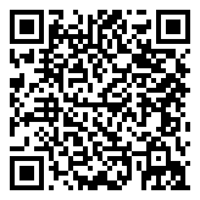</a>
  </div>
</div>

<!--
現在是第二章的第一題觀念檢測！請大家拿出手機掃描 QR Code 參與作答。

題目問：傳統瀑布模型在實務運作上最主要的核心缺點是什麼？

請看四個選項：
A：缺乏編譯器檢查工具。
B：客戶直到開發最末期才能看到可運行軟體，導致需求誤解極晚才被發現。
C：強制使用單一語言。
D：完全不准寫規格文檔。

請大家根據剛才的討論，投下你的答案！

（解析：正確答案是 B。瀑布模型最根本的痛點就是將真實可運行的軟體交付延後到了最末端，使得前期嚴重的溝通誤解一直潛伏到驗收測試才引爆。）

總結這張投影片，請記住這個核心觀念：延後可運行軟體的交付，是瀑布模型引發專案風險的根本病灶。
-->
---
## V-模型：前瞻性驗證與確認 (Proactive V&V)

* **V-模型的誕生目的：**
  - 改善傳統瀑布模型「只重設計、測試延後到最後」的致命弱點。
  - 將開發階段與對應的**測試驗證階段建立一一對應的對稱架構**。
* **V-模型的兩大靈魂維度：**
  - **左翼（分解與向下細化）：** 需求定義 → 系統設計 → 架構設計 → 模組實作。
  - **右翼（整合與向上組裝）：** 單元測試 → 整合測試 → 系統測試 → 驗收測試。
* **核心工程思維：**
  - **測試計畫左移：** 寫需求規格的當下，就同步設計驗收測試用例！
  - **雙向追溯性 (Traceability)：** 每一個測試用例都能追溯回特定需求條款；每一項需求都有對應的測試驗證機制。

<!--
為了解決瀑布模型測試過度延後的問題，工程界發展出了 V-模型 (V-Model)。

V-模型最美妙的地方在於它的對稱性：左邊是逐步細化的規格設計，右邊是逐步組裝的測試驗證。

請記住這句關鍵話：「測試計畫左移」。

當你在撰寫需求規格書時，你同時在寫驗收測試計畫；當你在設計模組介面時，單元測試用例就已經同步產出。這使得測試不再是事後補救，而是與設計並行的品質契約。

總結這張投影片，請記住這個核心觀念：V-模型透過對稱架構實現測試計畫左移，確立了需求規格與測試用例的嚴格雙向追溯。
-->
---
<!-- _class: title-image-slide -->

## 軟體 V-模型架構 (The Software V-Model Architecture)

<div class="image-wrapper">
  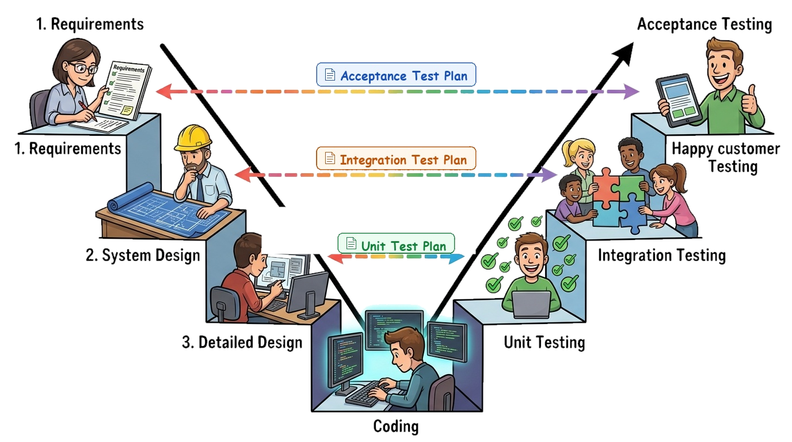
</div>

<!--
請仔細觀察這張經典的 V-模型架構圖。

左側是由上向下的「規格與設計分解 (Decomposition)」：從最高層級的使用者需求，細化到系統架構、模組細部設計，最終到達最底部的程式編程。

右側則是由下向上的「測試驗證與系統整合 (Integration & Validation)」：從最底部的單元測試，逐級向上組裝為整合測試、系統測試，最終由客戶進行驗收測試。

請注意連接左右兩翼的水平虛線：**每一層測試計畫，都是在對應的設計階段就已經提前定義好的！** 當你在寫使用者故事時，你同時在寫驗收測試標準；當你在定義系統架構時，整合測試用例就已經同步產出。

總結這張投影片，請記住這個核心觀念：V-模型的核心智慧在於「測試左移」與「雙向追溯」，讓測試計畫與設計規格同步孕育，杜絕盲目編程。
-->
---
## V-模型的架構：追溯性與測試層級

```
[使用者需求 User Requirements]  <-------- 驗收測試 (Acceptance Testing) --------> [客戶驗收驗證]
       |                                                                               ^
[系統規格 System Requirements]  <-------- 系統測試 (System Testing) ------------> [端到端系統整合]
       |                                                                               ^
[架構設計 Architecture Design]  <-------- 整合測試 (Integration Testing) -------> [模組子系統組裝]
       |                                                                               ^
[模組詳細設計 Detailed Design]   <-------- 單元測試 (Unit Testing) --------------> [個別函式模組]
       \                                                                               /
        --------------------------> [程式碼建構 Coding] --------------------------------
```

* **水平對應關聯：** 每個左側階段產出具體的「設計規格」以及對應右側的「測試計畫與用例」。
* **嚴格的品質把關閘門：** 低階單元測試未通過前，絕不允許進入高階整合測試，避免缺陷骨牌式擴散。

<!--
請看螢幕上這張水平對齊圖。

最頂層的使用者需求，直接對應最頂層的驗收測試：客戶親自確認系統是否解決了商業問題。

系統規格對應全系統的端到端系統測試：驗證效能、安全與邊界吞吐量。

架構設計對應整合測試：驗證各微服務與模組之間的 API 介面是否正確連通。

最底層的模組詳細設計，則由工程師撰寫單元測試守護。

這種分層清晰的對應關係，讓團隊能精準定位問題：當整合測試失敗時，我們知道是介面架構有誤，而不是去無頭蒼蠅般修改業務邏輯。

總結這張投影片，請記住這個核心觀念：V-模型將測試分級與設計階層嚴格綁定，建立了從單元到驗收的立體防禦體系。
-->
---
## V-模型的優勢、限制與適用領域

<div class="two-columns">
<div class="card" data-marpit-fragment>

### 核心優勢與適用領域 (Strengths)
* **極致嚴密的品質保證：** 大幅降低漏網之魚的逃逸缺陷率 (Defect Escape Rate)。
* **法規合規與審計驗證：** 航太 (DO-178C)、汽車電子 (ISO 26262)、醫療器材 (IEC 62304) 的法定標竿。
* **清晰明確的驗證邊界：** 每一位測試工程師都清楚知道自己負責的層級與驗收標準。

</div>
<div class="card" data-marpit-fragment>

### 本質限制與代價 (Limitations)
* **依然具備線性僵化本質：** 本質上仍是計畫驅動，一旦前期需求發生根本性變動，回溯重做的代價極其驚人。
* **高昂的前期文檔開銷：** 在寫任何程式碼前，需要產出數百頁規格書與測試矩陣。
* **不適合探索型專案：** 面對需求模糊的新創產品，過早定義測試用例只會造成大量浪費。

</div>
</div>

<!--
V-模型是安全關鍵領域的王者。

如果今天你要撰寫一輛特斯拉自駕車的煞車控制軟體，或者波音 787 客機的導航系統，V-模型是法規強制的標準做法。它所帶來的嚴密追溯性與可審計性，是敏捷便利貼無法提供的。

然而，它的缺點與瀑布模型相同：代價高昂、缺乏彈性。在新創商業環境中，過早撰寫數百頁測試矩陣只會拖垮團隊。

總結這張投影片，請記住這個核心觀念：V-模型是安全與生命關鍵系統的品質守護神，但其高昂的合規開銷使其不適用於需求易變的商務應用。
-->
---
### 觀念檢測：V-模型核心優勢 (CCQ 2)
<!-- id: ase-ch02-ccq2 -->

<div class="ccq-columns">
  <div class="ccq-text">

相較於傳統瀑布模型，V-模型在工程實務上最主要的核心優勢是什麼？

- **A.** 徹底消滅了對所有軟體需求規格說明文件的撰寫需求。
- **B.** 在左翼設計階段便同步定義並規劃對應的右翼測試驗證計畫（測試左移）。
- **C.** 完全保證所有軟體專案均能在預算的一半以內提早交付。
- **D.** 允許工程師隨意跳過單元測試而直接進行最終驗收測試。

  </div>
  <div class="ccq-logo">
    <a href="https://nlhsueh.github.io/nickedupocket/#/student/ase-ch02-ccq2" target="_blank">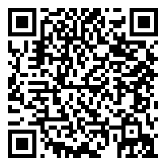</a>
  </div>
</div>

<!--
來看第二題觀念檢測！請大家掃描螢幕上的 QR Code。

題目問：相較於傳統瀑布模型，V-模型在工程實務上最主要的核心優勢是什麼？

選項：
A：消滅規格文檔。
B：在左翼設計階段便同步規劃對應的右翼測試計畫（測試左移）。
C：保證預算減半。
D：允許跳過單元測試。

請大家把握時間作答！

（解析：正確答案是 B。V-模型的最大工程貢獻在於測試左移——在定義需求的同時就設計驗收用例，在架構設計的同時就設計整合用例，建立了嚴密的雙向追溯。）

總結這張投影片，請記住這個核心觀念：V-模型的靈魂在於測試左移，讓品質驗證的思考走在程式實作之前。
-->
---
### 課堂互動討論：軟體流程模型配對挑戰（雙人小組討論）

<div class="discussion-columns">
  <div class="discussion-text">

  **軟體流程模型配對挑戰（請與鄰座同學進行雙人討論）：**
  - **系統 A（心臟起搏器韌體）：** 攸關人命、需通過美國 FDA 嚴格認證、不容許任何執行階段崩潰。
  - **系統 B（校園外賣訂餐平台）：** 學生新創團隊開發、需搶在開學季三週內上線、商業模式尚未驗證。
  - **系統 C（無人無駕駛捷運號誌系統）：** 龐大機電整合、規格完全鎖定、一旦出錯將引發致命列車追撞。

  **課堂思考與討論：** 這三個系統分別應該採用「純瀑布」、「V-模型」還是「敏捷增量/疊代」？為什麼？

  </div>
  <div class="discussion-logo">
    
  </div>
</div>

<!--
現在請大家轉頭跟旁邊的同學組成雙人搭檔，進行三分鐘的「流程模型配對挑戰」。

螢幕上有三個真實世界系統：
第一個是心臟起搏器韌體；
第二個是大學生創業的校園外賣訂餐平台；
第三個是無人駕駛捷運號誌系統。

請討論：這三個專案各自應該採用什麼流程模型？如果選錯模型，會引發什麼毀滅性的災難？

三分鐘後我們請幾組同學分享。

總結這張投影片，請記住這個核心觀念：沒有最好的模型，只有最適合特定商業與安全約束的流程決策。
-->
---

**參考解答與講評要點 (Possible Answers & Debriefing Guide)：**

1. **系統 A（心臟起搏器韌體） → V-Model（或嚴格前置驗證的計畫驅動瀑布模型）**
   - *核心依據：* 生命安全關鍵（FDA Class III 醫療器材）。需求明確且不可妥協，法規強制要求從需求規格到臨床驗收測試具備 100% 雙向追溯矩陣 (RTM)。
   - *錯誤選型災難：* 若採敏捷/Vibe Coding，任何未經驗證的執行階段 Bug 都可能導致心跳停止，且術後召回韌體需進行高風險開胸手術。

2. **系統 B（校園外賣訂餐平台） → 敏捷調適 / 疊代增量模型 (Agile / MVP)**
   - *核心依據：* 高度市場不確定性、預算有限、迫切需要快速驗證商業假設。三週內先上線滑板型 MVP（如 Line Bot + 人工接單），再逐步自動化。
   - *錯誤選型災難：* 若採瀑布花三個月寫規格書，等系統做出來學生早已放寒假，創業資金燒光直接倒閉。

3. **系統 C（無人駕駛捷運號誌系統） → 經典瀑布模型 + V-模型（嚴密階段閘門合約）**
   - *核心依據：* 龐大政府採購與跨國機電整合，硬體軌道與車載電腦嚴格鎖定，必須有正式驗收里程碑簽核與責任分工。

<!--
好，我們來看配對結果：

心臟起搏器屬於醫療等級 Class III，必須選 V-模型。你必須向法規機構證明：每一條需求都有對應的嚴格測試用例。

校園外賣平台必須選敏捷 MVP。如果你花半年寫規格文檔，市場機會早就稍縱即逝了。先用最簡陋的架構上線驗證商業模式，才是正解。

捷運號誌系統涉及多國廠商機電組裝，必須採用計畫驅動瀑布搭配 V-模型，透過清晰的里程碑合約杜絕推諉。

總結這張投影片，請記住這個核心觀念：流程模型的選擇本質上是「風險管理」——管理的是變更風險，還是失效風險。
-->
---
<!-- _class: lead -->
<!-- header: '2.3 變革的機制' -->

# **2.3 變革的機制 (增量與疊代)**

> "Think big, start small, learn fast."  
> 「宏觀思考，微觀啟動，極速學習。」  
> — *Eric Ries (精實創業作者)*

<!--
我們進入單元 2.3：變革的機制——增量開發與疊代精煉。

許多人常把「增量 (Incremental)」和「疊代 (Iterative)」當作同義詞混為一談，但這兩者在軟體工程中代表著完全不同的架構演進思維。

搞懂這兩者的差別，是掌握敏捷精神與打造 MVP 的第一步。

總結這張投影片，請記住這個核心觀念：增量是功能模組的水平切片，疊代是系統品質與精細度的垂直深化。
-->
---
<!-- header: '2.3 變革的機制' -->

## 變革的機制 — 增量與疊代開發 (Incremental & Iterative Development)

傳統瀑布模型的最大痛點是「全部押在最後的大爆炸交付 (Big Bang Delivery)」。為了解決這個困境，軟體工程引入了兩大核心演進策略：

* **增量策略 (Incremental Strategy · 數量上的累加)：**
  - **理念：** 「將系統拆解為若干個功能切片，每次交付其中一部分完整的可運行功能。」
  - **關鍵特徵：** 每個增量都包含端到端的垂直功能（例如：先做購物車，再做金流，再做評論）。
* **疊代策略 (Iterative Strategy · 品質與精準度上的演化)：**
  - **理念：** 「先交付一個粗糙的全局系統，隨後在一次次的循環中逐步精煉品質與細節。」
  - **關鍵特徵：** 每次循環都涵蓋全系統，但每一次都比前一次更精確、更強固（雕刻家手法）。

<!--
請大家在腦海中建立清晰的區分：

增量就像是蓋房子：先蓋一樓，一樓可以住人；接著蓋二樓，最後蓋三樓。功能是一塊一塊加上去的。

疊代就像是畫一幅油畫：先畫整體草圖，接著上底色，然後細描輪廓，最後上光油。每一次都涵蓋整幅畫，但細節越來越豐富。

這兩種策略不是互斥的，而是相輔相成的。

總結這張投影片，請記住這個核心觀念：增量策略分批交付功能模組，疊代策略逐層深化系統品質。
-->
---
## 增量交付：垂直功能切片與價值分期

* **增量開發的核心架構原則：**
  - **垂直切片 (Vertical Slicing)，而非水平分層 (Horizontal Slicing)：**
    - **[反模式] 錯誤的水平切片：** 增量 1 做完所有資料庫綱要；增量 2 做完所有 API；增量 3 做前端畫面。*(使用者到最後一天前都看不到任何東西！)*
    - **[最佳實踐] 正確的垂直切片：** 增量 1 包含單一功能的 UI + API + DB（如：「使用者能註冊登入」）；這是一個完整可獨立驗證的價值切片！
* **增量交付帶來的巨大優勢：**
  - **早期商業回報 (Early ROI)：** 核心功能提早數個月投入市場營運，創造營收。
  - **降低專案總體崩盤風險：** 即使後續預算腰斬，已交付的增量依然具備獨立運行價值。
  - **最重要的優先級保護：** 最關鍵、最高風險的功能必然被安排在增量 1，及早暴露瓶頸。

<!--
請看什麼叫「垂直切片 (Vertical Slicing)」。

初學者最常犯的錯誤是水平切片：前兩個月只寫資料庫 schema，接下來兩個月只寫後端 controller，最後才接前端。這本質上還是瀑布模型！

真正的增量交付要求「垂直切穿」：UI 介面、商業邏輯、資料存取，全部打通！哪怕這個增量只能讓使用者做一件事——「註冊帳號」，它也是一個可以在真實環境運行的完整切片。

總結這張投影片，請記住這個核心觀念：真正的增量交付必須採取垂直切片，確保每個交付物都具備端到端的獨立驗證價值。
-->
---
<!-- _class: title-image-slide -->

## 增量交付流程 (The Incremental Delivery Process)

<div class="image-wrapper">
  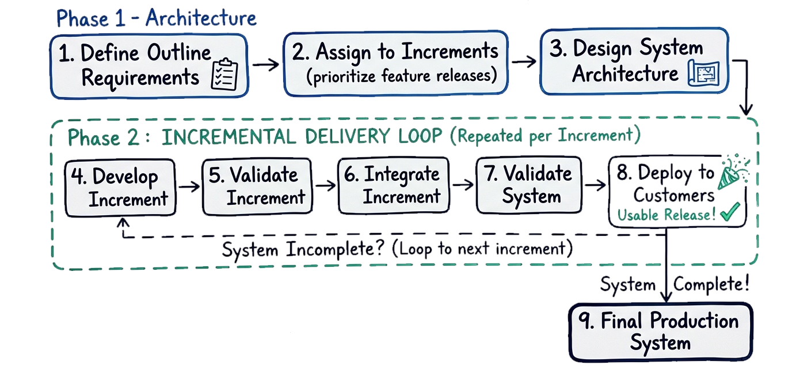
</div>

<!--
請看這幅增量交付的手繪流程圖。

傳統計畫驅動瀑布模型要求先完整定義所有需求，而增量交付則採取了截然不同的策略：

在最開頭，我們只界定一個全局架構藍圖；接著，我們將龐大的系統依據商業價值切割為若干個清晰的增量 (Increment 1, 2, 3...)。

每個增量內部都獨立經歷設計、實作、整合與測試，並直接交付至生產環境！

增量 1 上線後，使用者立刻能享受基礎核心功能並提供真實數據；隨後發布的增量 2 與增量 3 則持續堆疊新價值。早期交付不僅讓投資更早回本，更能讓市場及早檢驗產品方向。

總結這張投影片，請記住這個核心觀念：增量交付的核心精神在於「功能垂直分期」，讓客戶儘早取得具備真實價值的可運行軟體。
-->
---
## 疊代開發與雕刻家隱喻 (The Sculptor Analogy)

* **雕刻家的隱喻 (The Sculptor Analogy · Jeff Patton)：**
  - 想像一位雕刻大師要雕塑一尊大衛像：
    - 他**絕不是**先雕刻出完工度 100% 的大拇指，再雕刻手腕，再雕刻手臂！
    - 他首先鑿出大衛的大致人形輪廓（低精細度但具備全局視野）；接著修飾身軀比例；隨後精雕肌肉紋理；最後拋光面部神情。
* **疊代開發在軟體中的具體實踐：**
  - **第 1 次疊代（粗胚原型）：** 文字終端介面或粗糙 Mock 畫面，驗證核心演算法與資料庫關聯邏輯是否正確。
  - **第 2 次疊代（可用版本）：** 補齊基礎 UI 與主要正常流程 (Happy Path)，進行初步可用性測試。
  - **第 3 次疊代（生產就緒）：** 強化極端異常防護、效能調優、無障礙支援與安全性加固。

<!--
請牢記這個生動的隱喻：雕刻家手法。

如果雕刻家先把一隻手指雕刻得栩栩如生，最後卻發現整尊雕像的手臂比例算錯了，那隻手指就成了完全的浪費。

軟體開發也是如此。我們應該先讓系統以最粗糙的形式「端到端跑通」，驗證資料流與核心演算法；接著逐步改善架構、提升效能、加固安全性。

這就是疊代精煉的智慧。

總結這張投影片，請記住這個核心觀念：疊代精煉拒絕局部的過早優化，堅持先求全局走通、再求精益求精。
-->
---
<!-- _class: title-image-slide -->

## 價值交付 vs. 精細度疊代：雕刻家隱喻 (The Sculptor Analogy)

<div class="image-wrapper">
  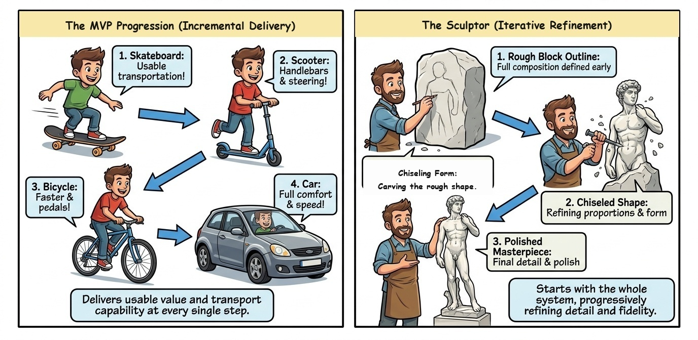
</div>

<!--
請看這幅著名的雕刻家隱喻漫畫。

對比兩種截然不同的思維模式：

在上半部，團隊試圖透過構建孤立的零件來打造產品：第一步只打造一顆車輪，第二步造輪軸，第三步造車身。在最後組裝完成前，這些零件對使用者毫無任何價值！你無法騎著一顆單獨的輪胎去上班。

而在下半部，雕刻家手法則從一個完整但粗糙的端到端解決方案開始：一塊滑板！它雖然簡陋，但具備即時的代步價值！使用者可以直接使用並給予真實回饋。接著逐步演進為滑板車、腳踏車、摩托車，最終進化為完美的汽車。

總結這張投影片，請記住這個核心觀念：疊代開發的精髓在於儘早交付具備端到端完整價值的可用產品，並依據真實使用回饋逐步精煉系統品質。
-->
---
## 結合模型 (增量 + 疊代) 與最小可行產品 (MVP)

> 在真實世界的敏捷工程中，我們極少單獨使用純增量或純疊代。我們將兩者**深度結合**，打造**最小可行產品 (Minimum Viable Product · MVP)**。

* **何謂最小可行產品 (MVP)？**
  - Eric Ries《*精實創業 (The Lean Startup)*》定義：*「能讓團隊以最小心力，換取對客戶最大化『經過驗證的學習 (Validated Learning)』之產品版本。」*
* **增量與疊代的強大加乘綜效：**
  - **版本間進行疊代深化：** 每次發布都覆蓋端到端價值，從粗胚逐步走向精緻。
  - **功能間進行增量擴充：** 當核心功能獲得市場驗證後，再橫向追加相鄰模組（註冊登入 → 購物結帳 → 推薦系統）。
* **「從滑板到汽車」的經典隱喻 (Henrik Kniberg)：**
  - *不是：* 零件孤島組裝（輪胎 → 底盤 → 車殼 → 汽車）。
  - *而是：* 交通工具能力漸進（滑板 → 滑板車 → 腳踏車 → 摩托車 → 汽車）。
  - **在每一步驟中，客戶都能真正代步出行！**

<!--
在實務工程中，頂尖軟體團隊會將增量交付與疊代精煉完美結合。

這種結合誕生了現代產品工程中最著名的概念：最小可行產品 (MVP)。

由 Frank Robinson 提出、Eric Ries 發揚光大的 MVP，是能交付真實價值、並讓團隊以最小心力向真實使用者學習的最精簡版本。

記住 Henrik Kniberg 的經典漫畫：如果使用者需要代步工具，別在第一衝刺給他一顆輪胎，他無法騎著輪胎去上班！

給他一塊滑板！滑板雖然簡陋，但能解決代步痛點。根據他的使用回饋，你再逐步將其升級為滑板車、腳踏車，最終進化為汽車。

總結這張投影片，請記住這個核心觀念：MVP 結合增量功能與疊代精煉，在保持軟體可用的前提下最大化驗證學習。
-->
---
<!-- _class: title-image-slide -->

## 增量與疊代 MVP 漸進演化 (Incremental & Iterative MVP Progression)

<div class="image-wrapper">
  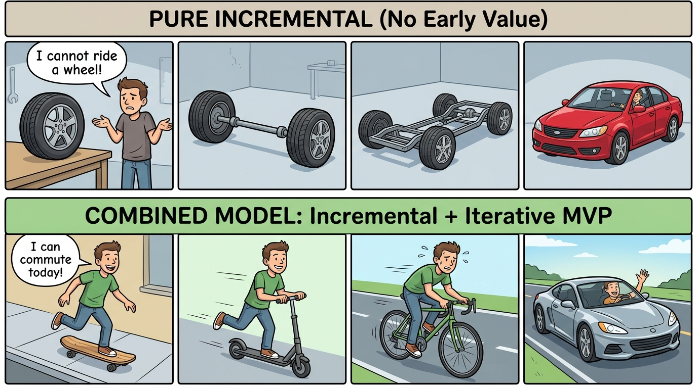
</div>

<!--
這是敏捷大師 Henrik Kniberg 著名的 MVP 對比經典圖解。

上半部：「千萬不要這樣做 (Not like this!)」
第一步造了一顆輪子，客戶感到沮喪，因為輪子根本無法代步；
第二步造了兩顆輪子加底盤，依然完全無法使用；
第三步造了沒有引擎的空車殼，客戶憤怒已達頂點；
直到第四步汽車才終於能開。然而因為前三階段完全沒有真實上路回饋，打造出來的很可能是客戶根本不想要的產品！

下半部：「正確做法 (Like this!)」
第一步：先造滑板。客戶立刻能移動！他們會回饋：「速度可以，但我無法轉向控制。」
第二步：加上龍頭手把成為滑板車。「轉向很好，但我腳滑得很痠。」
第三步：加上踏板與座椅成為腳踏車。「非常棒！但爬坡時太費力了。」
第四步進化為摩托車，第五步最終交付一輛完美的汽車。

在每一步驟中，軟體都是可運行的、經過完整測試的，並且源源不絕地產生真實商業學習。

總結這張投影片，請記住這個核心觀念：真正的敏捷交付是在每次疊代中，都持續產出可被使用者實際操作的端到端切片。
-->
---
## 增量能單獨套用嗎？外送平台實戰案例

許多初學者常困惑：「如果我只做增量、不做疊代，行得通嗎？」讓我們用外送平台 (UberEats / Foodpanda) 來剖析：

* **純增量模式（無疊代精煉）：**
  - **第 1 個月：** 交付完工度 100% 的使用者帳號密碼註冊系統（包含兩步驟驗證、頭像上傳、社群綁定）。
  - **結果：** 使用者可以完美註冊帳號，但**無法看菜單、無法訂餐、無法付錢！** 商業價值為 0。
* **結合模式 (MVP 增量 + 疊代)：**
  - **第 1 個月 MVP：**
    - 帳號系統採最簡版（只要輸入手機號碼發簡訊驗證碼）。
    - 菜單系統採純靜態圖片清單。
    - 金流系統直接採貨到付款現金結帳。
  - **結果：** 系統雖然粗糙，但**上線第一天就能開始接單外送、創造現金流！** 隨後再依營運數據逐步疊代進化。

<!--
這是一個極度經典的思維對比。

如果只做純增量，你在第一個月花盡心血把「註冊功能」做到世界第一，支援十種社群登入與臉部辨識。但使用者登入之後發現：不能看菜單、不能點餐、不能付費！這家新創公司第一個月就倒閉了。

而結合 MVP 思維的團隊，第一個月用最陽春的架構把「註冊、瀏覽、下單、結帳」四個環節全部打通！哪怕結帳只能選貨到付款現金，這個平台從第一天就開始產生營收與真實訂單數據。

總結這張投影片，請記住這個核心觀念：孤立的功能完備毫無意義，商業端到端閉環的粗糙 MVP 遠勝局部的完美零件。
-->
---
### 觀念檢測：增量與疊代本質差異 (CCQ 3)
<!-- id: ase-ch02-ccq3 -->

<div class="ccq-columns">
  <div class="ccq-text">

在軟體流程工程中，「增量 (Incremental)」與「疊代 (Iterative)」開發的根本觀念差異為何？

- **A.** 增量是逐期交付不同的功能子集；疊代是跨循環逐步精煉軟體的品質與細緻度。
- **B.** 增量專門用於硬體韌體驅動；疊代專門用於前端網頁開發。
- **C.** 增量不允許團隊編寫單元測試；疊代強制要求所有測試由客戶親自執行。
- **D.** 增量模型完全不產生任何程式碼；疊代模型完全依賴傳統甘特圖進行時程管理。

  </div>
  <div class="ccq-logo">
    <a href="https://nlhsueh.github.io/nickedupocket/#/student/ase-ch02-ccq3" target="_blank">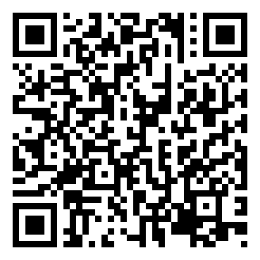</a>
  </div>
</div>

<!--
來看第三題觀念檢測！請大家掃描 QR Code。

題目問：在軟體流程中，「增量」與「疊代」開發的根本差異為何？

請看四個選項：
A：增量是逐期交付不同功能子集；疊代是跨循環逐步精煉品質與精細度。
B：增量用於韌體，疊代用於網頁。
C：增量不寫測試，疊代由客戶測。
D：增量不產生代碼，疊代依賴甘特圖。

請大家根據雕刻家與垂直切片的隱喻，選出正確答案！

（解析：正確答案是 A。增量關注功能範疇的水平累加，疊代關注系統品質與架構深度的垂直精煉。）

總結這張投影片，請記住這個核心觀念：增量擴展功能廣度，疊代深化品質精度，兩者結合方能構成真正的 MVP。
-->
---
### 觀念檢測：MVP 輪子反模式 (CCQ 4)
<!-- id: ase-ch02-ccq4 -->

<div class="ccq-columns">
  <div class="ccq-text">

在 Henrik Kniberg 著名的最小可行產品 (MVP) 隱喻中（從滑板到汽車），為什麼在第一期只打造一顆「獨立完工的汽車車輪」被嚴厲判定為失敗的反模式？

- **A.** 橡膠輪胎製造過程所產生的碳排放量遠高於木質滑板。
- **B.** 獨立車輪無法提供任何可運行的代步價值，無法讓使用者驗證並產生實質回饋。
- **C.** 國際軟體工程學會嚴格規定汽車零組件必須採用 C++ 撰寫。
- **D.** 軟體專案若包含實體機械零件便會直接喪失敏捷開發資格。

  </div>
  <div class="ccq-logo">
    <a href="https://nlhsueh.github.io/nickedupocket/#/student/ase-ch02-ccq4" target="_blank">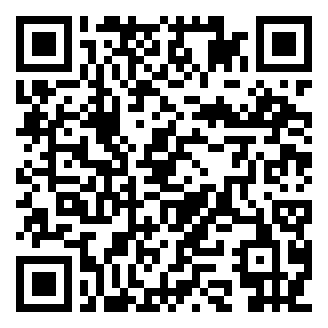</a>
  </div>
</div>

<!--
第四題觀念檢測！請掃描螢幕上的 QR Code。

題目問：在從滑板到汽車的 MVP 隱喻中，為什麼在第一衝刺只打造一顆「完美的汽車輪胎」是失敗的反模式？

請看選項：
A：輪胎碳排放高。
B：單獨車輪無法提供可運行的代步價值，無法讓使用者驗證並產生回饋。
C：法規規定必須用 C++。
D：包含機械零件喪失敏捷資格。

（解析：正確答案是 B。敏捷的核心是每個衝刺都要產出 Working Software。孤立的零件無法讓客戶體驗與測試，失去了敏捷早期驗證的意義。）

總結這張投影片，請記住這個核心觀念：無法被使用者獨立操作的零件不是 MVP，真正的敏捷交付必須具備端到端可用價值。
-->
---
### 課堂互動討論：西洋棋 App 切片演練（分組討論）

<div class="discussion-columns">
  <div class="discussion-text">

  **西洋棋 App 增量與疊代切片實戰（請與鄰座同學組隊）：**
  你正帶領團隊開發一款跨平台線上「西洋棋 (Chess) App」。
  - **問題一（增量切片）：** 請規劃 4 個增量，每個增量都必須是「端到端可運行」的功能切片。
  - **問題二（疊代精煉）：** 對於同一個西洋棋盤介面，你會如何在三次疊代中逐步加深其品質？
  - **問題三（反模式警示）：** 什麼樣的規劃會落入「只做增量、缺乏疊代」的孤立車輪反模式陷阱？

  *請進行三分鐘討論，稍後將邀請各組代表分享切片策略！*

  </div>
  <div class="discussion-logo">
    
  </div>
</div>

<!--
現在進行分組討論！請大家與旁邊同學組隊，我們來實際做一次「西洋棋 App」的敏捷切片演練。

假設你們要在一個學期內做出一個西洋棋 App。

問題一：你們會怎麼切出四個增量，讓每個增量在發布當天都能被拿來玩？
問題二：同一個棋盤畫面，你們會如何透過三次疊代由粗胚走向精緻？
問題三：怎樣的做法會不小心變成「只造出孤立車輪」的瀑布反模式？

請討論三分鐘！

總結這張投影片，請記住這個核心觀念：切片能力是敏捷架構師的核心硬實力，決定了專案是小步快跑還是中途夭折。
-->
---

**參考解答與講評要點 (Possible Answers & Debriefing Guide)：**

1. **問題一 — 增量切片 (階段性交付完成的功能垂直切片)：**
   - *增量 1（可玩的單機核心）：* 2 人在同一螢幕輪流下棋。8x8 棋盤表示、基礎合法走步（兵、馬、車、象、后、王）、回合切換、吃掉國王即獲勝。（第一天就交付端到端可玩！）。
   - *增量 2（完整規則與計時器）：* 將軍與將死判定、王車易位、吃過路兵、走步歷史記錄 (PGN 匯出) 與倒數計時棋鐘。
   - *增量 3（單人 AI 對戰）：* 具備難度調整的 AI 虛擬對手，使用啟發式 Minimax / Alpha-Beta 剪枝演算法或串接 Stockfish API。
   - *增量 4（線上多人連線）：* WebSocket 即時多人對戰大廳、房間對戰碼、使用者帳號系統與 Elo 天梯積分配對。

2. **問題二 — 疊代精煉 (跨循環深化品質與使用者體驗)：**
   - *疊代 1（功能原型 / ASCII）：* 終端機純文字網格或基礎 HTML 表格，驗證座標運算與棋盤狀態邏輯。
   - *疊代 2（互動 Canvas / SVG）：* 2D 響應式棋盤搭配 SVG 向量棋子、點擊移動互動與合法走步亮點提示。
   - *疊代 3（極致精緻體驗）：* 流暢的拖曳棋子動畫、移動/吃子/將軍音效、預先走步佇列與螢幕報讀無障礙支援。

3. **問題三 — 反模式（「缺乏疊代的單純增量」/ 孤立車輪陷阱）：**
   - *反模式現象：* 在組裝整合前，將個別組件打磨到 100% 完美——例如在尚未實作棋子移動邏輯前，耗費八週打造 3D 超逼真棋子模型與光影著色器。
   - *引發災難：* 團隊最終產出一堆孤立、無法讓真實玩家測試的華麗素材，在交付期限前夕進行整合時全面崩潰。

<!--
總結這張投影片，請記住這個核心觀念：增量切片逐塊交付功能特性，而疊代精煉則透過連續的使用者回饋不斷深化品質與體驗。
-->
---
<!-- _class: lead -->
<!-- header: '2.4 思維轉變 (敏捷哲學)' -->

# **2.4 思維轉變 (敏捷哲學)**

> "Responding to change over following a plan."  
> 「回應變更重於遵循計畫。」  
> — *The Agile Manifesto (2001)*

<!--
我們進入單元 2.4：思維轉變——敏捷哲學。

在 1990 年代末期，傳統龐大肥碩的軟體方法學讓無數專案陷入癱瘓。

2001 年，十七位頂尖軟體大師齊聚美國猶他州雪鳥滑雪勝地，共同起草了改變世界軟體工業軌跡的《敏捷宣言》。

敏捷絕不只是一堆管理工具，而是一場深層的文化與心智典範轉移。

總結這張投影片，請記住這個核心觀念：敏捷是一套優先重視人、可用軟體與適應力的心智模型與價值體系。
-->
---
<!-- _class: title-image-slide -->

## 思維轉變：傳統 vs. 敏捷哲學 (Traditional vs. Agile Philosophy)

<div class="image-wrapper">
  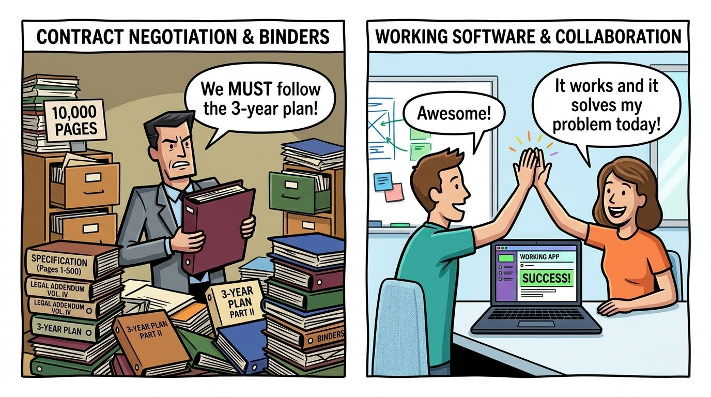
</div>

<!--
我們進入 2.4 節：思維轉變——敏捷哲學。

請看這幅幽默且深刻的漫畫。

在左側，是傳統計畫驅動的專案經理：「我們必須嚴格按照六個月前凍結的甘特圖走！任何變更都是對專案時程的背叛！」工程師們埋頭苦幹，卻發現外界市場與使用者需求早就發生翻天覆地的變化。

而在右側，是敏捷團隊的文化氛圍：開發者與客戶並肩而坐，白板上貼滿了使用者故事與衝刺便簽。當新需求出現時，團隊微笑以對：「太好了！這項變更讓我們能為使用者帶來更高的商業競爭力！」

敏捷的核心從來不是 Jira 看板，也不是每日站立會議的繁文縟節，而是一種「擁抱變革、協同合作、小步快跑」的深層文化思維。

總結這張投影片，請記住這個核心觀念：敏捷哲學的本質在於將未知的外部變革視為創造商業價值的良機，而非專案管理的敵人。
-->
---
<!-- header: '2.4 思維轉變 (敏捷哲學)' -->

## 思維轉變 — 敏捷哲學 (The Mindset Shift)

> 敏捷**絕不是**一套繁文縟節的官僚規範、一個 Jira 追蹤看板，或是一堆開不完的站立會議。敏捷是一種統攝全局的**文化思維與價值體系**：它將**人、可運行的軟體、客戶協同與變革適應力**，置於僵化計畫之上。

* **歷史背景：1990 年代的軟體危機再現：**
  - 重型計畫驅動流程導致大量專案災難性崩潰（Standish Group 著名的混沌報告：逾 70% 專案延期、超支甚至取消）。
  - 商業世界進入網際網路時代，需求每週都在變更，六個月的規格凍結期注定讓產品「上線即落後」。
* **雪鳥會議的歷史歷史創舉 (2001 年 2 月)：**
  - 17 位軟體先驅（包含 Kent Beck, Ward Cunningham, Martin Fowler, Jeff Sutherland, Ken Schwaber 等人）於美國猶他州雪鳥召開會議。
  - 正式誕生了著名的**《敏捷軟體開發宣言 (Agile Manifesto)》**。

<!--
請大家體會敏捷誕生的歷史脈絡。

在 1990 年代，傳統重型軟體工程方法學（如 RUP）讓整個行業苦不堪言。每個專案在動工前都要寫幾十本厚重的規格書，等到系統做出來，市場早就滄海桑田了。

這十七位大師聚在一起，拋棄了彼此工具上的門戶之見，提煉出了軟體開發最核心的人性與工程本質。

總結這張投影片，請記住這個核心觀念：敏捷是為了打破重型流程的僵化泥淖而誕生，是一場回歸人、代碼與適應力的工程革命。
-->
---
## 敏捷宣言：四大核心價值 (The 4 Core Values)

2001 年《敏捷宣言》確立了四對關鍵的價值取向：

1. **個人與互動 (Individuals and interactions)**  
 → 重於 **流程與工具 (processes and tools)**
2. **可運行的軟體 (Working software)**  
 → 重於 **詳盡的文檔 (comprehensive documentation)**
3. **客戶協同合作 (Customer collaboration)**  
 → 重於 **合約協商 (contract negotiation)**
4. **回應變更 (Responding to change)**  
 → 重於 **遵循計畫 (following a plan)**

> *「也就是說，儘管右項各具其價值，但我們更重視左項的價值。」*

<!--
這四行字是軟體工程史上最重要的經典文獻之一。

請注意大師們精確的用詞：他們說的是「左項重於右項」，而不是「拋棄右項」！

敏捷團隊依然需要工具，但人的溝通效率高於工具；
敏捷團隊依然需要文檔，但代碼能正常運行才是最高真理；
敏捷團隊依然需要合約，但與客戶建立長期信任協同才是核心；
敏捷團隊依然需要計畫，但當現實與計畫衝突時，擁抱變更才是正道。

總結這張投影片，請記住這個核心觀念：敏捷宣言不是否定流程與文檔，而是在價值衝突時堅定選擇以人、代碼與適應力為先。
-->
---
<!-- _class: title-image-slide -->

## 敏捷宣言：天平上的四大核心價值 (The Agile Manifesto on the Balance Scale)

<div class="image-wrapper">
  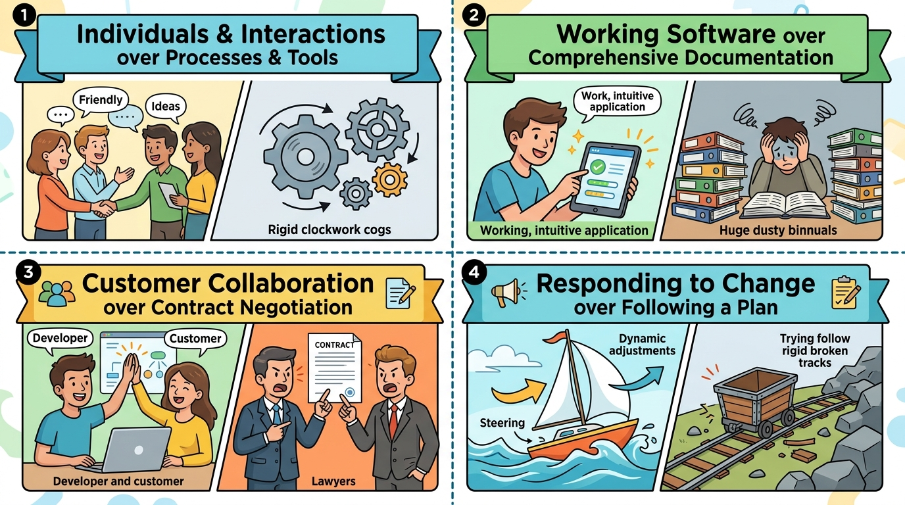
</div>

<!--
請看這座代表敏捷宣言四大核心價值的黃金天平。

天平左側是敏捷極度推崇的四大核心：
「個人與互動」、「可運行的軟體」、「客戶協同合作」與「回應變更」。

天平右側則是傳統專案所強調的要素：
「流程與工具」、「詳盡的文檔」、「合約協商」與「遵循計畫」。

請務必記住敏捷宣言最末尾的那句關鍵銘文：『也就是說，儘管右項各具其價值，但我們更重視左項的價值。』

敏捷從未否定文檔或計畫的價值；但敏捷嚴肅告誡我們：文檔再詳盡，若軟體無法運行便毫無意義；計畫再完美，若無法回應市場變更終將走向滅亡。

總結這張投影片，請記住這個核心觀念：敏捷天平指引了工程價值的優先級——將人、可用代碼與適應力置於僵化合約之上。
-->
---
## 敏捷軟體開發十二項原則 (The 12 Principles)

<div class="two-columns">
<div class="card" data-marpit-fragment>

### 原則 1 – 6：客戶價值與團隊協同
* **1. 早期且持續交付：** 最高優先是透過提早且持續交付有價值的軟體來滿足客戶。
* **2. 擁抱變更：** 即使在開發晚期，亦歡迎變更需求。
* **3. 頻繁交付可用軟體：** 週期從數週到數月，以較短週期為優。
* **4. 業務與開發緊密協同：** 業務人員與開發人員必須每天一起工作。
* **5. 激勵並信任團隊：** 圍繞具備積極動力的個人建構專案，給予環境與支援並給予充分信任。
* **6. 面對面溝通：** 團隊內部傳遞資訊最有效率的方法是面對面交談。

</div>
<div class="card" data-marpit-fragment>

### 原則 7 – 12：工程紀律與自我組織
* **7. 可運行軟體是進度的主要度量：** 衡量專案進度的唯一真實標準是可運行的軟體。
* **8. 維持可持續的步調：** 提倡穩定的開發節奏，發起人、開發者和使用者應能長期維持恆常步調。
* **9. 追求卓越技術與優良設計：** 持續關注技術卓越與簡潔架構以增強敏捷度。
* **10. 簡約為本 (Simplicity)：** 努力極大化「未完成工作量」的藝術。
* **11. 自我組織團隊：** 最好的架構、需求和設計皆出自自我組織的團隊。
* **12. 定期反省調校：** 團隊定期反思如何更有效率，並相應調整行為。

</div>
</div>

<!--
敏捷宣言只有四句話，但這十二條原則則是具體指導日常實踐的行動方針。

請看左側的協同原則：每天與業務並肩作戰、頻繁交付、面對面交談。

再看右側的工程原則：第七條說進度的唯一度量是 Working Software；第八條強調可持續步調，反對長期無效加班；第十條強調簡約為本（盡可能消滅不必要的工作）；第十二條則是每期必開的回顧會議。

總結這張投影片，請記住這個核心觀念：十二條原則將抽象的敏捷價值轉化為具體的團隊協同、技術追求與持續反省行動。
-->
---
### 觀念檢測：敏捷價值實踐 (CCQ 5)
<!-- id: ase-ch02-ccq5 -->

<div class="ccq-columns">
  <div class="ccq-text">

敏捷宣言宣稱：*「可運行的軟體重於詳盡的文檔。」* 這項價值在實務工程中主要倡導何種行為？

- **A.** 團隊完全不應該撰寫任何 API 規格文件、架構圖或使用者說明書。
- **B.** 專案進度的核心驗收指標必須是真正經過測試且可運行的軟體，而非紙本規格審查通過。
- **C.** 所有軟體工程師都應該直接把未經編譯的原始碼丟給客戶自行安裝。
- **D.** 只要代碼寫得出來，團隊就完全不需要理會任何資訊安全或資料庫備份規範。

  </div>
  <div class="ccq-logo">
    <a href="https://nlhsueh.github.io/nickedupocket/#/student/ase-ch02-ccq5" target="_blank">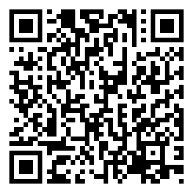</a>
  </div>
</div>

<!--
來看第五題觀念檢測！請大家掃描 QR Code。

題目問：敏捷宣言說「可運行的軟體重於詳盡的文檔」，主要倡導何種實務行為？

選項：
A：完全不寫文檔。
B：專案進度的核心指標必須是經過測試、可運行的軟體，而非厚重的紙本審查。
C：把原始碼直接丟給客戶。
D：不用理會資安。

請投下你的答案！

（解析：正確答案是 B。傳統專案常以「規格書寫完 80%」來粉飾進度，而敏捷強調唯有代碼在測試環境中真正跑得通，才是真實的進度。）

總結這張投影片，請記住這個核心觀念：進度的真實度量只有一條標準——可運行的軟體，而非文檔的厚度。
-->
---
### 觀念檢測：可持續步調 (CCQ 6)
<!-- id: ase-ch02-ccq6 -->

<div class="ccq-columns">
  <div class="ccq-text">

敏捷原則第八條指出：*「敏捷流程提倡可持續的開發步調。發起人、開發者和使用者應能長期維持恆常穩定的步調。」* 這條原則最主要的工程目的為何？

- **A.** 確保開發團隊能在每一個週末都進行 48 小時不眠不休的黑客松衝刺。
- **B.** 避免團隊陷入長期疲勞燃燒 (Burnout) 與疲憊編程，防止低劣程式碼與技術債急劇滋生。
- **C.** 限制軟體系統在生產環境中的每秒最大請求數量 (QPS) 不得超過 100 次。
- **D.** 強制要求所有工程師每天工作必須嚴格滿 16 個小時以維持競爭優勢。

  </div>
  <div class="ccq-logo">
    <a href="https://nlhsueh.github.io/nickedupocket/#/student/ase-ch02-ccq6" target="_blank">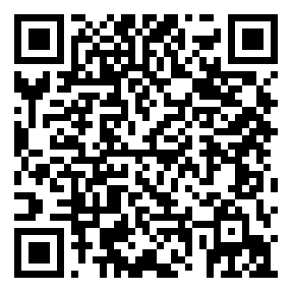</a>
  </div>
</div>

<!--
第六題觀念檢測！請掃描 QR Code。

題目問：敏捷原則第八條提倡「可持續的開發步調 (Sustainable Pace)」，其最主要的工程目的是什麼？

選項：
A：週末 48 小時黑客松。
B：避免團隊陷入長期疲勞燃燒 (Burnout)，防止疲憊導致爛代碼與技術債暴增。
C：限制伺服器 QPS。
D：強制每天工作 16 小時。

（解析：正確答案是 B。軟體開發是高強度的智力活動。工程師在極度疲勞狀態下寫出的代碼充斥 Bug，後期排查修補的代價遠高於加班趕出的微小進度。）

總結這張投影片，請記住這個核心觀念：軟體工程是一場馬拉松而非百米短跑，穩健持續的節奏才能守護長期的代碼品質。
-->
---
<!-- _class: lead -->
<!-- header: '2.5 敏捷專案管理' -->

# **2.5 敏捷專案管理 (Scrum 與看板)**

> "Scrum establishes the cadence; Kanban optimizes the flow."  
> 「Scrum 建立了團隊協同的節奏；看板優化了價值交付的流動。」  

<!--
我們進入單元 2.5：敏捷專案管理——Scrum 與看板。

哲學如果沒有實踐的載體，就只是空談。

在當代軟體工業中，Scrum 和看板 (Kanban) 是落實敏捷哲學最廣泛的兩大專案管理框架。

我們將深入剖析它們的運作機制、核心角色與本質差異。

總結這張投影片，請記住這個核心觀念：Scrum 提供規律的時間盒節奏，看板提供靈活平穩的流動優化。
-->
---
<!-- _class: title-image-slide -->

## 敏捷專案管理：Scrum 衝刺 vs. 看板拉動流 (Scrum Sprints vs. Kanban Pull Flow)

<div class="image-wrapper">
  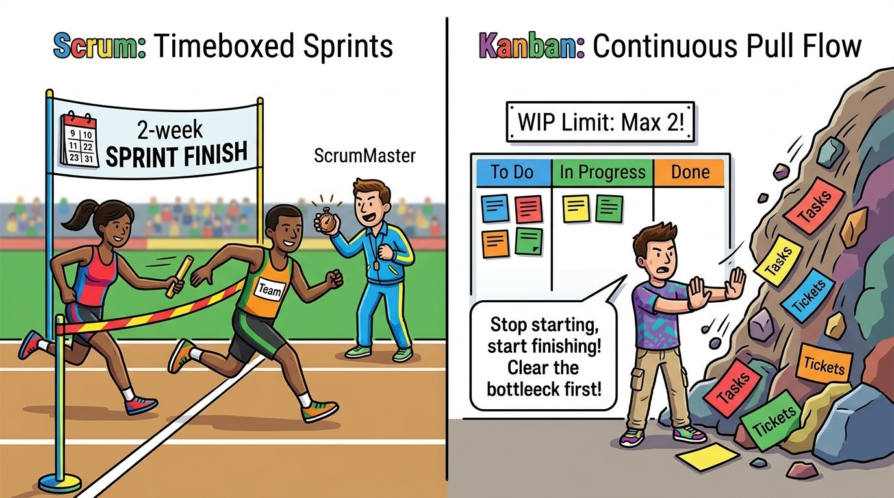
</div>

<!--
現在我們進入 2.5 節：敏捷專案管理——Scrum 與看板。

請看螢幕上這幅生動的對比漫畫。

在左側，是熱鬧緊湊的 Scrum 團隊：他們圍繞在衝刺看板前進行每日站立會議。Scrum 強調固定的時間盒 (Time-box) 律動——每兩週一輪衝刺，目標明確，齊心協力跨越終點線。

在右側，則是平穩流暢的看板 (Kanban) 團隊：任務便簽像流水一般，從左側的待辦清單，順暢地滑過進行中欄位，抵達完成端。看板的核心在於限制「在製品數量 (WIP)」，杜絕多工切換的認知耗損。

兩者都是極度強大的敏捷管理框架，各自適用於不同的業務場景與交付節奏。

總結這張投影片，請記住這個核心觀念：Scrum 提供節奏明確的時間盒衝刺律動，看板則提供靈活平穩的連續流動與 WIP 限制。
-->
---
<!-- header: '2.5 敏捷專案管理' -->

## 敏捷專案管理 — Scrum 與看板 (Agile Project Management)

> 敏捷專案管理框架的核心目的，在於組織團隊協同、確立交付節奏與視覺化追蹤進度。它們規範了**「工作如何被協調」**，但刻意對「程式碼如何被具體實作」保持沉默。

* **兩大主流框架的宏觀對照：**
  - **Scrum 框架（時間盒律動模式）：**
    - 採用固定時長（通常為 1 至 4 週）的**衝刺 (Sprint)**。
    - 衝刺期間**凍結範疇**，團隊專注於交付承諾的「潛在可發布增量」。
  - **看板框架（連續流動拉動模式）：**
    - **不設定固定衝刺週期**，工作以連續流動 (Continuous Flow) 的方式推進。
    - 透過嚴格限制**「在製品數量 (WIP Limit)」**，將瓶頸無所遁形地暴露出來。

<!--
請理解敏捷專案管理框架的定位：

Scrum 和看板管的是「任務與溝通的流程」，它們不管「代碼怎麼寫」。這既是它們容易推廣的優點，也是後續引發「疲軟 Scrum」的隱患。

Scrum 靠「時間盒」推進：兩週一輪，衝刺開始時承諾範疇，衝刺結束時驗收成果。

看板靠「拉動流」推進：只要團隊有空閒，就從左邊拉一張卡片做，限制在製品數量以防止塞車。

總結這張投影片，請記住這個核心觀念：Scrum 以固定時間盒創造節奏，看板以連續拉動流與 WIP 限制優化吞吐量。
-->
---
## Scrum 框架：核心角色、工件與完成定義

* **三大神聖角色 (The 3 Roles)：**
  - **產品負責人 (Product Owner · PO)：** 決定「做什麼 (What)」，最大化產品商業價值，全權維護產品待辦清單的優先級。
  - **Scrum 專家 (Scrum Master · SM)：** 流程守護者與僕人式領導者，掃除團隊推進障礙，保護團隊不受外部干擾。
  - **開發團隊 (Developers)：** 決定「怎麼做 (How)」，跨職能且自我組織，共同為增量品質負責。
* **三大核心工件 (The 3 Artifacts)：**
  - **產品待辦清單 (Product Backlog)：** 依商業價值排序的全局功能需求清單。
  - **衝刺待辦清單 (Sprint Backlog)：** 本次衝刺承諾完成的任務子集與實作計畫。
  - **產品增量 (Increment)：** 衝刺結束時產出且**符合「完成定義 (DoD)」**的可用軟體。

<!--
Scrum 的結構非常嚴謹，由三三四構成：三種角色、三個工件、四大儀式。

三種角色各司其職：PO 管商業價值，SM 管流程順暢與排除障礙，開發團隊管技術實作。

請特別注意「完成定義 (Definition of Done，簡稱 DoD)」：它不是「我寫完代碼了」，而是包含單元測試全過、代碼審查通過、自動化 CI 構建成功、整合環境驗證完畢。唯有滿足 DoD，才能被稱為真正的產品增量。

總結這張投影片，請記住這個核心觀念：Scrum 透過角色權責制衡與嚴格的完成定義，確保每次衝刺產出的都是具備生產品質的可用軟體。
-->
---
<!-- _class: title-image-slide -->

## Scrum 框架完整生命週期 (The Complete Scrum Framework Lifecycle)

<div class="image-wrapper">
  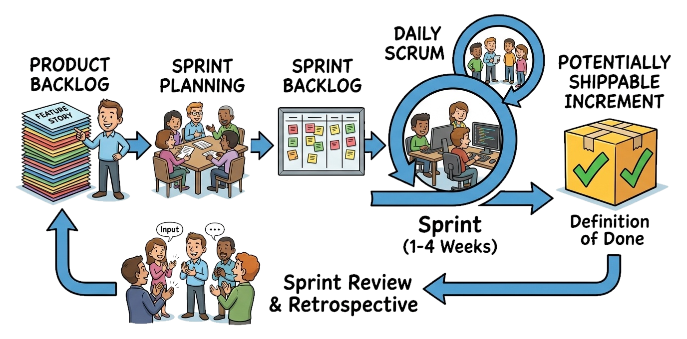
</div>

<!--
請看這幅完整的 Scrum 生命週期循環圖。

整個循環從產品負責人 (PO) 維護的「產品待辦清單 (Product Backlog)」啟動。

衝刺開始時，召開「衝刺規劃會議」，團隊從中挑選並拆解出本衝刺承諾交付的「衝刺待辦清單 (Sprint Backlog)」。

在接下來 1 到 4 週的固定「衝刺時間盒 (Sprint)」內，團隊每天舉行 15 分鐘的「每日站立會議」，校準進度並排除障礙。

衝刺結束時，產出符合「完成定義 (DoD)」的潛在可發布產品增量！隨後召開兩大關鍵會議：對外的「衝刺審查會議」向客戶展示成果；對內的「衝刺回顧會議」反思團隊協同流程並提出具體改進。

總結這張投影片，請記住這個核心觀念：Scrum 透過三種角色、三個工件與四大儀式，構建出兼具透明度、檢驗與調適的閉環生命週期。
-->
---
## Scrum 四大儀式與衝刺律動節奏

* **1. 衝刺規劃會議 (Sprint Planning · 衝刺第 1 天)：**
  - PO 說明價值目標；開發團隊評估工作量，共同承諾本次衝刺待辦清單。
* **2. 每日站立會議 (Daily Scrum · 每天 15 分鐘)：**
  - 開發團隊聚焦當日目標，回答三問題：*昨天做了什麼？今天打算做什麼？遇到什麼阻礙？*
* **3. 衝刺審查會議 (Sprint Review · 衝刺最後一天)：**
  - **對外成果展示：** 邀請利害關係人與客戶實際操作可運行的軟體增量，蒐集真實回饋。
* **4. 衝刺回顧會議 (Sprint Retrospective · 衝刺最末尾)：**
  - **對內流程自我檢討：** 團隊內部坦誠檢視協同障礙，制定下一衝刺的**具體流程改進行動**。

<!--
這四大儀式構成了 Scrum 的心跳節奏。

很多團隊把每日站立會議開成向主管報告進度的冗長會議，這是完全錯誤的。站會是開發人員之間的快速同步，核心在於暴露障礙！

而四大會議中最容易被敷衍、卻最重要的一場，是最後的「回顧會議 (Retrospective)」。敏捷之所以能夠進化，正是因為團隊每兩週給自己一個小時，停下來反思流程中的痛點並立即改進。

總結這張投影片，請記住這個核心觀念：四大儀式是團隊的校準節奏，其中回顧會議是推動團隊持續進化與自我調適的靈魂。
-->
---
## 看板框架：持續流動與拉動系統 (Pull Systems)

* **起源與哲學（源自豐田精益生產體系 Toyota Production System）：**
  - 強調**「價值流動 (Flow)」**與**「消滅浪費 (Muda)」**。
  - 將不可見的軟體工程知識工作，轉化為物理看板上清晰可見的卡片流動。
* **看板的四大核心實踐：**
  1. **工作流程視覺化 (Visualize the Workflow)：** 清晰劃分分析、開發、審查、測試與部署各個階段。
  2. **限制在製品數量 (Limit Work in Progress · WIP)：** 強制規定每個階段同時進行的工作卡片上限。
  3. **度量與管理流動 (Manage Flow)：** 追蹤週期時間 (Cycle Time) 與交付前置時間 (Lead Time)。
  4. **顯式化流程規則 (Make Policies Explicit)：** 明確界定卡片何時才能被拉入下一個欄位。

<!--
我們來看另一大流派：看板 (Kanban)。

看板源自日本豐田汽車的精益生產哲學。它不搞固定時間盒衝刺，而是追求「像流水一樣源源不絕的價值流動」。

軟體開發最可怕的是「隱蔽的多工」：每位工程師手頭上同時開工三四個功能，結果沒有一個能在兩週內真正完成！

看板透過將工作視覺化，並強行規定每個欄位只能同時放幾張卡片，逼迫團隊把焦點放在「完成」而非「開始」。

總結這張投影片，請記住這個核心觀念：看板的核心哲學在於工作視覺化與嚴格限制在製品，以平穩連續的流動消滅流程浪費。
-->
---
<!-- _class: title-image-slide -->

## 看板流程與在製品數量上限 (Kanban Board Flow with WIP Limits)

<div class="image-wrapper">
  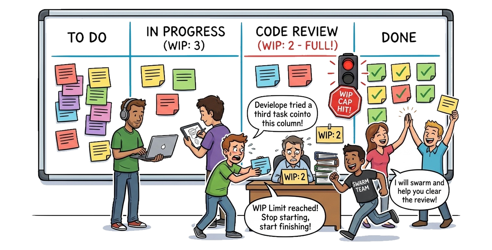
</div>

<!--
請看這幅經典的看板在製品上限運作圖。

注意欄位標題下方的數字：這就是神聖不可侵犯的「WIP Limit (在製品數量上限)」。

例如「開發中」欄位的上限是 3。當欄位內已經有 3 張卡片時，就算工程師寫完了手頭上的工作，也**絕對不准再從待辦清單拉取新任務！**

為什麼？因為看板的核心哲學是「停止開始，開始完成 (Stop starting, start finishing!)」。如果下游的「測試中」或「部署中」出現瓶頸堵塞，所有人都必須立即前往支援消滅瓶頸，而不是繼續往壅塞的管道塞入更多半成品代碼。

WIP 限制迫使團隊暴露隱蔽的流程瓶頸，大幅降低多工切換的認知耗損，從而達到最短的平均交付前置時間 (Lead Time)。

總結這張投影片，請記住這個核心觀念：看板透過嚴格的 WIP 限制暴露瓶頸、消除堵塞，實現系統吞吐量的最大化。
-->
---
## Scrum vs. 看板：架構維度全景對比

| 比較維度 | Scrum (時間盒衝刺模式) | 看板 Kanban (連續拉動流動模式) |
| :--- | :--- | :--- |
| **節奏機制 (Cadence)** | 固定時長衝刺（1–4 週時間盒） | 連續流動，隨時隨需交付發布 |
| **發布時機** | 衝刺結束時產出產品增量 | 任何功能只要通過測試即可隨時發布 |
| **變更規範** | 衝刺期間嚴格**凍結範疇** | 只要不超出 WIP 限制，隨時可調整待辦順序 |
| **在製品限制** | 透過衝刺待辦清單間接限制工作量 | 每個欄位強制設定明確的 **WIP 數量上限** |
| **團隊角色** | 嚴格定義三大角色 (PO, SM, Dev) | 不預設特定角色，尊重既有組織結構 |
| **度量指標** | 衝刺速率 (Velocity)、燃盡圖 | 前置時間 (Lead Time)、週期時間、累積流圖 |
| **最佳適用情境** | 產品功能研發、新創探索專案 | 運維維護 (Ops)、缺陷修復、客服支援管線 |

<!--
這張對比表是軟體專案管理的經典考點。

請看變更規範：Scrum 在衝刺中保護團隊不受打擾，範疇凍結；而看板極具彈性，只要 WIP 沒滿，隨時可以插單。

再看適用情境：
如果要集中兵力開發新產品核心模組，Scrum 的衝刺節奏極具凝聚力；
但如果是面對每天源源不絕的線上缺陷排查、客服工單或維運支援，看板的隨時拉動與隨需發布則是唯一解法。

總結這張投影片，請記住這個核心觀念：Scrum 適合目標明確的週期性產品研發，看板適合高度動態響應的連續性維運支援。
-->
---
### 觀念檢測：看板 WIP 限制 (CCQ 7)
<!-- id: ase-ch02-ccq7 -->

<div class="ccq-columns">
  <div class="ccq-text">

在看板 (Kanban) 流程框架中，對看板欄位強制設定嚴格的「在製品數量上限 (WIP Limits)」其最主要的工程目的是什麼？

- **A.** 限制每位工程師每天在終端機中最多只能編寫 50 行程式碼。
- **B.** 阻止團隊承接過多並行任務導致多工切換耗損，並及早暴露出工作流中的瓶頸堵塞。
- **C.** 迫使所有開發人員每完成一個函式就必須重開電腦以釋放記憶體。
- **D.** 完全禁止測試工程師在星期五下午進行任何程式碼部署上線。

  </div>
  <div class="ccq-logo">
    <a href="https://nlhsueh.github.io/nickedupocket/#/student/ase-ch02-ccq7" target="_blank">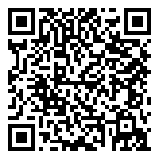</a>
  </div>
</div>

<!--
第七題觀念檢測！請大家掃描 QR Code。

題目問：在看板流程中，設定「在製品數量上限 (WIP Limits)」的核心工程目的為何？

選項：
A：限制每天寫 50 行代碼。
B：阻止過多並行任務導致多工切換損耗，並及早暴露工作流中的瓶頸。
C：每寫一個函式就重開機。
D：週五下午禁止部署。

請大家根據「停止開始，開始完成」的原則作答！

（解析：正確答案是 B。WIP 限制的精髓在於克制貪多嚼不爛的心態，減少 Context Switch 浪費，並讓下游堵塞的瓶頸立即浮出水面。）

總結這張投影片，請記住這個核心觀念：WIP 限制是看板優化系統吞吐量的核心閥門，專注於完成而非堆積半成品。
-->
---
### 觀念檢測：衝刺回顧會議 (CCQ 8)
<!-- id: ase-ch02-ccq8 -->

<div class="ccq-columns">
  <div class="ccq-text">

在 Scrum 框架中，每個衝刺末期召開的「衝刺回顧會議 (Sprint Retrospective)」其核心聚焦點為何？

- **A.** 開發團隊向外部客戶與業務主管現場展示功能成果並爭取下期預算。
- **B.** 團隊內部坦誠檢視人際協同、工程實踐與流程障礙，並制定具體的流程改進行動。
- **C.** 針對本次衝刺寫出最多 Bug 的工程師進行公開績效檢討與懲戒。
- **D.** 重新編譯所有模組的原始碼以確認沒有任何語法編譯警告。

  </div>
  <div class="ccq-logo">
    <a href="https://nlhsueh.github.io/nickedupocket/#/student/ase-ch02-ccq8" target="_blank">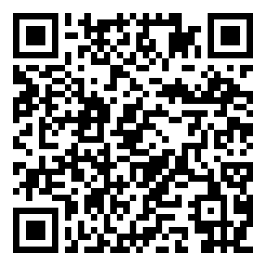</a>
  </div>
</div>

<!--
第八題觀念檢測！請掃描 QR Code。

題目問：Scrum 的「衝刺回顧會議 (Sprint Retrospective)」核心聚焦點為何？

請看選項：
A：向外部客戶展示功能成果。
B：團隊內部坦誠檢視協同、實踐與障礙，制定具體改進行動。
C：公開檢討寫出最多 Bug 的工程師。
D：重新編譯所有模組。

請注意區分「審查會議 (Review)」與「回顧會議 (Retrospective)」的不同對象！

（解析：正確答案是 B。審查會議是對外向利害關係人展示軟體；回顧會議則是團隊對內的坦誠反思，聚焦於流程與工具的持續改進。）

總結這張投影片，請記住這個核心觀念：回顧會議是 Scrum 自我調適的靈魂，不作秀給外人看，只專注於團隊內部流程的精進。
-->
---
<!-- _class: lead -->
<!-- header: '2.6 速度背後的隱形成本 (技術債)' -->

# **2.6 速度背後的隱形成本 (技術債)**

> "Shipping first time code is like going into debt.  
> A little debt accelerates development so long as it is paid back promptly with a rewrite."  
> 「首次交付代碼就像借債。只要能及時重寫償還，適度的負債確實能加速開發。」  
> — *Ward Cunningham (敏捷宣言起草人、技術債隱喻發明者)*

<!--
我們進入關鍵的單元 2.6：速度背後的隱形成本——技術債 (Technical Debt)。

敏捷強調快速交付，但許多團隊誤以為敏捷就是「不要設計、只要速度、隨便胡搞」。

這種扭曲的觀念催生了當代軟體工業最嚴重的慢性毒瘤：技術債。

如果不懂得治理技術債，敏捷的極速奔馳終將演變成災難性的全面崩潰。

總結這張投影片，請記住這個核心觀念：技術債是以未來的研發自由度為抵押的金融貸款，必須主動治理與償還。
-->
---
<!-- _class: title-image-slide -->

## 速度背後的隱形成本：技術債 (The Hidden Cost of Speed: Technical Debt)

<div class="image-wrapper">
  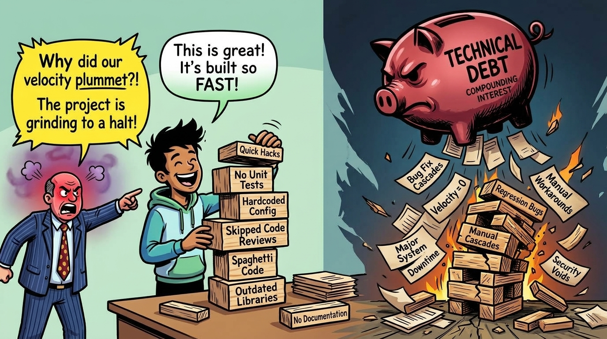
</div>

<!--
現在我們進入 2.6 節：速度背後的隱形成本——技術債 (Technical Debt)。

請看這幅深刻描繪技術債本質的漫畫。

在眼前，是一張誘人的「即刻交付功能」合約。團隊為了趕在週五前上線，選擇了抄捷徑：跳過單元測試、複製貼上舊代碼、寫下無數臨時硬編碼。在短期內，功能確實交付了，管理層一片歡騰！

但在光鮮亮麗的背後，巨大的金融高利貸陰影正在急速成形。

每一次抄捷徑，都是向未來的自己借取高利貸。如果不按時重構償還本金，複利利息就會與日俱增，直到系統架構徹底腐化，每一次修改都引發巨大災難，團隊最終走向交付破產。

總結這張投影片，請記住這個核心觀念：速度若缺乏工程紀律便會轉化為高利貸，技術債是每個軟體工程師必須審慎治理的核心資產負債。
-->
---
## 速度背後的隱形成本 — 技術債 (Technical Debt)

<div class="content-columns">
<div class="content-text">

> 在缺乏工程紀律的情況下快速交付程式碼，就如同向未來的自己**借取金融貸款**。它或許能加速今天的發布，但其累積的複利利息，終將讓未來的研發速率走向徹底破產。

* **隱喻的起源：**
  - 由敏捷宣言共同起草人、Wiki 發明者 **Ward Cunningham (1992)** 首次提出。
* **敏捷交付的核心悖論：**
  - Scrum 與看板賦能團隊每個衝刺展示新功能。
  - **致命陷阱：** 一味追求「功能交付速度」，卻忽視了自動化測試與架構重構。
  - **複利利息：** 你今天借了時間，但未來每一天都必須以脆弱代碼、回歸錯誤與研發速度崩跌來償還高額利息！

</div>
<div class="content-figure">

<div class="name-card">
  
  <div class="name-card-caption">
    <span class="name-card-name">Ward Cunningham</span>
    <span class="name-card-cc"><a href="https://en.wikipedia.org/wiki/Ward_Cunningham" target="_blank">Wikimedia Commons / CC BY-SA</a></span>
  </div>
</div>

</div>
</div>

<!--
何謂技術債 (Technical Debt)？

敏捷宣言起草人之一、維基 (Wiki) 的發明者 Ward Cunningham，於 1992 年提出了這個著名的金融隱喻。

就如同借取金融貸款一樣，在開發中抄近路——例如跳過自動化測試、複製貼上代碼、延後架構重構——能讓你今天快速交付新功能。

你向未來借了時間！但這筆債務絕非免費。團隊在往後的每一天，都必須以更困難的除錯、脆弱的系統和急劇減緩的開發速度，持續支付高昂的利息。

如果團隊從不透過重構償還本金，利息就會不斷滾動，直到整個代碼庫陷入破產癱瘓。

總結這張投影片，請記住這個核心觀念：技術債是以短期的交付速度，換取長期的系統脆弱與研發停滯。
-->
---
## 「疲軟 Scrum (Flaccid Scrum)」現象與軟體架構侵蝕

> 「缺乏極限編程 (XP) 技術紀律的 Scrum，就如同給跑車裝上除草機引擎：你擁有華麗的管理儀表板與站立會議，但軟體系統一遇高負載便分崩離析。」  
> — *Martin Fowler*

* **「疲軟 Scrum」的誘人幻覺：**
  - 團隊全面導入了 Scrum 的**管理儀式**（衝刺規劃、每日站立會議、燃盡圖、回顧會議）。
  - 卻徹底忽視了底層的**卓越工程實踐**（TDD、結對編程、自動化 CI/CD、持續重構）。
* **忽視技術紀律的慘痛後果：**
  - **研發速度雪崩：** 6 到 12 個月後，任何微小變更都會引發連鎖回歸錯誤，開發速度急劇歸零。
  - **英雄救火陷阱：** 整個龐大系統僅剩一兩位資深工程師敢碰那團義大利麵代碼。
  - **恐懼重構文化：** 沒有人敢修改既有代碼，深怕觸動隱蔽的強耦合地雷。

<!--
Martin Fowler 提出「疲軟 Scrum (Flaccid Scrum)」這個生動名詞，精準針砭了當代軟體團隊普遍存在的通病。

許多企業非常熱衷於導入 Scrum 的管理儀式：考取證照、購買 Jira 授權、每天開十五分鐘站立會議、繪製漂亮的燃盡圖。

為什麼？因為管理流程最容易由上而下強制推行！

然而，如果你忽視了硬核的底層工程實踐——自動化測試、TDD、持續重構與 CI/CD，你的 Scrum 就是疲軟的。

在前幾個衝刺中，團隊看似交付飛快；但半年後，速度急劇墜毀。修復一個 Bug 會引發兩個新問題，工程師對重構代碼產生深深的恐懼。

總結這張投影片，請記住這個核心觀念：缺乏嚴謹工程實踐的敏捷專案管理，終將走向架構腐蝕與交付癱瘓。
-->
---
## 技術債的實證數據與真實災難事件 (Empirical Evidence & Real-World Disasters)

> 技術債絕非抽象的修辭隱喻：在全球範圍內，它吞噬了工程師 **42% 的工作時間**，更曾引發**數十億美元級別的企業運維崩潰**。

<div class="two-columns">
<div class="card" data-marpit-fragment>

### 全球實證研究數據 (Empirical Data)
* **Stripe 開發者係數實證研究 (The Developer Coefficient)：**
  - 全球軟體工程師平均每週耗費 **42% 的工作時間** 在應付技術債、低劣代碼與維護修補！
  - 每年造成全球高達 **850 億美元** 的 GDP 生產力損失。
* **CISQ 軟體品質低劣成本報告 (2022)：**
  - 全美因既有技術債與軟體缺陷造成的經濟損失高達 **2.41 兆美元**。

</div>
<div class="card" data-marpit-fragment>

### 重大案例：西南航空大崩潰 (2022)
* **系統骨牌式雪崩：**
  - 2022 年聖誕假期暴風雪引發航班調度混亂。
  - 西南航空累積數十年未償技術債的機組排班舊系統 (**SkySolver**) 在連鎖重新排班下徹底崩潰。
* **毀滅性的經營代價：**
  - **16,700 班航班取消**，數百萬旅客滯留機場。
  - 損失與罰款**逾 8 億美元**，企業商譽重挫。
  - *根本原因：* 長期忽視核心系統現代化與技術債重構。

</div>
</div>

<!--
讓我們看看為什麼技術債絕非學術空談。請看螢幕上的實證研究與真實商務災難。

在左側，是全球權威調查數據：

Stripe 針對全球數百家企業工程團隊的研究顯示，軟體工程師每週平均將 42% 的時間花在應付爛代碼、排除舊債與維護回歸錯誤上！這相當於每年蒸發了 850 億美元的工程產能。

CISQ 聯盟在 2022 年的報告更指出，美國境內因軟體品質低劣與累積技術債造成的經濟損失高達 2.41 兆美元！

再看右側的真實災難：2022 年聖誕節西南航空全美大崩潰。

一場暴風雪襲擊全美，其他航空公司在 48 小時內迅速復飛，但西南航空卻全面陷入癱瘓。根本原因在於其 1990 年代遺留的機組人員排班系統 SkySolver 累積數十年技術債，在遭遇複雜連鎖重新排班時直接崩潰，迫使員工只能用紙筆手工排班！

最終導致超過 16,700 個航班取消、損失超過 8 億美元，商譽跌入谷底。

總結這張投影片，請記住這個核心觀念：技術債是真實的營運風險，它不僅大幅侵蝕開發產能，更可能隨時引爆威脅企業生存的巨大崩盤。
-->
---
### 觀念檢測：技術債利息 (CCQ 9)
<!-- id: ase-ch02-ccq9 -->

<div class="ccq-columns">
  <div class="ccq-text">

依據 Ward Cunningham 提出的「技術債 (Technical Debt)」金融隱喻，下列何者代表團隊在未來必須持續支付的「高額利息」？

- **A.** 軟體公司每個月向雲端伺服器廠商支付的固定虛擬主機租金發票。
- **B.** 每次修改或擴充既有代碼時，團隊所額外付出的除錯、理解晦澀架構與修復回歸錯誤的龐大時間代價。
- **C.** 專案經理在衝刺結束時發放給績優工程師的年終激勵獎金。
- **D.** 軟體開發團隊為每一台開發筆記型電腦所購買的硬體延長保固費用。

  </div>
  <div class="ccq-logo">
    <a href="https://nlhsueh.github.io/nickedupocket/#/student/ase-ch02-ccq9" target="_blank">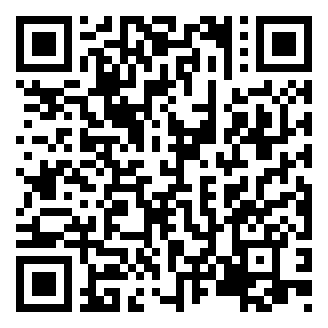</a>
  </div>
</div>

<!--
第九題觀念檢測！請掃描螢幕上的 QR Code。

題目問：在 Ward Cunningham 的技術債隱喻中，什麼代表團隊在未來必須支付的「利息」？

選項：
A：雲端主機租金發票。
B：每次修改既有代碼時，額外付出的除錯、理解晦澀架構與修復回歸錯誤的龐大時間代價。
C：年終績效獎金。
D：筆電保固費用。

請大家根據技術債的定義作答！

（解析：正確答案是 B。本金是當初抄捷徑寫下的爛代碼；利息則是未來每次碰這段代碼時，所必須額外浪費的痛苦摸索與救火時間。）

總結這張投影片，請記住這個核心觀念：技術債的利息是以工程師寶貴的研發時間與專案推進速度來支付的。
-->
---
### 觀念檢測：疲軟 Scrum 本質 (CCQ 10)
<!-- id: ase-ch02-ccq10 -->

<div class="ccq-columns">
  <div class="ccq-text">

Martin Fowler 提出著名的**「疲軟 Scrum (Flaccid Scrum)」**一詞，是用來針砭軟體工程實務中的哪項重大失衡？

- **A.** 團隊完全不使用電子看板，堅持只在白板上手繪便簽。
- **B.** 團隊全面導入了 Scrum 的管理外殼與會議儀式，卻徹底忽視了測試驅動開發 (TDD) 與持續重構等核心工程技術實踐。
- **C.** 開發團隊每天的站立會議開得太久超過了 15 分鐘上限。
- **D.** 產品負責人拒絕使用使用者故事格式來撰寫產品需求條目。

  </div>
  <div class="ccq-logo">
    <a href="https://nlhsueh.github.io/nickedupocket/#/student/ase-ch02-ccq10" target="_blank"></a>
  </div>
</div>

<!--
第十題觀念檢測！請大家掃描 QR Code。

題目問：Martin Fowler 提出的「疲軟 Scrum」是在針砭什麼問題？

選項：
A：堅持在白板上手繪便簽。
B：全面導入了管理外殼與會議儀式，卻忽視了 TDD、重構等核心工程技術實踐。
C：站立會議超過 15 分鐘。
D：不用使用者故事格式。

請思考跑車裝上除草機引擎的比喻！

（解析：正確答案是 B。只有管理儀式而缺乏技術實踐的敏捷是空洞脆弱的，必然會因技術債累積而走向交付癱瘓。）

總結這張投影片，請記住這個核心觀念：敏捷專案管理必須以嚴謹的工程技術實踐為骨幹，否則只會淪為虛浮的疲軟 Scrum。
-->
---
### 課堂互動討論：技術債與上線速度的生死抉擇（雙人小組討論）

<div class="discussion-columns">
  <div class="discussion-text">

  **技術債治理決策實戰演練：**
  你是一家快速成長電商新創的技術負責人。下週就是一年一度的「雙十一購物節」，行銷部門剛提出一個能帶來數千萬營收的「好友拼團折扣」新需求。
  - **方案 A（快速欠債）：** 複製貼上兩千行既有代碼、寫死資料庫連接、跳過單元測試，保證三天內拼湊上線。
  - **方案 B（嚴謹重構）：** 重構促銷引擎、撰寫完整單元測試與壓力測試，需要兩週時間（將徹底錯過雙十一）。

  **課堂小組思考：** 你會選擇哪一個方案？你會如何向執行長 (CEO) 與團隊為你的決策辯護？若選擇方案 A，你該如何制定還債計畫？

  </div>
  <div class="discussion-logo">
    
  </div>
</div>

<!--
現在請大家與旁邊同學進行三分鐘的雙人決策討論。

這是一個每個資深工程師與架構師在職涯中一定會碰到的真實天人交戰：
雙十一在即，商業機會就在眼前。你是該抄捷徑搶商機？還是堅持品質錯過節慶？

如果你選方案 A，上線後崩潰怎麼辦？雙十一之後你怎麼說服老闆給你兩週「不接新需求專門還債」？

三分鐘後請大家分享你們的權衡策略。

總結這張投影片，請記住這個核心觀念：優秀的架構師既懂得在必要時審慎借貸以搶佔先機，更懂得在賺到收益後第一時間強制還款。
-->
---
<!-- _class: lead -->
<!-- header: '2.7 卓越技術紀律 (極限編程 XP)' -->

# **2.7 卓越技術紀律 (極限編程 XP)**

> "Any fool can write code that a computer can understand.  
> Good programmers write code that humans can understand."  
> 「任何傻瓜都能寫出電腦能理解的代碼。  
> 優秀的工程師才能寫出人類能理解的代碼。」  
> — *Martin Fowler*

<!--
我們進入單元 2.7：卓越技術紀律——極限編程 (Extreme Programming，簡稱 XP)。

如果說 Scrum 是敏捷的專案管理骨架，那麼 XP 就是敏捷無可替代的技術心臟。

只有當團隊掌握了 TDD、結對編程與持續重構這些極致的工程紀律，敏捷才能在高速運轉下依然保持優雅整潔。

總結這張投影片，請記住這個核心觀念：極限編程是抵禦技術債與維護敏捷生命力的終極工程實踐體系。
-->
---
<!-- _class: title-image-slide -->

## 極限編程 (XP)：卓越技術紀律與整潔代碼

<div class="image-wrapper">
  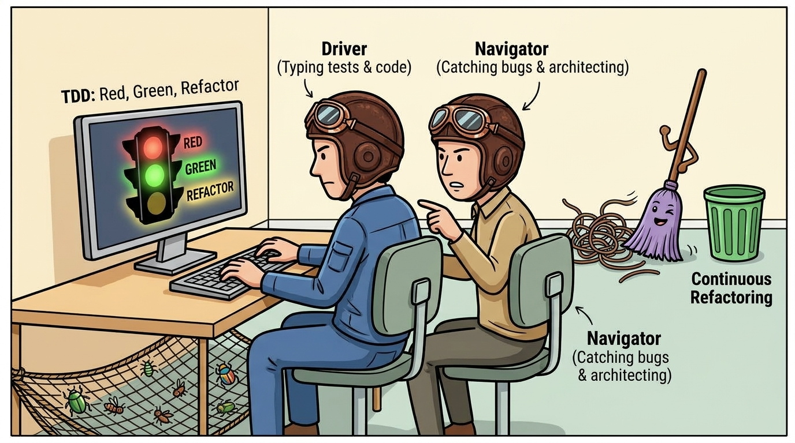
</div>

<!--
現在我們進入 2.7 節：卓越技術紀律——極限編程 (Extreme Programming，簡稱 XP)。

請看這幅充滿技術極客精神的漫畫。

漫畫中描繪了 XP 的核心氛圍：工程師們不再單打獨鬥，而是兩人一組進行結對編程 (Pair Programming)。在他們螢幕前，所有的自動化單元測試綠燈閃爍。

牆上的儀表板顯示著每次代碼提交後自動觸發的持續整合流水線。當發現代碼設計不夠優雅時，開發者立刻進行重構，保持代碼極致簡單與整潔。

XP 是敏捷運動中最純粹的工程技術流派：它堅信只有極致的編程紀律、最高標準的自動化測試與即時回饋，才能為敏捷的快速迭代提供最堅不可摧的品質護甲。

總結這張投影片，請記住這個核心觀念：極限編程以卓越的技術紀律與即時回饋為核心，是維護代碼健康與消滅技術債的最強武器。
-->
---
## 卓越技術紀律 — 極限編程 (Extreme Programming · XP)

<div class="content-columns">
<div class="content-text">

> 由 **Kent Beck 於 1996 年創立**，極限編程是一種專注於**程式碼紀律**、**技術卓越**與**持續重構**的敏捷流程模型——它是徹底克制與消除「技術債」的終極解藥。

* **為什麼稱為「極限 (Extreme)」？**
* Kent Beck 提出一個大膽的工程哲學：*如果一項工程實踐已被證明對軟體品質有好處，我們就應該把它推向極限，隨時隨地實踐它！*
  - *測試很好？* → 先寫測試才准寫生產代碼 (**TDD**)。
  - *代碼審查很好？* → 兩人協同隨時隨地審查 (**結對編程**)。
  - *重構很好？* → 每分每秒持續重構以維持 (**簡單設計**)。
  - *整合很好？* → 每天持續整合數十次 (**CI/CD**)。
  - *發布很好？* → 持續交付微小增量 (**小型發布**)。

</div>
<div class="content-figure">

<div class="name-card">
  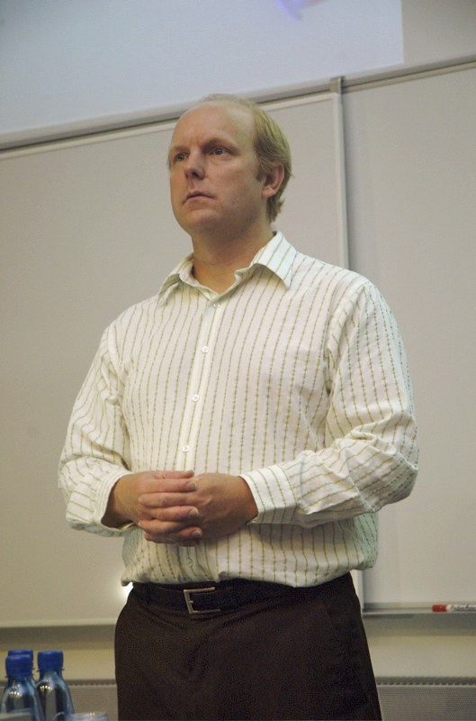
  <div class="name-card-caption">
    <span class="name-card-name">Kent Beck</span>
    <span class="name-card-cc"><a href="https://en.wikipedia.org/wiki/Kent_Beck" target="_blank">Wikimedia Commons / CC BY-SA</a></span>
  </div>
</div>

</div>
</div>

<!--
來看極限編程 (Extreme Programming，簡稱 XP) 的哲學。

由 Kent Beck 於 1996 年在克萊斯勒薪資系統專案中創立，XP 是敏捷運動的技術心臟。

身為敏捷宣言起草人與 JUnit 測試框架創始者的 Kent Beck 提出了一個激進的問題：「如果一項軟體工程實踐是好的，如果我們把刻度轉到 10，隨時隨地都在執行它，會發生什麼事？」

如果單元測試很好，那我們在寫任何一行生產代碼前，都必須先透過 TDD 撰寫自動化測試！如果代碼審查很好，我們就透過結對編程每分每秒持續審查！如果重構很好，我們就持續重構讓架構永遠保持最簡單設計！

Scrum 提供了管理儀式，而 XP 則提供了防止架構劣化與技術債滋生的硬核技術紀律。

總結這張投影片，請記住這個核心觀念：極限編程將經過驗證的最佳工程實踐推向極致，以維持長期的高速交付與整潔架構。
-->
---
<!-- _class: title-image-slide -->

## 極限編程 (XP) 核心實踐與回饋迴路

<div class="image-wrapper">
  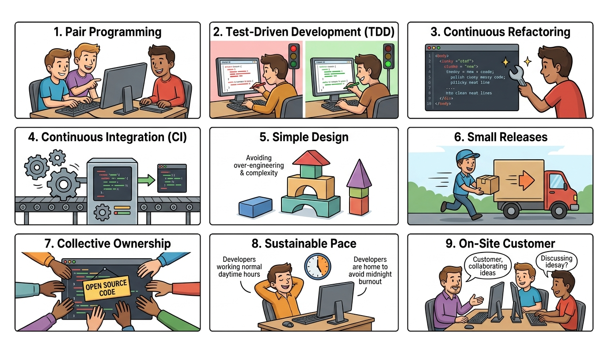
</div>

<!--
請看這幅 XP 核心工程實踐的嵌套回饋迴路圖。

注意這些實踐並非孤立存在，而是依據回饋時間尺度緊密交織的同心圓：

最內層是「秒級與分鐘級」的極速回饋：結對編程（雙人即時代碼審查）與測試驅動開發（TDD，先寫測試再寫代碼）。

中間層是「小時級與天級」的持續整合回饋：集體代碼所有權、持續重構，以及每日數十次的自動化 CI/CD 流水線。

外層則是「週級與衝刺級」的業務交付回饋：小型頻繁發布、現場客戶協同，以及隱喻式架構設計。

XP 的核心哲學就是「壓縮回饋週期」：問題被發現得越早，修復的成本就越接近於零。

總結這張投影片，請記住這個核心觀念：XP 透過短至秒級、長至週級的多層次嵌套回饋迴路，構築出高韌性的軟體品質防護網。
-->
---
## XP 實踐：測試驅動開發 (Test-Driven Development · TDD)

* **「測試先行 (Test-First)」的心智逆轉：**
  - **嚴格鐵律：** 在寫任何一行生產程式碼之前，必須先撰寫一個**必定失敗的自動化單元測試**！
  - 迫使工程師站在**呼叫者與使用者**的視角思考 API 介面與邊界合約，徹底根除過度設計。
* **紅-綠-重構循環 (The Red-Green-Refactor Cycle)：**
  1. **RED (紅燈階段)：** 撰寫一個微小的單元測試，執行並確認它必定**失敗 (編譯失敗或斷言失敗)**。*（強制思考函式介面與規格邊界）*
  2. **GREEN (綠燈階段)：** 以最快速、最直覺甚至「骯髒硬編碼」的方式撰寫最少量的程式碼，讓測試儘速**變綠燈通過**。*（追求快速驗證）*
  3. **REFACTOR (重構階段)：** 在全套測試綠燈的保護網下，**重組程式架構、消除重複、提升可讀性**，同時確保所有測試始終維持綠燈！
* **終極效益：** 產出**具備 100% 回歸防護網的整潔程式碼**，任何時刻修改代碼都有十足信心！

<!--
TDD 是軟體工程史上最強大的心智轉變。

初學者寫程式是「先寫代碼，然後祈禱它能跑，最後隨便測兩下」。

TDD 完全顛覆了這個習慣：你連一行生產代碼都還沒寫，就必須先寫測試！

因為沒有實作代碼，測試當然會失敗（紅燈）；接著你寫最簡單的代碼讓它通過（綠燈）；然後在測試全過的保護傘下大膽重構代碼。

這種做法保證了兩件事：第一，所有代碼都是可測試的；第二，你永遠擁有一套完整的自動化回歸防禦網。

總結這張投影片，請記住這個核心觀念：TDD 透過紅綠重構循環將測試化為設計工具，賦予開發者無懼重構的信心。
-->
---
<!-- _class: title-image-slide -->

## 測試驅動開發 (TDD) 紅綠重構循環

<div class="image-wrapper">
  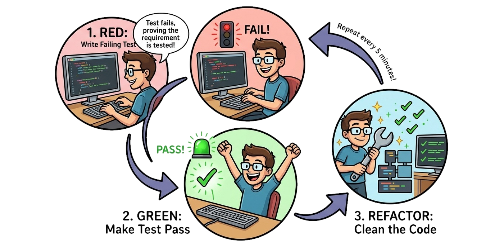
</div>

<!--
請看這張 TDD 核心循環圖。

清晰的三個階段：

紅燈 (Red)：先寫一個失敗的測試。這迫使你在陷入實作細節前，先站在呼叫者的視角思考函式介面與規格契約。

綠燈 (Green)：讓測試儘速通過。撰寫最精簡、甚至是骯髒硬編碼的代碼，唯一目標就是讓紅燈轉為綠燈。

重構 (Refactor)：在全套測試綠燈的保護網下，優化架構、消除重複代碼並改善命名，同時確保所有測試始終保持綠燈！

總結這張投影片，請記住這個核心觀念：TDD 的核心是「以測試引導設計」，透過紅綠重構循環建立堅不可摧的自動化安全網。
-->
---
## 持續重構與簡單設計 (Simple Design)

* **何謂「重構 (Refactoring)」？**
  - Martin Fowler 經典定義：*「在不改變軟體外部可觀察行為的前提下，改善其內部結構，使其更容易理解且修改成本更低。」*
  - 在 XP 中，重構不是一年一度的特定階段，**而是工程師每小時的自然反射動作！**
* **Kent Beck 的「簡單設計四原則 (4 Rules of Simple Design)」：**
  1. **通過所有測試 (Passes all tests):** 品質的第一底線是行為正確無誤。
  2. **表達設計意圖 (Expresses intent):** 代碼自帶文檔，命名精準清晰。
  3. **消除重複 (No duplication):** 嚴格落實 DRY 原則 (Don't Repeat Yourself)。
  4. **最小化元素 (Smallest number of elements):** 消滅過度設計的抽象類別與死代碼。

<!--
什麼是重構？請特別注意定義中的這句話：「在不改變外部行為的前提下」。

如果你在重構的同時順便加新功能，那不叫重構，那叫自找麻煩。

重構的前提是「全套綠燈的單元測試」。只有當你確信修改內部結構不會破壞既有功能時，重構才安全。

搭配 Kent Beck 的簡單設計四原則：通過測試、表達意圖、沒有重複、元素最少。這四條原則是抵擋過度設計的最佳指南針。

總結這張投影片，請記住這個核心觀念：重構是維持代碼生命力的日常習慣，以測試為護盾、以簡單設計為準則。
-->
---
## 結對編程與集體代碼所有權 (Pair Programming)

* **結對編程的雙人協同機制：**
  - 兩位工程師共享同一個工作站：**駕駛員 (Driver)** 專注撰寫代碼與測試；**領航員 (Navigator)** 專注審視架構盲點、邊界條件與長期設計。
* **集體代碼所有權 (Collective Ownership)：**
  - 嚴禁單一開發者「佔地為王」私有化模組；團隊中任何成員都有權限在任何時間重構任何代碼。
* **消除知識孤島與「巴士係數 (Bus Factor)」風險：**
  - 徹底消除孤島資訊：即便關鍵工程師被巴士撞倒（或中了彩券離職），團隊依然能無縫運作，不會因為單一人員缺席而癱瘓。
* **即時連續的代碼審查 (Continuous Review)：**
  - 在代碼被提交至版本控制系統*之前*，就即時攔截邏輯漏洞、語法拼寫錯誤與架構缺陷。

<!--
結對編程 (Pair Programming) 往往是最容易被外行質疑的實踐：「兩個人寫一台電腦，難道不是浪費一半的生產力嗎？」

大量實證軟體工程研究給出了否定答案：

在結對編程中，駕駛員專注於當前的語法實作與單元邏輯，而領航員則以更高的高度審視全局：這段邏輯是否符合整體架構？是否遺漏了邊界條件？是否有現成函式庫可以重用？

這帶來了兩大巨大效益：第一，它提供了即時連續的代碼審查，Bug 在被敲打出來的瞬間就被攔截；第二，它實現了集體代碼所有權，消滅了「只有某個人懂這段代碼」的知識孤島，大幅提升團隊的巴士係數 (Bus Factor)！

總結這張投影片，請記住這個核心觀念：結對編程透過戰術與戰略的雙人動態協同，以極小的人力代價換取極高的軟體設計品質與團隊集體智慧。
-->
---
<!-- _class: title-image-slide -->

## 結對編程：駕駛員與領航員的動態協作

<div class="image-wrapper">
  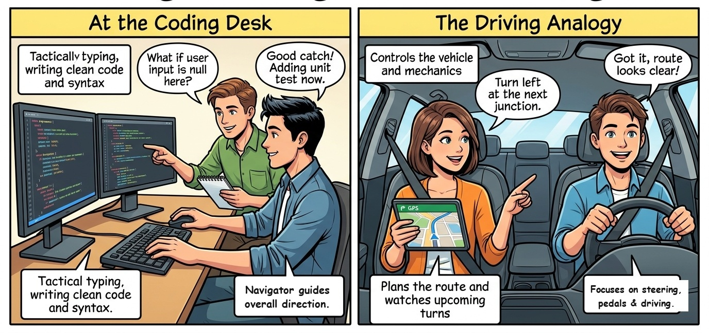
</div>

<!--
請看這幅幽默描繪結對編程駕駛員與領航員的漫畫。

這就像拉力賽車一樣：駕駛員手握方向盤與油門，專注於每一個過彎與換檔細節；而副駕駛座上的領航員則手持路書，時刻提醒前方兩百公尺有急轉彎與碎石路面。

兩人的角色每隔一段時間便動態互換，保持高度的警覺與專注。

這徹底改變了軟體開發「孤獨打字」的刻板印象，將寫代碼昇華為高度協同的智力對話。

總結這張投影片，請記住這個核心觀念：駕駛員與領航員的分工與互換，能讓代碼同時兼顧微觀實作精確度與宏觀架構健全性。
-->
---
### 觀念檢測：結對編程領航員 (CCQ 11)
<!-- id: ase-ch02-ccq11 -->

<div class="ccq-columns">
  <div class="ccq-text">

在極限編程 (XP) 的結對編程 (Pair Programming) 實踐中，「領航員 (Navigator)」的核心職責是什麼？

- **A.** 搶奪鍵盤並替駕駛員打完所有程式碼。
- **B.** 在旁監控宏觀架構、思考邊界條件、尋求簡化契機並進行即時連續的代碼審查。
- **C.** 負責替駕駛員訂購下午茶外賣並記錄工作時數。
- **D.** 專門負責在版本控制系統上按下 Merge 按鈕而完全不看程式碼。

  </div>
  <div class="ccq-logo">
    <a href="https://nlhsueh.github.io/nickedupocket/#/student/ase-ch02-ccq11" target="_blank">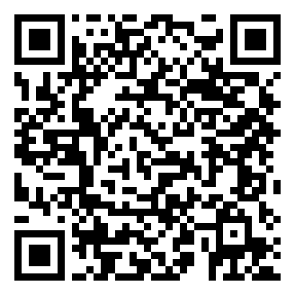</a>
  </div>
</div>

<!--
第十一題觀念檢測！請大家掃描 QR Code。

題目問：在結對編程中，領航員的核心職責是什麼？

選項：
A：搶鍵盤打代碼。
B：在旁監控宏觀架構、思考邊界條件、尋求簡化契機並即時代碼審查。
C：訂下午茶外賣。
D：不看代碼直接按 Merge。

請投下你的答案！

（解析：正確答案是 B。駕駛員專注戰術細節，領航員專注戰略全局。領航員是即時的架構審查者與邊界探索者。）

總結這張投影片，請記住這個核心觀念：領航員是結對編程的戰略大腦，負責守護架構健全度與極端邊界測試。
-->
---
### 觀念檢測：TDD 重構階段目標 (CCQ 12)
<!-- id: ase-ch02-ccq12 -->

<div class="ccq-columns">
  <div class="ccq-text">

在極限編程的「測試驅動開發 (TDD)」紅綠重構循環中，「重構 (Refactor)」階段的特定工程目標為何？

- **A.** 在模組中緊急追加三個全新的業務功能函式。
- **B.** 刻意修改既有測試用例的斷言邏輯，使原本紅燈失敗的測試強制變為綠燈。
- **C.** 在確保所有既有自動化單元測試持續保持綠燈的前提下，改善內部程式碼結構、消除重複並提升可讀性。
- **D.** 將專案全部原始碼刪除並請生成式 AI 重新自動生成一遍。

  </div>
  <div class="ccq-logo">
    <a href="https://nlhsueh.github.io/nickedupocket/#/student/ase-ch02-ccq12" target="_blank"></a>
  </div>
</div>

<!--
第十二題觀念檢測！請掃描 QR Code。

題目問：在 TDD 的紅綠重構循環中，「重構」階段的特定目標是什麼？

選項：
A：追加三個全新業務功能。
B：修改測試斷言強制變綠燈。
C：在確保全套測試持續綠燈的前提下，改善內部代碼結構、消除重複與提升可讀性。
D：刪除代碼請 AI 重寫。

（解析：正確答案是 C。重構的嚴格定義是「在不改變外部可見行為的前提下優化內部結構」。綠燈是重構的安全邊界。）

總結這張投影片，請記住這個核心觀念：重構是在安全網下打磨代碼結構，絕不允許改變既有功能或破壞綠燈保護。
-->
---
<!-- _class: lead -->
<!-- header: '2.8 系統架構與協同文化 (DevOps)' -->

# **2.8 系統架構與協同文化 (DevOps)**

> "You build it, you run it."  
> 「誰建造它，誰就得維運它。」  
> — *Werner Vogels (Amazon 技術長)*

<!--
我們進入單元 2.8：系統架構與協同文化——DevOps。

敏捷解決了開發團隊內部的敏捷性，但當代碼準備交付上線時，往往會撞上一道高牆：開發 (Dev) 與維運 (Ops) 之間的「混亂之牆」。

DevOps 透過自動化流水線與雲端架構代碼化，將敏捷的邊界徹底推廣至生產環境。

總結這張投影片，請記住這個核心觀念：DevOps 是敏捷向維運端的自然延伸，透過 CI/CD 自動化消滅交付壁壘。
-->
---
<!-- _class: title-image-slide -->

## DevOps 與開發 (Dev) 及維運 (Ops) 之間的混亂之牆

<div class="image-wrapper">
  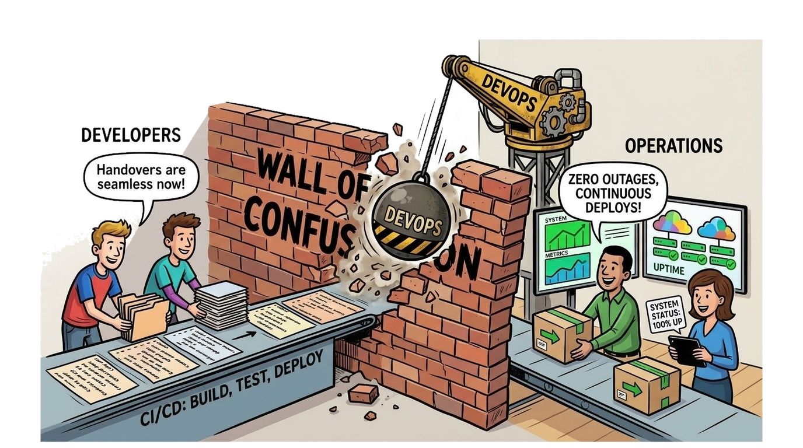
</div>

<!--
我們進入 2.8 節：系統架構與協同文化——DevOps。

請看這幅生動描繪「混亂之牆 (Wall of Confusion)」的漫畫。

在牆的左側，是開發團隊 (Dev)：他們的績效指標是「交付新功能的速度」。每到發布日，工程師把打包好的壓縮檔扔過高牆，拍拍屁股下班：「在我的電腦上可以跑，現在是你們維運的事了！」

在牆的右側，是維運團隊 (Ops)：他們的績效指標是「系統 99.99% 的高可用度與零當機」。面對從牆外砸過來的未知代碼，伺服器瞬間崩潰報警，維運人員在深夜瘋狂救火。

這種組織與利益的深刻割裂，正是催生 DevOps 革命的根本動力。

總結這張投影片，請記住這個核心觀念：DevOps 的終極使命在於推倒開發與維運之間的混亂之牆，將軟體交付轉化為共同承擔的自動化責任。
-->
---
<!-- header: '2.8 系統架構與協同文化 (DevOps)' -->

## 系統架構與協同文化 — DevOps

> 一種結合文化哲學、組織架構與技術實踐的變革運動，旨在打破**開發 (Dev)** 與**維運 (Ops)** 之間的傳統壁壘，透過自動化流水線、基礎設施即程式碼 (IaC) 與生產環境遙測數據，徹底貫通軟體交付全生命週期。

* **打破「混亂之牆 (Wall of Confusion)」的利益對立：**
  - **開發團隊的激勵誘因：** 渴望持續擁抱變更、極速推出新功能與頻繁發行。
  - **維運團隊的激勵誘因：** 追求系統 100% 穩定、零當機，對任何變更充滿戒心。
* **DevOps 的核心融合思維：**
  - **左移思維 (Shift-Left)：** 將系統維運、資訊安全與部署品質前移成為開發者的共同責任。
  - **「誰建造，誰維運」(You build it, you run it)：** Amazon 技術長 Werner Vogels 提出的經典原則，消滅「將代碼拋過高牆」的推諉惡習。

<!--
讓我們深入 DevOps 的文化與系統本質。

傳統軟體工程中，開發團隊 (Dev) 與維運團隊 (Ops) 存在天然的利益衝突：開發團隊的 KPI 是快速推出變更，而維運團隊的 KPI 是維持系統穩定、避免任何變更。

這道「混亂之牆」導致嚴重的推諉與延遲。

DevOps 的出現徹底粉碎了這道高牆。它不是一個職位名稱，也不是一套工具，而是一場組織文化變革。

亞馬遜技術長 Werner Vogels 提出了最著名的宣言：「You build it, you run it（誰打造它，誰就得維運它）」。當開發人員必須在半夜為自己寫的代碼負責時，系統的容錯性、日誌可讀性與架構品質立刻會發生質的飛躍。

總結這張投影片，請記住這個核心觀念：DevOps 將開發與維運利益對齊，透過責任共擔與自動化流水線消滅推諉壁壘。
-->
---
## 持續整合 (Continuous Integration · CI)：打破 Dev 與 Ops 的高牆

> CI 透過以高頻率的主幹合併與全自動化品質把關閘門，取代傳統低效的人工作業，徹底瓦解了「混亂之牆」。

* **持續整合的核心工作流：**
  1. **高頻率提交代碼 (High-Frequency Commit)：** 開發者每天多次將程式碼合併至主幹分支 (Trunk/Main)。
  2. **自動化建置 (Automated Build)：** 每次 Push 觸發容器自動編譯與依賴項安裝。
  3. **自動化測試守護網 (Automated Testing)：** 自動執行全套單元測試、整合測試與靜態代碼分析 (Linter / SonarQube)。
  4. **快速失敗回饋 (Fail Fast & Fix Immediately)：** 若構建或測試失敗，流水線立即警報，團隊**最高優先立即修復**！
* **終結「整合地獄 (Integration Hell)」：**
  - 不再累積數月的龐大衝突代碼，將整合問題縮小在幾小時的微小代碼變更內解決。

<!--
CI（持續整合）是 DevOps 的第一道基石。

過去的工程師喜歡在自己的分支上寫兩個月的代碼，最後要發布時才合併到主幹。結果一合併，出現幾千個衝突，光是解衝突就要花兩週，這就是著名的「整合地獄」。

CI 要求大家「每天至少合併一次」！每次提交，自動化伺服器立刻拉取代碼、編譯、執行全套測試。

如果你的提交導致構建失敗，整個團隊的警報響起，你必須第一時間修復。這保證了主幹代碼永遠處於隨時可編譯、可測試的健康狀態。

總結這張投影片，請記住這個核心觀念：持續整合以高頻微小的自動化驗證消滅整合地獄，確保主幹代碼永遠維持健康可用。
-->
---
## 為什麼 DevOps 需要持續交付 (CD)？

> 躺在程式碼倉庫裡的代碼**毫無任何商業價值**。持續交付 (CD) 拆除了最後一道維運屏障，讓發布軟體成為一項日常、低風險且可預測的商業決策。

* **持續交付 (Continuous Delivery) vs. 持續部署 (Continuous Deployment)：**
  - **持續交付 (Continuous Delivery)：**
    - 程式碼通過全套自動化測試與環境驗證後，**隨時具備可部署至生產環境的狀態**。
    - 是否真正發行至線上，保留由業務主管**「人工點擊按鈕審批 (Manual Approval)」**決定。
  - **持續部署 (Continuous Deployment)：**
    - **完全無人工干預的純全自動化流水線**！
    - 任何一行代碼只要通過全套自動化測試閘門，即刻由自動化腳本直接推播發布至真實生產環境！

<!--
代碼寫得再好，只要沒進到生產環境讓使用者操作，它的商業價值就是零。

這就是 CD 要解決的問題。請大家分清楚兩個 CD 的差別：

持續交付 (Continuous Delivery)：代碼隨時準備好發布，最後一步需要人按一下按鈕。這適合需要商業時機考量的產品，例如配合行銷活動宣布。

持續部署 (Continuous Deployment)：徹底的全自動化！工程師 git push，測試全過，十分鐘後程式碼就已經在線上面向數百萬使用者運行了。GitHub、Netflix、Amazon 每天進行數千次持續部署！

總結這張投影片，請記住這個核心觀念：持續交付強調隨時具備發布能力，持續部署則實現了從代碼提交到生產環境的完全無人全自動化。
-->
---
<!-- _class: title-image-slide -->

## DevOps CI/CD 自動化流水線全景

<div class="image-wrapper">
  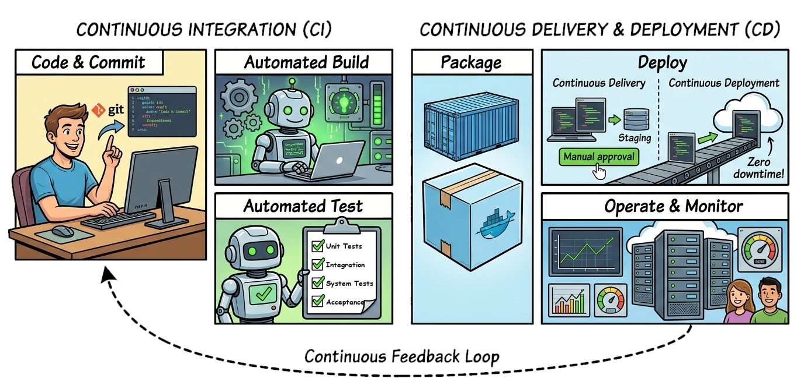
</div>

<!--
請看這幅完整的 CI/CD 自動化流水線全景圖。

整個流水線如同一座現代化的自動化汽車裝配廠：

第一階段：工程師在本地提交代碼 (Code)。
第二階段：觸發 CI 伺服器進行自動化建置 (Build) 與靜態代碼掃描。
第三階段：自動化單元測試與安全漏洞掃描 (Test)。
第四階段：自動打包成 Docker 映像檔並交付至製品庫 (Release)。
第五階段：部署至預發環境進行驗收測試 (Deploy to Staging)。
第六階段：通過嚴格驗收後，直接推播至生產環境 (Deploy to Prod)。
第七階段：生產環境進行即時監控與可觀測性遙測 (Monitor & Observe)。

任何一個關卡只要亮起紅燈，流水線瞬間中斷，瑕疵代碼絕不可能污染生產環境。

總結這張投影片，請記住這個核心觀念：CI/CD 流水線是一道道遞進的自動化品質把關閘門，共同守護生產環境的安全。
-->
---
## 基礎設施即程式碼 (IaC) 與生產環境可觀測性

> 在 DevOps 中，**基礎設施本身就是軟體**：透過宣告式、受版本控制的代碼管理雲端拓撲，能徹底消滅環境漂移，實現可靠的持續交付。

<div class="two-columns">
<div class="card" data-marpit-fragment>

### 基礎設施即程式碼 (IaC)
* **當作牲口，而非寵物 (Cattle, Not Pets)：**
  - 將伺服器視為可隨時銷毀重建的不可變資產，而非精心照料的寵物。
* **宣告式環境保證：**
  - Terraform、Docker 與 Kubernetes 確保 Dev、Staging 與 Production 環境具備 100% 相同配置。
* **徹底消滅「獨角獸伺服器 (Snowflake Servers)」：**
  - 徹底終結「在我電腦上明明可以跑！」的推諉藉口。
  - 任何基礎設施變更均必須經由 Pull Request 審查與版本控制留痕。

</div>
<div class="card" data-marpit-fragment>

### 生產環境可觀測性與即時回饋
* **可觀測性三大支柱 (The 3 Pillars)：**
  - **度量指標 (Metrics)：** 聚合數值遙測（CPU 使用率、API 延遲）。
  - **日誌記錄 (Logs)：** 帶有時間戳記的離散事件詳細紀錄。
  - **分散式追蹤 (Traces)：** 微服務間端到端使用者請求調用路徑。
* **閉合 DevOps 回饋迴路：**
  - 生產環境即時遙測數據能精準將線上崩潰與效能瓶頸回流至開發衝刺待辦清單中。

</div>
</div>

<!--
來看現代 DevOps 的兩大基石技術：基礎設施即程式碼 (IaC) 與生產環境可觀測性。

為什麼 IaC 如此關鍵？在過去，伺服器是由系統管理員手動點選控制台或在終端機手打指令配置的。這產生了所謂的「獨角獸伺服器 (Snowflake Servers)」——沒有人說得清楚伺服器上到底裝了什麼，最終引發「在我電腦上明明可以跑，為什麼上線就當機」的經典悲劇。

透過 Terraform、Docker 與 Kubernetes 等 IaC 工具，基礎架構變成了受 Git 版本控制的純文字代碼！開發環境、測試環境與生產環境保證 100% 完全相同。如果發生故障，只要一行 git revert 就能在數秒內回滾整個雲端架構！

而生產環境可觀測性三大支柱（Metrics, Logs, Traces），則如同雷達一般時刻監控系統健康，並將線上效能瓶頸直接送回開發團隊的衝刺待辦清單中。

總結這張投影片，請記住這個核心觀念：IaC 消滅了環境漂移，可觀測性則閉合了從線上維運回流至工程研發的反饋迴路。
-->
---
### 觀念檢測：持續交付 vs 持續部署 (CCQ 13)
<!-- id: ase-ch02-ccq13 -->

<div class="ccq-columns">
  <div class="ccq-text">

在現代 DevOps 實務中，「持續交付 (Continuous Delivery)」與「持續部署 (Continuous Deployment)」在實務維運上的根本決定性差異為何？

- **A.** 持續交付需要仰賴人工編譯原始碼；持續部署則實現編譯自動化。
- **B.** 持續交付在預發環境中暫停並需經由人工商業決策審批發行；持續部署則在通過全套自動化測試後直接自動推播至生產環境。
- **C.** 持續交付只能部署在本地實體機房；持續部署只能運行於公有雲平台。
- **D.** 持續部署完全不需要撰寫任何自動化單元測試即可隨意推播代碼。

  </div>
  <div class="ccq-logo">
    <a href="https://nlhsueh.github.io/nickedupocket/#/student/ase-ch02-ccq13" target="_blank"></a>
  </div>
</div>

<!--
第十三題觀念檢測！請掃描 QR Code。

題目問：持續交付與持續部署在維運上的根本差異是什麼？

選項：
A：交付人工編譯，部署自動編譯。
B：持續交付在發布前需經人工商業審批，持續部署則在測試全過後自動直推生產環境。
C：交付只能在實體機，部署只能在雲端。
D：持續部署不用寫測試。

（解析：正確答案是 B。兩者前面的自動化流程 100% 相同，唯一的差別就是最後一步進生產環境是「人工點擊審批」還是「腳本全自動推播」。）

總結這張投影片，請記住這個核心觀念：持續交付與持續部署的分水嶺在於是否保留人工商業發布閘門。
-->
---
<!-- _class: lead -->
<!-- header: '2.9 AI 規格驅動流程' -->

# **2.9 現代新前沿 (AI 規格驅動流程)**

> "AI is an amplifier: it amplifies disciplined engineering specifications,  
> but it equally amplifies careless, chaotic habits."  
> 「AI 是一座放大器：它會大幅放大嚴謹的工程規格與架構設計，  
> 但也同樣會無情放大隨性、混亂的劣質壞習慣。」

<!--
我們現在來到本章的最後一個重大前沿，單元 2.9：現代新前沿——AI 規格驅動流程。

大語言模型與 AI 代理人 (Agent) 的崛起，正在徹底顛覆軟體開發的生產力模式。

但在這個代碼生成變得極其廉價的時代，傳統軟體工程是過時了？還是變得更加生死攸關？

我們將剖析未來的核心典範：安全帶工程學 (Harness Engineering)。

總結這張投影片，請記住這個核心觀念：AI 時代放大了工程規格的價值，流程工程進化為駕馭 AI 代理人的安全防護裝備。
-->
---
<!-- _class: title-image-slide -->

## 規格驅動 AI vs. 感覺編程 (Specification-Driven AI vs. Vibe Coding)

<div class="image-wrapper">
  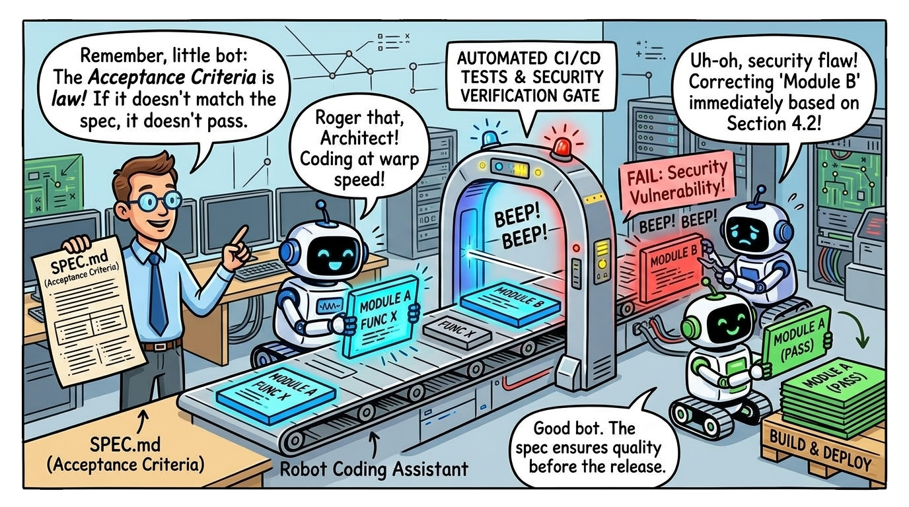
</div>

<!--
現在我們來到最後一個單元，2.9 節：現代新前沿——AI 規格驅動流程。

請仔細凝視這幅對比「感覺編程」與「規格驅動 AI」的漫畫。

在左側，是當前極度危險但廣泛存在的「感覺編程 (Vibe Coding)」模式：工程師不寫架構、不定義介面、不寫測試，只是隨興在 Chat 視窗輸入模糊提示詞，然後對生成的一萬行代碼點擊「全部接受 (Accept All)」。螢幕看似跑通了，但底層是一團充斥著安全漏洞與邏輯炸彈的義大利麵代碼。

而在右側，是現代專業的「規格驅動 AI」工程：工程師退居總建築師的至高維度，透過形式化契約、嚴密的驗收測試與自動化 CI/CD 安全帶，指揮並拘束多個專業 AI 代理人進行高品質代碼建構。

總結這張投影片，請記住這個核心觀念：缺乏工程規格的 AI 編程是技術債的核分裂反應堆，規格驅動才是 AI 時代工程師的真正立足點。
-->
---
<!-- header: '2.9 AI 規格驅動流程' -->

## AI 賦能 SDLC：軟體流程模型的典範轉移

> 在 AI 時代，軟體工程的核心不再是敲打語法代碼，而是**協調與編排整個軟體生命週期**。AI 將代碼建構的邊際成本降至接近於零，推動人類工程師的價值全力轉移至**上游 (Upstream)** 的規格定義與**下游 (Downstream)** 的嚴密驗證。

* **從「以人為本」邁向「代理人自主 (Agentic)」流程：**
  - **傳統流程模型 (瀑布 / 敏捷 / DevOps)：** 核心在於協調*人類開發者*——透過規格文件、每日站立會議、衝刺看板與同儕審查。
  - **AI 賦能流程模型：** 在持續的協同工程迴路中，協調整合**人類總建築師**、**自主 AI 代理人集群**以及**確定性自動化驗證工具**。
* **開發活動重心的戲劇性位移：**
  - **程式碼建構實作 (Coding)：** 耗時從 70% 驟降至 15%（由 AI 代理人承擔繁重的樣板代碼生成）。
  - **規格說明 (Specification)：** 耗時大幅攀升至 40%（成為定義邊界與驗收標準的核心瓶頸）。
  - **驗證確認 (Validation)：** 耗時攀升至 45%（自動化測試與架構審查成為唯一可信的護城河）。

<!--
請大家感受這場正在發生的典範轉移。

過去五十年，寫代碼（Coding）佔據了工程師 70% 的時間。但是在今天，AI 能在五秒鐘內生出五百行語法無誤的代碼。

代碼編寫的邊際成本正在無限趨近於零！

那麼人類工程師的價值在哪裡？在於兩端：
上游的「規格說明」——定義系統到底要解決什麼問題、邊界是什麼、不可妥協的合約是什麼；
以及下游的「驗證確認」——透過全套自動化測試與架構審查，檢驗 AI 代碼是否安全可靠。

總結這張投影片，請記住這個核心觀念：AI 將開發重心從代碼敲打推向了上游的規格契約與下游的嚴密驗證。
-->
---
## 實體化 AI 流程：工程安全裝備 (The Engineering Harness)

> 在敏捷中，流程紀律依賴人類儀式（站立會議、回顧、結對編程）來維持。但**自主 AI 代理人無法參加會議，也不會感到內疚**。因此，流程紀律必須被**「實體化 (Operationalized)」**為代碼化的防禦防護網——即**工程安全帶 (Engineering Harness)**。

* **何謂工程安全裝備 (Harness)？**
  - 包裹在 AI 模型外部的**確定性運作環境、沙盒、輸入導軌 (Input Rails) 與驗證管線 (Verification Pipelines)**。
* **為什麼單靠 Prompt Engineering 必然失敗？**
  - 提示詞本質是**隨機性 (Probabilistic)** 的，無法保證 100% 遵守邊界規範。
  - 唯有透過**確定性 (Deterministic)** 的編譯器、靜態分析器、單元測試與安全沙盒，才能強制確保 AI 代碼具備工業級生產可靠度。

<!--
這是一個極度深刻的觀念：如何管控 AI 代理人？

你不能指望跟 AI 開每週回顧會議，也不能期待它會產生自我道德紀律。

提示詞工程（Prompt Engineering）是有極限的，因為大語言模型本質上是機率模型。

要讓機率性的 AI 產出確定性的高可靠軟體，唯一的辦法就是在模型外部打造一套「工程安全裝備 (Engineering Harness)」：用確定性的編譯器、linter、測試沙盒與靜態分析工具，把 AI 的行為牢牢拘束在安全通道之內。

總結這張投影片，請記住這個核心觀念：無法用會議約束 AI，必須用代碼化的工程安全裝備 (Harness) 來約束 AI。
-->
---
<!-- _class: title-image-slide -->

## 工程安全裝備的本質隱喻：「我不讓它變聰明，我負責設計裝備」

<div class="image-wrapper">
  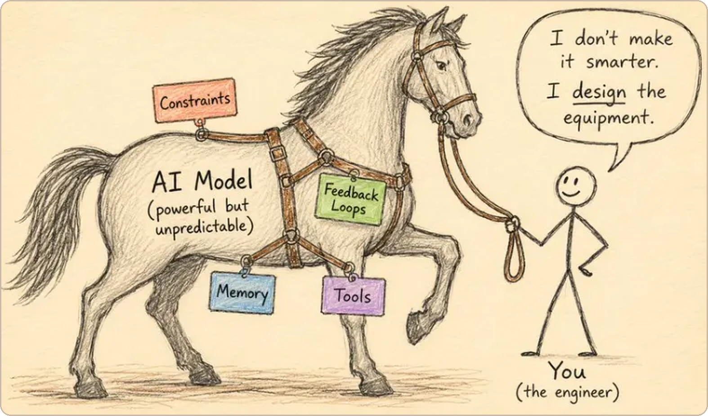
</div>

<!--
請看這幅幽默但發人深省的漫畫。

一位工程師站在強大但不可預測的巨獸（象徵大語言模型）身旁。

外行人整天在爭論：「如何讓巨獸變得更聰明？如何讓模型學會所有道德與程式設計哲學？」

而頂尖的軟體架構師淡然一笑說：「我不負責讓它變聰明。我負責設計牢固的鞍具、韁繩與防護裝備 (The Equipment)！」

這正是 Harness Engineering（安全帶工程學）的真諦：底層基礎模型是由 OpenAI 或 Google 訓練的，我們無法改變其機率本質；但身為軟體工程師，我們的職責是為它打造最強大的工程導軌與安全裝備，讓它為人類安全地創造價值。

總結這張投影片，請記住這個核心觀念：軟體工程師的使命不是改變 AI 的機率本質，而是設計精密的工程安全裝備駕馭其強大威力。
-->
---
## AI 代理人工程安全裝備 (Harness) 的三大支柱

現代 AI 規格驅動流程模型建構於三大核心安全裝備支柱之上：

* **1. 上游導軌：上下文與規格約束 (Context & Spec Rails)：**
  - **結構化輸入：** 透過系統化的專案架構文檔、API 介面合約 (OpenAPI/GraphQL Schema) 與不可突破的編程規範文件，強制收斂 AI 的推論空間。
  - **拒絕無邊界長提示：** 嚴禁丟出模糊的一句話需求，必須給予清晰的 Given-When-Then 驗收標準。
* **2. 隔離執行：沙盒化執行環境 (Execution Sandbox)：**
  - AI 代理人編寫的代碼與自動化工具呼叫，**一律在隔離的 Docker 容器或 WebAssembly 沙盒中運行**。
  - 限制檔案系統與內部網路存取權限，嚴防供應鏈投毒與惡意代碼注入。
* **3. 下游護欄：確定性驗證守門員 (Verification Gatekeepers)：**
  - **自動化反饋流水線：** 代碼生成後，自動觸發編譯器 (TSC/Cargo)、靜態分析 (ESLint) 與測試套件 (Jest/Pytest)。
  - **自動修復閉環：** 若測試失敗，日誌直接回饋給 AI 代理人要求自我修復，**人類工程師只審查最終全部綠燈的乾淨變更**。

<!--
這就是 Harness 的三大支柱。

第一支柱在上游：給予結構化的清晰規格契約，不給模糊提示詞。

第二支柱在執行期：讓 AI 在沙盒中跑代碼，不能隨便碰本機檔案系統。

第三支柱在下游：確定性的驗證守門員。AI 寫出來的代碼，自動進入 CI 管道；如果測試紅燈，自動把錯誤日誌塞回給 AI 讓它自己修，修到全綠燈才提交給人類審查。

總結這張投影片，請記住這個核心觀念：Harness 透過上游規格約束、執行環境隔離與下游確定性驗證，為 AI 構建了無懈可擊的品質閉環。
-->
---
## 代理人回饋迴路實務 (The 3-Step Agentic Loop in Practice)

在現代軟體工程開發環境（如 Google Antigravity / Cursor / Claude Code）中，規格驅動流程以三步自動化閉環持續運轉：

```
[人類架構師 Human Architect] 
       │ (1. 撰寫清晰規格說明 Specification)
       ▼
[AI 代理人編程 Agent Construction] ◄────────────────┐
       │ (2. 嘗試實作代碼與修改檔案)                     │
       ▼                                            │ (修復回饋 Loop)
[確定性驗證 Deterministic Verification]               │
       │ (執行 Linter / 單元測試 / 靜態安全掃描)          │
       ├─── [測試失敗 Fail] ──> 自動擷取錯誤日誌 ────┘
       ▼
  [測試全部通過 All Green] ──> 提交人類同儕審查 (PR Review) ──> 發布部署
```

* **人類角色的根本轉變：** 人類工程師不再花費數小時手打 CRUD 樣板程式，而是專注於**第 1 步的「規格精度」**與**最終 PR 合併前的「架構與資安把關」**。

<!--
請看這幅實務開發迴路。

人類工程師在最上游：定義規格與驗收標準。

AI 代理人開始編程；寫完後自動進入第三步的確定性驗證。

如果測試失敗，不需要人類介入！Harness 自動擷取終端機報錯日誌，丟回給 AI：「第 42 行陣列越界，請依據規格重新修復。」AI 自動修復、重新跑測試，直到全綠燈！

最終呈現在人類工程師面前的，是一個所有測試全過、代碼風格完美規範的 Pull Request。

總結這張投影片，請記住這個核心觀念：三步代理人迴路讓 AI 自行在測試守門員下進行試錯修復，解放人類專注於高階架構決策。
-->
---
<!-- _class: title-image-slide -->

## 安全帶工程學 (Harness Engineering) 架構圖解

<div class="image-wrapper">
  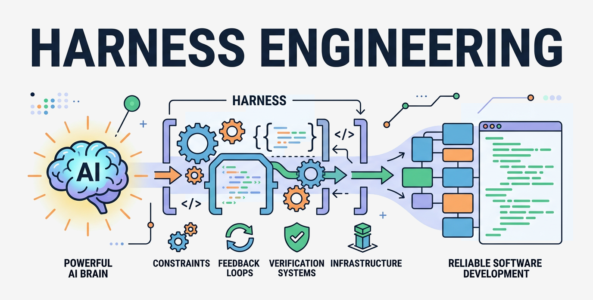
</div>

<!--
請看這幅安全帶工程學的全局技術架構圖。

在核心中央，是具備強大推論能力的 AI 大腦 (AI Reasoning Engine)。

但在它周圍，緊緊包裹著三層堅固的工程護甲：

最上方是規格契約層 (Specification Layer)：包含 OpenAPI 定義、資料綱要與結構化指令；
兩側是沙盒執行層 (Execution Sandbox)：受控的虛擬機環境、受限的 API 權限；
最下方則是不可妥協的測試驗證層 (Verification Layer)：單元測試、型別檢查器、安全 linter 與持續整合流水線。

這張圖生動詮釋了現代軟體流程的真諦：我們不需要害怕 AI 的隨機性，因為整個工程裝備體系保證了只有符合規格的乾淨產物才能進入生產代碼庫。

總結這張投影片，請記住這個核心觀念：Harness Engineering 透過分層防禦將機率性的大模型包裹在確定性的工程護甲中。
-->
---
## AI 規格驅動開發的四大黃金法則

在 AI 輔助開發的現代軟體工程中，每位工程師必須嚴格奉行四項核心鐵律：

* **1. 規格即單一真理來源 (Specifications as Single Source of Truth)：**
  - 絕不在沒有明確規格、型別定義或驗收標準的情況下要求 AI 撰寫代碼。
* **2. 確定性驗證先於代碼生成 (Deterministic Tests Precede Code)：**
  - **TDD 在 AI 時代更加關鍵！** 先由人類或嚴密規格定義出測試用例（紅燈），再命 AI 產出實作使其變綠燈。
* **3. 絕不合併無法捍衛的代碼 (Never Merge Code You Cannot Defend)：**
  - 嚴格杜絕「雖然不懂但它跑得動」的盲目合併心態。每位工程師都必須能為進入 main 分支的每一行代碼負起完全的架構與安全責任。
* **4. 維持嚴格的代理人沙盒邊界 (Maintain Strict Sandbox Boundaries)：**
  - 限制 AI 工具調用與檔案存取權限，落實最小權限原則 (Principle of Least Privilege)。

> **軟體工程師的全新角色定位：** 你不再只是代碼打字員，而是**系統總建築師 (Systems Architect)、規格撰寫者 (Specification Author) 與驗證治理官 (Verification Governor)**。

<!--
請大家將這四條黃金法則銘刻在心。

第一條：規格是唯一的真理。
第二條：測試先行！讓 AI 有明確的靶可以打。
第三條最重要：永遠不要合併你無法理解、無法向架構師辯護的程式碼！如果線上系統在半夜崩潰，你不能向主管說：「這段代碼是 AI 寫的，我不知道它在幹嘛。」
第四條：沙盒隔離。

你在這個時代的身份已經昇華了：你不再是打字員，你是系統總建築師與驗證治理官。

總結這張投影片，請記住這個核心觀念：恪守四大黃金法則，在 AI 浪潮中成為引領規格與捍衛品質的現代軟體總建築師。
-->
---
### 觀念檢測：AI 驗證守門員 (CCQ 14)
<!-- id: ase-ch02-ccq14 -->

<div class="ccq-columns">
  <div class="ccq-text">

在現代「AI 規格驅動開發 (AI Specification-Driven)」實務中，自動化 CI/CD 流水線與單元測試套件扮演何種至關重要的決定性角色？

- **A.** 只是用來降低工程師的打字速度以防止手指過勞。
- **B.** 作為不可妥協的「確定性驗證守門員 (Deterministic Gatekeeper)」，確保機率性的 AI 生成代碼能被精準驗證並安全收斂。
- **C.** 完全取代人類產品負責人 (PO) 進行商業合約簽署。
- **D.** 強制要求所有 AI 代理人每小時必須在終端機重啟一次以釋放記憶體。

  </div>
  <div class="ccq-logo">
    <a href="https://nlhsueh.github.io/nickedupocket/#/student/ase-ch02-ccq14" target="_blank">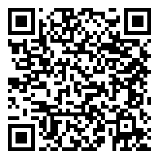</a>
  </div>
</div>

<!--
最後一題觀念檢測！請掃描 QR Code。

題目問：在 AI 規格驅動開發中，自動化 CI/CD 流水線扮演什麼角色？

選項：
A：防止工程師手指過勞。
B：作為不可妥協的「確定性驗證守門員」，確保機率性的 AI 代碼被精準驗證並收斂。
C：取代 PO 簽約。
D：強制重開機。

請大家根據剛剛講的 Harness 架構投下最後一票！

（解析：正確答案是 B。AI 本質是機率模型，唯有確定性的編譯器與單元測試，才能作為可靠的守門員，阻止劣質代碼流入生產環境。）

總結這張投影片，請記住這個核心觀念：自動化測試是 AI 時代唯一可信賴的確定性守門員，是駕馭大模型的堅固韁繩。
-->
---
<!-- _class: lead -->
<!-- header: '2.10 重點總結與經典文獻' -->

# **2.10 重點總結與經典文獻**

> "Theory without practice is empty; practice without theory is blind."  
> 「理論缺乏實踐是空洞的；實踐缺乏理論是盲目的。」  
> — *Immanuel Kant (康德)*

<!--
我們來到本章的最後一個單元：2.10 重點總結與經典文獻。

學完這一章，大家已經完整遍覽了軟體工程半個世紀以來從瀑布、敏捷到 AI 前沿的宏大思想演進。

讓我們用最後的填空測驗回顧九大核心模組的關鍵觀念。

總結這張投影片，請記住這個核心觀念：理論指引工程實踐，實踐驗證工程理論。
-->
---
<!-- header: '2.10 重點總結與經典文獻' -->

## 第二章核心觀念重點測驗 (填空檢核)

檢驗你對軟體開發流程九大模組核心觀念的掌握程度：

1. 軟體工程的四大通用核心活動分別為**軟體規格說明**、**軟體設計與實作**、**軟體驗證與確認**以及**軟體演化**。
2. 瀑布模型將開發切分為嚴格序列階段，其最致命的風險在於將可運行的軟體交付與客戶回饋延後到了整個週期的**最末端 (Big Bang)**。
3. V-模型的核心價值在於**測試左移 (Shift-Left Testing)** 與需求測試間的**雙向追溯性 (Traceability)**。
4. 敏捷的核心哲學是「回應**變更**重於遵循計畫」；進度的唯一真實度量標準是**可運行的軟體 (Working Software)**。
5. 看板框架透過對欄位強制設定**在製品數量上限 (WIP Limits)**，暴露流程瓶頸並落實拉動系統。
6. Ward Cunningham 提出的**技術債 (Technical Debt)** 隱喻指出，為了趕進度抄捷徑就如同向未來借款，未來修改代碼時所付出的額外痛苦時間即為**利息**。
7. 在極限編程 (XP) 中，測試驅動開發 (TDD) 的三部曲循環為 **RED (紅燈失敗)** → **GREEN (綠燈通過)** → **REFACTOR (重構優化)**。
8. DevOps 打破了開發與維運之間的混亂之牆，透過 **CI (持續整合)** 與 **CD (持續交付/部署)** 實現快速且可靠的發布。
9. 在 AI 規格驅動開發中，包裹在機率性大語言模型外圍的確定性編譯器與測試防護體系稱為**工程安全裝備 (Engineering Harness)**。

<!--
請大家看這九道填空題。

這是今天整堂課的精華濃縮：
四大核心活動、瀑布的大爆炸交付風險、V-模型的測試左移、敏捷的核心度量、看板的 WIP 限制、技術債的利息、TDD 的紅綠重構、DevOps 的 CI/CD，以及 AI 時代的 Harness 安全裝備。

只要能清晰回答這九個問題，你就真正掌握了第二章的核心精髓。

總結這張投影片，請記住這個核心觀念：九大觀念串聯起軟體流程的歷史演進與未來前沿，是每位軟體工程師必備的思維武器庫。
-->
---
## 經典文獻與延伸閱讀 (References)

* **Ian Sommerville** (2016). *Software Engineering* (10th Edition). Pearson. *(經典教科書第 2 章：軟體流程)*
* **Kent Beck** (2004). *Extreme Programming Explained: Embrace Change* (2nd Edition). Addison-Wesley. *(極限編程開山經典)*
* **Martin Fowler** (2018). *Refactoring: Improving the Design of Existing Code* (2nd Edition). Addison-Wesley. *(代碼重構聖經)*
* **Ken Schwaber & Jeff Sutherland** (2020). *The Scrum Guide*. [scrumguides.org](https://scrumguides.org/) *(Scrum 官方指南)*
* **David J. Anderson** (2010). *Kanban: Successful Evolutionary Change for Your Technology Business*. Blue Hole Press. *(看板方法論基石)*
* **Nicole Forsgren, Jez Humble, Gene Kim** (2018). *Accelerate: The Science of Lean Software and DevOps*. IT Revolution. *(DORA 四大指標與研發效能科學實證研究)*
* **Henrik Kniberg** (2016). *Making sense of MVP (Minimum Viable Product)*. Crisp Blog. *(滑板到汽車經典 MVP 隱喻)*

<!--
在簡報的最後，為大家列出第二章引用的經典文獻與延伸閱讀書單。

Sommerville 的教科書是學術基石；Kent Beck 的《極限編程》與 Martin Fowler 的《重構》是工程師必讀的技術聖經；
想深入專案管理的同學可以研讀《Scrum Guide》與 Anderson 的《Kanban》；
而想理解 DevOps 科學實證數據的同學，強烈推薦這本《Accelerate》。

希望大家在未來的專案實踐中，能持續活用這些經典理論與工程實踐。

總結這張投影片，請記住這個核心觀念：閱讀大師經典，將理論融會貫通於日常實踐，是成為卓越軟體架構師的必經之路。謝謝大家！
-->

<script>
(function() {
  // =========================================================================
  // 1. Header Dropdown (Table of Contents / Outline)
  // =========================================================================
  function initHeaderDropdown() {
    const sections = [];
    const seenTitles = new Set();
    const slideSections = document.querySelectorAll('section[id]');
    
    // 1. Scan unique section titles and their slide IDs
    slideSections.forEach(sec => {
      const header = sec.querySelector('header');
      if (!header) return;
      
      let title = header.textContent.trim();
      title = title.replace(/^[◄◀]\s*/, '').replace(/\s*[►▶]$/, '').trim();
      if (!title || seenTitles.has(title)) return;
      
      seenTitles.add(title);
      sections.push({
        id: sec.id,
        title: title
      });
    });

    if (sections.length === 0) return;

    // Detect language: if slide titles don't have Chinese characters, use English
    const allTitles = sections.map(s => s.title).join('');
    const isEn = !/[\u4e00-\u9fa5]/.test(allTitles);
    const txtOutline = isEn ? '📑 Table of Contents' : '📑 章節目錄';
    const txtTitleTooltip = isEn ? 'Click to pin or hover to view outline' : '點擊固定或懸停查看章節目錄';
    const txtPrev = isEn ? 'Previous Section' : '上一章節';
    const txtNext = isEn ? 'Next Section' : '下一章節';

    // Helper to create the dropdown DOM
    function createDropdownWrapper(currentTitle) {
      const wrapper = document.createElement('span');
      wrapper.className = 'header-nav-wrapper';
      
      const titleSpan = document.createElement('span');
      titleSpan.className = 'header-nav-title';
      titleSpan.title = txtTitleTooltip;
      titleSpan.innerHTML = currentTitle + '<span class="nav-caret"> ▾</span>';
      
      titleSpan.addEventListener('click', function(e) {
        e.stopPropagation();
        const wasOpen = wrapper.classList.contains('is-open');
        document.querySelectorAll('.header-nav-wrapper.is-open').forEach(w => w.classList.remove('is-open'));
        if (!wasOpen) {
          wrapper.classList.add('is-open');
        }
      });
      
      const dropdown = document.createElement('div');
      dropdown.className = 'nav-dropdown';
      
      dropdown.addEventListener('click', function(e) {
        e.stopPropagation();
      });
      
      const dropHeader = document.createElement('div');
      dropHeader.className = 'nav-dropdown-header';
      dropHeader.innerHTML = '<span>' + txtOutline + '</span>';
      dropdown.appendChild(dropHeader);
      
      const grid = document.createElement('div');
      grid.className = 'nav-dropdown-grid';
      
      sections.forEach(s => {
        const item = document.createElement('a');
        const isActive = (s.title === currentTitle);
        item.className = 'nav-dropdown-item' + (isActive ? ' active' : '');
        item.href = '#' + s.id;
        item.innerHTML = '<span class="badge">#' + s.id.padStart(2, '0') + '</span><span class="item-text" title="' + s.title + '">' + s.title + '</span>';
        
        item.addEventListener('click', function(e) {
          e.preventDefault();
          wrapper.classList.remove('is-open');
          dropdown.style.display = 'none';
          const targetHash = '#' + s.id;
          if (window.location.hash === targetHash) {
            window.dispatchEvent(new HashChangeEvent('hashchange'));
          } else {
            window.location.hash = targetHash;
          }
          setTimeout(() => { dropdown.style.display = ''; }, 350);
        });
        
        grid.appendChild(item);
      });
      
      dropdown.appendChild(grid);
      wrapper.appendChild(titleSpan);
      wrapper.appendChild(dropdown);
      return wrapper;
    }

    // Close any pinned dropdown when clicking anywhere outside
    document.addEventListener('click', function(e) {
      if (!e.target.closest('.header-nav-wrapper')) {
        document.querySelectorAll('.header-nav-wrapper.is-open').forEach(w => w.classList.remove('is-open'));
      }
    });

    // 2. Enhance each header element across all slides
    slideSections.forEach(sec => {
      const header = sec.querySelector('header');
      if (!header || header.dataset.navEnhanced) return;
      header.dataset.navEnhanced = 'true';
      
      const links = header.querySelectorAll('a');
      let prevLink = null;
      let nextLink = null;
      
      links.forEach(a => {
        const txt = a.textContent.trim();
        if (txt === '◄' || txt === '◀') prevLink = a;
        if (txt === '►' || txt === '▶') nextLink = a;
      });
      
      let title = header.textContent.trim();
      title = title.replace(/^[◄◀]\s*/, '').replace(/\s*[►▶]$/, '').trim();
      if (!title) return;
      
      header.innerHTML = '';
      if (prevLink) {
        prevLink.className = 'header-nav-arrow';
        prevLink.title = txtPrev;
        header.appendChild(prevLink);
        header.appendChild(document.createTextNode(' '));
      }
      
      const wrapper = createDropdownWrapper(title);
      header.appendChild(wrapper);
      
      if (nextLink) {
        header.appendChild(document.createTextNode(' '));
        nextLink.className = 'header-nav-arrow';
        nextLink.title = txtNext;
        header.appendChild(nextLink);
      }
    });
  }

  // =========================================================================
  // 2. Number Quick Jump (<kbd>Num</kbd> + <kbd>Enter</kbd>)
  // =========================================================================
  function initNumberQuickJump() {
    let inputBuffer = '';
    let timer = null;
    let hud = null;

    // Detect language: check titles or body text
    const slideSections = document.querySelectorAll('section[id]');
    let hasZh = false;
    slideSections.forEach(s => {
      if (/[\u4e00-\u9fa5]/.test(s.textContent || '')) hasZh = true;
    });
    const isEn = !hasZh;

    function getOrCreateHud() {
      if (!hud) {
        hud = document.createElement('div');
        hud.id = 'slide-quick-jump-hud';
        hud.style.cssText = [
          'position: fixed',
          'bottom: 36px',
          'left: 50%',
          'transform: translateX(-50%)',
          'background: rgba(15, 23, 42, 0.94)',
          'color: #ffffff',
          'padding: 8px 18px',
          'border-radius: 28px',
          'font-family: -apple-system, BlinkMacSystemFont, "Segoe UI", Roboto, system-ui, sans-serif',
          'font-size: 14px',
          'font-weight: 500',
          'box-shadow: 0 16px 36px rgba(0, 0, 0, 0.35), 0 0 0 1px rgba(255, 255, 255, 0.15)',
          'backdrop-filter: blur(16px)',
          '-webkit-backdrop-filter: blur(16px)',
          'z-index: 999999',
          'display: none',
          'align-items: center',
          'gap: 8px',
          'pointer-events: none',
          'opacity: 0',
          'transition: opacity 0.15s ease, transform 0.15s ease'
        ].join(';');
        const targetParent = document.fullscreenElement || document.body;
        targetParent.appendChild(hud);
      }
      const parent = document.fullscreenElement || document.body;
      if (hud.parentElement !== parent) {
        parent.appendChild(hud);
      }
      return hud;
    }

    function getTotalSlides() {
      const secs = document.querySelectorAll('section[id]');
      return secs.length || 1;
    }

    function showHud() {
      const el = getOrCreateHud();
      const total = getTotalSlides();
      const label = isEn ? 'Go to slide:' : '跳至頁碼:';
      const enterHint = isEn ? 'Enter ↵' : 'Enter 確認 ↵';
      el.innerHTML = '<span>🧭 ' + label + '</span> ' +
        '<strong style="color: #38bdf8; font-size: 20px; font-weight: 700; font-family: ui-monospace, SFMono-Regular, Menlo, monospace; letter-spacing: 1px;">' + inputBuffer + '</strong> ' +
        '<span style="opacity: 0.6; font-size: 13px;">/ ' + total + '</span> ' +
        '<span style="background: rgba(255,255,255,0.18); padding: 2px 7px; border-radius: 6px; font-size: 11px; margin-left: 2px; font-weight: 600;">' + enterHint + '</span>';
      el.style.display = 'flex';
      el.style.opacity = '1';

      if (timer) clearTimeout(timer);
      timer = setTimeout(clearInput, 2800);
    }

    function clearInput() {
      inputBuffer = '';
      if (timer) {
        clearTimeout(timer);
        timer = null;
      }
      if (hud) {
        hud.style.opacity = '0';
        setTimeout(() => {
          if (inputBuffer === '' && hud) hud.style.display = 'none';
        }, 150);
      }
    }

    function jumpToSlide(num) {
      const total = getTotalSlides();
      const target = Math.max(1, Math.min(num, total));
      const targetHash = '#' + target;
      
      // Visual flash confirmation
      const el = getOrCreateHud();
      const confirmedMsg = isEn ? ('✓ Slide ' + target) : ('✓ 第 ' + target + ' 頁');
      el.innerHTML = '<span style="color: #34d399; font-weight: 700; font-size: 15px;">' + confirmedMsg + '</span>';
      el.style.display = 'flex';
      el.style.opacity = '1';
      setTimeout(clearInput, 500);

      if (window.location.hash === targetHash) {
        window.dispatchEvent(new HashChangeEvent('hashchange'));
      } else {
        window.location.hash = targetHash;
      }
    }

    window.addEventListener('keydown', function(e) {
      // Don't intercept when focusing editable form elements
      const active = document.activeElement;
      if (active && (active.tagName === 'INPUT' || active.tagName === 'TEXTAREA' || active.tagName === 'SELECT' || active.isContentEditable)) {
        return;
      }

      // Ignore if modifier keys are pressed
      if (e.ctrlKey || e.altKey || e.metaKey) {
        return;
      }

      // Resolve digit from key or code (supports '2', 'Digit2', 'Numpad2')
      let digit = null;
      if (e.key >= '0' && e.key <= '9') {
        digit = e.key;
      } else if (/^(?:Digit|Numpad)([0-9])$/.test(e.key)) {
        digit = e.key.replace(/^(?:Digit|Numpad)/, '');
      } else if (/^(?:Digit|Numpad)([0-9])$/.test(e.code || '')) {
        digit = (e.code || '').replace(/^(?:Digit|Numpad)/, '');
      }

      if (digit !== null) {
        inputBuffer += digit;
        if (inputBuffer.length > 4) inputBuffer = inputBuffer.slice(-4);
        showHud();
        return;
      }

      // Backspace
      if ((e.key === 'Backspace' || e.code === 'Backspace') && inputBuffer.length > 0) {
        e.preventDefault();
        e.stopPropagation();
        inputBuffer = inputBuffer.slice(0, -1);
        if (inputBuffer.length === 0) {
          clearInput();
        } else {
          showHud();
        }
        return;
      }

      // Escape
      if ((e.key === 'Escape' || e.code === 'Escape') && inputBuffer.length > 0) {
        e.preventDefault();
        e.stopPropagation();
        clearInput();
        return;
      }

      // Enter key confirms numeric jump
      if ((e.key === 'Enter' || e.code === 'Enter' || e.code === 'NumpadEnter') && inputBuffer.length > 0) {
        e.preventDefault();
        e.stopPropagation();
        const targetPage = parseInt(inputBuffer, 10);
        if (!isNaN(targetPage)) {
          jumpToSlide(targetPage);
        } else {
          clearInput();
        }
      }
    }, true);
  }

  // Initialize both features
  function init() {
    initHeaderDropdown();
    initNumberQuickJump();
  }

  if (document.readyState === 'loading') {
    document.addEventListener('DOMContentLoaded', init);
  } else {
    init();
  }
  setTimeout(init, 400);
})();

</script>
