# 軟體工程

### 第三課：需求工程 (Requirements Engineering)

**授課教師：薛念林 教授**  
資訊工程學系  
逢甲大學

<!--
各位好，歡迎來到軟體工程第三課。今天我們的核心聚焦在「需求工程 (Requirements Engineering)」。

在軟體工程專案中，沒有任何事情比以極致完美的技術實作出一個「完全錯誤的產品」更具毀滅性且代價高昂了。你可以擁有最優雅的高效演算法、零編譯錯誤的純淨程式碼，以及最頂尖的微服務架構，但如果它無法解決使用者面臨的真實問題，那麼這項專案從根本上就是一場徹底的失敗。

在接下來的課堂中，我們將深入探討如何發掘、結構化、驗證與治理軟體需求，並一窺現代生成式 AI 與大型語言模型如何為這門關鍵學科帶來突破性的賦能與變革。

總結這張投影片，請記住這個核心觀念：需求工程的核心使命，就是確保我們在投入資源「把系統做對」之前，先精確確定「做對了系統」。
-->
---
<!-- _class: outline outline-slide -->

## 第三章：課程大綱與核心架構

  

    <h3>第一部分：需求基礎、分類與度量指標</h3>
    <ul>
      <li><b>3.1 需求工程基礎：</b> 何謂需求工程、延遲修復缺陷的代價曲線、使用者需求 vs. 系統需求。</li>
      <li><b>3.2 利害關係人與需求分類：</b> 利害關係人多重視角、功能性需求與領域規則。</li>
      <li><b>3.3 非功能性需求與量化指標：</b> 品質屬性 (FURPS+)、主觀目標轉化為可客觀測試的量化指標。</li>
    </ul>
  

  

    <h3>第二部分：需求擷取、驗證與 AI 賦能</h3>
    <ul>
      <li><b>3.4 需求擷取與系統建模：</b> 四大擷取步驟、訪談與情境分析、UML 使用案例圖與規格書撰寫。</li>
      <li><b>3.5 需求驗證與變更管理：</b> 五大驗證支柱（有效性、一致性、完整性等）、追溯矩陣與變更控制。</li>
      <li><b>3.6 AI 賦能需求工程：</b> 大型語言模型輔助、使用者故事生成、模糊性檢測與人機協同防護。</li>
      <li><b>3.7 觀念總結與經典文獻：</b> 重點填空測驗、深度思考問題、核心回顧與參考文獻。</li>
    </ul>
  

<!--
這是我們第三章的學習藍圖。

在左側的第一部分，我們建立需求工程的根本定義，釐清使用者需求與系統需求的核心邊界，並學習如何將主觀模糊的非功能品質目標轉化為可客觀測試的量化指標。

在右側的第二部分，我們掌握四大需求擷取實務手法、UML 使用案例建模、五大需求驗證支柱與追溯矩陣，最後探討大型語言模型如何作為需求副駕駛並落實人機協同防護。

總結這張投影片，請記住這個核心觀念：這份藍圖將引領我們從利害關係人模糊混沌的初始期待，逐步收斂為精確、客觀且可驗收的軟體工程規格。
-->
---
## 本章核心思考問題

* 何謂**需求工程 (Requirements Engineering, RE)**？為何在早期捕捉並修正需求錯誤如此關鍵？
* **使用者需求 (User Requirements)** 與**系統需求 (System Requirements)** 的本質差異為何？
* **功能性需求 (Functional)**、**非功能性需求 (Non-Functional)** 與**領域需求 (Domain Requirements)** 如何區分？
* **需求擷取與分析 (Elicitation & Analysis)** 流程的四大核心活動為何？
* 如何將模糊主觀的非功能品質目標，轉化為**可客觀量化與測試的工程指標**？
* 現代**大型語言模型 (LLM)** 如何加速需求工程流程？人機協同 (Human-in-the-Loop) 的防護機制又該如何落實？

<!--
在深入各單元細節前，請大家在整個課堂學習過程中隨時將這六個核心思考問題放在心中。

第一，為什麼在開發早期釐清需求誤解，其成本會比系統上線後在正式環境搶修便宜百倍以上？

第二，我們如何清楚劃分高階使用者的業務期望，與作為工程合約基線的技術細節規格？

第三，為什麼資安、效能與可靠度等非功能性需求，才是實質塑造軟體系統架構最關鍵的決定因素？

最後，在生成式 AI 當道的今天，我們該如何善用 AI 工具加速規格產出，同時嚴防 AI 幻覺所帶來的工程災難？

總結這張投影片，請記住這個核心觀念：帶著這六大關鍵問題出發，將成為我們貫通第三章理論與實務的最佳指南針。
-->
---
<!-- _class: lead -->
<!-- header: '3.1 需求工程基礎' -->

# **3.1 需求工程基礎 (Foundations of RE)**

> "The hardest single part of building a software system is deciding precisely what to build."  
> 「建構軟體系統最困難的單一工作，就是精確決定到底要打造什麼。」  
> — *Fred Brooks, No Silver Bullet (人月神話作者, 1987)*

<!--
現在進入 3.1 節：需求工程基礎。

如同圖靈獎得主 Fred Brooks 在其經典傳世之作《沒有銀彈》中所言，打造軟體系統最艱鉅的概念性工作，莫過於精準決定到底要建構什麼。如果需求一開始就錯了，後續再優雅的架構與零缺陷的程式碼，也不過是極有效率地生產出錯誤的廢品。

在本單元中，我們將建立需求的嚴謹定義、釐清使用者需求與系統需求的分界，並探討為何儘早消除需求模糊性，能為專案省下高達百倍的修正成本。

總結這張投影片，請記住這個核心觀念：需求工程跨越了人類商業願景與硬體程式實作之間的巨大鴻溝，是奠定軟體專案成功的最根本基石。
-->
---
## 模稜兩可的指數級代價 (The Exponential Cost of Ambiguity)

> 「打造軟體系統最艱鉅的概念性工作，莫過於精準決定到底要建構什麼……沒有其他部分在事後修正起來會如此艱難。」 — *Fred Brooks (1987)*

  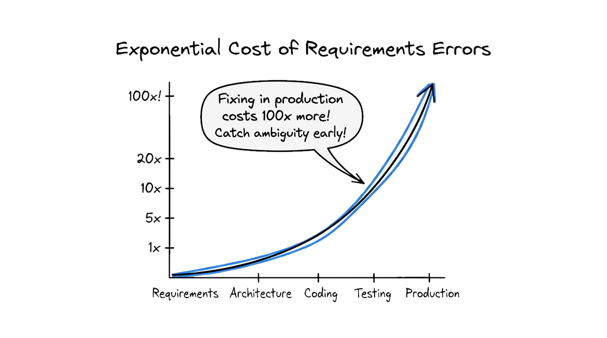

  
  

    Fred Brooks (1931–2022)
    <a href="https://en.wikipedia.org/wiki/Fred_Brooks" target="_blank">Wikimedia Commons / 維基百科</a>
  

<!--
請大家看這張手繪圖表：「模稜兩可的指數級代價 (The Exponential Cost of Ambiguity)」。

注意這條由左下往右上陡峭攀升的指數曲線。如果在需求定義階段就發現了邏輯漏洞或溝通誤解，修正的代價極為低廉——可能只需要在規格書上修改一句話、重畫一張流程圖。

但看看隨著專案推進，跨過架構設計、程式撰寫、系統整合測試，一路蔓延到正式上線營運時，修正同一個需求缺陷的代價將暴增高達 100 倍！

為什麼會這樣？因為一旦進入生產環境，修正需求代表著你必須打掉重寫既有程式、重建資料庫綱要、重新回歸測試數千個測試案例，甚至還得承受系統無預警停機與客戶流失的商譽損失。

總結這張投影片，請記住這個核心觀念：在早期攔截並澄清需求模糊性，能避免後期帶來百倍膨脹的災難性返工成本。
-->
---
## 需求工程的基礎本質 (Foundations of RE)

> 建立客戶對系統所需之服務，以及系統運作與開發過程中所受限制的系統化工程程序。

* **需求的雙重商業功能 (Dual Function):**
  1. **招標與合約洽談 (Contract Bidding):** 高階抽象敘述，容許不同承包廠商提出多元解法與報價。
  2. **合約實施基準 (Contract Basis):** 精確詳盡的功能規格，嚴格定義團隊最終交付的具體技術內容。
* **工程的核心使命 (The Fundamental Goal):**
  - 跨越利害關係人複雜、模稜兩可且充滿變數的人類真實世界，與確定、精準且邏輯嚴密的軟體系統之間的溝通鴻溝。

<!--
我們首先來定義需求工程的本質。

請看上方的引言：需求工程是一個系統化的程序，用來確立客戶期望系統提供的各項服務，以及系統在運作與開發過程中所受到的各項約束。

在商業實務上，需求具備巧妙的雙重功能：在專案招標初期，客戶需要相對高階抽象的需求陳述，以便讓多家軟體開發商提出不同的架構解法與競標報價；而一旦合約簽訂，工程團隊則需要極度詳盡精確的規格，作為驗收與落實交付的唯一法律與技術基準。

作為軟體工程師，我們的核心使命就是扮演橋樑，將混亂模糊的人類期望轉化為精確無誤的電腦系統執行藍圖。

總結這張投影片，請記住這個核心觀念：需求工程是連結人類主觀意圖與電腦客觀實作的嚴謹轉譯工程。
-->
---
<!-- _class: full-image-slide -->

  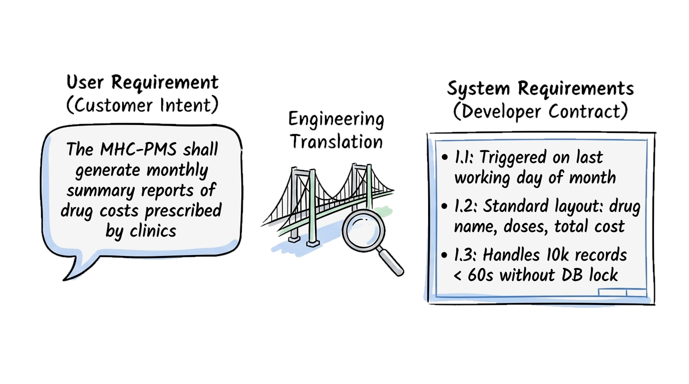

<!--
請看這幅手繪觀念圖：「跨越溝通鴻溝 (Bridging the Communication Chasm)」。

在圖的左側對話框中，我們看到的是使用者需求：以自然語言表達的高階客戶心願。例如：「本心理健康系統應每月自動產出各診所開立處方藥品之費用彙總報表。」

在圖中央，正是我們軟體工程師手持放大鏡所搭建的「工程轉譯橋樑」！

到了右側，轉譯為結構嚴謹的系統需求：精確規範了排程觸發時間（每月最後一個工作日）、資料表欄位定義，以及效能閾值——在處理超過 10,000 筆資料時，計算產製必須在 60 秒內完成且不得鎖定交易資料庫。

總結這張投影片，請記住這個核心觀念：需求工程的核心價值，就在於將使用者模糊的高階期望精確轉化為開發者可落地的技術契約。
-->
---
## 需求層次：使用者、系統與領域需求

* **使用者需求 (User Requirements):**
  - 以自然語言搭配簡明圖表撰寫的高階抽象陳述。
  - 目標受眾：**客戶端主管、系統終端使用者、專案經理與非技術利害關係人。**
  - 核心焦點：從使用者視角界定系統應提供**什麼 (What)** 服務。
* **系統需求 (System Requirements):**
  - 結構化、技術精確的詳細規格，嚴格定義系統功能、服務與運作約束。
  - 目標受眾：**軟體架構師、後端與前端工程師、品質驗證 (QA) 測試人員。**
  - 核心焦點：作為系統具體實作、驗收測試與工程合約的技術基線 (Technical Contract)。
* **領域需求 (Domain Requirements):**
  - 源自業務領域、產業法規或物理環境的根本運作約束 (如醫療隱私法規、金融合規)。
  - 不可撼動性：直接反映現實世界的強制規範，往往具備凌駕使用者偏好的最高約束力。

<!--
在需求工程中，最經典也最重要的分界，就是「使用者需求」與「系統需求」。

使用者需求面向的是非技術背景的利害關係人。它使用一般大眾熟悉的日常語言，著重在系統外在可觀察到的業務價值，描述系統到底能為使用者做些什麼。

相對地，系統需求則是寫給工程團隊看的專業藍圖。它詳盡定義了資料結構、輸入輸出格式、前置條件、例外處理流程以及效能指標，是開發與 QA 人員進行單元測試與驗收的唯一合約基線。

千萬不要混淆兩者的受眾：給院長看一份兩百頁的 RESTful API 規格會讓他不知所措；而給工程師一句模糊的使用者心願，只會導致寫出背離需求的錯誤程式碼。

總結這張投影片，請記住這個核心觀念：使用者需求傳達客戶願景，系統需求則建立工程師落實交付的技術契約。
-->
---
## 使用者需求 vs. 系統需求範例 (MHC-PMS 心理健康管理系統)

* **使用者需求 (高階業務意圖):**
  > *「心理健康病患管理系統 (MHC-PMS) 應每月產出彙總報表，顯示各診所開立處方藥品之總花費金額。」*
* **系統需求 (精確技術合約規格):**
  - **1.1：** 系統應於每月最後一個工作日的 23:59:59，自動產出各註冊診所當月藥品成本的彙總報表。
  - **1.2：** 報表應採用標準版型呈現，明確列出藥品代碼、藥品名稱、開立總劑量單位與各別加總總金額。
  - **1.3：** 若單一診所藥品資料量超過 10,000 筆，報表產製計算應於 60 秒內完成，且不得造成線上交易資料庫鎖定 (Locking)。
* **領域需求 (醫療法規與臨床約束):**
  - **D.1 (病患隱私去識別化)：** 依據醫療資訊隱私法規 (如 HIPAA / 醫療法)，費用報表必須高度彙總，嚴禁反推或洩漏個別病患身分。
  - **D.2 (法定藥典標準代碼)：** 藥品代碼與計量單位必須嚴格遵循國家法定藥典標準 (如健保代碼 / FDA NDC)，禁止自訂非正規別名。

<!--
讓我們透過醫院心理健康病患管理系統 (MHC-PMS) 的具體範例，來看這兩者的落地對比。

上方是使用者需求：短短一句話「系統應每月產出彙總報表，顯示各診所開立處方藥品的總金額」。對醫院主管而言，這已經完整表達了他的業務需求。

但看下方的系統需求：工程師必須將這句意圖拆解為三條嚴密、無歧義的技術規格！

規格 1.1 精確定義了時間觸發點；規格 1.2 具體規定了資料欄位版面；規格 1.3 則加上了關鍵的非功能性邊界約束：一萬筆資料必須在 60 秒內跑完，且絕對不能鎖住正式環境的交易資料庫。

總結這張投影片，請記住這個核心觀念：系統需求將高階業務敘述轉譯為具備明確時限、邊界條件與可測試性的工程合約。
-->
---
<!-- _class: full-image-slide -->

  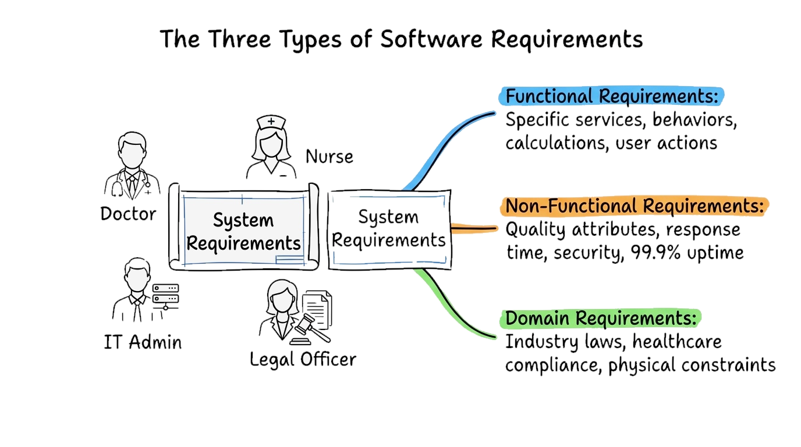

<!--
請看這幅手繪架構心智圖：「軟體需求全景 (The Spectrum of Requirements)」。

在正中央是我們系統藍圖的核心，周圍環繞著多元的利害關係人：醫師、護理師、病患、IT 管理員與外部稽核員。

觀察向外放射的三大彩色支柱：藍色支柱代表「功能性需求」，定義了系統提供的具體計算與操作功能；橘色支柱代表「非功能性需求」，規範了資安、可用性與 99.9% 上線時間等品質屬性；綠色支柱代表「領域需求」，由醫療法規與外部實體限制所強制規範。

一個成功的軟體系統，必須在這三大支柱間取得完美的結構平衡。

總結這張投影片，請記住這個核心觀念：完整的軟體規格必須同時涵蓋系統做什麼、具備何種品質水準，以及必須服從哪些領域環境法則。
-->
---
### 觀念檢測：使用者需求 vs. 系統需求 (CCQ 1)
<!-- id: ase-ch03-ccq1 -->

  

在需求工程中，「使用者需求 (User Requirements)」與「系統需求 (System Requirements)」最關鍵的實務運作差異為何？

- **A.** 使用者需求是利害關係人的高階目標；系統需求則是供開發者實作的精確功能合約。
- **B.** 使用者需求限定於 UI 線框圖；系統需求則專指後端資料庫的資料表綱要設計。
- **C.** 使用者需求簽署後絕不可變更；系統需求則需在每日站立會議中持續進行重構。
- **D.** 使用者需求來自外部法規稽核團隊；系統需求則由編譯器工具自動解析產生。

  

  

    
  

<!--
現在是觀念檢測時間！請大家拿出手機掃描螢幕上的 QR Code 進行線上作答。

題目問的是：在需求工程中，使用者需求與系統需求最關鍵的實務運作差異為何？

我們來逐一檢視選項：
選項 B 狹隘地把兩者簡化為 UI 畫面與資料庫；
選項 C 聲稱使用者需求永不變更，這違背了軟體持續演進的敏捷本質；
選項 D 聲稱系統需求是由編譯器自動產生的，這顯然混淆了工具鏈。

正確答案是選項 A！使用者需求負責傳遞客戶與業務端的高階目標，而系統需求則是為工程團隊建立精準無歧義的實作與驗收合約。

總結這張投影片，請記住這個核心觀念：使用者需求定義客戶要什麼，系統需求精確規範工程師該打造什麼。
-->
---
<!-- _class: lead -->
<!-- header: '3.2 利害關係人與需求分類' -->

# **3.2 系統利害關係人與需求分類 (Stakeholders & Classification)**

> "Software systems have many masters. If you fail to identify who has a stake, their unspoken expectations will become your project's failure."  
> 「軟體系統往往有多位主人。若未能全面辨識誰有利害關係，他們未曾言明的隱藏期望，終將成為專案失敗的致命傷。」

<!--
現在進入 3.2 節：系統利害關係人與需求分類。

軟體系統從來不是孤立存在的程式碼。它服務的是整個複雜的利害關係人生態系——從第一線操作的基層人員、負責維運與成本效益的主管，到外部制定法規與審查標準的監管機構。

在本單元中，我們將學習如何盤點各方利害關係人、化解彼此間常見的利益衝突，並將需求嚴謹歸納為「功能性需求」、「非功能性需求」與「領域需求」三大類別。

總結這張投影片，請記住這個核心觀念：全面辨識利害關係人角色並調和其衝突期望，是編寫出務實可行系統規格的先決條件。
-->
---
## 系統利害關係人 (System Stakeholders)

> 任何受到系統運作所影響，或對系統行為與產出結果具備合理正當利益關係的個人或組織。

* **利害關係人多元類別 (Types of Stakeholders):**
  - **終端操作者 (End Users):** 病患、主治醫師、護理師、門診掛號櫃檯行政人員。
  - **系統維運與管理層 (System Managers):** 醫院診所主管、資訊長 (CIO)、資訊安全與法規合規主管。
  - **外部利害關係人 (External Stakeholders):** 衛生主管機關、醫療器材認證審查機構、健保給付與商業保險機構。
* **利害關係人目標衝突之挑戰 (The Stakeholder Conflict Challenge):**
  - 不同角色常具備相互競爭甚至矛盾的需求（例如：醫師要求單鍵快速開藥無摩擦；資安主管要求強制多因子身分認證與不可竄改稽核日誌）。

<!--
在 3.2 節中，我們要問的第一個關鍵問題是：到底由誰來定義需求？答案就是「利害關係人 (Stakeholders)」。

請看上方的定義：任何會受到系統影響，或者對系統行為具有正當利益關係的人或組織，都是利害關係人。

以醫療資訊系統為例，利害關係人不僅包括日常操作系統的醫師與護理師，還包括管預算與維運的資訊室主任，甚至還包括從沒摸過系統、但手握法規裁罰權的衛生福利主管機關與健保審查單位。

需求工程最艱鉅的挑戰，就是利害關係人彼此的期望往往是強烈衝突的！醫師希望開藥介面極速簡便、一鍵送出；但資安與法規主管卻強制要求跳出多步驟驗證、輸入兩階段密碼並寫入不可竄改的日誌。如何調和這些矛盾，是架構師的核心專業。

總結這張投影片，請記住這個核心觀念：軟體工程要求工程師主動協商、權衡並調和多方利害關係人間互相衝突的優先級。
-->
---
## 軟體需求三大類型：功能、非功能與領域 (Requirements Triad)

1. **功能性需求 (Functional Requirements):**
   - 描述系統應提供之特定服務、系統對特定輸入之反應行為，或系統明確**不可執行**之行為。
2. **非功能性需求 (Non-Functional Requirements):**
   - 針對系統服務或功能所施加之約束與品質屬性（例如：回應時間、資訊安全、系統可用性、資料隱私）。
3. **領域需求 (Domain Requirements):**
   - 源自系統運作所在特定業務領域或環境所衍生的強制約束（例如：醫療法規、金融加密標準、物理定律）。
   - *關鍵工程準則：領域需求往往具備最高強制力，凌駕於功能性與非功能性需求之上！*

<!--
我們將軟體需求劃分為三大經典類型：

第一，功能性需求：描述系統具體提供哪些主動功能與運算服務——接受什麼輸入、產出什麼輸出，以及在特定條件下必須或「絕對禁止」做些什麼。

第二，非功能性需求：規範系統功能的執行品質約束——例如交易回應速度、系統抗攻擊能力、全年上線時間比例以及災難復原時限。

第三，領域需求：源自於軟體運作所身處的特定產業或物理環境。例如醫療器材軟體的 FDA 法規、跨國銀行的反洗錢通報規範，或是飛控系統的空氣動力學物理常數。如果違反領域需求，軟體就算功能再強大，在法律或物理上根本無法合法部署上線！

總結這張投影片，請記住這個核心觀念：功能性需求描述系統服務，非功能性需求界定品質約束，領域需求則遵循外在環境法規。
-->
---
<!-- _class: full-image-slide -->

  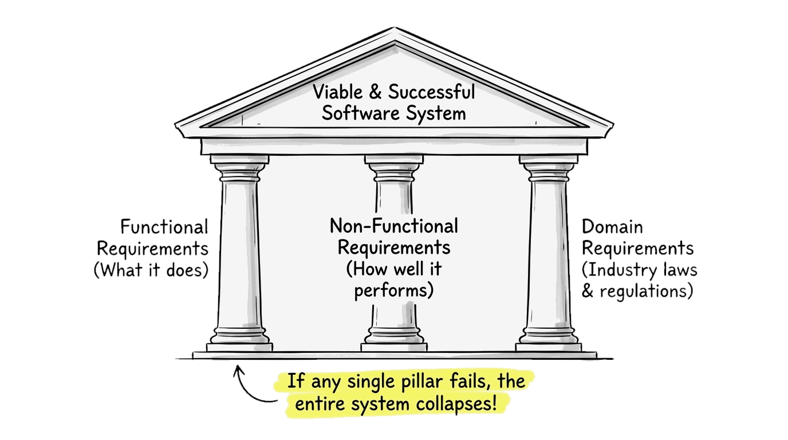

<!--
請看這幅手繪建築素描：「軟體需求三大支柱 (The Triad of Requirements)」。

注意這座經典希臘神廟山牆：屋頂代表著「可行且成功的軟體系統 (Viable & Successful Software System)」。

支撐這座神廟的是三根缺一不可的堅固石柱：功能性需求（做什麼）、非功能性需求（表現得多好），以及領域需求（遵循產業法規與現實法則）。

請讀底座的手寫文字警語：「只要其中任何一根支柱崩塌，整座系統大廈將瞬間傾覆瓦解！」一個各項功能齊全、但在萬人尖峰時瞬間當機或違反隱私法規的軟體，在市場上就是徹頭徹尾的失敗。

總結這張投影片，請記住這個核心觀念：軟體系統的生存能力，同等仰賴功能實作、非功能品質與領域合規三者的完美支撐。
-->
---
## 實務案例研討：UberEats 的利害關係人生態系

> 像 UberEats 這類現代外送平台，生動展現了需求如何從具備相互競爭利益的多邊利害關係人生態系中湧現。

* **多邊利害關係人生態系 (Multi-Sided Stakeholder Ecosystem):**
  - **飢腸轆轆的消費者 (Eater):** 要求極速外送、精準預估到達時間 (ETA)、即時 GPS 地圖動態與無障礙退款機制。
  - **合作餐廳店家 (Restaurant Merchant):** 要求充裕的廚房備餐緩衝時間、外送員準時抵達，且一旦起鍋烹調便不可隨意取消扣款。
  - **外送員夥伴 (Delivery Courier):** 要求公平的派單演算法、透明公開的小費分潤、合理的行車距離與安全的違停容許時間。
  - **平台營運核心 (Uber Platform):** 最佳化雙邊市場流動性、透過尖峰動態加價平衡供需，並嚴密防範優惠碼刷單詐欺。
  - **外部監管機關 (External Regulators):** 強制要求食品保溫衛生檢驗標準、外送勞動工時安全保障，以及開立法定統一發票。
* **利害關係人衝突案例 (The Stakeholder Conflict Challenge):**
  - *消費者 vs. 餐廳：* 消費者於下單 5 分鐘後取消；餐廳已使用高檔食材下鍋烹調。究竟這筆食材與營運損失該由誰吸收？

<!--
讓我們以當前大家天天使用的外送平台 UberEats 為例，來剖析真實世界中的利害關係人與需求分類。

UberEats 不是一個簡單的單一使用者 App；它是一個連接四大多邊市場角色與外部法規單位的複雜生態系統。

看看彼此競爭的期望：
消費者希望漢堡在 15 分鐘內熱騰騰送達，地圖上每秒更新外送員位置，若冷掉還能一鍵全額退款。
餐廳店家需要穩定的出餐時間，強烈要求消費者一旦下單超過兩分鐘就不准取消，因為高檔牛排已經下鍋煎烤！
外送員要求派單演算法公平、路程計算精準，並給予足夠的機車停等緩衝。
Uber 平台營運端則需要透過即時動態加價平衡雨天的供需失衡，並嚴密防止優惠代碼遭濫用刷單。

看見衝突點了嗎？當下單 5 分鐘後消費者反悔取消，平台到底該扣誰的錢？這就需要需求工程師制定極為精密的業務狀態轉換規則。

總結這張投影片，請記住這個核心觀念：複雜系統服務於多邊利害關係人生態系，必須透過明確的系統規則調和彼此競爭的利益。
-->
---
## UberEats 實務剖析：需求三大支柱落地

* **1. 功能性需求 (系統服務與主動行為):**
  - 系統應允許消費者依照飲食限制 (素食/無麩質) 與即時外送預估時間 (ETA) 篩選餐廳。
  - 系統應根據外送員即時 GPS 座標與交通工具類型，智慧派發訂單給最適外送員。
  - 系統應於訂單完成交付後，自動執行三方分潤結算並撥款至餐廳、外送員與平台帳戶。
* **2. 非功能性需求 (整體品質與架構約束):**
  - **效能表現 (Performance):** 外送員 GPS 座標在消費者追蹤地圖上的更新延遲應 $\le 2$ 秒。
  - **高可用性 (Availability):** 晚餐尖峰用餐時段 (18:00–21:00) 平台可用性應維持在 $\ge 99.99\%$。
  - **資訊安全 (Security):** 消費者信用卡資訊處理必須通過 PCI-DSS Level 1 權杖化安全規範。
* **3. 領域需求 (運作環境法規與物理限制):**
  - *食品安全法規：* 易腐熟食運送時間與保溫容器必須嚴格符合地方衛生局安全標準。
  - *稅務合規要求：* 系統必須依據各轄區稅法，即時自動產出具備法定效力的電子統一發票。

<!--
現在我們將 UberEats 平台直接映射到「需求三大支柱」：

第一，功能性需求：這些是肉眼可見的業務功能——菜單篩選、即時智慧派單，以及訂單抵達後自動完成的三方帳務分潤。

第二，非功能性需求：這直接主導了架構難度！如果外送員的即時 GPS 定位延遲長達兩分鐘而不是兩秒鐘，消費者會焦躁並灌爆客服電話。如果在週五晚上晚餐尖峰時段支付閘道發生當機，平台每分鐘將損失數百萬營收。

第三，領域需求：由外在法律與實體世界強制規範。食品衛生法規強制限制了熟食外送的最長時限；勞動法規規範了外送員連續接單上限；財政部稅法更要求每筆交易都必須在秒級內開立合法電子發票。

請注意：領域法規具有絕對強制性！如果你的外送系統違反食品衛生或逃漏稅，政府會直接勒令停業，介面再漂亮也無濟於事。

總結這張投影片，請記住這個核心觀念：UberEats 案例證明了功能服務、非功能品質與領域合規三者必須緊密協同運作。
-->
---
## 功能性需求面臨之挑戰：模糊、完全性與一致性

* **需求陳述模糊性 (Requirements Imprecision):**
  - 自然語言先天的語意多義性極易造成多方利害關係人的嚴重認知衝突。
  - *UberEats 實務範例：* 「消費者可在餐點送達前取消訂單。」
    - *消費者認知：* 只要外送員還沒抵達門前，我隨時都能按取消並拿回全額退款。
    - *餐廳店家認知：* 一旦廚房開始備料下鍋烹調，該筆訂單就絕對不可取消或退款！
* **完全性 vs. 一致性 (Completeness vs. Consistency):**
  - **完全性 (Completeness):** 必須窮舉所有極端邊界情境與例外服務（例如：外送員途中車輛拋錨、暴雨缺單時之自動備料替換邏輯）。
  - **一致性 (Consistency):** 規格條文間絕不可存在互相矛盾衝突的邏輯（例如：「承諾消費者可無條件取消退款」 vs. 「保障店家備餐後獲得全額補償撥款」）。
  - *殘酷工程現實：* 在大型多邊平台上，企圖在專案一開始就達到 100% 完全性與絕對一致性是不切實際的，必須仰賴疊代探索與持續精煉。

<!--
我們透過 UberEats 平台來探討編寫功能性需求時最常見的經典痛點。

最棘手的問題是「陳述模糊性 (Imprecision)」：人類自然語言天生充滿語意歧義！
舉例來說，規格書上看似簡單的一句：「消費者可在餐點送達前取消訂單。」
飢腸轆轆的消費者會直覺認為：「只要外送員還沒按電鈴，我隨時都能一鍵取消並拿回 100% 退款！」
但餐廳店家的理解卻是：「只要牛排一下鍋煎烤，這筆單就絕對不能退，因為我的高檔食材成本已經花下去了！」
如果沒有定義精準的業務狀態機與扣款規則，這種自然語言的模糊性將引發極大的客訴風暴。

此外，我們還必須在「完全性 (Completeness)」與「一致性 (Consistency)」之間取得平衡：
完全性要求窮舉所有極端情境——例如外送員在暴雨中機車爆胎拋錨該如何即時重派，或食材突然缺貨該如何自動替換。
一致性則要求條文絕不打架——你不能一邊對消費者承諾「取消即刻全額退款」，另一邊又向餐廳保證「備餐後保證全額撥款」，卻從未在規格中寫明這筆損失究竟該由平台補貼還是由誰吸收！

在大型多邊系統中，想在第一天就寫出一份 100% 完全且零矛盾的規格書是不切實際的。這也是為什麼現代軟體工程必然轉向敏捷的疊代探索與持續澄清。

總結這張投影片，請記住這個核心觀念：自然語言的語意歧義與潛在條文衝突，必須透過精準的業務狀態定義與疊代精煉來化解。
-->
---
<!-- _class: full-image-slide -->

  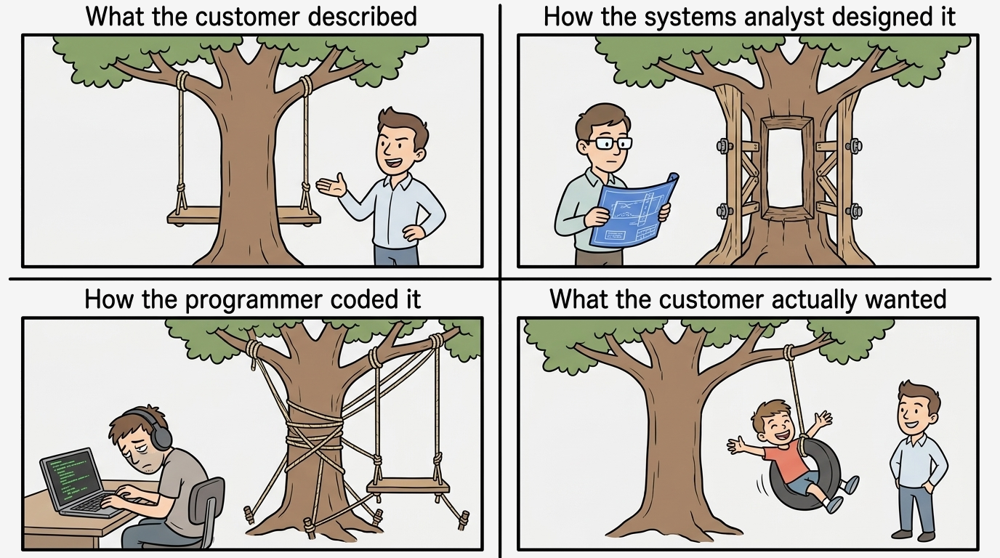

<!--
請看這幅諷刺軟體工程溝通鴻溝的傳世經典四格漫畫：「盪鞦韆陷阱」！

第一格是客戶口頭描述的需求：兩邊繩子分別綁在樹幹兩側的橫向枝幹，導致木板鞦韆直接被粗大的樹幹擋在後方，根本無法向前擺盪！

第二格是系統分析師的荒謬解法：為了解決鞦韆撞樹幹的問題，居然在大樹主幹正中央硬生生鑿出一個大洞，再加裝木架與螺栓補強！

第三格是程式設計師的實作：在筆電前焦頭爛額，繩索七纏八繞，把鞦韆死死五花大綁在樹幹與地面上，完全動彈不得！

第四格才是客戶內心真正想要的：其實只要一條簡單懸掛在單一側樹枝上的輪胎鞦韆，孩子就能開心暢快地盪來盪去！請大家注意「客戶描述的過度複雜與窒礙難行」與「客戶真正想要的質樸本質」之間強烈的對比！每當需求仰賴模糊抽象的文字而缺乏具體可驗收的原型與檢測時，這種悲劇便會不斷重演！

總結這張投影片，請記住這個核心觀念：規格中模糊主觀的形容詞是致命陷阱，必然會導致實作成果與原始期望嚴重脫節。
-->
---
### 觀念檢測：領域需求分類辨識 (CCQ 2)
<!-- id: ase-ch03-ccq2 -->

  

請參考 UberEats 外送平台的這段需求規格說明：
> *「因應市政食品衛生安全法規，易腐熟食的外送運送時間不得超過 45 分鐘，且運送容器全程須維持在 60°C 以上。」*

請問上述敘述屬於哪一種軟體需求類別？

- **A.** 領域需求 (Domain Requirement，由運作環境、產業法規或物理定律所施加的強制約束)
- **B.** 功能性需求 (Functional Requirement，指定系統必須執行的主動計算、特定功能或服務)
- **C.** 非功能性需求 (Non-Functional Requirement，針對效能、擴充性或可用性等整體系統品質特性)
- **D.** 使用者需求 (User Requirement，由終端消費者所提出之高階自然語言願景或業務目標)

  

  

    
  

<!--
現在是觀念檢測時間！請大家掃描螢幕上的 QR Code 參與 CCQ 2 作答。

題目給了一段情境：「因應市政食品衛生安全法規，易腐熟食的外送運送時間不得超過 45 分鐘，且運送容器全程須維持在 60°C 以上。」問這屬於哪一類需求？

我們來分析各個選項：
許多人看到「45 分鐘」與「60 度」就誤以為是非功能性效能需求；但請注意它的源頭——它不是源自工程師的最佳化調整，也不是源自使用者的操作偏好，而是源於外部地方政府的公衛法規與熱力學食品安全物理限制。

正確答案是選項 A：領域需求！在軟體工程中，源自外部產業監管、法律條規或實體物理環境的強制約束，皆歸屬於領域需求。

總結這張投影片，請記住這個核心觀念：直接源自外部法規、產業規範或實體物理環境的強制條件，均屬於領域需求。
-->
---
## 課堂活動：Cybercab 需求三元組腦力激盪 (Pair Discussion)

> **情境設定：** 假設你是 Elon Musk，你的無人自駕車 **Cybercab** 已經合法上路。平時除了自己代步開以外，閒置時還能加入自動駕駛車隊租給其他人搭乘賺取收益。

### 1. 功能需求 (Functional)
*系統提供的具體功能與業務服務：*
- **引導思考面向：**
  - 乘客如何透過 App 進行遠端叫車、定位追蹤與感應上車？
  - 車主如何將車輛一鍵切換釋出給自動駕駛車隊營運？
  - 平台如何自動完成行程計費，並將租金收益分潤給車主？

### 2. 非功能需求 (NFR)
*系統運行的品質屬性與效能約束：*
- **引導思考面向：**
  - 車輛在即時感測避障與緊急煞車上的毫秒級反應時間極限？
  - 全球自駕車派遣雲端服務必須具備多高的可用性 (Uptime)？
  - 面對遠端駭客劫持威脅，車載網路需要何種資安防護？

### 3. 領域需求 (Domain)
*交通法規、安全認證與環境強制約束：*
- **引導思考面向：**
  - 無人駕駛車輛必須符合哪些國家級自駕安全法規 (如 NHTSA)？
  - 發生交通事故時，法規強制要求記錄哪些關鍵數據 (黑盒子/EDR)？
  - 將自用車投入商業共享載客時，法律強制要求投保哪些保險？

<!--
現在是課堂雙人討論時間：Cybercab 需求三元組實戰腦力激盪！請轉向旁邊的同學，你們兩位現在就是 Elon Musk 與 Tesla Cybercab 的首席軟體架構師。

情境是這樣的：Cybercab 已經正式合法上路！平時你自己出門自己開，但當你進辦公室或睡覺時，車子閒著也是閒著，可以直接投入 Tesla Network 機器人計程車隊，租給其他市民搭乘賺錢。

請與夥伴花 3 分鐘討論，分別為這輛自駕車提出 2 到 3 個核心需求：
第一，功能性需求：系統到底要主動提供哪些服務？例如遠端派遣、自動開門、行程計費與分潤。

第二，非功能性需求：系統在安全反應速度、平台伺服器連線穩定度、資安防駭上有何極限要求？考慮避障決策必須在 100 毫秒以內完成，雲端平台必須具備五個九的超高可用性，並且車聯網通訊絕不能被駭客遠端劫持。

第三，領域需求：有哪些不是你說了算，而是外部交通法規、NHTSA 自駕監管、商業載客保險所施加的強制鐵律？不管功能設計得多酷炫，沒有通過 Level 5 安全認證、沒有防竄改黑盒子 EDR、沒有商業責任險，車子就絕對無法合法營業。

總結這張投影片，請記住這個核心觀念：功能性、非功能性與領域需求缺一不可，唯有三者緊密協同，才能打造出安全可行的自駕共享系統。
-->
---
<!-- _class: lead -->
<!-- header: '3.3 非功能性需求與指標' -->

# **3.3 非功能性需求 (NFR) 與量化指標**

> "If you can't measure it, you can't manage it — and you certainly cannot verify it."  
> 「如果你無法度量它，你就無法管理它——更絕對無法對它進行客觀驗證。」  
> — *Tom DeMarco (軟體工程度量大師)*

<!--
我們現在來到 3.3 節：非功能性需求與量化指標。

一套軟體即使在紙面上完全實現了客戶點名要求的每一項功能，但若點開網頁要等五分鐘、動輒洩漏用戶密碼，或是稍微湧入千人就崩潰斷線，它依然是一件徹底毫無價值的產品。非功能性需求定義了軟體系統的全身性品質命脈。

在本單元中，我們將探討如何從產品面、組織面與外部面三大維度對 NFR 進行系統化分類，並學習軟體工程師最重要的看家本領——將模糊主觀的心願，鍛造為精確、客觀且具備可測性的工程度量指標。

總結這張投影片，請記住這個核心觀念：非功能性需求決定了系統架構的成敗；唯有將質化願景轉化為量化指標，品質才能被嚴格檢驗。
-->
---
## 非功能性需求與量化指標 (NFR & Metrics)

> 對系統所提供服務或功能之約束條件，包括時間限制、安全隱私、可靠度與標準遵循，從根本上塑造軟體架構。

* **全系統級的深遠影響 (System-Wide Impact):**
  - 非功能性需求通常作用於系統**整體架構**，而非單一孤立的功能特性。
  - 未能滿足非功能性需求，足以導致整套系統徹底癱瘓或遭使用者唾棄（例如：反應緩慢或資安漏洞百出的醫療資料庫）。
* **對軟體架構的主導力量 (Architectural Influence):**
  - 效能限制決定了模組間的通訊機制與快取策略；安全合規要求催生了獨立的身分認證中介架構。
  - *深刻工程真理：軟體架構本質上是由非功能性需求所雕刻而成的，其影響力遠超越單純的功能特性！*

<!--
進入 3.3 節，我們來剖析非功能性需求 (NFR)。

每一位資深軟體架構師心中都有一個深刻的共識：決定軟體架構骨幹的最核心力量，絕非功能性需求，而是非功能性需求！

大家思考一下：一個電子商務網站賣的是運動鞋還是教科書，根本不會動搖其後端微服務的切分方式；但若系統要求承載 10 位同時在線用戶，跟要求承載 1000 萬同時在線併發用戶，其架構設計有如腳踏車與高鐵般的本質差異！

非功能性需求只要一處不及格，整套系統就會被判定出局。線上網銀即使能正確計算轉帳金額，但若每次送出都要旋轉等待 40 秒，使用者立刻就會刪除 App 並轉向競爭對手。

總結這張投影片，請記住這個核心觀念：非功能性需求支配了底層架構設計，並決定了整套產品在真實市場中的生存空間。
-->
---
<!-- _class: full-image-slide -->

  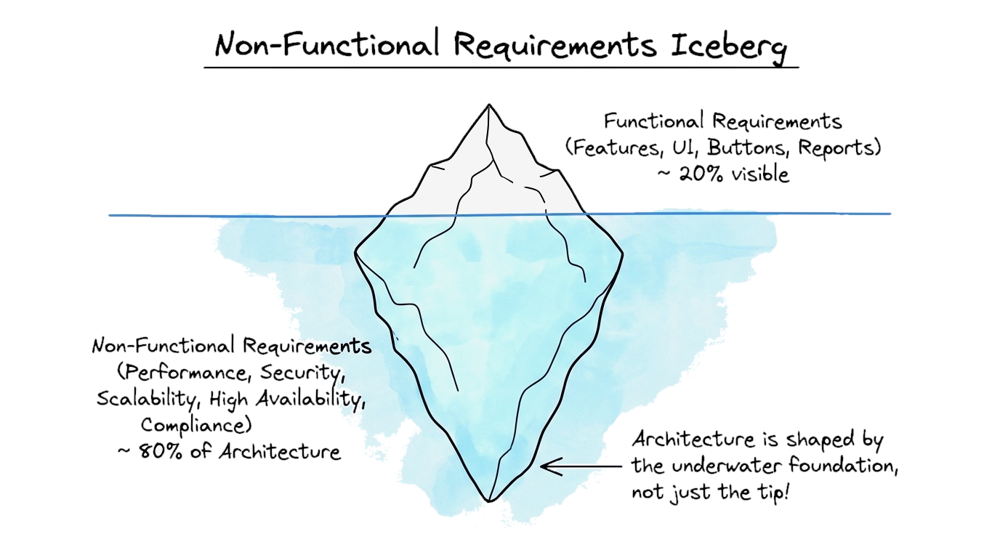

<!--
請看這幅手繪架構圖：「非功能性需求的架構冰山 (The Structural Base of NFRs)」。

請觀察海平面的分界線：浮在水面上、肉眼可見的冰山一角，是「功能性需求」。那只占了全貌的 20%，也就是一般使用者日常看到的按鈕、輸入框、圖表與報表。

但在水面之下，隱藏著龐大無比的 80% 冰山底座：非功能性需求——效能表現、資訊安全、水平擴充性、高可用性、容錯韌性與法規合規性！

注意箭頭旁的手寫筆記：「系統架構是由水面下的巨大冰山底座所形塑的，絕非單靠浮出水面的冰山一角！」如果水底的 NFR 基石崩解，水面上的所有亮麗功能將在瞬間隨之沈入海底。

總結這張投影片，請記住這個核心觀念：厚重紮實的非功能性品質，是支撐所有表層業務功能的無形基石。
-->
---
## 非功能性需求三大核心家族 (Classification of NFRs)

> 非功能性需求源自軟體產品的執行期品質、內部組織的治理規範，以及外部運行環境的法律約束。

### 1. 產品需求 (Product)
**定義：** 規範交付的軟體產品在執行期必須具備的操作行為與運行品質。

- **範疇：** 系統執行效能、可靠度、資訊安全與終端使用者操作體驗。
- **子類別：** 易用性 (Usability)、效率 (Efficiency)、可靠性、安全性。
- **實例：** 查詢回應 $\le 2$ 秒、可用性 $\ge 99.99\%$、AES-256 加密。

### 2. 組織需求 (Organizational)
**定義：** 源自客戶或開發組織內部管理政策、作業程序與工程標準的要求。

- **範疇：** 開發流程規範、維運治理要求與企業既有基礎架構限制。
- **子類別：** 開發標準 (流程/語言)、維運程序 (備份/災難復原)、平台約束。
- **實例：** 遵循 Git Flow 與 CI/CD 門禁、每日自動異地備份、限定 AWS。

### 3. 外部需求 (External)
**定義：** 源自系統及其工程開發流程外部之法規、環境與社會因素之要求。

- **範疇：** 國家法規合規性、主管機關監管標準、生命財產安全與社會倫理。
- **子類別：** 法定與監管規範、人身安全防護 (Fail-Safe)、隱私倫理。
- **實例：** 符合歐盟 GDPR 個資法、政府電子發票規範、醫療防呆機制。

<!--
在深入探討各項量化指標前，我們首先依循 Ian Sommerville 的經典架構，將非功能性需求劃分為三大核心家族：

第一，產品需求 (Product Requirements)：直接規範軟體「執行期」的行為表現。這包括終端使用者體驗到的易用性、高並發下的極致秒級反應速度，以及系統長時間運行的穩定性與資訊安全防護。

第二，組織需求 (Organizational Requirements)：源自企業或工程組織內部的政策與流程約束。例如技術主管規定所有後端微服務必須使用 Go 語言開發、必須通過 CI/CD 自動化測試門禁，以及每日凌晨執行異地增量備份。

第三，外部需求 (External Requirements)：來自組織外部實體世界的剛性約束。無論產品設計得多精巧，都必須嚴格遵循營業稅法、保護勞工權益，並符合 GDPR 隱私保護與系統安全失效機制。外部法規具有最高強制力，違法將直接面臨巨額罰款或勒令停業。

總結這張投影片，請記住這個核心觀念：非功能性需求全面涵蓋了產品執行期品質、組織內部研發流程與外部社會法規環境。
-->
---
<!-- _class: full-image-slide -->

  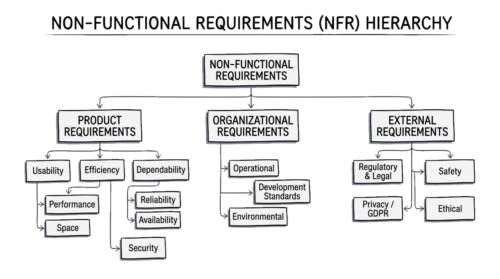

<!--
請看這幅經典架構分類樹：「非功能性需求分類階層 (Non-Functional Requirements Hierarchy)」。

依循軟體工程大師 Ian Sommerville 的經典體系，非功能性需求向下展開為三大核心家族：

第一，左側的「產品需求 (Product Requirements)」：規範軟體本身的執行期品質。包括易用性、空間效率、反應速度、系統可靠度與資訊安全防護。

第二，中央的「組織需求 (Organizational Requirements)」：源自客戶端或開發團隊的內部環境約束。包括維運標準、指定開發語言、版控流程以及目標硬體相容限制。

第三，右側的「外部需求 (External Requirements)」：源自組織外部環境的不可抗力。包括醫療與航空安全法規、人身危害防護、歐盟 GDPR 個人資料隱私保護，以及演算法倫理透明度。

總結這張投影片，請記住這個核心觀念：非功能性需求全面涵蓋了產品執行期特徵、內部組織流程規範與外部法規環境約束。
-->
---
<!-- _class: full-image-slide -->

  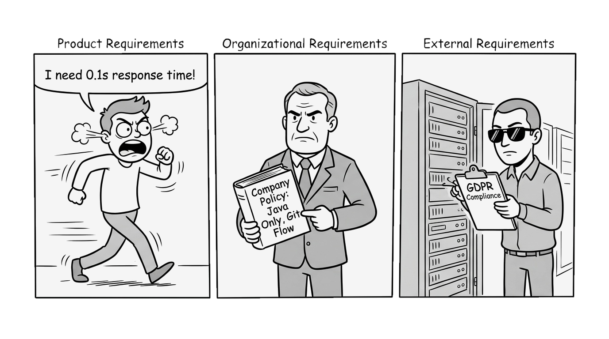

<!--
我們透過這幅生動的四格漫畫來加深對非功能性需求三大支柱的印象！

第一格：產品需求！急躁的用戶在螢幕前踱步大吼：「我現在就要 0.1 秒的反應時間！」這代表了產品在執行時的極致效能與穩定度要求。

第二格：組織需求！資訊主管手持厚重的公司規章手冊：「公司政策明定：後端統一採用 Java，所有交付必須符合 Git Flow 流程！」

第三格：外部需求！戴著墨鏡、手持稽核夾板的稽核官正在機房盤查：「我是 GDPR 個資隱私審查員，請立刻出示所有數據加密證明！」

總結這張投影片，請記住這個核心觀念：非功能性需求具體源自產品執行期性能、企業組織內部政策與外部法定監管規章。
-->
---
## 主觀目標 vs. 可驗證非功能需求 (Goals vs. Verifiable NFRs)

* **主觀目標 (模糊難以測量的願景):**
  > *「系統應易於醫護人員操作使用，並大幅降低人為操作錯誤。」*
* **可驗證需求 (具備客觀測試量化標準):**
  > *「具備基本電腦常識的醫護人員，在接受 2 小時標準培訓後，即能獨立操作所有核心功能；上線運作後，每位操作員平均每工作日之人為錯誤次數不得超過 2 次。」*
* **工程黃金法則 (The Golden Engineering Principle):**
  - 軟體工程師必須主動將利害關係人主觀抽象的期待，轉化為**可客觀量化、可嚴謹測試驗收的具體指標！**

<!--
我們身為專業工程師，該如何撰寫出合格的非功能性需求？關鍵就在於：將主觀心願轉化為可客觀測試的指標。

看看上方的主觀目標：「系統應易於醫護人員操作使用，並大幅降低人為操作錯誤。」這句話聽起來非常美好，但它在工程上毫無價值！因為它根本無法測試——什麼叫做「容易」？降低到幾次才叫「大幅降低」？

再看下方的可驗證需求：工程師把它改寫為具備操作型定義的指標：「在受訓 2 小時後能獨立操作，且每日人為錯誤不超過 2 次。」

看見差異了嗎？第二段陳述讓品保測試工程師能制定出精確的測試計畫。找五位護理師受訓兩小時，統計其操作錯誤，就能客觀驗收 Pass 或 Fail。

總結這張投影片，請記住這個核心觀念：軟體工程師必須將客戶主觀的情感期待，鍛造為具備客觀度量標準的工程契約。
-->
---
<!-- _class: full-image-slide -->

  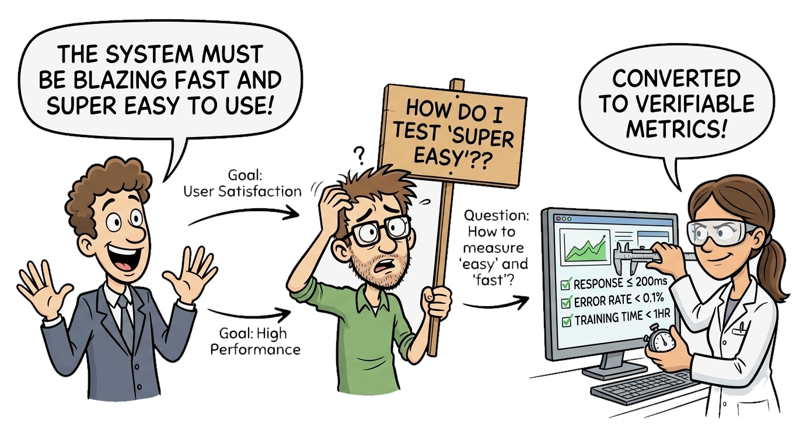

<!--
請看這幅漫畫：「將模糊願景鍛造為可驗證指標」！

在左側，客戶興高采烈地描繪著宏偉願景：「我們的系統必須快如閃電，而且超級簡單好用！」對客戶而言，這就是他最真誠的直覺心願。

在中央，工程師抓破頭皮，舉牌無奈吶喊：「天啊，我到底該怎麼寫單元測試來驗證什麼叫『超級好用』？」

到了右側，資深 QA 工程師拿出了科學度量游標卡尺，訂出客觀數據：「API 回應時間小於 200 毫秒、交易失敗率低於 0.1%、新手訓練時間小於 1 小時！」此時願景才真正成為可交付的工程規格。

總結這張投影片，請記住這個核心觀念：將模糊主觀的抽象心願轉化為客觀可測的數值指標，是編寫出可驗證需求的精髓。
-->
---
## 非功能性需求標準量化指標 (Metrics for Specifying NFRs)

| 系統特徵 (Property) | 可度量指標範例 (Measurable Metric Examples) |
|---|---|
| **運算速度 (Speed)** | 每秒處理交易數 (TPS)；第 95/99 百分位回應延遲；畫面每秒更新率 (FPS) |
| **儲存容量 (Size)** | 隨機存取記憶體 (RAM) 占用容量；安裝套件快閃儲存空間 (ROM/Disk) |
| **易用性 (Ease of Use)** | 達到合格操作所需的教育訓練時數；每週進線客服求助工單數 |
| **可靠度 (Reliability)** | 平均故障間隔時間 (MTBF)；單月無預警當機機率；系統可用性百分比 (4 個 9) |
| **強韌度 (Robustness)** | 系統崩潰重啟並恢復服務時間 (MTTR)；斷電時資料毀損遺失比率 |
| **可移植性 (Portability)** | 目標平台相依程式碼比例；支援跨平台作業系統 (Linux/Windows/macOS) 數量 |

<!--
這張參考矩陣彙整了軟體工程界常用的非功能性度量指標。

談到「速度」，不要寫「極速」，請寫每秒交易吞吐量 (TPS) 或 99 百分位回應延遲小於 500 毫秒。

談到「可靠度」，請使用平均故障間隔時間 (MTBF) 或四個九（99.99%）可用性標準。

談到「強韌度」，請量化系統重啟復原時限 (MTTR) 以及遇到不可抗力斷電時資料遺失容許率。

這些科學指標消除了主觀爭論，讓合約與驗收具有嚴格的法律與技術約束力。

總結這張投影片，請記住這個核心觀念：量化指標能用客觀的工程基準，徹底取代模糊主觀的口舌爭端。
-->
---
### 觀念檢測：非功能性需求指標量化 (CCQ 3)
<!-- id: ase-ch03-ccq3 -->

  

客戶提出了一個模糊的非功能性目標：*「訂單結帳系統必須具備極致速度與極高可靠度。」* 下列哪一項敘述正確地將此模糊目標轉化為**可驗證、可測試的工程量化指標**？

- **A.** 99% 的結帳交易回應時間須 $\le 500$ 毫秒，且尖峰時段系統可用性須達 $\ge 99.95\%$。
- **B.** 結帳使用者介面應採用滑順流暢的過場動畫，使顧客在心理層面感受最極致的速度。
- **C.** 所有結帳微服務皆須採用記憶體安全程式語言開發，以百分之百確保程式零缺陷執行。
- **D.** 雲端資料庫應於尖峰交易負載攀升時，自動配置無上限的隨機存取記憶體 (RAM)。

  

  

    
  

<!--
現在是觀念檢測時間！請掃描 QR Code 挑戰 CCQ 3。

客戶希望結帳系統「極致快速、極高可靠度」。

我們來看各選項：
選項 B 談的是前端動畫障眼法；
選項 C 提到記憶體安全語言並宣稱「百分之百零缺陷」，這在軟體工程上根本是無法被驗證的偽命題；
選項 D 提到配置無上限的 RAM，在現實硬體與預算上絕不可能成立。

正確答案是選項 A！它清楚定義了 99 百分位延遲門檻在 500 毫秒以內，並訂出尖峰上線可用性達 99.95%，測試工程師能藉此架設壓力測試環境並給出明確的合格與否判定。

總結這張投影片，請記住這個核心觀念：可驗證的非功能性需求，是以客觀可測的數值指標全面取代主觀形容詞。
-->
---
## 課堂活動：Cybercab 非功能性指標量化 (Pair Discussion)

> **情境設定：** Elon Musk 提出願景：「*Cybercab 必須提供地表最安全的自駕體驗、最順暢的租車流程、以及最毫不費力的自動還車！*」身為首席系統工程師，你如何將這些願景轉化為**客觀可驗證的 NFR 量化指標**？

### 1. 自駕安全與反應延遲
*將「安全自駕」轉化為測試指標：*
- **引導思考面向：**
  - 如何以毫秒 ($\text{ms}$) 為單位定義從感測辨識到煞車致動的極限延遲？
  - 在大雨、濃霧、黑夜等極端天候下，這項指標必須如何被保證？
  - 測試規範應要求達到哪一個統計百分位數（例如 99.99% 信心門檻）？

### 2. 租車與即時派遣流程
*將「順暢租車」轉化為測試指標：*
- **引導思考面向：**
  - 雲端派遣系統媒合附近可用車輛並發送路線指令需於幾秒內完成 ($\le N\text{ 秒}$)？
  - 租客抵達車側時，手機藍牙 / NFC 感應解鎖車門的最大容許延遲？
  - 乘客上車身分臉部或手機驗證的錯誤拒絕率 (FRR) 上限為何？

### 3. 還車、車況檢查與結算
*將「無痛還車」轉化為測試指標：*
- **引導思考面向：**
  - 車內攝影機與超音波感測器檢測遺留物品或垃圾需於幾秒內完成？
  - 允許租客確認完成還車前，車輛電池必須具備之最低保留電量門檻？
  - 系統完成車輛狀態安全核驗、押金解圈與租車扣款確認之時限？

<!--
現在是課堂雙人討論時間：Cybercab 非功能性品質指標實戰量化！請轉向旁邊的同學，你們兩位現在就是 Tesla Cybercab 車隊共享計畫的首席品質保證 (QA) 與系統架構工程師。

Elon Musk 剛剛提出願景：「Cybercab 必須提供地表最安全的自駕體驗、最順暢的租車流程、以及最毫不費力的自動還車！」但工程師無法為「最順暢」、「最毫不費力」寫出自動化測試或給出 Pass/Fail 判定。

請與夥伴花 3 分鐘討論，分別為自駕、租車、還車三個階段訂出客觀可測量的工程指標：

第一，自駕安全與延遲：不要只說「煞車要快」，精確定義在時速 100 公里下，從相機捕捉到障礙物、神經網路辨識到油壓煞車致動的端到端延遲必須小於 100 毫秒，且在 99.99% 的極端天候情境下均成立。

第二，租車與即時派遣：定義雲端調度系統在尖峰時段必須於 3 秒內完成最近車輛媒合與路線指派；乘客抵達車門邊，手機感應解鎖車門延遲必須小於 800 毫秒，且身分驗證錯誤拒絕率 (FRR) 必須低於 0.1%，避免把合法租客擋在車外。

第三，還車、車況檢查與結算：租客下車後，車內廣角鏡頭與感測器必須在 15 秒內完成「遺留物與垃圾清潔掃描」；還車時剩餘電量必須至少保有 20% 以上安全存量；系統必須在關門後 10 秒內完成行駛里程結算並解開押金授權。

總結這張投影片，請記住這個核心觀念：可驗證的非功能性需求，是以客觀可測的數值指標全面取代主觀形容詞，為系統建立明確的驗收契約。
-->
---
<!-- _class: lead -->
<!-- header: '3.4 需求擷取與建模' -->

# **3.4 需求擷取與系統建模 (Elicitation & Modeling)**

> "Customers do not know what they want until you show it to them — elicitation is a collaborative journey of discovery."  
> 「客戶往往在看到具體雛形之前，並不真正清楚自己需要什麼——需求擷取是一場共同探索的協同之旅。」

<!--
現在進入 3.4 節：需求擷取與系統建模。

需求從來不是像成熟的蘋果一樣掛在樹上等人採摘。利害關係人很少能精確表達自己的痛點，他們常用內部黑話、充滿矛盾的期待，並隱含大量「以為你早就知道」的內隱習慣。

在本單元中，我們將精通四大核心需求擷取技術——訪談法、民族誌觀察法、情境與使用者故事，以及文件系統考古法；接著，學習如何將散落的人類故事，系統化收斂為嚴謹的 UML 使用案例模型。

總結這張投影片，請記住這個核心觀念：需求擷取是一場主動探索的旅程，將混亂的工作流程梳理為結構清晰的視覺化工程模型。
-->
---
## 需求擷取與系統建模 (Requirements Elicitation & Modeling)

> 探索、理解、協商並以模型形式具體界定利害關係人需求與系統運作邊界的協同疊代過程。

* **交織進行的四大工程活動 (Four Interleaved Activities):**
  1. **需求擷取與分析 (Elicitation & Analysis):** 主動與多元利害關係人溝通，挖掘深層業務需求。
  2. **需求規格化 (Specification):** 將探尋所得轉化為結構嚴謹、條理分明的技術文檔或模型。
  3. **需求驗證 (Validation):** 嚴密審查規格內容是否忠實反映客戶真實意圖且具備實作可行性。
  4. **需求變更管理 (Management):** 在軟體生命週期中，制度化地追蹤、審查與管控後續所有變更。
* **螺旋疊代本質 (Spiral & Iterative Nature):**
  - 需求工程**絕非單向一次性的瀑布式線性活動**；它是一條在每個釋出版本中不斷深化認知、持續收斂的動態螺旋。

<!--
我們來看需求工程流程的四大交織活動：

這四大活動包括：擷取與分析、規格化、驗證，以及變更管理。

請特別注意「交織進行 (Interleaved)」這個詞！在真實軟體專案中，你絕不可能等到 100% 擷取完畢才開始寫規格。往往是你剛把一條規格落入文字，就立刻發現邏輯缺口，促使你回頭找客戶啟動下一輪深度訪談。

需求工程本質上是一條螺旋演進的疊代路徑，隨著系統演進與各版本釋出，認知與規格隨之不斷收斂深厚。

總結這張投影片，請記住這個核心觀念：需求工程是一趟持續循環的探索、規格化、驗證與變更管理的動態旅程。
-->
---
<!-- _class: full-image-slide -->

  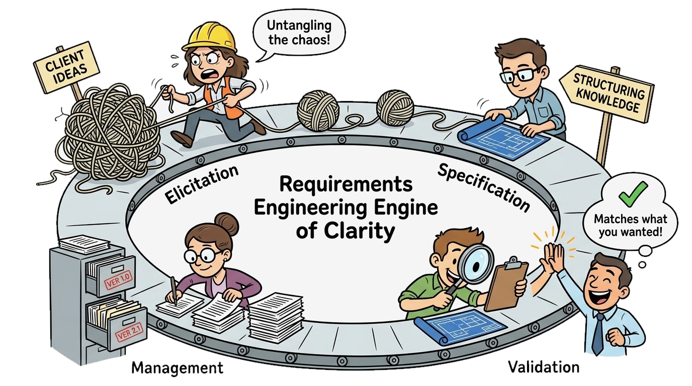

<!--
請看這幅漫畫：「需求工程的明晰引擎 (Engine of Clarity)」！

注意圍繞在循環工作流中的四個生動階段：
第一，擷取 (Elicitation)：工程師正在耐心地解開客戶腦海中那一團混亂糾結的毛線球，探索深層需求。
第二，規格化 (Specification)：將理順的思緒化為整齊的系統工程藍圖與條列式技術規格。

第三，驗證 (Validation)：工程師與客戶逐一核對藍圖，確認符合真實期望。
第四，變更管理 (Management)：井然有序地整理版本檔案、歸檔變更紀錄。

總結這張投影片，請記住這個核心觀念：需求工程循環持續將混亂糾結的模糊期望，鍛造為精準清晰的工程確定性。
-->
---
## 需求擷取技術 1：訪談與引導式工作坊 (Interviews & Workshops)

* **訪談架構三大類型 (Types of Interviews):**
  - **封閉式訪談 (Closed Interviews):** 預先擬定標準化題目，特別適用於驗證法規檢核清單與既定事實邊界。
  - **開放式訪談 (Open Interviews):** 不設限的探索性對談，旨在挖掘使用者深層痛點、日常困擾與宏觀願景。
  - **半結構化訪談 (Semi-Structured Interviews):** 業界主流標準，掌握核心議題大綱，並保有隨機深入突發痛點的彈性。
* **「未言明的隱含假設」陷阱 (The "Unstated Assumptions" Trap):**
  - 領域專家常將關鍵專業知識視為理所當然而徹底省略（*「這太基本了，全天下誰不知道每區的營業稅率都不一樣？」*）。
* **共同應用程式設計工作坊 (Joint Application Design - JAD):**
  - 將不同立場的利害關係人（醫師、護理師、IT、會計）聚集於同一間會議室，由中立引導師主持，數小時內化解跨部門爭端。

<!--
我們深入剖析第一項核心擷取手法：利害關係人訪談與引導工作坊。

訪談分為三種形式：
封閉式：帶著死板問卷，適合用來勾稽法規條文。
開放式：完全自由閒聊，適合在一開始建立交情、挖掘痛點。
而半結構化訪談則是業界最推崇的黃金標準——工程師帶著預先準備的大綱，同時能敏銳察覺受訪者話語中的猶豫，隨時深入挖掘隱蔽的作業摩擦。

訪談最危險的陷阱就是「未言明的隱含假設」！領域專家每天沉浸在他們的作業中，他們以為所有人理所當然都知道的事情，往往對外來的工程師而言是完全未知的盲區。

而當多個部門各執己見時，個別訪談只會陷入無休止的傳話與衝突。此時應舉辦 JAD (Joint Application Design) 工作坊，把醫師、護士、財務與主管鎖在同一個白板會議室中，由中立引導師在兩小時內逼大家面對面達成妥協共識。

總結這張投影片，請記住這個核心觀念：結合半結構化訪談與引導工作坊，能破解隱含假設並快速對齊跨部門的衝突立場。
-->
---
## 訪談啟發法：原則、迷思與實戰技巧 (Interview Heuristics)

* **核心指導原則 (Core Principles):**
  - **聆聽 80%、發言 20% (Listen 80%, Talk 20%):** 讓利害關係人完整暢談工作痛點，工程師切忌急於插話提供解答。
  - **聚焦「問題本質」而非「解法形式」:** 詢問*「您的業務目標是什麼？」*，而非*「您想要下拉選單還是勾選框？」*
* **常見認知迷思 (Common Myths):**
  - *迷思 1：* 「使用者完全清楚自己需要什麼並能精確表達。」（實務：他們常把表面症狀與根本病因混為一談）。
  - *迷思 2：* 「只要做一次深度訪談就能完成完美規格。」（實務：訪談只是提供最初步的假設線索）。
  - *迷思 3：* 「在訪談中和使用者討論技術架構與資料庫設計。」（實務：充滿專有名詞的技術術語只會讓使用者築起心防）。
* **實戰進階技巧 (Practical Skills):**
  - **連續五次問為什麼 (The "5 Whys" Technique):** 層層剝除表層技術要求，探尋真正的商業核心痛點。
  - **享受沉默力量 (3 秒靜默留白):** 當受訪者語畢時，刻意等待 3 秒鐘，往往能引導出最真實未經修飾的內隱實況。

<!--
我們來探討訪談的啟發法、迷思與實務技巧。

核心原則第一條：聽 80%、說 20%！工程師的天性是熱愛解決問題，往往客戶講兩句，工程師就急著打斷：「這我用 Redis 快取就可以解！」這會硬生生切斷客戶訴說真正痛點的機會。永遠記住：錨定在問題領域，而非過早跳入解法領域。

破解三大迷思：使用者很少真正清楚本質需求，他們常把止痛藥當作解法；訪談只是拼圖的一角，絕不可能一次完成；更別跟非技術用戶談 SQL 或微服務，那只會製造疏離感。

實務技巧推薦兩招：第一招是「連續問五個為什麼 (5 Whys)」，直探病灶；第二招是「3 秒鐘留白」——當受訪者回答完畢時，別急著接話，靜默等三秒，對方往往會耐不住安靜，主動吐露出平時在正式會議中絕口不提的工作實情！

總結這張投影片，請記住這個核心觀念：卓越的訪談者善於主動傾聽、區分問題與解法，並運用精準提問探詢根本原因。
-->
---
## 需求擷取技術 2：民族誌觀察法 (Ethnography & Observation)

> *"What people say they do, and what they actually do, are often entirely different."*  
> 「人們聲稱自己做的事情，與他們實際做的事情，往往截然不同。」

* **直接深入現場所展現的威力 (Direct Observation):**
  - 親身進駐軟體即將運作的真實物理環境（例如：醫院急診室、高頻交易室、物流分揀碼頭）。
* **發掘深層「內隱知識」 (Uncovering Tacit Knowledge):**
  - **內隱知識 (Tacit Knowledge):** 使用者高度熟練、深植日常習慣以致無意識操作的非正式捷徑，在會議中絕不會主動提及。
* **觀察風格與手法 (Observation Styles):**
  - **被動觀察法 (Passive Observation / "壁上蒼蠅"):** 不加干預地靜默觀察自然工作流程，精確辨識作業瓶頸與認知負荷。
  - **情境脈絡探詢 (Contextual Inquiry / 影子跟行):** 在使用者執行真實作業時進行影子跟隨，適時發問（*「為什麼您剛才要把這組代碼抄在黃色便利貼上？」*）。

<!--
第二項威力無窮的擷取技術，是源自人類學的「民族誌觀察法 (Ethnography)」。

人類學大師瑪格麗特·米德曾說過：人們口頭上宣稱自己在做的事，跟他們在工作現場實際做的事，往往有著天壤之別！

在正式訪談會議中，員工只會背誦公司官方 SOP；但唯有你親身穿上防塵衣進入手術室或物流碼頭，你才能看到「內隱知識 (Tacit Knowledge)」。

舉個經典例子：護理師在會議上描述了標準的六步驟給藥流程，但當工程師親自在大夜班跟行觀察時，才赫然發現每台螢幕周圍貼滿了黃色便利貼，上面寫滿了代碼！為什麼？因為官方軟體每次登入都要點八次滑鼠，在急診分秒必爭的環境下，醫護人員只能用便利貼捷徑自救。

如果你只做訪談，你只會自動化那套脫離現實的 SOP；唯有走入現場觀察，你才能解決真實的人類困境。

總結這張投影片，請記住這個核心觀念：職場現場觀察能發掘使用者視為當然、在正式會議中絕口不提的非正式捷徑與內隱知識。
-->
---
## 需求擷取技術 3：情境、使用者故事與故事板 (Scenarios & Stories)

* **具體敘事型情境 (Concrete Narrative Scenarios):**
  - 富含生動細節的時序性走查，模擬真實人物在一般常態與極端危機狀況下的系統操作過程。
* **敏捷使用者故事與驗收準則 (Agile User Stories & Acceptance Criteria):**
  - **經典範式：** *「身為一個 [使用者角色]，我想要 [功能服務]，以便於 [達成商業價值]。」*
  - **Given-When-Then (Gherkin 語法):**
    - *假設 (Given)* 消費者已套用一張有效的滿額折扣碼，
    - *當 (When)* 消費者將符合活動資格的餐點加入購物車並結帳，
    - *那麼 (Then)* 結帳總金額必須折抵 20%，最高折抵上限為 \$10。
* **低傳真故事板與紙本原型 (Storyboarding & Paper Prototyping):**
  - 以連環漫畫形式快速勾勒使用者旅程，在未寫一行程式碼前迅速獲取直觀回饋（*「天啊，我居然要點 5 次螢幕才能重新下單！」*）。

<!--
第三項擷取技術，是情境、使用者故事與故事板。

抽象的條文如「系統應具備身分驗證機制」往往讓人昏昏欲睡；但如果你講一個具體情境：「大夜班的張醫師戴著無菌橡膠手套，正狂奔前往 302 病房進行急救」，整個系統需求的輪廓瞬間就鮮活了起來！

在敏捷開發中，我們以「使用者故事」來凝聚共識：「身為某角色，我想要某功能，以便達成某價值。」為了讓工程師能進行客觀驗收，我們引入 Gherkin 語法的 Given-When-Then，這直接搭起了人類語言通往自動化驗收測試的橋樑。

此外，故事板與紙本低傳真原型具備無可比擬的優勢：面對耗費數百萬打造的精美軟體，客戶往往客氣不敢批評；但面對畫在紙上的粗糙草稿，任何人都能毫不猶豫地拿起紅筆塗改，在寫程式前就抓出動線盲點。

總結這張投影片，請記住這個核心觀念：生動的敘事故事與紙本故事板，能將抽象需求轉化為觸手可及且易於測試驗證的實體。
-->
---
<!-- _class: full-image-slide -->

  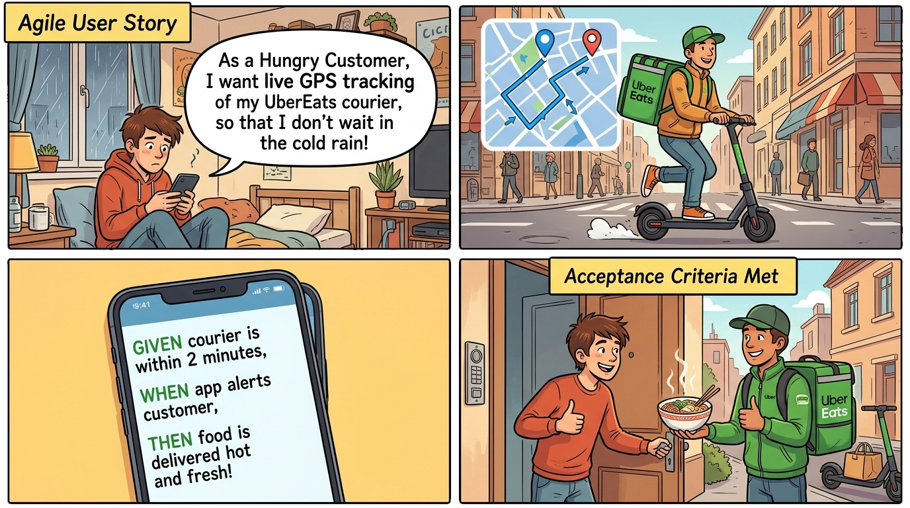

<!--
請看這幅漫畫，以 UberEats 生動示範了使用者故事與驗收準則的落地過程！

第一格：飢腸轆轆的大學生寫下了經典的使用者故事：
「身為肚子很餓的消費者，我希望在外送地圖上看到即時 GPS 軌跡，這樣我就不用在寒風冷雨中站在騎樓苦苦等待！」
清晰定義了角色、功能與真實的情感商業價值。

第二格：外送員接單後騎乘機車在城市穿梭，即時回傳座標。

第三格：看工程團隊如何將故事化為 Given-When-Then 驗收準則：
「假設外送員抵達前 2 分鐘，當 App 跳出推播通知時，那麼消費者走下樓正好拿到熱騰騰的現煮拉麵！」

第四格：驗收條件達成，買賣雙方皆大歡喜。

總結這張投影片，請記住這個核心觀念：使用者故事傳達人類真實動機，而 Given-When-Then 驗收準則定義了可客觀衡量的驗收標準。
-->
---
## 需求擷取技術 4：文件分析與系統考古 (Document Analysis)

* **挖掘既有營運資產 (Mining Operational Artifacts):**
  - **標準作業程序書 (SOP):** 企業既有官方規章、法規遵循手冊與品管檢核流程。
  - **舊系統原始碼與資料庫綱要:** 透過逆向工程解析上線運作數十年的老舊系統，提煉隱含業務演算法。
  - **表單與試算表考古 (Forms & Spreadsheet Archaeology):**
    - 紙本簽呈表單、報帳收據，以及員工私下使用的龐大 Excel 追蹤試算表。
    - *工程經驗黃金法則：員工活頁簿中手動增設的每一個自訂欄位，都代表現行系統未被滿足的一項核心需求！*
* **「考古陷阱」的防範 (The "Archaeology Trap"):**
  - 必須嚴格區分**不可或缺的本質商業邏輯**（務必完整保留）與**歷史性技術妥協產物**（應予廢除，絕不可盲目照搬數位化）。

<!--
第四項核心技術是文件分析與系統考古。

在動手寫新系統前，你必須先調查企業留下的歷史痕跡與舊系統。

這包括官方的 SOP 與手冊，更包括員工私底下每天在用的龐大 Excel 試算表！

請牢記這條軟體工程經驗黃金法則：員工私下維護的 Excel 試算表中，每一個手動增加的自訂欄位，都代表現行系統未被滿足的一項核心痛點！仔細研讀這些試算表，能幫你挖掘出過去數年沉積的業務精髓。

但是，千萬當心「考古陷阱」！不要把數十年前因為點陣印表機印不出表格所設計的繁瑣工作流程，一字不漏地盲目搬到新系統上。工程師必須學會過濾：留下本質商業邏輯，剔除過時的歷史技術妥協。

總結這張投影片，請記住這個核心觀念：分析既有表單與試算表能揭露未被滿足的需求，但必須嚴密區分本質業務邏輯與過時的歷史妥協。
-->
---
## 需求擷取技術評估矩陣 (Choosing Elicitation Techniques)

| 技術手法 | 核心優勢 | 主要限制 | 最佳適用時機 |
|---|---|---|---|
| **訪談法 (Interviews)** | 挖掘深度大；能建立與客戶的情感信任 | 易受主觀偏見影響；無法捕捉內隱知識 | 專案早期探索廣泛目標與建立人脈 |
| **工作坊 (JAD)** | 能高效化解立場衝突；快速凝聚共識 | 排程困難；強勢人格容易主導全場 | 多方利害關係人存在嚴重利益矛盾時 |
| **民族誌 (Ethnography)** | 發現真實操作行為與非正式捷徑 | 極耗費時間與人力；成果較難通用化 | 複雜高壓、高危險的實體工作現場 |
| **故事與情境 (Stories)** | 具備高度可測性；直接銜接敏捷衝刺待辦 | 容易見樹不見林，遺漏系統整體非功能限制 | 定義使用者面向的增量式功能模組 |
| **文件考古 (Doc Analysis)** | 客觀中立；精確還原舊系統遺留業務邏輯 | 規格文件經常過時失真；容易照單全收 | 汰換遺留核心系統與高度受監管領域 |

<!--
這份比較矩陣為需求擷取手法提供了清晰的決策指引。

沒有任何單一技術是萬靈丹。一位成熟的軟體工程師會如同外科醫師般，在適當時機搭配正確的工具：

在專案剛起步、需要建立信任與探索大方向時，運用訪談法；
在不同部門相互推諉、利益僵持時，召開 JAD 引導工作坊；
在急診室或高鐵調度台這種高壓物理環境中，運用民族誌現場觀察；
在規劃敏捷衝刺待辦清單時，撰寫使用者故事與 Given-When-Then；
在汰換運作了三十年的銀行大型主機核心系統時，展開文件與資料庫考古。

多管齊下，方能獲得真實需求的全景視角。

總結這張投影片，請記住這個核心觀念：專業工程師會靈活結合多種互補的擷取技術，以兼顧宏觀業務目標與第一線操作實況。
-->
---
<!-- _class: full-image-slide -->

  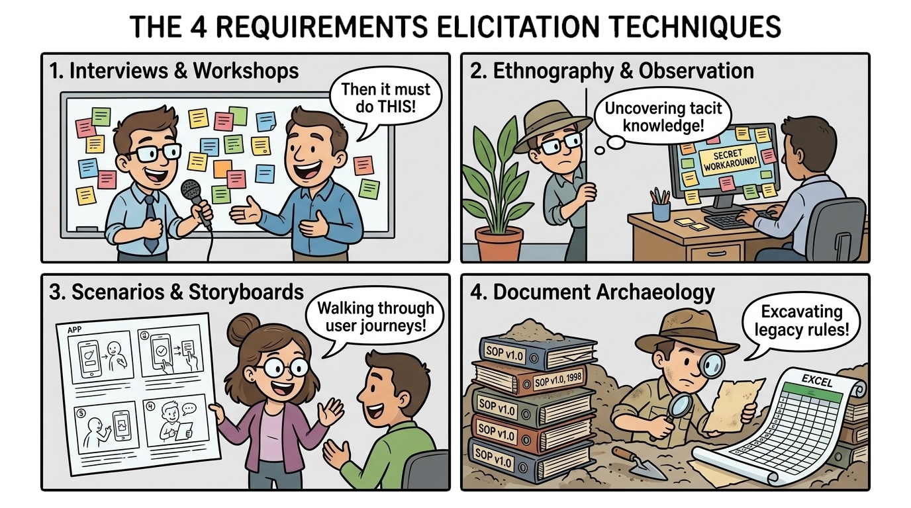

<!--
請看這幅生動的四格漫畫，總結了四大需求擷取實務手法！

第一格：訪談與工作坊！工程師正與客戶面對面討論，後方白板貼滿了彩色便簽。
第二格：民族誌觀察法！工程師如同「壁上蒼蠅」躲在盆栽後靜默觀察，赫然發現員工螢幕上貼滿了寫著工作捷徑的黃色便利貼！那正是會議中絕口不提的內隱知識。

第三格：情境與故事板！工程師拿出生動的四格漫畫草圖走查使用者旅程，客戶立刻發現流程盲點。
第四格：文件系統考古！工程師戴上考古學家遮陽帽、手持放大鏡，從厚重的歷史規章與具有八十個自訂欄位的怪獸級 Excel 中發掘隱藏演算法。

總結這張投影片，請記住這個核心觀念：融合訪談、現場觀察、故事板走查與系統考古，方能全面揭露明言願景與未言明的隱含需求。
-->
---
### 觀念檢測：訪談啟發法與五個為什麼 (CCQ 4)
<!-- id: ase-ch03-ccq4 -->

  

在需求訪談過程中，一位醫院主管堅持要求：*「我們的臨床資訊系統必須導入區塊鏈帳本來記錄病患的生理生命徵象。」* 此時軟體工程師最應採用的專業訪談啟發法為何？

- **A.** 運用「五個為什麼 (5 Whys)」探詢其背後的資料防竄改與稽核痛點，而非過早鎖定特定技術。
- **B.** 立即針對客戶指定的區塊鏈功能，著手撰寫智慧合約與關聯式資料庫對應綱要。
- **C.** 當場直接駁回該主管的要求，因為非技術利害關係人不得主動指定系統的實作架構。
- **D.** 禮貌性終止本次訪談流程，並將後續需求擷取工作完全轉向被動的工作場所觀察法。

  

  

    
  

<!--
現在是觀念檢測時間！請掃描 QR Code 挑戰 CCQ 4。

情境是：醫院主管堅持臨床系統必須導入區塊鏈技術來記錄病患生命徵象。

我們檢視各個選項：
選項 B 盲目聽從客戶指示開始寫智慧合約，犯了「過早鎖定解法」的重大錯誤；
選項 C 傲慢地直接當場駁回客戶，破壞信任關係；
選項 D 因噎廢食放棄訪談。

正確答案是選項 A！利害關係人常因為聽到了時髦的科技流行語，就主動提出特定技術解法。工程師的職責是運用「五個為什麼」，挖掘出他背後真正的商業痛點——其實主管擔心的是醫療糾紛時的歷史紀錄被惡意竄改，需要的是不可抹滅的日誌稽核機制，而不見得需要複雜低效的區塊鏈。

總結這張投影片，請記住這個核心觀念：穿透客戶表層提出的技術名詞，探詢深層根本的業務問題與作業痛點。
-->
---
### 觀念檢測：民族誌與內隱知識挖掘 (CCQ 5)
<!-- id: ase-ch03-ccq5 -->

  

在需求工程中，當分析急診室或飛航管制等複雜且高壓的運作環境時，為何**民族誌觀察法 (Ethnography / 職場觀察)** 具備無可取代的關鍵價值？

- **A.** 能發掘內隱知識——即使用者已習以為常且視為當然，因而在正式訪談中鮮少主動提及的工作細節與非正式捷徑。
- **B.** 能自動將利害關係人的自然語言需求，在完全無須人工介入的情況下直接編譯為可執行的驗收測試套件。
- **C.** 能完全消除後續的軟體架構設計、關聯式資料庫建模以及同儕程式碼審查 (Code Review) 等開發階段。
- **D.** 能確保所產出的軟體需求規格書在專案的第一個開發衝刺期 (Sprint) 即達成 100% 的數學完全性。

  

  

    
  

<!--
現在是 CCQ 5 觀念檢測時間！請掃描 QR Code。

題目問的是：在急診室或飛航管制等高壓環境中，民族誌現場觀察具備什麼無可取代的價值？

我們檢視選項：
選項 B、C、D 充斥著過度誇大的詞彙——「自動編譯成驗收測試」、「完全消除架構設計」、「達成 100% 數學完全性」，這些全都不切實際。

正確答案是選項 A！高壓環境下的工作人員在日積月累下建立了大量直覺與非正式捷徑，這些「內隱知識」已內化為本能反應，在冷冰冰的會議室訪談中是絕對問不出來的，唯有親臨現場觀察才能發掘。

總結這張投影片，請記住這個核心觀念：民族誌觀察法能揭露被利害關係人視為理所當然、在訪談中被遺漏的內隱知識與非正式工作捷徑。
-->
---
## 從情境邁向使用案例：貫通擷取與系統建模 (Scenarios to Use Cases)

> 工程師該如何將擷取技術 3 中蒐集到的零散人類故事，系統化收斂為結構嚴謹的系統模型？

* **銜接擷取技術 3 (情境與使用者故事):**
  - 需求擷取階段產出了許多真實且具體的感性故事（*「小芬使用過期折價券訂握壽司，結果信用卡扣款失敗」*）。
* **何謂情境 (Scenario)？**
  - 使用者在系統中進行互動的**單一具體執行路徑**（單一敘事序列）。
* **何謂使用案例 (Use Case)？**
  - 一個通用的功能保護傘，匯聚了特定參與者為了達成明確業務目標（如*訂購餐點*）所涉及的**所有相關情境**（包含正常成功路徑，以及所有替代與例外錯誤流程）。
* **為何必須從情境昇華為使用案例？**
  - 情境提供了豐富的同理心脈絡；使用案例則將其梳理為結構化、可供工程實作與編寫完整測試案例的正式功能合約。

<!--
很多同學常問：我們在前面技術 3 學了使用者故事與情境，那 UML 使用案例到底又是從哪裡蹦出來的？

這兩者不是割裂的！情境是單一使用者在特定時空下的一條具體路徑。

而使用案例 (Use Case)，就是一把傘，把所有關聯的情境收攏在一起！它以參與者的核心業務目標為核心（例如：下單外送餐點），完整囊括了主成功路徑（Happy Path），以及小芬卡片過期、餐廳突然打烊等所有替代與例外路徑。

情境賦予我們感性同理，使用案例則賦予工程嚴謹的理性結構。

總結這張投影片，請記住這個核心觀念：情境捕捉單一感性旅程，使用案例則將所有相關路徑收斂為結構嚴謹的互動契約。
-->
---
## 發掘使用案例的五步工程法 (Discovering Use Cases)

軟體工程師如何系統化地引導利害關係人，在需求擷取中發掘並結構化使用案例？

1. **辨識外部參與者 (Identify External Actors):** 釐清誰或什麼外部實體會直接與系統互動（人類角色、第三方金流閘道、自動化感測器）。
2. **定義參與者的業務目標 (Identify Actor Business Goals):** 針對每位參與者追問：*「他們需要系統交付什麼具體可觀察的價值？」*
3. **歸納情境為使用案例 (Group Scenarios into Use Cases):** 將相關的使用者故事匯聚為動名詞目標（*下單訂餐*、*即時追蹤外送*）。
4. **劃定系統邊界 (Define System Boundaries):** 嚴格標記哪些運算邏輯歸屬本系統範疇，哪些屬於外部服務或人工流程。
5. **提煉通用與條件式邏輯 (Factor Common & Conditional Logic):** 抽取共用必備子程序 (`<<include>>`) 與邊界條件擴充 (`<<extend>>`)。

<!--
軟體工程師如何有系統地發掘使用案例？請遵循這標準五步驟：

步驟一：辨識外部參與者。誰在操作系統？記住，參與者指的是「角色」而非特定個人，且外部系統如第三方金流 API 也是參與者。
步驟二：定義業務目標。聚焦在系統交付的「可觀察價值」，而不是按按鈕等微觀動作。

步驟三：歸納候選使用案例。使用動名詞命名，例如「提領現金」或「下單餐點」。
步驟四：劃定系統邊界。劃出一道明確的界線，區隔本系統負責的範圍與外部人工或第三方服務的界線。

步驟五：提煉關係。透過 include 抽取共通必備流程，透過 extend 處理例外與可選擴充。

總結這張投影片，請記住這個核心觀念：遵循辨識參與者、鎖定業務目標、劃定邊界與提煉關係的五步法，能結構化引導出健全的使用案例。
-->
---
## 使用案例圖 UML 記號與語意 (Use Case Diagram Notation)

* **參與者 (Actors):** 與應用系統進行直接互動的外部實體（使用者角色或外部系統）。
* **使用案例 (Use Cases):** 橢圓形圖示，代表能為參與者產出具體可觀察價值的高階功能互動。
* **系統邊界 (System Boundary):** 矩形外框，明確界定本系統實作範圍與外在世界的邊界。
* **關鍵關聯關係 (Relationships):**
  - **`<<include>>` (包含關係):** 基礎使用案例在執行過程中，**必然且無條件**會呼叫並執行的共通子程序（例如：*查詢病歷* 必然包含 *身分驗證*）。
  - **`<<extend>>` (擴充關係):** 僅在特定條件成立或觸發例外時，才會**有條件介入**擴充的延伸行為（例如：*開立管制藥品處方* 擴充自 *開立一般處方*）。

<!--
為了將功能互動視覺化，我們使用 UML 使用案例圖。

使用案例圖包含四項基本元素：
小人圖示代表參與者（Actor），代表外部角色或外部系統；
橢圓形代表使用案例，必須能為參與者帶來獨立可觀察的價值；
矩形框界定了系統邊界，框內是我們要寫的程式，框外是外在世界。

最常被搞混的是兩大關聯：
`<<include>>` 是基礎案例在執行時「必然會強制執行」的共通模組；
而 `<<extend>>` 則是「平時不執行，只有在特定擴充點條件觸發時才會介入」的例外或選配分支。

總結這張投影片，請記住這個核心觀念：使用案例圖界定了系統範疇，並清晰勾勒出外部參與者與系統服務間的互動關係。
-->
---
<!-- _class: full-image-slide -->

  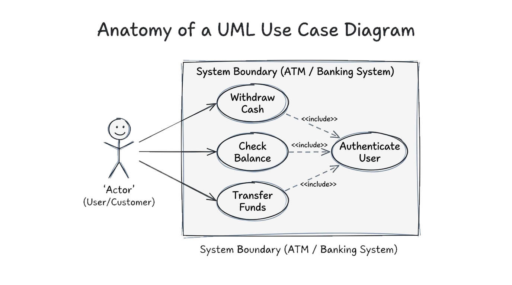

<!--
請看這幅手繪架構圖：「UML 使用案例圖架構解構 (Anatomy of a UML Use Case Diagram)」。

在左側是參與者——以小人圖示呈現的銀行顧客。

中央的矩形框代表自動櫃員機 (ATM) 的系統邊界，框內容納了三大核心使用案例：「提領現金」、「查詢餘額」與「轉帳匯款」。

請特別注意指向右下角「身分驗證」案例的三條虛線箭頭，上方全部標註了 `<<include>>`！這代表顧客無論執行提款、查帳還是轉帳，系統都無條件強制必須先通過身分驗證程序。

總結這張投影片，請記住這個核心觀念：使用案例圖確立了系統範疇，並明確將外部參與者連結至具備商業價值的系統服務。
-->
---
<!-- _class: full-image-slide -->

  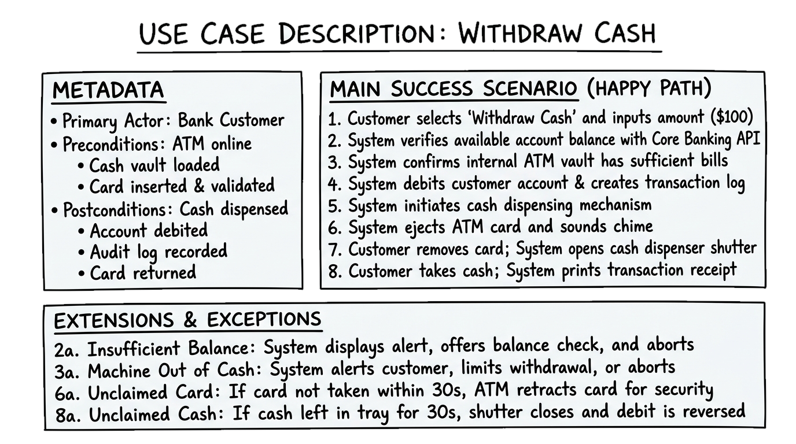

<!--
請看這幅詳細的手繪白板規格：「使用案例說明書：提領現金 (ATM 系統)」。

剛才的 UML 圖提供了鳥瞰全局的目錄視角，但工程師絕不可能單憑一顆橢圓形就寫出程式碼與測試！我們必須撰寫詳盡的使用案例說明書。

白板左側是元資料 (Metadata)：主要參與者、前置條件（ATM 連線正常、吐鈔模組備妥、卡片插入驗證完成）與後置條件（吐鈔成功、扣除餘額、寫入稽核紀錄）。

右側是正常流程（Happy Path），按時序拆解為八大步驟：選擇金額、查詢餘額、確認鈔票充足、扣款並記錄、啟動吐鈔、退卡發出蜂鳴聲、取卡後開啟閘門、取鈔並列印明細。

下方則是軟體工程耗費 80% 心力的例外與替代流程（Exceptions）：餘額不足怎麼辦？機台吐鈔模組卡死怎麼辦？30 秒內沒把卡片抽走，ATM 為了資安必須吃卡並發出警報！這份詳盡說明才是工程師落實健壯程式碼與 QA 人員編寫驗收測試的唯一依據。

總結這張投影片，請記住這個核心觀念：使用案例說明書將高階圖形轉化為涵蓋正常與例外流程的嚴謹合約。
-->
---
## 為何需求擷取如此艱鉅？ (Why Elicitation is Hard)

> 「打造軟體系統最困難的環節，莫過於精確決定究竟要建構什麼。」  
> — **Fred Brooks**, *沒有銀彈 (No Silver Bullet, 1987)*

* **1. 表達障礙與內隱知識 (Tacit Knowledge):**
  - 領域專家習慣成自然，難以用語言完整描述日常例外情境。
* **2. 解法偏誤與過早錨定 (Solution Bias):**
  - 客戶傾向直接提出具體功能/技術規格，而非業務痛點本身。
* **3. 利害關係人立場衝突 (Conflicting Agendas):**
  - 行銷、資安與財務部門對系統目標有著根本性的相互矛盾。
* **4. 需求易變性與移動目標 (Volatility):**
  - 一旦接觸到可操作的原型系統，利害關係人的期望便會迅速演化。

  
  

    Fred Brooks (1931–2022)
    <a href="https://zh.wikipedia.org/wiki/%E5%BC%97%E9%9B%B7%E5%BE%B7%C2%B7%E5%B8%83%E9%B2%81%E5%85%8B%E6%96%AF" target="_blank">圖靈獎 (1999) / 維基百科</a>
  

<!--
在結束擷取與建模前，我們來反思一個深刻的現實：為什麼需求擷取在實務上如此聲名狼藉地艱難？

正如 Fred Brooks 在《沒有銀彈》中所言，決定建構什麼是軟體工程中最艱鉅的工作，一旦做錯，將為後續帶來難以挽回的災難。

箇中原因有四：
第一，表達障礙：專家受限於內隱知識，最關鍵的工作細節往往被視為理所當然而在訪談中被徹底遺漏。
第二，解法偏誤：非技術客戶常把自己想像的解法當成需求，要求在系統裡塞入區塊鏈或特定按鈕。
第三，立場衝突：沒有任何單一的「標準使用者」，不同部門彼此拉扯，目標互相牴觸。
第四，需求的動態易變性：需求是一顆動態移動的子彈。客戶在看到具體雛形的那一刻，他的思維才會被真正啟發，原先寫好的規格立刻隨之翻新。

總結這張投影片，請記住這個核心觀念：需求擷取之所以困難，源自於挖掘內隱知識、調和政治利益衝突，以及適應不可避免的範疇演變。
-->
---
### 觀念檢測：使用案例圖與說明書互補性 (CCQ 6)
<!-- id: ase-ch03-ccq6 -->

  

軟體工程團隊繪製了一份 UML 使用案例圖，標註使用者與「提領現金」使用案例相連。為何工程師除了使用案例圖外，還必須撰寫詳盡的文字型**使用案例說明書 (Use Case Description)**？

- **A.** 圖形僅呈現高階系統範疇；文字說明才能完整定義循序步驟、前置條件、後置條件與例外處理流程。
- **B.** 現行現代網頁瀏覽器若缺乏伴隨的 Markdown 純文字描述，將完全無法正確渲染 UML 向量圖形。
- **C.** 現代編譯器與虛擬機器需要文字型使用案例說明，以便在執行階段預先為角色執行緒配置堆積記憶體。
- **D.** 文字型使用案例說明的核心目的，是將非功能性需求自動轉化為前端圖形使用者介面的高傳真原型。

  

  

    
  

<!--
現在是 CCQ 6 觀念檢測時間！請掃描 QR Code。

題目問的是：團隊畫了 UML 使用案例圖後，為何還必須撰寫文字型的使用案例說明書？

檢視選項：
選項 B、C、D 都是典型的混淆煙霧彈——扯到瀏覽器向量圖渲染、編譯器堆積記憶體配置，或是自動生成前端高傳真原型。

正確答案是選項 A！使用案例圖就像一本書的目錄，它只能宏觀呈現誰和哪些功能互動；工程師如果想實作並撰寫測試程式，必須仰賴文字型說明書中所規範的前置條件、循序正常路徑，以及各種狀況下的例外處理分支。

總結這張投影片，請記住這個核心觀念：UML 圖確立了範疇目錄，而使用案例說明書則建立了正常與例外行為的詳細合約。
-->
---
## 課堂活動：Cybercab 需求擷取活動規劃 (Pair Discussion)

> **10 分鐘雙人任務：** 你們是 Cybercab 首席需求工程師。請於 10 分鐘內在紙上或共享文件產出 **3 大需求擷取具體行動方針**：

### 產出 1：利害關係人與痛點 (3m)
*挑選 2 類存在利益衝突的群體：*
- **行動指引：**
  - 挑選 2 類：如通勤乘客、自用釋出車主、身障行動不便者、或市政交通局。
  - **你的具體產出：** 為各群體歸納 **1 項問卷問不出來的「內隱痛點」**。

### 產出 2：深度擷取技術匹配 (4m)
*為每類群體匹配 1 項最有效的擷取技術：*
- **行動指引：**
  - 從 3.4 節技術中選取：實地脈絡觀察法、車室 VR 雛型測試、或焦點工作坊。
  - **你的具體產出：** 清楚論證*為什麼*該技術能挖掘出其內隱需求與情緒摩擦點。

### 產出 3：利益衝突與仲裁 (3m)
*定義並仲裁雙方 1 項直接衝突的需求：*
- **行動指引：**
  - 定義 1 項衝突：例如乘客希望隨處路邊上下車 vs. 城市交通安全管制。
  - **你的具體產出：** 運用 **MoSCoW** 優先級框架（Must-Have vs. Won't-Have）判定勝出者並說明工程權衡理由。

<!--
現在是單元總結的 10 分鐘雙人實戰任務：規劃 Cybercab 全方位需求擷取戰役！請轉向旁邊的同學——你們兩位現在就是帶領工程團隊從零打造 Cybercab 平台的需求工程主管。

大家只有緊湊的 10 分鐘，請在筆記本或共用文件上具體寫下三大產出，時間一到我會抽點兩組同學各用 60 秒發表：

前 3 分鐘（產出 1）：挑選 2 類具備對立或互補特性的利害關係人，例如「每日趕上班的通勤族」與「市政交通局」，或是「自用車釋出賺外快的兼職車主」與「坐輪椅的身障長輩」。請為每類人寫出 1 項一般問卷絕對問不出來的「內隱痛點」。

中間 4 分鐘（產出 2）：為這兩類利害關係人各指定 3.4 節學到的一項深度擷取技術。例如針對身障長輩，不能只做訪談，而是使用車室 1:1 實體木模與 VR 模擬進行「操作觀察」，親眼檢視輪椅固定扣鎖是否容易卡死；並論證為何此技術能突破語言表達的盲點。

最後 3 分鐘（產出 3）：找出這兩方無可避免的一項核心利益衝突。例如通勤乘客希望隨招隨停、在飯店門口紅線上下車，但交通局嚴格要求只能在指定避車彎停靠。請運用 MoSCoW 框架裁定誰是 Must-Have，並給出你們工程團隊的具體權衡理由。

總結這張投影片，請記住這個核心觀念：一份高效的 10 分鐘需求擷取行動方案，透過對立利害關係人定位、深度技術匹配挖掘內隱痛點，並以 MoSCoW 果斷化解規格衝突。
-->
---
<!-- _class: lead -->
<!-- header: '3.5 需求驗證與變更管理' -->

# **3.5 需求驗證與變更管理 (Validation & Change Management)**

> "Change is inevitable. In a living system, requirements management is the art of embracing change without descending into chaos."  
> 「變更是不可避免的。在一個具生命力的系統中，需求管理是一門擁抱變更卻不致陷入混亂的藝術。」

<!--
現在進入 3.5 節：需求驗證與變更管理。

即使規格書已經洋洋灑灑撰寫完畢，工程工作也才完成一半。我們撰寫的規格真的符合客戶真實所需嗎？有沒有內部矛盾？在預算內做得出來嗎？需求驗證是阻擋瑕疵流入昂貴實作階段的最後一道關鍵品質閘門。

此外，在軟體整個生命週期中，外在市場與法規環境持續演進，需求必然會不斷變更。我們將學習五大驗證支柱，並建立制度化的變更控制與雙向可追溯性矩陣。

總結這張投影片，請記住這個核心觀念：嚴格的驗證確保我們打造對的系統，而可追溯性矩陣則確保系統演進始終處於受控與可稽核的狀態。
-->
---
## 需求驗證與變更管理 (Validation & Change Management)

> 確認需求規格確實反映利害關係人真實意圖，並在軟體整個生命週期中制度化管理規格演進的關鍵品管程序。

* **後期修正需求缺陷的巨大代價 (High Cost of Late Defects):**
  - 在系統交付上線後才修正需求錯誤，所耗費的工程成本是早期修正的**高達 100 倍**！
* **需求驗證五大檢驗支柱 (5 Requirements Checks):**
  1. **有效性 (Validity):** 需求是否真實反映客戶解決問題的實質需求？
  2. **一致性 (Consistency):** 需求條文之間是否存在前後矛盾或衝突定義？
  3. **完全性 (Completeness):** 是否已完整涵蓋所有系統功能、運作約束與邊界例外？
  4. **現實性 (Realism):** 考量現有預算、時程與既有技術能力，該需求是否真能被實作？
  5. **可驗證性 (Verifiability):** 該需求是否具備客觀明確的量化標準，能被工程團隊客觀測試？

<!--
我們來看需求驗證的五大檢驗支柱。

為什麼驗證如此重要？因為把需求錯誤拖到系統上線後才搶救，成本是百倍起跳！

當我們審查一份需求規格書時，必須嚴格把關五大維度：
有效性：客戶真的需要這項功能嗎？
一致性：前面寫按鈕是紅色，後面有沒有寫成藍色？
完全性：所有罕見的例外邊界都有處理機制嗎？
現實性：以目前的技術與預算，這項要求做得出來嗎？
以及可驗證性：QA 人員能不能寫出一套測試腳本，客觀判定它究竟是有通過還是沒通過？

總結這張投影片，請記住這個核心觀念：嚴格的驗證確保規格在動手寫程式前，具備有效性、一致性、完全性、現實性與可驗證性。
-->
---
<!-- _class: full-image-slide -->

  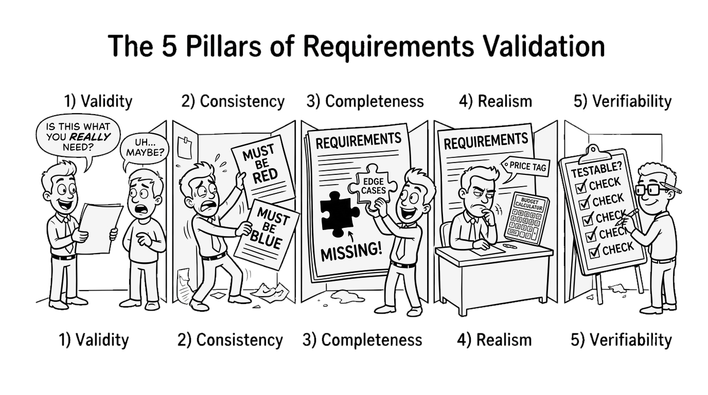

<!--
請看這幅漫畫：「需求驗證五大支柱 (The 5 Pillars of Requirements Validation)」！

在品質檢驗線上，審查員嚴格執行五大關卡的把關：
第一，有效性：檢驗員拿著規格直接向客戶確認：「這真的是你想要的嗎？」
第二，一致性：抓出前後矛盾——左邊寫「必須是紅色」，右邊卻寫「必須是藍色」！
第三，完全性：尋找拼圖遺失的最後一塊角隅——補足被遺忘的邊界例外狀況。
第四，現實性：拿出計算機與價格標籤核算成本：「這個預算真的做得出來嗎？」
第五，可驗證性：QA 人員手持客觀勾選清單，確保每條規格都能被自動化測試驗收。

總結這張投影片，請記住這個核心觀念：跨越五大支柱嚴格檢驗需求，能在寫下一行程式碼前阻絕災難性缺陷。
-->
---
## 需求變更與生命週期治理 (Requirements Change & Management)

* **為何需求必然會變更 (Why Requirements Change):**
  - 商業環境與競爭對手策略劇變、新法規頒布施行、硬體設備更迭，以及使用者操作雛形後認知昇華。
* **需求管理規劃三大核心要素 (Requirements Management Planning):**
  - **唯一編號標籤 (Unique Identification):** 為每一項原子需求標註永久且唯一的識別 ID（例如 `REQ-SEC-012`）。
  - **雙向可追溯性政策 (Traceability Policies):** 建立端到端鏈結：業務目標 → 系統需求 → 架構元件 → 程式原始碼 commit → 測試案例。
  - **變更控制流程 (Change Control Process):** 設立變更控制委員會 (CCB)，在核准變更前嚴格進行影響分析 (Impact Analysis) 與成本效益評估。

<!--
在軟體工程中，需求變更絕非異端邪說，而是不可逆轉的自然法則。

為什麼需求一定會變？因為市場在變、對手在推新功能、政府在修法，而且使用者看見系統原型後想法必然會改變。

要擁抱變更而不陷入混亂，必須落實三大治理要素：
第一，唯一識別 ID：為每條需求打上永久身分證字號，嚴禁隨意覆蓋。
第二，雙向可追溯性：建立矩陣，讓每條需求往前能追溯到商業願景，往後能連結到特定程式碼檔案與單元測試。當需求一變，你能立刻知道影響哪些檔案。
第三，變更控制流程：成立 CCB 委員會，客觀分析技術風險、改寫成本與時程衝擊，評估後再決定是否核准簽署。

總結這張投影片，請記住這個核心觀念：嚴格的唯一識別、可追溯性鏈結與變更控制，能將不可避免的需求動盪轉化為受控的有序演進。
-->
---
<!-- _class: full-image-slide -->

  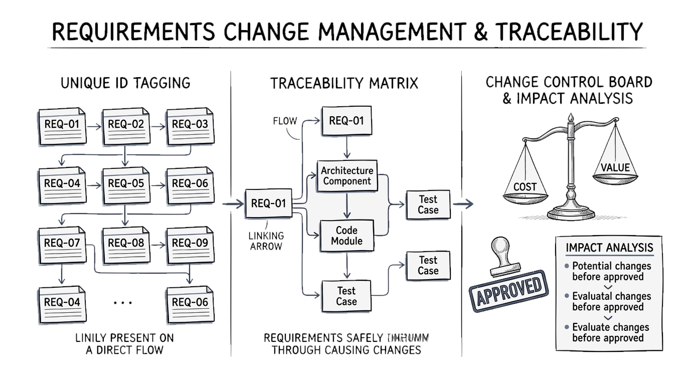

<!--
請看這幅手繪架構圖：「需求變更管理與追溯矩陣 (Requirements Change Management & Traceability)」。

左側是唯一編號管理：每張需求卡片都具備結構化編號（REQ-01, REQ-02）。

中央是核心神經中樞——雙向追溯矩陣 (Traceability Matrix)：清晰的箭頭將需求向上鏈結至商業目標，向下貫穿至架構元件、原始程式碼與測試案例。

右側是變更控制委員會 (CCB)：天平衡量著「變更成本」與「商業價值」，經過嚴謹的影響分析評估後，唯有通過審查的項目才會被蓋上紅色的「Approved (核准)」印章。

總結這張投影片，請記住這個核心觀念：唯一識別編號、追溯矩陣與影響分析，是讓軟體系統吸收頻繁變更而不致崩潰的防護網。
-->
---
### 觀念檢測：後期需求缺陷的巨大代價 (CCQ 7)
<!-- id: ase-ch03-ccq7 -->

  

為何在軟體系統交付上線後才修正需求錯誤，其耗費的成本會遠高於在早期開發階段修正？

- **A.** 需求規格文件一旦由客戶簽署核准後，在法律上便具有合約鎖定效力而嚴格禁止進行任何修改。
- **B.** 後期修正必須耗費大量成本重新設計架構、重寫程式碼、重測並重新部署基於錯誤前提建立的連鎖元件。
- **C.** 雲端程式碼儲存庫的自動化編譯器，在軟體發布至正式生產環境後會自動鎖定並阻止程式碼變更。
- **D.** 自動化單元測試套件在程式碼封裝並部署至雲端微服務叢集後，將會完全失去其工程驗證的有效性。

  

  

    
  

<!--
現在是 CCQ 7 觀念檢測時間！請掃描 QR Code。

題目問的是：為何在系統交付上線後才修正需求錯誤，成本遠高於在早期修正？

我們分析選項：
選項 A 提到法律合約鎖定禁止修改；
選項 C 提到編譯器自動鎖定儲存庫；
選項 D 聲稱部署後單元測試失去效力——這些全是虛構的荒謬干擾項。

正確答案是選項 B！一旦需求錯誤逃逸到正式生產環境，所有奠基在這個錯誤前提之上所建構的一切——系統架構設計、資料庫綱要、API 介面合約、前端視圖以及數千個自動化測試套件，全都必須打掉重做！這種連鎖骨牌式的返工成本，就是引發百倍成本暴增的根本主因。

總結這張投影片，請記住這個核心觀念：後期需求缺陷會引發架構、代碼、測試與資料庫綱要的全面連鎖返工災難。
-->
---
<!-- _class: lead -->
<!-- header: '3.6 AI 賦能需求工程' -->

# **3.6 AI 賦能需求工程 (AI-Assisted Requirements Engineering)**

> "AI is a cognitive amplifier for requirements analysis, but human judgment remains the irreplaceable anchor of accountability."  
> 「AI 是需求分析的認知放大器，但人類工程師的專業判斷，始終是責任歸屬無可取代的唯一錨點。」

<!--
現在進入前沿創新的 3.6 節：AI 賦能需求工程。

近年大型語言模型 (LLM) 與生成式 AI 的爆發，為需求工程領域帶來了數十年來最劇烈的範式轉移。由於 LLM 預先學習了海量的跨產業領域知識，它們極為擅長整理紛亂的訪談筆記、揪出潛在的邊界漏洞，並自動生成標準使用者故事。

然而，LLM 天生伴隨著幻覺問題，可能無中生有捏造不存在的法規限制或 API。在本單元中，我們將探討 AI 輔助需求工程的四大核心實務應用，並確立「人機協同 (Human-in-the-Loop)」不可動搖的最高工程準則。

總結這張投影片，請記住這個核心觀念：LLM 極大化加速了規格草擬與邊界探索，但人類領域專家必須始終掌握最終審查與核准的終極主權。
-->
---
## AI 賦能需求工程：現代新前沿 (AI in RE: Overview)

> 善用大型語言模型作為智慧分析副駕駛，架起非正式人類溝通對話通往形式化、可驗證軟體規格的橋樑。

* **生成式 AI 的典範轉移 (Generative AI Paradigm Shift):**
  - LLM 與生成式 AI 工具在軟體生命週期中扮演**智慧型需求工程副駕駛 (RE Copilot)**。
  - 成功消弭客戶非正式的日常自然語言，與嚴謹形式化的軟體工程產出物之間的鴻溝。
* **核心技術賦能 (Key Capabilities):**
  - 從凌亂雜沓的會議紀錄與訪談逐字稿中，快速提煉出結構化規格。
  - 在數百頁的大型文件中，自動偵測語意條文衝突、被動語態與遺漏的極端邊界條件。
  - 自動生成初始測試案例與符合 Gherkin 語法的 Given-When-Then 驗收準則。

<!--
在 3.6 節中，我們來見證生成式 AI 如何重塑需求工程。

過去，需求工程師最痛苦耗時的工作，就是將長達幾十個小時的客戶訪談錄音逐字稿，手工梳理成規範整齊的工程文件。

現在，LLM 扮演了極具智慧的「需求工程副駕駛 (RE Copilot)」。它能在一秒內消化混亂的會議筆記，提取核心參與者、梳理使用者旅程，並直接產出標準的 Gherkin 驗收準則。

更厲害的是，AI 能不眠不休地通讀數百頁的規格文件，快速標記出哪幾頁條文互相矛盾、哪裡使用了模糊的被動語態，以及遺漏了哪些邊界條件。

總結這張投影片，請記住這個核心觀念：生成式 AI 是不知疲倦的分析夥伴，能將非結構化對話快速轉化為條理分明的規格雛形。
-->
---
## 為何 LLM 能有效輔助需求工程？預訓練領域本體論

> *"When you ask an AI to design a food delivery app, it doesn't start from scratch—it already knows the business domain!"*  
> 「當你要求 AI 設計外送平台時，它絕不是從一張白紙開始——它早已深諳該商業領域的一切運作架構！」

* **預訓練領域知識的無形資產 (Pre-Trained Domain Knowledge):**
  - LLM 在數十億標記中完成了預訓練：涵蓋企業案例、產業白皮書、開源專案程式碼與 ISO/IEEE 國際標準。
  - 模型本身早已具備潛在的**領域本體論 (Domain Ontology)**：
    - **在金融領域：** 它早已熟知帳戶需要交易原子性 (ACID)、多因子認證與反洗錢稽核日誌。
    - **在電商與外送領域：** 它深刻理解多方拆帳分潤、地理圍欄 (Geofencing)、尖峰動態加價與訂單取消退款政策。
* **「即時領域顧問」的工程優勢 (The Instant Domain Advisor):**
  - **發掘內隱需求：** 能主動提點初階工程師經常遺漏的產業標準極端邊界（如：折價券洗單防弊、冷鏈溫控門檻）。
  - **極速工程鷹架：** 數秒內將口語訪談逐字稿轉化為 Given-When-Then 故事與 UML 候選實體。

<!--
為什麼大型語言模型在需求工程上的表現如此驚豔？

根本原因在於：LLM 不是從零開始瞎猜，它在訓練過程中早已內化了深厚的「領域本體論 (Domain Ontology)」！

當你對 ChatGPT 或 Claude 說：「我想打造一個串聯在地有機小農的生鮮外送系統」，模型腦海中立刻浮現出電商與生鮮物流的完整骨架！它自動知道生鮮需要冷鏈溫控、運送時間約束、小農與司機的三方拆帳，以及金流權杖化安全。

它就像一位隨侍在側的即時領域顧問。它會主動提醒經驗不足的新進工程師注意那些常被忽略的邊界漏洞。它迅速搭建起鷹架，將客戶口語對話瞬間編排成標準格式。

總結這張投影片，請記住這個核心觀念：LLM 之所以在需求工程中表現卓越，是因為其預訓練權重中編碼了豐富的跨產業領域知識與通用商業規則。
-->
---
## 實證研究：AI 在需求工程中的效能與邊界 (Empirical Studies in RE)

* **1. 需求擷取廣度與邊界案例 (IEEE RE / ACM TOSEM 頂級會議):**
  - *實證發現：* 人類分析師結合 LLM 輔助，相較於人類單打獨鬥，能**多發掘出 30%–50% 的邊界條件與例外情境**，大幅降低早期遺漏。
* **2. 歧義與衝突檢測能力 (Ferrari et al., RE'23):**
  - *實證發現：* LLM 檢測工具能以**超過 80% 的精準度 (Precision)** 捕捉被動語態模糊性與不可測主觀形容詞，表現匹敵資深審查員。
* **3. 幻覺的代價與嚴峻威脅 (NYU / Stanford & Empirical RE):**
  - *實證發現：* 高達 **~20%–25%** 的 LLM 原生規格包含**捏造的不存在外部 API 或虛構的商業規則**。人機協同審查絕不可或缺！

  <strong>國際權威實證文獻來源：</strong> 
  • [1] A. Ferrari et al., "Detecting Ambiguities in Requirements with LLMs," <em>Proc. 31st IEEE RE</em>, 2023. 
  • [2] C. Arora et al., "Automating Requirements Elicitation & Analysis with LLMs," <em>ACM TOSEM</em>, 2024. 
  • [3] H. Zhang et al., "Faithfulness & Hallucination in Generative RE," <em>Empirical Softw. Eng.</em>, 2024.

<!--
軟體工程界的頂級學術研究，對 AI 在需求工程中的表現有何實證結論？

我們來看三項關鍵的跨國實證研究發現：

第一，在擷取廣度方面：IEEE RE 的對照實驗證實，軟體工程師搭配 LLM，能多發掘出 30% 到 50% 的邊界條件與極端例外狀況！AI 是一個永不疲倦的腦力激盪夥伴。

第二，在歧義檢測方面：Ferrari 等人的研究顯示，LLM 掃描規格書中的被動語態與不可測形容詞，準確率高達 80% 以上，完全不遜於資深品保專家。

但請看第三項震撼警訊：幻覺懲罰！實證研究發現，高達 20% 到 25% 的 AI 生成規格中，包含了虛構的第三方 API 串接、不存在的法規條件，或是客戶從未要求過的假功能！

學術界的共識非常明確：AI 能大幅提升發想效率，但人類工程師的嚴格把關檢驗是絕對不可妥協的底線。

總結這張投影片，請記住這個核心觀念：實證研究證實 AI 能提升多達 50% 的需求覆蓋率，但約 20% 的潛在幻覺率使人類驗證成為強制必備條件。
-->
---
<!-- _class: full-image-slide -->

  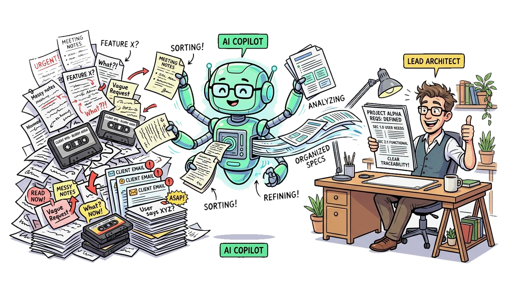

<!--
請看這幅漫畫：「AI 作為需求工程副駕駛 (AI as an RE Copilot)」！

在左側是令所有工程師望而生畏的混亂巨山：凌亂的手寫會議筆記、錄音帶、彼此衝突的客戶 Email 以及含糊不清的口頭許願。

在中央，擁有無數觸手的高能 AI 副駕駛，正以驚人的運算力過濾、比對、整理並提煉這些非結構化雜訊。

在右側，首席軟體架構師悠閒地坐在辦公桌前，手握咖啡，審查由 AI 理順的整齊規格藍圖，確認定義明確且具備完整可追溯性後，滿意地給出大大的讚！

總結這張投影片，請記住這個核心觀念：生成式 AI 副駕駛承擔了梳理原始資訊雜訊的繁重體力活，將精華規格交付架構師做最終決策。
-->
---
## 需求工程中四大核心 AI 實務應用 (4 Core AI Applications in RE)

1. **自動化使用者故事與規格草擬 (Automated Story Generation):**
   - 將客戶口語逐字稿，自動轉換為結構嚴謹且符合 `Given-When-Then` 的 Gherkin 驗收準則。
2. **語意歧義與條文衝突檢測 (Ambiguity & Inconsistency Detection):**
   - 快速通讀數百頁規格條文，精確標記出前後矛盾的術語定義與被動語態模糊陳述。
3. **語意關聯之追溯矩陣建置 (Traceability Matrix Construction):**
   - 透過文字向量語意嵌入 (Embeddings)，自動將高階需求映射連結至原始碼模組與單元測試。
4. **合成利害關係人人格模擬 (Synthetic Stakeholder Personas):**
   - 指示 LLM 扮演兒童專科護理師、資安稽核官或眼花長輩，模擬極端情境以發掘被遺漏的邊界需求。

<!--
這是在現代需求工程實務中，AI 落地最成功的四大核心場景：

第一，自動化使用者故事草擬：一秒將雜亂的口語筆記轉化為嚴謹的 Given-When-Then 規格。
第二，歧義與條文衝突檢測：利用語意比對，在幾秒鐘內找出長篇規格書中互相矛盾的條文。

第三，自動化建構追溯矩陣：透過向量語意嵌入技術，自動在需求條文與數萬行程式碼檔案、測試案例之間建立雙向追溯鏈結。
第四，合成利害關係人模擬：讓 AI 扮演各類特定角色——例如「一位有弱視障礙的七十歲長者」，藉由角色扮演模擬操作流程，找出團隊未曾想到的邊界痛點。

總結這張投影片，請記住這個核心觀念：AI 在故事草擬、歧義排查、追溯矩陣建立與角色模擬上，為需求工程帶來全方位的賦能。
-->
---
<!-- _class: full-image-slide -->

  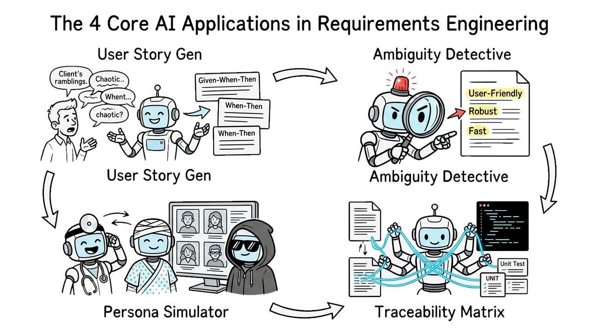

<!--
請看這幅漫畫，直觀呈現了需求工程中四大核心 AI 實務應用！

第一格：使用者故事生成器！AI 機械手臂正將客戶滔滔不絕的語音對話，打成一張張整齊的 Given-When-Then 驗收卡片。
第二格：歧義大偵探！當規格書中出現「友善介面」或「極致快速」等模糊主觀形容詞時，AI 警報器瞬間響起紅燈！

第三格：追溯矩陣織網者！AI 助手如同神經網絡般，精確編織出將需求文件垂直串通到程式碼模組與測試案例的追溯連結。
第四格：虛擬角色模擬器！機器人戴上聽診器扮演醫師、戴上面具扮演駭客，在寫程式前模擬各類極端攻擊與操作情境。

總結這張投影片，請記住這個核心觀念：AI 透過自動化草擬、歧義攔截、追溯編織與角色模擬，全方位賦能整個需求生命週期。
-->
---
## 人機協同：核心風險與工程最佳實踐 (Human-in-the-Loop)

* **過度依賴無監督 AI 之重大工程風險:**
  - **致命幻覺 (Hallucinations):** 憑空捏造看似合理但完全子虛烏有的業務規則或領域法規。
  - **隱私洩漏與智財侵害 (Privacy & IP Leaks):** 將企業未公開之核心商業機密或病患個資餵入公有雲模型。
  - **歷史偏見放大 (Bias Amplification):** 在需求中強化並放大了訓練資料中原本存在的歷史性偏差。
* **工程黃金法則：人機協同 (Human-in-the-Loop):**
  - **AI 提出建議，人類工程師裁決核准 (AI Proposes; Humans Dispose)。**
  - 唯有人類軟體工程師，承擔整套系統最終的法律責任、職業倫理操守與架構健全性！

<!--
雖然 AI 工具如此強大，但毫無監督地放任 AI 撰寫需求，將引發災難性風險。

三大風險警鐘：
第一，致命幻覺：LLM 能用極具說服力的自信語氣，編造出完全不存在的業務邏輯或外部 API！
第二，隱私洩漏：把醫院病患機密或客戶商業演算法直接送進公有雲 LLM，將面臨嚴重的法律與違約制裁。
第三，偏見放大：無意識繼承了網路上既有的族群偏見。

這引出了我們最高工程準則：人機協同 (Human-in-the-Loop)！
AI 負責提案生成，人類專業工程師負責審查裁定。當系統未來在真實世界出事時，法庭與客戶不會傳喚 ChatGPT，唯一負起法律責任、職業倫理與架構命脈的，是身為專業軟體工程師的你！

總結這張投影片，請記住這個核心觀念：AI 是強大的生成引擎，但人類工程師永遠是真理檢驗與責任歸屬的最終守門人。
-->
---
<!-- _class: full-image-slide -->

  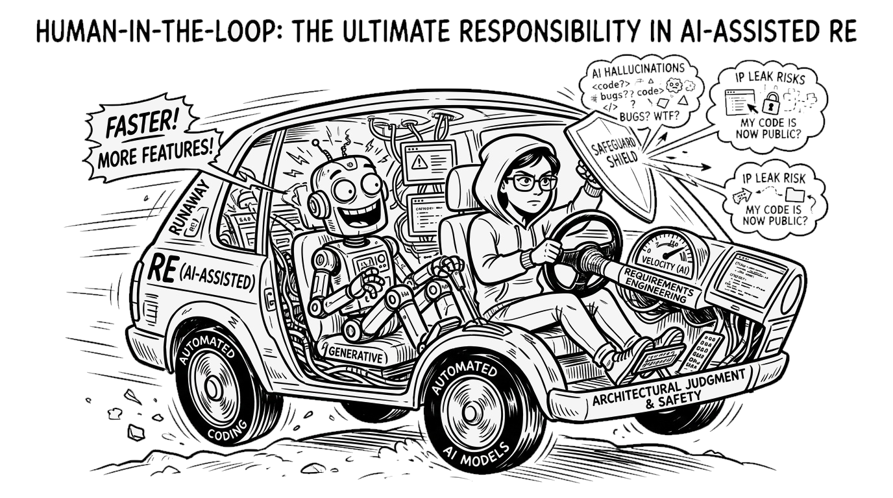

<!--
請看這幅漫畫：「人機協同：AI 輔助需求工程的終極責任基石」！

我們看到一輛由 AI 引擎驅動的高速賽車，機器人司機興奮狂吼：「衝啊！更快！加更多功能！」

但在主駕駛座上，人類軟體工程師保持著冷靜與絕對控制權——雙手牢牢掌握方向盤，舉起防護盾牌抵擋「幻覺」與「個資外洩」的風險，並將右腳踩在象徵「架構判斷」與「系統安全」的煞車踏板上。

AI 能提供強大推力，但唯有人類工程師能承擔法律、倫理與系統架構的最終責任。

總結這張投影片，請記住這個核心觀念：人類的架構監督不可妥協；工程師必須掌舵、設防並全面驗證所有由 AI 輔助產出的需求。
-->
---
### 觀念檢測：生成式 AI 與人機協同檢驗 (CCQ 8)
<!-- id: ase-ch03-ccq8 -->

  

當軟體工程團隊運用大型語言模型 (LLM) 從利害關係人的訪談逐字稿中自動生成需求規格書時，最需要透過「人機協同 (Human-in-the-Loop)」進行驗證的核心風險是什麼？

- **A.** LLM 可能產生聽起來合理但完全虛構的商業邏輯、遺漏關鍵的邊界約束，或捏造不存在的外部 API 串接。
- **B.** LLM 完全無法產出以 Markdown 清單格式或標準使用者故事 Given-When-Then 語法結構編排的規格文字。
- **C.** LLM 在生成文字時會消耗過量伺服器記憶體，進而導致正式環境中微服務叢集的資料庫發生死結錯誤。
- **D.** LLM 嚴格遵循傳統瀑布式開發流程，因此會堅決拒絕為敏捷疊代衝刺週期生成增量式的需求項目。

  

  

    
  

<!--
現在是 CCQ 8 觀念檢測時間！請掃描 QR Code。

題目問的是：利用 LLM 自動生成需求規格書時，最需要透過人機協同把關的核心風險是什麼？

檢視選項：
選項 B 說 LLM 無法產出 Markdown 或 Gherkin 語法，這與事實完全相反；
選項 C 把文字生成與生產資料庫死結混為一談；
選項 D 聲稱 LLM 固執遵循瀑布模型而拒絕敏捷，這純屬無稽之談。

正確答案是選項 A！LLM 本質上是文字機率預測模型，而非真正的領域專家。它極易產生「一本正經胡說八道」的幻覺——虛構出客戶從未說過的商業規則、遺漏關鍵安全限制，或捏造不存在的 API。工程師必須親自審查每一條生成的規格。

總結這張投影片，請記住這個核心觀念：人機協同驗證至關重要，因為 AI 極易產生看似合理但充滿潛在威脅的需求幻覺錯誤。
-->
---
<!-- _class: lead -->
<!-- header: '3.7 課程總結與參考文獻' -->

# **3.7 觀念總結與經典文獻 (Recap & References)**

> "Requirements are the bridge between human intention and digital reality."  
> 「需求是連結人類意圖與數位現實的永恆橋樑。」

<!--
來到第三章的尾聲，我們進入 3.7 節：觀念總結與經典文獻。

在這一節中，我們將透過互動式的概念填空測驗，全面鞏固今天所學的所有核心觀念——從需求三大支柱、量化 NFR 指標，到 UML 使用案例與 AI 賦能工程。

同時，我們將回顧奠定現代需求工程學科基石的經典教科書與權威實證論文。

總結這張投影片，請記住這個核心觀念：清晰、客觀且經嚴謹驗證的需求，是預測軟體專案成功的最關鍵指標。
-->
---
## 重點總結：概念填空測驗 (Fill-in-the-blank Quiz)

測試你對本章核心概念的理解程度：

1. **`___`** 需求描述系統應提供之具體功能與服務，而 **`___`** 需求則針對系統之品質與運作施加約束。
2. 以自然語言撰寫、供客戶與非技術利害關係人閱讀的高階敘述稱為 **`___`** 需求。
3. 嚴謹定義功能細節、作為軟體開發團隊實作與驗收合約基準的規格稱為 **`___`** 需求。
4. 透過目標-問題-指標 (GQM) 手法，能將模糊的利害關係人願景鍛造為可客觀測試的 **`___`** 指標。
5. 在 UML 使用案例圖中，基礎案例執行時必然無條件呼叫的共通子程序採用 **`___`** 關聯性。
6. 在將 AI 導入需求工程時，確保系統規格具備終極責任與可信度的核心工程準則是 **`___`**。

<!--
讓我們透過課堂即時填空測驗，盤點今天的學習收穫！

第一題：描述系統提供什麼服務的是「功能性」需求；施加約束條件的是「非功能性」需求！
第二題：寫給客戶與非技術主管看的高階敘述是「使用者」需求！
第三題：作為開發與測試驗收合約基準的技術藍圖是「系統」需求！
第四題：將主觀心願鍛造為可客觀驗收的數據，稱為「可驗證 (Verifiable)」或「量化」指標！
第五題：在 UML 使用案例圖中，無條件必然呼叫的共用行為採用「<<include>> (包含)」關聯！
第六題：將 AI 導入需求工程時，確保責任歸屬的最高準則是「人機協同 (Human-in-the-Loop)」！

大家表現得非常出色！

總結這張投影片，請記住這個核心觀念：這些核心術語構成了專業軟體工程師必備的需求工程核心基石。
-->
---
## 經典文獻與延伸閱讀 (References & Further Reading)

* **經典教科書與國際工程標準:**
  - Sommerville, I. (2016). *Software Engineering* (10th ed.). Chapter 4: Requirements Engineering. Pearson.
  - IEEE Std 830-1998 / ISO/IEC/IEEE 29148:2018: *Systems and software engineering — Life cycle processes — Requirements engineering*.
  - Cockburn, A. (2000). *Writing Effective Use Cases*. Addison-Wesley.
  - Wiegers, K., & Beatty, J. (2013). *Software Requirements* (3rd ed.). Microsoft Press.
* **AI 與需求工程前沿實證研究:**
  - Ferrari, A., et al. (2023). "Detecting Ambiguities in Requirements with Large Language Models." *IEEE RE'23*.
  - Arora, C., et al. (2024). "Automating Requirements Elicitation and Analysis with LLMs: An Empirical Evaluation." *ACM TOSEM*.
  - Zhang, H., Rahman, M., & Wang, Y. (2024). "Faithfulness, Hallucination, and Risk in Generative Requirements Engineering." *Empirical Software Engineering (EMSE)*.

<!--
這是第三章推薦的經典文獻、IEEE/ISO 國際標準以及最新的頂級實證研究論文。

在古典需求工程方面，Sommerville 第四章與 Karl Wiegers 的專書是必讀聖經；Alistair Cockburn 的著作則是學習撰寫嚴謹使用案例的最佳指南。

在現代 AI 賦能需求工程方面，強烈推薦大家研讀 IEEE RE、ACM TOSEM 以及 Empirical Software Engineering 近年針對歧義偵測、自動化擷取與防範 AI 幻覺的最新頂級論文。

感謝大家的熱情參與，我們下堂課見！
-->

