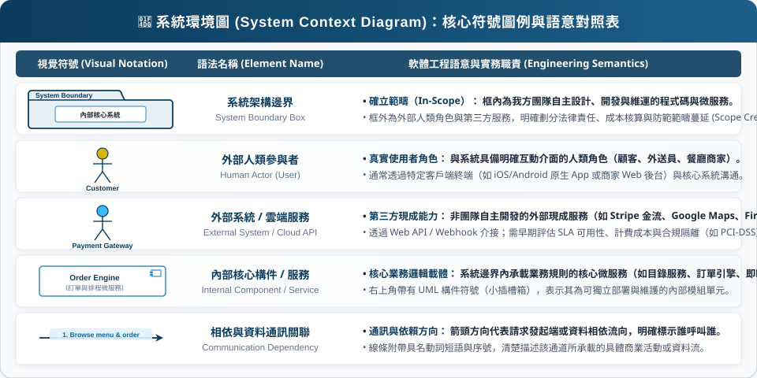

<!-- _class: lead -->
<!-- header: '' -->

# **軟體工程**

### 第四課：系統塑模與統一架構 (System Modeling & Unified Architecture)

**授課教師：薛念林 教授**  
資訊工程學系  
逢甲大學

<!--
各位好，歡迎來到軟體工程第四課：系統塑模與統一架構。

在第三章中，我們學習了如何透過自然語言與使用者故事來發掘、分析與規格化軟體需求。然而，自然語言天生具備模糊性與不完整性，很難直接無縫轉化為穩健且無瑕疵的程式碼。

今天，我們將完成從抽象需求邁向形式化軟體模型的關鍵躍遷。我們將探討什麼是系統塑模、深入理解四大核心視角、回顧統一塑模語言（UML）的三巨頭歷史，並透徹掌握每一種不可或缺的 UML 圖表。

總結這張投影片，請記住這個核心觀念：系統塑模在人類的模糊需求與可執行的軟體程式碼之間，建立了正式且精確的觀念橋樑。
-->
---
<!-- _class: outline-slide -->

## 第四章：課程藍圖與核心架構

  

    <h3>第一部分：基礎理論與功能塑模</h3>
    <ul>
      <li><b>4.1 系統塑模基礎與 UML：</b> 什麼是塑模、四大視角、五大核心圖表、方法論之戰與 UML 三巨頭名片。</li>
      <li><b>4.2 環境塑模與程序塑模：</b> 系統架構邊界、外部夥伴雲端服務、跨角色活動圖工作流程。</li>
      <li><b>4.3 功能塑模與使用案例：</b> Jacobson 的歷史遺產、include 與 extend 機制、結構化規格書。</li>
    </ul>
  

  

    <h3>第二部分：結構、動態與 AI 塑模</h3>
    <ul>
      <li><b>4.4 循序圖與 BCE 架構：</b> 訊息傳遞、生命線與啟用條、邊界-控制-實體（BCE）架構模式。</li>
      <li><b>4.5 結構塑模與領域類別圖：</b> 領域實體、可見度修飾詞、重數、組合（Composition）與聚合（Aggregation）。</li>
      <li><b>4.6 行為塑模與有限狀態機：</b> 訂單生命週期狀態機、事件觸發、守衛條件與轉換動作。</li>
      <li><b>4.7 AI 輔助系統塑模：</b> Text-to-UML 視覺副駕駛、人機協同審查防護、核心填空回顧。</li>
    </ul>
  

<!--
這是我們第四章的學習藍圖。

在左側的第一部分，我們從系統塑模的根本哲學出發，探索四大核心視角，回顧 UML 的統一歷史，並以美食外送平台為貫穿案例，定義系統邊界與跨角色活動流程。

在右側的第二部分，我們深入探索動態循序互動、領域類別骨幹架構、反應式狀態機，以及現代生成式 AI 如何作為視覺副駕駛輔助 Text-to-UML。

總結這張投影片，請記住這個核心觀念：本章將帶領大家完整走過結構、行為與 AI 賦能的系統塑模全貌。
-->
---
<!-- _class: lead -->
<!-- header: '4.1 塑模基礎與 UML 演進' -->

# **4.1 系統塑模基礎與 UML 演進**

> "A language that doesn't affect the way you think about programming is not worth knowing."  
> *(一門不能改變你程式思維的語言，就不值得去學。)*  
> — *Alan Perlis*

<!--
我們首先進入 4.1 節：系統塑模基礎與統一塑模語言（UML）的演進歷程。

在探討具體的圖表符號之前，我們必須先釐清：究竟什麼是模型？為什麼工程師在寫 code 之前必須先建構模型？軟體產業又是如何歷經波折，最終團結在同一套通用的視覺文法之下？

總結這張投影片，請記住這個核心觀念：系統塑模提供具有明確目的的抽象化機制，使工程師能夠有效駕馭軟體的本質複雜度。
-->
---
## 什麼是系統塑模？ (What is System Modeling?)

> "系統塑模是為系統開發抽象模型的過程，每個模型代表該系統不同的視角或觀點。"  
> — *Ian Sommerville, Software Engineering (10th ed.)*

- **系統塑模的核心工程原則：**
  - **抽象化 (Abstraction)：** 隱藏不必要的實作細節，突顯關鍵的架構結構、資料流動與相依關係。
  - **多重視角 (Multiple Perspectives)：** 沒有任何單一圖表能解釋整個複雜軟體；不同利害關係人需要不同的視角。
  - **溝通與驗證 (Communication & Verification)：** 作為產品經理、系統架構師、開發者與測試工程師之間的通用視覺語言。
  - **實作藍圖 (Blueprint for Implementation)：** 提供正式的結構與行為規格，作為後續編寫程式碼與資料庫結構的精確藍圖。

<!--
讓我們先建立系統塑模的根本定義。

Ian Sommerville 教授將塑模定義為建立抽象模型的過程，每個模型展現系統不同的視角。

請特別注意「抽象化」這個詞。試想：如果一張蓋房子的建築藍圖把混凝土中的每一顆分子都畫出來，工人根本不可能蓋出房子！你需要一張水電圖、一張結構圖、一張通風管線圖。

軟體工程也是完全相同的道理：沒有任何一張圖能包辦整個軟體系統，我們必須透過多種互補的視角來掌控複雜度。

總結這張投影片，請記住這個核心觀念：系統塑模透過多重視角的有目的抽象化，幫助軟體工程師全面駕馭軟體系統的複雜度。
-->
---
<!-- _class: title-image-slide -->

## 盲人摸象與多重視角模型 (The Parable of the Elephant & Multiple Perspectives)

  

<!--
這張圖是軟體工程系統塑模中最經典的哲理啟示：「盲人摸象」。

古老寓言中，摸到象鼻的盲人堅持大象像水管；摸到象腿的盲人堅信大象像粗柱；摸到象身的盲人認為大象是一堵高牆；摸到象尾的則以為是一條細繩。每個人都說對了局部事實，卻都犯了「以偏概全 (Fallacy of Composition)」的認知謬誤。

軟體系統也是如此：它本質上是龐大、複雜且無形的抽象產物。
如果你只畫類別圖，就像只摸到象腿——你掌握了靜態結構與屬性骨幹，卻看不出資料如何隨時間流動；
如果你只看循序圖，就像只摸到象鼻——你看到訊息傳遞順序，卻不知道整體系統邊界與外部依賴；
如果你只看狀態圖，就像只摸到象尾——你掌握了反應動態，卻無法反映物件資料定義。

這正是為什麼我們「絕不可能僅用一張單一圖表或模型來描述整個軟體」！
軟體工程必須從外部 (Context)、互動 (Interaction)、結構 (Structural) 與行為 (Behavioral) 四大維度協同塑模，互為佐證，才能在腦海中拼湊出架構的完整真相。

總結這張投影片，請記住這個核心觀念：任何單一模型都是系統在特定維度的局部投影，唯有綜合多重視角，才能建構完整且無盲點的軟體架構。
-->
---
## 系統塑模的 4 大核心視角 (4 Core Perspectives)

- **1. 外部視角 (External Perspective)：**
  - 塑模系統處在的運行環境、外部合作夥伴與邊界範圍。
  - 明確劃分系統邊界：哪些由內部團隊開發，哪些委託給外部第三方服務。
- **2. 互動視角 (Interaction Perspective)：**
  - 塑模外部參與者與系統之間，或是內部協同物件之間的動態溝通與訊息傳遞。
- **3. 結構視角 (Structural Perspective)：**
  - 塑模系統資料組織、類別、屬性、方法與關聯性的靜態架構，與執行時間先後無關。
- **4. 行為視角 (Behavioral Perspective)：**
  - 塑模系統的動態執行行為、業務流程步驟，以及系統針對外在事件所產生的反應式狀態轉換。

<!--
國際軟體工程規範將系統模型有條不紊地理出四大核心視角：

第一，外部視角：系統的界線劃在哪裡？外部有哪些雲端服務和人類使用者會接觸它？
第二，互動視角：參與者與物件之間在時間軸上如何相互傳遞訊息？
第三，結構視角：系統內部的靜態資料表、類別、屬性與關聯長什麼樣子？
第四，行為視角：當事件發生或執行流程啟動時，系統的狀態如何動態反應與流轉？

優秀的軟體工程師必須根據眼前的問題，精準挑選最合適的視角來思考。

總結這張投影片，請記住這個核心觀念：四大核心塑模視角分別為外部、互動、結構與行為視角。
-->
---
## 現代實務必備的 5 大 UML 核心圖表

| 圖表類型 | 所屬視角 | 動態 / 靜態 | 主要軟體工程職責 |
| :--- | :--- | :--- | :--- |
| **1. 環境圖 (Context Diagram)** | 外部視角 | 靜態邊界 | 劃定系統邊界與外部夥伴系統的相依關係 |
| **2. 活動圖 (Activity Diagram)** | 行為視角 | 動態流程 | 視覺化呈現連續業務工作流程與平行並行邏輯 |
| **3. 使用案例圖 (Use Case Diagram)** | 互動視角 | 靜態契約 | 界定使用者目標與系統功能範疇邊界 |
| **4. 循序圖 (Sequence Diagram)** | 互動視角 | 動態時間 | 沿著時間生命線追蹤物件之間的循序訊息傳遞 |
| **5. 類別圖 (Class Diagram)** | 結構視角 | 靜態骨幹 | 定義領域實體、資料屬性、操作方法與物件關聯 |
| *(加分必學) 狀態機圖 (State Diagram)* | 行為視角 | 動態反應 | 塑模離散狀態、事件觸發與反應式生命週期 |

<!--
在 UML 2.5 定義的 14 種圖表中，這五種（加上狀態圖）構成了職業軟體工程師最常用的核心二八工具包：

環境圖劃定系統周邊範圍。
活動圖勾勒業務工作流程。
使用案例圖界定功能範圍與使用者目標。
循序圖描繪運行時隨時間發生的物件溝通。
類別圖作為物件導向程式碼與資料庫結構的靜態建築骨幹。
而狀態機圖則掌管事件驅動的離散反應邏輯。

總結這張投影片，請記住這個核心觀念：精通這五大核心 UML 圖表，就能以精確且無歧義的視覺文法表達任何軟體架構。
-->
---
## 標準化的迫切需求：1990 年代「方法論之戰」

* **物件導向程式設計的崛起 (1980 年代末至 1990 年代初)：**
  - 軟體產業從程序導向程式碼 (C, Pascal) 大規模轉移至物件導向典範 (C++, Smalltalk)。
  - 工程師迫切需要一套圖形符號來視覺化表達類別、物件與關聯。
* **百家爭鳴的「方法論之戰 (Method Wars)」時代：**
  - 超過 **50 種相互競爭的物件導向塑模記號**充斥商業市場。
  - 各派大師激烈爭論：類別究竟該畫成雲朵、矩形還是橢圓？繼承到底該用空心三角、實心箭頭還是虛線？
  - **嚴重的產業割裂碎片化：** 各公司之間無法交換架構模型，CASE 塑模軟體彼此互不相容，工程師換工作就得被迫重新學習一套新符號。

<!--
既然塑模如此不可或缺，軟體產業究竟是如何整合出一套共同標準的呢？

在 1980 年代末到 1990 年代初，C++ 與 Smalltalk 掀起物件導向狂潮，但隨之而來的是一場大混亂——所謂的「方法論之戰」。

當時市場上湧現了 50 多種互相競爭的塑模符號！Grady Booch 用雲朵表示類別；James Rumbaugh 用整齊的矩形；Ivar Jacobson 提出了使用案例；還有 Coad-Yourdon 等各派學說。

這造成了架構上的通天塔。你在 IBM 畫雲朵，換到 GE 得畫方塊。塑模工具彼此無法流通，軟體設計被鎖死在封閉規格中。

總結這張投影片，請記住這個核心觀念：1990 年代的方法論之戰以 50 多種互不相容的符號割裂了軟體產業，催生了標準化的迫切需求。
-->
---
## 統一與標準化：從 Rational 到 OMG

* **1994 年 – Rational 展開統一整合：**
  - Jim Rumbaugh 離開奇異（GE）加入 Rational Software 與 Grady Booch 攜手，將 Booch 方法與 OMT 融合成「統一方法」(Unified Method v0.8)。
* **1995 年 – 「三巨頭 (Three Amigos)」合體：**
  - Ivar Jacobson 加入 Rational，帶來革命性的**使用案例 (Use Case)** 與 OOSE 架構思維。
* **1997 年 – OMG 國際標準正式誕生：**
  - 提交給**物件管理組織 (OMG)**，於 1997 年 11 月獲全票通過，成為全球公認的 **UML 1.1** 國際標準。
* **2005 年 – UML 2.0 架構大改版：**
  - 擴充至 13 種（後續擴增為 14 種）圖表類型，並具備嚴謹的可執行元模型 (Metamodel)。

  
  

    Unified Modeling Language
    <a href="https://www.omg.org/uml/" target="_blank">Object Management Group (OMG)</a>
  

<!--
這場危機是如何化解的？正是透過在 Rational Software 上演的傳奇智識大融合。

1994 年，Jim Rumbaugh 離開奇異加入 Rational，與 Grady Booch 合力融合理論分析與實務設計。隔年，Ivar Jacobson 也帶著使用案例方法加入。

這三位大師在軟體界被親切尊稱為「UML 三巨頭 (The Three Amigos)」。

值得稱許的是，Rational 並沒有把 UML 當成自家的私有封閉規格，而是將其無私捐贈給國際開放標準組織 OMG。1997 年 11 月，UML 1.1 成為全球通用的軟體塑模國際標準。

總結這張投影片，請記住這個核心觀念：Rational 公司匯聚了三巨頭的智慧，並由 OMG 正式確立 UML 為全球統一的軟體塑模語言標準。
-->
---
## UML 奠基先驅：Grady Booch

- **角色與學術榮譽：**
  - Rational Software 首席科學家、IBM 院士 (Fellow)、ACM 院士。
- **開創經典方法論：**
  - **Booch 方法**與劃時代著作：《物件導向分析與設計》(Object-Oriented Analysis and Design with Applications)。
- **對 UML 的核心貢獻：**
  - 極度專注於**具體軟體設計**、模組拆解、類別抽象化與架構模式。
  - 提倡為實作層級的物件結構與程式碼對應關係提供高度的視覺表現力。
- **著名軟體工程箴言：**
  > *"乾淨的程式碼讀起來，永遠就像是由深具責任心與熱忱的人所撰寫。"*

  
  

    Grady Booch
    <a href="https://en.wikipedia.org/wiki/Grady_Booch" target="_blank">Rational Software / IBM Fellow</a>
  

<!--
讓我們認識三巨頭中的第一位：Grady Booch。

Grady Booch 是 IBM 院士，曾任 Rational Software 首席科學家。他所著的《物件導向分析與設計》是軟體工程領域的殿堂級經典。

Booch 的獨特強項在於「具體軟體設計」——類別、繼承、多型與模組如何直接對應到可執行的程式碼架構。他早期著名的雲朵形狀類別記號，後來演變為 UML 標準的三格矩形。

總結這張投影片，請記住這個核心觀念：Grady Booch 奠定了物件導向設計抽象化與程式碼具體架構對應的基石。
-->
---
## UML 奠基先驅：James Rumbaugh

- **角色與學術榮譽：**
  - 奇異公司 (GE) 全球研發中心軟體主任研究員、Rational Software、IBM。
- **開創經典方法論：**
  - **物件塑模技術 (OMT, Object Modeling Technique)** 與專書：《物件導向塑模與設計》。
- **對 UML 的核心貢獻：**
  - 強調嚴謹的**領域分析 (Domain Analysis)**、語義資料塑模與實體關聯對應。
  - 首創將靜態物件結構與 David Harel 的**狀態圖 (Statecharts)** 深度結合，用以塑模動態反應式系統。
- **著名軟體工程箴言：**
  > *"如果不透徹理解領域的真實本質，就絕不可能打造出卓越的軟體。"*

  
  

    James Rumbaugh
    <a href="https://en.wikipedia.org/wiki/James_Rumbaugh" target="_blank">GE Research / Rational Software</a>
  

<!--
認識第二位巨頭：James Rumbaugh 博士。

Jim Rumbaugh 早年在奇異公司企業研發中心帶領軟體技術研究。他所創立的 OMT 方法，被業界公認為數學結構最嚴謹的分析方法論。

Rumbaugh 的天才在於領域分析——精確捕捉真實世界的實體、資料庫關聯與狀態機。當 Rumbaugh 與 Booch 攜手時，正好在「分析領域問題」與「設計軟體架構」之間架起完美的平衡木。

總結這張投影片，請記住這個核心觀念：James Rumbaugh 為 UML 奠定了嚴謹的領域分析、資料關聯與狀態圖塑模根基。
-->
---
## UML 奠基先驅：Ivar Jacobson

- **角色與學術榮譽：**
  - 愛立信 (Ericsson) 首席架構師、Objectory AB 創辦人、Rational Software、SEMAT 發起人。
- **開創經典方法論：**
  - **物件導向軟體工程 (OOSE)**。
- **對 UML 的核心貢獻：**
  - **使用案例 (Use Cases) 的發明者 (1986)：** 革命性地將系統架構錨定在可衡量的使用者目標之上。
  - 提出經典的**邊界–控制–實體 (BCE, Boundary–Control–Entity)** 強韌性分析模式與元件化架構。
- **著名軟體工程箴言：**
  > *"一個沒有使用者的系統，就沒有任何存在的理由。塑模永遠要先從使用者的目標開始。"*

  
  

    Ivar Jacobson
    <a href="https://en.wikipedia.org/wiki/Ivar_Jacobson" target="_blank">Ericsson / Objectory / Rational</a>
  

<!--
認識第三位巨頭：Ivar Jacobson 博士。

Jacobson 早年在愛立信研發龐大的電話交換機系統，後來創立 Objectory 公司。他在 1986 年發明了「使用案例 (Use Cases)」。

在 Jacobson 之前，軟體需求大多是一篇篇生硬枯燥的條文式功能規格。Jacobson 徹底顛覆了這個視角，把焦點拉回人類使用者身上：究竟是「誰」在用系統？他們想達成什麼「商業目標」？他還提出了至今仍主導架構設計的 BCE 模式。

總結這張投影片，請記住這個核心觀念：Ivar Jacobson 發明了使用案例與 BCE 模式，讓軟體架構真正以使用者目標為依歸。
-->
---
## UML 三巨頭：軟體塑模的三位一體 (The Trinity of Modeling)

  

    <h3>Ivar Jacobson</h3>
    <h4>核心回答「Why」(目標 / 使用者)</h4>
    <ul>
      <li><b>使用案例驅動：</b> 外部參與者想達成什麼目標？</li>
      <li><b>BCE 強韌性分析：</b> 徹底分離 UI 邊界與核心資料實體。</li>
      <li><b>元件契約規範：</b> 可重用子系統的架構邊界。</li>
    </ul>
  

  

    <h3>James Rumbaugh</h3>
    <h4>核心回答「What」(領域與資料)</h4>
    <ul>
      <li><b>領域物件分析：</b> 現實世界存在哪些核心概念？</li>
      <li><b>類別與資料綱要：</b> 結構化的實體關聯關係。</li>
      <li><b>有限狀態機：</b> 反應式事件驅動的生命週期。</li>
    </ul>
  

  

    <h3>Grady Booch</h3>
    <h4>核心回答「How」(設計與程式碼)</h4>
    <ul>
      <li><b>物件導向設計：</b> 類別之間如何精巧協同運作？</li>
      <li><b>巨觀架構拆解：</b> 分層模組與相依性控制。</li>
      <li><b>實作直譯對應：</b> 視覺模型與 OOP 程式碼直接對齊。</li>
    </ul>
  

> 📌 **架構整合精髓：** Jacobson 捕捉系統存在的**初衷目的 (Why)**；Rumbaugh 塑模領域存在的**資料本質 (What)**；Booch 設計程式執行的**實作架構 (How)**。

<!--
請大家細細體會三巨頭之間天衣無縫的互補之美：

Ivar Jacobson 從使用者視角回答了「為什麼 (Why)」系統需要存在。
James Rumbaugh 梳理問題領域，回答了存在哪些資料實體的「本質 (What)」。
Grady Booch 規劃軟體架構，回答了這些元件在程式碼中如何高效運行的「作法 (How)」。

三巨頭的合體不僅成就了 UML，更奠定了 Rational 統一流程（RUP）等現代軟體工程方法的基石。

總結這張投影片，請記住這個核心觀念：UML 完美融合了使用者目標 (Why)、領域資料 (What) 與程式架構 (How) 的三位一體。
-->
---
### 觀念檢核測驗 1 (CCQ 1)

  

在被尊稱為「UML 三巨頭」的軟體工程大師中，哪一位以於 1986 年發明**使用案例 (Use Cases)**、將軟體架構直接錨定於使用者具體目標而聞名？

- **A.** Grady Booch
- **B.** James Rumbaugh
- **C.** Ivar Jacobson
- **D.** Martin Fowler

  

  

    
  

<!--
讓我們透過觀念測驗 1 來檢驗對 UML 發展史的理解。

檢視各個選項：
Grady Booch 開創了 Booch 方法，主攻物件導向設計與程式碼映射。
James Rumbaugh 開發了 OMT 方法，專精領域分析與物件狀態模型。
Martin Fowler 則是撰寫《UML 精華 (UML Distilled)》與《重構》的大師，但他並非三巨頭成員。

正確答案是 C：Ivar Jacobson！Jacobson 於 1986 年在愛立信提出使用案例，徹底將軟體架構引導向以使用者目標為核心的典範。

總結這張投影片，請記住這個核心觀念：Ivar Jacobson 發明了使用案例，將需求與架構聚焦於使用者具體目標。
-->
---
<!-- _class: lead -->
<!-- header: '4.2 環境塑模與程序塑模' -->

# **4.2 環境塑模與程序塑模**

> "Architecture is the decisions that you wish you could get right early in a project."  
> *(架構，就是那些你希望在專案初期就能正確搞定的關鍵決策。)*  
> — *Ralph Johnson*

<!--
現在我們推進到 4.2 節：環境塑模與程序塑模。

我們將先運用環境模型（Context Model）明確界定軟體架構的週邊範圍，接著運用 UML 活動圖（Activity Diagram）剖析跨角色、端到端的完整業務流程。

總結這張投影片，請記住這個核心觀念：環境模型定義系統的邊界與外在相依，活動圖則捕捉跨角色的業務協同流程。
-->
---
## 什麼是環境模型？ (What is a Context Model?)

> "系統環境模型（Context Model）界定系統處於其運行環境中的邊界，展示目標系統與哪些外部系統、使用者與組織實體進行互動。"  
> — *Ian Sommerville, Software Engineering (10th ed.)*

- **環境模型的核心工程本質：**
  - 屬於**外部視角 (External Perspective)**，是軟體架構在最高抽象層級的第一張鳥瞰全景圖。
  - 將整個軟體視為一個高層次的黑色黑箱或子系統容器，專注描述與周遭真實世界的相依介面。
- **三大不可取代的重要性 (Why Context Modeling Matters)：**
  - **1. 確立架構責任邊界 (System Boundary)：**
    - 嚴格劃分**「範圍內 (In-Scope，我方自主開發與維運)」**與**「範圍外 (Out-of-Scope，外部既有系統或合作夥伴)」**。
    - 清楚界定團隊交付責任，從源頭杜絕專案最常見的致命失控——**「範疇蔓延 (Scope Creep)」**。
  - **2. 識別關鍵外部依賴與風險 (External Dependencies & SLA)：**
    - 專案早期即明確指出依賴哪些第三方服務（如金流、地圖導航、推播雲），及早評估其 SLA 可用性保證、計費成本與資安隔離合規（如 PCI-DSS）。
  - **3. 對齊利害關係人認知 (Align Stakeholder Touchpoints)：**
    - 作為產品經理 (PM)、系統架構師、合作廠商與高層主管的共通溝通介面，在開工前對「系統要做什麼、不該做什麼」達成共識。

<!--
在深入實戰案例之前，我們先探討究竟什麼是環境模型（Context Model），以及為什麼優秀的架構師在動手寫程式碼之前，一定會先畫出這張圖。

Ian Sommerville 教授指出，環境模型界定了系統處於其運行環境中的邊界。

它為什麼至關重要？
第一，確立邊界。很多軟體專案最後延期超支，都是因為「範疇蔓延」——需求一直加、大家都以為某個功能是系統要做的。環境圖用最清晰的粗黑框，劃出我方責任範疇。
第二，識別外部相依性與風險。比如金流扣款，我們不用自己去開一家跨國銀行，而是透過 API 委託給 Stripe；這同時也是資安邊界，讓敏感信用卡資料遠離我們內部的資料庫。
第三，對齊利害關係人認知，讓所有人站在同一高度看清全局。

總結這張投影片，請記住這個核心觀念：環境模型確立系統架構的責任邊界，識別外部相依風險，是防止範疇蔓延的第一道防線。
-->
---
<!-- _class: title-image-slide -->

## 系統環境圖符號與語意對照 (Context Model Notation)

  

<!--
在閱讀外送案例之前，請大家先熟悉系統環境圖的五大核心視覺文法：

1. 系統架構邊界框（System Boundary）：大型分組框，標示自主維運範圍。框內是我方程式碼，框外是外部實體。
2. 外部人類參與者（Human Actor）：金黃色火柴人，代表真實世界操作 App 的人類角色（顧客、外送員、餐廳商家）。
3. 外部系統與雲端服務（External System）：代表第三方委外現成 API（如 Stripe 金流、Google Maps、Firebase），需評估 SLA 與介接成本。
4. 內部核心構件（Internal Component）：系統內部運行的獨立微服務或引擎模組，右上角帶有 UML 構件標記。
5. 相依與通訊關聯線（Dependency Link）：實線單向箭頭搭配業務動詞，清楚標記誰呼叫誰、資料往哪裡流動。

總結這張投影片，請記住這個核心觀念：熟練掌握邊界框、參與者、外部系統、內部構件與相依箭頭五大元素，就能精準繪製與解讀任何系統環境圖。
-->
---
<!-- _class: title-image-slide -->

## 美食外送平台：系統環境模型實戰 (Case Study: Food Delivery Context Model)

  

<!--
請大家看螢幕上這張美食外送平台的系統環境圖 (System Context Diagram)。

注意中央那個標註為「美食外送平台邊界」的大矩形。方框內部的一切，代表我們軟體團隊負責設計、部署、維護的內部程式碼與微服務。

再看方框外圍的外部實體與角色：
左側是三大核心人類角色：瀏覽菜單點餐的顧客、更新備餐進度的合作餐廳，以及外送配送的外送員。
右側則是外部企業級雲端服務：如 Stripe/Apple Pay 等金流閘道、Google Maps 等導航服務，以及 Firebase 推播服務。

總結這張投影片，請記住這個核心觀念：環境圖明確劃定了內部自主開發軟體與外部使用者、雲端服務之間的嚴謹界線。
-->
---
## 環境模型解析與架構邊界劃定

* **首要營運邊界的確立：**
  - 明確劃分何者為**內部系統**（由我方團隊掌控：訂單引擎、菜單型錄、追蹤中心），何者為**外部系統**（第三方服務與人類參與者）。
  - 在架構生命週期早期精確定義外部相依性，杜絕「範疇蔓延 (Scope Creep)」。
* **人類利害關係人介面：**
  - **顧客 (Customer)：** 透過 iOS / Android 原生 App 查詢菜單、下單與即時追蹤。
  - **餐廳夥伴 (Restaurant Partner)：** 透過商家平板或 Web 平台接單並回報餐點製作狀態。
  - **外送夥伴 (Delivery Courier)：** 透過外送專屬 App 接收派單任務並串流回傳即時 GPS 座標。
* **第三方外部雲端服務相依性：**
  - **金流閘道 (Payment Gateway, 如 Stripe)：** 處理符合 PCI-DSS 規範之金融扣款，我方伺服器不儲存敏感卡號。
  - **地圖導航服務 (Google Maps API)：** 計算即時路徑距離、外送員預估抵達時間 (ETA) 與路線幾何。
  - **推播通知雲 (Notification Cloud, 如 Firebase)：** 發送非同步推播通知與 SMS 驗證簡訊。

<!--
深入剖析為何環境圖對軟體架構師至關重要：

第一，它明確界定了工程團隊真正需要開發的職責範圍。我們「不需要」自己去開一家跨國銀行或發射導航衛星！我們透過清晰的網路合約將這些職責委託給 Stripe 與 Google Maps。

第二，它揭示了關鍵的資安防護邊界：敏感的金流扣款委由外部金流處理，讓我們內部的資料庫得以排除在繁瑣昂貴的 PCI-DSS 稽核範疇之外。

總結這張投影片，請記住這個核心觀念：環境圖透過清晰定義外部 API、使用者角色與安全邊界，消除了系統架構的模糊性。
-->
---
<!-- _class: title-image-slide -->

## 美食外送履行：顧客下單與廚房備餐活動流程

  

<!--
現在我們來看外送業務的第一階段活動流程：顧客下單與廚房備餐。

請注意畫面上的三條垂直泳道（Swimlanes）：左邊是顧客、中央是平台核心、右邊是餐廳夥伴。
泳道明確標示了組織權責：每一個動作究竟該由誰負責執行！

順著流程走：
1. 顧客挑選餐點並送出訂單。
2. 平台驗證購物車，並呼叫外部金流進行信用卡預先授權。
3. 注意決策菱形：若扣款成功則成立訂單；失敗則進入中斷終止節點。
4. 商家接獲通知：若接單則廚房開火烹煮；若拒單則平台自動全額退款。

總結這張投影片，請記住這個核心觀念：活動圖的泳道將下單作業步驟清晰劃分給顧客、平台與餐廳三大角色。
-->
---
## 第一階段活動流程與語法符號解析

* **活動塑模的核心語法元素：**
  - **圓角矩形 (Rounded Rectangles)：** 操作動作狀態（例如 `瀏覽菜單並挑選餐點`、`廚房開始烹調餐點`）。
  - **泳道分區 (Swimlanes / Partitions)：** 將工作職責明確分配給顧客、平台核心與餐廳夥伴。
  - **決策菱形 (Decision Diamonds)：** 依據布林守衛條件進行分支判斷（`[授權扣款成功？]`、`[餐廳是否接單？]`）。
  - **中斷終止節點 (Detach Node / Terminal Exit)：** 代表異常分支終止（例如付款失敗或餐廳原物料短缺拒單）。
* **非同步解耦的工程考量：**
  - 顧客的互動在完成訂單提交後即告一段落；後續步驟由平台與商家非同步推進。
  - 當餐廳拒單時，平台核心能自動觸發即時退款與發票作廢，維護商業信用。

<!--
回顧第一階段活動圖的視覺文法：

圓角矩形代表具體的動作狀態。
泳道按組織角色切分，誰做什麼一目了然。
菱形代表分支決策點，依布林條件分流。
終止節點代表流程正常或異常結束。

請特別注意：當餐廳原物料不足拒單時，流程並非卡住崩潰，而是乾淨地導向補償邏輯（例如全額即時退費）後優雅終止。

總結這張投影片，請記住這個核心觀念：活動圖透過角色泳道、決策分支與終止節點，精確刻畫循序與異常流程。
-->
---
<!-- _class: title-image-slide -->

## 美食外送履行：外送派單與實體交付活動流程

  

<!--
現在我們來看業務履行的第二階段：外送派單與餐點實體交付。

注意這裡的三大泳道：左側是平台核心、中央是外送員、右側是顧客。

請看上方那條粗黑水平橫線：那是分岔棒（Fork Bar）！
當餐點製作完成時，系統並不需要一步一步等待，而是瞬間分岔為兩個平行的並行動作：
第一，推播「餐點製作完成」通知給顧客。
第二，同時啟動 GPS 演算，向最近的外送員推播派單任務！

追蹤外送員的動作：接單、導航抵達餐廳、掃描 QR Code 取餐、騎車抵達顧客地址，完成實體交付。
最後平台完成正式扣款結算，並由顧客對外送服務進行評價。

總結這張投影片，請記住這個核心觀念：利用分岔棒（Fork）塑模並行並發機制，能同時啟動推播通知與外送派單。
-->
---
## 第二階段活動流程：並行並發與分岔 / 匯合機制

* **分岔與匯合同步棒 (Fork & Join Bars，粗水平線)：**
  - **分岔棒 (Fork Bar，並發產生器)：** 將單一控制執行緒拆分為**多個平行並行的非同步活動**。
    - *實例：* 平台同時發送推播通知給顧客，並平行啟動 GPS 演算派單給外送員，互不卡住阻斷！
  - **匯合棒 (Join Bar，同步屏障)：** 匯總多個平行並發分支；只有當所有流入的平行前置任務全部完成後，後續流程才會繼續。
* **實體世界履行的工程防護設計：**
  - **虛實整合握手驗證：** 外送員抵達餐廳後，必須透過手機鏡頭掃描訂單 QR Code，原子化確認餐點取走。
  - **資金正式清算觸發點：** 信用卡的最終正式扣款（Capture）與平台抽成清算，*僅在實體驗收交付完成時正式觸發*。
  - **顧客回饋閉環：** 完成送達後立即推播評分與給予小費介面。

<!--
深入剖析這張活動圖的並發與同步機制：

請注意分岔棒：在即時分散式系統中，平行處理非常關鍵。如果後端系統必須等外送員接單後才能發通知給客人，客人的焦慮感會大幅增加。分岔棒讓系統能同時執行通知與外送媒合。

另外注意金流清算：授權（Authorize）在下單時完成，但真正的清算扣款（Capture）嚴格推遲至實體驗收完成之時。

總結這張投影片，請記住這個核心觀念：分岔棒將執行流程拆解為並行並發任務，實現非同步派單與即時通知。
-->
---
<!-- _class: lead -->
<!-- header: '4.3 功能塑模與使用案例' -->

# **4.3 功能塑模與使用案例模型**

> "A use case is a contract for behavior between the system and its actors to achieve a measurable business goal."  
> *(使用案例是系統與參與者之間的行為契約，旨在達成可衡量的商業目標。)*  
> — *Alistair Cockburn*

<!--
我們現在前進至 4.3 節：功能塑模與使用案例模型。

使用案例是由 Ivar Jacobson 所開創，是軟體工程界定義功能範疇的公認標準。它揚棄了雜亂無章的條例文字，改以「參與者（Actor）」追求「具體商業目標」的脈絡來結構化組織需求。

讓我們看看美食外送平台如何規範其功能範疇。

總結這張投影片，請記住這個核心觀念：使用案例界定了外部參與者與系統之間的行為規格契約。
-->
---
<!-- _class: title-image-slide -->

## 美食外送平台：使用案例圖 (Use Case Diagram)

  

<!--
請看這張精心配置的美食外送平台使用案例圖。

注意參與者的視覺平衡佈局：
左側是主要使用者：顧客與餐廳夥伴。
右側是外送員與次要支援參與者：外部金流閘道！
這樣的左右平衡配置，能避免圖表垂直過度拉長，非常適合現代 16:9 螢幕瀏覽。

請觀察：
顧客發起「瀏覽菜單」、「美食訂餐下單」、「即時追蹤配送」與「取消訂單」。
餐廳管理菜單料理並確認接單。
外送員接收外送任務並回報送達。
而「美食訂餐下單」則透過 <<include>> 包含了「處理信用卡扣款」，進一步呼叫外部金流閘道。

總結這張投影片，請記住這個核心觀念：將參與者平衡配置於系統邊界兩側，能打造出清晰易讀的使用案例圖。
-->
---
## 使用案例模型與參與者角色解析

* **主要參與者 vs. 支援輔助參與者：**
  - **主要參與者 (Primary Actors，顧客、餐廳、外送員)：** 主動發起使用案例，以達成個人的商業目標（例如享用美食、營收獲利、賺取配送費）。
  - **次要 / 支援參與者 (Supporting / Secondary Actors，金流閘道)：** 由系統主動呼叫以協助完成使用案例之外部系統（例如進行信用卡扣款與反洗錢驗證）。
* **系統邊界劃分原則：**
  - 所有使用案例橢圓一律位於矩形邊界**內部**；所有參與者一律位於邊界**外部**。
  - 連接線代表參與者參與該項功能互動。
* **使用案例粒度 (Granularity) 黃金法則：**
  - 使用案例必須代表一項**完整的、能為使用者帶來獨立商業價值的交易**。
  - *反面教材：* 「輸入密碼」、「點擊送出按鈕」（這些只是微小的 UI 操作，絕非使用案例！）。
  - *正面典範：* 「美食訂餐下單」、「管理餐廳菜單」（能交付完整的商業成果）。

<!--
剖析使用案例塑模的幾大關鍵法則：

第一，區分主要與次要參與者。主要參與者主動觸發流程——顧客肚子餓要點餐。次要參與者（如 Stripe）是被系統叫來幫忙扣款的服務。

第二，千萬注意粒度！新手工程師最容易犯的錯誤就是「功能分解濫用」，把「點擊按鈕」、「輸入文字」通通畫成橢圓，導致圖面充斥瑣碎雜訊。記住：使用案例必須為參與者交付有意義的成果。

總結這張投影片，請記住這個核心觀念：使用案例應聚焦於交付完整商業價值的使用者目標，而非低階 UI 按鈕操作。
-->
---
## 符號深解：`<<include>>` 與 `<<extend>>` 的關鍵差異

  

    <h3>&lt;&lt;include&gt;&gt; (必要包含)</h3>
    <ul>
      <li><b>核心語義：</b> 基礎使用案例在執行過程中，<b>必須且一定會執行</b>被包含的子程序。</li>
      <li><b>箭頭方向：</b> <b>由基礎案例指向被包含案例</b> (<code>Base ..&gt; Included</code>)。</li>
      <li><b>軟體工程目的：</b> 將多個案例共用的必要重複邏輯抽離成獨立子案例（例如：多種訂單與會員訂閱流程均強制需要<i>處理信用卡扣款</i>）。</li>
    </ul>
  

  

    <h3>&lt;&lt;extend&gt;&gt; (條件擴充)</h3>
    <ul>
      <li><b>核心語義：</b> 擴充行為<b>僅在特定條件成立時</b>，才會外加插入基礎流程之中。</li>
      <li><b>箭頭方向：</b> <b>由擴充案例指向基礎案例</b> (<code>Extension ..&gt; Base</code>)。</li>
      <li><b>軟體工程目的：</b> 將偶發的選用邊界情境（如套用折扣優惠碼、無接觸配送要求）完全隔離，避免弄髒主要的正常流程。</li>
    </ul>
  

<!--
這是軟體工程考試與實務面談中最常被考到、也最常被搞混的觀念：Include vs. Extend。

請並排對比這兩張卡片：
Include 代表「必定發生的共用行為」。箭頭由基礎案例「指過去」被包含的案例。下單買餐點一定需要結帳扣款！抽離出來後，訂餐與儲值都能共用它。

Extend 則代表「選用或有條件觸發的外加行為」。請特別注意箭頭方向：它是由擴充案例「指回」基礎案例！只有當顧客持有有效優惠券時才會套用折扣碼，沒有折扣碼時基礎下單流程依然能完美跑完。

總結這張投影片，請記住這個核心觀念：Include 指向必跑的共用子程序；Extend 則從選用擴充行為指回基礎使用案例。
-->
---
<!-- _class: title-image-slide -->

## Include 與 Extend：視覺語法與箭頭方向機制

  

<!--
請看這張視覺比較圖，牢牢記住箭頭的方向機制：

上方箭頭：`美食訂餐下單` 順向指向 `處理信用卡扣款`，標註為 `<<include>>`。為什麼？因為每一次點餐結帳，金流扣款都是強制必經的子程序。

下方箭頭：`套用優惠折扣碼` 逆向指回 `美食訂餐下單`，標註為 `<<extend>>`。為什麼？因為套用折價券完全是選用的！只有在使用者輸入有效優惠碼的特定擴充點上才會觸發。

請務必記住這兩個箭頭的方向差別：Include 順向指去，Extend 逆向指回！

總結這張投影片，請記住這個核心觀念：Include 箭頭指向必執行的子任務，Extend 箭頭則由選用行為指回基礎使用案例。
-->
---
## 結構化使用案例規格書：美食訂餐下單 (UC-01)

| 規格書欄位 | 技術規格描述與工程契約 |
| :--- | :--- |
| **使用案例編號與名稱** | **UC-01: 美食訂餐下單 (Place Food Order)** |
| **主要參與者** | 顧客 (已註冊登入之美食外送 App 會員) |
| **前置條件 (Preconditions)** | 顧客通過驗證登入；購物車內含有 &ge; 1 件營業中合作商家之餐點。 |
| **後置條件 (Postconditions)** | 訂單狀態標記為 `PAID`；通知廚房接單；外送排程佇列；收據寄發顧客信箱。 |
| **主要成功路徑 (Happy Path)** | 1. 顧客於結帳確認畫面點擊「確認付款下單」。 2. 系統即時驗證餐點供應庫存，並計算餐點總額、稅金、外送費與服務費。 3. 系統執行 `<<include>>` **UC-02: 處理信用卡扣款**。 4. 系統在資料庫中持久化建立具唯一 `orderId` 之訂單實體。 5. 系統傳送即時訂單明細至餐廳夥伴之後台平板。 6. 系統建立即時 GPS 追蹤作業並於顧客端顯示預估抵達時間。 |
| **擴充與替代路徑** | **3a. 信用卡授權遭拒：** &nbsp;&nbsp;&nbsp;&nbsp;3a1. 系統通知顧客卡片扣款失敗；訂單保留於 `DRAFT` 草稿狀態。 **4a. `<<extend>>` 套用優惠折扣碼：** &nbsp;&nbsp;&nbsp;&nbsp;4a1. 顧客輸入有效折扣碼，系統於步驟 3 扣款前重新計算折抵金額。 |

<!--
使用案例圖充其量只是一張目錄；真正的軟體工程合約是這份使用案例規格書。

請看規格書的嚴謹結構：
前置條件：開始前必須滿足什麼？顧客必須登入，餐廳必須營業中。
後置條件：完成後系統做出什麼保證？訂單已付款、廚房已受通知、收據已寄發。
主要成功路徑：編號清晰、一步一步的標準工作流程。
擴充替代路徑：遇到極端邊界情境時怎麼處理？信用卡刷不過該怎麼辦？

這份表格是開發人員編寫程式碼與測試人員編寫整合測試的共同驗收基準。

總結這張投影片，請記住這個核心觀念：結構化使用案例規格書詳細規範了前置條件、後置保證、主要成功步驟與異常替代路徑。
-->
---
### 觀念檢核測驗 2 (CCQ 2)

  

在美食外送使用案例模型中，為何「套用優惠折扣碼」使用 `<<extend>>` 指向「美食訂餐下單」，而「美食訂餐下單」卻使用 `<<include>>` 指向「處理信用卡扣款」？

- **A.** 折扣碼是每筆訂單強制必填的欄位；而扣款則是自由選填的項目。
- **B.** 折扣碼為特定條件下的選用行為；而扣款則是結帳必定執行的共用程序。
- **C.** 折扣碼由次要參與者發起執行；而扣款則由主要參與者獨立完成。
- **D.** 折扣碼代表類別層級的繼承關係；而扣款代表物件層級的組合關係。

  

  

    
  

<!--
讓我們透過觀念測驗 2 來檢驗對使用案例關係的理解。

分析選項：
選項 A 完全顛倒了業務邏輯。
選項 C 混淆了參與者角色與關聯構造型（Stereotypes）。
選項 D 混淆了類別圖與使用案例圖的箭頭概念。

正確答案是 B！套用優惠碼是有條件且非強制的選用行為——沒有折價券也能順利下單。相對地，處理扣款是每筆結帳必經的共用子流程。

總結這張投影片，請記住這個核心觀念：Include 代表必定執行的共用功能，Extend 則代表有條件觸發的選用行為。
-->
---
<!-- _class: lead -->
<!-- header: '4.4 循序圖與 BCE 架構' -->

# **4.4 循序圖與 BCE 架構**

> "Interaction modeling shows how objects collaborate over time to fulfill the promise of a use case."  
> *(互動塑模展示了物件如何在時間維度上協同運作，以實現使用案例的承諾。)*

<!--
現在推進到 4.4 節：動態互動塑模與循序圖（Sequence Diagrams）。

如果說使用案例規格書是用表格文字描繪流程，那麼真實軟體世界則是由記憶體與網路中相互傳遞訊息的協同物件所驅動。

在此節中，我們將學習 UML 循序圖，追蹤美食外送的結帳訊息流，並掌握經典的邊界-控制-實體（BCE）架構模式。

總結這張投影片，請記住這個核心觀念：循序圖沿著時間軸精確刻畫參與物件之間的訊息互動傳遞。
-->
---
<!-- _class: title-image-slide -->

## 訂單下單與支付流程：UML 循序圖

  

<!--
請看這張「美食訂餐下單」情境的循序圖。

注意橫跨上方的各個參與物件：
最左側是人類顧客。
邊界物件：`CheckoutUI`。
業務邏輯協調者：`OrderController` 控制器。
外部金流介面：`PaymentGatewayAPI`。
實體物件：`Order` 與 `Restaurant`。
以及背景外送排程服務：`DispatchService`。

順著時間軸由上往下追蹤訊息：
1. 顧客點擊確認結帳。
2. UI 將請求委派給 OrderController。
3. 控制器進行內部購物車驗證。
4. 控制器呼叫外部 PaymentGatewayAPI 進行預扣授權。
5. 收到授權 Token 後，控制器在資料庫建立 Order 實體。
6. 控制器非同步通知餐廳並加入外送派單佇列。
7. 最後將確認結果與追蹤網址回傳給顧客。

總結這張投影片，請記住這個核心觀念：循序圖依時間順序清晰追蹤各架構元件之間的方法調用與訊息傳遞。
-->
---
## 循序訊息流動與 BCE 架構模式剖析

* **邊界–控制–實體 (BCE, Boundary–Control–Entity) 架構模式：**
  - **邊界物件 (`<<Boundary>>`)：** 負責與外部人類參與者及第三方 API 溝通（如 `CheckoutUI`、`PaymentGatewayAPI`）。
  - **控制物件 (`<<Control>>`)：** 協調交易流程、業務邏輯演算法與流程分派（如 `OrderController`、`DispatchService`）。
  - **實體物件 (`<<Entity>>`)：** 封裝持久化儲存的領域狀態與業務核心資料（如 `Order`、`Restaurant`）。
* **BCE 架構不可動搖的黃金鐵律：**
  - 外部使用者與 UI 邊界物件**絕不可直接碰觸或存取 Entity 資料實體物件**！
  - 呼叫流向必須嚴格遵守：**Actor &rarr; Boundary &rarr; Control &rarr; Entity**。
  - *原因：* 徹底實現介面與資料綱要的解耦。未來資料庫欄位或 ORM 變更時，UI 畫面完全不受波及。

<!--
請特別注意主導這張循序圖的核心設計模式：邊界-控制-實體（BCE）模式。

邊界物件位於外圍——負責渲染畫面或解析 JSON。
控制物件蘊含商業邏輯——協調驗證、分散式交易與派單排程。
實體物件則代表儲存在資料庫裡的領域核心資料。

這是一條軟體工程的鋼鐵紀律：前端 UI 絕對不能直接繞過控制器去讀寫資料庫實體！
如果你的網頁表單直接寫 SQL 存取資料表，就會寫出高耦合、極端難以維護的義大利麵程式碼。

總結這張投影片，請記住這個核心觀念：BCE 模式透過控制協調者，將使用者介面與底層持久化資料模型徹底解耦。
-->
---
## 循序圖符號與語意指引

| 視覺符號 | 語意符號名稱 | 精確技術語義 |
| :--- | :--- | :--- |
| **垂直虛線** | **生命線 (Lifeline)** | 代表該物件實例在記憶體中隨時間推移的存續狀態。 |
| **狹長垂直矩形** | **啟用條 (Activation Bar)** | 代表該物件實例正在 CPU 上積極執行程式碼運算的時間區間。 |
| **實線＋實心箭頭** | **同步呼叫 (Synchronous Call)** | 阻斷性呼叫（Blocking）；呼叫端暫停等待回傳結果後方能繼續。 |
| **實線＋開放箭頭** | **非同步訊息 (Asynchronous Call)** | 非阻斷性訊息（Non-blocking）；呼叫端送出訊息後立即繼續執行。 |
| **虛線＋開放箭頭** | **回傳訊息 (Return Message)** | 將運算結果或資料實例明確回傳給原始呼叫者。 |
| **自我迴圈箭頭** | **自身調用 (Self-Invocation)** | 物件呼叫自身的私有方法（例如 `validateCart()`）。 |

> 📌 **幾何黃金法則：** 時間沿著垂直軸嚴格**向下**推進。任何訊息箭頭絕對不可向上逆行！

<!--
複習 UML 循序圖的標準符號規範：

垂直虛線是生命線——代表物件存活在記憶體的時間。
細長矩形條是啟用條——代表物件正在積極執行指令。
實心三角箭頭代表同步呼叫，呼叫端會被阻塞等待。
開放刺狀箭頭代表非同步訊息，送出後不等待立刻往下走。
虛線箭頭則是運算完成後的資料回傳。

請看圖中步驟 3：`validateCart()` 彎回控制器自己，這就是經典的自身調用（Self-Invocation）。

總結這張投影片，請記住這個核心觀念：循序圖透過時間生命線，清楚區分了同步阻斷呼叫、非同步訊息與資料回傳。
-->
---
### 觀念檢核測驗 3 (CCQ 3)

  

在採用 **邊界–控制–實體 (BCE)** 架構設計的 UML 循序圖中，當使用者於 `CheckoutUI` 點擊結帳送出時，該請求應該直接交由哪一個物件接收處理？

- **A.** 直接交給 `Order` 實體物件，以便第一時間將訂單寫入資料庫。
- **B.** 直接交給 `PaymentGatewayAPI` 邊界物件，以便立刻進行信用卡扣款。
- **C.** 交給 `OrderController` 控制物件，以統籌驗證業務規則與協調交易。
- **D.** 直接交給 `Restaurant` 實體物件，以確認廚房產能是否充足。

  

  

    
  

<!--
讓我們透過觀念測驗 3 檢核對 BCE 架構的掌握度。

分析選項：
選項 A 嚴重違反 BCE 原則：UI 絕不能直接跨層操縱 Entity 資料實體！
選項 B 繞過了內部驗證直接呼叫外部收費 API，容易產生幽靈帳單。
選項 D 讓前端畫面直接綁定特定的領域實體，造成高度耦合。

正確答案是 C！`OrderController` 作為控制物件，負責承接請求、驗證購物車商品、協調外部扣款並處理資料庫持久化。

總結這張投影片，請記住這個核心觀念：控制物件在 UI 邊界與資料實體之間擔任中介，負責落實商業規則與流程協調。
-->
---
<!-- _class: lead -->
<!-- header: '4.5 結構塑模與類別圖' -->

# **4.5 結構塑模與領域類別圖**

> "Classes are the static building blocks; objects are the living runtime instances."  
> *(類別是系統的靜態積木；物件是運作時的鮮活實例。)*

<!--
我們現在轉進 4.5 節：結構塑模與領域類別圖（Class Diagrams）。

循序圖展現了特定場景下的動態訊息傳遞，但我們同樣需要精確定義軟體的靜態組織——包含有哪些類別、各自具備哪些欄位與方法，以及不受時間流逝影響的物件關聯。

讓我們檢視美食外送平台的領域類別模型。

總結這張投影片，請記住這個核心觀念：類別圖定義了物件導向系統的靜態架構骨幹與領域實體關聯。
-->
---
<!-- _class: title-image-slide -->

## 美食外送領域：類別圖架構藍圖

  

<!--
請看這張完整的美食外送平台領域類別圖。

觀察所有結構元素的精確整合：
最上方是抽象父類別 `User`，由 `Customer` 與 `Courier` 繼承泛化。
正中央核心實體是 `Order`。
請注意實心黑菱形：`Restaurant` 組合了 `MenuItem`，而 `Order` 組合了 `OrderItem`。
請注意空心白菱形：`DeliveryTask` 聚合了 `Courier`。
再注意每條關聯線兩端的重數（Multiplicity）：`1`、`1..*`、`0..*` 與 `0..1`。

接下來我們逐一拆解這張圖背後的軟體工程決策。

總結這張投影片，請記住這個核心觀念：領域類別圖將類別、繼承、整體部分生命週期與重數綜合成完整的資料藍圖。
-->
---
## 領域類別結構與物件生命週期關聯解析

* **泛化繼承階層 (Generalization / Inheritance)：**
  - `User` 為抽象父類別，定義共用屬性（`userId`, `phone`, `email`）與方法（`login()`）。
  - `Customer` 與 `Courier` 特化繼承 `User`，共享帳號身分同時擴充專屬欄位（如送餐地址 vs. 載具型態與 GPS 座標）。
* **組合 (`◆` 實心菱形，Composition) — 強整體–部分擁有關係：**
  - `Order "1" *-- "1..*" OrderItem`：`OrderItem`（例如兩份辣味漢堡）脫離父層 `Order` 便無獨立存在的意義。若訂單被刪除，其下的訂單明細必須連帶被串聯刪除（Cascade Delete）！
  - `Restaurant "1" *-- "1..*" MenuItem`：菜單料理嚴格附屬於該發布餐廳。
* **聚合 (`◇` 空心菱形，Aggregation) — 弱整體–部分擁有關係：**
  - `DeliveryTask "0..*" o-- "1" Courier`：外送任務分派給外送員，但外送員具備**完全獨立的生命週期**。外送任務結束或被取消時，外送員依然留在系統中！
* **關聯與價格歷史快照去耦合：**
  - `OrderItem` 以 `0..* --> 1` 關聯 `MenuItem`。`OrderItem` 獨立記錄下單當下的歷史成交單價，未來餐廳調漲漢堡價格時，過去的歷史訂單金額絕不會受到波及。

<!--
深入剖析類別關聯背後的工程考量：

請大家務必釐清「組合」與「聚合」的重大差異：
`OrderItem` 指向 `Order` 是實心菱形（組合）！如果訂單刪除，裡面的明細項目隨之消失，不可能單獨飄在記憶體裡。

但 `DeliveryTask` 指向 `Courier` 是空心菱形（聚合）！任務包含了一位外送員，但外送員是獨立個體。送完這單，外送員繼續在線等待下一單。

另外，`OrderItem` 獨立保存單價快照，能避免商家下個月調漲菜單時，上個月已結算訂單金額跟著跳動的嚴重財務災難！

總結這張投影片，請記住這個核心觀念：在塑模整體部分關係時，務必區分組合（生命週期綁定）與聚合（具備獨立生命週期）。
-->
---
## 類別圖標準語法：三格矩形、可見度與關聯重數

* **標準三格類別方塊 (Three-Compartment Box)：**
  - **頂層方格：** 類別名稱，採 `PascalCase`（斜體代表 `abstract` 抽象類別）。
  - **中層方格：** 屬性欄位：`[可見度] 名稱 : 型別 [= 預設值]`。
  - **底層方格：** 操作方法：`[可見度] 名稱(參數 : 型別) : 回傳型別`。
* **可見度修飾詞 (Visibility Modifiers，封裝文法)：**
  - `+` **Public (公有)：** 整個系統任何類別皆可公開存取。
  - `-` **Private (私有)：** 嚴格封裝於本類別宣告內部。
  - `#` **Protected (保護)：** 僅限本類別與其衍生子類別存取。
  - `~` **Package (套件私有)：** 僅限同模組或命名空間內存取。
* **關聯端重數標示 (Multiplicity)：**
  - `1`：剛好精確 1 個實例。
  - `0..1`：選用；0 個或 1 個實例。
  - `0..*` (或 `*`)：0 個至多個實例。
  - `1..*`：至少 1 個實例（上不封頂）。

<!--
這是類別圖語法的快速參考手冊：

每個類別矩形分為三格：名稱、屬性與操作方法。
可見度符號落實物件導向封裝精神：加號代表 public，減號代表 private，井號代表 protected。

關聯兩端的重數宣示了系統的關鍵業務規則：
`1` 代表恰好一個。
`0..1` 代表選用。
`1..*` 代表至少一個。
例如，我們宣告 `Order` 必須包含 `1..*` 筆 `OrderItem`，意味著商業邏輯禁止建立 0 項商品的空訂單！

總結這張投影片，請記住這個核心觀念：類別方格定義名稱、屬性與操作，並透過嚴格的可見度與重數語義落實物件導向設計。
-->
---
### 觀念檢核測驗 4 (CCQ 4)

  

在美食外送類別圖中，為何「訂單 (Order)」與「訂單明細 (OrderItem)」之間採用**組合 (`◆`)**，而「外送任務 (DeliveryTask)」與「外送員 (Courier)」之間卻採用**聚合 (`◇`)**？

- **A.** 訂單明細可脫離訂單獨立存在；但外送員失去任務就無法存活。
- **B.** 訂單明細隨訂單銷毀而連帶消失；外送員則具備完全獨立的生命週期。
- **C.** 組合代表類別層級的繼承；聚合代表執行時的方法調用。
- **D.** 組合強制規定零對一重數；聚合強制規定一對多重數。

  

  

    
  

<!--
讓我們透過觀念測驗 4 來檢核對物件生命週期耦合的理解。

檢視各選項：
選項 A 完全顛倒了兩者的生命週期。
選項 C 混淆了整體與部分關聯與類別繼承。
選項 D 混淆了重數與關聯種類。

正確答案是 B！`OrderItem` 在商業邏輯上無法脫離父層 `Order` 獨立存在——訂單被刪除，明細必然連帶銷毀（組合）。相反地，外送員是獨立個體，任務完成或取消都不影響外送員的存在（聚合）。

總結這張投影片，請記住這個核心觀念：組合將組件生命週期與父層緊密綁定，而聚合則保有組件獨立的生命週期。
-->
---
<!-- _class: lead -->
<!-- header: '4.6 行為塑模與狀態機' -->

# **4.6 行為塑模與有限狀態機模型**

> "A system in dynamic execution is defined by the states it occupies and the events that trigger transitions."  
> *(動態執行中的系統，是由其所處的狀態以及觸發狀態轉換的事件所定義。)*

<!--
我們接著進入 4.6 節：行為塑模與狀態機模型（State Machine Diagrams）。

類別圖展現靜態結構，循序圖描繪單一場景的互動，但是對於反應式系統——例如自駕車控制、醫療輸液幫浦，以及外送訂單的生命週期流轉——最好的塑模方式就是有限狀態機（FSM）。

讓我們看看一筆外送訂單如何在各個離散運作狀態之間切換。

總結這張投影片，請記住這個核心觀念：狀態機塑模了反應式系統如何針對外在事件，在離散運作狀態之間依序轉換。
-->
---
<!-- _class: title-image-slide -->

## 訂單生命週期：UML 狀態機圖 (State Machine Diagram)

  

<!--
請看這張塑模訂單完整生命週期的 UML 狀態機圖。

注意標準記號：
上方實心黑圓是起始狀態（Initial State）。
圓角矩形代表各個離散狀態：`Placed (已下單)`、`Accepted (已接單)`、`Preparing (備餐中)`、`ReadyForPickup (待取餐)`、`OutForDelivery (配送中)`、`Delivered (已送達)`，以及 `Cancelled (已取消)`。
同心雙圓（牛眼圓）代表結束終止狀態。

注意連接狀態之間的箭頭：這些是狀態轉換（Transitions）。
上面的標註遵循經典 UML 文法：`觸發事件 [守衛條件] / 執行動作`。
例如，在 `Placed` 狀態下，若發生 `restaurantAccepts() [within 5 min]`，則轉移至 `Accepted` 並執行 `/ lockOrder()`。
若顧客在兩分鐘內取消，則轉移至 `Cancelled` 並執行 `/ refundCharge()`。

總結這張投影片，請記住這個核心觀念：狀態機透過事件觸發、守衛條件與轉換動作，精確規範系統的離散狀態演變。
-->
---
## 狀態圖運作原理與轉換文法解析

* **有限狀態機 (FSM) 核心原理：**
  - 在任何單一運行瞬間，一個 `Order` 物件實例**恰好且只能處於一個**離散狀態。
  - 訂單對外界事件的反應，完全取決於其**當前所處的活躍狀態**。
* **標準狀態轉換標籤文法 (Formal Label Grammar)：**
  $$\text{觸發事件 (Event)} \; [\text{守衛條件 (Guard)}] \; / \; \text{執行動作 (Action)}$$
  - **觸發事件 (Trigger Event)：** 刺激狀態轉移的外部或內部事件（如 `chefStartsCooking()`, `courierScansPickup()`）。
  - **守衛條件 (`[...]` Guard Condition)：** 必須計算為 `true` 轉換才會被放行的布林條件（如 `[within 5 min]`, `[time < 2 min]`）。
  - **執行動作 (`/ ...` Action Effect)：** 狀態轉移瞬間原子化執行的計算動作（如 `/ refundCharge()`, `/ startLiveGPSTracking()`）。
* **狀態進入動作 (State Entry Actions)：**
  - 進入特定狀態時自動執行的動作（例如：`Placed: Entry / startRestaurantAcceptTimer()`）。

<!--
深入剖析狀態機對分散式交易系統的重大價值：

想像一筆訂單已經進入 `OutForDelivery (配送中)` 狀態，此時顧客在手機上猛按「取消訂單」會怎樣？
因為在狀態機上，從 `OutForDelivery` **根本沒有任何一條箭頭**可以通往 `Cancelled`，系統在架構層級就能直接安全拒絕取消請求！外送員已經在路上，絕不允許隨意取消。

再看中括號裡的守衛條件：在 `Placed` 狀態，顧客只有在 `[time < 2 min]` 條件下才能取消；超過兩分鐘，守衛條件評估為 false，取消通道直接封鎖！

狀態機徹底杜絕了分散式系統中的非法狀態轉移。

總結這張投影片，請記住這個核心觀念：狀態機透過事件觸發、布林守衛條件與原子動作，在架構層級杜絕非法商業狀態轉移。
-->
---
### 觀念檢核測驗 5 (CCQ 5)

  

在訂單生命週期狀態機中，標籤 `customerCancels() [time < 2 min] / refundCharge()` 各自代表何種技術語義？

- **A.** `customerCancels()` 為守衛條件；`[time < 2 min]` 為觸發事件；`refundCharge()` 為目標狀態。
- **B.** `customerCancels()` 為觸發事件；`[time < 2 min]` 為布林守衛條件；`refundCharge()` 為轉換執行動作。
- **C.** `customerCancels()` 為目標類別；`[time < 2 min]` 為呼叫方法；`refundCharge()` 為傳回型別。
- **D.** `customerCancels()` 為主要參與者；`[time < 2 min]` 為逾時限制；`refundCharge()` 為物件生命線。

  

  

    
  

<!--
讓我們透過觀念測驗 5 驗證對狀態機標籤語法的掌握。

檢視選項：
選項 A 完全調換了定義。
選項 C 誤用類別圖名詞解釋狀態圖。
選項 D 混入了循序圖的參與者與生命線名詞。

正確答案是 B！`customerCancels()` 是觸發事件，`[time < 2 min]` 是必須成立的布林守衛條件，而 `/ refundCharge()` 則是在狀態轉移時觸發的原子執行動作。

總結這張投影片，請記住這個核心觀念：UML 狀態機轉換嚴格遵循「事件 [守衛條件] / 動作」的標準文法。
-->
---
<!-- _class: lead -->
<!-- header: '4.7 AI 輔助系統塑模' -->

# **4.7 AI 輔助系統塑模**

> "AI is a visual copilot that eliminates diagramming friction, but human architects must ensure semantic correctness."  
> *(AI 是一具消除繪圖阻力的視覺副駕駛，但人類架構師必須確保語意的終極正確性。)*

<!--
現在我們來到現代軟體工程的最前線：4.7 節 AI 輔助系統塑模。

過去幾十年來，開發者對 UML 最大的抱怨之一，就是必須在厚重的塑模軟體裡痛苦地拖拉矩形、調整箭頭對齊、維護不相容的二進位檔案。

有了大型語言模型（LLM），這道阻力徹底煙消雲散。LLM 極度擅長將自然語言規格轉譯為 PlantUML 或 Mermaid 等宣告式文字圖表。在此節中，我們將探討 AI 塑模應用與人機協同防護。

總結這張投影片，請記住這個核心觀念：AI 工具消除了繪圖排版阻力，但架構師必須嚴格把關語意與架構邊界。
-->
---
## AI 在系統塑模中的角色：視覺副駕駛 (Visual Copilot)

* **宣告式繪圖革命 (Text-to-Diagram Revolution)：**
  - 大型語言模型能直接將非結構化軟體需求轉譯為**宣告式文字標記圖表**（如 PlantUML、Mermaid.js、Graphviz）。
  - 在數秒內架起自然語言使用者故事與正式圖形架構模型之間的橋樑。

  

* **生產力的大幅躍升：** 徹底消除惱人的手動排版微調，讓軟體架構師能全神貫注於架構邏輯推理，而非繪圖軟體排版。

<!--
生成式 AI 為軟體塑模掀起了一場徹底的解放革命。

過去在 Visio 或 Rational Rose 裡拉箭頭拉到手酸的日子已經結束。現在，你可以將 Jira Ticket 或使用者故事餵給 Claude 或 ChatGPT，指令：「請產生美食結帳的 PlantUML 循序圖，包含金流閘道」。三秒鐘內，乾淨無暇的標記語法就躍然眼前，並能立即編譯成精美向量圖！

這徹底消除了格式摩擦，讓團隊在衝刺規劃（Sprint Planning）時能極速視覺化各種架構替代方案。

總結這張投影片，請記住這個核心觀念：AI 驅動的 Text-to-UML 技術大幅加速了架構視覺化與敏捷文件的迭代效率。
-->
---
## AI 在系統塑模中的 4 大核心應用

* **1. 文字直接生成 UML (Text-to-UML Generation)：**
  - 直接根據敏捷使用者故事與 Given-When-Then 驗收準則，自動生成循序圖、類別圖與活動圖標記。
* **2. 領域實體智能萃取 (Domain Entity Extraction)：**
  - 深度語意分析規格需求書，智慧提煉領域名詞（潛在類別、屬性）與動詞（方法操作、關聯）。
* **3. 跨圖表一致性驗證 (Cross-Diagram Consistency Validation)：**
  - 比對檢查使用案例參與者、類別圖與循序圖生命線，偵測命名衝突或未被實作的方法呼叫。
* **4. 程式碼逆向工程塑模 (Code-to-Model Reverse Engineering)：**
  - 讀取現有專案程式碼庫（Java/TypeScript/Python），自動逆向產出類別階層與相依圖，加速新進人員上手。

<!--
歸納今日 AI 在系統塑模領域的四大實務落地應用：

第一，文字轉 UML：需求文字直接轉譯為 Mermaid 或 PlantUML。
第二，領域實體萃取：從數十頁的合約需求書中自動提煉出核心實體名詞與操作動詞。
第三，跨圖表一致性檢查：檢查模型是否存在矛盾——例如循序圖呼叫了一個類別圖上根本沒宣告的方法！
第四，程式碼逆向塑模：接手陌生大型開源專案時，讓 AI 快速掃描並畫出架構圖，幫工程師省下數天摸索時間。

總結這張投影片，請記住這個核心觀念：AI 透過自動草擬、實體萃取、一致性驗證與逆向工程，全方位賦能塑模工作。
-->
---
## 人機協同防護：AI 塑模風險與最佳實踐

* **未經審查即盲信 AI 塑模的潛在風險：**
  - **虛構關聯 (Hallucinated Associations)：** 幻覺捏造出不存在於業務真實世界中的繼承或組合關聯。
  - **架構過度膨脹 (Architectural Bloat)：** 硬塞不必要的設計模式（如動輒套用十層工廠裝飾者），違背簡潔原則。
  - **幽靈生命線 (Ghost Lifelines)：** 在循序圖中憑空捏造不存在的微服務 API 或網路端點。
* **不可動搖的軟體工程黃金守則：**
  > **「AI 負責起草繪圖；人類架構師負責檢驗語意！」**  
  > *(AI Drafts the Diagram; The Human Architect Validates the Semantics!)*  
  > 軟體架構師必須以批判性工程眼光審視 AI 生成的模型，確保其忠實反映領域真相與架構邊界。

<!--
與需求工程一樣，未經人工驗證的 AI 塑模伴隨著極大風險。

大型語言模型經常患有「設計模式狂熱症」——明明一個簡單類別就能搞定的功能，AI 偏偏要幫你生出 AbstractFactoryDecoratorManager。它也可能產生關聯幻覺，憑空捏造出荒謬的繼承關係。

因此請牢記我們的黃金守則：AI 負責起草繪圖，人類架構師負責檢驗語意！

將 AI 產出的圖表視為快速初稿，永遠以專業批判的工程眼光審視它。

總結這張投影片，請記住這個核心觀念：人類架構師必須針對領域本質真相與架構簡潔性，主動驗證 AI 生成之模型。
-->
---
### 觀念檢核測驗 6 (CCQ 6)

  

當軟體工程團隊導入生成式 AI 輔助自動化產生 UML 圖表時，軟體工程師／架構師最核心的職責為何？

- **A.** 拒絕使用任何 AI 工具，堅持純手動編寫每一行繪圖標記語法。
- **B.** 嚴格驗證領域業務語意正確性、結構約束條件與架構簡潔度。
- **C.** 全面廢除傳統程式碼審查（Code Review）與架構設計評審會議。
- **D.** 無條件全盤接受 AI 所生成的所有類別關聯與微服務生命線。

  

  

    
  

<!--
讓我們透過觀念測驗 6 來檢核對 AI 輔助塑模人機協同的理解。

使用 AI 生成 UML 時，工程師的核心定位是什麼？

審視選項：
選項 A 因噎廢食，放棄了現代工具的高效優勢。
選項 C 與 D 代表了對未經驗證 AI 產物的盲目危險依賴。

正確答案是 B！正如我們的黃金原則：「AI 負責起草繪圖，人類架構師負責檢驗語意」。工程師必須確保產出的模型忠實契合業務真實情況，並堅守架構簡潔性。

總結這張投影片，請記住這個核心觀念：人類架構師的核心使命，在於嚴格驗證 AI 生成圖表的語意正確性與架構簡潔性。
-->
---
<!-- _class: lead -->
<!-- header: '4.8 核心複習與參考文獻' -->

# **4.8 核心複習與參考文獻**

> "Models are the lingua franca of software engineering."  
> *(模型，是軟體工程世界的通用語彙。)*

<!--
在第四章的尾聲，我們來到 4.8 節：核心複習與參考文獻。

我們將透過互動填空複習，全面鞏固今天所學的所有核心基石——從三巨頭歷史、環境邊界、使用案例契約，到 BCE 循序互動、領域類別圖與有限狀態機。

最後我們將回顧軟體塑模的經典學術文獻與國際標準。

總結這張投影片，請記住這個核心觀念：精通系統塑模，能賦予軟體工程師推導、溝通與驗證複雜軟體架構的強大能力。
-->
---
## 核心觀念統整：互動填空小測驗

測試你對本章核心概念的掌握度：

1. 在 Rational Software 整合並催生 UML 的「三巨頭」為 Grady Booch、Jim Rumbaugh 與 **`___`**。
2. **`___`** 圖用以劃定內部軟體系統與外部夥伴服務雲端之間的營運邊界。
3. 在使用案例塑模中，多個案例必定強制共用的子流程是透過 **`___`** 關係抽離。
4. 將系統劃分為使用者介面、商業邏輯協調與持久化實體的經典架構模式是 **`___`**。
5. 在 UML 類別圖中，實心黑菱形 (`◆`) 代表 **`___`**，子物件無法脫離父物件獨立存在。
6. 在 UML 類別圖中，空心白菱形 (`◇`) 代表 **`___`**，子物件具備完全獨立的生命週期。
7. UML 狀態機圖之狀態轉移標籤嚴格遵循標準語法：觸發事件 [**`___`**] / 執行動作。

<!--
讓我們透過快速互動測驗，盤點今天的學習成果！

1. 三巨頭是 Grady Booch、Jim Rumbaugh 與 Ivar Jacobson！
2. 環境圖（Context Diagram）用以劃定系統與外部夥伴的營運邊界！
3. 強制共用的子流程是透過 <<include>> 關係抽離！
4. 切分 UI、商業邏輯與資料實體的經典架構是 BCE 模式！
5. 實心菱形代表組合（Composition）！
6. 空心菱形代表聚合（Aggregation）！
7. 中括號中的是守衛條件（Guard Condition）！

全體同學表現非常優異！

總結這張投影片，請記住這個核心觀念：這些核心塑模概念構成了打造穩健物件導向軟體架構的堅固基石。
-->
---
## 經典文獻與延伸閱讀 (References)

* **奠基教科書與國際標準規範：**
  - Sommerville, I. (2016). *Software Engineering* (10th ed.). Chapter 5: System Modeling. Pearson.
  - Booch, G., Rumbaugh, J., & Jacobson, I. (2005). *The Unified Modeling Language User Guide* (2nd ed.). Addison-Wesley.
  - Fowler, M. (2003). *UML Distilled: A Brief Guide to the Standard Object Modeling Language* (3rd ed.). Addison-Wesley.
  - Cockburn, A. (2000). *Writing Effective Use Cases*. Addison-Wesley.
  - Object Management Group (OMG). (2017). *OMG Unified Modeling Language (OMG UML) Specification*, Version 2.5.1.
* **現代宣告式繪圖標準與 AI 塑模工具：**
  - PlantUML 開源標準官方網站：[plantuml.com](https://plantuml.com)
  - Mermaid.js JavaScript 宣告式繪圖文件庫：[mermaid.js.org](https://mermaid.js.org)

<!--
這裡是第四章的經典參考文獻、國際 OMG UML 官方規範，以及現代宣告式繪圖工具資源。

Grady Booch、Jim Rumbaugh 與 Ivar Jacobson 合著的《UML 使用者手冊》，以及 Martin Fowler 的《UML 精華》是不可錯過的永恆經典。Alistair Cockburn 的著作為撰寫高效使用案例立下了黃金標準。

若要實踐現代 Text-to-Diagram 與 AI 繪圖協作，強烈推薦深入研讀 PlantUML 與 Mermaid.js。

謝謝大家今天的投入參與！
-->

