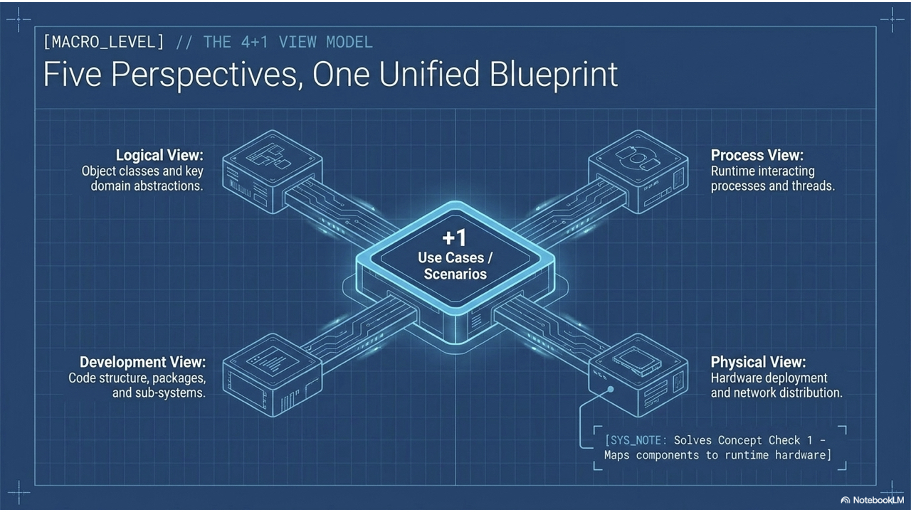
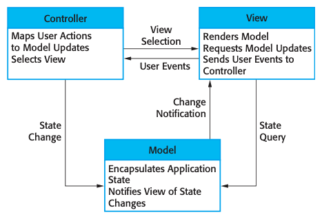
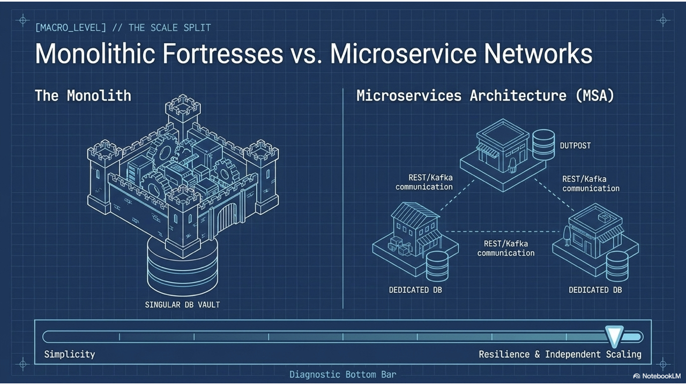
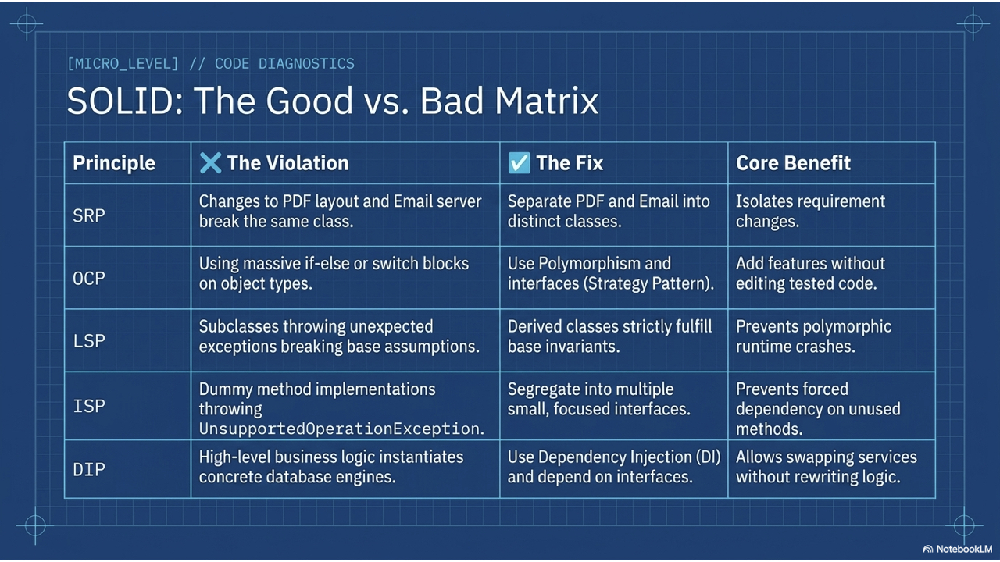
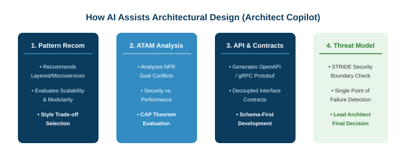

# 軟體工程

### 第五課：軟體架構與物件導向設計原則 (Software Architecture & Design)

**授課教師：薛念林 教授**  
資訊工程學系  
逢甲大學

<!--
各位好，歡迎來到軟體工程第五課：軟體架構與物件導向設計。

在前面的章節中，我們透過需求工程探討了客戶的真實需求，並透過系統塑模勾勒出系統的視覺邊界。今天，我們將回答軟體工程中最具決定性的關鍵課題：我們究竟該如何組織與建構系統，才能讓它在歷經數年甚至數十年的演進中，依然保持穩健、可擴展且易於維護？

軟體架構與設計是連結抽象需求與具體實作的關鍵橋樑。在今天的課堂中，我們將探討 Kruchten 的 4+1 視圖模型、剖析從 MVC 到微服務的經典架構模式、掌握「高凝聚、低耦合」的永恆黃金律、透徹理解 SOLID 物件導向設計五大原則，並看看現代 AI 副駕駛如何協助架構師進行權衡分析與重構。

總結這張投影片，請記住這個核心觀念：架構與設計奠定了系統的根本組織骨幹，決定了軟體能否禁得起長期的擴展、演進與考驗。
-->
---
## 第五章：課程藍圖與核心主題

* **5.1 軟體架構基礎** (從需求到設計的關鍵橋樑、微觀與巨觀架構層次)
* **5.2 Kruchten 的 4+1 架構視圖** (邏輯、程序、開發、實體視圖與核心使用案例場景)
* **5.3 經典軟體架構模式** (分層架構、儲存庫、客戶端-伺服器、管線與過濾器、MVC、微服務架構)
* **5.4 架構與系統非功能品質屬性** (效能、安全性、可靠度與可用性之架構權衡)
* **5.5 軟體設計核心根本原則** (四大設計活動、模組化、資訊隱藏、高凝聚度與低耦合度)
* **5.6 SOLID 物件導向設計原則** (SRP 單一職責、OCP 開放封閉、LSP 里氏替換、ISP 介面隔離、DIP 相依反轉)
* **5.7 AI 在架構與軟體設計中的賦能** (AI 副駕駛、自動化重構、設計模式推薦與防範架構盲點)
* **5.8 核心概念統整與參考文獻** (重點填空小測驗與經典學術專著)

<!--
這是我們第五章的學習藍圖。

我們從 5.1 節出發，建立軟體架構的核心定義，並釐清微觀架構與巨觀架構的範疇差別。

在 5.2 節，我們學習 Philippe Kruchten 著名的 4+1 視圖模型，理解如何針對不同利害關係人展現全方位的架構視角。

在 5.3 節，我們深入探討經典架構模式：分層架構、儲存庫模式、主從式架構、管線過濾器、MVC，以及現代分散式微服務架構。

在 5.4 節，我們檢視架構如何直接主導效能與安全性等非功能品質屬性。

在 5.5 節，我們聚焦於微觀軟體設計，掌握資訊隱藏與軟工至高法則：高凝聚與低耦合。

在 5.6 節，我們透過具體對比程式碼，徹底掌握物件導向的 SOLID 五大原則。

最後在 5.7 節探討 AI 如何作為架構副駕駛，並在 5.8 節進行觀念統整。

總結這張投影片，請記住這個核心觀念：這份藍圖將引領我們從巨觀的企業級架構，一路深入到微觀的卓越物件導向程式碼設計。
-->
---
## 本章核心思考問題 (Focus Questions)

* 什麼是**軟體架構 (Software Architecture)**？為什麼它是連結需求與詳細設計的關鍵樞紐？
* **微觀架構 (Architecture in the Small)** 與 **巨觀架構 (Architecture in the Large)** 有何本質區別？
* Kruchten 的 **4+1 架構視圖模型**包含哪些視角？如何滿足不同利害關係人的多樣化訴求？
* 經典**架構模式**（分層、儲存庫、主從式、管線過濾器、MVC、微服務）如何組織軟體系統？
* 為什麼**高凝聚度 (High Cohesion) 與低耦合度 (Low Coupling)** 是軟體工程不可動搖的黃金法則？
* 物件導向 **SOLID 五大原則**（SRP、OCP、LSP、ISP、DIP）如何預防架構僵化與腐化？
* **生成式 AI** 能如何有效輔助軟體架構師？人類架構師又該如何守護架構邊界，避免踩入盲點？

<!--
在今天的課堂中，請大家隨時帶著這幾個核心問題來思考：

第一，為什麼軟體架構是軟體專案中最重大、牽一髮動全身的技術決策？

第二，Kruchten 的 4+1 視圖如何弭平商業管理層、核心開發者與維運基礎架構工程師之間的溝通鴻溝？

第三，單體資料庫與分散式微服務之間，本質上的工程權衡是什麼？

第四，為什麼我們在設計類別與模組時，必須堅持不懈地追求高凝聚與低耦合？

最後，SOLID 五大原則如何保護專案程式碼，避免隨時間淪為無法維護的陳年巨石？

總結這張投影片，請記住這個核心觀念：這些核心思考問題構成了我們評估軟體架構與程式設計品質的思考框架。
-->
---
<!-- _class: lead -->
<!-- header: '5.1 軟體架構基礎' -->

# **5.1 軟體架構基礎**

> "Software architecture is the set of design decisions which, if made incorrectly, may cause your project to fail."  
> *(軟體架構是一組關鍵的設計決策，這些決策一旦做錯，將可能直接導致你的專案走向徹底失敗。)*  
> — *Eoin Woods*

<!--
歡迎來到 5.1 節：軟體架構基礎。

軟體架構絕非決定用 for 迴圈還是 while 迴圈這種瑣事。它是系統的高階宏觀藍圖，定義了重大子系統如何切分、跨越程序邊界如何通訊，以及資料如何在整個企業系統中安全流動。

在這一節中，我們將剖析架構的橋樑角色、闡明讓架構顯性化的重大優勢，並清楚界定微觀架構與巨觀架構的範疇。

總結這張投影片，請記住這個核心觀念：軟體架構確立了系統的根本組織結構，規範其核心結構組件與彼此間的互動法則。
-->
---
## 什麼是軟體架構？ (What is Software Architecture?)

> 軟體系統的根本組織方式，體現於系統各組件之中、組件彼此之間與環境的關係，以及引導系統設計與演進的指導原則。

* **關鍵的「橋樑 (Bridge)」角色：**
  - 將**需求工程** (*客戶需要什麼 / What*) 銜接至**詳細軟體設計** (*組件如何建構 / How*)。
  - 識別關鍵結構組件，並嚴格定義彼此之間的公開通訊介面契約。
* **架構即核心設計決策：**
  - 架構代表專案生命週期早期所做的重大決策，這些決策在後續實作階段**變更成本最為高昂**。

<!--
讓我們為軟體架構建立正式定義。

軟體架構是系統的根本組織方式，體現於其組件、相互關係、與環境的互動，以及引導系統設計與演進的原則。

請注意它的橋樑定位：需求工程告訴我們「需要做什麼 (What)」，具體編碼則是「寫出程式碼 (How)」。架構正是座落於兩者之間的基石橋樑——決定了核心模組如何拆解、資料持久化策略，以及網路通訊協定。

由於架構決策在日後最難修改、代價最高，在專案初期建立正確的架構是專案成敗的關鍵。

總結這張投影片，請記住這個核心觀念：軟體架構透過確立高階組件結構與通訊邊界，在需求與具體程式碼之間架起不可或缺的橋樑。
-->
---
<!-- _class: full-image-slide -->

<div class="centered-image">
  
</div>

<!--
請看這張生動的示意圖：「連接需求 (What) 與實作 (How)」。

左側是需求工程：利害關係人訪談、使用者故事與非功能約束條件——定義了「要解決什麼問題 (What)」。

右側是實作編碼：成千上萬行的原始碼、單元測試與資料庫查詢——體現了「系統如何運作 (How)」。

而矗立於中央深谷、將兩者緊密連接的，正是軟體架構！架構將混亂繁複的人類期待，轉化為結構化的子系統、服務介面與部署拓撲。

總結這張投影片，請記住這個核心觀念：架構是將抽象需求轉化為可執行軟體實體的智慧樞紐。
-->
---
## 軟體架構的抽象層次：微觀 vs. 巨觀

* **微觀架構 (Architecture in the Small)：**
  - 關注單一程式、獨立微服務或用戶端應用程式內部的結構設計。
  - 重點在於單一程式如何拆解為子組件、套件（Packages）與物件類別。
  - 直接決定內部程式碼的可讀性、可測試性與日常重構的迭代速度。
* **巨觀架構 (Architecture in the Large)：**
  - 關注跨越多個系統、高度複雜的企業級分散式系統網絡。
  - 系統跨越多台伺服器、多個雲端服務區域（Cloud Regions）與外部廠商 SaaS 平台。
  - 涵蓋大型既有傳統資料庫整合、非同步訊息中介佇列與跨組織 API 整合合約。

<!--
我們在架構抽象層次上做出了關鍵區分：

微觀架構（Architecture in the Small）聚焦於單一應用程式或單一微服務：我們如何將類別組織成套件？控制器如何與資料庫倉儲解耦？

巨觀架構（Architecture in the Large）則放眼整個企業全貌：數十個獨立服務、傳統主機、手機 App 與外部第三方 SaaS 如何在分散式雲端網路中協同運作？

資深軟體工程師必須具備穿梭於兩者之間的能力——既能確保微觀層面的程式碼乾淨無瑕，又能駕馭巨觀層面的分散式整合。

總結這張投影片，請記住這個核心觀念：架構橫跨了微觀層面的套件拆解與巨觀層面的分散式企業生態系統。
-->
---
## 將軟體架構明確顯性化的 3 大優勢

1. **促進利害關係人溝通 (Stakeholder Communication)：**
   - 高階架構圖作為技術團隊、業務主管與外部客戶溝通的共同焦點，無需陷入繁複的程式碼細節即可對焦共識。
2. **早期系統分析與非功能品質驗證 (System Analysis & Verification)：**
   - 能在寫下第一行程式碼之前，提早分析驗證所提議的設計是否能滿足關鍵的**非功能性需求**（例如高並發低延遲、容錯災難復原、合規稽核）。
3. **大規模架構與資產重用 (Large-Scale Reuse)：**
   - 經過驗證的架構風格、微服務底座（Chassis）與組件框架，能有系統地在同一領域的多個產品線中大規模重用。

<!--
為什麼軟體團隊要花時間將架構正式繪製顯性化，而不直接動手寫 code 呢？

三大不可忽視的理由：
第一，溝通對焦：架構圖能讓非技術的主管與客戶一看就懂，讓所有人對系統全貌達成共識。
第二，早期系統分析：在寫程式碼之前，就能透過資料庫瓶頸與網路跳轉分析，預先評估系統能否承受黑色星期五的百萬級流量。
第三，大規模重用：成熟的工程組織能將優質的架構模板與微服務底座跨專案廣泛複用。

總結這張投影片，請記住這個核心觀念：顯性架構促進多方共識、支援早期品質驗證，並推動系統組件的大規模重用。
-->
---
<!-- _class: lead -->
<!-- header: "5.2 Kruchten 的 4+1 視圖" -->

# **5.2 Kruchten 的 4+1 架構視圖模型**

> "If you look at an architecture from only one perspective, you are blind to three-quarters of its reality."  
> *(如果你只從單一視角觀察架構，你將對它四分之三的真實面貌視而不見。)*  
> — *Philippe Kruchten*

<!--
我們現在進入 5.2 節：Philippe Kruchten 的 4+1 架構視圖模型。

不同的利害關係人所關心的系統面向截然不同。商業分析師在乎領域業務概念；軟體開發者在乎套件依賴與函式庫；系統維運人員在乎伺服器硬體與網路負載。

在這一節中，我們將學習 Kruchten 經典的 4+1 視圖模型，探討邏輯、程序、開發與實體視圖如何透過核心使用者情境完美統合成單一整體。

總結這張投影片，請記住這個核心觀念：Kruchten 的 4+1 模型提供多重視角框架，全方位滿足所有軟體利害關係人的專業關注點。
-->
---
## Kruchten 的 4+1 架構視圖模型 (4+1 View Model)

* **1. 邏輯視圖 (Logical View / 領域與物件視角)：**
  - 展現核心領域抽象、物件類別、屬性與彼此間的關聯結構 (*目標受眾：系統分析師、架構師與客戶*)。
* **2. 程序視圖 (Process View / 並發與運行時序視角)：**
  - 展現執行時期程序（Processes）、執行緒（Threads）、並發並行機制與跨程序通訊 (*目標受眾：系統整合者與效能工程師*)。
* **3. 開發視圖 (Development View / 模組與實作視角)：**
  - 展現軟體原始碼模組、套件相依性、建置成品（Artifacts）與專案結構 (*目標受眾：軟體開發工程師*)。
* **4. 實體視圖 (Physical View / 部署與基礎設施視角)：**
  - 展現底層伺服器硬體節點、雲端容器叢集與實體網路拓撲配置 (*目標受眾：DevOps 與系統維運管理員*)。
* **+1 核心情境 (Scenarios / 使用案例串聯)：**
  - 透過走訪真實的使用者情境旅程，貫穿並驗證上述四大視圖的協同一致性。

<!--
細看 Philippe Kruchten 享譽全球的 4+1 視圖模型：

邏輯視圖展現功能領域——類別、實體與領域服務。
程序視圖捕捉動態執行行為——行程、執行緒、競爭狀態與訊息佇列。
開發視圖組織原始碼工程——模組、套件、框架與建置腳本。
實體視圖對應到基礎設施——雲端叢集、Docker 容器、負載平衡器與防火牆。

而正中央的「+1」就是使用案例情境：它們以真實的商業操作把四大視圖緊緊貫穿縫合在一起。

總結這張投影片，請記住這個核心觀念：Kruchten 4+1 模型將邏輯、程序、開發與實體視圖融會貫通，並以使用案例情境為驗證核心。
-->
---
<!-- _class: full-image-slide -->

<div class="centered-image">
  
</div>

<!--
請看這張視覺綜整圖：「五大視角，單一架構藍圖」。

請注意周圍四個方格視圖如何環繞著中央的「+1 使用案例情境」核心圓。

沒有任何單一架構圖能同時討好所有人。與 DBA 開會時，你開啟實體視圖與程序視圖；為新進工程師進行 Onboarding 培訓時，你打開開發視圖與邏輯視圖；而與產品經理確認功能時，你們共同聚焦於中央的使用案例情境。

總結這張投影片，請記住這個核心觀念：多視圖架構為開發者、維運人員與業務團隊提供了量身定制的結構化視角。
-->
---
### 觀念檢核測驗 1 (CCQ 1)
<div class="ccq-columns">
  <div class="ccq-text">

在 Kruchten 的 4+1 架構視圖模型中，哪一個視圖專門用以展示軟體組件在運行時如何分派部署於實體伺服器硬體、雲端容器叢集與網路拓撲之上？

- **A.** 邏輯視圖 (Logical View)
- **B.** 程序視圖 (Process View)
- **C.** 開發視圖 (Development View)
- **D.** 實體 / 部署視圖 (Physical / Deployment View)

  </div>
  <div class="ccq-logo">
    
  </div>
</div>

<!--
讓我們透過觀念測驗 1 來檢核對 4+1 視圖模型的掌握。

題目問：哪一個視圖展現軟體如何分派部署於伺服器、雲端容器與網路拓撲上？

檢驗選項：
選項 A，邏輯視圖，展示領域類別與實體。
選項 B，程序視圖，展示行程執行緒與並發時序。
選項 C，開發視圖，展示原始碼套件與建置架構。

正確答案是 D：實體（或部署）視圖！實體視圖將軟體構件精確映射到實體或虛擬執行環境，呈現伺服器、負載平衡器與網路節點。

總結這張投影片，請記住這個核心觀念：實體視圖（Physical View）專門塑模軟體組件在硬體與雲端基礎設施上的部署拓撲。
-->
---
<!-- _class: lead -->
<!-- header: '5.3 經典架構模式' -->

# **5.3 經典軟體架構模式**

> "Good architects borrow; great architects reuse proven architectural patterns."  
> *(優秀的架構師懂得借鑒；卓越的架構師則善於重用經過實戰驗證的經典架構模式。)*

<!--
現在我們邁入 5.3 節：經典軟體架構模式。

架構師很少需要從零發明一套前所未有的系統結構。在軟體工程數十年的演進歷史中，面對反覆出現的結構性挑戰，淬煉出了一系列行之有效、可重複應用的結構樣板，這就是「架構模式（Architectural Patterns）」。

在這一節中，我們將深入剖析六大經典模式：MVC、分層架構、儲存庫、主從式架構、管線過濾器，以及現代微服務架構。

總結這張投影片，請記住這個核心觀念：架構模式為解決軟體組織的常見結構挑戰，提供了經過嚴謹驗證的標準化藍圖模板。
-->
---
## 什麼是軟體架構模式？ (Architectural Patterns)

> 對良好設計實踐的一種風格化、經過實證檢驗的描述，已在多種不同環境中獲得成功驗證，適用於常見的架構設計情境。

* **架構模式的構成要素：**
  - **模式名稱 (Name)：** 具備明確意義的專用術語（如 *MVC*、*分層架構*、*儲存庫模式*）。
  - **背景與問題 (Context & Problem)：** 該模式旨在解決的通用結構性挑戰。
  - **解決方案 (Solution)：** 核心組件的職責劃分及其間的通訊互動關係。
  - **工程權衡 (Trade-offs)：** 清晰闡明該模式帶來的架構優勢與伴隨的代價代償。
* **為什麼架構模式如此重要？**
  - 為跨職能工程團隊建立共同且精確的高階溝通語彙。
  - 避免團隊閉門造車，重複發明具備已知缺陷的錯誤結構。

<!--
什麼是架構模式？

架構模式是在無數真實專案的成功與失敗中淬煉出來的結構經驗智慧結晶。

請注意：模式不是具體的程式碼，而是結構模板。當架構師宣佈「我們將採用分層架構搭配 Repository 模式」時，團隊裡的每位工程師能瞬間心領神會核心模組的切割方向與通訊路徑。

模式提供了工程團隊共通的語言，並明確預告了架構權衡。

總結這張投影片，請記住這個核心觀念：架構模式封裝了經過驗證的結構智慧，建立了共通的溝通詞彙與可預期的架構權衡。
-->
---
## 1. 模型-視圖-控制器 (MVC) 模式

* **核心職責分離：**
  - **模型 (Model)：** 管理核心商業領域邏輯、資料狀態與持久化驗證規則。
  - **視圖 (View)：** 負責使用者介面渲染，將資料視覺化呈現給人類使用者。
  - **控制器 (Controller)：** 攔截使用者輸入事件（點擊、HTTP 請求），呼叫模型更新，並決定呈現的視圖。
* **核心工程優勢：**
  - **資料與展示徹底解耦：** 多個不同視圖（Web 儀表板、手機原生 App、純 JSON API）可同時觀察同一個底層 Model，無須重複撰寫任何商業邏輯。

<div style="text-align: center; margin-top: 10px;">
  
</div>

<!--
模型-視圖-控制器（MVC）模式是互動式 GUI 軟體與現代 Web 開發的基石。

請看職責劃分：
Model 掌管核心資料與商業規則，它完全不知道什麼是 HTML 或按鈕。
View 專注於渲染介面。
Controller 接收使用者的點擊或 HTTP 請求，協調 Model 進行資料更新。

MVC 最驚豔的價值在於解耦：你可以為同一套 Model 打造網頁版介面、手機 App 與後台管理系統，而核心商業運算邏輯完全不必重複編寫！

總結這張投影片，請記住這個核心觀念：MVC 模式將核心業務資料與使用者介面呈現及輸入事件處理徹底分離。
-->
---
## 2. 分層架構模式 (Layered Architecture)

* **堆疊式抽象層設計：**
  - 將系統功能組織為垂直有序的層級。每一層僅為其**正上方**的相鄰層級提供服務，且僅依賴其**正下方**的底層服務。
* **現代企業級標準四層架構：**
  - **展示層 (Presentation Layer)：** 使用者介面、REST API 端點、視圖控制器。
  - **應用 / 服務層 (Service Layer)：** 業務工作流程編排、跨領域交易事務邊界。
  - **領域 / 業務層 (Domain Layer)：** 純粹的領域商業規則、實體與領域演算法。
  - **基礎設施 / 資料層 (Infrastructure Layer)：** 資料庫讀寫存取、外部第三方服務整合。
* **關鍵架構價值：**
  - **隔離變更與高可替換性：** 只要介面合約維持不變，更換底層實作（例如將 Oracle 換成 PostgreSQL）完全不會波及上層商業領域邏輯。

<!--
分層架構（Layered Architecture）是企業級軟體最經典的組織典範。

這就如同作業系統的運作方式：應用程式不會直接去控制硬碟磁頭，而是呼叫檔案系統層，檔案系統再呼叫硬體驅動程式層。

在企業應用中，展示層呼叫服務層，服務層調用純領域層，領域層透過基礎設施層存取資料庫。

這種嚴格向下的相依性隔離了變更風險：未來若要將 MySQL 改為 DynamoDB，只需重寫 Infrastructure 層，核心業務規則毫髮無傷。

總結這張投影片，請記住這個核心觀念：分層架構透過堆疊抽象層的單向依賴，有效隔離了底層技術變更的風險。
-->
---
## 3. 儲存庫架構模式 (Repository Architecture)

* **集中式資料共享機制：**
  - 各個獨立子系統透過一個共用的中央儲存庫（Repository / Data Store）交換大規模、高關聯的複雜資料。
  - 各子系統獨立運作，彼此不直接溝通；一切互動均嚴格透過對中央儲存庫的狀態讀寫來達成。
* **業界經典應用場景：**
  - 現代整合開發環境 (IDE，如 VS Code 語法伺服器、Eclipse 工作區 AST 儲存庫)。
  - 電腦輔助設計 (CAD) 大型工程繪圖套件。
  - 醫院電子病歷 (EHR) 中央病患核心資料庫。
* **架構優劣權衡：**
  - *優勢：* 高效共享海量、高維度的互聯資料集，避免在處理程序間頻繁傳輸大量資料。
  - *劣勢：* 中央儲存庫極易淪為系統的**單點故障 (Single Point of Failure, SPOF)** 與效能瓶頸。

<!--
在儲存庫架構中，多個獨立的子系統完全圍繞著同一個中央共享資料庫來運作。

以 VS Code 為例：語法高亮引擎、編譯器、語法檢查器（Linter）與除錯器都是獨立工具，但它們共享記憶體中同一份程式碼抽象語法樹（AST）儲存庫。

優點是資料共享極為高效，不必在行程間搬移數十億位元組。
代價則是單點風險：一旦中央儲存庫崩潰或鎖定，所有相依的子系統將瞬間全部停擺。

總結這張投影片，請記住這個核心觀念：儲存庫架構以中央資料庫為協同核心，以承擔單點風險為代價換取資料共享的高效率。
-->
---
## 4. 主從式架構與管線過濾器模式

* **客戶端-伺服器架構 (Client-Server Architecture)：**
  - 系統功能分派由提供專屬服務（運算、資料儲存、身分認證）的**伺服器端 (Server)**，與透過網路發出請求的**客戶端 (Client)** 共同組成。
  - *權衡：* 易於在通用硬體上水平擴展，但本質上受制於網路延遲與連線飽和度瓶頸。
* **管線與過濾器架構 (Pipe-and-Filter Architecture)：**
  - 資料處理被組織為一系列獨立的轉換步驟（**Filters / 過濾器**），彼此透過資料串流（**Pipes / 管線**）相互串接。
  - 第 $N$ 個過濾器的輸出，直接作為第 $N+1$ 個過濾器的輸入串流。
  - *經典範例：* Unix 終端機管線指令 (`cat log.txt | grep 'ERROR' | sort | uniq -c`)。
  - *最佳適用情境：* 批次帳單結算、大數據分析管線、編譯器語法解析。

<!--
這裡對比兩種經典模式：

主從式架構（Client-Server）透過網路分工：客戶端發送請求，伺服器處理並回傳。它是萬維網（World Wide Web）的運轉骨幹。

管線過濾器（Pipe-and-Filter）則將運算切分為由資料串流串聯的獨立轉換步驟。這項模式最優雅之處在於「高度可組合性」：你可以任意抽換、新增或調整過濾器，就像在 Unix 終端機用直線符號管線組合指令一樣輕鬆自如。

總結這張投影片，請記住這個核心觀念：主從式架構實現分散式網路運算；管線過濾器則將連續串流處理拆解為高度可重組的轉換階段。
-->
---
## 5. 微服務架構 (Microservices, MSA) vs. 單體架構

* **單體架構 (Monolithic Architecture)：**
  - 所有的系統功能、業務邏輯與資料庫存取，皆打包並部署為單一、不可分割的可執行二進位檔。
  - *優點：* 初期開發極速、除錯直觀、零跨網路序列化額外開銷。
  - *痛點：* 擴展時必須複製整個應用；單一模組 Memory Leak 或崩潰將拖垮全系統。
* **微服務架構 (Microservices Architecture)：**
  - 圍繞著**業務領域能力 (Business Capabilities)**，將系統拆解為一套由微小、可獨立部署的服務所組成的叢集。
  - 每個微服務擁有**自己完全獨立的私有資料庫**（去中心化資料管理）。
  - 服務間透過輕量級 REST/gRPC 或非同步訊息中介（Kafka / RabbitMQ）進行通訊。

<!--
當代最受熱烈討論的架構課題莫過於單體與微服務之爭。

在單體（Monolith）中，使用者認證、結帳、庫存、發票全部跑在同一個程序裡。前期開發極度輕鬆，但當團隊擴展到數百人時，程式碼衝突與部署排程會成為噩夢般的瓶頸。

在微服務中，每個業務領域拆成獨立服務，各自擁有私有資料庫。訂單服務不能直接下 SQL 去改使用者資料庫，必須透過 API 溝通。

這帶來了團隊自主擴展與技術多元選擇，但同時引入了極為複雜的分散式系統維運挑戰。

總結這張投影片，請記住這個核心觀念：單體架構在早期最大化了簡潔度，而微服務架構則以分散式網路維運複雜度為代價，實現了大規模團隊的獨立擴展。
-->
---
<!-- _class: full-image-slide -->

<div class="centered-image">
  
</div>

<!--
請看這張生動的對比圖：「單體大樓 vs. 微服務社區」。

左邊是單體大樓：一棟巨大、緊密相連的摩天大廈，共用同一個地下地基資料庫。只要十樓發生水管破裂，整棟大樓的運作都會受到嚴重威脅。

右邊是微服務社區：一座座獨立、模組化的小屋，各擁有獨立的水電瓦斯。一間屋子停電，整個社區依然運作自如。

然而請仔細看：連接各棟小屋的馬路與管線——那正是分散式網路延遲、網路斷線重試與分散式跨庫交易複雜度的所在！

總結這張投影片，請記住這個核心觀念：微服務隔離了故障影響範圍與團隊工作流，但也引入了分散式網路通訊的維運代價。
-->
---
### 觀念檢核測驗 2 (CCQ 2)
<div class="ccq-columns">
  <div class="ccq-text">

哪一個經典架構模式明確將使用者介面呈現與畫面佈局，從底層商業領域資料管理與使用者輸入事件處理中徹底解耦分離？

- **A.** 管線與過濾器模式 (Pipe and Filter Pattern)
- **B.** 模型-視圖-控制器模式 (Model-View-Controller, MVC)
- **C.** 儲存庫模式 (Repository Pattern)
- **D.** 主從式架構模式 (Client-Server Pattern)

  </div>
  <div class="ccq-logo">
    
  </div>
</div>

<!--
讓我們透過觀念測驗 2 檢驗對架構模式的理解。

檢驗選項：
選項 A，管線過濾器，處理連續資料串流轉換。
選項 C，儲存庫模式，透過中央資料庫共享資料。
選項 D，主從式架構，跨網路分配運算與請求。

正確答案是 B：模型-視圖-控制器模式（MVC）！Model 管理領域資料，View 渲染畫面，Controller 處理使用者輸入。

總結這張投影片，請記住這個核心觀念：MVC 模式將畫面呈現（View）、領域資料模型（Model）與輸入控制（Controller）清晰解耦。
-->
---
<!-- _class: lead -->
<!-- header: '5.4 架構與品質屬性' -->

# **5.4 架構與系統品質屬性**

> "Architecture is where requirements meet reality through trade-off analysis."  
> *(架構，是軟體需求透過權衡分析與工程現實交會的所在。)*

<!--
我們現在進入 5.4 節：架構與系統品質屬性。

回顧第三章的重要觀念：決定系統架構的，往往不是功能性需求，而是非功能性需求。無論你的系統是電商網站還是訂位平台，架構決策完全取決於系統必須承受每秒 10 次請求，還是每秒 10 萬次並發！

在這一節中，我們將剖析架構如何直接決定效能、安全性、可靠度與可用性，並學習架構師如何權衡互相衝突的品質目標。

總結這張投影片，請記住這個核心觀念：軟體架構是透過深思熟慮的結構權衡，滿足系統非功能品質屬性的核心手段。
-->
---
## 軟體架構直接決定非功能品質屬性

* **效能表現 (Performance)：**
  - *架構手段：* 將關鍵核心計算封裝於高凝聚組件中，盡量減少跨行程與跨網路的遠端呼叫；引入多層級分散式快取（如 Redis / Memcached）。
* **資訊安全性 (Security)：**
  - *架構手段：* 採用縱深防禦（Defense-in-Depth）多層安全架構；將高價值資產置於內部受保護核心層；外圍由 API 閘道強制執行身分認證。
* **系統安全性 (Safety，如航空/醫療)：**
  - *架構手段：* 將關乎生命安全的關鍵邏輯嚴格隔離於獨立、具備硬體冗餘備援的子系統，杜絕故障擴散。
* **高可用性 (Availability)：**
  - *架構手段：* 全面消除單點故障（SPOF）；部署叢集冗餘實例、自動化健康檢查心跳與跨區域主動容錯移轉（Active-Active Failover）。
* **可維護性 (Maintainability)：**
  - *架構手段：* 拆解為細粒度、低耦合的模組，組件間一律嚴格透過穩定的抽象介面溝通。

<!--
請看各大非功能品質屬性如何直接對應到特定的架構戰術：

追求極致效能？盡可能減少網路通訊跳轉，在靠近使用者端設置快取層。
追求頂級資安？採用如護城河般的分層防禦，外圍設防火牆閘道，核心資料嚴密隔離。
追求生命安全？在飛機或醫療儀器中，將飛控系統與乘客娛樂系統在實體硬體層徹底切開。
追求 99.999% 高可用性？全面消除單點故障，設置跨機房即時備援容錯移轉。

架構正是交付這些非功能特性的結構引擎。

總結這張投影片，請記住這個核心觀念：各項系統品質屬性均需透過快取、分層、隔離與冗餘等針對性架構手段來落實。
-->
---
<!-- _class: full-image-slide -->

<div class="centered-image">
  
</div>

<!--
請看這張深刻的視覺總結：「精心設計的結構，驅動系統的行為特性」。

軟體架構從來都不是在尋找一個「毫無瑕疵的完美設計」，而是在精準駕馭不可避免的「工程權衡（Trade-offs）」。

請注意天平兩端的拉扯：
追求極限資安（加入三層加密、Token 簽署驗證與完整稽核日誌），必然會犧牲部分效能（增加請求延遲）。
追求極致可維護性（將系統拆分成 50 個微服務），必然會大幅推高網路與系統維運的複雜度。

大師級軟體架構師的真正功力，就在於能洞察利害關係人的真正痛點，做出最優雅的取捨平衡。

總結這張投影片，請記住這個核心觀念：架構的精髓在於理性權衡互相衝突的系統品質目標，取得最適平衡。
-->
---
<!-- _class: lead -->
<!-- header: '5.5 軟體設計核心原則' -->

# **5.5 軟體設計核心原則**

> "There are two ways of constructing a software design: One way is to make it so simple that there are obviously no deficiencies, and the other way is to make it so complicated that there are no obvious deficiencies."  
> *(建構軟體設計有兩種方式：一種是讓它簡單到明顯看不出任何缺陷；另一種則是讓它複雜到看不出任何明顯的缺陷。)*  
> — *C. A. R. Hoare (圖靈獎得主)*

<!--
我們現在轉進 5.5 節：軟體設計核心原則。

建立了巨觀架構之後，我們必須將鏡頭拉近到微觀設計層次：在一支應用程式內部，我們該如何組織個別的類別、方法與模組？

在這一節中，我們將檢視四大基本設計活動，並深度剖析軟體設計界至高無上的永恆黃金律：高凝聚與低耦合。

總結這張投影片，請記住這個核心觀念：軟體設計將巨觀架構藍圖轉化為高凝聚、低耦合的具體類別與模組介面。
-->
---
## 軟體設計的 4 大基本活動 (4 Design Activities)

1. **架構設計 (Architectural Design / 巨觀結構)：**
   - 識別關鍵子系統、定義服務邊界，以及設計模組間的主要通訊管線。
2. **介面設計 (Interface Design / 契約規範)：**
   - 明確定義各組件之間公開、精確且無歧義的契約介面（REST API 規範、介面方法簽章）。
3. **組件與詳細設計 (Component Design / 微觀實作)：**
   - 深入設計各類別內部的資料結構、核心演算法與私有輔助方法邏輯。
4. **資料庫與資料結構設計 (Data Persistence Design / 持久化)：**
   - 設計關聯式實體關聯圖（ERD）、文件集合（Collections）綱要或記憶體資料結構。

<!--
軟體設計由四項環環相扣的核心活動所組成：

第一，架構設計：切分子系統的高階架構。
第二，介面設計：在動手寫程式碼之前，先定義清楚模組間的溝通合約。
第三，組件詳細設計：充實類別內部的屬性、方法與演算法。
第四，資料庫設計：將領域物件精確對應至持久化資料結構。

這四大活動確保程式碼是在深思熟慮的藍圖下被穩健建構。

總結這張投影片，請記住這個核心觀念：軟體設計有系統地兼顧了系統架構、介面契約、組件內部邏輯與資料持久化。
-->
---
## 經典設計準則：模組化、抽象化與關注點分離

* **1. 抽象化 (Abstraction)：**
  - 將低階繁複的實作細節隱藏在清晰的高階概念介面之後。讓工程師在思考複雜系統時不至於大腦認知超載。
* **2. 封裝與資訊隱藏 (Encapsulation & Information Hiding)：**
  - *David Parnas 原則：* 將狀態資料與專屬操作緊密綁定於模組內部，並將私有變數徹底隱藏。杜絕外部程式碼非法修改內部狀態所帶來的災難性副作用。
* **3. 關注點分離 (Separation of Concerns, SoC)：**
  - 將軟體拆解為互不重疊的獨立功能面向（例如：徹底分離 UI 渲染排版邏輯與資料庫 SQL 查詢）。
* **4. 模組化 (Modularity)：**
  - 將系統劃分為內聚完整、可獨立測試且能隨時替換抽換的獨立單元。

<!--
這四大原則構成了純淨軟體工程的基石：

抽象化讓你在呼叫 `map.insert()` 時，不必煩惱底層是紅黑樹還是雜湊表。
封裝與資訊隱藏以 private 修飾詞建立防護罩，防止外人隨意篡改物件內部狀態。
關注點分離確保前端畫面絕對不去執行 SQL 語法，後端計算絕不去拼裝 HTML。
模組化則讓大型團隊能夠平行分工、各自為政卻又天衣無縫。

總結這張投影片，請記住這個核心觀念：抽象化、封裝、關注點分離與模組化，是保護系統完整性並避免工程師認知過載的四大支柱。
-->
---
## 至高黃金法則：高凝聚度與低耦合度

* **凝聚度 (Cohesion)：**
  - 衡量單一類別或模組內部職責彼此關聯的緊密與專注程度。
  - **軟體工程目標：** **高凝聚度 (High Cohesion)**（一個類別應該只專注做好一件事，並且把它做到極致）。
* **耦合度 (Coupling)：**
  - 衡量不同獨立模組之間直接相互依賴的強烈程度。
  - **軟體工程目標：** **低耦合度 (Low Coupling)**（模組之間透過抽象介面溝通，對彼此內部實作細節一無所知）。
* **不可動搖的通用黃金法則：**
  > **最大化凝聚度，最小化耦合度！ (Maximize Cohesion, Minimize Coupling!)**  
  > 高凝聚讓程式碼極易理解與維護；低耦合讓單一模組的修改絕不會在全系統引發連鎖骨牌效應。

<!--
如果大家整個大學四年的軟體工程課程只能帶走一張投影片，請務必牢牢記住這八個字：最大化凝聚度，最小化耦合度！

凝聚度衡量內部專注度：這個類別是專注做好一件事，還是包山包海既管資料庫、又算折扣、還順便發 Email？我們要追求「高凝聚」。

耦合度衡量外部依賴性：類別 A 是否直接摸到類別 B 的私有欄位？改了 A 是不是全專案有十個檔案跟著噴錯？我們要追求「低耦合」。

高凝聚搭配低耦合，是軟體能經歷數十年演進依然維持可測試、可維護的根本秘訣。

總結這張投影片，請記住這個核心觀念：高凝聚確保內部職責專注清晰，低耦合消除模組間的連鎖依賴風險。
-->
---
## 凝聚度與耦合度：不良設計 vs. 優良設計對比

```java
// ❌ BAD: 低凝聚度、高耦合度的反面教材（萬能上帝類別 "God Class"）
class OrderManager {
    public void processOrder() {
        // 直接編寫並執行 MySQL 原生 SQL 字串語法
        // 混雜複雜的 VIP 會員折扣商業數學計算
        // 拼接組裝訂單發票的純 HTML 字串
        // 建立低階 TCP/SMTP Socket 網路連線發送電子郵件
    }
}
```

```java
// ✅ GOOD: 高凝聚度、低耦合度的優良設計（解耦的單一職責協同類別）
class OrderProcessor {
    private final DiscountCalculator discountCalculator;
    private final OrderRepository orderRepository;
    private final NotificationService notificationService;

    public OrderProcessor(DiscountCalculator dc, OrderRepository repo, NotificationService ns) {
        this.discountCalculator = dc;
        this.orderRepository = repo;
        this.notificationService = ns;
    }
    // 嚴格透過乾淨的抽象介面編排協調整體下單工作流程！
}
```

<!--
請看這段具體的 Java 程式碼對比：

上方的不良設計中，`OrderManager` 是一個典型的「上帝類別 (God Class)」：一個方法裡混雜了原生 SQL、商業數學、HTML 拼接和底層網路 Socket！一旦郵件伺服器改通訊協定，你居然得去修改下單核心類別，極易引發災難性 Regression 臭蟲！

反觀下方的優良設計：`OrderProcessor` 具備單一且高凝聚的職責——協調整個結帳流程。它把計算委派給 `DiscountCalculator`，儲存交給 `OrderRepository`，通知交給 `NotificationService`。每個類別都能完全獨立進行單元測試與置換。

總結這張投影片，請記住這個核心觀念：將繁雜流程解耦為各司其職的協同類別，能完美體現高凝聚與低耦合。
-->
---
### 觀念檢核測驗 3 (CCQ 3)
<div class="ccq-columns">
  <div class="ccq-text">

在軟體系統設計中，將**高凝聚度 (High Cohesion)** 與 **低耦合度 (Low Coupling)** 兩大工程原則結合應用，所帶來最核心的實務效益為何？

- **A.** 透過將所有函式內聯整合至單一二進位檔案，最大化 CPU 執行時的運算效能。
- **B.** 打造出高度模組化的程式碼架構，使得單一類別的規格修改對其他模組產生極小連鎖影響。
- **C.** 強制規範系統內部所有的核心資料結構，必須全部集中儲存於全域共享變數空間中。
- **D.** 徹底消除生產環境持續交付流程中，編寫自動化整合測試與回歸測試的必要性。

  </div>
  <div class="ccq-logo">
    
  </div>
</div>

<!--
讓我們透過觀念測驗 3 檢驗對凝聚度與耦合度的理解。

檢驗選項：
選項 A 混淆了編譯器底層最佳化與高階架構設計。
選項 C 所描述的「全域共享變數」正是引發災難性極限耦合的萬惡之源！
選項 D 宣稱能消除自動化測試，這完全違背軟體工程常理。

正確答案是 B！高凝聚讓每個類別專注單一職責，低耦合最小化了模組間的牽扯。當需求變更時，工程師能安心修改特定類別，不必擔心引發全系統的連鎖崩潰。

總結這張投影片，請記住這個核心觀念：高凝聚與低耦合在需求持續演進時，能有效防止連鎖骨牌效應式的軟體缺陷。
-->
---
<!-- _class: lead -->
<!-- header: '5.6 SOLID 原則' -->

# **5.6 SOLID 物件導向設計原則**

> "Clean code always looks like it was written by someone who cares."  
> *(乾淨的程式碼讀起來，永遠就像是由深具責任心與熱忱的人所撰寫。)*  
> — *Robert C. Martin (Uncle Bob)*

<!--
我們現在邁入 5.6 節：SOLID 物件導向設計五大原則。

由軟體大師 Robert C. Martin（Uncle Bob）所總結的 SOLID 縮寫，涵蓋了五大經典的物件導向設計法則。這五大原則是指引工程師建構高可讀、可擴展且具備彈性架構的最高行動方針。

在這一節中，我們將透過對比程式碼，逐字拆解這五大字母：單一職責（SRP）、開放封閉（OCP）、里氏替換（LSP）、介面隔離（ISP）與相依反轉（DIP）。

總結這張投影片，請記住這個核心觀念：SOLID 原則提供了具體可操作的設計啟發式規則，防止軟體程式碼庫退化為僵化脆弱的陳年遺留系統。
-->
---
## 概覽：SOLID 五大設計原則

* **S &ndash; 單一職責原則 (Single Responsibility Principle, SRP)：**
  - 一個類別應該有且僅有一個引起它改變的原因。
* **O &ndash; 開放封閉原則 (Open / Closed Principle, OCP)：**
  - 軟體實體應對擴充開放，但對修改封閉。
* **L &ndash; 里氏替換原則 (Liskov Substitution Principle, LSP)：**
  - 子型別必須能夠替換掉其基礎父型別，且不破壞程式的正確性。
* **I &ndash; 介面隔離原則 (Interface Segregation Principle, ISP)：**
  - 用戶端不應被迫依賴其不需要的肥大介面方法。
* **D &ndash; 相依反轉原則 (Dependency Inversion Principle, DIP)：**
  - 高階模組不應依賴低階模組；兩者皆應依賴抽象介面。

<div style="text-align: center; margin-top: 10px;">
  
</div>

<!--
SOLID 縮寫是物件導向設計殿堂中的金科玉律。

SRP 確保每個類別各司其職，焦點高度集中。
OCP 讓我們透過多型擴充新功能，不必修改舊有經過完整測試的程式碼。
LSP 確保繼承體系語意健全，子類別能被安心無痛替換。
ISP 保持介面精巧專一，拒絕肥大臃腫。
DIP 則透過依賴注入，將商業邏輯與底層資料庫或框架徹底解耦。

接下來讓我們逐一深入探討每一個原則。

總結這張投影片，請記住這個核心觀念：SOLID 五大原則形成了相輔相成的完整工程體系，共同守護系統的可擴展性與可維護性。
-->
---
## S &ndash; 單一職責原則 (Single Responsibility Principle, SRP)

* **核心原則：**
  > 一個類別應該有且僅有一個引起它改變的原因。
* **為什麼 SRP 至關重要？**
  - 當一個類別承擔多重職責時（例如資料庫存取 + PDF 報表渲染 + 電子郵件寄送），行銷團隊要求更換 Email 格式的修改，極易在無意間引發資料庫儲存邏輯的致命錯誤！

```java
// ❌ 違反 SRP：擁有 3 個截然不同的改變理由（資料庫存取、PDF 渲染、SMTP 郵件協定）
class UserReportManager {
    public void fetchUserData() { /* 執行資料庫 SQL 查詢 */ }
    public void generatePdfReport() { /* 複雜的 PDF 排版繪圖引擎 */ }
    public void sendEmailReport() { /* SMTP 網路協定傳輸郵件 */ }
}

// ✅ 遵循 SRP：拆解為 3 個職責專一、各司其職的獨立類別
class UserRepository { public User fetchUserData() { ... } }
class PdfReportFormatter { public byte[] generatePdf(User u) { ... } }
class EmailService { public void sendEmail(String to, byte[] data) { ... } }
```

<!--
單一職責原則（SRP）強調：一個類別應該只有一個改變的理由。

看不良範例：`UserReportManager` 竟然有三個改變的理由！如果資料庫綱要改了，你要改這支檔案；如果行銷團隊要改 PDF 上的 Logo，你也要改這支檔案；如果換了 Email 伺服器，你還是要改這支檔案。

優良設計將其拆解為 `UserRepository`、`PdfReportFormatter` 與 `EmailService`。每個類別各司其職，修改報表格式絕不會意外弄壞資料庫邏輯。

總結這張投影片，請記住這個核心觀念：賦予每個類別單一專屬職責，能精準隔離變更衝擊，杜絕跨領域回歸錯誤。
-->
---
## O &ndash; 開放封閉原則 (Open / Closed Principle, OCP)

* **核心原則：**
  > 軟體實體（類別、模組、函式）應當對擴充開放，但對修改封閉。
* **關鍵工程實踐機制：**
  - 善用**介面與多型 (Polymorphism)**（例如策略模式 Strategy Pattern），徹底取代脆弱、層層巢狀且頻繁修改的 `if-else` 或 `switch` 型別檢查判斷。

```java
// ❌ 違反 OCP：每當行銷部門推出全新折扣活動，就必須被迫修改既有已測試的程式碼！
class DiscountCalculator {
    public double calculate(String tier, double price) {
        if (tier.equals("VIP")) return price * 0.8;
        else if (tier.equals("STUDENT")) return price * 0.9;
        return price; // 每次新增促銷活動，都必須冒險修改這個核心方法！
    }
}

// ✅ 遵循 OCP：透過新增實作介面的全新類別來完成擴充，零修改既有程式碼！
interface DiscountStrategy { double apply(double price); }
class VipDiscount implements DiscountStrategy { public double apply(double p) { return p * 0.8; } }
class StudentDiscount implements DiscountStrategy { public double apply(double p) { return p * 0.9; } }
// 未來若要新增 "雙十一折扣 (BlackFridayDiscount)"，既有程式碼完全無須改動任何一行！
```

<!--
開放封閉原則（OCP）指出：面對新需求，系統應透過「新增程式碼」來擴充，而非「修改舊程式碼」。

看壞範例：每次行銷提出新的折扣方案，工程師就得去改 `DiscountCalculator`，多加一段 `else if`。久而久之，這支核心方法變成 500 行的怪獸，誰動誰心驚。

好設計則是定義出 `DiscountStrategy` 介面。雙十一到了？寫一個新的 `DoubleElevenDiscount` 類別注入進去即可，原本跑了一萬次測試的舊程式碼連動都不用動！

總結這張投影片，請記住這個核心觀念：善用多型抽象機制，能在完全不修改既有已測試程式碼的前提下擴充全新功能。
-->
---
## L &ndash; 里氏替換原則 (Liskov Substitution Principle, LSP)

* **核心原則：**
  > 子型別必須能夠在程式中無縫替換掉其父型別，且不影響任何既有程式執行的正確性。
* **經典反面教材：正方形繼承長方形 (Square extends Rectangle)：**
  - 在幾何學上，正方形是長方形的一種。但在物件導向程式碼中，修改正方形的寬度必須連帶強制改變高度，徹底打破了長方形呼叫端既有的不變量假設！

```java
// ❌ 違反 LSP：Square 破壞了調用端對 Rectangle 不變量行為的合理期待！
class Rectangle {
    protected int width, height;
    public void setWidth(int w) { this.width = w; }
    public void setHeight(int h) { this.height = h; }
    public int getArea() { return width * height; }
}
class Square extends Rectangle {
    @Override public void setWidth(int w) { this.width = w; this.height = w; }
    @Override public void setHeight(int h) { this.width = h; this.height = h; }
}
// 呼叫端執行：rect.setWidth(5); rect.setHeight(4); 期待面積為 20，若傳入 Square 卻得到 16！

// ✅ 遵循 LSP：抽離為平行的獨立抽象形狀介面
interface Shape { int getArea(); }
class Rectangle implements Shape { ... }
class Square implements Shape { ... }
```

<!--
由圖靈獎得主 Barbara Liskov 所提出的里氏替換原則（LSP），規範子類別必須信守父類別的行為契約。

經典陷阱就是「正方形繼承長方形」。在數學上沒錯，但在程式碼中，如果一個函式接收 Rectangle，它預期將寬設為 5、高設為 4 時面積會是 20。結果傳入 Square 卻把寬高一起連動變成 16，程式當場產生隱形邏輯錯誤！

若子類別拋出了非預期的 Exception，或是破壞了父類別的假設，就嚴重違反了 LSP。

總結這張投影片，請記住這個核心觀念：子類別必須嚴格遵守父類別抽象契約所建立的行為不變量與正確性期待。
-->
---
## I &ndash; 介面隔離原則 (Interface Segregation Principle, ISP)

* **核心原則：**
  > 用戶端不應該被迫依賴它所不需要使用的介面方法。
* **「肥大介面 (Fat Interface)」所帶來的危害：**
  - 避免設計包山包海、動輒包含數十個方法的龐大介面。應積極拆解為小巧、專精且針對特定角色的專用介面。

```java
// ❌ 違反 ISP：「肥大介面」迫使陽春印表機必須去實作它根本不具備的掃描與傳真功能！
interface MultiFunctionDevice {
    void print();
    void scan();
    void fax();
}
class SimplePrinter implements MultiFunctionDevice {
    public void print() { /* 正常列印 */ }
    public void scan() { throw new UnsupportedOperationException(); } // 經典反模式！
    public void fax() { throw new UnsupportedOperationException(); }
}

// ✅ 遵循 ISP：依功能角色精細隔離的專用介面
interface Printer { void print(); }
interface Scanner { void scan(); }
interface Fax { void fax(); }

class SimplePrinter implements Printer { public void print() { ... } }
class AllInOneMachine implements Printer, Scanner, Fax { ... }
```

<!--
介面隔離原則（ISP）警告我們切勿打造「肥大臃腫介面（Fat Interface）」。

看不良範例：`MultiFunctionDevice` 介面把列印、掃描、傳真全部打包在一起。一台只要 1000 元的普通 USB 印表機如果實作了這個介面，就必須在掃描和傳真方法裡痛苦地拋出 `UnsupportedOperationException`。

優良設計將其拆解為 `Printer`、`Scanner` 與 `Fax` 三個專用介面。多功能事務機同時實作三者，而普通印表機只需實作 `Printer`。

總結這張投影片，請記住這個核心觀念：將臃腫介面細分為角色導向的專用契約，確保用戶端只依賴自己真正需要的方法。
-->
---
## D &ndash; 相依反轉原則 (Dependency Inversion Principle, DIP)

* **核心原則：**
  > 高階模組不應依賴低階模組，兩者皆應依賴抽象介面；抽象不應依賴細節，細節應依賴抽象。
* **關鍵工程實踐：相依性注入 (Dependency Injection, DI)：**
  - 高階商業邏輯服務**絕不可以在內部直接以 `new MySQLDatabase()` 寫死具體資料庫**！應該透過建構子注入抽象的 `Database` 介面。

```java
// ❌ 違反 DIP：高階商業邏輯直接硬編碼寫死綁定具體的 MySQL 實作！無法抽換與測試！
class OrderService {
    private MySQLDatabase db = new MySQLDatabase(); // 緊密耦合！單元測試時無法替換！
    public void completeOrder(Order o) { db.insert(o); }
}

// ✅ 遵循 DIP：高低階雙方均依賴抽象介面；透過建構子落實相依性注入 (DI)
interface Database { void insert(Order o); }

class OrderService {
    private final Database db; // 嚴格只依賴抽象介面！
    public OrderService(Database db) { this.db = db; } // 相依性注入
}
// 正式環境注入 MySQLDatabase；單元測試時注入記憶體內的 MockDatabase！
```

<!--
相依反轉原則（DIP）是現代 Spring、NestJS 等主流架構的靈魂核心。

看壞範例：`OrderService` 內部直接用 `new` 實例化了 `MySQLDatabase`。這等於將核心下單邏輯與 MySQL 牢牢焊死在一起！要換成 PostgreSQL 必須大改商業邏輯程式碼，而且做單元測試時一定要架設真實 MySQL 才能跑。

好設計則是讓 `OrderService` 只依賴抽象的 `Database` 介面，並由外部建構子注入。正式上線注入 MySQL，跑單元測試時注入極速的記憶體 Fake 物件！

總結這張投影片，請記住這個核心觀念：反轉相依方向，讓高階商業邏輯依賴於抽象介面，而非底層具體實作細節。
-->
---
<!-- _class: full-image-slide -->

<div class="centered-image">
  
</div>

<!--
請看這張全景綜整圖表：「SOLID 原則優劣對照矩陣」。

請大家退後一步，綜觀這五大原則如何相互協同：
SRP 讓類別專注單一職責。
OCP 讓類別在無修改下擁抱擴充。
LSP 確保子類別替換的安全性。
ISP 杜絕肥大介面的污染。
DIP 徹底解除商業邏輯對底層技術框架的束縛。

這五大原則共同構成了一套完整的防腐化機制，將脆弱的程式碼轉化為強韌的企業軟體資產。

總結這張投影片，請記住這個核心觀念：SOLID 原則提供了完整的設計體系，打造高度可擴充、可測試與穩健的物件導向軟體架構。
-->
---
### 觀念檢核測驗 4 (CCQ 4)
<div class="ccq-columns">
  <div class="ccq-text">

哪一個 SOLID 物件導向設計原則明確主張：當需要為系統引入新功能時，應當透過「新增新的類別」來擴充，而非直接修改既有已通過測試的原始碼？

- **A.** 單一職責原則 (Single Responsibility Principle, SRP)
- **B.** 開放封閉原則 (Open / Closed Principle, OCP)
- **C.** 介面隔離原則 (Interface Segregation Principle, ISP)
- **D.** 里氏替換原則 (Liskov Substitution Principle, LSP)

  </div>
  <div class="ccq-logo">
    
  </div>
</div>

<!--
讓我們透過觀念測驗 4 來檢驗對 SOLID 原則的精準掌握。

題目問：哪一個原則主張應透過「新增類別」來擴充新功能，而非修改既有已測試的程式碼？

審視選項：
選項 A，SRP，規範每個類別只有一個改變的原因。
選項 C，ISP，規範避免肥大介面。
選項 D，LSP，規範子類別對父類別的替換性。

正確答案是 B：開放封閉原則（Open/Closed Principle, OCP）！軟體實體應當對擴充開放（透過多型與介面），但對修改封閉。

總結這張投影片，請記住這個核心觀念：開放封閉原則透過多型機制，使新功能得以無縫擴充，同時保持既有原始碼的封閉穩定。
-->
---
<!-- _class: lead -->
<!-- header: '5.7 AI 在架構中的應用' -->

# **5.7 AI 在架構與軟體設計中的賦能與盲點**

> "AI can recommend design patterns and refactor code smells, but human architects must steer the system's destiny."  
> *(AI 能夠推薦設計模式並重構不良程式碼氣味，但唯有身為人類的架構師，才能真正掌舵系統的終極命運。)*

<!--
現在我們前進到 5.7 節：AI 在軟體架構與系統設計中的賦能與盲點。

近年來，大型語言模型（LLM）的實力已遠遠超越編寫單行程式碼。它們現在能勝任架構分析副駕駛的角色，具備評估跨方案權衡、偵測不良程式碼氣味（Code Smells），以及提議 SOLID 重構方案的強大能力。

在這一節中，我們將探討 AI 在架構設計上的核心落地應用，並建立不可或缺的人機協同防護，防範架構盲點。

總結這張投影片，請記住這個核心觀念：AI 是強大的架構副駕駛，但人類架構師必須對系統全局結構與最終權衡負起終極責任。
-->
---
## AI 在架構與設計中的角色：副駕駛典範 (The Copilot Paradigm)

* **分析型架構副駕駛的跨越：**
  - LLM 能深入解析複雜系統規格，針對特定場景推薦適配的架構模式（如微服務 vs. 事件驅動架構）。
  - 能在數秒內極速產出系統間通訊的介面契約（OpenAPI / Swagger 規格書、gRPC `.proto` 檔案與資料庫 DDL）。

<div style="text-align: center; margin-top: 15px;">
  
</div>

* **核心架構價值：** 大幅加速跨方案權衡分析（Trade-off Analysis），並自動化生成子系統間純淨無瑕的標準化介面契約樣板。

<!--
生成式 AI 正在深刻重塑軟體架構師的日常工作模式。

當評估一套全新系統時，架構師可以將非功能性約束條件餵給 LLM——例如：「十萬台 IoT 設備並發上線、要求毫秒級寫入」，AI 可以在十秒鐘內產生詳細的 ATAM 權衡矩陣，客觀分析 Kafka 與 RabbitMQ 在該情境下的優缺點。

此外，AI 能全自動生成符合規範的 OpenAPI 規格書與 gRPC Protobuf 檔案，省下數小時的介面溝通對接時間。

總結這張投影片，請記住這個核心觀念：AI 大幅加速了架構權衡分析的推演，並自動化生成分散式系統間的標準通訊介面契約。
-->
---
## AI 在軟體設計中的 4 大核心落地應用

* **1. 自動化 SOLID 重構建議 (Automated SOLID Refactoring)：**
  - 掃描分析老舊巨石程式庫，精準揪出違反 SRP 的萬能上帝類別，並主動提議套用策略模式或工廠模式以落實 OCP。
* **2. 程式碼不良氣味與耦合度偵測 (Code Smell & Coupling Detection)：**
  - 跨模組靜態偵測高度依賴、循環參照（Circular Dependencies）、重複程式碼與「散彈式修改 (Shotgun Surgery)」熱點。
* **3. 經典設計模式精準推薦 (Design Pattern Recommendation)：**
  - 針對反覆發生的架構摩擦阻力，智慧推薦最契合的 GoF 設計模式（如觀察者 Observer、裝飾者 Decorator、轉接器 Adapter、建造者 Builder）。
* **4. TDD 測試導向設計之介面與 Mock 模擬自動生成：**
  - 自動為具體業務邏輯抽離解耦介面，並生成 Mock 測試替身物件，極速推進測試驅動開發流程。

<!--
歸納現代 AI 在微觀軟體設計上的四大經典應用場景：

第一，自動化 SOLID 重構：掃描幾千行的遺留程式碼，建議如何將其拆解為符合單一職責的獨立類別。
第二，不良氣味偵測：在 PR 發起前，自動揪出高耦合、循環相依與複製貼上的壞味道。
第三，GoF 設計模式推薦：在架構卡關時，精準指出該套用哪一種設計模式來解耦。
第四，Mock 生成：自動產出 Mock 介面，讓開發者秒速啟動單元測試。

總結這張投影片，請記住這個核心觀念：AI 透過自動化重構、壞味道偵測、設計模式推薦與測試替身生成，全方位賦能軟體設計。
-->
---
## 人機協同防護：防範 AI 架構盲點 (Architectural Blind Spots)

* **未經驗證而盲目採納 AI 架構建議的潛在風險：**
  - **過早引入分散式複雜度 (Premature Distributed Complexity)：** 針對三個工程師兩週就能以單體架構搞定的單純內部工具，AI 卻動輒推薦微服務、Kubernetes 與 Kafka 叢集。
  - **組織脈絡盲目 (Context Blindness)：** AI 完全不知道你們團隊的真實技術棧深度、雲端預算上限，或是企業特有的資安合規紅線。
  - **表面性無效重構 (Superficial Refactoring)：** 僅僅更換變數命名或套用空洞外殼，未真正解決深層的演算法與架構耦合。
* **軟體架構至高黃金守則：**
  > **「AI 負責提出權衡分析方案；主架構師全權承擔最終決策！」**  
  > *(AI Proposes Trade-offs; Lead Architects Make Decisions!)*  
  > 人類工程師必須深入評估團隊組織脈絡，為系統的長治久安承擔最終責任。

<!--
儘管 AI 工具非常強大，架構師必須時刻提防「架構盲點」。

大型語言模型經常患有「履歷導向架構症候群」——動輒建議上微服務、K8s 容器排程與分散式事件中介。但實際上，AI 根本不知道你們公司今年雲端預算只剩十萬，也不知道團隊裡根本沒有人會修復分散式 Race Condition！

因此請務必銘記我們的黃金守則：AI 負責提出權衡分析，主架構師全權承擔最終決策！

總結這張投影片，請記住這個核心觀念：人類架構師必須結合組織脈絡、預算限制與團隊技能，嚴防 AI 帶來的過度工程化陷阱。
-->
---
<!-- _class: lead -->
<!-- header: '5.8 核心複習與參考文獻' -->

# **5.8 核心複習與參考文獻**

> "Architecture is the decisions that you wish you could get right the first time."  
> *(架構，就是那些你希望自己在第一次做的時候就能做對的關鍵決策。)*

<!--
在第五章的尾聲，我們來到 5.8 節：核心複習與經典文獻。

我們將透過互動填空複習，全面統整今天所學到的所有關鍵架構基石——從 4+1 視圖與經典模式，到高凝聚低耦合與 SOLID 五大設計原則。

最後我們將回顧奠定現代軟體架構學術與實務基礎的經典里程碑著作。

總結這張投影片，請記住這個核心觀念：穩健的架構與純淨的物件導向設計，是決定軟體長青敏捷與商業成功的終極要素。
-->
---
## 核心觀念統整：互動填空小測驗

測試你對本章核心概念的掌握度：

1. **`___`** 架構將系統組織為垂直有序的層級，每一層僅為其正上方的相鄰層級提供服務。
2. 在 **`___`** 模式中，多個獨立的子系統完全圍繞並透過一個共用的中央資料庫進行資訊交換。
3. Kruchten 的 **`___`** 視圖模型結合了邏輯、程序、開發與實體視圖，並以使用案例情境為串聯核心。
4. **`___`** 衡量單一模組內部的專注程度，而 **`___`** 則衡量不同模組之間的依賴緊密程度。
5. **`___`** 原則主張軟體實體應該對擴充開放，但對修改封閉。
6. **`___`** 原則規定高階商業邏輯絕不應直接依賴低階模組，兩者皆應依賴抽象介面。

<!--
讓我們透過快速互動測驗，盤點今天的學習精華！

1. 分層架構（Layered Architecture）將系統切分為垂直堆疊的抽象層！
2. 儲存庫模式（Repository Pattern）圍繞中央資料庫交換資料！
3. Kruchten 著名的 4+1 視圖模型！
4. 凝聚度（Cohesion）衡量內部專注；耦合度（Coupling）衡量外部依賴！
5. 開放封閉原則（OCP）對擴充開放、對修改封閉！
6. 相依反轉原則（DIP）規定依賴於抽象介面而非具體實作！

大家今天的表現極為出色！

總結這張投影片，請記住這個核心觀念：這些核心原則共同構成了職業級軟體架構與系統設計的智識基石。
-->
---
## 經典文獻與延伸閱讀 (References)

* **奠基經典教科書與權威文獻：**
  - Sommerville, I. (2016). *Software Engineering* (10th ed.). Chapter 6 (Architecture) & Chapter 7 (Design). Pearson.
  - Kruchten, P. (1995). "Architectural Blueprints — The '4+1' View Model of Software Architecture." *IEEE Software*, 12(6), 42-50.
  - Gamma, E., Helm, R., Johnson, R., & Vlissides, J. (1994). *Design Patterns: Elements of Reusable Object-Oriented Software*. Addison-Wesley.
  - Martin, R. C. (2017). *Clean Architecture: A Craftsman's Guide to Software Structure and Design*. Prentice Hall.
* **現代分散式系統與微服務架構指引：**
  - Fowler, M. (2014). *Microservices: A definition of this new architectural term*. [martinfowler.com](https://martinfowler.com/articles/microservices.html)
  - Richards, M., & Ford, N. (2020). *Fundamentals of Software Architecture*. O'Reilly Media.

<!--
這裡是第五章的權威學術論文與經典著作。

Philippe Kruchten 於 1995 年發表的 4+1 視圖論文是軟工史上不可磨滅的里程碑。四人幫（GoF）的《設計模式》與 Uncle Bob 的《無瑕的程式碼 (Clean Code)》及《無瑕的架構 (Clean Architecture)》是每位資深工程師案頭必備的經典。

欲進一步探索現代分散式系統，推薦閱讀 Martin Fowler 的微服務指南以及 O'Reilly 的《軟體架構黃金法則》。

謝謝大家在第五章的熱烈參與！
-->

<script>
(function() {
  // =========================================================================
  // 1. Header Dropdown (Table of Contents / Outline)
  // =========================================================================
  function initHeaderDropdown() {
    const sections = [];
    const seenTitles = new Set();
    const slideSections = document.querySelectorAll('section[id]');
    
    // 1. Scan unique section titles and their slide IDs
    slideSections.forEach(sec => {
      const header = sec.querySelector('header');
      if (!header) return;
      
      let title = header.textContent.trim();
      title = title.replace(/^[◄◀]\s*/, '').replace(/\s*[►▶]$/, '').trim();
      if (!title || seenTitles.has(title)) return;
      
      seenTitles.add(title);
      sections.push({
        id: sec.id,
        title: title
      });
    });

    if (sections.length === 0) return;

    // Detect language: if slide titles don't have Chinese characters, use English
    const allTitles = sections.map(s => s.title).join('');
    const isEn = !/[\u4e00-\u9fa5]/.test(allTitles);
    const txtOutline = isEn ? '📑 Table of Contents' : '📑 章節目錄';
    const txtTitleTooltip = isEn ? 'Click to pin or hover to view outline' : '點擊固定或懸停查看章節目錄';
    const txtPrev = isEn ? 'Previous Section' : '上一章節';
    const txtNext = isEn ? 'Next Section' : '下一章節';

    // Helper to create the dropdown DOM
    function createDropdownWrapper(currentTitle) {
      const wrapper = document.createElement('span');
      wrapper.className = 'header-nav-wrapper';
      
      const titleSpan = document.createElement('span');
      titleSpan.className = 'header-nav-title';
      titleSpan.title = txtTitleTooltip;
      titleSpan.innerHTML = currentTitle + '<span class="nav-caret"> ▾</span>';
      
      titleSpan.addEventListener('click', function(e) {
        e.stopPropagation();
        const wasOpen = wrapper.classList.contains('is-open');
        document.querySelectorAll('.header-nav-wrapper.is-open').forEach(w => w.classList.remove('is-open'));
        if (!wasOpen) {
          wrapper.classList.add('is-open');
        }
      });
      
      const dropdown = document.createElement('div');
      dropdown.className = 'nav-dropdown';
      
      dropdown.addEventListener('click', function(e) {
        e.stopPropagation();
      });
      
      const dropHeader = document.createElement('div');
      dropHeader.className = 'nav-dropdown-header';
      dropHeader.innerHTML = '<span>' + txtOutline + '</span>';
      dropdown.appendChild(dropHeader);
      
      const grid = document.createElement('div');
      grid.className = 'nav-dropdown-grid';
      
      sections.forEach(s => {
        const item = document.createElement('a');
        const isActive = (s.title === currentTitle);
        item.className = 'nav-dropdown-item' + (isActive ? ' active' : '');
        item.href = '#' + s.id;
        item.innerHTML = '<span class="badge">#' + s.id.padStart(2, '0') + '</span><span class="item-text" title="' + s.title + '">' + s.title + '</span>';
        
        item.addEventListener('click', function(e) {
          e.preventDefault();
          wrapper.classList.remove('is-open');
          dropdown.style.display = 'none';
          const targetHash = '#' + s.id;
          if (window.location.hash === targetHash) {
            window.dispatchEvent(new HashChangeEvent('hashchange'));
          } else {
            window.location.hash = targetHash;
          }
          setTimeout(() => { dropdown.style.display = ''; }, 350);
        });
        
        grid.appendChild(item);
      });
      
      dropdown.appendChild(grid);
      wrapper.appendChild(titleSpan);
      wrapper.appendChild(dropdown);
      return wrapper;
    }

    // Close any pinned dropdown when clicking anywhere outside
    document.addEventListener('click', function(e) {
      if (!e.target.closest('.header-nav-wrapper')) {
        document.querySelectorAll('.header-nav-wrapper.is-open').forEach(w => w.classList.remove('is-open'));
      }
    });

    // 2. Enhance each header element across all slides
    slideSections.forEach(sec => {
      const header = sec.querySelector('header');
      if (!header || header.dataset.navEnhanced) return;
      header.dataset.navEnhanced = 'true';
      
      const links = header.querySelectorAll('a');
      let prevLink = null;
      let nextLink = null;
      
      links.forEach(a => {
        const txt = a.textContent.trim();
        if (txt === '◄' || txt === '◀') prevLink = a;
        if (txt === '►' || txt === '▶') nextLink = a;
      });
      
      let title = header.textContent.trim();
      title = title.replace(/^[◄◀]\s*/, '').replace(/\s*[►▶]$/, '').trim();
      if (!title) return;
      
      header.innerHTML = '';
      if (prevLink) {
        prevLink.className = 'header-nav-arrow';
        prevLink.title = txtPrev;
        header.appendChild(prevLink);
        header.appendChild(document.createTextNode(' '));
      }
      
      const wrapper = createDropdownWrapper(title);
      header.appendChild(wrapper);
      
      if (nextLink) {
        header.appendChild(document.createTextNode(' '));
        nextLink.className = 'header-nav-arrow';
        nextLink.title = txtNext;
        header.appendChild(nextLink);
      }
    });
  }

  // =========================================================================
  // 2. Number Quick Jump (<kbd>Num</kbd> + <kbd>Enter</kbd>)
  // =========================================================================
  function initNumberQuickJump() {
    let inputBuffer = '';
    let timer = null;
    let hud = null;

    // Detect language: check titles or body text
    const slideSections = document.querySelectorAll('section[id]');
    let hasZh = false;
    slideSections.forEach(s => {
      if (/[\u4e00-\u9fa5]/.test(s.textContent || '')) hasZh = true;
    });
    const isEn = !hasZh;

    function getOrCreateHud() {
      if (!hud) {
        hud = document.createElement('div');
        hud.id = 'slide-quick-jump-hud';
        hud.style.cssText = [
          'position: fixed',
          'bottom: 36px',
          'left: 50%',
          'transform: translateX(-50%)',
          'background: rgba(15, 23, 42, 0.94)',
          'color: #ffffff',
          'padding: 8px 18px',
          'border-radius: 28px',
          'font-family: -apple-system, BlinkMacSystemFont, "Segoe UI", Roboto, system-ui, sans-serif',
          'font-size: 14px',
          'font-weight: 500',
          'box-shadow: 0 16px 36px rgba(0, 0, 0, 0.35), 0 0 0 1px rgba(255, 255, 255, 0.15)',
          'backdrop-filter: blur(16px)',
          '-webkit-backdrop-filter: blur(16px)',
          'z-index: 999999',
          'display: none',
          'align-items: center',
          'gap: 8px',
          'pointer-events: none',
          'opacity: 0',
          'transition: opacity 0.15s ease, transform 0.15s ease'
        ].join(';');
        const targetParent = document.fullscreenElement || document.body;
        targetParent.appendChild(hud);
      }
      const parent = document.fullscreenElement || document.body;
      if (hud.parentElement !== parent) {
        parent.appendChild(hud);
      }
      return hud;
    }

    function getTotalSlides() {
      const secs = document.querySelectorAll('section[id]');
      return secs.length || 1;
    }

    function showHud() {
      const el = getOrCreateHud();
      const total = getTotalSlides();
      const label = isEn ? 'Go to slide:' : '跳至頁碼:';
      const enterHint = isEn ? 'Enter ↵' : 'Enter 確認 ↵';
      el.innerHTML = '<span>🧭 ' + label + '</span> ' +
        '<strong style="color: #38bdf8; font-size: 20px; font-weight: 700; font-family: ui-monospace, SFMono-Regular, Menlo, monospace; letter-spacing: 1px;">' + inputBuffer + '</strong> ' +
        '<span style="opacity: 0.6; font-size: 13px;">/ ' + total + '</span> ' +
        '<span style="background: rgba(255,255,255,0.18); padding: 2px 7px; border-radius: 6px; font-size: 11px; margin-left: 2px; font-weight: 600;">' + enterHint + '</span>';
      el.style.display = 'flex';
      el.style.opacity = '1';

      if (timer) clearTimeout(timer);
      timer = setTimeout(clearInput, 2800);
    }

    function clearInput() {
      inputBuffer = '';
      if (timer) {
        clearTimeout(timer);
        timer = null;
      }
      if (hud) {
        hud.style.opacity = '0';
        setTimeout(() => {
          if (inputBuffer === '' && hud) hud.style.display = 'none';
        }, 150);
      }
    }

    function jumpToSlide(num) {
      const total = getTotalSlides();
      const target = Math.max(1, Math.min(num, total));
      const targetHash = '#' + target;
      
      // Visual flash confirmation
      const el = getOrCreateHud();
      const confirmedMsg = isEn ? ('✓ Slide ' + target) : ('✓ 第 ' + target + ' 頁');
      el.innerHTML = '<span style="color: #34d399; font-weight: 700; font-size: 15px;">' + confirmedMsg + '</span>';
      el.style.display = 'flex';
      el.style.opacity = '1';
      setTimeout(clearInput, 500);

      if (window.location.hash === targetHash) {
        window.dispatchEvent(new HashChangeEvent('hashchange'));
      } else {
        window.location.hash = targetHash;
      }
    }

    window.addEventListener('keydown', function(e) {
      // Don't intercept when focusing editable form elements
      const active = document.activeElement;
      if (active && (active.tagName === 'INPUT' || active.tagName === 'TEXTAREA' || active.tagName === 'SELECT' || active.isContentEditable)) {
        return;
      }

      // Ignore if modifier keys are pressed
      if (e.ctrlKey || e.altKey || e.metaKey) {
        return;
      }

      // Resolve digit from key or code (supports '2', 'Digit2', 'Numpad2')
      let digit = null;
      if (e.key >= '0' && e.key <= '9') {
        digit = e.key;
      } else if (/^(?:Digit|Numpad)([0-9])$/.test(e.key)) {
        digit = e.key.replace(/^(?:Digit|Numpad)/, '');
      } else if (/^(?:Digit|Numpad)([0-9])$/.test(e.code || '')) {
        digit = (e.code || '').replace(/^(?:Digit|Numpad)/, '');
      }

      if (digit !== null) {
        inputBuffer += digit;
        if (inputBuffer.length > 4) inputBuffer = inputBuffer.slice(-4);
        showHud();
        return;
      }

      // Backspace
      if ((e.key === 'Backspace' || e.code === 'Backspace') && inputBuffer.length > 0) {
        e.preventDefault();
        e.stopPropagation();
        inputBuffer = inputBuffer.slice(0, -1);
        if (inputBuffer.length === 0) {
          clearInput();
        } else {
          showHud();
        }
        return;
      }

      // Escape
      if ((e.key === 'Escape' || e.code === 'Escape') && inputBuffer.length > 0) {
        e.preventDefault();
        e.stopPropagation();
        clearInput();
        return;
      }

      // Enter key confirms numeric jump
      if ((e.key === 'Enter' || e.code === 'Enter' || e.code === 'NumpadEnter') && inputBuffer.length > 0) {
        e.preventDefault();
        e.stopPropagation();
        const targetPage = parseInt(inputBuffer, 10);
        if (!isNaN(targetPage)) {
          jumpToSlide(targetPage);
        } else {
          clearInput();
        }
      }
    }, true);
  }

  // Initialize both features
  function init() {
    initHeaderDropdown();
    initNumberQuickJump();
  }

  if (document.readyState === 'loading') {
    document.addEventListener('DOMContentLoaded', init);
  } else {
    init();
  }
  setTimeout(init, 400);
})();

</script>
