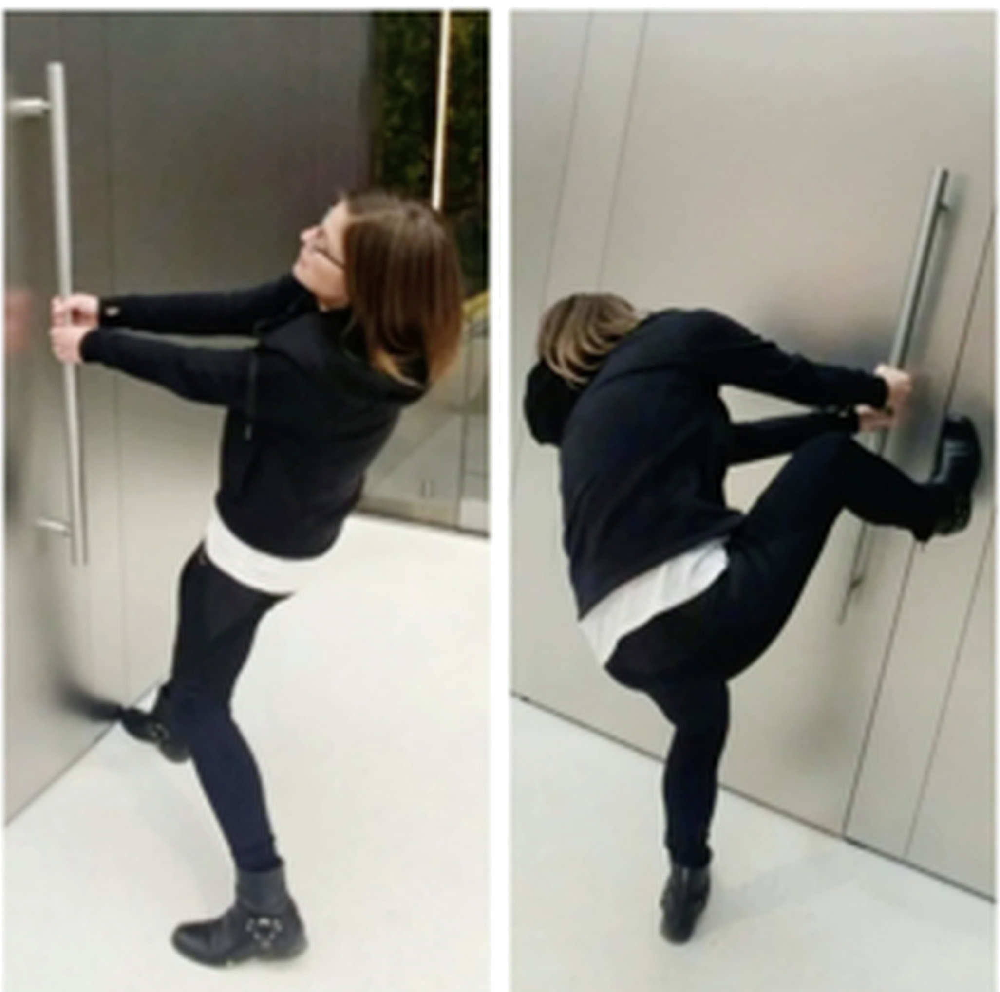
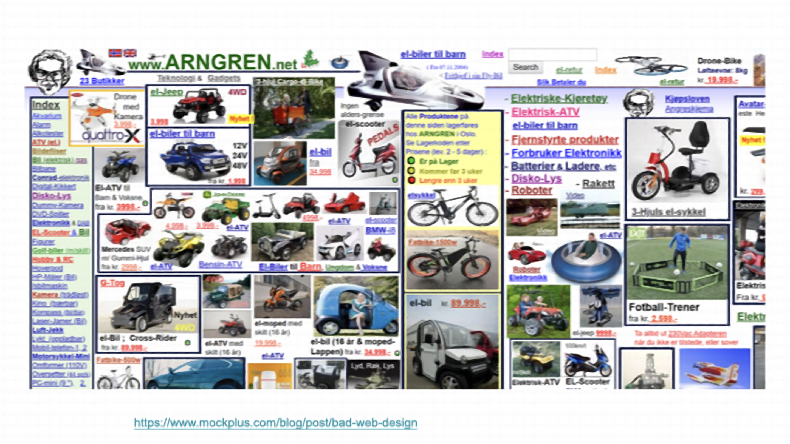
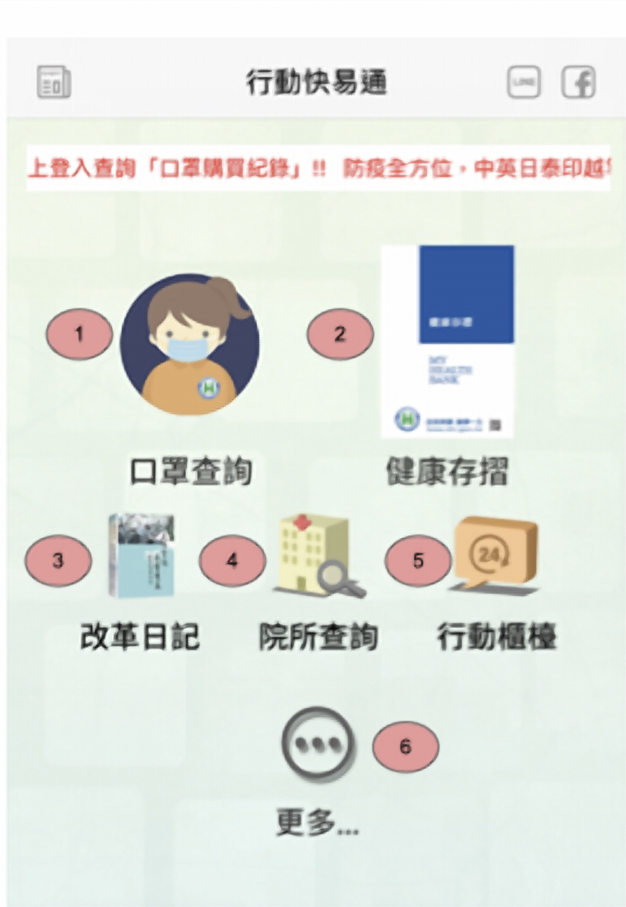
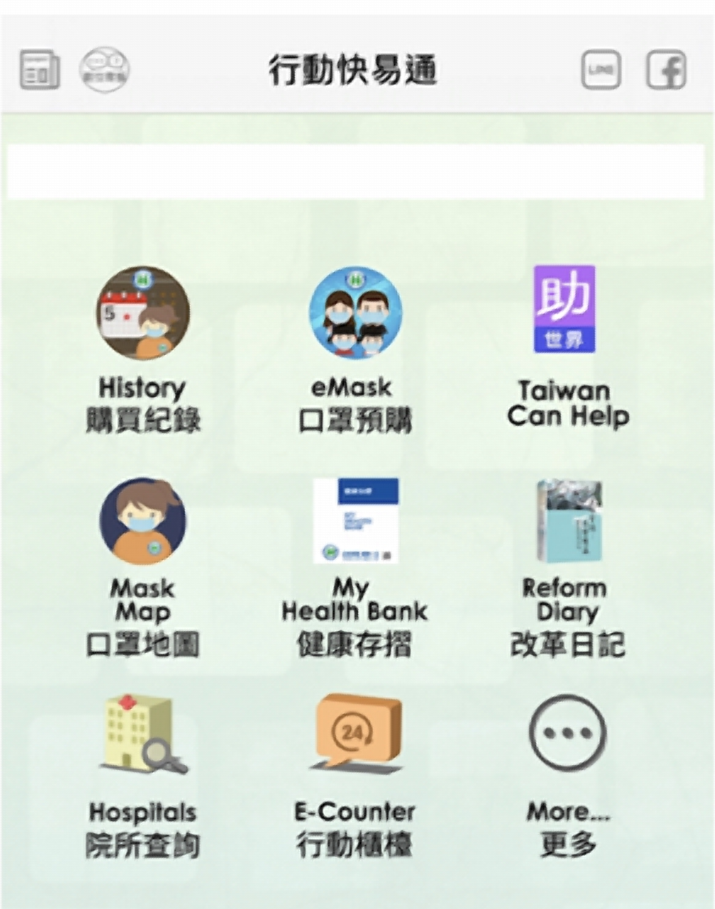
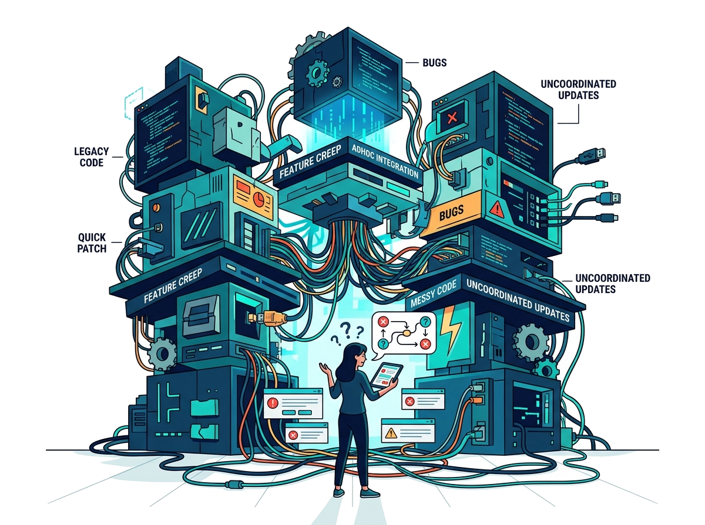
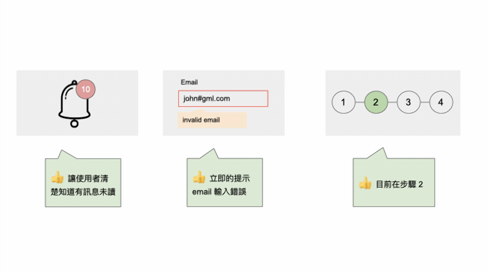
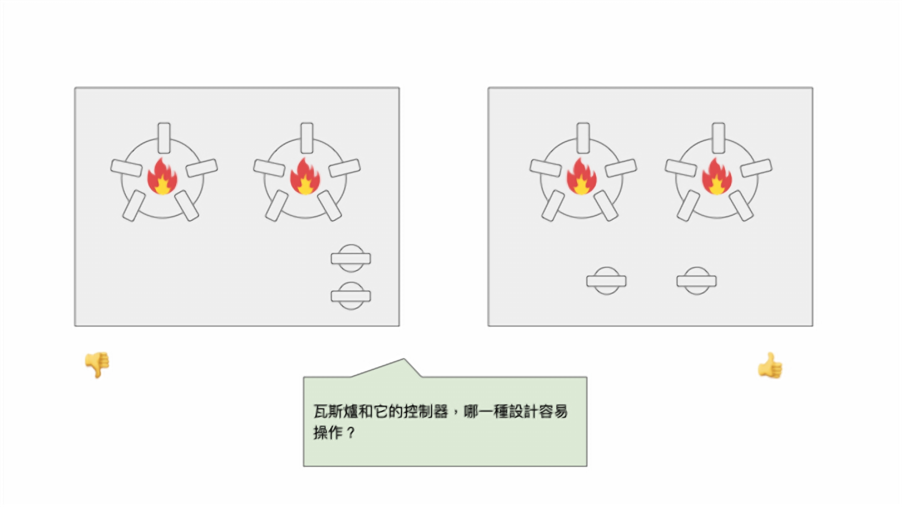
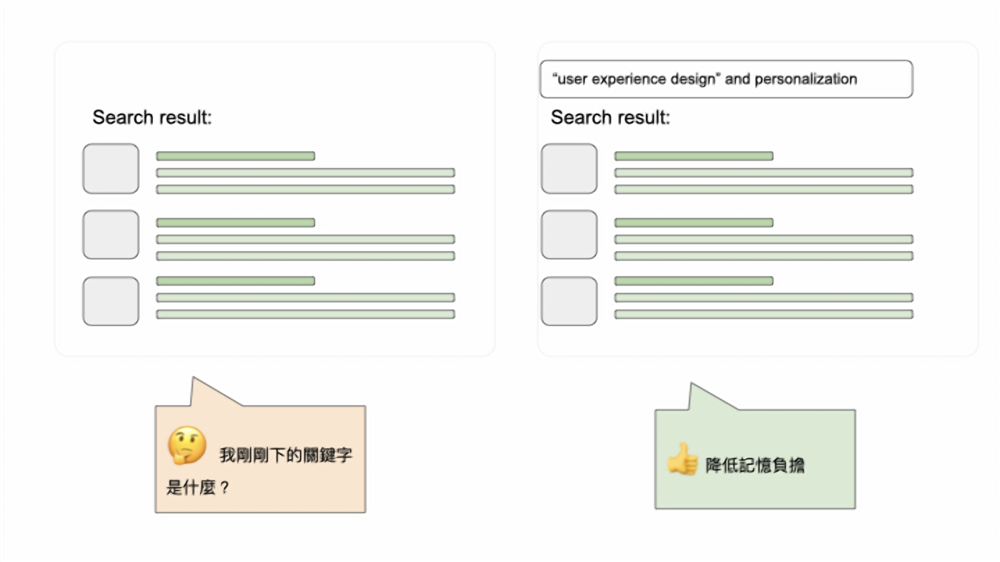
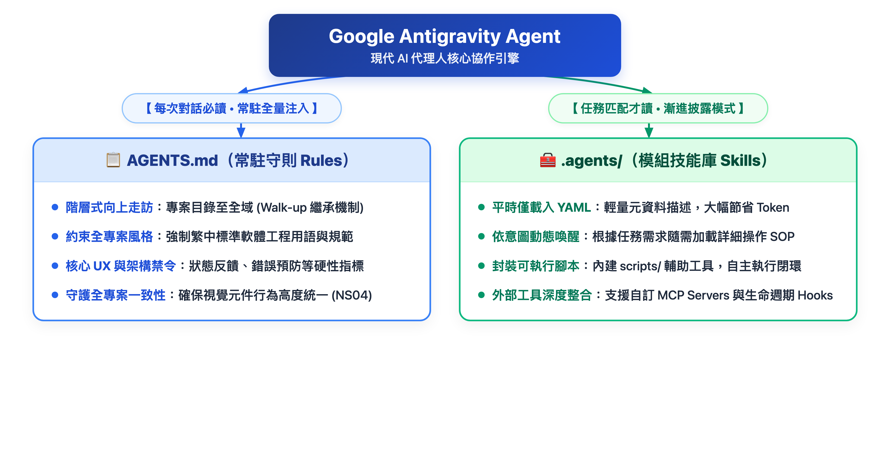
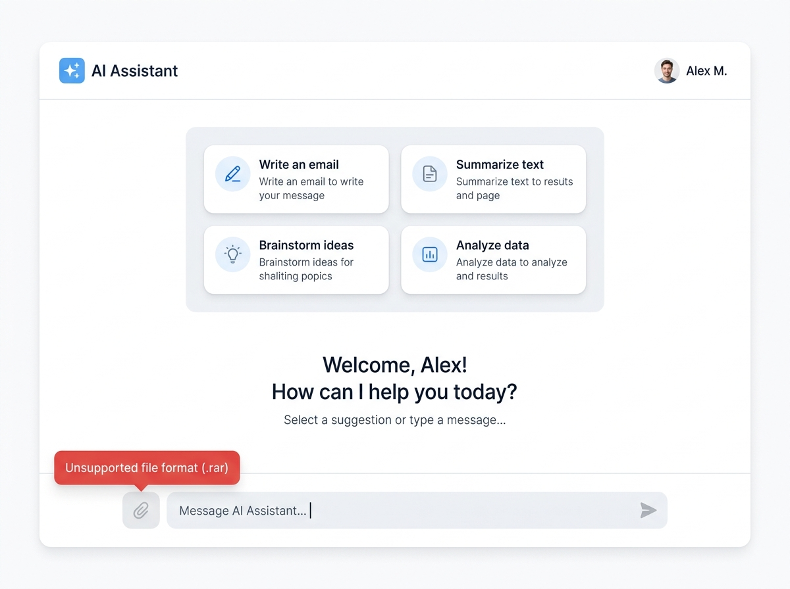

<!-- _class: lead -->
<!-- header: '' -->

# **軟體工程**

### 第六課：使用者體驗 (UX) 設計與以人為本的 AI (UX Design & Human-Centered AI)

**授課教師：薛念林 教授**  
資訊工程學系  
逢甲大學

<!--
各位好，歡迎來到軟體工程第六課：使用者體驗 (UX) 設計與以人為本的 AI。

在先前的章節中，我們學習了如何擷取需求、塑模系統架構，以及建構具備高內聚低耦合的物件導向軟體。然而，即使你的後端演算法在數學上再極致優雅、程式碼一行 bug 都沒有，如果真實的人類使用者看不懂、不會用、用得滿肚子火，那麼這個軟體專案依然是一場徹底的災難。

軟體工程從本質上就是「以人為本」的學科。在這一章中，我們將跨越純工程邏輯與人類心理學之間的鴻溝。我們將探討使用者體驗（UX）的核心本質、透徹掌握 Jakob Nielsen 的十大易用性啟發式原則、學習現代工程師如何運用 AI 加速設計流程（AI for UX），並深入探討如何為具備不確定性的生成式 AI 系統打造值得信賴的使用者介面（UX for AI）。

總結這張投影片，請記住這個核心觀念：卓越的軟體工程，必須將穩健的技術架構與直覺、以人為本的使用者體驗設計緊密結合。
-->
---
<!-- _class: outline-slide -->

## 第六章：課程藍圖與核心主題

  

    <h3>第一部分：UX 基礎與易用性啟發法則</h3>
    <ul>
      <li><b>6.1 使用者體驗 (UX) 基礎：</b> 什麼是 UX、諾曼門（Norman Doors）、三大不良設計原型、台灣健保快易通 App 改版案例、UI 與 UX 的本質差異、設計思考五大階段。</li>
      <li><b>6.2 尼爾森 10 大易用性啟發法則：</b> 系統狀態可見度、符合真實世界、使用者控制與自由、一致性與標準、防錯設計、辨識取代回憶、彈性與效率捷徑、簡約美學、協助使用者修復錯誤、說明文件。</li>
    </ul>
  

  

    <h3>第二部分：AI 賦能設計與智慧介面</h3>
    <ul>
      <li><b>6.3 AI 賦能 UX 設計 (AI for UX)：</b> AI 作為設計放大器、RTCF 結構化提示詞工程框架、自動化啟發式稽核、多代理人協同原型打造。</li>
      <li><b>6.4 為 AI 打造卓越體驗 (UX for AI)：</b> 為機率性非確定性 AI 設計介面、延遲與思考軌跡管理、人類自主掌控權、幻覺防護圍欄、可解釋性 AI (XAI)。</li>
      <li><b>6.5 易用性評估與工程整合：</b> 尼爾森 0-4 級嚴重度評級、專家啟發式評估 vs. 真人使用者測試、章節回顧測驗與工程總結。</li>
    </ul>
  

<!--
這是我們第六章的學習藍圖。

在左側的第一部分，我們從日常認知心理學切入：探討為什麼好設計往往「看不見」，為什麼壞設計會引發使用者暴怒，並系統性拆解 Jakob Nielsen 的十大易用性啟發原則。

在右側的第二部分，我們邁入 AI 時代的前沿設計。我們分別探討兩大面向：第一是 AI for UX——運用大型語言模型與代理人加速設計與稽核；第二是 UX for AI——如何為充滿隨機性與潛在幻覺的 AI 系統，設計出透明、可控且令人信賴的互動介面。

總結這張投影片，請記住這個核心觀念：本章將引導大家從底層的人類認知人因工程，一路躍升至現代 AI 增強的人機互動設計前沿。
-->
---
<!-- _class: lead -->
<!-- header: '6.1 使用者體驗基礎' -->

# **6.1 使用者體驗 (UX) 設計基礎**

> "Good design is actually a lot harder to notice than poor design, in part because good designs fit our needs so well that the design is invisible."  
> *(優秀的設計往往比糟糕的設計更難被察覺，因為好設計與我們的需求契合得天衣無縫，以至於它本身隱形了。)*  
> — *Don Norman (《設計的心理學》作者)*

<!--
我們首先進入 6.1 節：使用者體驗設計基礎。

你有沒有過這樣的經驗：走進一棟公共大樓，看到門把用力往前推，結果門紋風不動，才發現門上貼著「請用拉的」？當時你是不是覺得自己很笨？

認知心理學巨擘 Don Norman 告訴我們：你一點都不笨，笨的是那扇門！當一扇門裝著一片平板，人類的本能就是推；當裝著把手，人類的直覺就是拉。當一個把手竟然需要用「推」的，這扇門在設計上就徹底違背了人類的認知天性。

在這一節中，我們將探討日常設計心理學、分析三大經典不良設計原型、剖析真實世界健保 App 的改版歷程，並確立使用者體驗的正式範疇。

總結這張投影片，請記住這個核心觀念：當使用者在操作軟體犯錯時，該怪罪的是介面設計，而不是使用者的智商。
-->
---
## 經典反模式：諾曼門 (Norman Door)

  

* **什麼是「諾曼門 (Norman Door)」？**
  - 指外觀設計提供了**錯誤視覺線索**的門（例如：裝著適合拉動的垂直把手，實際上卻必須用推的才能打開；或是裝著推板卻需要用拉的）。
* **預設用途 (Affordance) vs. 示能線索 (Signifier)：**
  - **預設用途 (Affordance)：** 物體本身的物理特性所暗示的潛在可能動作（例如：平坦金屬板暗示著「可以推」）。
  - **示能線索 (Signifier)：** 明確標示「在哪裡」以及「如何」操作的視覺訊號（例如門上貼的「PUSH」貼紙）。
* **至高設計箴言：**
  - 當一個日常物件連打開它都需要貼上一張說明貼紙時，它的設計本身就已經徹底失敗了！

  

  

    
  

<!--
請看畫面上這扇經典的諾曼門。

注意其中的矛盾：這扇門裝著一根明顯適合握住往後拉的垂直門把，但門上卻不得不貼一張難看的貼紙寫著「推 PUSH」！因為每個人走過來直覺都會去拉它。

Don Norman 提出了 Affordance（預設用途）與 Signifier（示能線索）的關鍵區別。預設用途是物理特質所引發的本能動作；示能線索則是後天加上去的提示符號。

如果一扇門的推拉側設計得當——推的那面做成平板，拉的那面做成把手——人類大腦根本不需要任何文字，就能在無意識中完成正確操作。

總結這張投影片，請記住這個核心觀念：直覺的設計善用自然的物理預設用途，讓使用者無須仰賴外部操作警告標籤。
-->
---
## 劣質 UI/UX 所帶來的挫折與代價

  

* **糟糕軟體對使用者心理的摧殘：**
  - 引發認知超載、困惑迷惘、焦慮無助，最後導致使用者憤而放棄（User Rage & Churn）。
  - 使用者往往不會怪罪背後的資料庫或架構師，只會留下 1 星負評並怒刪 App。
* **劣質 UX 如何摧毀企業商業價值：**
  - **購物車放棄率高達 70%：** 結帳流程過於繁瑣、表單驗證不明確直接導致營收蒸發。
  - **龐大客服成本支出：** 數以萬計的客服電話與工單，根本源頭都是混亂的介面導覽。
  - **企業員工生產力內耗：** 難用的內部企業 ERP/CRM 系統，導致日常操作頻繁出錯與嚴重工時浪費。

  

  

    
  

<!--
糟糕的軟體設計背後伴隨著巨大的情緒與經濟成本。

當使用者遇到雜亂的表單、找不到送出按鈕、或是突然彈出看不懂的錯誤代碼時，會產生本能的憤怒與挫折感。在消費型產品中，使用者會直接解除安裝跳槽到競爭對手那裡；在企業內部，難用的系統每天都在浪費員工數千小時的生產力。

工程師必須深刻體會：易用性絕非可有可無的美化裝飾——它直接決定了產品的商業留存率、轉化率與軟體的生存命脈。

總結這張投影片，請記住這個核心觀念：劣質 UX 直接造成用戶流失、龐大客服成本與嚴重的生產力內耗。
-->
---
## 三大經典不良介面設計原型 (3 Bad Design Archetypes)

* **1. 「夜市擺攤風」 (Night Market Chaos / 資訊過載型)：**
  - 將數百項商品、閃爍跑馬燈、衝突的超連結全部塞進單一螢幕，毫無視覺階層（Visual Hierarchy）。
  - 人類大腦遭受嚴重的感官認知超載（Cognitive Overload），無從聚焦。
* **2. 「油漆不用錢」 (Paint is Free / 色彩對比地獄)：**
  - 濫用螢光綠、刺眼亮黃、青底洋紅字等極端配色。
  - 嚴重違反 WCAG 無障礙對比度標準，使視力不佳或色弱使用者完全無法閱讀。
* **3. 「我現在該按哪裡？」 (Where Do I Start? / 缺乏視覺導引)：**
  - 滿螢幕充斥著數十個尺寸相同、顏色一致、未區分主次的按鈕。
  - 缺乏明確的主要行動呼籲（Call-to-Action, CTA），讓使用者陷入決策癱瘓。

<!--
讓我們來盤點軟體界最常見的三大不良介面原型。

第一種是「夜市風」：恨不得把全公司的業務全部擠在首頁，頁面密密麻麻，使用者完全不知道眼睛該看哪裡。

第二種是「油漆不用錢」：色彩斑斕刺眼，文字與底色對比嚴重不足，造成視覺疲勞與閱讀障礙。

第三種是「我該按哪裡」：畫面上擺了二十個大小一模一樣的灰色方塊，沒有任何主要按鈕（CTA）引導，讓使用者陷入沉重的選擇困難。

總結這張投影片，請記住這個核心觀念：杜絕認知超載、堅守無障礙對比度標準，並透過清晰的視覺階層引導使用者操作。
-->
---
<!-- _class: title-image-slide -->

## 現實生活反模式：夜市擺攤風的感官超載

  

<!--
請看畫面上這張世界知名的真實網頁範例：挪威的 Arngren 網站。

這是感官超載的教科書級反面教材。無人機、電動滑板車、遙控模型混雜在一起，爭搶著螢幕上的每一個像素。這裡沒有邊界、沒有留白、沒有群組分類，也沒有任何邏輯動線。

當每一項元素都在對著使用者大聲尖叫時，使用者什麼聲音都聽不見。

總結這張投影片，請記住這個核心觀念：缺乏群組分類與留白空間的介面，終將淪為無意義的視覺噪音。
-->
---
## 真實案例研究：台灣口罩預購 App — 營運挑戰

* **歷史背景與緊急營運需求：**
  - COVID-19 疫情爆發初期，台灣「健保快易通」App 承載全台每日數百萬人次的實名制口罩預購重任。
* **原版介面面臨的致命易用性缺陷：**
  - **核心功能深埋：** 關鍵的「口罩預購」功能被埋藏在毫無主次邏輯、由 20 個相同尺寸方塊組成的密集九宮格中。
  - **搜尋認知疲勞：** 焦慮的長輩與民眾被迫在多行毫無區別的圖示中苦苦肉眼搜尋。
  - **缺乏視覺階層：** 平日的例行健康衛教資訊，與攸關全民防疫的緊急口罩預購享有完全相同的視覺權重。
  - **系統連線瓶頸：** 迷航的使用者頻繁點錯選單並反覆返回重試，造成客服電話被塞爆，伺服器連線延遲飆升。

<!--
這是一個發生在台灣、極具教育意義的真實人因工程案例：健保快易通 App 的口罩預購改版。

在疫情剛爆發、全民搶口罩的緊張時刻，數百萬焦慮的民眾每天都要打開這款 App 預購口罩。

然而當時的 App 首頁是一個由 20 個正方形圖示排成的行政總覽矩陣。口罩預購按鈕和一般的「就醫宣導」、「器官捐贈」平起平坐，長輩們戴著老花眼鏡在螢幕上反覆尋找。

在緊急情境下，平頭式的視覺權重直接阻礙了關鍵任務的達成。

總結這張投影片，請記住這個核心觀念：在高度壓力的情境下，若各功能享有均等視覺權重，將嚴重淹沒關鍵任務。
-->
---
<!-- _class: title-image-slide -->
## 案例研究：原版健保 App 介面 (改版前 Before)

  

<!--
請仔細觀察螢幕上的改版前介面。

一眼就能看出問題所在：二十個一模一樣的方形圖示整齊排列。

你能第一時間找到口罩預購按鈕在哪裡嗎？它混雜在健康存摺、醫療院所查詢、保險費繳納之中。

對於心急如焚想要確認口罩配額的民眾而言，這種均勻排列強迫大腦進行耗時的地毯式搜尋，造成極大的認知阻力。

總結這張投影片，請記住這個核心觀念：均勻無差別的圖示陣列強迫使用者進行地毯式視覺搜索，無法提供即時的任務辨識。
-->
---
<!-- _class: title-image-slide -->
## 案例研究：緊急防疫口罩動線重構 (改版後 After)

  

<!--
現在請看改版後的介面。

這是何等震撼的對比！設計團隊直接把「口罩預購」拉拔為頂部最高權重的巨型重點 Banner（Hero Card），正好座落於手機螢幕最容易點擊的大拇指熱區。

其他次要的行政查詢服務，則整齊收納在下方的功能卡片中。

全台灣任何一位打開 App 的民眾，不需要一秒鐘思考，一指點擊即可立即進入預購流程。

總結這張投影片，請記住這個核心觀念：高優先級的情境任務應當佔據最顯著的視覺版面與最直接的預設用途。
-->
---
## 案例分析：以人為本的應急 UX 轉型

* **以人為本的重構設計策略：**
  - **首頁重點巨幅卡片 (Hero Card)：** 將口罩預購提升至頂端最顯眼的 Hero Banner，佔據手機單手操作的大拇指黃金熱區。
  - **任務模組化分群 (Task Chunking)：** 將次要醫療資訊依關聯性整合進清晰的卡片分區中，給予足夠間距與清晰標籤。
  - **直覺極速操作：** 將使用者的決策時間從數分鐘的苦苦搜尋，縮減至 2 秒內的一指直覺點擊。
* **改版的核心啟示：**
  - **情境驅動的動態體驗 (Situational UX)：** 介面的導覽結構必須動態契合現實生活中使用者的急迫優先級，絕不可僵化對應政府組織架構或內部資料庫欄位！

<!--
深入剖析這次改版成功的根本原因：

首先，團隊落實了「資訊塊分群（Chunking）」：把關聯服務打包成清晰模組。

其次，也是最關鍵的一點：介面設計與人類情境即時對齊。疫情當前，95% 的民眾打開 App 只有一個目的——買口罩！軟體導覽架構絕不能僵化反映衛福部的組織分工，而是必須反映當下使用者的迫切需求。

總結這張投影片，請記住這個核心觀念：動態情境 UX 依據真實世界的使用者優先級調整介面階層，而非僵化反映組織結構。
-->
---
## 為什麼做好 UX 那麼難？「知識的詛咒」

  

* **1. 「你不是你的使用者」 (You Are Not The User)：**
  - 軟體工程師擁有深厚的技術心智模型（關聯式綱要、REST API 路由、多執行緒）。
  - 一般使用者只具備日常生活的心智模型（訂晚餐、掛號、查帳單）。
* **2. 知識的詛咒 (The Curse of Knowledge)：**
  - 工程師自己辛苦花三個月把功能刻出來，對介面瞭若指掌，因此覺得一切操作都「極度理所當然、非常直覺」。
  - 工程師的大腦已經無法體會初次面對該介面時的陌生與困惑。
* **3. 防衛心理 vs. 同理心思考：**
  - 工程師往往依照後端資料表開畫面，要求使用者按照資料庫的邏輯填表單。

  

  

    
  

<!--
為什麼頂尖工程師常常做出極難使用的軟體？

心理學上最大的罪魁禍首就是「知識的詛咒 (Curse of Knowledge)」。因為這套系統是你花三個月一行一行 code 敲出來的，每個按鈕藏在哪裡你都一清二楚，你很難想像一個第一次看到的素人會有多茫然。

請記住人機互動界的第一天條：You Are Not The User！你絕不等於你的使用者。

切勿把後端資料表的防衛性思維硬套在介面上，強迫使用者按照資料庫的欄位順序去思考。

總結這張投影片，請記住這個核心觀念：擺脫「知識的詛咒」，將內部資料庫邏輯與人類自然心智模型徹底抽離。
-->
---
## UI (使用者介面) vs. UX (使用者體驗)

* **使用者介面 (UI / User Interface)：**
  - 人類與軟體互動時，所看見、聽見與觸摸的具體感官接觸點。
  - *元素涵蓋：* 按鈕外觀、字型排版、色彩配置、邊距間距、CSS 格線、圖示、過渡微動畫。
  - *核心關切：* 「這個畫面在視覺上看起來如何？渲染與動效順不順暢？」
* **使用者體驗 (UX / User Experience)：**
  - 人類與品牌、服務或系統在完整旅程中產生的整體心理與情感認知感受。
  - *元素涵蓋：* 任務達成效率、流程阻力、認知負擔、滿意度、容錯修復能力與信賴感。
  - *核心關切：* 「使用者是否能直覺、高效且愉悅地達成他們的目標？」
* **經典生動比喻：**
  - UI 是精緻的馬鞍、韁繩與馬鐙；UX 則是騎在馬背上奔馳的整體駕馭感受！

<!--
讓我們精確釐清 UI 與 UX 的根本界線。

UI 代表視覺感官接觸點：漂亮的漸層按鈕、優雅的 Google Fonts 字體、細緻的 CSS 動畫。

UX 則掌管整趟旅程的心理感受：我花了多久才把帳單繳完？操作過程有沒有焦慮？如果不小心按錯了，系統能不能讓我秒速復原？

經典的比喻非常傳神：UI 是雕刻精美的馬鞍與韁繩；UX 則是騎馬奔馳時的暢快與踏實感。

一個畫面可以擁有玻璃擬態（Glassmorphism）的高級 UI，但如果送出按鈕在手機上點了沒反應，UX 就是零分。

總結這張投影片，請記住這個核心觀念：UI 是使用者看見並觸摸的感官介面；UX 則是使用者在達成目標過程中所獲得的整體心理體驗。
-->
---
<!-- _class: title-image-slide -->
## 視覺化比對：UI 與 UX 的互動架構解剖

  

<!--
請看這張 UI 與 UX 的解剖對比圖。

左邊呈現 UI 的專屬範疇：視覺美學、字型、圖標、顏色搭配。

右邊呈現 UX 的宏觀面向：資訊架構、互動流程動線、易用性測試、使用者的情感反饋。

兩者缺一不可。但請記住：UI 是為 UX 服務的。一個視覺華麗卻讓使用者處處碰壁的介面，在軟體工程上就是失敗品。

總結這張投影片，請記住這個核心觀念：UI 打造了美感觸點，而 UX 則主導了使用者的成功、滿意度與價值實現。
-->
---
<!-- _class: title-image-slide -->

## 設計思考 5 大階段 (The 5-Stage Design Thinking)

  

<!--
這是史丹佛大學 d.school 提出的經典設計思考（Design Thinking）五大階段架構。

請注意這套工程循環：軟體專案絕對不能一上來就寫程式或畫高傳真畫面！你必須從「同理（Empathize）」開始——親自觀察目標族群在真實場景中的行為。

接著「定義（Define）」真正要解決的核心痛點、天馬行空「構思（Ideate）」多元解法、動手打造低成本「原型（Prototype）」，最後交給真人進行「測試（Test）」。

總結這張投影片，請記住這個核心觀念：UX 設計是一個從深度同理出發，歷經快速原型打造與驗證迭代的工程循環。
-->
---
## 設計思考五大階段詳細拆解

* **1. Empathize (同理 / 探索)：**
  - 進行質化訪談、現地情境觀察（Contextual Inquiry）與使用者行為追蹤。
  - 挖掘未被說出口的深層挫折與真實心理痛點。
* **2. Define (定義問題)：**
  - 將質化研究收斂為具象的人物誌（Personas）、同理心地圖與精確的 "How Might We (我們該如何...)" 問題陳述。
* **3. Ideate (構思解法)：**
  - 開展多元創意思考，暫緩評判；快速繪製低保真紙上草圖（Paper Wireframes）。
* **4. Prototype (打造原型)：**
  - 製作可供點擊測試的實體構件（Figma 可互動點擊原型、可運行的 HTML/CSS 假資料畫面）。
* **5. Test (驗證測試)：**
  - 將原型交由真實目標使用者操作，觀察卡關點，量化任務達成率並快速迭代修正。

<!--
細看設計思考的五個階段：

同理階段：放下工程師的預設立場，走入真實世界傾聽。
定義階段：把散碎的訪談收斂成清晰具體的問題定義。
構思階段：發想各種天馬行空的解決策略。
原型階段：用最低的成本做出可以按、可以測的假模型。
測試階段：觀察真人使用者的真實反應。

這個流程是高度雙向反覆的：測試時發現假設錯誤，立刻倒回定義階段重新修正。

總結這張投影片，請記住這個核心觀念：設計思考五大階段提供了一套結構化、可重複驗證的以人為本軟體研發方法論。
-->
---
## 觀念檢核測驗 1：UX 基礎與諾曼門

在認知人因工程與 UX 設計中，一扇在拉動式把手上貼有「請用推的」標籤的「諾曼門 (Norman Door)」，所揭示的核心設計教訓為何？

- **A.** 現代一般民眾普遍缺乏操作機械設施所必備的技術素養。
- **B.** 門把的物理預設用途與其操作機制互相衝突，迫使設計者使用外加標籤修補不良設計。
- **C.** 所有建築與數位介面為了符合法規稽核，皆必須強制張貼操作說明文件。
- **D.** 在公共空間設施中，視覺藝術美感應永遠優先於日常實用性與操作易用性。

<!--
讓我們透過觀念測驗 1 來檢核對 UX 基礎與諾曼門概念的理解。

回想 Don Norman 對預設用途（Affordance）與示能線索（Signifier）的定義。

仔細評估選項，挑選出真正點破諾曼門本質的原因。
-->
---
## 觀念檢核測驗 1：解答與解析

- **正確答案：B**
- **詳細解析：**
  - 諾曼門是人機互動界最經典的設計失敗範例：把手的物理預設用途（Affordance，天生適合抓取拉動）與實際的開門機制（推動）產生了正面衝突。因為設計徹底違背了人類直覺的心智模型，設計者不得不貼上一張「推 PUSH」的指示貼紙（Signifier）來防止大家拉錯門。
  - 正如 Don Norman 所言：如果一個日常物件連使用它都必須仰賴標籤說明，這項設計本身就已經不及格了。
  - *其他選項為何錯誤：* 選項 A 檢討使用者，嚴重違背以人為本的核心精神；選項 C 錯誤主張所有東西都要貼說明書；選項 D 錯誤主張美感凌駕於易用性之上。

<!--
正確答案是 B。

當門把的物理造型在向大腦發送「拉我」的訊號，但門卻只能「推」開時，這就是設計上的嚴重精神分裂。那張貼紙只是一塊遮羞布。

總結這張投影片，請記住這個核心觀念：直覺的實體與數位介面透過天然的預設用途溝通操作方式，而非依賴警告標籤修補不良設計。
-->
---
<!-- _class: lead -->
<!-- header: "6.2 尼爾森 10 大啟發原則" -->

# **6.2 尼爾森 10 大易用性啟發法則**

> "Jakob's Law: Users spend most of their time on other sites. This means that users prefer your site to work the same way as all the other sites they already know."  
> *(雅各布定律：使用者絕大部分的時間都在別人的網站上。這意味著他們強烈偏好你的網站運作方式，與他們早已熟知的所有其他網站完全一樣。)*  
> — *Jakob Nielsen (Nielsen Norman Group 創辦人)*

<!--
我們現在邁入 6.2 節：Jakob Nielsen 的十大易用性啟發式原則（10 Usability Heuristics）。

由 Jakob Nielsen 與 Rolf Molich 於 1994 年歸納提出的這十條啟發原則，至今依然是數位互動介面設計的「世界憲法」。它們不是死板的數學公式，而是歷經數十年實證研究萃取出的經驗法則。

在這一節中，我們將透過真實的介面實例——從瓦斯爐旋鈕到 iPhone 鎖定畫面——逐一掌握這十條黃金原則如何指導軟體工程決策。

總結這張投影片，請記住這個核心觀念：尼爾森十大原則為評估與設計直覺流暢的軟體介面，提供了通用的啟發式評估文法。
-->
---
## 概覽：尼爾森 10 大易用性啟發法則 (Overview)

  

    <ul>
      <li><b>NS01. 系統狀態可見度：</b> 透過及時適當的回饋，讓使用者隨時掌握系統狀態。</li>
      <li><b>NS02. 符合真實世界：</b> 採用使用者熟悉的語言詞彙、概念與實體隱喻。</li>
      <li><b>NS03. 使用者控制與自由度：</b> 提供清晰明確的「緊急出口」（復原 Undo / 重做）。</li>
      <li><b>NS04. 一致性與標準性：</b> 遵循平台與產業通用規範（雅各布定律）。</li>
      <li><b>NS05. 防錯設計：</b> 事前透過審慎設計消除容易出錯的情境，勝過事後道歉。</li>
    </ul>
  

  

    <ul>
      <li><b>NS06. 辨識取代記憶：</b> 將物件、動作與選項視覺化，減輕大腦記憶負擔。</li>
      <li><b>NS07. 彈性與使用效率：</b> 提供捷徑（Accelerators）滿足高頻專業進階用戶。</li>
      <li><b>NS08. 簡約美學設計：</b> 消除無關雜訊，將訊噪比（Signal-to-Noise）最大化。</li>
      <li><b>NS09. 協助辨識與修復錯誤：</b> 用白話清楚說明問題，並建設性指出解法。</li>
      <li><b>NS10. 說明文件與求助支援：</b> 提供容易檢索、任務導向且情境化的即時引導。</li>
    </ul>
  

<!--
這是 Jakob Nielsen 十大易用性啟發原則的全貌清單。

每一位合格的軟體工程師、產品經理與 UI/UX 設計師都應該對這十條原則滾瓜爛熟。

請注意這十條原則的涵蓋範疇：從即時動態回饋（NS01）、真實世界隱喻（NS02）、逃生出口（NS03）、標準一致性（NS04）、防錯機制（NS05）、認知記憶減負（NS06）、高手快捷鍵（NS07）、視覺減法（NS08）、白話錯誤修復（NS09），到情境文件（NS10）。

接下來讓我們逐一深度解析。

總結這張投影片，請記住這個核心觀念：這十項原則全面涵蓋了狀態回饋、認知負擔、容錯防護與操作效率等核心軟體工程品質。
-->
---
## NS01: 系統狀態可見度 (Visibility of System Status)

* **啟發原則定義：**
  > 「系統應在合理的時間內，透過適當的回饋，始終讓使用者明確掌握當前正在發生什麼事。」
* **核心互動設計模式：**
  - **即時觸控回饋：** 按鈕點擊時的下沉態、微動效波紋（Ripple Effect），立即向使用者確認「輸入已被系統接收」。
  - **進度透明化：** 顯示具備確切百分比的進度條（%）、結帳步驟指示器（1. 購物車 &rarr; 2. 配送資訊 &rarr; 3. 付款）。
  - **背景任務即時狀態：** 旋轉進度環搭配具備動態文字的說明（*「正在上傳第 3 張相片，共 5 張...」*）。
  - **連線狀態提示：** 離線斷網即時警告橫幅、雲端同步狀態勾選指示。

<!--
原則一：系統狀態可見度。

沒有什麼比點了按鈕之後螢幕一片死寂更能引發使用者的恐慌了。扣款成功了嗎？當機了嗎？我要不要再按一次？這一按往往造成重複刷卡！

軟體必須隨時給予反饋。一秒鐘內的動作，給予按鈕回饋或輕量 spinner；數秒鐘的操作，提供確切的進度百分比；多步驟的表單，提供步驟指示器。

總結這張投影片，請記住這個核心觀念：持續且及時的視覺回饋能徹底消除使用者的焦慮感，防止重複操作錯誤。
-->
---
<!-- _class: title-image-slide -->
## NS01 實踐：即時系統狀態與進度透明反饋

  

<!--
請看畫面上這幾個系統狀態可見度的具體實踐。

百分比下載進度條讓等待具備明確預期；多步驟精靈指引使用者當前在第幾步、還剩幾步；按鈕在點擊時提供物理下沉視覺回饋。

每一個互動狀態都被清清楚楚地表達出來，使用者永遠處於被充分告知的安全感之中。

總結這張投影片，請記住這個核心觀念：透過進度條、步驟指示器與動態回饋，讓使用者隨時清楚掌握系統運行狀態。
-->
---
## NS02: 符合真實世界 (Match System & Real World)

* **啟發原則定義：**
  > 「系統應使用使用者的語言，採用使用者熟悉的詞彙、語句和概念，而不是系統內部的術語。遵循真實世界的通用慣例。」
* **自然空間映射 (Natural Mapping)：**
  - 操作控制器在空間上的配置，應精確對應於被控制物體的物理空間幾何。
  - *經典反面教材：* 四口瓦斯爐排列為 2x2 方陣，但四個開關旋鈕卻排成一整條直線，強迫大腦進行繁複的空間座標換算，經常開錯爐火。
  - *優良設計：* 將四個旋鈕同樣排列為 2x2 矩陣，操作直覺秒懂且零出錯。
* **生活實體隱喻 (Familiar Metaphors)：**
  - 資源回收桶代表刪除、資料夾代表目錄階層、購物車代表待結帳商品。

<!--
原則二：符合真實世界。

軟體應該採用人類在真實世界早已累積的生活經驗與空間隱喻。桌面上的垃圾桶、電商的購物車都是大家耳熟能詳的經典範例。

請特別注意「自然空間映射（Natural Mapping）」：瓦斯爐是四個爐口排成 2x2 正方形，如果開關旋鈕硬要排成橫向一直線，你的大腦每次開火都要在腦子裡做座標映射。如果開關也排成 2x2，閉著眼睛都不會開錯。

總結這張投影片，請記住這個核心觀念：將數位控制項直接映射至真實世界的空間幾何與日常語彙，消除認知轉換阻力。
-->
---
<!-- _class: title-image-slide -->
## NS02 實踐：控制項的自然空間幾何映射

  

<!--
這張對比圖完美詮釋了自然空間映射的力量。

左側四個旋鈕排成一直線，使用者每次都要瞇著眼睛看標籤或在腦袋裡數「左二是哪一口爐子」，經常把空鍋子燒焦。

右側將四個旋鈕依照 2x2 空間排列，人類的大腦根本不需要經過任何邏輯運算，手伸出去就是正確的開關。

總結這張投影片，請記住這個核心觀念：當控制項配置與實體物理空間幾何完全對齊時，操作轉換摩擦力直接降為零。
-->
---
## NS03: 使用者控制與自由度 (User Control & Freedom)

* **啟發原則定義：**
  > 「使用者常因誤操作而誤入非預期的功能狀態，此時需要一個清晰標示的『緊急出口』，讓他們能迅速脫離該狀態，而不需經歷冗長的對話流程。」
* **必備的工程實踐模式：**
  - **全域復原 / 重做 (Universal Undo / Redo)：** 編輯器、畫布工具及破壞性狀態變更均應全面支援 `Ctrl+Z` / `Cmd+Z`。
  - **清晰的取消出口：** 彈跳視窗（Modals）、檔案上傳與批次處理中，必須提供高對比、易於點擊的「取消 (Cancel)」按鈕。
  - **非破壞性導覽：** 允許使用者隨時退出多步驟結帳或註冊精靈，且不應擅自抹煞已填寫的表單暫存資料。
  - **資源回收暫存區 (Soft Deletes)：** 刪除操作先移至垃圾桶，保留 30 天復原期後才永久清除。

<!--
原則三：使用者控制與自由度（緊急出口）。

人是充滿好奇心的，但人也很容易手滑按錯。如果一個系統讓使用者覺得「只要點錯一個按鈕，資料就會灰飛煙滅，或者信用卡立刻被扣款」，使用者會變得極度畏縮、不敢探索。

給使用者清晰的緊急出口！跳出來的彈跳視窗一定要有 Esc 鍵或關閉叉叉；刪除重要檔案時，提供 Undo 氣泡提示。

當使用者知道自己隨時能「後悔」、隨時能回到上一動時，他們才會帶著安全感自由探索軟體。

總結這張投影片，請記住這個核心觀念：清晰的緊急出口與復原機制為使用者提供心理安全防護網，激勵使用者自信操作。
-->
---
<!-- _class: title-image-slide -->
## NS03 實踐：使用者控制、自由度與明確緊急出口

  

<!--
請看畫面上這些無處不在的逃生出口設計。

在主要送出按鈕旁邊永遠伴隨著高對比的「取消」按鈕；重要刪除操作完成後，底部彈出具備倒數計時的「復原（Undo）」Toast；右上角常駐醒目的關閉圖示。

使用者永遠不會被困死在一個進退維谷的死胡同裡。

總結這張投影片，請記住這個核心觀念：顯眼的取消按鈕與即時復原機制，保障了使用者的自主掌控權。
-->
---
## NS04: 一致性與標準性 (Consistency & Standards)

* **啟發原則定義：**
  > 「使用者不應懷疑不同的詞彙、狀態或操作是否代表相同的事物。應遵循平台與產業通用的既定慣例。」
* **網際網路體驗的「雅各布定律 (Jakob's Law)」：**
  - 你的使用者有 99% 的數位生命都在**別人的網站與 App 上度過**。
  - 他們預期你的軟體運作方式，與他們熟知的其他產品完全一致（例如：左上角 Logo 回首頁、右上角購物車、放大鏡代表搜尋）。
* **一致性的兩大工程維度：**
  - **內部一致性 (Internal Consistency)：** 產品內部統一的設計系統（Design Tokens）、按鈕樣式、字級比例與名詞定義。
  - **外部一致性 (External Consistency)：** 遵循作業系統平台人機介面指南（iOS HIG 與 Android Material Design）。

<!--
原則四：一致性與標準性。

很多新進工程師或熱血設計師常有一種衝動：想要「打破常規、重新發明輪子」——把導覽選單藏在右下角，或是把購物車畫成一個皮箱。

Jakob Nielsen 提出了著名的雅各布定律：你的使用者 99% 的時間都在用別人的產品！他們早就習慣了點左上角 Logo 回首頁、右上角是購物車、齒輪代表設定。

切勿為了與眾不同而違背使用者的通用直覺。遵從平台標準與設計系統，才能大幅降低上手門檻。

總結這張投影片，請記住這個核心觀念：遵從產業通用慣例與內部設計系統，能最大程度降低使用者的認知負擔。
-->
---
<!-- _class: title-image-slide -->
## NS04 實踐：通用標準慣例與平台隱喻

  

<!--
請看這些全世界通用的標準慣例圖標。

齒輪代表設定、鈴鐺代表通知、放大鏡代表搜尋、購物車代表待買清單。

當你的產品完全符合這些標準慣例時，一個剛下載 App 的使用者不需要閱讀一字一句教學，就能無痛上手操作。

總結這張投影片，請記住這個核心觀念：符合產業標準 UI 規範，讓初次造訪的使用者能直接套用既有心智模型。
-->
---
## NS05: 防錯設計 (Error Prevention)

* **啟發原則定義：**
  > 「比起再怎麼友善詳盡的錯誤訊息，更卓越的工程設計是在第一時間就防止錯誤發生。」
* **主動防禦型設計模式：**
  - **消除容易出錯的情境：** 在必填欄位尚未通過即時驗證之前，將「送出」按鈕保持反灰禁用狀態。
  - **輸入約束與限制 (Input Constraints)：** 使用可視化日期選擇器（Date Picker）取代純文字輸入框，徹底杜絕日期格式輸入錯誤（如 `YYYY/MM/DD` vs `DD/MM/YYYY`）。
  - **針對不可逆破壞性操作引入高阻力確認：** 刪除 GitHub 儲存庫前，要求使用者手動鍵入專案全名以喚醒意識。
  - **智慧智慧預設值 (Intelligent Defaults)：** 預填最常見的合理參數，減少空表單帶給使用者的心理壓力。

<!--
原則五：防錯設計。

在使用者出錯之後給予禮貌溫暖的錯誤訊息固然很好，但「一開始就設計成讓使用者根本無法犯錯」，才是最高段的工程美學。

為什麼要讓使用者在文字框裡隨意亂打日期，然後再跳出紅字罵他格式錯誤？直接給他一個日曆選擇器，他就連打錯的機會都沒有！

對於極度危險的動作（例如刪除整個雲端資料庫），故意加入合理的摩擦力——要求輸入資料庫名稱，徹底杜絕手滑造成的重大災難。

總結這張投影片，請記住這個核心觀念：透過輸入約束、即時欄位防呆與關鍵確認機制，防範錯誤於未然。
-->
---
<!-- _class: title-image-slide -->
## NS05 實踐：破壞性操作之高阻力確認機制

  

<!--
請看畫面上 GitHub 刪除 Repository 的經典高阻力確認框。

GitHub 絕不只是提供一個簡單的「確定」按鈕。它強制要求開發者親手敲入完整的儲存庫名稱。

這個刻意設計的操作摩擦力，能瞬間喚醒使用者的專注意識，徹底防止任何手滑造成的代碼庫意外抹除。

總結這張投影片，請記住這個核心觀念：針對不可逆的破壞性操作，善用確認機制防止災難性失誤。
-->
---
## NS06: 辨識取代記憶 (Recognition Rather Than Recall)

* **啟發原則定義：**
  > 「透過將物件、操作和選項清晰可視化，使使用者的記憶負擔降到最低。使用者不應被迫記憶從對話流程某一部分到另一部分的資訊。」
* **認知心理學基石：**
  - **辨識 (Recognition / 大腦輕鬆)：** 看到熟悉的視覺線索時能立刻認出（如同選擇題）。
  - **回憶 (Recall / 大腦耗能)：** 在毫無線索提示下，全憑記憶提取資訊（如同純文字終端機指令或申論題）。
* **UI 工程實踐：**
  - 搜尋輸入框點擊時自動展開最近搜尋歷史關鍵字與熱門建議。
  - 檔案列表顯示縮圖預覽，而非只有冰冷抽象的二進位檔名。
  - 文字選取時自動在游標旁邊浮現情境式編輯工具列。

<!--
原則六：辨識取代記憶。

人類的工作記憶容量極度有限——同時只能處理大約 4 到 7 個資訊組塊。

「辨識」是非常省力的大腦運作：就像選擇題，你看到答案就能秒選。「回憶」則非常耗能：像申論題，大腦要在虛無中搜索資訊。

絕不要讓使用者在第一頁記住一串長達 12 碼的訂單編號，再叫他手動抄到第三頁貼上！把選項、歷程記錄、縮圖清清楚楚放在視野範圍內。

總結這張投影片，請記住這個核心觀念：透過提供歷史記錄與視覺提示，將耗費心力的被動回憶轉化為省力的主動辨識。
-->
---
<!-- _class: title-image-slide -->
## NS06 實踐：搜尋歷程保留與視覺辨識選項

  

<!--
請看現代搜尋介面的設計範例。

使用者點開搜尋框時，面對的不是一片空白，而是系統主動呈現的近期搜尋記錄、熱門關鍵字與自動補全建議。

大腦只需要在畫面上「辨識」出自己剛剛找過的目標，直接點擊即可，徹底免去重新打字的繁瑣記憶負擔。

總結這張投影片，請記住這個核心觀念：主動呈現歷史記錄與建議，讓大腦的運作從苦思回憶轉為輕鬆辨識。
-->
---
## NS07: 彈性與使用效率 (Flexibility & Efficiency of Use)

* **啟發原則定義：**
  > 「加速器（Accelerators，新手使用者看不見）通常能大幅加快資深專家的操作速度，讓系統能同時兼顧並滿足毫無經驗的生手與熟練的高手。」
* **雙軌互動設計哲學 (Dual-Track Interaction)：**
  - **生手路徑 (Novice Path)：** 引導式圖形選單、功能導覽精靈、大按鈕與詳盡的文字解說。
  - **高手加速器 (Expert Accelerators)：** 全域快捷鍵 (`Cmd+K` / `Ctrl+K` 命令面板)、多指觸控手勢、可重用的巨集指令與批次批次處理。
* **漸進式熟練轉化：**
  - 在圖形選單中將快捷鍵組合標註於文字旁（如 `Cmd+S`），讓新手在日常點擊中自然習得快捷鍵，無痛晉升為進階用戶。

<!--
原則七：彈性與使用效率。

優良的軟體必須同時包容兩極端的族群：剛註冊的生手，以及每天泡在系統裡八小時的資深高手。

生手需要按部就班的精靈引導與大圖示；但如果一位每天處理 500 張發票的會計師每次都要用滑鼠點五層選單，他會精神崩潰。

提供鍵盤加速器：例如現代開發者極度仰賴的 Cmd+K 命令列，手不離鍵盤就能完成一切操作。

總結這張投影片，請記住這個核心觀念：提供快捷鍵加速器讓專業用戶發揮極致效率，同時保留直覺介面包容新手。
-->
---
<!-- _class: title-image-slide -->
## NS07 實踐：全域快捷鍵與命令面板加速器

  

<!--
請看這些當代頂尖開發者工具中的加速器實踐。

按下一組 `Cmd+K`，全域搜尋面板瞬間彈出，支援模糊搜尋所有操作命令；選單右側清晰提示著快捷鍵標籤，讓工程師在操作過程中耳濡目染。

生手用滑鼠點選無礙，高手用快捷鍵健步如飛。

總結這張投影片，請記住這個核心觀念：命令面板與快捷鍵加速器在完全不干擾新手的同時，為進階用戶賦予極限工作效率。
-->
---
## NS08: 簡約美學設計 (Aesthetic & Minimalist Design)

* **啟發原則定義：**
  > 「對話框與介面不應包含無關或極少需要的冗餘資訊。對話框中每一單位多餘的資訊，都在與真正相關的資訊競爭使用者的有限注意力，削弱其能見度。」
* **極大化訊噪比 (Signal-to-Noise Ratio, SNR)：**
  - **訊號 (Signal)：** 與使用者當前任務決策直接息息相關的核心關鍵資訊。
  - **雜訊 (Noise)：** 喧賓奪主的裝飾線條、多餘徽章、冗長官樣廢話與閃爍橫幅。
* **工程技巧：漸進式揭露 (Progressive Disclosure)：**
  - 首頁與預設畫面僅展示最核心、80% 使用者必備的主要功能。
  - 將進階、低頻率的專業參數優雅收納於「進階設定 (Advanced)」摺疊面板或次級分頁中。

<!--
原則八：簡約美學設計。

在軟體工程中，「簡約」絕不是指把所有畫面留白或偷懶不刻功能，而是「極大化訊噪比（Signal-to-Noise Ratio）」。

使用者螢幕上的注意力是極其寶貴的有限頻寬。每一個花俏的裝飾邊框、每一句廢話，都在瓜分使用者的認知資源。

請掌握「漸進式揭露 (Progressive Disclosure)」的藝術：先把最核心、最常用的 20% 主要功能擺在眼前，把剩下的 80% 進階設定收進展開選單裡。

總結這張投影片，請記住這個核心觀念：剔除視覺雜訊並落實漸進式揭露，讓使用者的注意力聚焦於核心任務。
-->
---
<!-- _class: title-image-slide -->
## NS08 實踐：簡約美學對比資訊過載

  

<!--
請看這張震撼的對照圖。

左邊舊式系統充斥著各色圖示、走馬燈與小外掛，訊噪比極低，讓人感到疲憊壓迫。

右邊現代簡約設計則大膽運用高品質留白與清晰的排版對比，將唯一的焦點留給使用者當前最重要的核心目標。

總結這張投影片，請記住這個核心觀念：清晰的視覺階層與充沛的留白空間，能最大程度彰顯主要任務的能見度。
-->
---
## NS09: 協助使用者辨識、診斷與修復錯誤

* **啟發原則定義：**
  > 「錯誤訊息應採用清晰平易的純文字表達（絕不出現晦澀代碼），精確指出問題的具體成因，並建設性地主動提出修復建議方案。」
* **災難級錯誤訊息範例：**
  - ❌ *"Error 0x80004005: Unexpected runtime exception in thread main."* （讓使用者困惑恐慌，毫無幫助）。
* **卓越錯誤訊息的三大黃金法則：**
  - ✅ **平易白話：** *"我們無法為您的信用卡完成扣款。"*
  - ✅ **精確具體原因：** *"您輸入的有效期限 (05/23) 已經過期。"*
  - ✅ **建設性修復出口：** *"請更新您的信用卡到期日，或選擇其他付款方式 [更新付款資訊]。"*

<!--
原則九：協助使用者辨識與修復錯誤。

當使用者遇到錯誤時，他已經處於脆弱和受挫的情緒狀態中。千萬不要對著使用者吐出十六進位的記憶體代碼或是 Raw SQL Exception！

一條合格的錯誤訊息必須具備三要素：第一，用一般人看得懂的白話說明發生什麼事；第二，精確指出具體原因；第三，附上一個一鍵修復的按鈕或指引。

像現代網站會把冷冰冰的 404 Not Found 轉化為溫暖的搜尋導航頁，這就是極佳的修復實踐。

總結這張投影片，請記住這個核心觀念：用平易語言說明原因，並提供一鍵修復的具體出口，將錯誤轉化為正向體驗。
-->
---
<!-- _class: title-image-slide -->
## NS09 實踐：建設性錯誤修復與暖心 404 導航

  

<!--
請看螢幕上這張充滿同理心的 404 頁面。

它沒有拋出可怕的「404 Bad Request / Nginx Server Error」，而是幽默誠懇地告知：「抱歉，這個頁面可能已經搬家了」，並立即在下方提供搜尋框與返回儀表板的捷徑按鈕。

挫折感在第一時間被同理與化解，使用者無須慌張地按上一頁。

總結這張投影片，請記住這個核心觀念：具備同理心的錯誤設計以白話說明緣由，並主動提供清晰的下一步復原動線。
-->
---
## NS10: 說明文件與求助支援 (Help & Documentation)

* **啟發原則定義：**
  > 「雖然系統最好能夠達到無需任何說明手冊便能直覺操作，但仍有必要提供說明文件。相關資訊應易於搜尋、緊密聚焦於使用者的具體任務、列出明確的操作步驟，且篇幅不宜過於冗長。」
* **現代嵌入式文件的新典範：**
  - **情境式微提示 (Contextual Tooltips)：** 在複雜欄位旁提供小問號圖示 `?`，滑鼠懸停時即時浮現具體格式說明。
  - **互動式上手導覽 (Interactive Onboarding)：** 新用戶首次登入時，透過高亮聚光燈與步進卡片，在真實畫面上親手演練核心功能。
  - **任務導向的知識庫：** 說明文件依照使用者的「任務目標」分類檢索，而非依照內部 API 模組分類。

<!--
原則十：說明文件與求助支援。

雖然我們的終極目標是讓系統直覺到「沒有人需要讀說明書」，但在龐大複雜的企業級系統中，完備的支援依然不可或缺。

現代優秀的 documentation 絕不是丟一本厚達 100 頁的 PDF 讓使用者去啃，而是「情境化嵌入」：在有疑問的欄位旁放一個問號小提示，在新功能發布時提供互動式導覽體驗。

總結這張投影片，請記住這個核心觀念：提供任務導向、易於檢索且情境化嵌入操作流程的即時說明文件。
-->
---
<!-- _class: title-image-slide -->
## NS10 實踐：情境微提示與互動式上手導覽

  

<!--
請看畫面上現代互動式 Onboarding 的設計。

使用者不需要在動手前先念完一篇長篇大論，系統在真實操作路徑中逐步聚焦，一步步帶領使用者完成第一筆任務。

學習發生在做中學的互動之中，既自然又深刻。

總結這張投影片，請記住這個核心觀念：將情境提示與互動式導覽嵌入實際任務流程中，實現漸進式的做中學體驗。
-->
---
## 觀念檢核測驗 2：易用性啟發原則實踐

在電商結帳流程中，工程團隊將原先自由輸入的文字日期框，替換為互動式日曆選擇器，並在所有必填地址通過格式驗證之前，自動將「確認下單」按鈕保持為反灰禁用狀態。請問這項設計主要體現了尼爾森十大原則中的哪一項？

- **A.** NS01: 系統狀態可見度 (Visibility of System Status)
- **B.** NS05: 防錯設計 (Error Prevention)
- **C.** NS07: 彈性與使用效率 (Flexibility and Efficiency of Use)
- **D.** NS10: 說明文件與求助支援 (Help and Documentation)

<!--
讓我們檢驗對尼爾森十大原則的理解。

分析團隊的具體行動：以受限的日曆選擇器取代自由打字，並在驗證過關前禁用按鈕。

思考哪一項原則強調在錯誤發生之前就主動預防。
-->
---
## 觀念檢核測驗 2：解答與解析

- **正確答案：B**
- **詳細解析：**
  - 尼爾森原則中的 **NS05: 防錯設計 (Error Prevention)** 明確主張：比再好的錯誤提示訊息更卓越的，是從根本上杜絕問題發生的精心設計。
  - 透過日曆選擇器約束輸入，杜絕了格式錯誤；反灰未驗證的下單按鈕，防止了無效請求的發送，完全符合防錯原則的精神。
  - *其他選項為何錯誤：* NS01 關注系統當前進度與狀態反饋；NS07 關注專業用戶快捷鍵；NS10 關注說明手冊。

<!--
正確答案是 B。

防患於未然，勝過事後收拾殘局。限制輸入元件並提前防呆，完全契合防錯設計的真諦。

總結這張投影片，請記住這個核心觀念：主動的輸入約束與條件防呆機制，是體現 NS05 防錯設計原則的典範。
-->
---
<!-- _class: lead -->
<!-- header: '6.3 AI for UX (AI4UX)' -->

# **6.3 AI 賦能 UX 設計：AI for UX (AI4UX)**

> "AI will not replace UX designers, but UX designers who use AI will replace those who do not."  
> *(AI 不會取代 UX 設計師，但善用 AI 的 UX 設計師將會取代不用 AI 的人。)*

<!--
我們現在邁入第二部分：AI 時代的互動設計前沿。

在 6.3 節中，我們探討 AI for UX（AI4UX）：軟體工程師與設計師如何善用大型語言模型、多模態視覺工具與自主代理人，全方位放大設計思維的每個環節？

我們將介紹專業設計師專屬的 RTCF 結構化提示詞工程框架、虛擬使用者人物誌生成，以及多代理人自動化原型建構。

總結這張投影片，請記住這個核心觀念：AI for UX 將生成式智慧轉化為認知協同夥伴，大幅加速介面原型設計、評估與最佳化。
-->
---
## 什麼是 AI 賦能 UX (AI4UX)？

* **AI 賦能下的超級設計師：**
  - 生成式 AI 在設計思考流程的每一個階段，扮演**認知放大器與效率倍增器**。
* **主要實戰應用範疇：**
  - **使用者研究與同理：** 生成多元化虛擬使用者人物誌（Synthetic Personas），模擬極端情境使用者訪談。
  - **文案發想與在地化：** 秒速生成數十種微文案（Microcopy）語氣變體、多國語系字串與無障礙替代文字（Alt Text）。
  - **自動化啟發式稽核：** 將 UI 畫面截圖餵給多模態 LLM，自動比對尼爾森十大原則並揪出違規點。
  - **生成式原型開發：** 文字直接生成 Wireframe 與可互動前端程式碼（v0、Figma AI、Galileo）。

<!--
什麼是 AI for UX？

簡單來說，就是運用生成式 AI 作為設計流程中的加速齒輪。

以往要花好幾天手動寫文案、整理人物誌，現在可以交由 LLM 在幾秒鐘內產出高品質草案。

多模態視覺模型更能直接「看懂」你的設計稿截圖，並自動執行尼爾森原則稽核，提前發現對比度不足或標籤遺漏。

總結這張投影片，請記住這個核心觀念：AI for UX 將生成式模型轉化為研究、發想、稽核與原型打造的得力助手。
-->
---
<!-- _class: title-image-slide -->
## AI for UX：人機協同的增強設計工作流程

  

<!--
請看這張現代人機協同設計流程圖。

人類設計師負責掌舵：提供策略目標、同理心洞察與美學品味；AI 副駕駛與代理人群則在下方高效產出排版替代方案、無障礙檢查清單與樣板程式碼。

設計生產力提升十倍，而人類的溫度與同理心依然穩坐駕駛座。

總結這張投影片，請記住這個核心觀念：AI for UX 大幅提升設計產出效率，但絕不取代人類的創造力與同理心。
-->
---
## 設計師專屬的結構化提示詞框架：RTCF

為了從 AI 模型獲取精確、具備專業水準的 UX 產出，務必杜絕模糊指令（❌ *「幫我設計一個登入頁」*），採用嚴謹的 **RTCF 提示詞工程框架**：

* **R — Role (角色定位)：**
  - 明確定義 AI 的專家身分（例如：*「你是一位專精於 WCAG 2.1 AA 無障礙標準的資深 UX 研究員」*）。
* **T — Task (具體任務)：**
  - 清楚界定要達成的具體目標（例如：*「請對這張手機結帳線框圖進行易用性啟發式評估」*）。
* **C — Constraints (邊界約束)：**
  - 注入領域規則與規格限制（例如：*「嚴格依照尼爾森原則 NS01、NS03 與 NS05 進行評估；針對 375px 寬度手機螢幕」*）。
* **F — Format (輸出格式)：**
  - 指定結構化表格（例如：*「請輸出為四欄 Markdown 表格：[原則編號, 觀察問題, 嚴重程度 (0-4), 具體重構建議]」*）。

<!--
提示詞工程是一項嚴謹的軟體工程技能。

隨便輸入一句「幫我想幾個 App 點子」，AI 只會吐出空洞乏味的廢話。

套用 RTCF 框架：
Role：告訴 AI 它是無障礙專家。
Task：指派精確任務——審查這張結帳畫面。
Constraint：限制在尼爾森原則和手機尺寸之內。
Format：要求輸出為四欄表格並帶有嚴重度分數。

結構化的提示詞，才能換來可直接投入生產的專業分析。

總結這張投影片，請記住這個核心觀念：掌握 RTCF 提示詞工程框架——角色、任務、約束與格式——方能引導 LLM 產出具備工程實戰價值的 UX 產物。
-->
---
## 多代理人架構與生成式 UI 原型

* **自主多代理人 (Multi-Agent) 協同架構：**
  - 現代先進環境（如 Google Antigravity、Devin、Claude Code）協調專責代理人團隊平行運作：
  - **UX 研究代理人：** 自動爬梳分析客訴工單與 App Store 負評，萃取使用者痛點。
  - **設計系統代理人：** 依據無障礙規範生成一致的 CSS Token、字級比例與高對比色盤。
  - **前端實作代理人：** 將設計規格極速轉譯為具備響應式的 HTML/CSS/React 互動元件。
* **人機協同 (Human-in-the-Loop) 終極守門：**
  - AI 負責快速起草各類原型，人類工程師負責檢驗人因工學、品牌調性與使用者真實同理心。

<!--
檢視現代多代理人系統的工作模式。

在 Google Antigravity 等先進開發環境中，多個專門代理人分工合作：研究代理人分析痛點、設計系統代理人產出樣式變數、程式碼代理人生成前端元件。

請特別注意中央的人類工程師：Human-in-the-Loop。人類負責提供品味、架構把關與道德底線，確保產出的介面真正符合人性。

總結這張投影片，請記住這個核心觀念：多代理人系統實現了 UI 原型的高速自動化產出，而人類工程師則提供關鍵的架構審查與同理心守門。
-->
---
<!-- _class: title-image-slide -->
## 多代理人架構：協同原型打造流水線

  

<!--
請看這張多代理人系統協同架構圖。

研究、設計與實作代理人如同專業軟體團隊般平行分工，最後匯總至人類開發者眼前進行確認。

在程式碼合併進正式分支前，人類永遠保有最終的核准把關權。

總結這張投影片，請記住這個核心觀念：多代理人架構將設計挑戰分解為專業認知角色，並以人類審查閘道確保最終品質。
-->
---
<!-- _class: lead -->
<!-- header: '6.4 UX for AI (UX4AI)' -->

# **6.4 為 AI 打造卓越體驗：UX for AI (UX4AI)**

> "The hardest part of building AI products is not training the model—it is designing the interface that makes probabilistic intelligence understandable, steerable, and trustworthy."  
> *(打造 AI 產品最困難的部分從來不是訓練模型——而是設計出能讓機率性智慧變得好懂、可控且值得信賴的互動介面。)*

<!--
我們現在進入 6.4 節：UX for AI（UX4AI）。

請大家注意這個重大的思維翻轉！在前一節，我們是「用 AI 來幫我們做設計 (AI for UX)」。現在，我們要探索一個更深奧的課題：「如何為 AI 產品本身設計出卓越的使用者體驗？(UX for AI)」。

像 ChatGPT、GitHub Copilot、Gemini 這類 AI 應用，其運作本質與傳統確定性軟體截然不同。它們充滿了隨機機率、會有推論延遲、會一本正經胡說八道產生幻覺。

我們該如何將尼爾森十大原則，昇華演進至這個生成式智慧的新時代？

總結這張投影片，請記住這個核心觀念：UX for AI 建立了讓非確定性模型變得透明、可控且受人信賴的互動設計規範。
-->
---
## AI 原生產品獨特的 UX 挑戰

* **1. 非確定性與不可預測性 (Non-Determinism)：**
  - 傳統軟體：輸入 `2 + 2` 永遠精確回傳 `4`。
  - AI 系統：即便輸入完全相同的提示詞，每次生成的措辭、語氣或程式碼結構皆可能完全不同。
* **2. 「模型幻覺 (Hallucination)」的兩難：**
  - 生成式模型具備用極度自信的語氣，憑空捏造出虛構事實、不存在的函式庫或假文獻的傾向。
* **3. 推論延遲與「思考黑盒子」：**
  - 具備深度推論能力的模型（如 o1、Gemini Thinking）在輸出第一個字前，需要 5 到 30 秒的計算時間。
* **4. 信任度的校準 (Calibration of Trust)：**
  - **過度盲信 (Over-trust)：** 使用者不加審查便直接部署 AI 程式碼，引發正式環境重大當機。
  - **過度懷疑 (Under-trust)：** 使用者因 AI 犯了一次小錯便徹底棄用，喪失所有生產力紅利。

<!--
為什麼為 AI 產品設計介面異常困難？

傳統軟體是確定性的：按下儲存，檔案就乖乖寫入磁碟。使用者心智模型是機械且可預期的。

AI 則是機率性的。它可能在週一寫出完美程式碼，週二卻憑空捏造一個不存在的 API。它還需要數十秒的推論時間。

UX for AI 的核心任務就是「信任度校準」：幫助使用者清楚知道 AI 能做什麼、不能做什麼，並讓檢查錯誤與修復錯誤變得輕而易舉。

總結這張投影片，請記住這個核心觀念：AI 互動設計必須正面迎擊非確定性、幻覺、推論延遲與信任度校準四大挑戰。
-->
---
## AI + NS01: 狀態可見度與思考軌跡揭露

* **AI 推論延遲與黑盒子難題：**
  - 數十秒的推論延遲若只顯示傳統靜態 loading 圈圈，會讓使用者誤以為網路斷線或當機。
* **突破性的互動解法：**
  - **串流文字輸出 (Streaming Tokens)：** 透過 SSE 逐字即時串流輸出，創造即時回應的極佳體感體驗。
  - **可折疊思考軌跡 (Collapsible Reasoning Traces)：** 提供可展開的「思考過程」面板，透明展示內部推論步驟與工具調用日誌。
  - **RAG 檢索文獻引註錨點：** 在回答文字中附上可點擊的引用標籤，直接定位對應的來源資料片段。

<!--
看第一原則——系統狀態可見度——在 AI 時代的演進。

當模型需要 15 秒推論時，傳統的轉圈圈會引發強烈焦慮。

現代頂尖介面採用多重戰術：逐字打字機串流輸出、附上可展開的「思考過程」摺疊框，以及標註檢索來源的點擊膠囊。

透明度化解了等待的焦慮。

總結這張投影片，請記住這個核心觀念：文字串流輸出與可折疊思考軌跡，讓原本不透明的推論延遲轉化為清晰安心的系統狀態反饋。
-->
---
<!-- _class: title-image-slide -->
## AI + NS01 實踐：文字串流與思考過程可折疊面板

  

<!--
請看螢幕上這張現代 AI 推論介面。

上方醒目的「已思考 12 秒」摺疊面板可以隨時點開，檢視模型在幕後的思考脈絡與調用的工具。

搭配即時串流噴出的回答文字，等待感被即時的反饋完全取代。

總結這張投影片，請記住這個核心觀念：可展開的思考軌跡與即時串流，化解了推論延遲的黑盒子焦慮。
-->
---
## AI + NS02 & NS03: 地面錨定、控制與人類自主權

* **AI + NS02 (符合真實世界 / 身份透明)：**
  - **坦白機器人身份：** 明確宣告自身為 AI 輔助系統，絕不使用欺騙性的偽人類語氣偽裝真人。
  - **對話脈絡錨定：** 遵循自然語言輪替習慣，與使用者建立共享上下文。
* **AI + NS03 (使用者控制與自由度 / 人類自主權)：**
  - **即時停止生成按鈕 (Stop Generation)：** 當 AI 回覆偏離軌道或開始無限跳針時，提供一鍵即時中斷機制。
  - **提示詞編輯與分支對話 (Prompt Branching)：** 允許使用者隨時回頭編輯上一句話，分支出全新對話樹。
  - **輸出操控拉桿：** 提供溫度（隨機性）、回答長度與語氣風格的即時調整控制項。

<!--
原則二與三在 AI 領域體現為身份透明與人類掌控權。

在 NS02 中，軟體絕不能欺騙使用者自己在和真人醫生或律師對話，必須開誠布公。

在 NS03 中，人類的掌控權至高無上：AI 講到一半講錯了，要有「停止生成」按鈕；使用者想換個問法，隨時能回頭編輯 prompt 開啟新分支。

總結這張投影片，請記住這個核心觀念：以透明身份宣告、一鍵中斷生成與提示詞分支編輯，維護人類對 AI 的絕對掌控權。
-->
---
<!-- _class: title-image-slide -->
## AI + NS03 實踐：使用者隨時中斷與提示詞重新編輯

  

<!--
請看這些賦予使用者主控權的介面細節。

推論中常駐的「停止生成」按鈕、游標懸停在歷史問題上時出現的編輯筆圖示，以及一鍵重新生成按鈕。

主導權永遠牢牢握在人類使用者手中。

總結這張投影片，請記住這個核心觀念：專屬的中斷按鈕、問題分叉編輯與重新生成機制，保障了使用者對 AI 的駕馭自由。
-->
---
## AI + NS05: 防錯機制與代理人防護圍欄 (Guardrails)

* **自主代理人 (Agentic AI) 帶來的極限風險：**
  - 具備系統權限的自主代理人能自行執行終端機指令、修改本機專案程式碼與存取遠端資料庫。
  - 一旦產生幻覺，可能誤刪整個專案目錄、清空資料表或洩漏 API 密鑰。
* **人機協同 (HITL) 關鍵防護圍欄：**
  - **執行前強制確認 (Pre-Execution Confirmation)：** 涉及終端機指令或檔案修改的高風險動作，必須強制彈窗等候人類工程師點擊「確認執行」。
  - **Diff 差異視覺化預覽：** 以類似 Git 的綠紅顏色清楚標示 AI 企圖新增與刪除的程式碼行數。
  - **沙盒安全隔離執行 (Sandboxed Execution)：** 未經驗證的代碼先在隔離容器內試跑，確認安全無虞後才套用至本機。

<!--
在自主代理人時代，防錯原則（NS05）關乎系統的生死存亡。

一個擁有終端機權限的 AI 代理人如果產生幻覺，執行了「rm -rf」，幾秒鐘內你的專案就會化為烏有。

因此必須設置嚴密的人機協同防護圍欄：高風險操作必須強制暫停，展示 Git Diff 差異預覽，等待人類工程師點擊確認才准放行。

總結這張投影片，請記住這個核心觀念：執行前確認彈窗與 Diff 差異預覽，是防範自主代理人產生災難性錯誤的關鍵防護防線。
-->
---
<!-- _class: title-image-slide -->
## AI + NS05 實踐：執行前確認彈窗與代碼 Diff 稽核

  

<!--
請看這張代理人執行確認介面。

在執行任何終端機指令或改寫檔案之前，系統強制暫停，並用紅綠標示出每一行即將變更的程式碼，旁邊提供明確的「執行」與「取消」選項。

工程師在每一行代碼觸碰硬碟前，都能進行最嚴謹的把關。

總結這張投影片，請記住這個核心觀念：明確的執行前確認彈窗與 Diff 預覽，杜絕了自主代理人的脫序風險。
-->
---
## AI + NS07 & NS10: 快捷操作與可解釋性 (XAI)

* **AI + NS07 (彈性與高手快捷鍵)：**
  - **斜線指令 (Slash Commands)：** 透過鍵盤輸入 `/explain`、`/refactor`、`/fix-tests`，讓高手免於冗長的口語打字。
  - **多模態拖曳輸入：** 支援將螢幕截圖、報表 PDF 或錯誤日誌直接拖入對話框中進行即時分析。
* **AI + NS10 (可解釋性 AI / Explainable AI - XAI)：**
  - **「為什麼給出這個答案？」：** 提供情境微提示，說明此回答引用了哪幾篇知識庫文件或哪一條提示詞規範。
  - **信心指數與模型透明度：** 清楚揭露當前運行的模型版本與預測信心水準評估。

<!--
最後看原則七與十在 AI 中的體現。

在 NS07 中，工程師不想每次都打客氣的問句，直接輸入斜線指令 `/refactor` 或把 bug 截圖直接拖進視窗，極速解決問題。

在 NS10 中，說明文件昇華為「可解釋性 AI（XAI）」：使用者有權利知道為什麼 AI 會給出這個建議。透明的文獻引註讓神秘的黑盒子轉變為可被檢驗的專業工具。

總結這張投影片，請記住這個核心觀念：斜線指令加速專業工作流，而可解釋性引註則建立健全的校準信任。
-->
---
<!-- _class: title-image-slide -->
## AI + NS10 實踐：可解釋性引註與知識庫定位

  

<!--
請看畫面上的引註實踐。

每個段落後面標註著小小的引用編號膠囊，點擊後立刻在側邊欄展開知識庫中原本的文章段落。

透明度把虛無飄渺的 AI 幻覺，定錨在扎扎實實的事實依據之上。

總結這張投影片，請記住這個核心觀念：可互動的文獻引註與來源對照，提供了建立校準信任所需的透明度。
-->
---
## 觀念檢核測驗 3：為 AI 打造體驗 (UX for AI)

當設計一個具備讀取檔案目錄、修改專案原始碼與執行 Shell 終端機指令的自主 AI 寫程式代理人時，下列哪一項互動設計模式最能完整落實**防錯機制 (NS05)** 與 **使用者自主權 (NS03)**？

- **A.** 允許代理人在背景靜默執行所有檔案刪除與終端機指令，以避免打擾使用者。
- **B.** 在執行高風險檔案修改或終端機指令前，強制要求人類工程師進行審查確認並提供 Diff 預覽。
- **C.** 一旦 AI 開始執行，立即鎖死並移除中斷或停止運行的按鈕，以維持交易完整性。
- **D.** 將所有終端機執行日誌全部隱藏，以維持介面簡潔並降低資訊過載。

<!--
讓我們檢核對 UX for AI 核心原則的掌握。

思考自主代理人存取本機檔案系統時所面臨的嚴重安全與穩定風險。

挑選出既能保護程式庫安全、又能保留人類主控權的最佳設計模式。
-->
---
## 觀念檢核測驗 3：解答與解析

- **正確答案：B**
- **詳細解析：**
  - 自主代理人在程式庫中穿梭操作具有極高風險（例如遞迴誤刪檔案、覆蓋設定檔）。
  - 落實 **NS05 (防錯設計)** 與 **NS03 (使用者控制與自由度)** 的標準架構就是 **Human-in-the-Loop (人機協同)**：代理人負責規劃提議，但高風險的實體執行必須強制提供 Diff 預覽，並等候人類工程師明確審查核准。
  - *其他選項為何錯誤：* 選項 A 造成毀滅性的資安與資料遺失風險；選項 C 嚴重剝奪使用者主控權；選項 D 違反系統狀態可見度原則（NS01）。

<!--
正確答案是 B。

無論 AI 多麼聰明，涉及修改實體檔案與執行指令的動作，永遠必須設置人類在線審查（HITL）防護網。

總結這張投影片，請記住這個核心觀念：執行前預覽與人機協同審查確認，是保護系統完整性免受自主代理人誤失的關鍵安全模式。
-->
---
<!-- _class: lead -->
<!-- header: '6.5 評估與工程整合' -->

# **6.5 易用性評估與工程整合**

> "Evaluating usability with 5 users uncovers roughly 85% of all usability problems."  
> *(只要找 5 位代表性使用者進行測試，就能找出系統中大約 85% 的易用性問題。)*  
> — *Jakob Nielsen*

<!--
在第六章的尾聲，我們來到 6.5 節：易用性評估與工程整合。

軟體工程團隊在產品上線前後，究竟該如何科學化地檢驗介面的易用性？

在這一節中，我們將學習正式的專家啟發式評估（Heuristic Evaluation）方法、掌握尼爾森五級嚴重度評分標準、對比專家審查與真人測試的優劣，並進行全章填空回顧。

總結這張投影片，請記住這個核心觀念：將專家啟發式評估與真實使用者測試相結合，能在軟體開發生命週期中系統性根絕易用性缺陷。
-->
---
## 執行正式專家啟發式評估 (Heuristic Evaluation)

* **什麼是啟發式評估？**
  - 由獨立評估者對照既定的易用性原則（如尼爾森十大原則），對介面進行逐頁檢查的折扣式易用性檢驗方法。
* **尼爾森 5 級易用性缺陷嚴重度量表 (Severity Rating Scale)：**
  - **0 級 = 不是問題 (Not a problem)：** 評估者個人的純主觀偏好，不影響任何使用者操作。
  - **1 級 = 僅表面外觀瑕疵 (Cosmetic problem)：** 微小的視覺排版瑕疵，僅在有多餘時間時才修復。
  - **2 級 = 輕微易用性問題 (Minor usability problem)：** 造成輕微不便，但使用者能自行摸索解決；修復優先級較低。
  - **3 級 = 重大易用性問題 (Major usability problem)：** 造成嚴重延遲或混淆，高優先級；產品發布前必須修復。
  - **4 級 = 易用性災難 (Usability catastrophe)：** 徹底阻斷任務進行，使用者無法完成目標；**修復前產品絕對禁止上線發布！**

<!--
如何落實專業的啟發式評估？

由 3 到 5 位獨立專家逐一檢查所有畫面，對照十條原則找出問題。

每發現一個缺陷，必須賦予 0 到 4 分的嚴重度：
0 級不算是問題。
1 級只是外觀小瑕疵。
2 級是輕度困擾。
3 級是重大缺陷——例如標籤嚴重誤導。
4 級是毀滅性災難——例如付款按鈕失靈。4 級問題不清零，軟體絕對不准發布！

總結這張投影片，請記住這個核心觀念：依據尼爾森五級嚴重度評級量表，有系統地排定易用性缺陷修復的優先順序。
-->
---
## 專家啟發式評估 vs. 真人使用者測試

| 評估維度 | 專家啟發式評估 (Heuristic Evaluation) | 真人使用者測試 (Empirical User Testing) |
| :--- | :--- | :--- |
| **評估人員** | 3 到 5 位 UX 專家 / 資深軟體工程師 | 5 位真實代表性目標終端使用者 |
| **適用時機** | 專案早期 (線框圖 Wireframes、早期原型) | 專案中後期 (具備互動功能之原型、測試環境) |
| **時間與成本** | 極為極速 (1–2 天內完成)；成本低廉 | 較耗時 (1–2 週)；需招募受測者與實驗室環境 |
| **核心優勢** | 能極速掃除明顯原則違規與極端邊界問題 | 揭露真實人類行為中的意想不到摩擦與驚喜 |
| **本質局限** | 專家有時難以預測深層領域特殊習慣 | 使用者能告訴你哪裡卡住，但不一定知道怎麼修 |

<!--
對比專家啟發式評估與真實使用者測試。

啟發式評估快又便宜，由內部專家在設計初期執行，能快速清除 75% 明顯的排版與防錯疏漏。

真實使用者測試則是將產品交到真實客戶手中，雖然耗時費力，但能揭露出專家永遠猜測不到的真實行為盲點。

兩者是絕佳的互補拍檔：先用啟發式評估掃除低級錯誤，再用真人測試驗證真實工作流。

總結這張投影片，請記住這個核心觀念：前期以專家啟發式評估快速掃除明顯缺陷，後期以真人測試驗證真實業務流程。
-->
---
## 全章核心觀念統整：填空大挑戰

檢驗你對第六章核心概念的掌握度：

* **1.** 一扇裝著拉手但實際上必須用推的才能打開的門，在人機互動界被著名地稱為 **`___`** 門。
* **2.** **`___`** 定律指出，使用者絕大部分時間都在別人的網站上，因此預期你的系統遵循通用慣例。
* **3.** 尼爾森原則中的 **`___`** 主張，事前防範錯誤發生遠比事後提供優良錯誤訊息更有價值。
* **4.** 專為設計師量身定制的結構化提示詞工程框架，包含角色、任務、約束與格式，其英文縮寫為 **`___`**。
* **5.** 在 AI 產品介面中，提供串流文字輸出與可折疊思考過程，完美體現了原則 **`___`**：系統狀態可見度。
* **6.** 在尼爾森嚴重度評級中，會徹底阻斷任務進行、必須在發布前強制修復的缺陷被評為 **`___`** 級。

<!--
讓我們進行全章觀念大盤點！

請大家看著螢幕上的六個題目，在腦海中快速填入正確解答。
-->
---
## 全章核心觀念統整：參考解答

以下為核心概念的標準解答：

* **1.** 一扇裝著拉手但實際上必須用推的才能打開的門，在人機互動界被著名地稱為 **諾曼 (Norman)** 門。
* **2.** **雅各布 (Jakob's)** 定律指出，使用者絕大部分時間都在別人的網站上，因此預期你的系統遵循通用慣例。
* **3.** 尼爾森原則中的 **NS05: 防錯設計 (Error Prevention)** 主張，事前防範錯誤發生遠比事後提供優良錯誤訊息更有價值。
* **4.** 專為設計師量身定制的結構化提示詞工程框架，包含角色、任務、約束與格式，其英文縮寫為 **RTCF**。
* **5.** 在 AI 產品介面中，提供串流文字輸出與可折疊思考過程，完美體現了原則 **NS01**：系統狀態可見度。
* **6.** 在尼爾森嚴重度評級中，會徹底阻斷任務進行、必須在發布前強制修復的缺陷被評為 **4 (災難級)**。

<!--
解答揭曉：

1. 諾曼門 (Norman Door)。
2. 雅各布定律 (Jakob's Law)。
3. NS05 防錯設計。
4. RTCF 提示詞框架。
5. NS01 系統狀態可見度。
6. 4 級（易用性災難）。

大家都掌握得非常精準！

總結這張投影片，請記住這個核心觀念：這些核心原則構成了現代人機互動與 AI 介面設計的工程智識基石。
-->
---
## 本章總結與工程實務核心啟示

* **1. 人性心理學永遠優先於程式碼 (Psychology Precedes Code)：**
  - 卓越的軟體工程師永遠會為人類有限的認知能力（工作記憶、挫折感）而設計。
  - 當使用者操作出錯時，優先檢討介面的預設用途（Affordance），而非責怪使用者的能力。
* **2. 深刻內化尼爾森十大原則：**
  - 隨時回饋狀態 (NS01)、符合實體隱喻 (NS02)、給予逃生出口 (NS03)、遵從平台標準 (NS04)、事前做好防錯 (NS05)、白話引導修復 (NS09)。
* **3. 駕馭 AI 時代的雙向設計典範 (AI4UX & UX4AI)：**
  - 善用 RTCF 結構化提示詞，加速使用者研究、原型生成與啟發式稽核。
  - 為 AI 產品建立校準信任：串流推論文字、揭露思考軌跡、對高風險動作設置人機協同確認，並提供原地修復動線。

<!--
在第六章的最後，請記住：科技的價值，永遠取決於它所賦能的人性體驗。

你可以寫出世界上最完美的並發架構，但如果人類使用者看不懂、不會用，所有的工程心血都將付諸流水。

深刻內化尼爾森原則，同理你的使用者。運用 AI 加速你的設計流程，並以透明、可控且尊嚴的原則打造 AI 產品。

總結這張投影片，請記住這個核心觀念：偉大的軟體工程，將頂尖的技術結構嚴謹度，與溫暖、直覺的以人為本設計完美融合。
-->

