<!-- _class: lead -->
<!-- header: '' -->

# **軟體工程**

### 第七課：軟體測試與品質驗證 (Software Testing & Quality Verification)

**授課教師：薛念林 教授**  
資訊工程學系  
逢甲大學

<!--
各位好，歡迎來到軟體工程第七課：軟體測試與品質驗證。

在軟體工程中，寫完程式碼僅僅完成了戰役的一半。要交付一個值得信賴、能夠在正式生產環境穩定運行的系統，必須仰賴嚴謹、可重複且科學化的軟體驗證技術。測試絕非隨意胡亂點擊找 bug——它是一門由數學原則、輸入等價分割策略與結構涵蓋度模型所治理的嚴謹工程學科。

在這一章中，我們將全方位掌握軟體測試的完整光譜。我們將從測試根本哲學與 Dijkstra 著名的真理出發，深入探討邊界值分析與等價劃分等黑箱規格測試技術，運用結對測試（Pairwise）克服組合爆炸，最後深入白箱結構測試——從敘述與分支涵蓋度，一路攻克航空航太等級的 MC/DC 準則與 McCabe 基本路徑分析。

總結這張投影片，請記住這個核心觀念：軟體測試是一項系統化發掘缺陷、驗證客戶需求並提供品質信心的嚴謹工程學科。
-->
---
<!-- _class: outline-slide -->

## 第七章：課程藍圖與核心主題

<div class="outline-columns">
  <div>
    <h3>第一部分：測試基礎與黑箱規格測試</h3>
    <ul>
      <li><b>7.1 軟體測試基礎與核心原則：</b> 驗證 (Verification) vs. 確認 (Validation)、Dijkstra 測試真理、七大測試原則、測試金字塔、開發測試各階段。</li>
      <li><b>7.2 黑箱測試技術：</b> 邊界值分析四大公式 ($4n+1, 6n+1, 5^n, 7^n$)、等價劃分法（弱等價 vs. 強等價）、實戰案例：三角形分類、考卷計分、逢甲泳池票價、二分搜尋法與 nextDate 日期推算。</li>
      <li><b>7.3 組合測試與行為塑模測試：</b> 結對測試 (All-Pairs / Pairwise)、決策表測試 (Decision Table)、狀態轉移測試與使用案例情境測試。</li>
    </ul>
  </div>
  <div>
    <h3>第二部分：白箱結構測試與工程統整</h3>
    <ul>
      <li><b>7.4 白箱結構測試技術：</b> 涵蓋度包裝階層 (Subsumption)、標準基準程式剖析、敘述、分支與條件涵蓋度、短路求值 (Short-Circuit) 帶來的測試影響。</li>
      <li><b>7.5 進階結構準則與控制流分析：</b> 複合條件組合 (MCC)、DO-178B/C 航空航太標準 MC/DC 條件獨立性驗證、迴圈路徑爆炸、McCabe 圈複雜度與基本路徑測試。</li>
      <li><b>7.6 測試綜合分析與反模式剖析：</b> 破除 100% 涵蓋度迷思、全準則基準比較總表、全章核心測驗與工程實務指南。</li>
    </ul>
  </div>
</div>

<!--
這是我們第七章的學習藍圖。

在左側的第一部分，我們建立軟體驗證的哲學根基，掌握黑箱規格測試技術。大家將推導邊界值分析的精確數學公式，並透過三角形分類、二分搜尋法與萬年曆 nextDate 等經典案例，親手設計測試案例。

在右側的第二部分，我們打開封閉的黑箱，直視程式碼內部結構。我們將透過單一標準基準程式，嚴格對比敘述、分支、條件、MC/DC 與基本路徑涵蓋度，最後以破除 100% 覆蓋率迷思進行全面總結。

總結這張投影片，請記住這個核心觀念：全面掌握黑箱功能測試與白箱結構測試，才能建構全方位、多層次的高品質軟體防禦體系。
-->
---
<!-- _class: lead -->
<!-- header: '7.1 測試基礎與原則' -->

# **7.1 軟體測試基礎與核心原則**

> "Program testing can be used to show the presence of bugs, but never to show their absence!"  
> *(程式測試只能用來證明缺陷的存在，但絕無法用來證明軟體沒有任何缺陷！)*  
> — *Edsger W. Dijkstra (圖靈獎得主)*

<!--
我們首先進入 7.1 節：軟體測試基礎與核心原則。

在寫下第一個測試案例之前，每位軟體工程師都必須透徹理解：測試究竟能做到什麼、又做不到什麼。正如計算機科學先驅 Edsger Dijkstra 的名言：測試只能證明錯誤的存在，永遠無法證明軟體絕對沒有 bug。

在這一節中，我們將剖析驗證與確認的根本差異、學習國際軟體測試認證委員會（ISTQB）的七大核心原則、梳理各類測試形態，並深入解析經典的軟體測試金字塔。

總結這張投影片，請記住這個核心觀念：測試為缺陷的存在提供實證依據，在有限的工程資源下建立對軟體運作的信心。
-->
---
## 測試目標：驗證 vs. 確認 (Verification & Validation)

* **驗證 (Verification / "Are we building the product right? - 我們把產品做對了嗎？")：**
  - 確認軟體在開發過程中的各項產物，是否忠實符合其技術規格書、架構設計與編碼標準。
  - 典型技術：靜態程式碼分析、程式碼走查（Walkthrough）、同行審查（Code Review）與單元測試。
* **確認 (Validation / "Are we building the right product? - 我們做對了產品嗎？")：**
  - 證明可執行的軟體系統是否真正滿足使用者的真實業務需求、操作流程與商業目標。
  - 典型技術：使用者驗收測試（UAT）、客戶功能展示（Demo）與公開 Beta 測試。
* **兩大互補的測試目標：**
  1. **確認性測試 (Validation Testing)：** 向利害關係人證明系統在正常、合法的輸入條件下，能如預期正確執行指定功能。
  2. **缺陷測試 (Defect Testing)：** 故意輸入極端、邊界、非法或惡意資料，主動嘗試摧毀系統，以暴露潛伏的系統隱患。

<!--
讓我們先釐清軟體品保領域最重要的雙子星觀念：驗證 (Verification) 與確認 (Validation)。

驗證問的是：「我們把產品做對了嗎？」確認每一行程式碼是否符合規格設計。

確認問的是：「我們做對了產品嗎？」確認完成的軟體是否真正解決了客戶的真實痛點。

請注意兩種測試策略的互補：確認性測試走的是陽光普照的正常路線（Happy Path），證明功能有跑通；而缺陷測試走的是風暴驟雨的破壞路線，主動用邊界與異常值逼出潛在的系統缺陷。

總結這張投影片，請記住這個核心觀念：驗證確保符合技術規格，確認確保滿足真實需求，兩者相輔相成缺一不可。
-->
---
## 軟體測試 7 大核心工程原則 (Part 1)

* **1. 測試只能證明缺陷存在 (Dijkstra 真理)：**
  - 測試能證明系統內部存在 bug；但任何測試皆絕不可能在數學上證明軟體「100% 絕對零缺陷」。
* **2. 窮舉測試是不可能的任務 (Exhaustive Testing is Impossible)：**
  - 測試所有可能的輸入數值組合、記憶體狀態與前置條件在運算上是不切實際的妄想。
  - 工程師必須運用風險導向取樣、邊界值分析與等價劃分法，以最小測試集達成最大風險覆蓋。
* **3. 提早測試 (Early Testing / "Shift-Left" 左移策略)：**
  - 測試活動應提早自需求工程與系統架構階段即刻展開。
  - 在需求分析階段抓出缺陷，比在產品上線後的維護階段修復，便宜 10 到 100 倍！
* **4. 缺陷叢集性 (Defect Clustering / 80-20 帕雷托法則)：**
  - 在多數軟體系統中，約 80% 的已發現缺陷，高度集中在 20% 的核心複雜模組中。
  - 圈複雜度極高、變更頻繁或緊密耦合的模組，是軟體缺陷的大本營。

<!--
國際軟體測試認證標準確立了七大不可動搖的原則。

原則一：Dijkstra 真理——測試證明有 bug，不能證明無 bug。

原則二：窮舉測試不可能。一個只有三個整數輸入的表單，輸入排列組合就超過 70 兆種！我們必須有智慧地取樣。

原則三：測試左移（Shift-Left）。越早抓到 bug，修復成本呈現指數級下降。在需求階段改一個字只要五分鐘，上線後修一個架構缺陷可能要賠上百萬。

原則四：缺陷群聚。80% 的 bug 往往藏在最複雜的那 20% 程式碼模組裡。

總結這張投影片，請記住這個核心觀念：科學取樣、測試左移早期防範，並重點鎖定高風險缺陷群聚模組，能創造最高的測試投報率。
-->
---
## 軟體測試 7 大核心工程原則 (Part 2)

* **5. 殺蟲劑悖論 (Pesticide Paradox)：**
  - 若長期反覆執行同一組完全不變的自動化測試，這組測試最終將不再能找出任何新的缺陷。
  - 如同農田害蟲會逐漸對同一款殺蟲劑產生抗藥性，軟體缺陷也會躲過重複陳舊的測試；測試案例必須隨著功能演進持續修改、突變與擴展。
* **6. 測試高度依賴情境 (Testing is Context Dependent)：**
  - 世界上不存在一套能一體適用的萬能測試策略。
  - 電商 App 著重敏捷發布速度、介面易用性與結帳金流漏斗；而心臟節律器、核電廠控制或客機飛控軟體，則強制要求嚴謹的數學形式化證明與 MC/DC 認證。
* **7. 零缺陷的謬誤 (Absence-of-Errors Fallacy)：**
  - 就算測試套件回報「零錯誤 (0 Defects)」，但如果系統極難使用、效能低落，或者根本沒有解決客戶真正的商業痛點，這項專案依然是一場徹底的失敗。
  - 易用性、實用性與商業價值交付，凌駕於純粹的技術臭蟲計數之上。

<!--
繼續探討後三條原則。

原則五：殺蟲劑悖論。如果你三年來跑的單元測試一成不變，工程師會無意識地繞過測試路徑寫 code，新引入的 bug 根本抓不到。測試案例必須隨代碼演進動態更新。

原則六：情境相依。你測試手機小遊戲的方式，絕對不能拿來測試波音 777 的飛控電腦。

原則七：零錯誤謬誤。千萬不要以為 CI 儀表板全綠就代表軟體很完美。如果做出來的東西客戶根本用不到，這套系統在商業上就是零價值。

總結這張投影片，請記住這個核心觀念：持續演化測試套件、依據風險調整嚴謹度，並時刻以真實商業價值作為軟體品質的終極檢驗。
-->
---
<!-- _class: title-image-slide -->

## 視覺綜整：軟體測試 7 大核心工程原則

<div class="image-wrapper">
  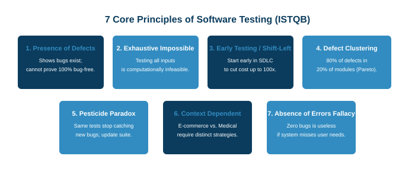
</div>

<!--
請看這張七大測試原則的全景心智圖。

從 Dijkstra 的根本真理、窮舉不可行性、測試左移的經濟效益、帕雷托 80/20 群聚、殺蟲劑抗藥性、領域情境相依，到零錯誤謬誤。

當你在規劃專案的品保策略與時程預算時，這七大原則是你最可靠的指導方針。

總結這張投影片，請記住這個核心觀念：七大測試原則在所有軟體研發階段，引導著工程團隊做出務實、高效的測試資源配置。
-->
---
<!-- _class: title-image-slide -->

## 軟體測試類型光譜全覽 (Testing Types Spectrum)

<div class="image-wrapper">
  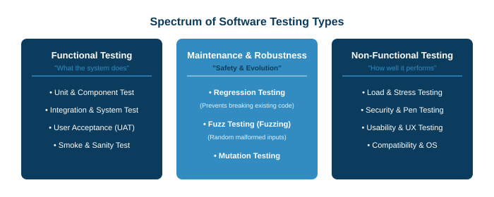
</div>

<!--
這張圖展現了軟體生命週期中宏大的測試類型全景。

測試在維度上分為：驗證商業邏輯與介面操作的「功能性測試 (Functional Testing)」，以及量測速度、負載、壓力、安全與災難復原的「非功能性測試 (Non-Functional Testing)」。

在階段上，則橫跨開發階段、發布階段與最後的使用者驗收階段。

總結這張投影片，請記住這個核心觀念：品質保證貫穿了功能驗證、非功能極限挑戰與整個軟體交付階段。
-->
---
## 專屬進階測試 1：回歸測試 (Regression Testing)

* **核心定義：**
  - 在程式碼庫被修改、重構或修復 bug 之後，重新執行既有的自動化測試套件，以確保**近期的新變更沒有意外破壞原本運作正常的舊功能**。
* **回歸風險的本質：**
  - 軟體工程實證研究顯示：高達 20% 至 50% 的 bug 修復，會在無意間於專案其他角落引入全新的副作用缺陷！
* **現代 CI/CD 流水線中的回歸防護：**
  - **輕量極速回歸：** 每次 `git push` 或發起 Pull Request (PR) 時，自動觸發毫秒級單元測試。
  - **全量深度回歸：** 每日午夜定時建置或發布前夕，跑完包含資料庫整合與端對端 UI 的完整回歸套件。
* **回歸測試案例選擇策略：**
  - **全部重測 (Retest All)：** 執行所有測試（全面但耗時長）。
  - **選擇性回歸 (Regression Test Selection, RTS)：** 利用程式碼覆蓋映射，僅挑選與本次修改方法有相依關係的測試案例。

<!--
剖析現代軟體工程持續交付的守護神：回歸測試 (Regression Testing)。

只要你動了程式碼——不管是加新功能、重構類別還是修一個小 typo——就有極高機率引發連鎖反應，弄壞原本好端端的舊功能。

在現代 CI/CD 中，自動化回歸測試是每次 Commit 的強制通關條件，確保「今天寫的新 code，絕對不破壞昨天已經驗證的承諾」。

總結這張投影片，請記住這個核心觀念：自動化回歸測試防止系統腐化，在軟體持續演進過程中捍衛既有功能的完整性。
-->
---
## 專屬進階測試 2：模糊測試 (Fuzz Testing / Fuzzing)

* **核心定義：**
  - 一種完全自動化、向受測程式介面大量注入**無效、畸形、半結構化或偽隨機惡意資料**的動態測試技術。
* **目標揪出的致命弱點：**
  - 記憶體損毀崩潰（C/C++/Rust 中的緩衝區溢位 Buffer Overflow、Use-After-Free 懸空指標、Double-Free 重複釋放）。
  - 未攔截的致命例外、無限迴圈、執行緒死結（Deadlock）與阻斷服務攻擊（DoS）。
* **主流模糊測試流派：**
  - **突變導向 (Mutation-based)：** 拿取合法的種子輸入（如正常 PDF 檔），隨機翻轉其位元與位元組。
  - **語法導向 (Generation-based)：** 依據嚴謹通訊協定語法規範，故意生成邊界畸形封包。
  - **覆蓋度引導 (Coverage-guided Fuzzing)：** 利用二進位插樁偵測程式碼分支，凡是能探索到全新執行路徑的畸形資料，優先保留作為下一輪突變種子（如 AFL、libFuzzer、Google OSS-Fuzz）。

<!--
模糊測試（Fuzzing）是當代資訊安全與核心系統軟體領域最強悍的自動化抓蟲神器。

它不像人類測試員那樣客客氣氣地輸入資料，而是如同拿著機關槍，以每秒數萬次的速度向系統傾瀉各種扭曲、損壞、隨機翻轉 bit 的畸形垃圾資料。

覆蓋度引導的 Fuzzer（如 AFL）更是聰明絕頂：一旦發現某個畸形資料竟然鑽進了一段從未被執行過的深層分支，立刻以它為基礎進行二次突變！Google 的 OSS-Fuzz 靠這招在開源世界揪出了數萬個隱蔽的零日漏洞。

總結這張投影片，請記住這個核心觀念：覆蓋度引導的模糊測試透過大規模隨機突變輸入，自動挖掘隱蔽的記憶體崩潰與資安零日漏洞。
-->
---
## 專屬進階測試 3：冒煙測試、健全測試與突變測試

* **冒煙測試 (Smoke Testing / 建置驗證測試)：**
  - 每次專案產出全新建置二進位檔時，執行的極速、非窮舉驗證（「通電打開時，主機板會不會冒煙？」）。
  - 若冒煙測試失敗，此建置直接判定死刑退回開發者，絕不浪費 QA 團隊人力進行後續細部測試。
* **健全測試 (Sanity Testing / 局部驗證)：**
  - 針對剛修復的特定小型 bug 或微幅補丁進行快速驗證，確認「回報的特定問題是否確實解決」，範圍極窄且專注。
* **突變測試 (Mutation Testing / 評估測試套件本身的品質)：**
  - 核心哲學：**「誰來測試這群測試程式？」**
  - 刻意在原始碼中人為注入微小的語法錯誤（「突變體 Mutants」，例如把 `>` 竄改成 `<`、把 `+` 換成 `-`）。
  - 若既有的測試套件順利報警噴錯，代表「殺死突變體 (Killed)」；若原始碼已被蓄意破壞而測試卻依然全綠通過，代表「突變體存活 (Surviving)」，揭示測試案例的致命盲點！

<!--
這裡介紹三種極具智慧的特種測試：

冒煙測試是看門狗：五分鐘快速確認專案能不能正常啟動，會不會一開機就冒煙。
健全測試是專案急診室：修完某個小問題，花五分鐘確認該問題是否確實閉環。
突變測試則最具哲學意涵：它回答了「誰來監督監督者？」透過在程式碼裡偷偷放蟲，看你的單元測試能不能把它揪出來。揪得出來代表測試給力，揪不出來代表你的單元測試都在打假球。

總結這張投影片，請記住這個核心觀念：冒煙測試守護建置品質、健全測試快速驗證補丁，而突變測試則用以檢驗測試套件本身的防禦實力。
-->
---
## 非功能性測試：負載測試、壓力測試與資安滲透

* **負載測試 (Load Testing)：**
  - 驗證系統在**預期的正常營運峰值流量**下（例如 5,000 位使用者同時在線購物），系統的回應延遲、吞吐量（RPS）與 CPU/記憶體資源開銷。
* **壓力測試 (Stress Testing)：**
  - 將系統的並發連線與交易量，**無情推向超過設計極限的崩潰臨界點**。
  - 核心目標：驗證系統在極限崩潰瞬間是否能「優雅降級 (Graceful Degradation)」，資料庫交易是否能安全 rollback，以及能否在流量回落後自動重啟復原。
* **資安滲透測試 (Security & Penetration Testing)：**
  - 檢驗系統對惡意攻擊的縱深防禦能力：防範 SQL 注入 (SQLi)、跨站腳本攻擊 (XSS)、身分越權訪問與 API 密鑰未授權存取。
  - 整合靜態與動態安全檢測工具（SAST / DAST），並由專業白帽駭客進行紅隊實戰攻防。

<!--
非功能性測試驗證的是系統在殘酷現實環境中的生存能力。

負載測試是模擬尖峰營業日：系統在預期的高負載下跑得順不順？
壓力測試則是把系統推向懸崖：塞爆它，看它是優雅地告訴客人「系統繁忙請稍候」，還是瞬間把記憶體噴光、資料庫髒寫入？
資安滲透測試則是從駭客視角出發，檢查有沒有注入漏洞或越權漏洞。

總結這張投影片，請記住這個核心觀念：非功能性測試在極端負載與惡意攻擊情境下，驗證軟體的效能韌性、容錯能力與資訊安全。
-->
---
## 經典軟體測試金字塔 (The Software Testing Pyramid)

<div style="text-align: center; margin-top: 10px;">
  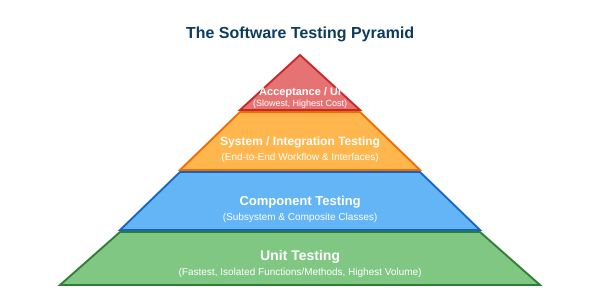
</div>

<!--
請看這座由 Mike Cohn 提倡、風靡全球的軟體測試金字塔。

金字塔底座是單元測試（Unit Tests）：速度極快、成本極低、完全隔離。專案應該擁有成千上萬個單元測試，毫秒級跑完。

中層是服務整合測試（Integration Tests）：驗證微服務 API 合約、資料庫查詢與訊息中介。

頂端是端到端測試（E2E / UI Tests）：模擬真人在瀏覽器裡點擊。因為 E2E 執行極慢、維護極為脆弱（UI 改個 class 就噴錯），它在測試組合中應該只佔最小的比例，專注守護關鍵營收路徑。

總結這張投影片，請記住這個核心觀念：維持寬廣厚實的快速單元測試底座，佐以整合測試，並以精簡的端對端測試守護核心旅程。
-->
---
## 開發測試的三大進階層次 (Development Testing)

* **單元測試 (Unit Testing)：**
  - 在完全隔離的沙盒環境中，驗證個別函式、演算法或物件類別的正確性。
  - 透過**測試替身 (Test Doubles: Mocks, Stubs, Fakes)** 徹底阻斷對真實資料庫、外部網路 API 與實體檔案系統的相依。
  - 由開發者在撰寫程式碼時同步編寫，並納入本機 Pre-commit 守門機制。
* **組件測試 (Component Testing)：**
  - 驗證多個相互協同的類別所組裝而成的子系統或獨立功能組件。
  - 焦點在於檢驗模組介面的通訊契約、資料序列化與內部流程整合。
* **系統測試 (System Testing)：**
  - 將所有子系統整合為單一完整的可執行應用，在類生產測試環境（Staging）中驗證端對端整體行為。
  - 檢驗全系統組件協同運作時產生的湧現行為（Emergent Behavior）、安全策略與效能瓶頸。

<!--
開發測試循序漸進分為三個層次：

單元測試用 Mock 物件把外部資料庫隔離掉，專注測算法。單元測試如果紅燈，工程師三秒鐘內就能定位到第幾行的問題。

組件測試把幾顆積木拼在一起，看模組邊界有沒有接錯水管。

系統測試把全部前後端、資料庫、快取全部串起來，在測試機房裡模擬真實世界上線。

總結這張投影片，請記住這個核心觀念：開發測試由孤立單元逐步擴展為協同組件，最終在完整系統環境中驗收。
-->
---
## 發布測試 vs. 使用者驗收測試

* **發布測試 (Release Testing / 上線前最後把關)：**
  - 由獨立於開發團隊的專職 QA / 測試團隊，針對預備發布的正式候選建置（Release Candidate）進行全面驗收。
  - **需求導向驗收：** 逐一對照功能需求規格書與驗收準則，確認每一項承諾皆已完整落實。
  - **情境工作流測試：** 模擬真實使用者全旅程操作（例如：下單、付款、推播、外送軌跡追蹤）。
* **使用者與驗收測試 (User & Acceptance Testing)：**
  - **Alpha 測試：** 在開發商內部實驗室環境中，由內部受信任的模擬使用者與同仁進行封閉式操作評估。
  - **Beta 測試：** 將軟體預先釋出給真實外部早期使用者，在多元硬體與真實網路環境中蒐集遙測數據與反饋。
  - **驗收測試 (Acceptance Testing)：** 依據正式商業採購合約規範，由買方客戶親自進行驗收簽核，決定是否支付專案款項。

<!--
當軟體開發告一段落，測試棒子交給專職 QA 團隊與真實客戶。

發布測試站在嚴謹的品保管制角度，確認所有合約需求都有被實作。

使用者測試則分為 Alpha 測試（內部自測）、Beta 測試（公測釣蟲），以及具有法律效力的驗收測試（Acceptance Testing）——通過了客戶才會付尾款。

總結這張投影片，請記住這個核心觀念：發布測試確認規格合約的達成，使用者驗收測試則確認軟體具備商業營運的合格品質。
-->
---
## 觀念檢核測驗 1：軟體測試哲學與原則

依據圖靈獎得主 Edsger Dijkstra 的經典測試箴言，以及軟體工程界提倡的「測試左移 (Shift-Left)」策略，軟體測試的核心能力範疇與最佳啟動時機為何？

- **A.** 測試能在早期需求階段透過數學證明軟體絕對百分之百沒有任何潛藏缺陷。
- **B.** 測試只能證明缺陷的存在而無法證明其不存在，且在需求階段及早揪出缺陷成本最低。
- **C.** 只要在持續交付流水線中不間斷地跑回歸測試，就能自動保證 100% 敘述涵蓋度。
- **D.** 測試能徹底根除生產環境中的缺陷群聚現象，進而完全取代客戶的使用者驗收測試。

<!--
讓我們透過觀念測驗 1 來檢核對測試基本哲學的理解。

回想 Dijkstra 對測試能力的深刻洞察，並結合測試左移的經濟效益。

仔細評估選項，挑選出唯一完全精準契合兩大概念的選項。
-->
---
## 觀念檢核測驗 1：解答與解析

- **正確答案：B**
- **詳細解析：**
  - Edsger Dijkstra 著名的測試真理明確指出：*「程式測試只能用來證明缺陷的存在，但絕無法證明軟體沒有任何缺陷！」* 測試提供實證，但無法證明 100% 零 bug。
  - 測試左移（Shift-Left）強調測試活動必須從需求分析與架構設計便儘早啟動，因為在專案早期解決問題的成本，比產品上線後在維護階段修復便宜 10 到 100 倍！
  - *其他選項為何錯誤：* 選項 A 宣稱能證明零 bug，違背 Dijkstra 真理；選項 C 混淆了結構涵蓋度與回歸測試；選項 D 錯誤宣稱能取代客戶驗收。

<!--
正確答案是 B。

測試證明有 bug，不能證明無 bug；越早抓到 bug，修復代價越低廉。

總結這張投影片，請記住這個核心觀念：測試揭露缺陷的存在而非證明其不存在，早期介入能創造最高的品保經濟效益。
-->
---
<!-- _class: lead -->
<!-- header: '7.2 黑箱測試技術' -->

# **7.2 黑箱測試技術 (Black-Box Testing)**

> "Testing without a specification is like exploring a dark cave without a map: you might find something, but you have no idea if you're in the right cavern."  
> *(沒有規格書的測試，就像沒有地圖在漆黑的洞穴中摸索：你或許會撞見某些東西，但你根本無從得知自己是否走在正確的坑道中。)*

<!--
我們現在轉進 7.2 節：黑箱測試技術（Black-Box Testing）。

黑箱測試又稱為「規格導向測試」或「功能性測試」。測試人員在完全不窺探內部原始碼的前提下，純粹依據功能規格書與驗收準則，設計出高嚴謹度的輸入輸出測試案例。

在這一節中，我們將對比黑箱與白箱測試、推導邊界值分析的四大數學公式、掌握等價劃分法，並透過三角形分類、逢甲游泳池、二分搜尋法與萬年曆 nextDate 等經典案例親手演練。

總結這張投影片，請記住這個核心觀念：黑箱測試直接從功能規格書中推導嚴密的輸入輸出測試案例組合。
-->
---
## 黑箱測試 vs. 白箱測試 (Black-Box vs. White-Box)

* **黑箱測試 (Black-Box / 規格導向 / 功能性測試)：**
  - **觀察視角：** 測試人員將待測軟體視為一個完全不透明的密閉黑盒子，對其內部的原始碼、演算法與記憶體資料結構一無所知。
  - **測試依據：** 直接源自功能需求規格書、使用者故事、API 介面合約與業務規範。
  - **核心優勢：** 專注檢驗系統是否能滿足使用者真實期待；完全不受開發人員既有程式碼思路的先入為主偏見所干擾。
* **白箱測試 (White-Box / 結構導向 / 玻璃箱測試)：**
  - **觀察視角：** 測試人員擁有檢視內部原始碼、控制流圖（CFG）、條件分支與邏輯判斷的完全透明權限。
  - **測試依據：** 源自程式碼的控制邏輯、迴圈結構、條件判斷式與架構組件。
  - **核心優勢：** 精準揪出未被執行的死代碼（Dead Code）、未被覆蓋的邏輯漏洞與邊界條件瑕疵。

<!--
對比軟體測試的兩大主流典範：

黑箱測試就像開車：你不需要懂引擎內部曲軸如何轉動，你踩油門車子就要前進，踩煞車就要停下。測試完全基於外部契約。

白箱測試就像技師修車：打開引擎蓋，仔細測量齒輪咬合、電壓波形與每一條油路的流動。

兩者是相輔相成的左右手。

總結這張投影片，請記住這個核心觀念：黑箱從外部驗證功能需求是否被滿足，白箱從內部檢視程式碼執行路徑是否健全。
-->
---
<!-- _class: title-image-slide -->

## 視覺比對：黑箱規格驗證 vs. 白箱結構探索

<div class="image-wrapper">
  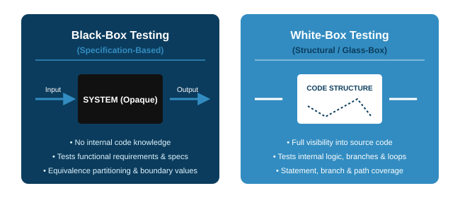
</div>

<!--
請看這張生動的對照示意圖。

左邊黑箱測試者站在系統圍牆外，按照規格書餵入測試資料，觀察輸出是否正確。

右邊白箱測試者走入透光透明的玻璃屋內部，順著控制流程圖（Control Flow Graph）追蹤每一個 if 判斷、while 迴圈與變數指派。

總結這張投影片，請記住這個核心觀念：黑箱關注軟體「做了什麼 (What)」，白箱審查軟體「如何執行 (How)」。
-->
---
<!-- _class: title-image-slide -->

## 5 大主流黑箱測試設計方法

<div class="image-wrapper">
  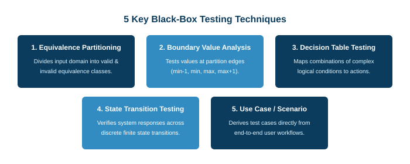
</div>

<!--
這是黑箱測試技術的五大家族：

1. 邊界值分析（BVA）：專門獵殺邊界處的差一錯誤（Off-by-One）。
2. 等價劃分法（EP）：將無窮輸入集精簡為代表性分類。
3. 決策表測試：釐清複雜的布林組合商業規則。
4. 狀態轉移測試：驗證反應式有限狀態機。
5. 使用案例情境測試：驗收端對端的使用者價值旅程。

接下來讓我們逐一攻克。

總結這張投影片，請記住這個核心觀念：綜合運用邊界值、等價劃分、決策表、狀態機與情境測試，能達成高覆蓋度的黑箱測試防護。
-->
---
## 邊界值分析 (BVA)：單一錯誤假設 (Single Fault Assumption)

* **為什麼邊界最容易出錯？（著名的「差一錯誤 / Off-by-One」）：**
  - 人類工程師在寫條件式時，極常搞混 `<` 與 `<=`, `>` 與 `>=`，或是陣列索引從 0 還是 1 開始。
  - 軟體實證統計表明：**超過 60% 的軟體功能缺陷，直接爆發在輸入數值範圍的臨界邊界上！**
* **單一錯誤假設 (Single Fault Assumption)：**
  - 假設軟體的故障，絕大多數情況下是由**單一輸入變數**的邊界異常所引發，而非多個變數同時在邊界發生故障。
  - *工程操作：* 當測試變數 $X$ 的各個臨界邊界值時，其餘所有變數均固定維持在安全的中間正常數值 (`norm`)。
* **最壞情況測試 (Worst-Case Testing / 拒絕單一錯誤假設)：**
  - 當多個輸入變數在內部邏輯中存在緊密相互關聯時（例如：`if (exam <= 60 && hw <= 60)`），單一錯誤假設將會失效！
  - 此時必須測試所有變數邊界數值的**笛卡兒完全交叉乘積 (Cartesian Product)**。

<!--
為什麼軟體工程師對「邊界」如此著迷？

因為人類就是容易犯錯。寫 code 時，寫錯一個等於符號（`<` 寫成 `<=`），或是迴圈多跑了一次，這就是臭名昭著的「差一錯誤 (Off-by-One Error)」。超過六成的 bug 都集中在邊界上！

為了在有限時間內設計測試，我們採用「單一錯誤假設」：一次只測試一個變數的極限值，把其他變數鎖定在安全的正常值（norm）。

但如果變數之間有連帶複合邏輯，我們就必須採用「最壞情況測試」，對所有邊界進行全面排列組合。

總結這張投影片，請記住這個核心觀念：單一錯誤假設一次只測試一個變數的邊界，最壞情況測試則窮舉多變數的邊界組合。
-->
---
## 邊界值分析的 4 大經典計算公式

<div style="text-align: center; margin-top: 10px;">
  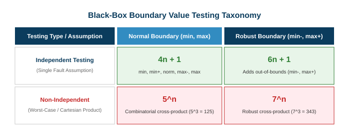
</div>

* **針對 $n$ 個獨立輸入變數，四大測試類型的案例數公式：**
  1. **獨立正常邊界 (Independent Normal BVA)：** $4n + 1$ （每變數測 `min, min+, max-, max`，加 1 個全 `norm`）。
  2. **獨立健壯邊界 (Independent Robust BVA)：** $6n + 1$ （額外加入越界無效值 `min-` 與 `max+`）。
  3. **最壞情況正常邊界 (Worst-Case Normal BVA)：** $5^n$ （每個變數取 5 個點的笛卡兒完全交叉組合）。
  4. **最壞情況健壯邊界 (Worst-Case Robust BVA)：** $7^n$ （每個變數取 7 個點的笛卡兒完全交叉組合）。

<!--
請大家務必把這四個公式背下來，這是軟工考試與面試的常客！

假設有 n 個變數：
1. 獨立正常：每個變數測 4 個邊界點（min, min+, max-, max），其他變數給 norm，最後加一個全 norm 的基本款，答案是 4n + 1！3 個變數就是 13 個測試案例。
2. 獨立健壯：如果還要測試越界報錯（min- 和 max+），每個變數測 6 個點，公式是 6n + 1！3 個變數就是 19 個。
3. 最壞情況正常：每個變數 5 個點完全交叉相乘，5 的 n 次方！
4. 最壞情況健壯：每個變數 7 個點完全交叉相乘，7 的 n 次方！

總結這張投影片，請記住這個核心觀念：單一錯誤假設下的測試量隨變數線性成長 (4n+1, 6n+1)，最壞情況則隨變數呈指數級爆炸 (5^n, 7^n)。
-->
---
## 邊界案例實戰：三角形分類問題 (The Triangle Problem)

* **題目規格書：**
  - 輸入三個整數 $a, b, c \in [1, 200]$ 代表三角形邊長。
  - 輸出結果：*正三角形 (Equilateral)*、*等腰三角形 (Isosceles)*、*不等邊三角形 (Scalene)* 或 *非三角形 (Non-Triangle)*。
* **套用獨立正常邊界公式 ($4n + 1 = 13$ 個測試案例)：**
  - 固定 $b, c = 100$ (`norm`)。測試 $a \in \{1, 2, 199, 200\}$。
  - 輪流對 $b$ 與 $c$ 重複上述動作，最後加上 $(100, 100, 100)$。
* **致命的「多樣性匱乏 (Diversity Deficit)」缺陷：**
  - 請仔細觀察這 13 個測試案例：在每一組測試中，永遠都有兩條邊**同時等於 100**！
  - 結果：這 13 個測試案例只能測到正三角形 $(100,100,100)$ 和等腰三角形；**整套測試完全沒有任何一筆不等邊三角形 (Scalene)！**
* **軟體工程解方：**
  - 各變數採用動態隨機的非對稱正常值（如 $a_{\text{norm}}=100, b_{\text{norm}}=101, c_{\text{norm}}=102$）。
  - 結合**輸出導向劃分法 (Output-Guided Partitioning)**，強制要求測試套件必須涵蓋所有合法輸出類型！

<!--
三角形問題是測試學界最著名的教科書案例，它生動揭示了「多樣性匱乏」的死角。

如果你死板地套用 4n+1 公式，將 norm 一律設為 100，產生的 13 個測試案例裡，永遠有兩條邊等於 100！結果你跑了 13 個測試，卻連一個不等邊三角形都沒測到！

這個教訓告訴我們：切勿盲信公式。在設計測試時，永遠要回頭檢查輸出結果：我的測試案例是否完整涵蓋了所有的預期輸出分類？

總結這張投影片，請記住這個核心觀念：死板的邊界取值容易造成輸出覆蓋盲點，務必結合輸出導向驗證以確保測試多樣性。
-->
---
## 等價劃分法 (Equivalence Partitioning, EP)

* **等價劃分核心哲學：**
  - 將系統龐大無窮的輸入與輸出數值空間，切割為數個有限的「等價類別（Equivalence Classes）」。
  - 假設在同一個等價類別內，程式對其中任何一個數值的處理邏輯與運算結果完全相同。
  - 因此，**只要從每個等價類別中挑選「一個」代表值進行測試，便等同於測試了該類別內的所有數值！**
* **弱等價覆蓋 (Weak EP)：**
  - 建基於**單一錯誤假設**。
  - 僅要求每個變數劃分出的每個等價區間，在整個測試套件中**至少被覆蓋到一次**。
  - 最小所需測試案例數 = 各變數等價區間數量中的最大值：$\max(|P_1|, |P_2|, \dots, |P_n|)$。
* **強等價覆蓋 (Strong EP)：**
  - 拒絕單一錯誤假設，關注多變數交互作用。
  - 測試所有變數等價區間的**笛卡兒完全交叉乘積**：
    $$\text{總測試案例數} = |P_1| \times |P_2| \times \dots \times |P_n|$$

<!--
等價劃分法（Equivalence Partitioning, EP）是軟體測試最優雅的化簡工具。

如果一個系統對 1 到 100 之間的所有數字處理邏輯完全一樣，測 42 號跟測 73 號沒有任何差別，測一個就夠了！

弱等價（Weak EP）以最精簡的案例數，確保每個等價類別至少被測過一次。強等價（Strong EP）則測試所有等價類別的交叉排列組合。

總結這張投影片，請記住這個核心觀念：弱等價覆蓋以極簡案例確保各區間被執行，強等價覆蓋則檢驗跨變數區間的完整交互組合。
-->
---
## 等價劃分實戰 1：單變數區間測試 (學期成績系統)

> **規格書：** 逢甲大學成績登錄系統接受整數成績輸入，合法分數範圍為 **0** 至 **100** 分。

* **等價區間 1：無效負值區間 ($\text{成績} < 0$)：**
  - *代表性測試值：* **$-15$**
  - *預期系統輸出：* 攔截並報錯（"成績不得為負數"）。
* **等價區間 2：合法及格/成績區間 ($0 \le \text{成績} \le 100$)：**
  - *代表性測試值：* **$75$**
  - *預期系統輸出：* 成功儲存並正常計算學期 GPA。
* **等價區間 3：無效超標區間 ($\text{成績} > 100$)：**
  - *代表性測試值：* **$135$**
  - *預期系統輸出：* 攔截並報錯（"成績不得大於 100 分上限"）。
* **軟體工程實務箴言：**
  - 一套合格的測試套件，**必須同時涵蓋有效等價類別（驗證功能）與無效等價類別（驗證防禦性例外處理）**！

<!--
這是一個最直觀的單變數等價劃分實例：學期成績登錄。

整數軸被清晰劃分為三個等價類別：小於 0 的無效區間、0 到 100 的合法區間，以及大於 100 的無效區間。

我們在每個區間各挑一顆代表值：-15、75、135。

請牢記：測試絕不能只測有效區間！驗證系統能優雅攔截無效區間並安全報錯，是打造強韌軟體的基本功。

總結這張投影片，請記住這個核心觀念：等價劃分必須同時包含驗證業務邏輯的有效區間，與檢驗防禦機制的無效區間。
-->
---
## 等價劃分實戰 2：多變數逢甲大學游泳池票價推算

> **規格書：** 游泳池門票定價受三大變數制約：**年齡 (Age)**、**入場時段 (Time)** 與 **會員身份 (Membership)**。

<div style="text-align: center; margin-top: 10px;">
  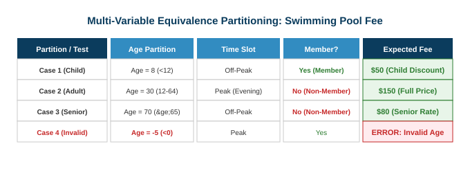
</div>

* **識別出的輸入等價區間：**
  - **年齡 ($P_{\text{Age}}$)：** 兒童 ($< 12$)、成人 ($12\text{--}64$)、敬老長者 ($\ge 65$)、無效負值 ($< 0$)。（共 4 個區間）
  - **時段 ($P_{\text{Time}}$)：** 晨間早鳥離峰 (Off-Peak)、晚間尖峰 (Peak)。（共 2 個區間）
  - **身份 ($P_{\text{Member}}$)：** 會員 (享專屬折扣)、非會員 (全額原價)。（共 2 個區間）
* **測試案例數量對比：**
  - **弱等價覆蓋 (Weak EP)：** $\max(4, 2, 2) = \mathbf{4}$ 個測試案例即可涵蓋所有區間。
  - **強等價覆蓋 (Strong EP)：** $4 \times 2 \times 2 = \mathbf{16}$ 個測試案例，窮舉所有票價定價組合。

<!--
這是一個多變數的等價劃分案例：逢甲大學游泳池門票。

票價由三個變數決定：年齡有 4 個區間，時段有 2 個區間，會員有 2 個區間。

如果採用弱等價（Weak EP），我們只要設計 4 個測試案例，就能把這 8 個區間全部覆蓋一遍。
如果採用強等價（Strong EP），我們則需要 4 乘 2 乘 2，共 16 個測試案例，窮舉所有可能的人口變數與時段排列。

總結這張投影片，請記住這個核心觀念：弱等價測試量取決於單一最大區間數，而強等價則需要測試所有區間的交叉笛卡兒積。
-->
---
## 等價劃分實戰 3：二分搜尋法 (Binary Search) 測試規劃

> **規格書：** `Search(Key: int, A: Array) -> (Found: bool, Index: int)`

* **輸入陣列結構等價區間：**
  - 空陣列 ($a^0$：陣列長度 $= 0$)。
  - 單一元素陣列 ($a^1$：陣列長度 $= 1$)。
  - 多元素已排序陣列 ($a^*$：陣列長度 $> 1$)。
* **輸出結果與搜尋鍵位置等價區間：**
  - **成功找到 ($f^t$)：** 目標值位於陣列第一個位置 ($c^1$)、中間位置 ($c^m$) 或最後一個位置 ($c^l$)。
  - **未找到 ($f^f$)：** 目標值小於陣列最小值 ($v^{<\text{min}}$)、大於陣列最大值 ($v^{>\text{max}}$) 或介於相鄰元素之間。
  - **無效輸入 ($k^!$)：** 陣列為 Null 或未排序。
* **弱覆蓋測試規劃：**
  - 系統化推導出 8 組具備結構代表性的測試案例 ($R_1 \text{--} R_8$)，全面覆蓋所有邊界狀況。

<!--
二分搜尋法（Binary Search）看似簡單，但其實藏著大量邊界地雷。

在規劃等價劃分時，我們不僅對「輸入陣列的長度」進行分割（空陣列、單元素、多元素），更對「目標值所在的位置」進行嚴密劃分（開頭、中間、結尾、找不到、越界）。

透過這種雙向維度的等價劃分，能直接收斂出 8 個極具殺傷力的測試案例。

總結這張投影片，請記住這個核心觀念：對輸入資料結構與輸出回傳位置進行雙向等價劃分，能透徹檢驗搜尋演算法的邊界。
-->
---
<!-- _class: title-image-slide -->

## 二分搜尋法：完整等價劃分測試案例矩陣

<div class="image-wrapper">
  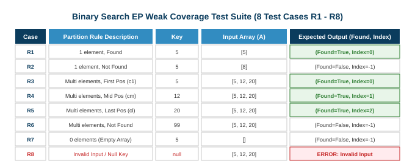
</div>

<!--
請看二分搜尋法的這份 8 案例測試矩陣。

R1 測試空陣列；
R2 測試單元素命中；
R3 測試單元素未命中；
R4、R5、R6 分別測試多元素陣列中的頭、中、尾位置；
R7 測試比最小值還小的失手情境；
R8 測試比最大值還大的失手情境。

僅僅 8 個測試案例，便滴水不漏地覆蓋了二分搜尋法的全部邏輯。

總結這張投影片，請記住這個核心觀念：結構化的 8 案例測試矩陣，能在零重複的前提下徹底檢驗二分搜尋法的每一種情境。
-->
---
## 邊界與等價實戰：萬年曆 nextDate 測試規劃

> **規格書：** `nextDate(month: int, day: int, year: int) -> String`，其中年份 $\text{Year} \in [1800, 2048]$。

<div style="text-align: center; margin-top: 10px;">
  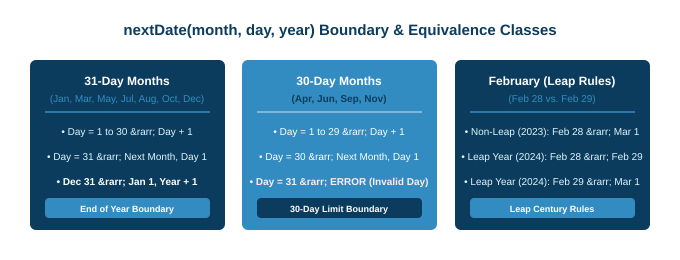
</div>

* **關鍵邊界測試條件規劃：**
  - **一般大月跨月：** `2024-01-31` $\to$ `2024-02-01`
  - **跨年翻轉：** `2024-12-31` $\to$ `2025-01-01`
  - **30 天小月邊界：** `2024-04-30` $\to$ `2024-05-01` （4 月 31 日為非法無效日！）。
  - **閏年與世紀閏年規則驗證：**
    - `2024-02-28` $\to$ `2024-02-29` （逢 4 閏年）。
    - `2023-02-28` $\to$ `2023-03-01` （一般平年）。
    - `1900-02-28` $\to$ `1900-03-01` （逢 100 平年，不可被 400 整除）。
    - `2000-02-28` $\to$ `2000-02-29` （逢 400 世紀大閏年）。

<!--
nextDate（計算明天的日期）是軟體測試學界的黃金標準範例。

看似單純的日期跳轉，內部卻交織著複雜的格里曆曆法邊界：大小月、跨年、逢四閏年、逢百不閏、逢四百又閏！

如果你的程式碼只寫了 `if (year % 4 == 0)`，1900 年 2 月 28 日就會算出錯誤的 2 月 29 日！

總結這張投影片，請記住這個核心觀念：日期計算需要嚴密檢驗大小月邊界、年終翻轉與多層次的閏年曆法規則。
-->
---
<!-- _class: title-image-slide -->

## 萬年曆 nextDate：完整等價劃分測試案例矩陣

<div class="image-wrapper">
  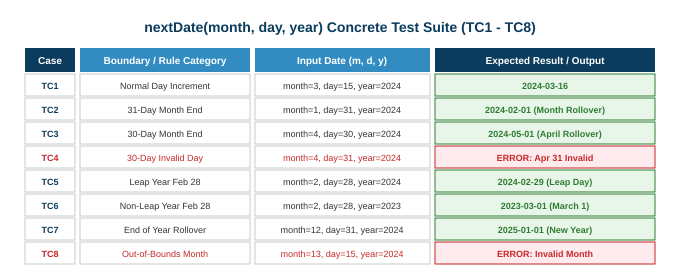
</div>

<!--
請看這份清晰的 nextDate 測試案例表格。

TC1 到 TC8 系統化驗證了：一般月中遞增、小月換月、大月換月、跨年換年、四年一閏、一般平年、百年不閏、四百年大閏，以及非法日期的防禦性拋錯。

每一行測試都有其不可替代的工程驗收使命。

總結這張投影片，請記住這個核心觀念：系統化的表格化測試設計，能確保複雜曆法邊界條件獲得完整無死角的驗收。
-->
---
## 觀念檢核測驗 2：邊界值分析 (BVA)

在單一錯誤假設 (Single Fault Assumption) 之下，若要針對一個擁有 $n = 4$ 個彼此獨立輸入變數的函式，執行「獨立正常邊界值分析 (Independent Normal BVA)」，總共需要設計幾個測試案例？

- **A.** 16 個測試案例，由評估 $2^n$ 個邊界極值組合推導而來。
- **B.** 17 個測試案例，由 $4n + 1$ 公式（每個變數測 4 個邊界點加上 1 個正常基準點）計算而得。
- **C.** 25 個測試案例，由 $6n + 1$ 公式包含健壯性越界數值計算而得。
- **D.** 625 個測試案例，由 $5^n$ 最壞情況完全交叉笛卡兒積計算而得。

<!--
讓我們檢核對邊界值分析四大公式的計算能力。

題意條件：單一錯誤假設、獨立正常邊界、變數數量 n = 4。

回想剛才學過的數學公式，迅速在心中算出正確答案。
-->
---
## 觀念檢核測驗 2：解答與解析

- **正確答案：B**
- **詳細解析：**
  - 在單一錯誤假設下進行「獨立正常邊界值分析 (Independent Normal BVA)」，每個變數必須測試 4 個邊界點（`min, min+, max-, max`），此時其他變數皆保持為正常值 (`norm`)。
  - 對於 $n$ 個變數，邊界測試共產生 $4 \times n$ 個案例；再加上 1 個所有變數皆為正常值的共用基準案例 (`norm, norm, ...`)，得出標準公式：
    $$\text{總測試案例數} = 4n + 1 = 4(4) + 1 = 17 \text{ 個測試案例}$$
  - *其他選項為何錯誤：* 選項 A (16) 混淆為二進位真值表；選項 C (25) 為獨立健壯測試 ($6n+1 = 6(4)+1 = 25$)；選項 D (625) 為最壞情況測試 ($5^n = 5^4 = 625$)。

<!--
正確答案是 B。

每個變數測 4 個邊界點，四四十六，再加上一個全正常案例，剛好十七個測試。

總結這張投影片，請記住這個核心觀念：獨立正常邊界測試需 4n+1 個案例，隨輸入變數呈線性比例增長。
-->
---
<!-- _class: lead -->
<!-- header: '7.3 組合與行為測試' -->

# **7.3 組合測試與行為塑模測試**

> "Combinatorial explosion is the nemesis of exhaustive testing; pairwise testing is the engineer's sharpest scalpel."  
> *(組合爆炸是窮舉測試的終極剋星；而結對測試，則是軟體工程師最鋒利的手術刀。)*

<!--
我們現在邁入 7.3 節：組合測試與行為測試方法。

當系統涉及多個設定選項、互動複選框或錯綜複雜的商業規則時，排列組合會瞬間引發「組合爆炸」。

在這一節中，我們將學習如何運用結對測試（All-Pairs / Pairwise Testing）破解組合爆炸、掌握決策表測試以梳理複雜布林邏輯，並探討狀態轉移與使用案例情境測試。

總結這張投影片，請記住這個核心觀念：組合測試與決策表技術將繁複的多變數狀態空間，化簡為高投報率的精確測試集。
-->
---
## 結對測試 (All-Pairs / Pairwise Testing)

* **棘手的「組合爆炸 (Combinatorial Explosion)」問題：**
  - 若要對 $k$ 個參數（每個參數有 $v$ 個選項）進行強等價全排列組合測試，需要 **$v^k$ 個測試案例**！
  - *實例：* 一個擁有 10 個下拉選單、每選單各 3 個選項的網頁，全組合需要 $3^{10} = \mathbf{59,049}$ 個測試案例！
* **經驗實證的結對法則 (The Pairwise Principle)：**
  - 美國國家標準與技術研究院 (NIST) 的大規模實證研究顯示：**高達 67% 至 93% 的軟體缺陷，皆是由「至多 2 個參數（Pairs）」的交互作用所觸發！**

<div style="text-align: center; margin-top: 10px;">
  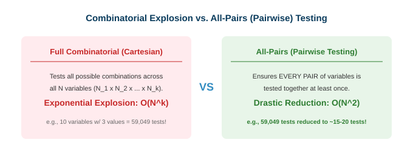
</div>

* **不可思議的工程價值：**
  - 結對測試強制保證**任意兩個參數的每一對數值組合，都至少在某一個測試案例中共同出現過一次**。
  - 將 59,049 個測試案例，驚人地壓縮至僅需 **15 到 20 個測試案例**即可達成！

<!--
請看面對「組合爆炸」時的神級解法：結對測試（All-Pairs）。

十個選單各三個選項，全部排列組合要將近六萬個測試！根本不可能人工測完，跑自動化也極度耗時。

然而美國 NIST 的大量實證研究發現：軟體界七到九成以上的 bug，都是被「兩個變數」的互動所觸發——例如某個特定瀏覽器配上某個特定作業系統。

結對測試透過演算法，確保所有兩兩配對都被測到一次，直接把六萬個測試壓縮到二十個以內！

總結這張投影片，請記住這個核心觀念：結對測試在消弭組合爆炸的同時，以極精簡的案例數捕捉絕大多數的參數交互作用缺陷。
-->
---
## 決策表測試 (Decision Table Testing)

* **核心概念與目標：**
  - 專門用以規格化與測試複雜商業規則的結構化表格工具，特別適合多重條件判斷決定不同動作的情境。
* **決策表的標準四象限結構：**
  - **條件樁 (Condition Stubs)：** 列出所有可能的輸入條件與狀態判斷。
  - **動作樁 (Action Stubs)：** 列出系統可能觸發的所有輸出動作。
  - **規則欄 (Rules / Columns)：** 每一垂直欄代表一組特定的條件組合 ($T/F$)，以及該組合下觸發的特定動作 ($X$)。

<div style="text-align: center; margin-top: 10px;">
  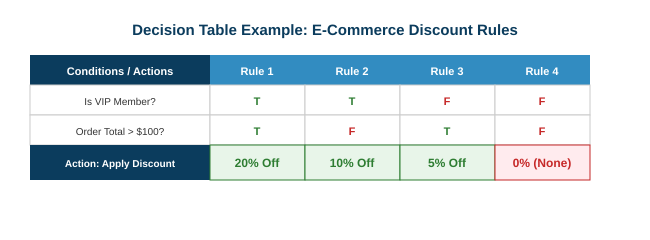
</div>

<!--
當產品規格充滿了「如果...而且...但是如果...就執行...」的繁雜業務規則時，決策表測試就是你的定海神針。

決策表上半部是條件，下半部是動作，每一縱欄就是一條規則。

決策表最強大的地方在於它的「窮舉可視化」：表格一列出來，有沒有哪一種條件組合被需求分析師給遺漏了，當場一目了然！

總結這張投影片，請記住這個核心觀念：決策表有系統地整理複雜的多條件業務規則，杜絕遺漏的邊界邏輯。
-->
---
## 狀態轉移測試與使用案例情境測試

* **狀態轉移測試 (State Transition Testing)：**
  - 適用於具備連續生命週期的反應式狀態系統（例如：外送訂單、自動櫃員機 ATM、遊戲引擎）。
  - 依據有限狀態機（FSM），塑模狀態、觸發事件、守衛條件與轉換行為。
  - **三大測試涵蓋目標：**
    1. *全狀態覆蓋 (All-States)：* 每個合法狀態至少被造訪過一次。
    2. *全轉換覆蓋 (All-Transitions)：* 每一條合法的狀態轉移路徑皆被執行過。
    3. *無效轉換防禦測試：* 驗證非法狀態轉移是否被安全攔截（例如：試圖對「已取消」的訂單執行「出貨」）。
* **使用案例與情境測試 (Use Case Scenario Testing)：**
  - 直接源自敏捷使用者故事與 UML 使用案例規格書。
  - **主要成功路徑 (Happy Path)：** 驗收使用者順暢達成商業目標的核心動線。
  - **例外與替代路徑：** 檢驗付款失敗、超額提領或網路瞬斷等邊界情境。

<!--
狀態轉移測試與使用案例情境測試關注於時間跨度上的動態行為。

在狀態轉移測試中，除了測試合法的走法（下單 -> 接單 -> 配送 -> 結算），更要測「非法的走法」：如果對一張已經取消的訂單按下出貨，系統會不會報警擋下？

使用案例測試則是模擬真實使用者的操作旅程，驗收主流程與備援路徑。

總結這張投影片，請記住這個核心觀念：狀態測試守護實體生命週期的合法性，情境測試驗收端對端的使用者目標。
-->
---
## 觀念檢核測驗 3：組合測試

為什麼結對測試 (All-Pairs / Pairwise Testing) 在現代軟體工程中，被公認為投資報酬率 (ROI) 最高的前端與配置測試設計技術之一？

- **A.** 它能完整測試所有變數的 $N$ 維完全交叉排列組合，保證達成 100% 路徑涵蓋度。
- **B.** 它需要完整檢視原始碼控制流圖，能夠完全取代單元測試與整合測試。
- **C.** 它能大幅壓縮龐大的測試案例集，同時在實證上能捕捉 70% 至 90% 以上由參數交互作用引發的缺陷。
- **D.** 它能完全取代邊界值分析，自動生成所有的無效極限邊界數值。

<!--
讓我們檢驗對結對測試核心價值的理解。

思考為什麼微軟、Google 等大廠廣泛採用 Pairwise 工具來縮減測試矩陣。

挑選出精準說明其 ROI 與實證數據支持的選項。
-->
---
## 觀念檢核測驗 3：解答與解析

- **正確答案：C**
- **詳細解析：**
  - 美國 NIST 的大量實證研究顯示：高達 67% 至 93% 的軟體缺陷是由至多 2 個參數（Pairs）的交互作用所觸發。
  - 結對測試將全排列組合的 $O(v^k)$ 指數級測試量，戲劇性地壓縮至 $O(v^2 \log k)$（例如從數萬個測試壓縮到 20 個以內），卻能精準獵殺絕大多數的參數交互作用缺陷，具備無與倫比的高投資報酬率。
  - *其他選項為何錯誤：* 選項 A 錯誤宣稱測了全部 N 維組合；選項 B 錯誤宣稱它是白箱且能取代整合測試；選項 D 錯誤宣稱它能取代邊界值分析（兩者應互相搭配）。

<!--
正確答案是 C。

結對測試的精髓在於：以極限壓縮的測試成本，捕捉絕大多數的參數交互作用缺陷。

總結這張投影片，請記住這個核心觀念：結對測試透過指數級壓縮測試規模，以極高投報率捕捉絕大多數的參數交互缺陷。
-->
---
<!-- _class: lead -->
<!-- header: '7.4 白箱結構測試' -->

# **7.4 白箱結構測試技術 (White-Box Testing)**

> "You cannot inspect quality into a product, but structural testing ensures no dark corners remain uninspected."  
> *(你無法單靠檢驗把品質硬塞進產品中，但結構測試能確保程式碼沒有任何陰暗角落逃過審查。)*

<!--
現在我們邁入第二部分：白箱結構測試技術。

在白箱測試中，我們直視系統透明的玻璃內部，檢視原始碼、控制流圖（Control Flow Graph）、條件判斷式與執行路徑。

在這一節中，我們將介紹涵蓋度包裝階層（Subsumption）、確立全章共用的單一標準基準程式碼，並深入探討敘述涵蓋度、分支涵蓋度、條件涵蓋度，以及現代編譯器短路求值（Short-Circuit）所引發的奇妙悖論。

總結這張投影片，請記住這個核心觀念：白箱結構測試衡量測試套件執行內部程式邏輯與決策分支的徹底程度。
-->
---
## 白箱測試基礎與涵蓋度包裝階層 (Subsumption Hierarchy)

* **核心定義：**
  - 在完全掌握內部原始碼、控制流圖 (CFG) 與邏輯表達式的前提下設計與度量測試。
* **包裝原則 (The Subsumption Principle / $A \implies B$)：**
  - 涵蓋度準則 $A$ **包裝 (Subsumes)** 準則 $B$，若且唯若：任何能達成準則 $A$ 100% 覆蓋的測試套件，**保證必定同時達成**準則 $B$ 的 100% 覆蓋！
* **經典涵蓋度包裝階層鏈：**
  - $\text{敘述 (SC)} \le \text{分支 (BC)} \le \text{分支/條件 (BCC)} \le \text{MC/DC} \le \text{多重條件組合 (MCC)} \le \text{路徑 (PC)}$。

<div style="text-align: center; margin-top: 10px;">
  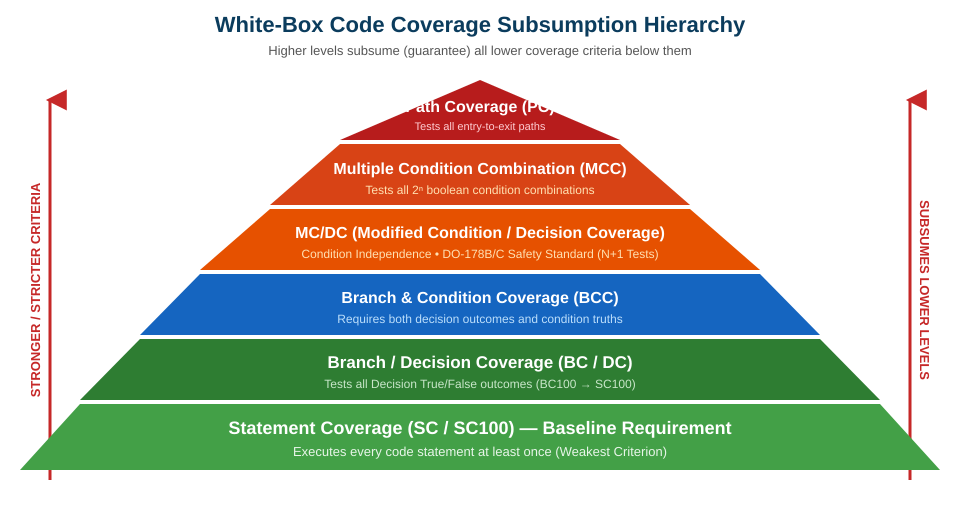
</div>

<!--
白箱測試透過量測「覆蓋了哪些程式碼」來評估測試的徹底性。

為了比較不同測試指標的強弱，軟體工程定義了「包裝原則 (Subsumption)」：如果做到 A 100%，就保證 B 也必定 100%，我們就說 A 包裝了 B。

如階層圖所示：敘述涵蓋度在底層。分支涵蓋度包裝了敘述涵蓋度。再往上則是條件組合、MC/DC 與路徑涵蓋度。

總結這張投影片，請記住這個核心觀念：較強的結構涵蓋度準則包裝了較弱的準則，提供更嚴謹的執行覆蓋保證。
-->
---
## 涵蓋度全準則分析：標準基準程式碼 (Standard Benchmark)

為了嚴格、公正且具體地比較所有白箱涵蓋度準則，我們在後續所有分析中**統一使用完全相同的標準基準程式碼**：

```java
// 全章統一比對專用標準基準程式碼 (Standard Benchmark Program)
void process(int A, int B, int X) {
    if (A > 1 && B == 0) {  // 決策點 1 (b1): 條件 c1 && 條件 c2
        Y = A;
    }
    if (A == 2 || X > 1) {  // 決策點 2 (b2): 條件 c3 || 條件 c4
        Y = X;
    }
    print(Y);
}
```

* **決策點 1 ($b_1$)：** `(A > 1) && (B == 0)`
  - 包含兩個原子條件：$c_1: (A > 1)$, $c_2: (B == 0)$。
* **決策點 2 ($b_2$)：** `(A == 2) || (X > 1)`
  - 包含兩個原子條件：$c_3: (A == 2)$, $c_4: (X > 1)$。

<!--
為了讓大家的理解無比清晰，後續講到敘述、分支、條件、MC/DC 時，我們全部都套用這同一支 Java 基準函式。

請看這支函式：輸入三個整數 A、B、X。
包含兩個 if 決策點：
決策一 (b1) 是一個 AND 運算：A > 1 && B == 0。
決策二 (b2) 是一個 OR 運算：A == 2 || X > 1。
共有四個原子條件 c1、c2、c3、c4。

讓我們看看不同的覆蓋指標如何拆解它。

總結這張投影片，請記住這個核心觀念：包含複合 AND 與 OR 決策的標準基準程式碼，為各項涵蓋度準則提供了嚴謹的比較基準。
-->
---
## 1. 敘述涵蓋度 (Statement Coverage, SC / SC100)

* **核心定義：**
  - 程式碼中的每一個可執行敘述（語句），在測試執行期間**至少被執行過一次**。
  - 計算公式：$\text{敘述涵蓋度} = \frac{\text{已執行的敘述總數}}{\text{程式中可執行的敘述總數}} \times 100\%$。
* **在基準程式碼上達成 100% 敘述涵蓋度：**
  - 只要設計**單一測試案例**：$T_1 = (A = 2, B = 0, X = 3)$。
  - *執行軌跡：* $b_1$ 成立 $\implies Y = 2$；接著 $b_2$ 成立 $\implies Y = 3$；最後執行 `print(3)`。
  - **驚人結果：** **僅僅需要 1 個測試案例，就能拿到 100% 敘述涵蓋度！**
* **敘述涵蓋度的致命弱點：**
  - SC100 是所有白箱指標中**最脆弱、最不可靠**的！
  - 如果第二行工程師手誤把 `&&` 寫成了 `||`，或是第三行誤寫成 `Y = B`，測試案例 $T_1$ 依然會帶著 100% 綠燈全數通過，對致命錯誤完全失明！

<!--
敘述涵蓋度（Statement Coverage）只在乎：每一行程式碼有沒有被踩過。

在我們的基準程式碼中，只要一筆測試：A=2, B=0, X=3，剛好兩個 if 都走進去，一行不漏全部執行完畢，SC 當場拿到 100%！

這就是為什麼單看「行覆蓋率」非常危險！只要程式碼被執行過一次，指標就顯示 100%，但它完全沒測過任何 false 分支，對邏輯符號寫錯完全無知無覺。

總結這張投影片，請記住這個核心觀念：敘述涵蓋度是最低門檻的基線指標，即便達成 100% 覆蓋，依然潛藏大量未測分支與邏輯漏洞。
-->
---
## 2. 分支 / 決策涵蓋度 (Branch Coverage, BC / BC100)

* **核心定義：**
  - 程式碼中的每一個決策點（$b_1, b_2$）的**真 (True) 分支與假 (False) 分支**，在測試期間均至少各被執行過一次。
  - 計算公式：$\text{分支涵蓋度} = \frac{\text{已執行的決策分支結果數}}{\text{總決策分支結果數 (決策數} \times 2)} \times 100\%$。
* **在基準程式碼上達成 100% 分支涵蓋度 (需 2 個測試案例)：**
  - $T_1 = (A = 3, B = 0, X = 3) \implies b_1 = \text{True}, b_2 = \text{True}$
  - $T_2 = (A = 3, B = 1, X = 1) \implies b_1 = \text{False}, b_2 = \text{False}$
  - 兩大決策點 $b_1$ 與 $b_2$ 的真假分支皆完整走過一遍。
* **重要包裝原則 ($BC \implies SC$)：**
  - 只要達成 100% 分支涵蓋度，**必定自動保證達成 100% 敘述涵蓋度** ($BC100 \implies SC100$)。
  - 在一般商用商業軟體中，分支涵蓋度是公認的業界最低合格基準線。

<!--
分支涵蓋度（Branch Coverage）又稱決策涵蓋度。它要求每個 if 的 True 和 False 都要走過。

在我們的基準程式碼中，需要兩筆測試：一筆讓兩個 if 都是 True，另一筆讓兩個 if 都是 False。

請記住包裝定理：達成 100% 分支涵蓋度，必定保證 100% 敘述涵蓋度！因為當每個 if 的進去與不進去都被跑過，裡面的敘述自然全被執行到了。

總結這張投影片，請記住這個核心觀念：分支涵蓋度嚴格包裝了敘述涵蓋度，是商用軟體工程的公認品質基準線。
-->
---
## 3. 條件涵蓋度 (Condition Coverage, CC) 與經典悖論

* **核心定義：**
  - 決策內部每一個獨立的原子布林條件（$c_1, c_2, c_3, c_4$），均至少各自取得一次 **True** 與 **False** 的結果。
* **在基準程式碼上達成 100% 條件涵蓋度 (2 個測試案例)：**
  - $T_1 = (2, 0, 3) \implies c_1: T, c_2: T, c_3: T, c_4: T$
  - $T_2 = (1, 1, 1) \implies c_1: F, c_2: F, c_3: F, c_4: F$
  - 所有四個原子條件皆各自經歷了真與假。
* **震撼的條件 vs. 分支悖論：CC100 能保證 BC100 嗎？答案是：絕不保證！**
  - 考慮以下精巧設計的測試集：
    - $T_a = (3, 1, 1)$ ($c_1: T, c_2: F \implies b_1 \text{ 決策結果為 } \mathbf{False}$)
    - $T_b = (1, 0, 2)$ ($c_1: F, c_2: T \implies b_1 \text{ 決策結果為 } \mathbf{False}$)
  - 檢視條件：$c_1$ 歷經 $\{T, F\}$，$c_2$ 歷經 $\{T, F\}$ $\implies$ **100% 條件涵蓋度完美達成！**
  - **然而：決策 $b_1$ 在兩次測試中全部都為 False！True 分支執行率為 0%！完全未達成分支覆蓋！**

<!--
條件涵蓋度（Condition Coverage）將焦點轉移到原子條件上。每個小條件都要有真有假。

現在請看軟體測試史上最震撼的悖論：達成 100% 條件涵蓋度，能保證 100% 分支涵蓋度嗎？

答案是：完全不能！

請看投影片上的測試 Ta 與 Tb：
在 Ta 中，c1 是 True，c2 是 False。
在 Tb 中，c1 是 False，c2 是 True。
四個條件都輪過 True 和 False 了，條件覆蓋率是完美的 100%！
可是因為 True AND False 算出來是 False，兩個測試走到的決策全是 False！True 分支一次都沒跑過！

總結這張投影片，請記住這個核心觀念：條件涵蓋度著眼於個別布林變數，但絕不包裝分支涵蓋度。
-->
---
## 短路求值 (Short-Circuit) 對結構測試的衝擊

* **現代語言的短路求值語意 (`&&`, `||`)：**
  - 在 Java, C, C++, JavaScript, Python 中，若左側條件已能完全決定整體真假，右側條件將**被編譯器直接略過不執行**：
    - `false && expr` $\implies$ 右側 `expr` **直接被跳過，根本不執行**。
    - `true || expr` $\implies$ 右側 `expr` **直接被跳過，根本不執行**。
* **短路求值對涵蓋度度量的連鎖效應：**
  | 測試案例 | $p$ ($c_1$) | $q$ ($c_2$) | 短路求值下 $p \text{ \&\& } q$ 的真實執行狀況 |
  | :--- | :---: | :---: | :--- |
  | $T_1$ | **True** | **False** | 完整執行 $p$ 與 $q$；決策回傳 **False**。 |
  | $T_2$ | **False** | *被跳過 ($x$)* | 執行 $p$ 後直接短路；**$q$ 根本沒被 CPU 執行！** |
  | $T_3$ | **True** | **True** | 完整執行 $p$ 與 $q$；決策回傳 **True**。 |
* **關鍵啟示：**
  - 在短路求值下，測試 $T_2$ 根本沒有真正測到條件 $q$。若要強制 $q$ 執行，必須讓 $p = \text{True}$，這在客觀上會連帶迫使決策出現 True 結果，進而自然達成部分分支覆蓋。

<!--
現代程式語言中的「短路求值」為白箱測試增添了微妙的變數。

當你寫 A && B 時，如果 A 算出來是 false，編譯器為了省時間，根本不會去執行 B 的指令。那麼在實體 CPU 指令層級，B 到底算不算被測試過了？

在嚴謹的短路涵蓋度工具中，如果 B 被跳過，它就不算被覆蓋到。要測到 B，你必須刻意讓 A 成立。

總結這張投影片，請記住這個核心觀念：短路機制會跳過右側條件的執行，測試設計必須刻意觸發求值路徑以確保條件覆蓋。
-->
---
## 觀念檢核測驗 4：條件涵蓋度 vs. 分支涵蓋度

給定程式碼判斷式：`if (X > 10 && Y == 1)`：
下列哪一組測試案例套件能成功達成 **100% 條件涵蓋度 (CC100)**，但卻**完全無法達成 100% 分支涵蓋度 (BC100)**？

- **A.** $T_1: (X = 12, Y = 1)$ 與 $T_2: (X = 5, Y = 2)$
- **B.** $T_1: (X = 12, Y = 2)$ 與 $T_2: (X = 5, Y = 1)$
- **C.** $T_1: (X = 12, Y = 1)$ 與 $T_2: (X = 12, Y = 2)$
- **D.** $T_1: (X = 5, Y = 1)$ 與 $T_2: (X = 5, Y = 2)$

<!--
讓我們檢驗對「條件涵蓋度不包裝分支涵蓋度」悖論的掌握。

分析判斷式：X > 10 AND Y == 1。

找出哪一組測試讓兩個原子條件都經歷了 True 和 False，但兩筆測試的整體結果卻全部都是 False。
-->
---
## 觀念檢核測驗 4：解答與解析

- **正確答案：B**
- **詳細解析：**
  - 令兩個原子條件為 $c_1: (X > 10)$ 以及 $c_2: (Y == 1)$。
  - **檢驗選項 B 的測試案例：**
    - 測試 $T_1(12, 2)$：$c_1 = \text{True}, c_2 = \text{False} \implies \text{整體決策} = \text{False}$。
    - 測試 $T_2(5, 1)$：$c_1 = \text{False}, c_2 = \text{True} \implies \text{整體決策} = \text{False}$。
    - *條件涵蓋度：* $c_1$ 歷經 $\{T, F\}$ 且 $c_2$ 歷經 $\{T, F\} \implies$ **100% 條件涵蓋度達成！**
    - *分支涵蓋度：* 兩次測試結果均為 False $\implies$ **True 分支完全未被執行！分支涵蓋度失敗！**
  - *其他選項為何錯誤：* 選項 A 產生一真一假，達成了分支涵蓋；選項 C 中 $c_1$ 永遠為真；選項 D 中 $c_1$ 永遠為假。

<!--
正確答案是 B。

在 T1 中，一真一假算出來是假；在 T2 中，一假一真算出來也是假。每個條件都有真有假，但決策永遠走進 False 門，True 分支被完美跳過。

總結這張投影片，請記住這個核心觀念：條件涵蓋度無法保證分支涵蓋度，因為相反的條件值可能讓整體決策結果完全鎖死在 False。
-->
---
<!-- _class: lead -->
<!-- header: '7.5 進階結構準則' -->

# **7.5 進階結構準則與控制流分析**

> "In safety-critical avionics, an untested condition branch is not an oversight—it is a hazard."  
> *(在攸關人命的航空航太系統中，一個未經測試的條件分支絕非單純的疏忽——它是一場潛在的致命空難。)*

<!--
我們現在推進到 7.5 節：進階結構準則與控制流分析。

當軟體應用於商業客機飛控、醫療輸液儀器、核能發電廠或汽車防鎖死煞車系統時，標準的分支涵蓋度在法規上是絕對不被允許放行的。

在這一節中，我們將學習多重條件組合（MCC）、剖析美國聯邦航空總署（FAA）與 DO-178B 規範強制要求的 MC/DC（修改條件/決策涵蓋度）、探討迴圈路徑爆炸難題，並運用 McCabe 圈複雜度推導出基本路徑測試集。

總結這張投影片，請記住這個核心觀念：進階結構準則為安全關鍵級軟體提供了嚴謹的缺陷防護保證。
-->
---
## 4. 多重條件組合涵蓋度 (Multiple Condition Combination, MCC)

* **核心定義：**
  - 每個決策點內部所有原子布林條件的所有可能真值排列組合，皆必須被執行過。
  - 對於一個包含 $n$ 個條件的決策，**單一決策點就需要 $2^n$ 個測試案例**。
* **基準程式碼的真值組合分析 ($2^2 + 2^2 = 8$ 組組合)：**
  - **決策 1 ($c_1, c_2$)：** (1) TT, (2) TF, (3) FT, (4) FF。
  - **決策 2 ($c_3, c_4$)：** (5) TT, (6) TF, (7) FT, (8) FF。
* **達成 100% MCC 的精準測試集 (共 4 個測試案例)：**
  - $T_1 = (2, 0, 4) \implies$ 決策 1: TT $\to \text{True}$；決策 2: TT $\to \text{True}$
  - $T_2 = (2, 1, 1) \implies$ 決策 1: TF $\to \text{False}$；決策 2: TF $\to \text{True}$
  - $T_3 = (1, 0, 2) \implies$ 決策 1: FT $\to \text{False}$；決策 2: FT $\to \text{True}$
  - $T_4 = (1, 1, 1) \implies$ 決策 1: FF $\to \text{False}$；決策 2: FF $\to \text{False}$
* **致命局限：** 指數級爆炸！若單一飛控規則包含 10 個感測器條件，光該行代碼就需要 $2^{10} = \mathbf{1,024}$ 個測試案例！

<!--
多重條件組合（MCC）要求把布林真值表裡的所有可能組合全部測滿。

兩個條件有 4 種組合：TT、TF、FT、FF。透過精巧配對，4 個測試案例能涵蓋基準程式碼的所有組合。

但 MCC 的死穴在於指數級爆炸。如果一個航空判斷式裡有 10 個感測器變數，MCC 要求高達 1024 個測試案例！這在工程上極度浪費資源。

總結這張投影片，請記住這個核心觀念：MCC 窮舉了真值表的所有排列組合，但隨著條件數增加會面臨指數級膨脹。
-->
---
## 5. 修改條件 / 決策涵蓋度 (MC/DC)

* **航太安全關鍵法規標準：**
  - 經由美國 FAA / 歐洲 EASA **RTCA DO-178B/C (Level A)** 認證標準強制規範，專門用於波音、空中巴士等民航客機飛控軟體。
* **MC/DC 的四大強制核心要件：**
  1. 每個決策點皆已取得過 True 與 False 結果 (BC100)。
  2. 決策中的每個條件皆已取得過 True 與 False 結果 (CC100)。
  3. 程式的所有進入點與離開點皆被調用過。
  4. **條件獨立影響性 (Condition Independence)：** 必須證明**每一個原子條件，都能在「其他條件完全保持不變」的情況下，單獨獨立翻轉整個決策的最終結果！**
* **無與倫比的線性效率優勢 ($N + 1$)：**
  - 對於包含 $N$ 個條件的決策，MC/DC 僅需 **$N + 1$ 個測試案例**，而非 MCC 的 $2^N$！
  - *實例：* 面對 $N = 10$ 個條件：MCC 需要 1,024 個測試；MC/DC **僅需 11 個測試案例**！

<!--
MC/DC（Modified Condition/Decision Coverage）是軟體測試學界的曠世傑作。

它由波音公司發明，被美國聯邦航空總署（FAA）列為民航飛控 Level A 的法定標準。

MC/DC 的靈魂在於「條件獨立性」：你必須用一組對比測試，證明「光是改動這一個條件，且其他條件完全不動，整體決策結果就會跟著被翻轉」。

最棒的是它的線性效率：N 個條件只要 N + 1 個測試！10 個條件從 1024 個測試驟降到 11 個，既保證了最高安全級別，又拯救了工程預算。

總結這張投影片，請記住這個核心觀念：MC/DC 透過線性 N+1 的測試效率，嚴格驗證了每個條件對決策結果的獨立決定權。
-->
---
## MC/DC 獨立配對分析 (Independence Pairs) 與基準測試集

* **獨立配對 (Independence Pair) 判定標準：**
  - 針對條件 $c_i$，找出兩個測試案例，滿足：$c_i$ 發生翻轉 ($T \left→ F$)、其餘條件 $c_j$ 完全維持相同，且**整體決策結果隨之發生翻轉 ($T \left→ F$)**。
* **基準程式碼決策 1: `(A > 1 && B == 0)` 之 MC/DC 分析表：**
  | 測試編號 | 輸入數值 $(A, B)$ | 條件 $c_1: (A > 1)$ | 條件 $c_2: (B == 0)$ | 決策結果 ($b_1$) | 驗證之獨立條件對象 |
  | :--- | :---: | :---: | :---: | :---: | :--- |
  | **$M_1$** | $(2, 0)$ | **True** | **True** | **True** | 基準 True 案例 |
  | **$M_2$** | $(1, 0)$ | **False** | **True** | **False** | 證明 $c_1$ 具獨立性 (配對 $M_1, M_2$) |
  | **$M_3$** | $(2, 1)$ | **True** | **False** | **False** | 證明 $c_2$ 具獨立性 (配對 $M_1, M_3$) |
* **結論：**
  - 測試套件 $\{M_1, M_2, M_3\}$ 僅憑 $N + 1 = 2 + 1 = \mathbf{3}$ 個測試案例，即達成 **100% MC/DC 嚴格涵蓋度！**

<!--
請看這份 MC/DC 獨立配對分析表。

注意這三筆測試如何精巧證明獨立性：
比較 M1 與 M2：c1 從 True 變成 False，而 c2 穩穩保持在 True。決策從 True 翻轉為 False！這鐵證了 c1 能單獨主宰決策。

比較 M1 與 M3：c2 從 True 變成 False，而 c1 穩穩保持在 True。決策再度被翻轉！這鐵證了 c2 也能單獨主宰決策。

僅僅 3 個測試，搞定 100% MC/DC。

總結這張投影片，請記住這個核心觀念：MC/DC 透過獨立配對分析，以最精簡的測試證明每個條件的獨立控制能力。
-->
---
## 6. 路徑涵蓋度 (Path Coverage) 與迴圈爆炸難題

* **核心定義：**
  - 測試從程式進入點到結束點之間，**所有可能存在的執行路徑**。
  - 在概念上是理論上最為徹底的終極結構覆蓋指標。
* **基準程式碼的路徑分析 (包含 4 條獨立路徑)：**
  - 路徑 1：決策 1 為真，決策 2 為真 $\implies (2, 0, 4)$
  - 路徑 2：決策 1 為真，決策 2 為假 $\implies (2, 0, 1)$
  - 路徑 3：決策 1 為假，決策 2 為真 $\implies (1, 0, 2)$
  - 路徑 4：決策 1 為假，決策 2 為假 $\implies (1, 1, 1)$
* **迴圈路徑爆炸災難 (Loop Path Explosion)：**
  - 若程式中包含一個最多執行 20 次的迴圈，且迴圈體內部有 4 條分支路徑：
    $$\text{總可能執行路徑數} = 4^{20} = 2^{40} \approx \mathbf{1.1 \times 10^{12} \text{ 條路徑！}}$$
  - 即使以極速每毫秒跑一個測試，跑完整體路徑覆蓋需要耗時 **超過 34 年！**

<!--
路徑涵蓋度（Path Coverage）追求從頭到尾每一條可能走過的路徑全部測一遍。

在沒有迴圈的簡單程式裡只有 4 條路徑，非常容易。

但是只要程式碼裡出現一個簡單的 for 迴圈，災難就降臨了——「迴圈路徑爆炸」。一個跑 20 次、內部有 4 個分支的迴圈，總路徑超過一兆條！就算用電腦每毫秒跑一個，要跑 34 年才測得完。在非平凡的實際軟體中，窮舉路徑是完全不可能的。

總結這張投影片，請記住這個核心觀念：由於迴圈路徑爆炸的組合限制，在實際含迴圈的軟體中追求全路徑涵蓋度是不切實際的。
-->
---
## 基本路徑測試 (Basis Path Testing / McCabe 圈複雜度)

* **McCabe 圈複雜度 $V(G)$ (Cyclomatic Complexity)：**
  - 衡量程式控制結構複雜度，並在數學上定義了控制流圖（CFG）中**線性獨立基本路徑 (Linearly Independent Paths)** 的最大數量。
  - **三大計算公式：**
    1. $V(G) = E - N + 2P$ （$E$ = 邊數，$N$ = 節點數，$P$ = 連通元件數）。
    2. $V(G) = \text{二元決策判定節點數 (Predicate Nodes)} + 1$。
    3. $V(G) = \text{平面圖封閉區域數 (Regions)} + 1$。
* **工程實務價值：**
  - 只要執行剛好 **$V(G)$ 條線性獨立基本路徑**，便能保證達成 100% 敘述涵蓋度與 100% 分支涵蓋度，**徹底規避了迴圈路徑爆炸！**
* **產業代碼健康度指引：**
  - $V(G) \le 10$：結構良好、易於測試。
  - $V(G) > 20$：高風險、複雜度過高。
  - $V(G) > 50$：無法維護的義大利麵代碼，強制必須重構！

<!--
McCabe 的圈複雜度為破解迴圈路徑爆炸提供了優雅的數學解方。

Thomas McCabe 證明：任何複雜路徑，都只是少數幾條「基本路徑」的線性組合。

基本路徑的數量 V(G)，剛好等於二元決策點加一。

只要測完這 V(G) 條基本路徑，就能以最精簡的線性路徑，百分之百收割分支涵蓋度與敘述涵蓋度！

總結這張投影片，請記住這個核心觀念：基本路徑測試運用 McCabe 圈複雜度，以極簡的線性獨立路徑達成完全的分支覆蓋。
-->
---
## 觀念檢核測驗 5：進階涵蓋度準則

在符合 DO-178B/C Level A 規範的民航客機飛控軟體認證中，為何強制要求落實 MC/DC，而非採用多重條件組合 (MCC) 或一般分支涵蓋度 (Branch Coverage)？

- **A.** 因為 MC/DC 屬於黑箱測試方法，完全不需要檢視原始碼中的布林運算子。
- **B.** 因為 MC/DC 僅需 $N+1$ 個測試即可驗證條件獨立性，消除了 MCC 的 $2^N$ 指數爆炸，且強度遠勝分支涵蓋度。
- **C.** 因為 MC/DC 要求每個迴圈必須重複執行 $N+1$ 次，能徹底保證運行時零死結。
- **D.** 因為 MC/DC 能直接證明業務需求規格的正確性，進而免除編寫單元測試的必要。

<!--
讓我們檢核對進階結構準則與航太安全法規的理解。

對比 Branch Coverage、MCC 與 MC/DC 在飛控認證中的技術權衡。

挑選出精準說明 MC/DC 為何脫穎而出的選項。
-->
---
## 觀念檢核測驗 5：解答與解析

- **正確答案：B**
- **詳細解析：**
  - 航空安全標準 DO-178B/C Level A 強制要求 MC/DC，是因為一般分支涵蓋度無法排除複雜布林表達式中單一條件出錯引發的潛在災難。
  - 雖然多重條件組合（MCC）能測滿真值表，但其指數級爆炸 ($2^N$) 在工程上成本過於巨大。MC/DC 以驚人的 **$N + 1$ 線性測試量**，嚴謹證明了每一個條件皆具備獨立影響決策的能力，達成最高安全保證與合理工程成本的完美平衡。
  - *其他選項為何錯誤：* 選項 A 錯誤宣稱 MC/DC 是黑箱；選項 C 混淆了迴圈測試；選項 D 錯誤宣稱能免除單元測試。

<!--
正確答案是 B。

MC/DC 取得了最完美的黃金平衡：強度遠超一般分支測試，又以 N+1 的線性代價避開了 MCC 的 2^N 爆炸。

總結這張投影片，請記住這個核心觀念：MC/DC 憑藉線性測試效率與嚴格的條件獨立性驗證，成為安全關鍵系統的全球最高標準。
-->
---
<!-- _class: lead -->
<!-- header: '7.6 測試綜合分析' -->

# **7.6 測試綜合分析與反模式剖析**

> "Beware of the fallacy: 100% code coverage does not mean 100% bug-free software."  
> *(千萬警惕這個致命謬誤：100% 的程式碼涵蓋度，絕不等於 100% 沒有缺陷的軟體！)*

<!--
我們現在來到第七章的總結模組：7.6 測試綜合分析與反模式剖析。

在現代軟體工程中，團隊經常陷入數字指標的狂熱。高昂的程式碼涵蓋度數字有時會營造出虛假的安全感，讓工程師誤把「程式碼有被執行到」當成了「程式邏輯完全正確」。

在這一節中，我們將打破 100% 代碼覆蓋率的迷思、綜整全準則基準對照表、進行全章回顧挑戰，並確立實戰工程最佳實踐。

總結這張投影片，請記住這個核心觀念：將結構性涵蓋度指標與有意義的邏輯斷言及風險導向工程實踐深度結合。
-->
---
## 破除迷思：為什麼 100% 程式碼涵蓋度是一場幻覺？

* **1. 邊際效益遞減 (Diminishing ROI)：**
  - 將專案涵蓋度從 0% 推升到 80%，能以極高投報率捕捉 90% 以上的潛伏缺陷。
  - 為了死磕最後從 95% 衝刺到 100%，往往需要耗費數倍的工程心力，但防護邊際效益趨近於零。
* **2. 程式碼執行不等於邏輯正確（「缺乏斷言 (The Assertion Void)」反模式）：**
  - 你完全可以寫出一組**沒有任何 `assert` 斷言敘述**的無效測試，輕鬆拿到 100% 敘述與分支涵蓋度！
  - 程式碼確實每行都被跑過了，但沒有檢驗任何運算結果或狀態變更，測試毫無防禦力。
* **3. 無法測出「遺漏的需求邏輯 (Omitted Logic)」：**
  - 程式碼涵蓋度**只能測量「已經寫出來的程式碼」**。
  - 如果開發人員完全漏寫了某個關鍵業務需求（例如跨國訂單的關稅計算），系統完全不會有對應的 code，涵蓋度工具依然會自豪地回報 100% 覆蓋！
* **4. 對防禦性程式碼引發脆弱測試：**
  - 強迫覆蓋硬體 Panic 處理、記憶體枯竭極端拋錯，往往產出脆弱、難以維護的垃圾測試。

<!--
讓我們徹底打破對「100% 覆蓋率」的盲目迷信。

第一，邊際效益遞減。衝到 80% 投資報酬率最高；死嗑最後 5% 往往勞民傷財。

第二，最恐怖的是「沒有斷言的測試」。你可以寫一個測試把全系統每行 code 都呼叫一遍，一行 assert 都不寫。覆蓋率 100%，但它連一個 bug 都抓不到！

第三，覆蓋率工具無法檢測「根本沒寫出來的漏網需求」。如果某個業務功能被工程師徹底遺忘了，覆蓋率依然是完美的 100%。

總結這張投影片，請記住這個核心觀念：高涵蓋度是程式碼經過測試的必要指標，但絕非軟體正確無誤的充分證明。
-->
---
## 全準則綜合評估大表：標準基準程式碼深度對照

| 涵蓋度準則名稱 | 核心評估對象 | 基準程式所需案例數 | 核心優勢與實務工程局限 |
| :--- | :--- | :---: | :--- |
| **敘述涵蓋度 (SC)** | 可執行程式碼敘述 | **1 個測試：** $(2, 0, 3)$ | 最低門檻基線；對漏測分支與邏輯錯誤完全失明。 |
| **分支涵蓋度 (BC)** | 決策點真假結果 | **2 個測試：** $(3,0,3), (3,1,1)$ | 商用軟體公認標準；自動保證 100% 敘述涵蓋度。 |
| **條件涵蓋度 (CC)** | 原子條件真假結果 | **2 個測試：** $(2,0,3), (1,1,1)$ | 檢驗條件基元；但**絕無法保證達成分支涵蓋度！** |
| **修改條件/決策 (MC/DC)** | 條件獨立影響性 | **3 個測試 ($N+1$)：** $(2,0),(1,0),(2,1)$ | DO-178B/C 航太安全標準；線性代價換取最高嚴謹度。 |
| **多重條件組合 (MCC)** | 條件所有真值組合 | **4 個測試 ($2^N$)：** TT, TF, FT, FF | 窮舉真值表；面臨嚴重的指數級膨脹懲罰。 |
| **路徑涵蓋度 (PC)** | 進入至離開完整路徑 | **4 個測試** | 完整路徑驗收；在有迴圈的軟體中面臨路徑爆炸。 |

<!--
這張大表是白箱測試結構指標的終極大會師。

看基準程式碼所需的測試數：
敘述涵蓋度只要 1 個。
分支與條件涵蓋度各要 2 個。
MC/DC 只要 3 個 (N + 1)。
多重條件組合與路徑涵蓋度要 4 個。

看清彼此的權衡：敘述是底線，分支是標準，MC/DC 是安全極致，MCC 與路徑則會遭遇組合爆炸。

總結這張投影片，請記住這個核心觀念：依據系統的安全關鍵等級，挑選最能平衡缺陷偵測與測試成本的結構涵蓋度準則。
-->
---
## 全章核心觀念統整：填空大挑戰

檢驗你對第七章核心概念的精確掌握：

* **1.** 軟體測試中的帕雷托法則指出：大約 **`___`**% 的缺陷，高度集中在 **`___`**% 的核心模組中。
* **2.** 在單一錯誤假設下，針對 $n$ 個變數進行獨立正常邊界值分析，所需的測試案例數公式為 **`___`**。
* **3.** **`___`** 測試強制保證任意兩個參數的所有可能組合皆至少被執行一次，有效化解組合爆炸。
* **4.** 達成 100% 分支涵蓋度，保證必定達成 100% **`___`** 涵蓋度，但無法保證條件涵蓋度。
* **5.** 經民用客機飛控標準 DO-178B/C Level A 所規範、以 $N+1$ 個測試證明條件獨立性的準則是 **`___`**。
* **6.** 基本路徑測試運用 McCabe 的 **`___`** 複雜度，以推導出控制流圖中的線性獨立路徑總數。

<!--
讓我們進行全章觀念大盤點！

請大家看著螢幕上的六個填空題，在心中迅速檢驗自己的學習成果。
-->
---
## 全章核心觀念統整：參考解答

以下為核心概念與公式的標準解答：

* **1.** 軟體測試中的帕雷托法則指出：大約 **80%** 的缺陷，高度集中在 **20%** 的核心模組中。
* **2.** 在單一錯誤假設下，針對 $n$ 個變數進行獨立正常邊界值分析，所需的測試案例數公式為 **$4n + 1$**。
* **3.** **結對測試 (All-Pairs / Pairwise)** 強制保證任意兩個參數的所有可能組合皆至少被執行一次，有效化解組合爆炸。
* **4.** 達成 100% 分支涵蓋度，保證必定達成 100% **敘述 (Statement)** 涵蓋度 ($BC100 \implies SC100$)。
* **5.** 經民用客機飛控標準 DO-178B/C Level A 所規範、以 $N+1$ 個測試證明條件獨立性的準則是 **MC/DC**。
* **6.** 基本路徑測試運用 McCabe 的 **圈複雜度 (Cyclomatic Complexity)**，以推導出控制流圖中的線性獨立路徑總數。

<!--
解答揭曉：

1. 帕雷托 80/20 法則。
2. 4n + 1 邊界公式。
3. 結對測試 (All-Pairs / Pairwise)。
4. 敘述涵蓋度包裝。
5. 航太級 MC/DC 準則。
6. McCabe 圈複雜度。

全體同學掌握得無懈可擊！

總結這張投影片，請記住這個核心觀念：這六大核心概念構成了現代軟體測試與品質保證工程的堅固基石。
-->
---
## 本章總結與工程實務指引 (Best Practices)

* **融合黑箱與白箱測試的綜合綜效：**
  - 善用**等價劃分與邊界值分析**，從需求規格書出發設計功能測試，不受內部實作偏見干擾。
  - 運用**結對測試 (Pairwise)** 馴服多維度的複雜系統配置組合空間。
  - 運用**分支涵蓋度與 MC/DC**，嚴格驗證內部邏輯與安全條件皆已徹底執行。
* **堅守軟體測試金字塔配置：**
  - 將系統品質錨定在大量、高速、自動化的單元測試基座之上。
  - 以組件與整合測試驗證跨服務通訊合約與資料流。
  - 將昂貴緩慢的端對端測試保留給核心關鍵的使用者商業旅程。
* **落實持續品質交付文化：**
  - 實踐**測試左移**，從需求分析與架構設計初期便展開同行評審與靜態檢查。
  - 在每次 Pull Request 的 CI/CD 流水線中自動化執行回歸測試。
  - 銘記 Dijkstra 的箴言：測試只能證明缺陷存在——從第一天起便為「可測試性 (Testability)」而設計！

<!--
在第七章的結尾，請牢記：軟體品質絕不是最後硬塞進去的，而是從第一天被設計出來的。

融合黑箱規格分析與白箱結構覆蓋。堅守測試金字塔：成千上萬的單元測試、數百個整合測試、幾十個關鍵 E2E 驗收。

時刻銘記 Dijkstra 的教誨：測試只能證明 bug 的存在。唯有從第一天起編寫具備高凝聚、低耦合、高可測試性的純淨代碼，才能打造出經得起時間考驗的卓越軟體。

總結這張投影片，請記住這個核心觀念：嚴謹的軟體測試結合了規格導向設計、結構覆蓋驗證與自動化 CI/CD 持續交付。
-->

<script>
(function() {
  // =========================================================================
  // 1. Header Dropdown (Table of Contents / Outline)
  // =========================================================================
  function initHeaderDropdown() {
    const sections = [];
    const seenTitles = new Set();
    const slideSections = document.querySelectorAll('section[id]');
    
    // 1. Scan unique section titles and their slide IDs
    slideSections.forEach(sec => {
      const header = sec.querySelector('header');
      if (!header) return;
      
      let title = header.textContent.trim();
      title = title.replace(/^[◄◀]\s*/, '').replace(/\s*[►▶]$/, '').trim();
      if (!title || seenTitles.has(title)) return;
      
      seenTitles.add(title);
      sections.push({
        id: sec.id,
        title: title
      });
    });

    if (sections.length === 0) return;

    // Detect language: if slide titles don't have Chinese characters, use English
    const allTitles = sections.map(s => s.title).join('');
    const isEn = !/[\u4e00-\u9fa5]/.test(allTitles);
    const txtOutline = isEn ? '📑 Table of Contents' : '📑 章節目錄';
    const txtTitleTooltip = isEn ? 'Click to pin or hover to view outline' : '點擊固定或懸停查看章節目錄';
    const txtPrev = isEn ? 'Previous Section' : '上一章節';
    const txtNext = isEn ? 'Next Section' : '下一章節';

    // Helper to create the dropdown DOM
    function createDropdownWrapper(currentTitle) {
      const wrapper = document.createElement('span');
      wrapper.className = 'header-nav-wrapper';
      
      const titleSpan = document.createElement('span');
      titleSpan.className = 'header-nav-title';
      titleSpan.title = txtTitleTooltip;
      titleSpan.innerHTML = currentTitle + '<span class="nav-caret"> ▾</span>';
      
      titleSpan.addEventListener('click', function(e) {
        e.stopPropagation();
        const wasOpen = wrapper.classList.contains('is-open');
        document.querySelectorAll('.header-nav-wrapper.is-open').forEach(w => w.classList.remove('is-open'));
        if (!wasOpen) {
          wrapper.classList.add('is-open');
        }
      });
      
      const dropdown = document.createElement('div');
      dropdown.className = 'nav-dropdown';
      
      dropdown.addEventListener('click', function(e) {
        e.stopPropagation();
      });
      
      const dropHeader = document.createElement('div');
      dropHeader.className = 'nav-dropdown-header';
      dropHeader.innerHTML = '<span>' + txtOutline + '</span>';
      dropdown.appendChild(dropHeader);
      
      const grid = document.createElement('div');
      grid.className = 'nav-dropdown-grid';
      
      sections.forEach(s => {
        const item = document.createElement('a');
        const isActive = (s.title === currentTitle);
        item.className = 'nav-dropdown-item' + (isActive ? ' active' : '');
        item.href = '#' + s.id;
        item.innerHTML = '<span class="badge">#' + s.id.padStart(2, '0') + '</span><span class="item-text" title="' + s.title + '">' + s.title + '</span>';
        
        item.addEventListener('click', function(e) {
          e.preventDefault();
          wrapper.classList.remove('is-open');
          dropdown.style.display = 'none';
          const targetHash = '#' + s.id;
          if (window.location.hash === targetHash) {
            window.dispatchEvent(new HashChangeEvent('hashchange'));
          } else {
            window.location.hash = targetHash;
          }
          setTimeout(() => { dropdown.style.display = ''; }, 350);
        });
        
        grid.appendChild(item);
      });
      
      dropdown.appendChild(grid);
      wrapper.appendChild(titleSpan);
      wrapper.appendChild(dropdown);
      return wrapper;
    }

    // Close any pinned dropdown when clicking anywhere outside
    document.addEventListener('click', function(e) {
      if (!e.target.closest('.header-nav-wrapper')) {
        document.querySelectorAll('.header-nav-wrapper.is-open').forEach(w => w.classList.remove('is-open'));
      }
    });

    // 2. Enhance each header element across all slides
    slideSections.forEach(sec => {
      const header = sec.querySelector('header');
      if (!header || header.dataset.navEnhanced) return;
      header.dataset.navEnhanced = 'true';
      
      const links = header.querySelectorAll('a');
      let prevLink = null;
      let nextLink = null;
      
      links.forEach(a => {
        const txt = a.textContent.trim();
        if (txt === '◄' || txt === '◀') prevLink = a;
        if (txt === '►' || txt === '▶') nextLink = a;
      });
      
      let title = header.textContent.trim();
      title = title.replace(/^[◄◀]\s*/, '').replace(/\s*[►▶]$/, '').trim();
      if (!title) return;
      
      header.innerHTML = '';
      if (prevLink) {
        prevLink.className = 'header-nav-arrow';
        prevLink.title = txtPrev;
        header.appendChild(prevLink);
        header.appendChild(document.createTextNode(' '));
      }
      
      const wrapper = createDropdownWrapper(title);
      header.appendChild(wrapper);
      
      if (nextLink) {
        header.appendChild(document.createTextNode(' '));
        nextLink.className = 'header-nav-arrow';
        nextLink.title = txtNext;
        header.appendChild(nextLink);
      }
    });
  }

  // =========================================================================
  // 2. Number Quick Jump (<kbd>Num</kbd> + <kbd>Enter</kbd>)
  // =========================================================================
  function initNumberQuickJump() {
    let inputBuffer = '';
    let timer = null;
    let hud = null;

    // Detect language: check titles or body text
    const slideSections = document.querySelectorAll('section[id]');
    let hasZh = false;
    slideSections.forEach(s => {
      if (/[\u4e00-\u9fa5]/.test(s.textContent || '')) hasZh = true;
    });
    const isEn = !hasZh;

    function getOrCreateHud() {
      if (!hud) {
        hud = document.createElement('div');
        hud.id = 'slide-quick-jump-hud';
        hud.style.cssText = [
          'position: fixed',
          'bottom: 36px',
          'left: 50%',
          'transform: translateX(-50%)',
          'background: rgba(15, 23, 42, 0.94)',
          'color: #ffffff',
          'padding: 8px 18px',
          'border-radius: 28px',
          'font-family: -apple-system, BlinkMacSystemFont, "Segoe UI", Roboto, system-ui, sans-serif',
          'font-size: 14px',
          'font-weight: 500',
          'box-shadow: 0 16px 36px rgba(0, 0, 0, 0.35), 0 0 0 1px rgba(255, 255, 255, 0.15)',
          'backdrop-filter: blur(16px)',
          '-webkit-backdrop-filter: blur(16px)',
          'z-index: 999999',
          'display: none',
          'align-items: center',
          'gap: 8px',
          'pointer-events: none',
          'opacity: 0',
          'transition: opacity 0.15s ease, transform 0.15s ease'
        ].join(';');
        const targetParent = document.fullscreenElement || document.body;
        targetParent.appendChild(hud);
      }
      const parent = document.fullscreenElement || document.body;
      if (hud.parentElement !== parent) {
        parent.appendChild(hud);
      }
      return hud;
    }

    function getTotalSlides() {
      const secs = document.querySelectorAll('section[id]');
      return secs.length || 1;
    }

    function showHud() {
      const el = getOrCreateHud();
      const total = getTotalSlides();
      const label = isEn ? 'Go to slide:' : '跳至頁碼:';
      const enterHint = isEn ? 'Enter ↵' : 'Enter 確認 ↵';
      el.innerHTML = '<span>🧭 ' + label + '</span> ' +
        '<strong style="color: #38bdf8; font-size: 20px; font-weight: 700; font-family: ui-monospace, SFMono-Regular, Menlo, monospace; letter-spacing: 1px;">' + inputBuffer + '</strong> ' +
        '<span style="opacity: 0.6; font-size: 13px;">/ ' + total + '</span> ' +
        '<span style="background: rgba(255,255,255,0.18); padding: 2px 7px; border-radius: 6px; font-size: 11px; margin-left: 2px; font-weight: 600;">' + enterHint + '</span>';
      el.style.display = 'flex';
      el.style.opacity = '1';

      if (timer) clearTimeout(timer);
      timer = setTimeout(clearInput, 2800);
    }

    function clearInput() {
      inputBuffer = '';
      if (timer) {
        clearTimeout(timer);
        timer = null;
      }
      if (hud) {
        hud.style.opacity = '0';
        setTimeout(() => {
          if (inputBuffer === '' && hud) hud.style.display = 'none';
        }, 150);
      }
    }

    function jumpToSlide(num) {
      const total = getTotalSlides();
      const target = Math.max(1, Math.min(num, total));
      const targetHash = '#' + target;
      
      // Visual flash confirmation
      const el = getOrCreateHud();
      const confirmedMsg = isEn ? ('✓ Slide ' + target) : ('✓ 第 ' + target + ' 頁');
      el.innerHTML = '<span style="color: #34d399; font-weight: 700; font-size: 15px;">' + confirmedMsg + '</span>';
      el.style.display = 'flex';
      el.style.opacity = '1';
      setTimeout(clearInput, 500);

      if (window.location.hash === targetHash) {
        window.dispatchEvent(new HashChangeEvent('hashchange'));
      } else {
        window.location.hash = targetHash;
      }
    }

    window.addEventListener('keydown', function(e) {
      // Don't intercept when focusing editable form elements
      const active = document.activeElement;
      if (active && (active.tagName === 'INPUT' || active.tagName === 'TEXTAREA' || active.tagName === 'SELECT' || active.isContentEditable)) {
        return;
      }

      // Ignore if modifier keys are pressed
      if (e.ctrlKey || e.altKey || e.metaKey) {
        return;
      }

      // Resolve digit from key or code (supports '2', 'Digit2', 'Numpad2')
      let digit = null;
      if (e.key >= '0' && e.key <= '9') {
        digit = e.key;
      } else if (/^(?:Digit|Numpad)([0-9])$/.test(e.key)) {
        digit = e.key.replace(/^(?:Digit|Numpad)/, '');
      } else if (/^(?:Digit|Numpad)([0-9])$/.test(e.code || '')) {
        digit = (e.code || '').replace(/^(?:Digit|Numpad)/, '');
      }

      if (digit !== null) {
        inputBuffer += digit;
        if (inputBuffer.length > 4) inputBuffer = inputBuffer.slice(-4);
        showHud();
        return;
      }

      // Backspace
      if ((e.key === 'Backspace' || e.code === 'Backspace') && inputBuffer.length > 0) {
        e.preventDefault();
        e.stopPropagation();
        inputBuffer = inputBuffer.slice(0, -1);
        if (inputBuffer.length === 0) {
          clearInput();
        } else {
          showHud();
        }
        return;
      }

      // Escape
      if ((e.key === 'Escape' || e.code === 'Escape') && inputBuffer.length > 0) {
        e.preventDefault();
        e.stopPropagation();
        clearInput();
        return;
      }

      // Enter key confirms numeric jump
      if ((e.key === 'Enter' || e.code === 'Enter' || e.code === 'NumpadEnter') && inputBuffer.length > 0) {
        e.preventDefault();
        e.stopPropagation();
        const targetPage = parseInt(inputBuffer, 10);
        if (!isNaN(targetPage)) {
          jumpToSlide(targetPage);
        } else {
          clearInput();
        }
      }
    }, true);
  }

  // Initialize both features
  function init() {
    initHeaderDropdown();
    initNumberQuickJump();
  }

  if (document.readyState === 'loading') {
    document.addEventListener('DOMContentLoaded', init);
  } else {
    init();
  }
  setTimeout(init, 400);
})();

</script>
